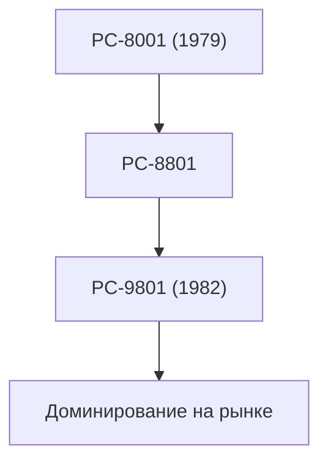

## 1. Рождение Nippon Electric
В 1899 году в качестве совместного предприятия с Western Electric была создана первая в Японии компания с иностранным капиталом. Она начинала с производства телефонов и оборудования для связи.

## 2. Золотой век серии PC-9800
В период с 1980-х по 1990-е годы серия "PC-98" полностью доминировала на японском рынке персональных компьютеров. Ее сильной стороной была аппаратная архитектура, специализирующаяся на обработке японского языка.

## 3. C&C (Интеграция компьютеров и связи)
Концепция "C&C (Computer and Communication)", предложенная президентом Кодзи Кобаяси в 1977 году, в полной мере предвосхитила будущее интернет-общество.

## 4. Современная биометрия и космический бизнес
Сегодня компания отделила свой бизнес по производству ПК и сосредоточилась на создании социальной инфраструктуры, включая технологии распознавания лиц мирового класса, подводные кабели и искусственные спутники (например, проект "Хаябуса").

## Дополнительная техническая проверка, часть 1

## Дополнительная техническая проверка, часть 2

## Дополнительная техническая проверка, часть 3

## Дополнительная техническая проверка, часть 4

## Дополнительная техническая проверка, часть 5

## Дополнительная техническая проверка, часть 6

## Дополнительная техническая проверка, часть 7

## Дополнительная техническая проверка, часть 8

## Дополнительная техническая проверка, часть 9

## Дополнительная техническая проверка, часть 10

## Дополнительная техническая проверка, часть 11

## Дополнительная техническая проверка, часть 12

## Дополнительная техническая проверка, часть 13

## Дополнительная техническая проверка, часть 14

