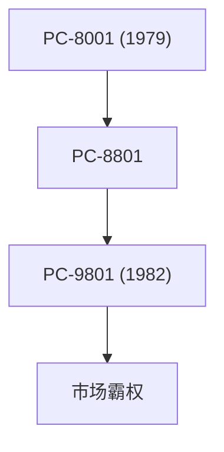

## 1. 日本电气的诞生
1899年，通过与西部电气合资，作为日本首家外资合资企业诞生。从制造电话机和通信设备起步。

## 2. PC-9800系列的黄金时代
在1980年代到90年代期间，“PC-98”系列完全席卷了日本的个人电脑市场。专注于日语处理的硬件架构是其优势。

## 3. C&C（计算机与通信的融合）
1977年小林宏治社长提出的“C&C（Computer and Communication）”愿景，完全预见了后来的互联网社会。

## 4. 现在的生物识别与宇宙事业
如今已剥离了PC业务，正致力于世界顶级的面部识别技术、海底电缆、人造卫星（如“隼鸟号”项目等）等社会基础设施事业。

## 附加技术验证部分 1

### 1. 日本电气的诞生
1899年，通过与西部电气合资，作为日本首家外资合资企业诞生。从制造电话机和通信设备起步。

## 附加技术验证部分 2

### 1. 日本电气的诞生
1899年，通过与西部电气合资，作为日本首家外资合资企业诞生。从制造电话机和通信设备起步。

## 附加技术验证部分 3

### 1. 日本电气的诞生
1899年，通过与西部电气合资，作为日本首家外资合资企业诞生。从制造电话机和通信设备起步。

## 附加技术验证部分 4

### 1. 日本电气的诞生
1899年，通过与西部电气合资，作为日本首家外资合资企业诞生。从制造电话机和通信设备起步。

## 附加技术验证部分 5

### 1. 日本电气的诞生
1899年，通过与西部电气合资，作为日本首家外资合资企业诞生。从制造电话机和通信设备起步。

## 附加技术验证部分 6

### 1. 日本电气的诞生
1899年，通过与西部电气合资，作为日本首家外资合资企业诞生。从制造电话机和通信设备起步。

## 附加技术验证部分 7

### 1. 日本电气的诞生
1899年，通过与西部电气合资，作为日本首家外资合资企业诞生。从制造电话机和通信设备起步。

## 附加技术验证部分 8

### 1. 日本电气的诞生
1899年，通过与西部电气合资，作为日本首家外资合资企业诞生。从制造电话机和通信设备起步。

## 附加技术验证部分 9

### 1. 日本电气的诞生
1899年，通过与西部电气合资，作为日本首家外资合资企业诞生。从制造电话机和通信设备起步。

## 附加技术验证部分 10

### 1. 日本电气的诞生
1899年，通过与西部电气合资，作为日本首家外资合资企业诞生。从制造电话机和通信设备起步。

## 附加技术验证部分 11

### 1. 日本电气的诞生
1899年，通过与西部电气合资，作为日本首家外资合资企业诞生。从制造电话机和通信设备起步。

## 附加技术验证部分 12

### 1. 日本电气的诞生
1899年，通过与西部电气合资，作为日本首家外资合资企业诞生。从制造电话机和通信设备起步。

## 附加技术验证部分 13

### 1. 日本电气的诞生
1899年，通过与西部电气合资，作为日本首家外资合资企业诞生。从制造电话机和通信设备起步。

## 附加技术验证部分 14

### 1. 日本电气的诞生
1899年，通过与西部电气合资，作为日本首家外资合资企业诞生。从制造电话机和通信设备起步。

