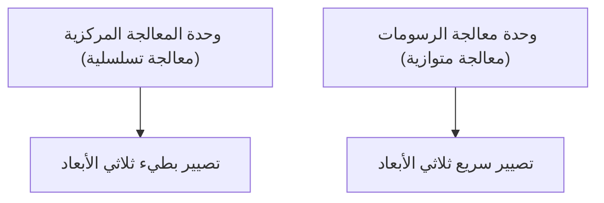

## 1. التأسيس وفجر الرسومات ثلاثية الأبعاد
تأسست في عام 1993 على يد جنسن هوانغ وآخرين. بدأت بتطوير رقائق (GPU) متخصصة في معالجة الرسومات ثلاثية الأبعاد لألعاب الكمبيوتر.

## 2. ولادة CUDA
كانت منصة "CUDA" التي أُعلن عنها في عام 2006 منصة ثورية أتاحت استخدام وحدات معالجة الرسومات ليس فقط للرسومات بل أيضاً للحوسبة العامة (GPGPU). وهذا ما مهد الطريق لطفرة الذكاء الاصطناعي اللاحقة.

## 3. ثورة التعلم العميق
في مسابقة ImageNet لعام 2012، حقق نموذج التعلم العميق "AlexNet" الذي استخدم وحدات معالجة الرسومات فوزاً ساحقاً. وبسبب هذا، بدأ باحثو الذكاء الاصطناعي في السعي للحصول على وحدات معالجة الرسومات من NVIDIA بكثافة.

## 4. نحو قلب الذكاء الاصطناعي
حاليًا، يتم تدريب واستنتاج جميع نماذج اللغات الكبيرة (LLMs) الضخمة مثل ChatGPT على عشرات الآلاف من وحدات معالجة الرسومات من NVIDIA (مثل A100 و H100). تحولت NVIDIA إلى شركة عملاقة من الطراز الأول في القيمة السوقية كشركة بنية تحتية لعصر الذكاء الاصطناعي.

## جزء التحقق التقني الإضافي 1

## جزء التحقق التقني الإضافي 2

## جزء التحقق التقني الإضافي 3

## جزء التحقق التقني الإضافي 4

## جزء التحقق التقني الإضافي 5

## جزء التحقق التقني الإضافي 6

## جزء التحقق التقني الإضافي 7

## جزء التحقق التقني الإضافي 8

## جزء التحقق التقني الإضافي 9

## جزء التحقق التقني الإضافي 10

## جزء التحقق التقني الإضافي 11

## جزء التحقق التقني الإضافي 12

## جزء التحقق التقني الإضافي 13

## جزء التحقق التقني الإضافي 14

