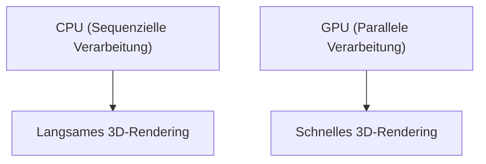

## 1. Gründung und Anbruch der 3D-Grafik
Gegründet 1993 von Jensen Huang und anderen. Das Unternehmen startete mit der Entwicklung von Chips (GPUs), die auf die 3D-Grafikverarbeitung für PC-Spiele spezialisiert waren.

## 2. Die Geburt von CUDA
Die 2006 angekündigte Plattform „CUDA“ war bahnbrechend, da sie es ermöglichte, GPUs nicht nur für Grafiken, sondern auch für allgemeine Berechnungen (GPGPU) zu nutzen. Dies legte den Grundstein für den späteren KI-Boom.

## 3. Die Deep-Learning-Revolution
Beim ImageNet-Wettbewerb 2012 errang das Deep-Learning-Modell „AlexNet“, das GPUs nutzte, einen Erdrutschsieg. Dies führte dazu, dass KI-Forscher massenhaft nach GPUs von NVIDIA verlangten.

## 4. Zum Herzstück der KI
Heute werden riesige LLMs wie ChatGPT allesamt auf Zehntausenden von NVIDIA-GPUs (wie A100 und H100) trainiert und für Inferenzen genutzt. NVIDIA hat sich zu einem Infrastrukturunternehmen des KI-Zeitalters gewandelt und gehört in Bezug auf die Marktkapitalisierung zur absoluten Weltspitze.

## Zusätzlicher Technik-Validierungsteil 1

## Zusätzlicher Technik-Validierungsteil 2

## Zusätzlicher Technik-Validierungsteil 3

## Zusätzlicher Technik-Validierungsteil 4

## Zusätzlicher Technik-Validierungsteil 5

## Zusätzlicher Technik-Validierungsteil 6

## Zusätzlicher Technik-Validierungsteil 7

## Zusätzlicher Technik-Validierungsteil 8

## Zusätzlicher Technik-Validierungsteil 9

## Zusätzlicher Technik-Validierungsteil 10

## Zusätzlicher Technik-Validierungsteil 11

## Zusätzlicher Technik-Validierungsteil 12

## Zusätzlicher Technik-Validierungsteil 13

## Zusätzlicher Technik-Validierungsteil 14

