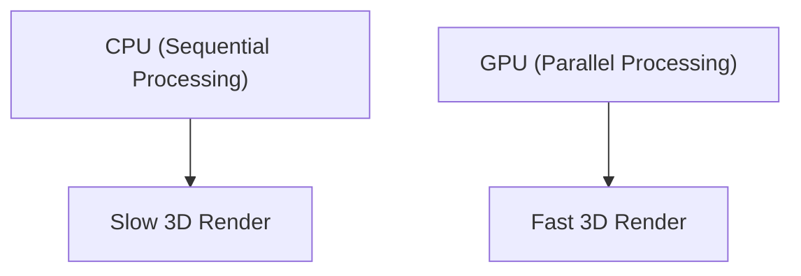

## 1. Founding and the Dawn of 3D Graphics
Founded in 1993 by Jensen Huang and others. It started with the development of chips (GPUs) specialized in 3D graphics processing for PC games.

## 2. The Birth of CUDA
Announced in 2006, "CUDA" was an epoch-making platform that made it possible to use GPUs not only for graphics but also for general-purpose computing (GPGPU). This laid the groundwork for the subsequent AI boom.

## 3. The Deep Learning Revolution
In the 2012 ImageNet contest, "AlexNet", a deep learning model using GPUs, won a landslide victory. This triggered AI researchers to eagerly seek out NVIDIA GPUs.

## 4. To the Heart of AI
Currently, huge LLMs like ChatGPT are entirely trained and inferred on tens of thousands of NVIDIA GPUs (A100 and H100). NVIDIA has transformed into one of the top companies by market capitalization as an infrastructure company in the AI era.

## Additional Technical Verification Part 1

### 1. Founding and the Dawn of 3D Graphics
Founded in 1993 by Jensen Huang and others. It started with the development of chips (GPUs) specialized in 3D graphics processing for PC games.

### 2. The Birth of CUDA
Announced in 2006, "CUDA" was an epoch-making platform that made it possible to use GPUs not only for graphics but also for general-purpose computing (GPGPU). This laid the groundwork for the subsequent AI boom.

### 3. The Deep Learning Revolution
In the 2012 ImageNet contest, "AlexNet", a deep learning model using GPUs, won a landslide victory. This triggered AI researchers to eagerly seek out NVIDIA GPUs.

### 4. To the Heart of AI
Currently, huge LLMs like ChatGPT are entirely trained and inferred on tens of thousands of NVIDIA GPUs (A100 and H100). NVIDIA has transformed into one of the top companies by market capitalization as an infrastructure company in the AI era.

## Additional Technical Verification Part 2

### 1. Founding and the Dawn of 3D Graphics
Founded in 1993 by Jensen Huang and others. It started with the development of chips (GPUs) specialized in 3D graphics processing for PC games.

### 2. The Birth of CUDA
Announced in 2006, "CUDA" was an epoch-making platform that made it possible to use GPUs not only for graphics but also for general-purpose computing (GPGPU). This laid the groundwork for the subsequent AI boom.

### 3. The Deep Learning Revolution
In the 2012 ImageNet contest, "AlexNet", a deep learning model using GPUs, won a landslide victory. This triggered AI researchers to eagerly seek out NVIDIA GPUs.

### 4. To the Heart of AI
Currently, huge LLMs like ChatGPT are entirely trained and inferred on tens of thousands of NVIDIA GPUs (A100 and H100). NVIDIA has transformed into one of the top companies by market capitalization as an infrastructure company in the AI era.

## Additional Technical Verification Part 3

### 1. Founding and the Dawn of 3D Graphics
Founded in 1993 by Jensen Huang and others. It started with the development of chips (GPUs) specialized in 3D graphics processing for PC games.

### 2. The Birth of CUDA
Announced in 2006, "CUDA" was an epoch-making platform that made it possible to use GPUs not only for graphics but also for general-purpose computing (GPGPU). This laid the groundwork for the subsequent AI boom.

### 3. The Deep Learning Revolution
In the 2012 ImageNet contest, "AlexNet", a deep learning model using GPUs, won a landslide victory. This triggered AI researchers to eagerly seek out NVIDIA GPUs.

### 4. To the Heart of AI
Currently, huge LLMs like ChatGPT are entirely trained and inferred on tens of thousands of NVIDIA GPUs (A100 and H100). NVIDIA has transformed into one of the top companies by market capitalization as an infrastructure company in the AI era.

## Additional Technical Verification Part 4

### 1. Founding and the Dawn of 3D Graphics
Founded in 1993 by Jensen Huang and others. It started with the development of chips (GPUs) specialized in 3D graphics processing for PC games.

### 2. The Birth of CUDA
Announced in 2006, "CUDA" was an epoch-making platform that made it possible to use GPUs not only for graphics but also for general-purpose computing (GPGPU). This laid the groundwork for the subsequent AI boom.

### 3. The Deep Learning Revolution
In the 2012 ImageNet contest, "AlexNet", a deep learning model using GPUs, won a landslide victory. This triggered AI researchers to eagerly seek out NVIDIA GPUs.

### 4. To the Heart of AI
Currently, huge LLMs like ChatGPT are entirely trained and inferred on tens of thousands of NVIDIA GPUs (A100 and H100). NVIDIA has transformed into one of the top companies by market capitalization as an infrastructure company in the AI era.

## Additional Technical Verification Part 5

### 1. Founding and the Dawn of 3D Graphics
Founded in 1993 by Jensen Huang and others. It started with the development of chips (GPUs) specialized in 3D graphics processing for PC games.

### 2. The Birth of CUDA
Announced in 2006, "CUDA" was an epoch-making platform that made it possible to use GPUs not only for graphics but also for general-purpose computing (GPGPU). This laid the groundwork for the subsequent AI boom.

### 3. The Deep Learning Revolution
In the 2012 ImageNet contest, "AlexNet", a deep learning model using GPUs, won a landslide victory. This triggered AI researchers to eagerly seek out NVIDIA GPUs.

### 4. To the Heart of AI
Currently, huge LLMs like ChatGPT are entirely trained and inferred on tens of thousands of NVIDIA GPUs (A100 and H100). NVIDIA has transformed into one of the top companies by market capitalization as an infrastructure company in the AI era.

## Additional Technical Verification Part 6

### 1. Founding and the Dawn of 3D Graphics
Founded in 1993 by Jensen Huang and others. It started with the development of chips (GPUs) specialized in 3D graphics processing for PC games.

### 2. The Birth of CUDA
Announced in 2006, "CUDA" was an epoch-making platform that made it possible to use GPUs not only for graphics but also for general-purpose computing (GPGPU). This laid the groundwork for the subsequent AI boom.

### 3. The Deep Learning Revolution
In the 2012 ImageNet contest, "AlexNet", a deep learning model using GPUs, won a landslide victory. This triggered AI researchers to eagerly seek out NVIDIA GPUs.

### 4. To the Heart of AI
Currently, huge LLMs like ChatGPT are entirely trained and inferred on tens of thousands of NVIDIA GPUs (A100 and H100). NVIDIA has transformed into one of the top companies by market capitalization as an infrastructure company in the AI era.

## Additional Technical Verification Part 7

### 1. Founding and the Dawn of 3D Graphics
Founded in 1993 by Jensen Huang and others. It started with the development of chips (GPUs) specialized in 3D graphics processing for PC games.

### 2. The Birth of CUDA
Announced in 2006, "CUDA" was an epoch-making platform that made it possible to use GPUs not only for graphics but also for general-purpose computing (GPGPU). This laid the groundwork for the subsequent AI boom.

### 3. The Deep Learning Revolution
In the 2012 ImageNet contest, "AlexNet", a deep learning model using GPUs, won a landslide victory. This triggered AI researchers to eagerly seek out NVIDIA GPUs.

### 4. To the Heart of AI
Currently, huge LLMs like ChatGPT are entirely trained and inferred on tens of thousands of NVIDIA GPUs (A100 and H100). NVIDIA has transformed into one of the top companies by market capitalization as an infrastructure company in the AI era.

## Additional Technical Verification Part 8

### 1. Founding and the Dawn of 3D Graphics
Founded in 1993 by Jensen Huang and others. It started with the development of chips (GPUs) specialized in 3D graphics processing for PC games.

### 2. The Birth of CUDA
Announced in 2006, "CUDA" was an epoch-making platform that made it possible to use GPUs not only for graphics but also for general-purpose computing (GPGPU). This laid the groundwork for the subsequent AI boom.

### 3. The Deep Learning Revolution
In the 2012 ImageNet contest, "AlexNet", a deep learning model using GPUs, won a landslide victory. This triggered AI researchers to eagerly seek out NVIDIA GPUs.

### 4. To the Heart of AI
Currently, huge LLMs like ChatGPT are entirely trained and inferred on tens of thousands of NVIDIA GPUs (A100 and H100). NVIDIA has transformed into one of the top companies by market capitalization as an infrastructure company in the AI era.

## Additional Technical Verification Part 9

### 1. Founding and the Dawn of 3D Graphics
Founded in 1993 by Jensen Huang and others. It started with the development of chips (GPUs) specialized in 3D graphics processing for PC games.

### 2. The Birth of CUDA
Announced in 2006, "CUDA" was an epoch-making platform that made it possible to use GPUs not only for graphics but also for general-purpose computing (GPGPU). This laid the groundwork for the subsequent AI boom.

### 3. The Deep Learning Revolution
In the 2012 ImageNet contest, "AlexNet", a deep learning model using GPUs, won a landslide victory. This triggered AI researchers to eagerly seek out NVIDIA GPUs.

### 4. To the Heart of AI
Currently, huge LLMs like ChatGPT are entirely trained and inferred on tens of thousands of NVIDIA GPUs (A100 and H100). NVIDIA has transformed into one of the top companies by market capitalization as an infrastructure company in the AI era.

## Additional Technical Verification Part 10

### 1. Founding and the Dawn of 3D Graphics
Founded in 1993 by Jensen Huang and others. It started with the development of chips (GPUs) specialized in 3D graphics processing for PC games.

### 2. The Birth of CUDA
Announced in 2006, "CUDA" was an epoch-making platform that made it possible to use GPUs not only for graphics but also for general-purpose computing (GPGPU). This laid the groundwork for the subsequent AI boom.

### 3. The Deep Learning Revolution
In the 2012 ImageNet contest, "AlexNet", a deep learning model using GPUs, won a landslide victory. This triggered AI researchers to eagerly seek out NVIDIA GPUs.

### 4. To the Heart of AI
Currently, huge LLMs like ChatGPT are entirely trained and inferred on tens of thousands of NVIDIA GPUs (A100 and H100). NVIDIA has transformed into one of the top companies by market capitalization as an infrastructure company in the AI era.

## Additional Technical Verification Part 11

### 1. Founding and the Dawn of 3D Graphics
Founded in 1993 by Jensen Huang and others. It started with the development of chips (GPUs) specialized in 3D graphics processing for PC games.

### 2. The Birth of CUDA
Announced in 2006, "CUDA" was an epoch-making platform that made it possible to use GPUs not only for graphics but also for general-purpose computing (GPGPU). This laid the groundwork for the subsequent AI boom.

### 3. The Deep Learning Revolution
In the 2012 ImageNet contest, "AlexNet", a deep learning model using GPUs, won a landslide victory. This triggered AI researchers to eagerly seek out NVIDIA GPUs.

### 4. To the Heart of AI
Currently, huge LLMs like ChatGPT are entirely trained and inferred on tens of thousands of NVIDIA GPUs (A100 and H100). NVIDIA has transformed into one of the top companies by market capitalization as an infrastructure company in the AI era.

## Additional Technical Verification Part 12

### 1. Founding and the Dawn of 3D Graphics
Founded in 1993 by Jensen Huang and others. It started with the development of chips (GPUs) specialized in 3D graphics processing for PC games.

### 2. The Birth of CUDA
Announced in 2006, "CUDA" was an epoch-making platform that made it possible to use GPUs not only for graphics but also for general-purpose computing (GPGPU). This laid the groundwork for the subsequent AI boom.

### 3. The Deep Learning Revolution
In the 2012 ImageNet contest, "AlexNet", a deep learning model using GPUs, won a landslide victory. This triggered AI researchers to eagerly seek out NVIDIA GPUs.

### 4. To the Heart of AI
Currently, huge LLMs like ChatGPT are entirely trained and inferred on tens of thousands of NVIDIA GPUs (A100 and H100). NVIDIA has transformed into one of the top companies by market capitalization as an infrastructure company in the AI era.

## Additional Technical Verification Part 13

### 1. Founding and the Dawn of 3D Graphics
Founded in 1993 by Jensen Huang and others. It started with the development of chips (GPUs) specialized in 3D graphics processing for PC games.

### 2. The Birth of CUDA
Announced in 2006, "CUDA" was an epoch-making platform that made it possible to use GPUs not only for graphics but also for general-purpose computing (GPGPU). This laid the groundwork for the subsequent AI boom.

### 3. The Deep Learning Revolution
In the 2012 ImageNet contest, "AlexNet", a deep learning model using GPUs, won a landslide victory. This triggered AI researchers to eagerly seek out NVIDIA GPUs.

### 4. To the Heart of AI
Currently, huge LLMs like ChatGPT are entirely trained and inferred on tens of thousands of NVIDIA GPUs (A100 and H100). NVIDIA has transformed into one of the top companies by market capitalization as an infrastructure company in the AI era.

## Additional Technical Verification Part 14

### 1. Founding and the Dawn of 3D Graphics
Founded in 1993 by Jensen Huang and others. It started with the development of chips (GPUs) specialized in 3D graphics processing for PC games.

### 2. The Birth of CUDA
Announced in 2006, "CUDA" was an epoch-making platform that made it possible to use GPUs not only for graphics but also for general-purpose computing (GPGPU). This laid the groundwork for the subsequent AI boom.

### 3. The Deep Learning Revolution
In the 2012 ImageNet contest, "AlexNet", a deep learning model using GPUs, won a landslide victory. This triggered AI researchers to eagerly seek out NVIDIA GPUs.

### 4. To the Heart of AI
Currently, huge LLMs like ChatGPT are entirely trained and inferred on tens of thousands of NVIDIA GPUs (A100 and H100). NVIDIA has transformed into one of the top companies by market capitalization as an infrastructure company in the AI era.
