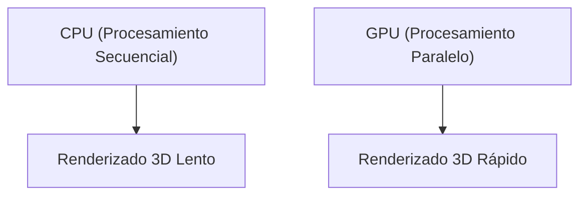

## 1. Fundación y el amanecer de los gráficos 3D
Fundada en 1993 por Jensen Huang y otros. Comenzó con el desarrollo de chips (GPU) especializados en el procesamiento de gráficos 3D para juegos de PC.

## 2. El nacimiento de CUDA
"CUDA", anunciado en 2006, fue una plataforma revolucionaria que permitió utilizar la GPU no solo para gráficos, sino también para cálculos de propósito general (GPGPU). Esto sentó las bases para el posterior boom de la IA.

## 3. La revolución del aprendizaje profundo
En el concurso ImageNet de 2012, el modelo de aprendizaje profundo "AlexNet", que utilizaba GPUs, obtuvo una victoria aplastante. A partir de entonces, los investigadores de IA comenzaron a demandar masivamente las GPUs de NVIDIA.

## 4. Hacia el corazón de la IA
Actualmente, todos los grandes LLM, como ChatGPT, se entrenan e infieren en decenas de miles de GPUs de NVIDIA (A100 y H100). NVIDIA se ha transformado en una empresa de infraestructura de la era de la IA, alcanzando uno de los niveles más altos de capitalización bursátil.

## Parte de verificación técnica adicional 1

### 1. Fundación y el amanecer de los gráficos 3D
Fundada en 1993 por Jensen Huang y otros. Comenzó con el desarrollo de chips (GPU) especializados en el procesamiento de gráficos 3D para juegos de PC.

### 2. El nacimiento de CUDA
"CUDA", anunciado en 2006, fue una plataforma revolucionaria que permitió utilizar la GPU no solo para gráficos, sino también para cálculos de propósito general (GPGPU). Esto sentó las bases para el posterior boom de la IA.

### 3. La revolución del aprendizaje profundo
En el concurso ImageNet de 2012, el modelo de aprendizaje profundo "AlexNet", que utilizaba GPUs, obtuvo una victoria aplastante. A partir de entonces, los investigadores de IA comenzaron a demandar masivamente las GPUs de NVIDIA.

### 4. Hacia el corazón de la IA
Actualmente, todos los grandes LLM, como ChatGPT, se entrenan e infieren en decenas de miles de GPUs de NVIDIA (A100 y H100). NVIDIA se ha transformado en una empresa de infraestructura de la era de la IA, alcanzando uno de los niveles más altos de capitalización bursátil.

## Parte de verificación técnica adicional 2

### 1. Fundación y el amanecer de los gráficos 3D
Fundada en 1993 por Jensen Huang y otros. Comenzó con el desarrollo de chips (GPU) especializados en el procesamiento de gráficos 3D para juegos de PC.

### 2. El nacimiento de CUDA
"CUDA", anunciado en 2006, fue una plataforma revolucionaria que permitió utilizar la GPU no solo para gráficos, sino también para cálculos de propósito general (GPGPU). Esto sentó las bases para el posterior boom de la IA.

### 3. La revolución del aprendizaje profundo
En el concurso ImageNet de 2012, el modelo de aprendizaje profundo "AlexNet", que utilizaba GPUs, obtuvo una victoria aplastante. A partir de entonces, los investigadores de IA comenzaron a demandar masivamente las GPUs de NVIDIA.

### 4. Hacia el corazón de la IA
Actualmente, todos los grandes LLM, como ChatGPT, se entrenan e infieren en decenas de miles de GPUs de NVIDIA (A100 y H100). NVIDIA se ha transformado en una empresa de infraestructura de la era de la IA, alcanzando uno de los niveles más altos de capitalización bursátil.

## Parte de verificación técnica adicional 3

### 1. Fundación y el amanecer de los gráficos 3D
Fundada en 1993 por Jensen Huang y otros. Comenzó con el desarrollo de chips (GPU) especializados en el procesamiento de gráficos 3D para juegos de PC.

### 2. El nacimiento de CUDA
"CUDA", anunciado en 2006, fue una plataforma revolucionaria que permitió utilizar la GPU no solo para gráficos, sino también para cálculos de propósito general (GPGPU). Esto sentó las bases para el posterior boom de la IA.

### 3. La revolución del aprendizaje profundo
En el concurso ImageNet de 2012, el modelo de aprendizaje profundo "AlexNet", que utilizaba GPUs, obtuvo una victoria aplastante. A partir de entonces, los investigadores de IA comenzaron a demandar masivamente las GPUs de NVIDIA.

### 4. Hacia el corazón de la IA
Actualmente, todos los grandes LLM, como ChatGPT, se entrenan e infieren en decenas de miles de GPUs de NVIDIA (A100 y H100). NVIDIA se ha transformado en una empresa de infraestructura de la era de la IA, alcanzando uno de los niveles más altos de capitalización bursátil.

## Parte de verificación técnica adicional 4

### 1. Fundación y el amanecer de los gráficos 3D
Fundada en 1993 por Jensen Huang y otros. Comenzó con el desarrollo de chips (GPU) especializados en el procesamiento de gráficos 3D para juegos de PC.

### 2. El nacimiento de CUDA
"CUDA", anunciado en 2006, fue una plataforma revolucionaria que permitió utilizar la GPU no solo para gráficos, sino también para cálculos de propósito general (GPGPU). Esto sentó las bases para el posterior boom de la IA.

### 3. La revolución del aprendizaje profundo
En el concurso ImageNet de 2012, el modelo de aprendizaje profundo "AlexNet", que utilizaba GPUs, obtuvo una victoria aplastante. A partir de entonces, los investigadores de IA comenzaron a demandar masivamente las GPUs de NVIDIA.

### 4. Hacia el corazón de la IA
Actualmente, todos los grandes LLM, como ChatGPT, se entrenan e infieren en decenas de miles de GPUs de NVIDIA (A100 y H100). NVIDIA se ha transformado en una empresa de infraestructura de la era de la IA, alcanzando uno de los niveles más altos de capitalización bursátil.

## Parte de verificación técnica adicional 5

### 1. Fundación y el amanecer de los gráficos 3D
Fundada en 1993 por Jensen Huang y otros. Comenzó con el desarrollo de chips (GPU) especializados en el procesamiento de gráficos 3D para juegos de PC.

### 2. El nacimiento de CUDA
"CUDA", anunciado en 2006, fue una plataforma revolucionaria que permitió utilizar la GPU no solo para gráficos, sino también para cálculos de propósito general (GPGPU). Esto sentó las bases para el posterior boom de la IA.

### 3. La revolución del aprendizaje profundo
En el concurso ImageNet de 2012, el modelo de aprendizaje profundo "AlexNet", que utilizaba GPUs, obtuvo una victoria aplastante. A partir de entonces, los investigadores de IA comenzaron a demandar masivamente las GPUs de NVIDIA.

### 4. Hacia el corazón de la IA
Actualmente, todos los grandes LLM, como ChatGPT, se entrenan e infieren en decenas de miles de GPUs de NVIDIA (A100 y H100). NVIDIA se ha transformado en una empresa de infraestructura de la era de la IA, alcanzando uno de los niveles más altos de capitalización bursátil.

## Parte de verificación técnica adicional 6

### 1. Fundación y el amanecer de los gráficos 3D
Fundada en 1993 por Jensen Huang y otros. Comenzó con el desarrollo de chips (GPU) especializados en el procesamiento de gráficos 3D para juegos de PC.

### 2. El nacimiento de CUDA
"CUDA", anunciado en 2006, fue una plataforma revolucionaria que permitió utilizar la GPU no solo para gráficos, sino también para cálculos de propósito general (GPGPU). Esto sentó las bases para el posterior boom de la IA.

### 3. La revolución del aprendizaje profundo
En el concurso ImageNet de 2012, el modelo de aprendizaje profundo "AlexNet", que utilizaba GPUs, obtuvo una victoria aplastante. A partir de entonces, los investigadores de IA comenzaron a demandar masivamente las GPUs de NVIDIA.

### 4. Hacia el corazón de la IA
Actualmente, todos los grandes LLM, como ChatGPT, se entrenan e infieren en decenas de miles de GPUs de NVIDIA (A100 y H100). NVIDIA se ha transformado en una empresa de infraestructura de la era de la IA, alcanzando uno de los niveles más altos de capitalización bursátil.

## Parte de verificación técnica adicional 7

### 1. Fundación y el amanecer de los gráficos 3D
Fundada en 1993 por Jensen Huang y otros. Comenzó con el desarrollo de chips (GPU) especializados en el procesamiento de gráficos 3D para juegos de PC.

### 2. El nacimiento de CUDA
"CUDA", anunciado en 2006, fue una plataforma revolucionaria que permitió utilizar la GPU no solo para gráficos, sino también para cálculos de propósito general (GPGPU). Esto sentó las bases para el posterior boom de la IA.

### 3. La revolución del aprendizaje profundo
En el concurso ImageNet de 2012, el modelo de aprendizaje profundo "AlexNet", que utilizaba GPUs, obtuvo una victoria aplastante. A partir de entonces, los investigadores de IA comenzaron a demandar masivamente las GPUs de NVIDIA.

### 4. Hacia el corazón de la IA
Actualmente, todos los grandes LLM, como ChatGPT, se entrenan e infieren en decenas de miles de GPUs de NVIDIA (A100 y H100). NVIDIA se ha transformado en una empresa de infraestructura de la era de la IA, alcanzando uno de los niveles más altos de capitalización bursátil.

## Parte de verificación técnica adicional 8

### 1. Fundación y el amanecer de los gráficos 3D
Fundada en 1993 por Jensen Huang y otros. Comenzó con el desarrollo de chips (GPU) especializados en el procesamiento de gráficos 3D para juegos de PC.

### 2. El nacimiento de CUDA
"CUDA", anunciado en 2006, fue una plataforma revolucionaria que permitió utilizar la GPU no solo para gráficos, sino también para cálculos de propósito general (GPGPU). Esto sentó las bases para el posterior boom de la IA.

### 3. La revolución del aprendizaje profundo
En el concurso ImageNet de 2012, el modelo de aprendizaje profundo "AlexNet", que utilizaba GPUs, obtuvo una victoria aplastante. A partir de entonces, los investigadores de IA comenzaron a demandar masivamente las GPUs de NVIDIA.

### 4. Hacia el corazón de la IA
Actualmente, todos los grandes LLM, como ChatGPT, se entrenan e infieren en decenas de miles de GPUs de NVIDIA (A100 y H100). NVIDIA se ha transformado en una empresa de infraestructura de la era de la IA, alcanzando uno de los niveles más altos de capitalización bursátil.

## Parte de verificación técnica adicional 9

### 1. Fundación y el amanecer de los gráficos 3D
Fundada en 1993 por Jensen Huang y otros. Comenzó con el desarrollo de chips (GPU) especializados en el procesamiento de gráficos 3D para juegos de PC.

### 2. El nacimiento de CUDA
"CUDA", anunciado en 2006, fue una plataforma revolucionaria que permitió utilizar la GPU no solo para gráficos, sino también para cálculos de propósito general (GPGPU). Esto sentó las bases para el posterior boom de la IA.

### 3. La revolución del aprendizaje profundo
En el concurso ImageNet de 2012, el modelo de aprendizaje profundo "AlexNet", que utilizaba GPUs, obtuvo una victoria aplastante. A partir de entonces, los investigadores de IA comenzaron a demandar masivamente las GPUs de NVIDIA.

### 4. Hacia el corazón de la IA
Actualmente, todos los grandes LLM, como ChatGPT, se entrenan e infieren en decenas de miles de GPUs de NVIDIA (A100 y H100). NVIDIA se ha transformado en una empresa de infraestructura de la era de la IA, alcanzando uno de los niveles más altos de capitalización bursátil.

## Parte de verificación técnica adicional 10

### 1. Fundación y el amanecer de los gráficos 3D
Fundada en 1993 por Jensen Huang y otros. Comenzó con el desarrollo de chips (GPU) especializados en el procesamiento de gráficos 3D para juegos de PC.

### 2. El nacimiento de CUDA
"CUDA", anunciado en 2006, fue una plataforma revolucionaria que permitió utilizar la GPU no solo para gráficos, sino también para cálculos de propósito general (GPGPU). Esto sentó las bases para el posterior boom de la IA.

### 3. La revolución del aprendizaje profundo
En el concurso ImageNet de 2012, el modelo de aprendizaje profundo "AlexNet", que utilizaba GPUs, obtuvo una victoria aplastante. A partir de entonces, los investigadores de IA comenzaron a demandar masivamente las GPUs de NVIDIA.

### 4. Hacia el corazón de la IA
Actualmente, todos los grandes LLM, como ChatGPT, se entrenan e infieren en decenas de miles de GPUs de NVIDIA (A100 y H100). NVIDIA se ha transformado en una empresa de infraestructura de la era de la IA, alcanzando uno de los niveles más altos de capitalización bursátil.

## Parte de verificación técnica adicional 11

### 1. Fundación y el amanecer de los gráficos 3D
Fundada en 1993 por Jensen Huang y otros. Comenzó con el desarrollo de chips (GPU) especializados en el procesamiento de gráficos 3D para juegos de PC.

### 2. El nacimiento de CUDA
"CUDA", anunciado en 2006, fue una plataforma revolucionaria que permitió utilizar la GPU no solo para gráficos, sino también para cálculos de propósito general (GPGPU). Esto sentó las bases para el posterior boom de la IA.

### 3. La revolución del aprendizaje profundo
En el concurso ImageNet de 2012, el modelo de aprendizaje profundo "AlexNet", que utilizaba GPUs, obtuvo una victoria aplastante. A partir de entonces, los investigadores de IA comenzaron a demandar masivamente las GPUs de NVIDIA.

### 4. Hacia el corazón de la IA
Actualmente, todos los grandes LLM, como ChatGPT, se entrenan e infieren en decenas de miles de GPUs de NVIDIA (A100 y H100). NVIDIA se ha transformado en una empresa de infraestructura de la era de la IA, alcanzando uno de los niveles más altos de capitalización bursátil.

## Parte de verificación técnica adicional 12

### 1. Fundación y el amanecer de los gráficos 3D
Fundada en 1993 por Jensen Huang y otros. Comenzó con el desarrollo de chips (GPU) especializados en el procesamiento de gráficos 3D para juegos de PC.

### 2. El nacimiento de CUDA
"CUDA", anunciado en 2006, fue una plataforma revolucionaria que permitió utilizar la GPU no solo para gráficos, sino también para cálculos de propósito general (GPGPU). Esto sentó las bases para el posterior boom de la IA.

### 3. La revolución del aprendizaje profundo
En el concurso ImageNet de 2012, el modelo de aprendizaje profundo "AlexNet", que utilizaba GPUs, obtuvo una victoria aplastante. A partir de entonces, los investigadores de IA comenzaron a demandar masivamente las GPUs de NVIDIA.

### 4. Hacia el corazón de la IA
Actualmente, todos los grandes LLM, como ChatGPT, se entrenan e infieren en decenas de miles de GPUs de NVIDIA (A100 y H100). NVIDIA se ha transformado en una empresa de infraestructura de la era de la IA, alcanzando uno de los niveles más altos de capitalización bursátil.

## Parte de verificación técnica adicional 13

### 1. Fundación y el amanecer de los gráficos 3D
Fundada en 1993 por Jensen Huang y otros. Comenzó con el desarrollo de chips (GPU) especializados en el procesamiento de gráficos 3D para juegos de PC.

### 2. El nacimiento de CUDA
"CUDA", anunciado en 2006, fue una plataforma revolucionaria que permitió utilizar la GPU no solo para gráficos, sino también para cálculos de propósito general (GPGPU). Esto sentó las bases para el posterior boom de la IA.

### 3. La revolución del aprendizaje profundo
En el concurso ImageNet de 2012, el modelo de aprendizaje profundo "AlexNet", que utilizaba GPUs, obtuvo una victoria aplastante. A partir de entonces, los investigadores de IA comenzaron a demandar masivamente las GPUs de NVIDIA.

### 4. Hacia el corazón de la IA
Actualmente, todos los grandes LLM, como ChatGPT, se entrenan e infieren en decenas de miles de GPUs de NVIDIA (A100 y H100). NVIDIA se ha transformado en una empresa de infraestructura de la era de la IA, alcanzando uno de los niveles más altos de capitalización bursátil.

## Parte de verificación técnica adicional 14

### 1. Fundación y el amanecer de los gráficos 3D
Fundada en 1993 por Jensen Huang y otros. Comenzó con el desarrollo de chips (GPU) especializados en el procesamiento de gráficos 3D para juegos de PC.

### 2. El nacimiento de CUDA
"CUDA", anunciado en 2006, fue una plataforma revolucionaria que permitió utilizar la GPU no solo para gráficos, sino también para cálculos de propósito general (GPGPU). Esto sentó las bases para el posterior boom de la IA.

### 3. La revolución del aprendizaje profundo
En el concurso ImageNet de 2012, el modelo de aprendizaje profundo "AlexNet", que utilizaba GPUs, obtuvo una victoria aplastante. A partir de entonces, los investigadores de IA comenzaron a demandar masivamente las GPUs de NVIDIA.

### 4. Hacia el corazón de la IA
Actualmente, todos los grandes LLM, como ChatGPT, se entrenan e infieren en decenas de miles de GPUs de NVIDIA (A100 y H100). NVIDIA se ha transformado en una empresa de infraestructura de la era de la IA, alcanzando uno de los niveles más altos de capitalización bursátil.
