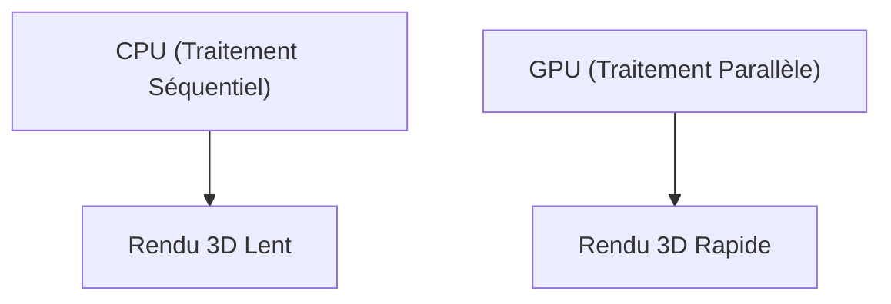

## 1. Fondation et aube des graphiques 3D
Fondée en 1993 par Jensen Huang et d'autres. L'entreprise a commencé par développer des puces (GPU) spécialisées dans le traitement des graphiques 3D pour les jeux vidéo sur PC.

## 2. Naissance de CUDA
Annoncée en 2006, "CUDA" était une plate-forme révolutionnaire qui permettait d'utiliser les GPU non seulement pour les graphiques mais aussi pour les calculs généraux (GPGPU). Cela a jeté les bases du futur boom de l'IA.

## 3. La révolution du Deep Learning
Lors du concours ImageNet de 2012, le modèle de deep learning "AlexNet" utilisant des GPU a remporté une victoire écrasante. Suite à cela, les chercheurs en IA ont commencé à réclamer en masse les GPU de NVIDIA.

## 4. Au cœur de l'IA
Aujourd'hui, les gigantesques LLM tels que ChatGPT sont tous entraînés et inférés sur des dizaines de milliers de GPU NVIDIA (A100 ou H100). NVIDIA s'est métamorphosée en l'une des entreprises les plus cotées en bourse, devenant l'entreprise d'infrastructure de l'ère de l'IA.

## Partie supplémentaire de vérification technique 1

## Partie supplémentaire de vérification technique 2

## Partie supplémentaire de vérification technique 3

## Partie supplémentaire de vérification technique 4

## Partie supplémentaire de vérification technique 5

## Partie supplémentaire de vérification technique 6

## Partie supplémentaire de vérification technique 7

## Partie supplémentaire de vérification technique 8

## Partie supplémentaire de vérification technique 9

## Partie supplémentaire de vérification technique 10

## Partie supplémentaire de vérification technique 11

## Partie supplémentaire de vérification technique 12

## Partie supplémentaire de vérification technique 13

## Partie supplémentaire de vérification technique 14

