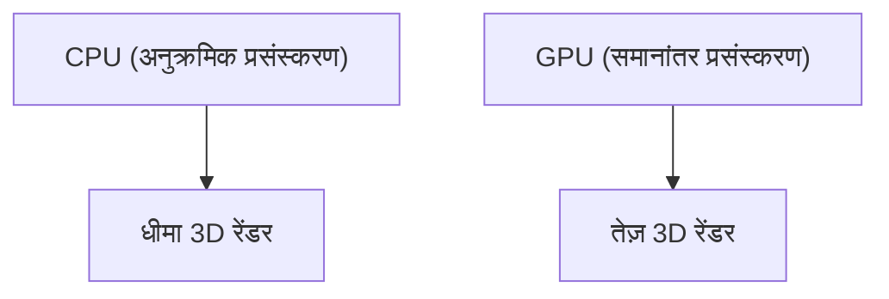

## 1. स्थापना और 3D ग्राफिक्स की शुरुआत
1993 में जेनसेन हुआंग और अन्य लोगों द्वारा स्थापित। इसने पीसी गेम्स के लिए 3D ग्राफिक्स प्रोसेसिंग में विशेषज्ञता वाले चिप्स (GPU) के विकास से शुरुआत की।

## 2. CUDA का जन्म
2006 में घोषित "CUDA" एक क्रांतिकारी प्लेटफॉर्म था जिसने GPU का उपयोग न केवल ग्राफिक्स के लिए बल्कि सामान्य-उद्देश्य गणना (GPGPU) के लिए भी संभव बनाया। यह बाद के AI बूम की नींव बना।

## 3. डीप लर्निंग क्रांति
2012 की ImageNet प्रतियोगिता में, GPU का उपयोग करने वाले डीप लर्निंग मॉडल "AlexNet" ने भारी जीत हासिल की। इस अवसर को देखते हुए, AI शोधकर्ताओं ने NVIDIA के GPU की बड़े पैमाने पर मांग शुरू कर दी।

## 4. AI के हृदय की ओर
वर्तमान में, ChatGPT जैसे विशाल LLMs को हजारों NVIDIA GPUs (A100 और H100) पर प्रशिक्षित और अनुमानित किया जाता है। NVIDIA AI युग में एक बुनियादी ढांचा कंपनी के रूप में शीर्ष बाजार पूंजीकरण वाले उद्यमों में से एक बन गया है।

## अतिरिक्त तकनीकी सत्यापन भाग 1

## अतिरिक्त तकनीकी सत्यापन भाग 2

## अतिरिक्त तकनीकी सत्यापन भाग 3

## अतिरिक्त तकनीकी सत्यापन भाग 4

## अतिरिक्त तकनीकी सत्यापन भाग 5

## अतिरिक्त तकनीकी सत्यापन भाग 6

## अतिरिक्त तकनीकी सत्यापन भाग 7

## अतिरिक्त तकनीकी सत्यापन भाग 8

## अतिरिक्त तकनीकी सत्यापन भाग 9

## अतिरिक्त तकनीकी सत्यापन भाग 10

## अतिरिक्त तकनीकी सत्यापन भाग 11

## अतिरिक्त तकनीकी सत्यापन भाग 12

## अतिरिक्त तकनीकी सत्यापन भाग 13

## अतिरिक्त तकनीकी सत्यापन भाग 14

