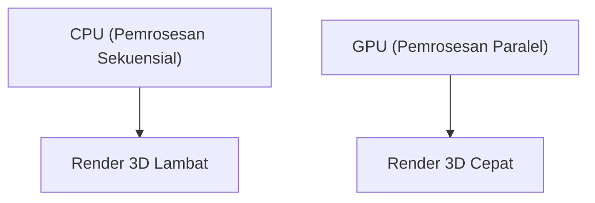

## 1. Pendirian dan Awal Mula Grafis 3D
Didirikan pada tahun 1993 oleh Jensen Huang dan kawan-kawan. Dimulai dari pengembangan chip (GPU) yang dikhususkan untuk pemrosesan grafis 3D pada game PC.

## 2. Lahirnya CUDA
"CUDA" yang diumumkan pada tahun 2006 adalah platform inovatif yang memungkinkan GPU digunakan tidak hanya untuk grafis, tetapi juga untuk komputasi umum (GPGPU). Hal ini menjadi batu loncatan bagi tren AI di masa depan.

## 3. Revolusi Deep Learning
Pada kontes ImageNet tahun 2012, "AlexNet", sebuah model deep learning yang menggunakan GPU, menang telak. Sejak saat itu, para peneliti AI berbondong-bondong mencari GPU NVIDIA.

## 4. Menjadi Jantung AI
Saat ini, LLM raksasa seperti ChatGPT semuanya dilatih dan diinferensi pada puluhan ribu GPU buatan NVIDIA (A100 dan H100). NVIDIA telah bertransformasi menjadi perusahaan dengan kapitalisasi pasar kelas atas sebagai perusahaan infrastruktur di era AI.

## Bagian Verifikasi Teknologi Tambahan 1

## Bagian Verifikasi Teknologi Tambahan 2

## Bagian Verifikasi Teknologi Tambahan 3

## Bagian Verifikasi Teknologi Tambahan 4

## Bagian Verifikasi Teknologi Tambahan 5

## Bagian Verifikasi Teknologi Tambahan 6

## Bagian Verifikasi Teknologi Tambahan 7

## Bagian Verifikasi Teknologi Tambahan 8

## Bagian Verifikasi Teknologi Tambahan 9

## Bagian Verifikasi Teknologi Tambahan 10

## Bagian Verifikasi Teknologi Tambahan 11

## Bagian Verifikasi Teknologi Tambahan 12

## Bagian Verifikasi Teknologi Tambahan 13

## Bagian Verifikasi Teknologi Tambahan 14

