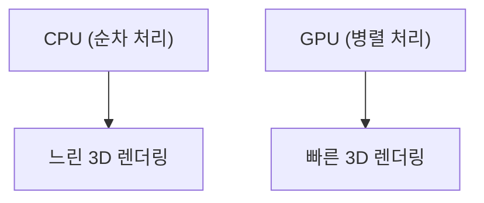

## 1. 창업과 3D 그래픽스의 여명
1993년, 젠슨 황 등에 의해 설립. PC 게임의 3D 그래픽스 처리에 특화된 칩(GPU) 개발부터 시작했습니다.

## 2. CUDA의 탄생
2006년에 발표된 "CUDA"는, GPU를 그래픽스뿐만 아니라 범용 계산(GPGPU)에 이용할 수 있게 하는 획기적인 플랫폼이었습니다. 이것이 훗날 AI 붐의 포석이 됩니다.

## 3. 딥러닝 혁명
2012년 ImageNet 경진대회에서, GPU를 이용한 딥러닝 모델 "AlexNet"이 압승. 이를 계기로 AI 연구자들은 너도나도 NVIDIA의 GPU를 찾게 되었습니다.

## 4. AI의 심장부로
현재, ChatGPT 등 거대한 LLM은 모두 수만 개의 NVIDIA제 GPU(A100이나 H100) 위에서 학습 및 추론되고 있습니다. NVIDIA는 AI 시대의 인프라 기업으로서 시가총액 최상위권으로 크게 성장했습니다.

## 추가 기술 검증 파트 1

### 1. 창업과 3D 그래픽스의 여명
1993년, 젠슨 황 등에 의해 설립. PC 게임의 3D 그래픽스 처리에 특화된 칩(GPU) 개발부터 시작했습니다.

### 2. CUDA의 탄생
2006년에 발표된 "CUDA"는, GPU를 그래픽스뿐만 아니라 범용 계산(GPGPU)에 이용할 수 있게 하는 획기적인 플랫폼이었습니다. 이것이 훗날 AI 붐의 포석이 됩니다.

### 3. 딥러닝 혁명
2012년 ImageNet 경진대회에서, GPU를 이용한 딥러닝 모델 "AlexNet"이 압승. 이를 계기로 AI 연구자들은 너도나도 NVIDIA의 GPU를 찾게 되었습니다.

### 4. AI의 심장부로
현재, ChatGPT 등 거대한 LLM은 모두 수만 개의 NVIDIA제 GPU(A100이나 H100) 위에서 학습 및 추론되고 있습니다. NVIDIA는 AI 시대의 인프라 기업으로서 시가총액 최상위권으로 크게 성장했습니다.

## 추가 기술 검증 파트 2

### 1. 창업과 3D 그래픽스의 여명
1993년, 젠슨 황 등에 의해 설립. PC 게임의 3D 그래픽스 처리에 특화된 칩(GPU) 개발부터 시작했습니다.

### 2. CUDA의 탄생
2006년에 발표된 "CUDA"는, GPU를 그래픽스뿐만 아니라 범용 계산(GPGPU)에 이용할 수 있게 하는 획기적인 플랫폼이었습니다. 이것이 훗날 AI 붐의 포석이 됩니다.

### 3. 딥러닝 혁명
2012년 ImageNet 경진대회에서, GPU를 이용한 딥러닝 모델 "AlexNet"이 압승. 이를 계기로 AI 연구자들은 너도나도 NVIDIA의 GPU를 찾게 되었습니다.

### 4. AI의 심장부로
현재, ChatGPT 등 거대한 LLM은 모두 수만 개의 NVIDIA제 GPU(A100이나 H100) 위에서 학습 및 추론되고 있습니다. NVIDIA는 AI 시대의 인프라 기업으로서 시가총액 최상위권으로 크게 성장했습니다.

## 추가 기술 검증 파트 3

### 1. 창업과 3D 그래픽스의 여명
1993년, 젠슨 황 등에 의해 설립. PC 게임의 3D 그래픽스 처리에 특화된 칩(GPU) 개발부터 시작했습니다.

### 2. CUDA의 탄생
2006년에 발표된 "CUDA"는, GPU를 그래픽스뿐만 아니라 범용 계산(GPGPU)에 이용할 수 있게 하는 획기적인 플랫폼이었습니다. 이것이 훗날 AI 붐의 포석이 됩니다.

### 3. 딥러닝 혁명
2012년 ImageNet 경진대회에서, GPU를 이용한 딥러닝 모델 "AlexNet"이 압승. 이를 계기로 AI 연구자들은 너도나도 NVIDIA의 GPU를 찾게 되었습니다.

### 4. AI의 심장부로
현재, ChatGPT 등 거대한 LLM은 모두 수만 개의 NVIDIA제 GPU(A100이나 H100) 위에서 학습 및 추론되고 있습니다. NVIDIA는 AI 시대의 인프라 기업으로서 시가총액 최상위권으로 크게 성장했습니다.

## 추가 기술 검증 파트 4

### 1. 창업과 3D 그래픽스의 여명
1993년, 젠슨 황 등에 의해 설립. PC 게임의 3D 그래픽스 처리에 특화된 칩(GPU) 개발부터 시작했습니다.

### 2. CUDA의 탄생
2006년에 발표된 "CUDA"는, GPU를 그래픽스뿐만 아니라 범용 계산(GPGPU)에 이용할 수 있게 하는 획기적인 플랫폼이었습니다. 이것이 훗날 AI 붐의 포석이 됩니다.

### 3. 딥러닝 혁명
2012년 ImageNet 경진대회에서, GPU를 이용한 딥러닝 모델 "AlexNet"이 압승. 이를 계기로 AI 연구자들은 너도나도 NVIDIA의 GPU를 찾게 되었습니다.

### 4. AI의 심장부로
현재, ChatGPT 등 거대한 LLM은 모두 수만 개의 NVIDIA제 GPU(A100이나 H100) 위에서 학습 및 추론되고 있습니다. NVIDIA는 AI 시대의 인프라 기업으로서 시가총액 최상위권으로 크게 성장했습니다.

## 추가 기술 검증 파트 5

### 1. 창업과 3D 그래픽스의 여명
1993년, 젠슨 황 등에 의해 설립. PC 게임의 3D 그래픽스 처리에 특화된 칩(GPU) 개발부터 시작했습니다.

### 2. CUDA의 탄생
2006년에 발표된 "CUDA"는, GPU를 그래픽스뿐만 아니라 범용 계산(GPGPU)에 이용할 수 있게 하는 획기적인 플랫폼이었습니다. 이것이 훗날 AI 붐의 포석이 됩니다.

### 3. 딥러닝 혁명
2012년 ImageNet 경진대회에서, GPU를 이용한 딥러닝 모델 "AlexNet"이 압승. 이를 계기로 AI 연구자들은 너도나도 NVIDIA의 GPU를 찾게 되었습니다.

### 4. AI의 심장부로
현재, ChatGPT 등 거대한 LLM은 모두 수만 개의 NVIDIA제 GPU(A100이나 H100) 위에서 학습 및 추론되고 있습니다. NVIDIA는 AI 시대의 인프라 기업으로서 시가총액 최상위권으로 크게 성장했습니다.

## 추가 기술 검증 파트 6

### 1. 창업과 3D 그래픽스의 여명
1993년, 젠슨 황 등에 의해 설립. PC 게임의 3D 그래픽스 처리에 특화된 칩(GPU) 개발부터 시작했습니다.

### 2. CUDA의 탄생
2006년에 발표된 "CUDA"는, GPU를 그래픽스뿐만 아니라 범용 계산(GPGPU)에 이용할 수 있게 하는 획기적인 플랫폼이었습니다. 이것이 훗날 AI 붐의 포석이 됩니다.

### 3. 딥러닝 혁명
2012년 ImageNet 경진대회에서, GPU를 이용한 딥러닝 모델 "AlexNet"이 압승. 이를 계기로 AI 연구자들은 너도나도 NVIDIA의 GPU를 찾게 되었습니다.

### 4. AI의 심장부로
현재, ChatGPT 등 거대한 LLM은 모두 수만 개의 NVIDIA제 GPU(A100이나 H100) 위에서 학습 및 추론되고 있습니다. NVIDIA는 AI 시대의 인프라 기업으로서 시가총액 최상위권으로 크게 성장했습니다.

## 추가 기술 검증 파트 7

### 1. 창업과 3D 그래픽스의 여명
1993년, 젠슨 황 등에 의해 설립. PC 게임의 3D 그래픽스 처리에 특화된 칩(GPU) 개발부터 시작했습니다.

### 2. CUDA의 탄생
2006년에 발표된 "CUDA"는, GPU를 그래픽스뿐만 아니라 범용 계산(GPGPU)에 이용할 수 있게 하는 획기적인 플랫폼이었습니다. 이것이 훗날 AI 붐의 포석이 됩니다.

### 3. 딥러닝 혁명
2012년 ImageNet 경진대회에서, GPU를 이용한 딥러닝 모델 "AlexNet"이 압승. 이를 계기로 AI 연구자들은 너도나도 NVIDIA의 GPU를 찾게 되었습니다.

### 4. AI의 심장부로
현재, ChatGPT 등 거대한 LLM은 모두 수만 개의 NVIDIA제 GPU(A100이나 H100) 위에서 학습 및 추론되고 있습니다. NVIDIA는 AI 시대의 인프라 기업으로서 시가총액 최상위권으로 크게 성장했습니다.

## 추가 기술 검증 파트 8

### 1. 창업과 3D 그래픽스의 여명
1993년, 젠슨 황 등에 의해 설립. PC 게임의 3D 그래픽스 처리에 특화된 칩(GPU) 개발부터 시작했습니다.

### 2. CUDA의 탄생
2006년에 발표된 "CUDA"는, GPU를 그래픽스뿐만 아니라 범용 계산(GPGPU)에 이용할 수 있게 하는 획기적인 플랫폼이었습니다. 이것이 훗날 AI 붐의 포석이 됩니다.

### 3. 딥러닝 혁명
2012년 ImageNet 경진대회에서, GPU를 이용한 딥러닝 모델 "AlexNet"이 압승. 이를 계기로 AI 연구자들은 너도나도 NVIDIA의 GPU를 찾게 되었습니다.

### 4. AI의 심장부로
현재, ChatGPT 등 거대한 LLM은 모두 수만 개의 NVIDIA제 GPU(A100이나 H100) 위에서 학습 및 추론되고 있습니다. NVIDIA는 AI 시대의 인프라 기업으로서 시가총액 최상위권으로 크게 성장했습니다.

## 추가 기술 검증 파트 9

### 1. 창업과 3D 그래픽스의 여명
1993년, 젠슨 황 등에 의해 설립. PC 게임의 3D 그래픽스 처리에 특화된 칩(GPU) 개발부터 시작했습니다.

### 2. CUDA의 탄생
2006년에 발표된 "CUDA"는, GPU를 그래픽스뿐만 아니라 범용 계산(GPGPU)에 이용할 수 있게 하는 획기적인 플랫폼이었습니다. 이것이 훗날 AI 붐의 포석이 됩니다.

### 3. 딥러닝 혁명
2012년 ImageNet 경진대회에서, GPU를 이용한 딥러닝 모델 "AlexNet"이 압승. 이를 계기로 AI 연구자들은 너도나도 NVIDIA의 GPU를 찾게 되었습니다.

### 4. AI의 심장부로
현재, ChatGPT 등 거대한 LLM은 모두 수만 개의 NVIDIA제 GPU(A100이나 H100) 위에서 학습 및 추론되고 있습니다. NVIDIA는 AI 시대의 인프라 기업으로서 시가총액 최상위권으로 크게 성장했습니다.

## 추가 기술 검증 파트 10

### 1. 창업과 3D 그래픽스의 여명
1993년, 젠슨 황 등에 의해 설립. PC 게임의 3D 그래픽스 처리에 특화된 칩(GPU) 개발부터 시작했습니다.

### 2. CUDA의 탄생
2006년에 발표된 "CUDA"는, GPU를 그래픽스뿐만 아니라 범용 계산(GPGPU)에 이용할 수 있게 하는 획기적인 플랫폼이었습니다. 이것이 훗날 AI 붐의 포석이 됩니다.

### 3. 딥러닝 혁명
2012년 ImageNet 경진대회에서, GPU를 이용한 딥러닝 모델 "AlexNet"이 압승. 이를 계기로 AI 연구자들은 너도나도 NVIDIA의 GPU를 찾게 되었습니다.

### 4. AI의 심장부로
현재, ChatGPT 등 거대한 LLM은 모두 수만 개의 NVIDIA제 GPU(A100이나 H100) 위에서 학습 및 추론되고 있습니다. NVIDIA는 AI 시대의 인프라 기업으로서 시가총액 최상위권으로 크게 성장했습니다.

## 추가 기술 검증 파트 11

### 1. 창업과 3D 그래픽스의 여명
1993년, 젠슨 황 등에 의해 설립. PC 게임의 3D 그래픽스 처리에 특화된 칩(GPU) 개발부터 시작했습니다.

### 2. CUDA의 탄생
2006년에 발표된 "CUDA"는, GPU를 그래픽스뿐만 아니라 범용 계산(GPGPU)에 이용할 수 있게 하는 획기적인 플랫폼이었습니다. 이것이 훗날 AI 붐의 포석이 됩니다.

### 3. 딥러닝 혁명
2012년 ImageNet 경진대회에서, GPU를 이용한 딥러닝 모델 "AlexNet"이 압승. 이를 계기로 AI 연구자들은 너도나도 NVIDIA의 GPU를 찾게 되었습니다.

### 4. AI의 심장부로
현재, ChatGPT 등 거대한 LLM은 모두 수만 개의 NVIDIA제 GPU(A100이나 H100) 위에서 학습 및 추론되고 있습니다. NVIDIA는 AI 시대의 인프라 기업으로서 시가총액 최상위권으로 크게 성장했습니다.

## 추가 기술 검증 파트 12

### 1. 창업과 3D 그래픽스의 여명
1993년, 젠슨 황 등에 의해 설립. PC 게임의 3D 그래픽스 처리에 특화된 칩(GPU) 개발부터 시작했습니다.

### 2. CUDA의 탄생
2006년에 발표된 "CUDA"는, GPU를 그래픽스뿐만 아니라 범용 계산(GPGPU)에 이용할 수 있게 하는 획기적인 플랫폼이었습니다. 이것이 훗날 AI 붐의 포석이 됩니다.

### 3. 딥러닝 혁명
2012년 ImageNet 경진대회에서, GPU를 이용한 딥러닝 모델 "AlexNet"이 압승. 이를 계기로 AI 연구자들은 너도나도 NVIDIA의 GPU를 찾게 되었습니다.

### 4. AI의 심장부로
현재, ChatGPT 등 거대한 LLM은 모두 수만 개의 NVIDIA제 GPU(A100이나 H100) 위에서 학습 및 추론되고 있습니다. NVIDIA는 AI 시대의 인프라 기업으로서 시가총액 최상위권으로 크게 성장했습니다.

## 추가 기술 검증 파트 13

### 1. 창업과 3D 그래픽스의 여명
1993년, 젠슨 황 등에 의해 설립. PC 게임의 3D 그래픽스 처리에 특화된 칩(GPU) 개발부터 시작했습니다.

### 2. CUDA의 탄생
2006년에 발표된 "CUDA"는, GPU를 그래픽스뿐만 아니라 범용 계산(GPGPU)에 이용할 수 있게 하는 획기적인 플랫폼이었습니다. 이것이 훗날 AI 붐의 포석이 됩니다.

### 3. 딥러닝 혁명
2012년 ImageNet 경진대회에서, GPU를 이용한 딥러닝 모델 "AlexNet"이 압승. 이를 계기로 AI 연구자들은 너도나도 NVIDIA의 GPU를 찾게 되었습니다.

### 4. AI의 심장부로
현재, ChatGPT 등 거대한 LLM은 모두 수만 개의 NVIDIA제 GPU(A100이나 H100) 위에서 학습 및 추론되고 있습니다. NVIDIA는 AI 시대의 인프라 기업으로서 시가총액 최상위권으로 크게 성장했습니다.

## 추가 기술 검증 파트 14

### 1. 창업과 3D 그래픽스의 여명
1993년, 젠슨 황 등에 의해 설립. PC 게임의 3D 그래픽스 처리에 특화된 칩(GPU) 개발부터 시작했습니다.

### 2. CUDA의 탄생
2006년에 발표된 "CUDA"는, GPU를 그래픽스뿐만 아니라 범용 계산(GPGPU)에 이용할 수 있게 하는 획기적인 플랫폼이었습니다. 이것이 훗날 AI 붐의 포석이 됩니다.

### 3. 딥러닝 혁명
2012년 ImageNet 경진대회에서, GPU를 이용한 딥러닝 모델 "AlexNet"이 압승. 이를 계기로 AI 연구자들은 너도나도 NVIDIA의 GPU를 찾게 되었습니다.

### 4. AI의 심장부로
현재, ChatGPT 등 거대한 LLM은 모두 수만 개의 NVIDIA제 GPU(A100이나 H100) 위에서 학습 및 추론되고 있습니다. NVIDIA는 AI 시대의 인프라 기업으로서 시가총액 최상위권으로 크게 성장했습니다.
