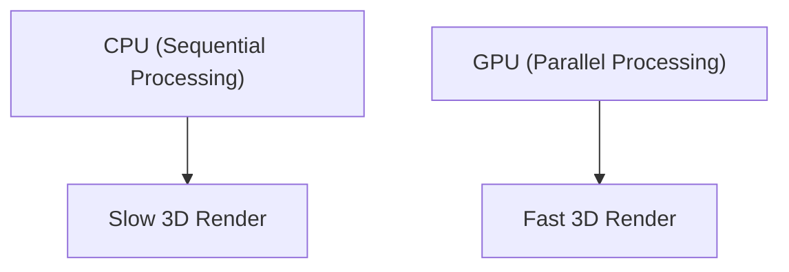

## 1. 創業と3Dグラフィックスの夜明け
1993年、ジェンスン・フアンらによって設立。PCゲームの3Dグラフィックス処理に特化したチップ（GPU）の開発からスタートしました。

```mermaid
graph TD
    CPU["CPU (Sequential Processing)"] --> Slow["Slow 3D Render"]
    GPU["GPU (Parallel Processing)"] --> Fast["Fast 3D Render"]
```

## 2. CUDAの誕生
2006年に発表された「CUDA」は、GPUをグラフィックスだけでなく汎用計算（GPGPU）に利用できるようにする画期的なプラットフォームでした。これが後のAIブームの布石となります。

## 3. ディープラーニング革命
2012年のImageNetコンテストで、GPUを用いたディープラーニングモデル「AlexNet」が圧勝。これを機にAI研究者たちはNVIDIAのGPUをこぞって求めるようになりました。

## 4. AIの心臓部へ
現在、ChatGPTなどの巨大なLLMはすべて数万個のNVIDIA製GPU（A100やH100）上で学習・推論されています。NVIDIAはAI時代のインフラ企業として時価総額トップクラスへと大化けしました。

## 追加技術検証パート 1

### 1. 創業と3Dグラフィックスの夜明け
1993年、ジェンスン・フアンらによって設立。PCゲームの3Dグラフィックス処理に特化したチップ（GPU）の開発からスタートしました。

### 2. CUDAの誕生
2006年に発表された「CUDA」は、GPUをグラフィックスだけでなく汎用計算（GPGPU）に利用できるようにする画期的なプラットフォームでした。これが後のAIブームの布石となります。

### 3. ディープラーニング革命
2012年のImageNetコンテストで、GPUを用いたディープラーニングモデル「AlexNet」が圧勝。これを機にAI研究者たちはNVIDIAのGPUをこぞって求めるようになりました。

### 4. AIの心臓部へ
現在、ChatGPTなどの巨大なLLMはすべて数万個のNVIDIA製GPU（A100やH100）上で学習・推論されています。NVIDIAはAI時代のインフラ企業として時価総額トップクラスへと大化けしました。

## 追加技術検証パート 2

### 1. 創業と3Dグラフィックスの夜明け
1993年、ジェンスン・フアンらによって設立。PCゲームの3Dグラフィックス処理に特化したチップ（GPU）の開発からスタートしました。

### 2. CUDAの誕生
2006年に発表された「CUDA」は、GPUをグラフィックスだけでなく汎用計算（GPGPU）に利用できるようにする画期的なプラットフォームでした。これが後のAIブームの布石となります。

### 3. ディープラーニング革命
2012年のImageNetコンテストで、GPUを用いたディープラーニングモデル「AlexNet」が圧勝。これを機にAI研究者たちはNVIDIAのGPUをこぞって求めるようになりました。

### 4. AIの心臓部へ
現在、ChatGPTなどの巨大なLLMはすべて数万個のNVIDIA製GPU（A100やH100）上で学習・推論されています。NVIDIAはAI時代のインフラ企業として時価総額トップクラスへと大化けしました。

## 追加技術検証パート 3

### 1. 創業と3Dグラフィックスの夜明け
1993年、ジェンスン・フアンらによって設立。PCゲームの3Dグラフィックス処理に特化したチップ（GPU）の開発からスタートしました。

### 2. CUDAの誕生
2006年に発表された「CUDA」は、GPUをグラフィックスだけでなく汎用計算（GPGPU）に利用できるようにする画期的なプラットフォームでした。これが後のAIブームの布石となります。

### 3. ディープラーニング革命
2012年のImageNetコンテストで、GPUを用いたディープラーニングモデル「AlexNet」が圧勝。これを機にAI研究者たちはNVIDIAのGPUをこぞって求めるようになりました。

### 4. AIの心臓部へ
現在、ChatGPTなどの巨大なLLMはすべて数万個のNVIDIA製GPU（A100やH100）上で学習・推論されています。NVIDIAはAI時代のインフラ企業として時価総額トップクラスへと大化けしました。

## 追加技術検証パート 4

### 1. 創業と3Dグラフィックスの夜明け
1993年、ジェンスン・フアンらによって設立。PCゲームの3Dグラフィックス処理に特化したチップ（GPU）の開発からスタートしました。

### 2. CUDAの誕生
2006年に発表された「CUDA」は、GPUをグラフィックスだけでなく汎用計算（GPGPU）に利用できるようにする画期的なプラットフォームでした。これが後のAIブームの布石となります。

### 3. ディープラーニング革命
2012年のImageNetコンテストで、GPUを用いたディープラーニングモデル「AlexNet」が圧勝。これを機にAI研究者たちはNVIDIAのGPUをこぞって求めるようになりました。

### 4. AIの心臓部へ
現在、ChatGPTなどの巨大なLLMはすべて数万個のNVIDIA製GPU（A100やH100）上で学習・推論されています。NVIDIAはAI時代のインフラ企業として時価総額トップクラスへと大化けしました。

## 追加技術検証パート 5

### 1. 創業と3Dグラフィックスの夜明け
1993年、ジェンスン・フアンらによって設立。PCゲームの3Dグラフィックス処理に特化したチップ（GPU）の開発からスタートしました。

### 2. CUDAの誕生
2006年に発表された「CUDA」は、GPUをグラフィックスだけでなく汎用計算（GPGPU）に利用できるようにする画期的なプラットフォームでした。これが後のAIブームの布石となります。

### 3. ディープラーニング革命
2012年のImageNetコンテストで、GPUを用いたディープラーニングモデル「AlexNet」が圧勝。これを機にAI研究者たちはNVIDIAのGPUをこぞって求めるようになりました。

### 4. AIの心臓部へ
現在、ChatGPTなどの巨大なLLMはすべて数万個のNVIDIA製GPU（A100やH100）上で学習・推論されています。NVIDIAはAI時代のインフラ企業として時価総額トップクラスへと大化けしました。

## 追加技術検証パート 6

### 1. 創業と3Dグラフィックスの夜明け
1993年、ジェンスン・フアンらによって設立。PCゲームの3Dグラフィックス処理に特化したチップ（GPU）の開発からスタートしました。

### 2. CUDAの誕生
2006年に発表された「CUDA」は、GPUをグラフィックスだけでなく汎用計算（GPGPU）に利用できるようにする画期的なプラットフォームでした。これが後のAIブームの布石となります。

### 3. ディープラーニング革命
2012年のImageNetコンテストで、GPUを用いたディープラーニングモデル「AlexNet」が圧勝。これを機にAI研究者たちはNVIDIAのGPUをこぞって求めるようになりました。

### 4. AIの心臓部へ
現在、ChatGPTなどの巨大なLLMはすべて数万個のNVIDIA製GPU（A100やH100）上で学習・推論されています。NVIDIAはAI時代のインフラ企業として時価総額トップクラスへと大化けしました。

## 追加技術検証パート 7

### 1. 創業と3Dグラフィックスの夜明け
1993年、ジェンスン・フアンらによって設立。PCゲームの3Dグラフィックス処理に特化したチップ（GPU）の開発からスタートしました。

### 2. CUDAの誕生
2006年に発表された「CUDA」は、GPUをグラフィックスだけでなく汎用計算（GPGPU）に利用できるようにする画期的なプラットフォームでした。これが後のAIブームの布石となります。

### 3. ディープラーニング革命
2012年のImageNetコンテストで、GPUを用いたディープラーニングモデル「AlexNet」が圧勝。これを機にAI研究者たちはNVIDIAのGPUをこぞって求めるようになりました。

### 4. AIの心臓部へ
現在、ChatGPTなどの巨大なLLMはすべて数万個のNVIDIA製GPU（A100やH100）上で学習・推論されています。NVIDIAはAI時代のインフラ企業として時価総額トップクラスへと大化けしました。

## 追加技術検証パート 8

### 1. 創業と3Dグラフィックスの夜明け
1993年、ジェンスン・フアンらによって設立。PCゲームの3Dグラフィックス処理に特化したチップ（GPU）の開発からスタートしました。

### 2. CUDAの誕生
2006年に発表された「CUDA」は、GPUをグラフィックスだけでなく汎用計算（GPGPU）に利用できるようにする画期的なプラットフォームでした。これが後のAIブームの布石となります。

### 3. ディープラーニング革命
2012年のImageNetコンテストで、GPUを用いたディープラーニングモデル「AlexNet」が圧勝。これを機にAI研究者たちはNVIDIAのGPUをこぞって求めるようになりました。

### 4. AIの心臓部へ
現在、ChatGPTなどの巨大なLLMはすべて数万個のNVIDIA製GPU（A100やH100）上で学習・推論されています。NVIDIAはAI時代のインフラ企業として時価総額トップクラスへと大化けしました。

## 追加技術検証パート 9

### 1. 創業と3Dグラフィックスの夜明け
1993年、ジェンスン・フアンらによって設立。PCゲームの3Dグラフィックス処理に特化したチップ（GPU）の開発からスタートしました。

### 2. CUDAの誕生
2006年に発表された「CUDA」は、GPUをグラフィックスだけでなく汎用計算（GPGPU）に利用できるようにする画期的なプラットフォームでした。これが後のAIブームの布石となります。

### 3. ディープラーニング革命
2012年のImageNetコンテストで、GPUを用いたディープラーニングモデル「AlexNet」が圧勝。これを機にAI研究者たちはNVIDIAのGPUをこぞって求めるようになりました。

### 4. AIの心臓部へ
現在、ChatGPTなどの巨大なLLMはすべて数万個のNVIDIA製GPU（A100やH100）上で学習・推論されています。NVIDIAはAI時代のインフラ企業として時価総額トップクラスへと大化けしました。

## 追加技術検証パート 10

### 1. 創業と3Dグラフィックスの夜明け
1993年、ジェンスン・フアンらによって設立。PCゲームの3Dグラフィックス処理に特化したチップ（GPU）の開発からスタートしました。

### 2. CUDAの誕生
2006年に発表された「CUDA」は、GPUをグラフィックスだけでなく汎用計算（GPGPU）に利用できるようにする画期的なプラットフォームでした。これが後のAIブームの布石となります。

### 3. ディープラーニング革命
2012年のImageNetコンテストで、GPUを用いたディープラーニングモデル「AlexNet」が圧勝。これを機にAI研究者たちはNVIDIAのGPUをこぞって求めるようになりました。

### 4. AIの心臓部へ
現在、ChatGPTなどの巨大なLLMはすべて数万個のNVIDIA製GPU（A100やH100）上で学習・推論されています。NVIDIAはAI時代のインフラ企業として時価総額トップクラスへと大化けしました。

## 追加技術検証パート 11

### 1. 創業と3Dグラフィックスの夜明け
1993年、ジェンスン・フアンらによって設立。PCゲームの3Dグラフィックス処理に特化したチップ（GPU）の開発からスタートしました。

### 2. CUDAの誕生
2006年に発表された「CUDA」は、GPUをグラフィックスだけでなく汎用計算（GPGPU）に利用できるようにする画期的なプラットフォームでした。これが後のAIブームの布石となります。

### 3. ディープラーニング革命
2012年のImageNetコンテストで、GPUを用いたディープラーニングモデル「AlexNet」が圧勝。これを機にAI研究者たちはNVIDIAのGPUをこぞって求めるようになりました。

### 4. AIの心臓部へ
現在、ChatGPTなどの巨大なLLMはすべて数万個のNVIDIA製GPU（A100やH100）上で学習・推論されています。NVIDIAはAI時代のインフラ企業として時価総額トップクラスへと大化けしました。

## 追加技術検証パート 12

### 1. 創業と3Dグラフィックスの夜明け
1993年、ジェンスン・フアンらによって設立。PCゲームの3Dグラフィックス処理に特化したチップ（GPU）の開発からスタートしました。

### 2. CUDAの誕生
2006年に発表された「CUDA」は、GPUをグラフィックスだけでなく汎用計算（GPGPU）に利用できるようにする画期的なプラットフォームでした。これが後のAIブームの布石となります。

### 3. ディープラーニング革命
2012年のImageNetコンテストで、GPUを用いたディープラーニングモデル「AlexNet」が圧勝。これを機にAI研究者たちはNVIDIAのGPUをこぞって求めるようになりました。

### 4. AIの心臓部へ
現在、ChatGPTなどの巨大なLLMはすべて数万個のNVIDIA製GPU（A100やH100）上で学習・推論されています。NVIDIAはAI時代のインフラ企業として時価総額トップクラスへと大化けしました。

## 追加技術検証パート 13

### 1. 創業と3Dグラフィックスの夜明け
1993年、ジェンスン・フアンらによって設立。PCゲームの3Dグラフィックス処理に特化したチップ（GPU）の開発からスタートしました。

### 2. CUDAの誕生
2006年に発表された「CUDA」は、GPUをグラフィックスだけでなく汎用計算（GPGPU）に利用できるようにする画期的なプラットフォームでした。これが後のAIブームの布石となります。

### 3. ディープラーニング革命
2012年のImageNetコンテストで、GPUを用いたディープラーニングモデル「AlexNet」が圧勝。これを機にAI研究者たちはNVIDIAのGPUをこぞって求めるようになりました。

### 4. AIの心臓部へ
現在、ChatGPTなどの巨大なLLMはすべて数万個のNVIDIA製GPU（A100やH100）上で学習・推論されています。NVIDIAはAI時代のインフラ企業として時価総額トップクラスへと大化けしました。

## 追加技術検証パート 14

### 1. 創業と3Dグラフィックスの夜明け
1993年、ジェンスン・フアンらによって設立。PCゲームの3Dグラフィックス処理に特化したチップ（GPU）の開発からスタートしました。

### 2. CUDAの誕生
2006年に発表された「CUDA」は、GPUをグラフィックスだけでなく汎用計算（GPGPU）に利用できるようにする画期的なプラットフォームでした。これが後のAIブームの布石となります。

### 3. ディープラーニング革命
2012年のImageNetコンテストで、GPUを用いたディープラーニングモデル「AlexNet」が圧勝。これを機にAI研究者たちはNVIDIAのGPUをこぞって求めるようになりました。

### 4. AIの心臓部へ
現在、ChatGPTなどの巨大なLLMはすべて数万個のNVIDIA製GPU（A100やH100）上で学習・推論されています。NVIDIAはAI時代のインフラ企業として時価総額トップクラスへと大化けしました。
