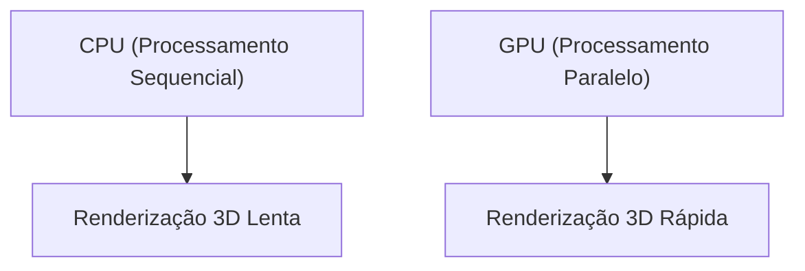

## 1. Fundação e o Amanhecer dos Gráficos 3D
Fundada em 1993 por Jensen Huang e outros. Começou com o desenvolvimento de chips (GPUs) especializados no processamento de gráficos 3D para jogos de PC.

## 2. O Nascimento do CUDA
Anunciado em 2006, o "CUDA" foi uma plataforma revolucionária que permitiu o uso de GPUs não apenas para gráficos, mas também para computação de propósito geral (GPGPU). Isso se tornou a base para o futuro boom da IA.

## 3. A Revolução do Deep Learning
No concurso ImageNet de 2012, o modelo de deep learning "AlexNet", usando GPUs, obteve uma vitória esmagadora. A partir dessa oportunidade, os pesquisadores de IA passaram a buscar ativamente as GPUs da NVIDIA.

## 4. Rumo ao Coração da IA
Atualmente, enormes LLMs como o ChatGPT são todos treinados e inferidos em dezenas de milhares de GPUs da NVIDIA (A100 e H100). A NVIDIA se transformou em uma empresa de infraestrutura da era da IA, alcançando uma das maiores capitalizações de mercado.

## Parte Adicional de Verificação Técnica 1

## Parte Adicional de Verificação Técnica 2

## Parte Adicional de Verificação Técnica 3

## Parte Adicional de Verificação Técnica 4

## Parte Adicional de Verificação Técnica 5

## Parte Adicional de Verificação Técnica 6

## Parte Adicional de Verificação Técnica 7

## Parte Adicional de Verificação Técnica 8

## Parte Adicional de Verificação Técnica 9

## Parte Adicional de Verificação Técnica 10

## Parte Adicional de Verificação Técnica 11

## Parte Adicional de Verificação Técnica 12

## Parte Adicional de Verificação Técnica 13

## Parte Adicional de Verificação Técnica 14

