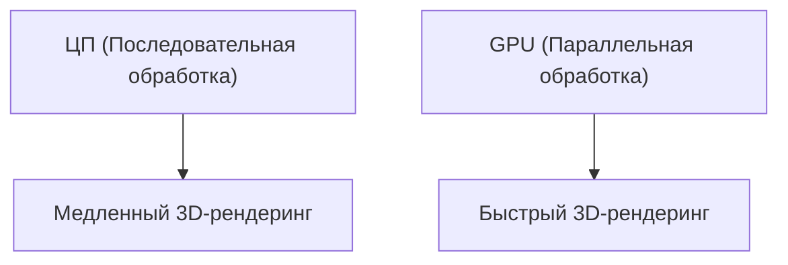

## 1. Основание и рассвет 3D-графики
Основана в 1993 году Дженсеном Хуангом и другими. Компания начала с разработки чипов (GPU), специализирующихся на обработке 3D-графики для ПК-игр.

## 2. Рождение CUDA
Платформа «CUDA», представленная в 2006 году, стала революционным решением, позволившим использовать GPU не только для графики, но и для вычислений общего назначения (GPGPU). Это стало фундаментом для последующего бума ИИ.

## 3. Революция глубокого обучения
На конкурсе ImageNet в 2012 году модель глубокого обучения «AlexNet», использующая GPU, одержала убедительную победу. После этого исследователи ИИ начали массово использовать графические процессоры NVIDIA.

## 4. К сердцу ИИ
В настоящее время все гигантские LLM, такие как ChatGPT, обучаются и выполняют логические выводы на десятках тысяч графических процессоров NVIDIA (A100 и H100). NVIDIA превратилась в инфраструктурную компанию эпохи ИИ, войдя в число лидеров по рыночной капитализации.

## Дополнительная часть технической проверки 1

### 1. Основание и рассвет 3D-графики
Основана в 1993 году Дженсеном Хуангом и другими. Компания начала с разработки чипов (GPU), специализирующихся на обработке 3D-графики для ПК-игр.

### 2. Рождение CUDA
Платформа «CUDA», представленная в 2006 году, стала революционным решением, позволившим использовать GPU не только для графики, но и для вычислений общего назначения (GPGPU). Это стало фундаментом для последующего бума ИИ.

### 3. Революция глубокого обучения
На конкурсе ImageNet в 2012 году модель глубокого обучения «AlexNet», использующая GPU, одержала убедительную победу. После этого исследователи ИИ начали массово использовать графические процессоры NVIDIA.

### 4. К сердцу ИИ
В настоящее время все гигантские LLM, такие как ChatGPT, обучаются и выполняют логические выводы на десятках тысяч графических процессоров NVIDIA (A100 и H100). NVIDIA превратилась в инфраструктурную компанию эпохи ИИ, войдя в число лидеров по рыночной капитализации.

## Дополнительная часть технической проверки 2

### 1. Основание и рассвет 3D-графики
Основана в 1993 году Дженсеном Хуангом и другими. Компания начала с разработки чипов (GPU), специализирующихся на обработке 3D-графики для ПК-игр.

### 2. Рождение CUDA
Платформа «CUDA», представленная в 2006 году, стала революционным решением, позволившим использовать GPU не только для графики, но и для вычислений общего назначения (GPGPU). Это стало фундаментом для последующего бума ИИ.

### 3. Революция глубокого обучения
На конкурсе ImageNet в 2012 году модель глубокого обучения «AlexNet», использующая GPU, одержала убедительную победу. После этого исследователи ИИ начали массово использовать графические процессоры NVIDIA.

### 4. К сердцу ИИ
В настоящее время все гигантские LLM, такие как ChatGPT, обучаются и выполняют логические выводы на десятках тысяч графических процессоров NVIDIA (A100 и H100). NVIDIA превратилась в инфраструктурную компанию эпохи ИИ, войдя в число лидеров по рыночной капитализации.

## Дополнительная часть технической проверки 3

### 1. Основание и рассвет 3D-графики
Основана в 1993 году Дженсеном Хуангом и другими. Компания начала с разработки чипов (GPU), специализирующихся на обработке 3D-графики для ПК-игр.

### 2. Рождение CUDA
Платформа «CUDA», представленная в 2006 году, стала революционным решением, позволившим использовать GPU не только для графики, но и для вычислений общего назначения (GPGPU). Это стало фундаментом для последующего бума ИИ.

### 3. Революция глубокого обучения
На конкурсе ImageNet в 2012 году модель глубокого обучения «AlexNet», использующая GPU, одержала убедительную победу. После этого исследователи ИИ начали массово использовать графические процессоры NVIDIA.

### 4. К сердцу ИИ
В настоящее время все гигантские LLM, такие как ChatGPT, обучаются и выполняют логические выводы на десятках тысяч графических процессоров NVIDIA (A100 и H100). NVIDIA превратилась в инфраструктурную компанию эпохи ИИ, войдя в число лидеров по рыночной капитализации.

## Дополнительная часть технической проверки 4

### 1. Основание и рассвет 3D-графики
Основана в 1993 году Дженсеном Хуангом и другими. Компания начала с разработки чипов (GPU), специализирующихся на обработке 3D-графики для ПК-игр.

### 2. Рождение CUDA
Платформа «CUDA», представленная в 2006 году, стала революционным решением, позволившим использовать GPU не только для графики, но и для вычислений общего назначения (GPGPU). Это стало фундаментом для последующего бума ИИ.

### 3. Революция глубокого обучения
На конкурсе ImageNet в 2012 году модель глубокого обучения «AlexNet», использующая GPU, одержала убедительную победу. После этого исследователи ИИ начали массово использовать графические процессоры NVIDIA.

### 4. К сердцу ИИ
В настоящее время все гигантские LLM, такие как ChatGPT, обучаются и выполняют логические выводы на десятках тысяч графических процессоров NVIDIA (A100 и H100). NVIDIA превратилась в инфраструктурную компанию эпохи ИИ, войдя в число лидеров по рыночной капитализации.

## Дополнительная часть технической проверки 5

### 1. Основание и рассвет 3D-графики
Основана в 1993 году Дженсеном Хуангом и другими. Компания начала с разработки чипов (GPU), специализирующихся на обработке 3D-графики для ПК-игр.

### 2. Рождение CUDA
Платформа «CUDA», представленная в 2006 году, стала революционным решением, позволившим использовать GPU не только для графики, но и для вычислений общего назначения (GPGPU). Это стало фундаментом для последующего бума ИИ.

### 3. Революция глубокого обучения
На конкурсе ImageNet в 2012 году модель глубокого обучения «AlexNet», использующая GPU, одержала убедительную победу. После этого исследователи ИИ начали массово использовать графические процессоры NVIDIA.

### 4. К сердцу ИИ
В настоящее время все гигантские LLM, такие как ChatGPT, обучаются и выполняют логические выводы на десятках тысяч графических процессоров NVIDIA (A100 и H100). NVIDIA превратилась в инфраструктурную компанию эпохи ИИ, войдя в число лидеров по рыночной капитализации.

## Дополнительная часть технической проверки 6

### 1. Основание и рассвет 3D-графики
Основана в 1993 году Дженсеном Хуангом и другими. Компания начала с разработки чипов (GPU), специализирующихся на обработке 3D-графики для ПК-игр.

### 2. Рождение CUDA
Платформа «CUDA», представленная в 2006 году, стала революционным решением, позволившим использовать GPU не только для графики, но и для вычислений общего назначения (GPGPU). Это стало фундаментом для последующего бума ИИ.

### 3. Революция глубокого обучения
На конкурсе ImageNet в 2012 году модель глубокого обучения «AlexNet», использующая GPU, одержала убедительную победу. После этого исследователи ИИ начали массово использовать графические процессоры NVIDIA.

### 4. К сердцу ИИ
В настоящее время все гигантские LLM, такие как ChatGPT, обучаются и выполняют логические выводы на десятках тысяч графических процессоров NVIDIA (A100 и H100). NVIDIA превратилась в инфраструктурную компанию эпохи ИИ, войдя в число лидеров по рыночной капитализации.

## Дополнительная часть технической проверки 7

### 1. Основание и рассвет 3D-графики
Основана в 1993 году Дженсеном Хуангом и другими. Компания начала с разработки чипов (GPU), специализирующихся на обработке 3D-графики для ПК-игр.

### 2. Рождение CUDA
Платформа «CUDA», представленная в 2006 году, стала революционным решением, позволившим использовать GPU не только для графики, но и для вычислений общего назначения (GPGPU). Это стало фундаментом для последующего бума ИИ.

### 3. Революция глубокого обучения
На конкурсе ImageNet в 2012 году модель глубокого обучения «AlexNet», использующая GPU, одержала убедительную победу. После этого исследователи ИИ начали массово использовать графические процессоры NVIDIA.

### 4. К сердцу ИИ
В настоящее время все гигантские LLM, такие как ChatGPT, обучаются и выполняют логические выводы на десятках тысяч графических процессоров NVIDIA (A100 и H100). NVIDIA превратилась в инфраструктурную компанию эпохи ИИ, войдя в число лидеров по рыночной капитализации.

## Дополнительная часть технической проверки 8

### 1. Основание и рассвет 3D-графики
Основана в 1993 году Дженсеном Хуангом и другими. Компания начала с разработки чипов (GPU), специализирующихся на обработке 3D-графики для ПК-игр.

### 2. Рождение CUDA
Платформа «CUDA», представленная в 2006 году, стала революционным решением, позволившим использовать GPU не только для графики, но и для вычислений общего назначения (GPGPU). Это стало фундаментом для последующего бума ИИ.

### 3. Революция глубокого обучения
На конкурсе ImageNet в 2012 году модель глубокого обучения «AlexNet», использующая GPU, одержала убедительную победу. После этого исследователи ИИ начали массово использовать графические процессоры NVIDIA.

### 4. К сердцу ИИ
В настоящее время все гигантские LLM, такие как ChatGPT, обучаются и выполняют логические выводы на десятках тысяч графических процессоров NVIDIA (A100 и H100). NVIDIA превратилась в инфраструктурную компанию эпохи ИИ, войдя в число лидеров по рыночной капитализации.

## Дополнительная часть технической проверки 9

### 1. Основание и рассвет 3D-графики
Основана в 1993 году Дженсеном Хуангом и другими. Компания начала с разработки чипов (GPU), специализирующихся на обработке 3D-графики для ПК-игр.

### 2. Рождение CUDA
Платформа «CUDA», представленная в 2006 году, стала революционным решением, позволившим использовать GPU не только для графики, но и для вычислений общего назначения (GPGPU). Это стало фундаментом для последующего бума ИИ.

### 3. Революция глубокого обучения
На конкурсе ImageNet в 2012 году модель глубокого обучения «AlexNet», использующая GPU, одержала убедительную победу. После этого исследователи ИИ начали массово использовать графические процессоры NVIDIA.

### 4. К сердцу ИИ
В настоящее время все гигантские LLM, такие как ChatGPT, обучаются и выполняют логические выводы на десятках тысяч графических процессоров NVIDIA (A100 и H100). NVIDIA превратилась в инфраструктурную компанию эпохи ИИ, войдя в число лидеров по рыночной капитализации.

## Дополнительная часть технической проверки 10

### 1. Основание и рассвет 3D-графики
Основана в 1993 году Дженсеном Хуангом и другими. Компания начала с разработки чипов (GPU), специализирующихся на обработке 3D-графики для ПК-игр.

### 2. Рождение CUDA
Платформа «CUDA», представленная в 2006 году, стала революционным решением, позволившим использовать GPU не только для графики, но и для вычислений общего назначения (GPGPU). Это стало фундаментом для последующего бума ИИ.

### 3. Революция глубокого обучения
На конкурсе ImageNet в 2012 году модель глубокого обучения «AlexNet», использующая GPU, одержала убедительную победу. После этого исследователи ИИ начали массово использовать графические процессоры NVIDIA.

### 4. К сердцу ИИ
В настоящее время все гигантские LLM, такие как ChatGPT, обучаются и выполняют логические выводы на десятках тысяч графических процессоров NVIDIA (A100 и H100). NVIDIA превратилась в инфраструктурную компанию эпохи ИИ, войдя в число лидеров по рыночной капитализации.

## Дополнительная часть технической проверки 11

### 1. Основание и рассвет 3D-графики
Основана в 1993 году Дженсеном Хуангом и другими. Компания начала с разработки чипов (GPU), специализирующихся на обработке 3D-графики для ПК-игр.

### 2. Рождение CUDA
Платформа «CUDA», представленная в 2006 году, стала революционным решением, позволившим использовать GPU не только для графики, но и для вычислений общего назначения (GPGPU). Это стало фундаментом для последующего бума ИИ.

### 3. Революция глубокого обучения
На конкурсе ImageNet в 2012 году модель глубокого обучения «AlexNet», использующая GPU, одержала убедительную победу. После этого исследователи ИИ начали массово использовать графические процессоры NVIDIA.

### 4. К сердцу ИИ
В настоящее время все гигантские LLM, такие как ChatGPT, обучаются и выполняют логические выводы на десятках тысяч графических процессоров NVIDIA (A100 и H100). NVIDIA превратилась в инфраструктурную компанию эпохи ИИ, войдя в число лидеров по рыночной капитализации.

## Дополнительная часть технической проверки 12

### 1. Основание и рассвет 3D-графики
Основана в 1993 году Дженсеном Хуангом и другими. Компания начала с разработки чипов (GPU), специализирующихся на обработке 3D-графики для ПК-игр.

### 2. Рождение CUDA
Платформа «CUDA», представленная в 2006 году, стала революционным решением, позволившим использовать GPU не только для графики, но и для вычислений общего назначения (GPGPU). Это стало фундаментом для последующего бума ИИ.

### 3. Революция глубокого обучения
На конкурсе ImageNet в 2012 году модель глубокого обучения «AlexNet», использующая GPU, одержала убедительную победу. После этого исследователи ИИ начали массово использовать графические процессоры NVIDIA.

### 4. К сердцу ИИ
В настоящее время все гигантские LLM, такие как ChatGPT, обучаются и выполняют логические выводы на десятках тысяч графических процессоров NVIDIA (A100 и H100). NVIDIA превратилась в инфраструктурную компанию эпохи ИИ, войдя в число лидеров по рыночной капитализации.

## Дополнительная часть технической проверки 13

### 1. Основание и рассвет 3D-графики
Основана в 1993 году Дженсеном Хуангом и другими. Компания начала с разработки чипов (GPU), специализирующихся на обработке 3D-графики для ПК-игр.

### 2. Рождение CUDA
Платформа «CUDA», представленная в 2006 году, стала революционным решением, позволившим использовать GPU не только для графики, но и для вычислений общего назначения (GPGPU). Это стало фундаментом для последующего бума ИИ.

### 3. Революция глубокого обучения
На конкурсе ImageNet в 2012 году модель глубокого обучения «AlexNet», использующая GPU, одержала убедительную победу. После этого исследователи ИИ начали массово использовать графические процессоры NVIDIA.

### 4. К сердцу ИИ
В настоящее время все гигантские LLM, такие как ChatGPT, обучаются и выполняют логические выводы на десятках тысяч графических процессоров NVIDIA (A100 и H100). NVIDIA превратилась в инфраструктурную компанию эпохи ИИ, войдя в число лидеров по рыночной капитализации.

## Дополнительная часть технической проверки 14

### 1. Основание и рассвет 3D-графики
Основана в 1993 году Дженсеном Хуангом и другими. Компания начала с разработки чипов (GPU), специализирующихся на обработке 3D-графики для ПК-игр.

### 2. Рождение CUDA
Платформа «CUDA», представленная в 2006 году, стала революционным решением, позволившим использовать GPU не только для графики, но и для вычислений общего назначения (GPGPU). Это стало фундаментом для последующего бума ИИ.

### 3. Революция глубокого обучения
На конкурсе ImageNet в 2012 году модель глубокого обучения «AlexNet», использующая GPU, одержала убедительную победу. После этого исследователи ИИ начали массово использовать графические процессоры NVIDIA.

### 4. К сердцу ИИ
В настоящее время все гигантские LLM, такие как ChatGPT, обучаются и выполняют логические выводы на десятках тысяч графических процессоров NVIDIA (A100 и H100). NVIDIA превратилась в инфраструктурную компанию эпохи ИИ, войдя в число лидеров по рыночной капитализации.
