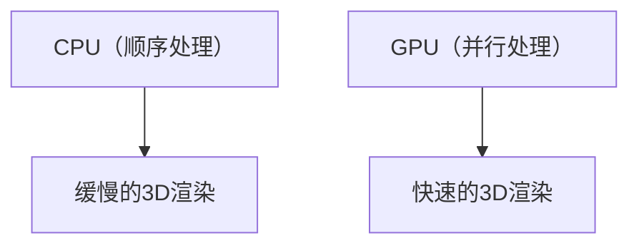

## 1. 创业与3D图形的黎明
1993年，由黄仁勋等人创立。从开发专门用于PC游戏3D图形处理的芯片（GPU）起步。

## 2. CUDA的诞生
2006年发布的“CUDA”，是一个不仅将GPU用于图形处理，还可用于通用计算（GPGPU）的革命性平台。这成为了后来AI热潮的铺垫。

## 3. 深度学习革命
在2012年的ImageNet竞赛中，使用GPU的深度学习模型“AlexNet”取得了压倒性胜利。以此为契机，AI研究人员们开始竞相争购NVIDIA的GPU。

## 4. 走向AI的核心
现在，ChatGPT等庞大的LLM全部都在数万个NVIDIA制GPU（A100或H100）上进行训练和推理。NVIDIA作为AI时代的基础设施企业，已蜕变为市值顶级的企业。

## 追加技术验证部分 1

### 1. 创业与3D图形的黎明
1993年，由黄仁勋等人创立。从开发专门用于PC游戏3D图形处理的芯片（GPU）起步。

### 2. CUDA的诞生
2006年发布的“CUDA”，是一个不仅将GPU用于图形处理，还可用于通用计算（GPGPU）的革命性平台。这成为了后来AI热潮的铺垫。

### 3. 深度学习革命
在2012年的ImageNet竞赛中，使用GPU的深度学习模型“AlexNet”取得了压倒性胜利。以此为契机，AI研究人员们开始竞相争购NVIDIA的GPU。

### 4. 走向AI的核心
现在，ChatGPT等庞大的LLM全部都在数万个NVIDIA制GPU（A100或H100）上进行训练和推理。NVIDIA作为AI时代的基础设施企业，已蜕变为市值顶级的企业。

## 追加技术验证部分 2

### 1. 创业与3D图形的黎明
1993年，由黄仁勋等人创立。从开发专门用于PC游戏3D图形处理的芯片（GPU）起步。

### 2. CUDA的诞生
2006年发布的“CUDA”，是一个不仅将GPU用于图形处理，还可用于通用计算（GPGPU）的革命性平台。这成为了后来AI热潮的铺垫。

### 3. 深度学习革命
在2012年的ImageNet竞赛中，使用GPU的深度学习模型“AlexNet”取得了压倒性胜利。以此为契机，AI研究人员们开始竞相争购NVIDIA的GPU。

### 4. 走向AI的核心
现在，ChatGPT等庞大的LLM全部都在数万个NVIDIA制GPU（A100或H100）上进行训练和推理。NVIDIA作为AI时代的基础设施企业，已蜕变为市值顶级的企业。

## 追加技术验证部分 3

### 1. 创业与3D图形的黎明
1993年，由黄仁勋等人创立。从开发专门用于PC游戏3D图形处理的芯片（GPU）起步。

### 2. CUDA的诞生
2006年发布的“CUDA”，是一个不仅将GPU用于图形处理，还可用于通用计算（GPGPU）的革命性平台。这成为了后来AI热潮的铺垫。

### 3. 深度学习革命
在2012年的ImageNet竞赛中，使用GPU的深度学习模型“AlexNet”取得了压倒性胜利。以此为契机，AI研究人员们开始竞相争购NVIDIA的GPU。

### 4. 走向AI的核心
现在，ChatGPT等庞大的LLM全部都在数万个NVIDIA制GPU（A100或H100）上进行训练和推理。NVIDIA作为AI时代的基础设施企业，已蜕变为市值顶级的企业。

## 追加技术验证部分 4

### 1. 创业与3D图形的黎明
1993年，由黄仁勋等人创立。从开发专门用于PC游戏3D图形处理的芯片（GPU）起步。

### 2. CUDA的诞生
2006年发布的“CUDA”，是一个不仅将GPU用于图形处理，还可用于通用计算（GPGPU）的革命性平台。这成为了后来AI热潮的铺垫。

### 3. 深度学习革命
在2012年的ImageNet竞赛中，使用GPU的深度学习模型“AlexNet”取得了压倒性胜利。以此为契机，AI研究人员们开始竞相争购NVIDIA的GPU。

### 4. 走向AI的核心
现在，ChatGPT等庞大的LLM全部都在数万个NVIDIA制GPU（A100或H100）上进行训练和推理。NVIDIA作为AI时代的基础设施企业，已蜕变为市值顶级的企业。

## 追加技术验证部分 5

### 1. 创业与3D图形的黎明
1993年，由黄仁勋等人创立。从开发专门用于PC游戏3D图形处理的芯片（GPU）起步。

### 2. CUDA的诞生
2006年发布的“CUDA”，是一个不仅将GPU用于图形处理，还可用于通用计算（GPGPU）的革命性平台。这成为了后来AI热潮的铺垫。

### 3. 深度学习革命
在2012年的ImageNet竞赛中，使用GPU的深度学习模型“AlexNet”取得了压倒性胜利。以此为契机，AI研究人员们开始竞相争购NVIDIA的GPU。

### 4. 走向AI的核心
现在，ChatGPT等庞大的LLM全部都在数万个NVIDIA制GPU（A100或H100）上进行训练和推理。NVIDIA作为AI时代的基础设施企业，已蜕变为市值顶级的企业。

## 追加技术验证部分 6

### 1. 创业与3D图形的黎明
1993年，由黄仁勋等人创立。从开发专门用于PC游戏3D图形处理的芯片（GPU）起步。

### 2. CUDA的诞生
2006年发布的“CUDA”，是一个不仅将GPU用于图形处理，还可用于通用计算（GPGPU）的革命性平台。这成为了后来AI热潮的铺垫。

### 3. 深度学习革命
在2012年的ImageNet竞赛中，使用GPU的深度学习模型“AlexNet”取得了压倒性胜利。以此为契机，AI研究人员们开始竞相争购NVIDIA的GPU。

### 4. 走向AI的核心
现在，ChatGPT等庞大的LLM全部都在数万个NVIDIA制GPU（A100或H100）上进行训练和推理。NVIDIA作为AI时代的基础设施企业，已蜕变为市值顶级的企业。

## 追加技术验证部分 7

### 1. 创业与3D图形的黎明
1993年，由黄仁勋等人创立。从开发专门用于PC游戏3D图形处理的芯片（GPU）起步。

### 2. CUDA的诞生
2006年发布的“CUDA”，是一个不仅将GPU用于图形处理，还可用于通用计算（GPGPU）的革命性平台。这成为了后来AI热潮的铺垫。

### 3. 深度学习革命
在2012年的ImageNet竞赛中，使用GPU的深度学习模型“AlexNet”取得了压倒性胜利。以此为契机，AI研究人员们开始竞相争购NVIDIA的GPU。

### 4. 走向AI的核心
现在，ChatGPT等庞大的LLM全部都在数万个NVIDIA制GPU（A100或H100）上进行训练和推理。NVIDIA作为AI时代的基础设施企业，已蜕变为市值顶级的企业。

## 追加技术验证部分 8

### 1. 创业与3D图形的黎明
1993年，由黄仁勋等人创立。从开发专门用于PC游戏3D图形处理的芯片（GPU）起步。

### 2. CUDA的诞生
2006年发布的“CUDA”，是一个不仅将GPU用于图形处理，还可用于通用计算（GPGPU）的革命性平台。这成为了后来AI热潮的铺垫。

### 3. 深度学习革命
在2012年的ImageNet竞赛中，使用GPU的深度学习模型“AlexNet”取得了压倒性胜利。以此为契机，AI研究人员们开始竞相争购NVIDIA的GPU。

### 4. 走向AI的核心
现在，ChatGPT等庞大的LLM全部都在数万个NVIDIA制GPU（A100或H100）上进行训练和推理。NVIDIA作为AI时代的基础设施企业，已蜕变为市值顶级的企业。

## 追加技术验证部分 9

### 1. 创业与3D图形的黎明
1993年，由黄仁勋等人创立。从开发专门用于PC游戏3D图形处理的芯片（GPU）起步。

### 2. CUDA的诞生
2006年发布的“CUDA”，是一个不仅将GPU用于图形处理，还可用于通用计算（GPGPU）的革命性平台。这成为了后来AI热潮的铺垫。

### 3. 深度学习革命
在2012年的ImageNet竞赛中，使用GPU的深度学习模型“AlexNet”取得了压倒性胜利。以此为契机，AI研究人员们开始竞相争购NVIDIA的GPU。

### 4. 走向AI的核心
现在，ChatGPT等庞大的LLM全部都在数万个NVIDIA制GPU（A100或H100）上进行训练和推理。NVIDIA作为AI时代的基础设施企业，已蜕变为市值顶级的企业。

## 追加技术验证部分 10

### 1. 创业与3D图形的黎明
1993年，由黄仁勋等人创立。从开发专门用于PC游戏3D图形处理的芯片（GPU）起步。

### 2. CUDA的诞生
2006年发布的“CUDA”，是一个不仅将GPU用于图形处理，还可用于通用计算（GPGPU）的革命性平台。这成为了后来AI热潮的铺垫。

### 3. 深度学习革命
在2012年的ImageNet竞赛中，使用GPU的深度学习模型“AlexNet”取得了压倒性胜利。以此为契机，AI研究人员们开始竞相争购NVIDIA的GPU。

### 4. 走向AI的核心
现在，ChatGPT等庞大的LLM全部都在数万个NVIDIA制GPU（A100或H100）上进行训练和推理。NVIDIA作为AI时代的基础设施企业，已蜕变为市值顶级的企业。

## 追加技术验证部分 11

### 1. 创业与3D图形的黎明
1993年，由黄仁勋等人创立。从开发专门用于PC游戏3D图形处理的芯片（GPU）起步。

### 2. CUDA的诞生
2006年发布的“CUDA”，是一个不仅将GPU用于图形处理，还可用于通用计算（GPGPU）的革命性平台。这成为了后来AI热潮的铺垫。

### 3. 深度学习革命
在2012年的ImageNet竞赛中，使用GPU的深度学习模型“AlexNet”取得了压倒性胜利。以此为契机，AI研究人员们开始竞相争购NVIDIA的GPU。

### 4. 走向AI的核心
现在，ChatGPT等庞大的LLM全部都在数万个NVIDIA制GPU（A100或H100）上进行训练和推理。NVIDIA作为AI时代的基础设施企业，已蜕变为市值顶级的企业。

## 追加技术验证部分 12

### 1. 创业与3D图形的黎明
1993年，由黄仁勋等人创立。从开发专门用于PC游戏3D图形处理的芯片（GPU）起步。

### 2. CUDA的诞生
2006年发布的“CUDA”，是一个不仅将GPU用于图形处理，还可用于通用计算（GPGPU）的革命性平台。这成为了后来AI热潮的铺垫。

### 3. 深度学习革命
在2012年的ImageNet竞赛中，使用GPU的深度学习模型“AlexNet”取得了压倒性胜利。以此为契机，AI研究人员们开始竞相争购NVIDIA的GPU。

### 4. 走向AI的核心
现在，ChatGPT等庞大的LLM全部都在数万个NVIDIA制GPU（A100或H100）上进行训练和推理。NVIDIA作为AI时代的基础设施企业，已蜕变为市值顶级的企业。

## 追加技术验证部分 13

### 1. 创业与3D图形的黎明
1993年，由黄仁勋等人创立。从开发专门用于PC游戏3D图形处理的芯片（GPU）起步。

### 2. CUDA的诞生
2006年发布的“CUDA”，是一个不仅将GPU用于图形处理，还可用于通用计算（GPGPU）的革命性平台。这成为了后来AI热潮的铺垫。

### 3. 深度学习革命
在2012年的ImageNet竞赛中，使用GPU的深度学习模型“AlexNet”取得了压倒性胜利。以此为契机，AI研究人员们开始竞相争购NVIDIA的GPU。

### 4. 走向AI的核心
现在，ChatGPT等庞大的LLM全部都在数万个NVIDIA制GPU（A100或H100）上进行训练和推理。NVIDIA作为AI时代的基础设施企业，已蜕变为市值顶级的企业。

## 追加技术验证部分 14

### 1. 创业与3D图形的黎明
1993年，由黄仁勋等人创立。从开发专门用于PC游戏3D图形处理的芯片（GPU）起步。

### 2. CUDA的诞生
2006年发布的“CUDA”，是一个不仅将GPU用于图形处理，还可用于通用计算（GPGPU）的革命性平台。这成为了后来AI热潮的铺垫。

### 3. 深度学习革命
在2012年的ImageNet竞赛中，使用GPU的深度学习模型“AlexNet”取得了压倒性胜利。以此为契机，AI研究人员们开始竞相争购NVIDIA的GPU。

### 4. 走向AI的核心
现在，ChatGPT等庞大的LLM全部都在数万个NVIDIA制GPU（A100或H100）上进行训练和推理。NVIDIA作为AI时代的基础设施企业，已蜕变为市值顶级的企业。
