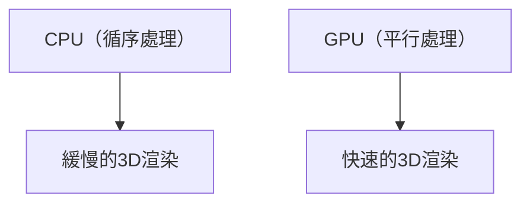

## 1. 創立與3D圖形的黎明
1993年，由黃仁勳等人創立。從專注於PC遊戲3D圖形處理的晶片（GPU）開發起步。

## 2. CUDA的誕生
2006年發表的「CUDA」，是個不僅將GPU用於圖形處理，也能用於通用計算（GPGPU）的劃時代平台。這成為了後來AI熱潮的佈局。

## 3. 深度學習革命
2012年的ImageNet競賽中，使用GPU的深度學習模型「AlexNet」獲得壓倒性勝利。以此為契機，AI研究人員們開始爭相尋求NVIDIA的GPU。

## 4. 邁向AI的心臟
現在，ChatGPT等巨大的LLM全部都在數萬個NVIDIA製GPU（A100或H100）上進行訓練與推論。NVIDIA作為AI時代的基礎設施企業，市值已經蛻變為頂級水準。

## 附加技術驗證部分 1

### 1. 創立與3D圖形的黎明
1993年，由黃仁勳等人創立。從專注於PC遊戲3D圖形處理的晶片（GPU）開發起步。

### 2. CUDA的誕生
2006年發表的「CUDA」，是個不僅將GPU用於圖形處理，也能用於通用計算（GPGPU）的劃時代平台。這成為了後來AI熱潮的佈局。

### 3. 深度學習革命
2012年的ImageNet競賽中，使用GPU的深度學習模型「AlexNet」獲得壓倒性勝利。以此為契機，AI研究人員們開始爭相尋求NVIDIA的GPU。

### 4. 邁向AI的心臟
現在，ChatGPT等巨大的LLM全部都在數萬個NVIDIA製GPU（A100或H100）上進行訓練與推論。NVIDIA作為AI時代的基礎設施企業，市值已經蛻變為頂級水準。

## 附加技術驗證部分 2

### 1. 創立與3D圖形的黎明
1993年，由黃仁勳等人創立。從專注於PC遊戲3D圖形處理的晶片（GPU）開發起步。

### 2. CUDA的誕生
2006年發表的「CUDA」，是個不僅將GPU用於圖形處理，也能用於通用計算（GPGPU）的劃時代平台。這成為了後來AI熱潮的佈局。

### 3. 深度學習革命
2012年的ImageNet競賽中，使用GPU的深度學習模型「AlexNet」獲得壓倒性勝利。以此為契機，AI研究人員們開始爭相尋求NVIDIA的GPU。

### 4. 邁向AI的心臟
現在，ChatGPT等巨大的LLM全部都在數萬個NVIDIA製GPU（A100或H100）上進行訓練與推論。NVIDIA作為AI時代的基礎設施企業，市值已經蛻變為頂級水準。

## 附加技術驗證部分 3

### 1. 創立與3D圖形的黎明
1993年，由黃仁勳等人創立。從專注於PC遊戲3D圖形處理的晶片（GPU）開發起步。

### 2. CUDA的誕生
2006年發表的「CUDA」，是個不僅將GPU用於圖形處理，也能用於通用計算（GPGPU）的劃時代平台。這成為了後來AI熱潮的佈局。

### 3. 深度學習革命
2012年的ImageNet競賽中，使用GPU的深度學習模型「AlexNet」獲得壓倒性勝利。以此為契機，AI研究人員們開始爭相尋求NVIDIA的GPU。

### 4. 邁向AI的心臟
現在，ChatGPT等巨大的LLM全部都在數萬個NVIDIA製GPU（A100或H100）上進行訓練與推論。NVIDIA作為AI時代的基礎設施企業，市值已經蛻變為頂級水準。

## 附加技術驗證部分 4

### 1. 創立與3D圖形的黎明
1993年，由黃仁勳等人創立。從專注於PC遊戲3D圖形處理的晶片（GPU）開發起步。

### 2. CUDA的誕生
2006年發表的「CUDA」，是個不僅將GPU用於圖形處理，也能用於通用計算（GPGPU）的劃時代平台。這成為了後來AI熱潮的佈局。

### 3. 深度學習革命
2012年的ImageNet競賽中，使用GPU的深度學習模型「AlexNet」獲得壓倒性勝利。以此為契機，AI研究人員們開始爭相尋求NVIDIA的GPU。

### 4. 邁向AI的心臟
現在，ChatGPT等巨大的LLM全部都在數萬個NVIDIA製GPU（A100或H100）上進行訓練與推論。NVIDIA作為AI時代的基礎設施企業，市值已經蛻變為頂級水準。

## 附加技術驗證部分 5

### 1. 創立與3D圖形的黎明
1993年，由黃仁勳等人創立。從專注於PC遊戲3D圖形處理的晶片（GPU）開發起步。

### 2. CUDA的誕生
2006年發表的「CUDA」，是個不僅將GPU用於圖形處理，也能用於通用計算（GPGPU）的劃時代平台。這成為了後來AI熱潮的佈局。

### 3. 深度學習革命
2012年的ImageNet競賽中，使用GPU的深度學習模型「AlexNet」獲得壓倒性勝利。以此為契機，AI研究人員們開始爭相尋求NVIDIA的GPU。

### 4. 邁向AI的心臟
現在，ChatGPT等巨大的LLM全部都在數萬個NVIDIA製GPU（A100或H100）上進行訓練與推論。NVIDIA作為AI時代的基礎設施企業，市值已經蛻變為頂級水準。

## 附加技術驗證部分 6

### 1. 創立與3D圖形的黎明
1993年，由黃仁勳等人創立。從專注於PC遊戲3D圖形處理的晶片（GPU）開發起步。

### 2. CUDA的誕生
2006年發表的「CUDA」，是個不僅將GPU用於圖形處理，也能用於通用計算（GPGPU）的劃時代平台。這成為了後來AI熱潮的佈局。

### 3. 深度學習革命
2012年的ImageNet競賽中，使用GPU的深度學習模型「AlexNet」獲得壓倒性勝利。以此為契機，AI研究人員們開始爭相尋求NVIDIA的GPU。

### 4. 邁向AI的心臟
現在，ChatGPT等巨大的LLM全部都在數萬個NVIDIA製GPU（A100或H100）上進行訓練與推論。NVIDIA作為AI時代的基礎設施企業，市值已經蛻變為頂級水準。

## 附加技術驗證部分 7

### 1. 創立與3D圖形的黎明
1993年，由黃仁勳等人創立。從專注於PC遊戲3D圖形處理的晶片（GPU）開發起步。

### 2. CUDA的誕生
2006年發表的「CUDA」，是個不僅將GPU用於圖形處理，也能用於通用計算（GPGPU）的劃時代平台。這成為了後來AI熱潮的佈局。

### 3. 深度學習革命
2012年的ImageNet競賽中，使用GPU的深度學習模型「AlexNet」獲得壓倒性勝利。以此為契機，AI研究人員們開始爭相尋求NVIDIA的GPU。

### 4. 邁向AI的心臟
現在，ChatGPT等巨大的LLM全部都在數萬個NVIDIA製GPU（A100或H100）上進行訓練與推論。NVIDIA作為AI時代的基礎設施企業，市值已經蛻變為頂級水準。

## 附加技術驗證部分 8

### 1. 創立與3D圖形的黎明
1993年，由黃仁勳等人創立。從專注於PC遊戲3D圖形處理的晶片（GPU）開發起步。

### 2. CUDA的誕生
2006年發表的「CUDA」，是個不僅將GPU用於圖形處理，也能用於通用計算（GPGPU）的劃時代平台。這成為了後來AI熱潮的佈局。

### 3. 深度學習革命
2012年的ImageNet競賽中，使用GPU的深度學習模型「AlexNet」獲得壓倒性勝利。以此為契機，AI研究人員們開始爭相尋求NVIDIA的GPU。

### 4. 邁向AI的心臟
現在，ChatGPT等巨大的LLM全部都在數萬個NVIDIA製GPU（A100或H100）上進行訓練與推論。NVIDIA作為AI時代的基礎設施企業，市值已經蛻變為頂級水準。

## 附加技術驗證部分 9

### 1. 創立與3D圖形的黎明
1993年，由黃仁勳等人創立。從專注於PC遊戲3D圖形處理的晶片（GPU）開發起步。

### 2. CUDA的誕生
2006年發表的「CUDA」，是個不僅將GPU用於圖形處理，也能用於通用計算（GPGPU）的劃時代平台。這成為了後來AI熱潮的佈局。

### 3. 深度學習革命
2012年的ImageNet競賽中，使用GPU的深度學習模型「AlexNet」獲得壓倒性勝利。以此為契機，AI研究人員們開始爭相尋求NVIDIA的GPU。

### 4. 邁向AI的心臟
現在，ChatGPT等巨大的LLM全部都在數萬個NVIDIA製GPU（A100或H100）上進行訓練與推論。NVIDIA作為AI時代的基礎設施企業，市值已經蛻變為頂級水準。

## 附加技術驗證部分 10

### 1. 創立與3D圖形的黎明
1993年，由黃仁勳等人創立。從專注於PC遊戲3D圖形處理的晶片（GPU）開發起步。

### 2. CUDA的誕生
2006年發表的「CUDA」，是個不僅將GPU用於圖形處理，也能用於通用計算（GPGPU）的劃時代平台。這成為了後來AI熱潮的佈局。

### 3. 深度學習革命
2012年的ImageNet競賽中，使用GPU的深度學習模型「AlexNet」獲得壓倒性勝利。以此為契機，AI研究人員們開始爭相尋求NVIDIA的GPU。

### 4. 邁向AI的心臟
現在，ChatGPT等巨大的LLM全部都在數萬個NVIDIA製GPU（A100或H100）上進行訓練與推論。NVIDIA作為AI時代的基礎設施企業，市值已經蛻變為頂級水準。

## 附加技術驗證部分 11

### 1. 創立與3D圖形的黎明
1993年，由黃仁勳等人創立。從專注於PC遊戲3D圖形處理的晶片（GPU）開發起步。

### 2. CUDA的誕生
2006年發表的「CUDA」，是個不僅將GPU用於圖形處理，也能用於通用計算（GPGPU）的劃時代平台。這成為了後來AI熱潮的佈局。

### 3. 深度學習革命
2012年的ImageNet競賽中，使用GPU的深度學習模型「AlexNet」獲得壓倒性勝利。以此為契機，AI研究人員們開始爭相尋求NVIDIA的GPU。

### 4. 邁向AI的心臟
現在，ChatGPT等巨大的LLM全部都在數萬個NVIDIA製GPU（A100或H100）上進行訓練與推論。NVIDIA作為AI時代的基礎設施企業，市值已經蛻變為頂級水準。

## 附加技術驗證部分 12

### 1. 創立與3D圖形的黎明
1993年，由黃仁勳等人創立。從專注於PC遊戲3D圖形處理的晶片（GPU）開發起步。

### 2. CUDA的誕生
2006年發表的「CUDA」，是個不僅將GPU用於圖形處理，也能用於通用計算（GPGPU）的劃時代平台。這成為了後來AI熱潮的佈局。

### 3. 深度學習革命
2012年的ImageNet競賽中，使用GPU的深度學習模型「AlexNet」獲得壓倒性勝利。以此為契機，AI研究人員們開始爭相尋求NVIDIA的GPU。

### 4. 邁向AI的心臟
現在，ChatGPT等巨大的LLM全部都在數萬個NVIDIA製GPU（A100或H100）上進行訓練與推論。NVIDIA作為AI時代的基礎設施企業，市值已經蛻變為頂級水準。

## 附加技術驗證部分 13

### 1. 創立與3D圖形的黎明
1993年，由黃仁勳等人創立。從專注於PC遊戲3D圖形處理的晶片（GPU）開發起步。

### 2. CUDA的誕生
2006年發表的「CUDA」，是個不僅將GPU用於圖形處理，也能用於通用計算（GPGPU）的劃時代平台。這成為了後來AI熱潮的佈局。

### 3. 深度學習革命
2012年的ImageNet競賽中，使用GPU的深度學習模型「AlexNet」獲得壓倒性勝利。以此為契機，AI研究人員們開始爭相尋求NVIDIA的GPU。

### 4. 邁向AI的心臟
現在，ChatGPT等巨大的LLM全部都在數萬個NVIDIA製GPU（A100或H100）上進行訓練與推論。NVIDIA作為AI時代的基礎設施企業，市值已經蛻變為頂級水準。

## 附加技術驗證部分 14

### 1. 創立與3D圖形的黎明
1993年，由黃仁勳等人創立。從專注於PC遊戲3D圖形處理的晶片（GPU）開發起步。

### 2. CUDA的誕生
2006年發表的「CUDA」，是個不僅將GPU用於圖形處理，也能用於通用計算（GPGPU）的劃時代平台。這成為了後來AI熱潮的佈局。

### 3. 深度學習革命
2012年的ImageNet競賽中，使用GPU的深度學習模型「AlexNet」獲得壓倒性勝利。以此為契機，AI研究人員們開始爭相尋求NVIDIA的GPU。

### 4. 邁向AI的心臟
現在，ChatGPT等巨大的LLM全部都在數萬個NVIDIA製GPU（A100或H100）上進行訓練與推論。NVIDIA作為AI時代的基礎設施企業，市值已經蛻變為頂級水準。
