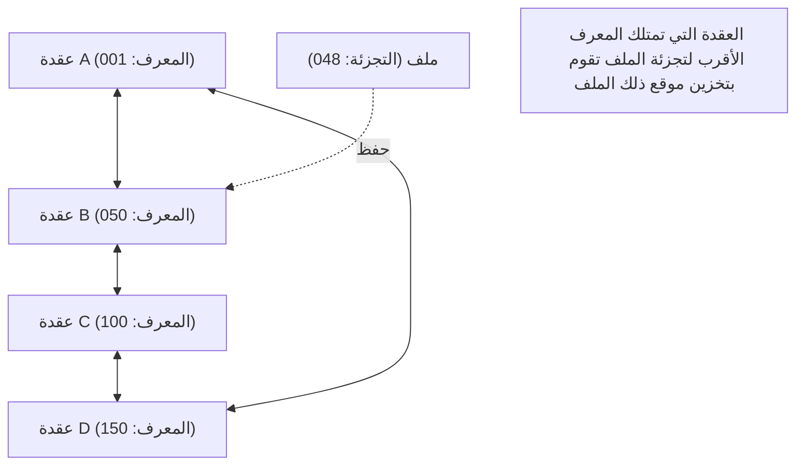

## 1. نموذج الشبكة اللامركزية

في عالم الإنترنت، الغالبية العظمى من نماذج الاتصال التي نستخدمها عادة دون وعي هي "**نموذج العميل والخادم**".
عند تصفح مواقع الويب أو مشاهدة مقاطع الفيديو، تطلب هواتفنا الذكية (العميل) دائماً البيانات من أجهزة كمبيوتر عالية الأداء (الخادم) الموجودة في مراكز بيانات ضخمة وتتلقاها.

ومع ذلك، هناك نقطة ضعف واضحة في هذا النموذج. إنها مشكلة "نقطة الفشل المفردة" (Single Point of Failure)، حيث إذا تركزت الزيارات بشكل كبير على الخادم، فإنه لن يتمكن من مواكبة المعالجة وسيتعطل. كما يعاني من مشكلة هيكلية تتمثل في تركيز التكاليف الباهظة والسلطة في أيدي الشركات التي تقوم بصيانة وإدارة الخوادم.

كطريقة مختلفة تماماً للتعامل مع هذا الأمر، تم ابتكار "**نموذج P2P (الند للند: Peer-to-Peer)**".
في P2P، لا يوجد "خادم" ذو امتيازات. تتبادل جميع أجهزة الكمبيوتر (الأنداد) المشاركة في الشبكة البيانات مباشرة على قدم المساواة (Peer).

## 2. البنى الثلاث لتقنية P2P

تطورت تقنية P2P بشكل كبير إلى ثلاث بنى رئيسية عبر تاريخها.

### الجيل الأول: P2P الهجين (نموذج Napster)
أبرز مثال على ذلك هو "Napster"، الذي ظهر عام 1999 وأحدث ثورة في مشاركة ملفات الموسيقى حول العالم.
يتم تبادل الملفات نفسها بين أجهزة الكمبيوتر الشخصية للمستخدمين (P2P)، ولكن **تتم إدارة معلومات الفهرس (Index) حول "من يمتلك أي ملف" بشكل مركزي بواسطة خادم مركزي**.
كان البحث سريعاً وفعالاً للغاية، ولكن كان هناك نقطة ضعف تتمثل في أنه إذا تم إيقاف الخادم المركزي بأمر قضائي، فإن الشبكة بأكملها تتوقف عن العمل.

### الجيل الثاني: P2P النقي (نموذج Gnutella، Winny)
تزيل هذه الطريقة الخادم المركزي بالكامل، وتقوم بتمرير طلبات البحث بين المستخدمين كفريق التتابع.
من خلال توزيع حتى "الفهرس"، اكتسبت متانة قوية جداً (تسامح مع الأخطاء) حيث لا تتوقف الشبكة حتى لو تعطلت خوادم معينة. ومع ذلك، عانت من "مشكلة قابلية التوسع" حيث تمتلئ الشبكة بأكملها بحزم البحث للعثور على الملف المطلوب، مما يضغط على النطاق الترددي للاتصال.

### الجيل الثالث: P2P باستخدام جدول التجزئة الموزع (DHT)
الطريقة السائدة في تقنية P2P الحالية هي استخدام **جدول التجزئة الموزع (DHT)**. ويستخدم هذا بشكل واسع في BitTorrent وغيرها.

يقوم DHT بتعيين "معرف رياضي (قيمة تجزئة)" لجميع الأنداد والملفات على الشبكة، ويقسم ويدير مساحة الشبكة الشاسعة بناءً على القواعد. عند البحث عن الملف المطلوب، بدلاً من السؤال العشوائي حولك، يتم توجيه طلب البحث عبر أقصر مسار نحو "الند الذي يمتلك المعرف الأقرب لمعرف ذلك الملف"، لذا حتى في الشبكات التي يشارك فيها ملايين الأشخاص، يمكن الوصول إلى البيانات المطلوبة في وقت قصير جداً.

## 3. قوة الأنظمة الموزعة: قابلية التوسع

تكمن أكبر معجزات تقنية P2P في طبيعتها المتناقضة: "**كلما زاد عدد المستخدمين، تحسنت قدرة النظام ككل**".

في نموذج العميل والخادم، إذا وصل عدد المستخدمين إلى مليون، فإن الحمل على الخادم يصبح مليون ضعف.
لكن في شبكة P2P، مشاركة مليون شخص تعني إضافة "طاقة معالجة (CPU) لمليون جهاز ونطاق ترددي لمليون اتصال" إلى النظام في نفس الوقت. كلما زاد عدد الأشخاص الذين يريدون البيانات، زاد عدد الأشخاص الذين يمكنهم توفير تلك البيانات في نفس الوقت، لذلك لن يتعطل النظام ككل أبداً.

تم استغلال هذه الخاصية إلى أقصى حد في بروتوكول "**BitTorrent**"، الذي يسمح لعشرات الآلاف من الأشخاص بتنزيل ملفات ضخمة بسرعة عالية في وقت واحد. ويستخدم هذا البروتوكول على نطاق واسع كتقنية أساسية تدعم البنى التحتية الضخمة الحديثة في الخفاء، مثل توزيع صور نظام التشغيل Windows وتحديثات منصة الألعاب الأكبر في العالم Steam.

## 4. P2P وبلوكتشين: السلالة المؤدية إلى Web3

في عام 2008، بدأ تاريخ جديد لـ P2P من ورقة بحثية نشرها شخص يطلق على نفسه اسم ساتوشي ناكاموتو.
إنه "**بيتكوين (Bitcoin)**".

بينما كانت أنظمة P2P التقليدية تُستخدم لـ "مشاركة الملفات" و"توزيع الحسابات"، استخدم بيتكوين شبكة P2P لـ "**توزيع الثقة**".
حتى بدون وجود بنك مركزي أو مسؤول، يراقب عدد لا يحصى من العقد المشاركة في شبكة P2P سجلات المعاملات (دفتر الأستاذ) لبعضهم البعض، ومن خلال الجمع بين التشفير (دوال التجزئة وتشفير المفتاح العام) وخوارزمية الإجماع (إثبات العمل)، قاموا ببناء "**نظام موزع يجعل التلاعب بالبيانات شبه مستحيل = بلوكتشين**".

ترتبط هذه الفكرة المتمثلة في "الشبكات المستقلة والموزعة التي لا تعتمد على مدير معين" ارتباطاً مباشراً بحركة "Web3 (الويب اللامركزي)" الحالية.

## 5. تحديات ومستقبل تقنية P2P

تعد P2P تقنية رائعة، ولكن هناك أيضاً بعض التحديات.
أحدها هو مشكلة "**الركاب المجانيين**" (Free riders). إذا زاد عدد المستخدمين الذين يتلقون البيانات فقط دون توفيرها، فستتراجع الشبكة. لحل هذه المشكلة، يتم البحث في آليات تمنح حق التنزيل التفضيلي بناءً على كمية المساهمة، وآليات توفر حوافز مالية (رموز) مثل بلوكتشين.

الآخر هو "**الحوكمة والأمن**". نظراً لعدم وجود مدير مركزي، إذا قامت عقدة خبيثة بنشر بيانات مزيفة أو فيروسات، فمن الصعب حظرها على الفور.

ليست P2P مجرد تقنية "لبرامج مشاركة الملفات". إنها قمة "الأنظمة الموزعة" في علوم الكمبيوتر، وبنية ذات فلسفة قوية تتمثل في عدم تركيز السلطة في نقطة واحدة. في المستقبل أيضاً، ستستمر تقنية P2P في التطور كأساس للاتصال بين أجهزة إنترنت الأشياء (IoT) والبنية التحتية لشبكة الإنترنت الموزعة من الجيل القادم.
