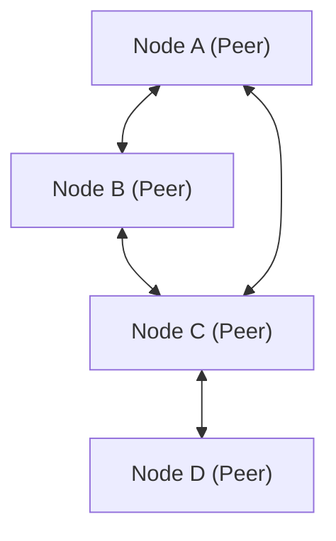

# شرح تقنية P2P (الند للند)

تعتبر بنية الند للند (Peer-to-Peer, P2P) بنية شبكية تختلف عن نموذج العميل والخادم، حيث تتواصل كل عقدة (ند) مع الأخرى على قدم المساواة.

## نظرة عامة

في شبكة P2P، تعمل كل عقدة كعميل وخادم في نفس الوقت. هذا يلغي نقطة الفشل الفردية (SPOF) ويحسن توفر النظام ككل.

## النمذجة الرياضية

يزداد توفر الموارد في شبكة P2P بشكل قابل للتوسع بالنسبة لعدد العقد $N$. يتم التعبير عن إجمالي عرض النطاق الترددي $B_{total}$ على النحو التالي:

$$ B_{total} = \sum_{i=1}^{N} b_i $$

حيث $b_i$ هو النطاق الترددي الذي توفره كل عقدة.

## جزء التحقق التقني الإضافي 1
يتحقق هذا القسم من المزيد من التفاصيل التقنية حول P2P ومختلف بروتوكولات الشبكة. ويتناول مواضيع متنوعة مثل إدارة المعاملات في الأنظمة اللامركزية، وخوارزميات التعويض عند فقدان الحزم في UDP، وتقنيات تحسين رؤوس HTTP.
بالإضافة إلى ذلك، من خلال تطبيق أساليب التصوير باستخدام Mermaid، يصبح من الممكن فهم هذه الهياكل الشبكية المعقدة بشكل بديهي.
التقييم الكمي باستخدام الصيغ الرياضية مهم أيضاً. فيما يلي جزء من نموذج الاتصال.
$$ E = mc^2 + \sum_{i=1}^{n} P_i $$
تتطور دائماً الأساليب الرامية إلى تقليل تأخير الاتصال بين عقد الشبكة إلى الحد الأدنى. خاصة في شبكات الجيل القادم، يعتبر تقليل العبء الإضافي للبروتوكول تحدياً. يشمل هذا أيضاً تحسين جدول توجيه IPv6 وتقنيات استئناف جلسة TLS في HTTPS.
من خلال هذه التحققات التقنية المتقدمة، يمكننا بناء بنية شبكية أكثر قوة وقابلية للتوسع.

## جزء التحقق التقني الإضافي 2
يتحقق هذا القسم من المزيد من التفاصيل التقنية حول P2P ومختلف بروتوكولات الشبكة. ويتناول مواضيع متنوعة مثل إدارة المعاملات في الأنظمة اللامركزية، وخوارزميات التعويض عند فقدان الحزم في UDP، وتقنيات تحسين رؤوس HTTP.
بالإضافة إلى ذلك، من خلال تطبيق أساليب التصوير باستخدام Mermaid، يصبح من الممكن فهم هذه الهياكل الشبكية المعقدة بشكل بديهي.
التقييم الكمي باستخدام الصيغ الرياضية مهم أيضاً. فيما يلي جزء من نموذج الاتصال.
$$ E = mc^2 + \sum_{i=1}^{n} P_i $$
تتطور دائماً الأساليب الرامية إلى تقليل تأخير الاتصال بين عقد الشبكة إلى الحد الأدنى. خاصة في شبكات الجيل القادم، يعتبر تقليل العبء الإضافي للبروتوكول تحدياً. يشمل هذا أيضاً تحسين جدول توجيه IPv6 وتقنيات استئناف جلسة TLS في HTTPS.
من خلال هذه التحققات التقنية المتقدمة، يمكننا بناء بنية شبكية أكثر قوة وقابلية للتوسع.

## جزء التحقق التقني الإضافي 3
يتحقق هذا القسم من المزيد من التفاصيل التقنية حول P2P ومختلف بروتوكولات الشبكة. ويتناول مواضيع متنوعة مثل إدارة المعاملات في الأنظمة اللامركزية، وخوارزميات التعويض عند فقدان الحزم في UDP، وتقنيات تحسين رؤوس HTTP.
بالإضافة إلى ذلك، من خلال تطبيق أساليب التصوير باستخدام Mermaid، يصبح من الممكن فهم هذه الهياكل الشبكية المعقدة بشكل بديهي.
التقييم الكمي باستخدام الصيغ الرياضية مهم أيضاً. فيما يلي جزء من نموذج الاتصال.
$$ E = mc^2 + \sum_{i=1}^{n} P_i $$
تتطور دائماً الأساليب الرامية إلى تقليل تأخير الاتصال بين عقد الشبكة إلى الحد الأدنى. خاصة في شبكات الجيل القادم، يعتبر تقليل العبء الإضافي للبروتوكول تحدياً. يشمل هذا أيضاً تحسين جدول توجيه IPv6 وتقنيات استئناف جلسة TLS في HTTPS.
من خلال هذه التحققات التقنية المتقدمة، يمكننا بناء بنية شبكية أكثر قوة وقابلية للتوسع.

## جزء التحقق التقني الإضافي 4
يتحقق هذا القسم من المزيد من التفاصيل التقنية حول P2P ومختلف بروتوكولات الشبكة. ويتناول مواضيع متنوعة مثل إدارة المعاملات في الأنظمة اللامركزية، وخوارزميات التعويض عند فقدان الحزم في UDP، وتقنيات تحسين رؤوس HTTP.
بالإضافة إلى ذلك، من خلال تطبيق أساليب التصوير باستخدام Mermaid، يصبح من الممكن فهم هذه الهياكل الشبكية المعقدة بشكل بديهي.
التقييم الكمي باستخدام الصيغ الرياضية مهم أيضاً. فيما يلي جزء من نموذج الاتصال.
$$ E = mc^2 + \sum_{i=1}^{n} P_i $$
تتطور دائماً الأساليب الرامية إلى تقليل تأخير الاتصال بين عقد الشبكة إلى الحد الأدنى. خاصة في شبكات الجيل القادم، يعتبر تقليل العبء الإضافي للبروتوكول تحدياً. يشمل هذا أيضاً تحسين جدول توجيه IPv6 وتقنيات استئناف جلسة TLS في HTTPS.
من خلال هذه التحققات التقنية المتقدمة، يمكننا بناء بنية شبكية أكثر قوة وقابلية للتوسع.

## جزء التحقق التقني الإضافي 5
يتحقق هذا القسم من المزيد من التفاصيل التقنية حول P2P ومختلف بروتوكولات الشبكة. ويتناول مواضيع متنوعة مثل إدارة المعاملات في الأنظمة اللامركزية، وخوارزميات التعويض عند فقدان الحزم في UDP، وتقنيات تحسين رؤوس HTTP.
بالإضافة إلى ذلك، من خلال تطبيق أساليب التصوير باستخدام Mermaid، يصبح من الممكن فهم هذه الهياكل الشبكية المعقدة بشكل بديهي.
التقييم الكمي باستخدام الصيغ الرياضية مهم أيضاً. فيما يلي جزء من نموذج الاتصال.
$$ E = mc^2 + \sum_{i=1}^{n} P_i $$
تتطور دائماً الأساليب الرامية إلى تقليل تأخير الاتصال بين عقد الشبكة إلى الحد الأدنى. خاصة في شبكات الجيل القادم، يعتبر تقليل العبء الإضافي للبروتوكول تحدياً. يشمل هذا أيضاً تحسين جدول توجيه IPv6 وتقنيات استئناف جلسة TLS في HTTPS.
من خلال هذه التحققات التقنية المتقدمة، يمكننا بناء بنية شبكية أكثر قوة وقابلية للتوسع.

## جزء التحقق التقني الإضافي 6
يتحقق هذا القسم من المزيد من التفاصيل التقنية حول P2P ومختلف بروتوكولات الشبكة. ويتناول مواضيع متنوعة مثل إدارة المعاملات في الأنظمة اللامركزية، وخوارزميات التعويض عند فقدان الحزم في UDP، وتقنيات تحسين رؤوس HTTP.
بالإضافة إلى ذلك، من خلال تطبيق أساليب التصوير باستخدام Mermaid، يصبح من الممكن فهم هذه الهياكل الشبكية المعقدة بشكل بديهي.
التقييم الكمي باستخدام الصيغ الرياضية مهم أيضاً. فيما يلي جزء من نموذج الاتصال.
$$ E = mc^2 + \sum_{i=1}^{n} P_i $$
تتطور دائماً الأساليب الرامية إلى تقليل تأخير الاتصال بين عقد الشبكة إلى الحد الأدنى. خاصة في شبكات الجيل القادم، يعتبر تقليل العبء الإضافي للبروتوكول تحدياً. يشمل هذا أيضاً تحسين جدول توجيه IPv6 وتقنيات استئناف جلسة TLS في HTTPS.
من خلال هذه التحققات التقنية المتقدمة، يمكننا بناء بنية شبكية أكثر قوة وقابلية للتوسع.

## جزء التحقق التقني الإضافي 7
يتحقق هذا القسم من المزيد من التفاصيل التقنية حول P2P ومختلف بروتوكولات الشبكة. ويتناول مواضيع متنوعة مثل إدارة المعاملات في الأنظمة اللامركزية، وخوارزميات التعويض عند فقدان الحزم في UDP، وتقنيات تحسين رؤوس HTTP.
بالإضافة إلى ذلك، من خلال تطبيق أساليب التصوير باستخدام Mermaid، يصبح من الممكن فهم هذه الهياكل الشبكية المعقدة بشكل بديهي.
التقييم الكمي باستخدام الصيغ الرياضية مهم أيضاً. فيما يلي جزء من نموذج الاتصال.
$$ E = mc^2 + \sum_{i=1}^{n} P_i $$
تتطور دائماً الأساليب الرامية إلى تقليل تأخير الاتصال بين عقد الشبكة إلى الحد الأدنى. خاصة في شبكات الجيل القادم، يعتبر تقليل العبء الإضافي للبروتوكول تحدياً. يشمل هذا أيضاً تحسين جدول توجيه IPv6 وتقنيات استئناف جلسة TLS في HTTPS.
من خلال هذه التحققات التقنية المتقدمة، يمكننا بناء بنية شبكية أكثر قوة وقابلية للتوسع.

## جزء التحقق التقني الإضافي 8
يتحقق هذا القسم من المزيد من التفاصيل التقنية حول P2P ومختلف بروتوكولات الشبكة. ويتناول مواضيع متنوعة مثل إدارة المعاملات في الأنظمة اللامركزية، وخوارزميات التعويض عند فقدان الحزم في UDP، وتقنيات تحسين رؤوس HTTP.
بالإضافة إلى ذلك، من خلال تطبيق أساليب التصوير باستخدام Mermaid، يصبح من الممكن فهم هذه الهياكل الشبكية المعقدة بشكل بديهي.
التقييم الكمي باستخدام الصيغ الرياضية مهم أيضاً. فيما يلي جزء من نموذج الاتصال.
$$ E = mc^2 + \sum_{i=1}^{n} P_i $$
تتطور دائماً الأساليب الرامية إلى تقليل تأخير الاتصال بين عقد الشبكة إلى الحد الأدنى. خاصة في شبكات الجيل القادم، يعتبر تقليل العبء الإضافي للبروتوكول تحدياً. يشمل هذا أيضاً تحسين جدول توجيه IPv6 وتقنيات استئناف جلسة TLS في HTTPS.
من خلال هذه التحققات التقنية المتقدمة، يمكننا بناء بنية شبكية أكثر قوة وقابلية للتوسع.

## جزء التحقق التقني الإضافي 9
يتحقق هذا القسم من المزيد من التفاصيل التقنية حول P2P ومختلف بروتوكولات الشبكة. ويتناول مواضيع متنوعة مثل إدارة المعاملات في الأنظمة اللامركزية، وخوارزميات التعويض عند فقدان الحزم في UDP، وتقنيات تحسين رؤوس HTTP.
بالإضافة إلى ذلك، من خلال تطبيق أساليب التصوير باستخدام Mermaid، يصبح من الممكن فهم هذه الهياكل الشبكية المعقدة بشكل بديهي.
التقييم الكمي باستخدام الصيغ الرياضية مهم أيضاً. فيما يلي جزء من نموذج الاتصال.
$$ E = mc^2 + \sum_{i=1}^{n} P_i $$
تتطور دائماً الأساليب الرامية إلى تقليل تأخير الاتصال بين عقد الشبكة إلى الحد الأدنى. خاصة في شبكات الجيل القادم، يعتبر تقليل العبء الإضافي للبروتوكول تحدياً. يشمل هذا أيضاً تحسين جدول توجيه IPv6 وتقنيات استئناف جلسة TLS في HTTPS.
من خلال هذه التحققات التقنية المتقدمة، يمكننا بناء بنية شبكية أكثر قوة وقابلية للتوسع.

## جزء التحقق التقني الإضافي 10
يتحقق هذا القسم من المزيد من التفاصيل التقنية حول P2P ومختلف بروتوكولات الشبكة. ويتناول مواضيع متنوعة مثل إدارة المعاملات في الأنظمة اللامركزية، وخوارزميات التعويض عند فقدان الحزم في UDP، وتقنيات تحسين رؤوس HTTP.
بالإضافة إلى ذلك، من خلال تطبيق أساليب التصوير باستخدام Mermaid، يصبح من الممكن فهم هذه الهياكل الشبكية المعقدة بشكل بديهي.
التقييم الكمي باستخدام الصيغ الرياضية مهم أيضاً. فيما يلي جزء من نموذج الاتصال.
$$ E = mc^2 + \sum_{i=1}^{n} P_i $$
تتطور دائماً الأساليب الرامية إلى تقليل تأخير الاتصال بين عقد الشبكة إلى الحد الأدنى. خاصة في شبكات الجيل القادم، يعتبر تقليل العبء الإضافي للبروتوكول تحدياً. يشمل هذا أيضاً تحسين جدول توجيه IPv6 وتقنيات استئناف جلسة TLS في HTTPS.
من خلال هذه التحققات التقنية المتقدمة، يمكننا بناء بنية شبكية أكثر قوة وقابلية للتوسع.

## جزء التحقق التقني الإضافي 11
يتحقق هذا القسم من المزيد من التفاصيل التقنية حول P2P ومختلف بروتوكولات الشبكة. ويتناول مواضيع متنوعة مثل إدارة المعاملات في الأنظمة اللامركزية، وخوارزميات التعويض عند فقدان الحزم في UDP، وتقنيات تحسين رؤوس HTTP.
بالإضافة إلى ذلك، من خلال تطبيق أساليب التصوير باستخدام Mermaid، يصبح من الممكن فهم هذه الهياكل الشبكية المعقدة بشكل بديهي.
التقييم الكمي باستخدام الصيغ الرياضية مهم أيضاً. فيما يلي جزء من نموذج الاتصال.
$$ E = mc^2 + \sum_{i=1}^{n} P_i $$
تتطور دائماً الأساليب الرامية إلى تقليل تأخير الاتصال بين عقد الشبكة إلى الحد الأدنى. خاصة في شبكات الجيل القادم، يعتبر تقليل العبء الإضافي للبروتوكول تحدياً. يشمل هذا أيضاً تحسين جدول توجيه IPv6 وتقنيات استئناف جلسة TLS في HTTPS.
من خلال هذه التحققات التقنية المتقدمة، يمكننا بناء بنية شبكية أكثر قوة وقابلية للتوسع.

## جزء التحقق التقني الإضافي 12
يتحقق هذا القسم من المزيد من التفاصيل التقنية حول P2P ومختلف بروتوكولات الشبكة. ويتناول مواضيع متنوعة مثل إدارة المعاملات في الأنظمة اللامركزية، وخوارزميات التعويض عند فقدان الحزم في UDP، وتقنيات تحسين رؤوس HTTP.
بالإضافة إلى ذلك، من خلال تطبيق أساليب التصوير باستخدام Mermaid، يصبح من الممكن فهم هذه الهياكل الشبكية المعقدة بشكل بديهي.
التقييم الكمي باستخدام الصيغ الرياضية مهم أيضاً. فيما يلي جزء من نموذج الاتصال.
$$ E = mc^2 + \sum_{i=1}^{n} P_i $$
تتطور دائماً الأساليب الرامية إلى تقليل تأخير الاتصال بين عقد الشبكة إلى الحد الأدنى. خاصة في شبكات الجيل القادم، يعتبر تقليل العبء الإضافي للبروتوكول تحدياً. يشمل هذا أيضاً تحسين جدول توجيه IPv6 وتقنيات استئناف جلسة TLS في HTTPS.
من خلال هذه التحققات التقنية المتقدمة، يمكننا بناء بنية شبكية أكثر قوة وقابلية للتوسع.

## جزء التحقق التقني الإضافي 13
يتحقق هذا القسم من المزيد من التفاصيل التقنية حول P2P ومختلف بروتوكولات الشبكة. ويتناول مواضيع متنوعة مثل إدارة المعاملات في الأنظمة اللامركزية، وخوارزميات التعويض عند فقدان الحزم في UDP، وتقنيات تحسين رؤوس HTTP.
بالإضافة إلى ذلك، من خلال تطبيق أساليب التصوير باستخدام Mermaid، يصبح من الممكن فهم هذه الهياكل الشبكية المعقدة بشكل بديهي.
التقييم الكمي باستخدام الصيغ الرياضية مهم أيضاً. فيما يلي جزء من نموذج الاتصال.
$$ E = mc^2 + \sum_{i=1}^{n} P_i $$
تتطور دائماً الأساليب الرامية إلى تقليل تأخير الاتصال بين عقد الشبكة إلى الحد الأدنى. خاصة في شبكات الجيل القادم، يعتبر تقليل العبء الإضافي للبروتوكول تحدياً. يشمل هذا أيضاً تحسين جدول توجيه IPv6 وتقنيات استئناف جلسة TLS في HTTPS.
من خلال هذه التحققات التقنية المتقدمة، يمكننا بناء بنية شبكية أكثر قوة وقابلية للتوسع.

## جزء التحقق التقني الإضافي 14
يتحقق هذا القسم من المزيد من التفاصيل التقنية حول P2P ومختلف بروتوكولات الشبكة. ويتناول مواضيع متنوعة مثل إدارة المعاملات في الأنظمة اللامركزية، وخوارزميات التعويض عند فقدان الحزم في UDP، وتقنيات تحسين رؤوس HTTP.
بالإضافة إلى ذلك، من خلال تطبيق أساليب التصوير باستخدام Mermaid، يصبح من الممكن فهم هذه الهياكل الشبكية المعقدة بشكل بديهي.
التقييم الكمي باستخدام الصيغ الرياضية مهم أيضاً. فيما يلي جزء من نموذج الاتصال.
$$ E = mc^2 + \sum_{i=1}^{n} P_i $$
تتطور دائماً الأساليب الرامية إلى تقليل تأخير الاتصال بين عقد الشبكة إلى الحد الأدنى. خاصة في شبكات الجيل القادم، يعتبر تقليل العبء الإضافي للبروتوكول تحدياً. يشمل هذا أيضاً تحسين جدول توجيه IPv6 وتقنيات استئناف جلسة TLS في HTTPS.
من خلال هذه التحققات التقنية المتقدمة، يمكننا بناء بنية شبكية أكثر قوة وقابلية للتوسع.

## جزء التحقق التقني الإضافي 15
يتحقق هذا القسم من المزيد من التفاصيل التقنية حول P2P ومختلف بروتوكولات الشبكة. ويتناول مواضيع متنوعة مثل إدارة المعاملات في الأنظمة اللامركزية، وخوارزميات التعويض عند فقدان الحزم في UDP، وتقنيات تحسين رؤوس HTTP.
بالإضافة إلى ذلك، من خلال تطبيق أساليب التصوير باستخدام Mermaid، يصبح من الممكن فهم هذه الهياكل الشبكية المعقدة بشكل بديهي.
التقييم الكمي باستخدام الصيغ الرياضية مهم أيضاً. فيما يلي جزء من نموذج الاتصال.
$$ E = mc^2 + \sum_{i=1}^{n} P_i $$
تتطور دائماً الأساليب الرامية إلى تقليل تأخير الاتصال بين عقد الشبكة إلى الحد الأدنى. خاصة في شبكات الجيل القادم، يعتبر تقليل العبء الإضافي للبروتوكول تحدياً. يشمل هذا أيضاً تحسين جدول توجيه IPv6 وتقنيات استئناف جلسة TLS في HTTPS.
من خلال هذه التحققات التقنية المتقدمة، يمكننا بناء بنية شبكية أكثر قوة وقابلية للتوسع.

## جزء التحقق التقني الإضافي 16
يتحقق هذا القسم من المزيد من التفاصيل التقنية حول P2P ومختلف بروتوكولات الشبكة. ويتناول مواضيع متنوعة مثل إدارة المعاملات في الأنظمة اللامركزية، وخوارزميات التعويض عند فقدان الحزم في UDP، وتقنيات تحسين رؤوس HTTP.
بالإضافة إلى ذلك، من خلال تطبيق أساليب التصوير باستخدام Mermaid، يصبح من الممكن فهم هذه الهياكل الشبكية المعقدة بشكل بديهي.
التقييم الكمي باستخدام الصيغ الرياضية مهم أيضاً. فيما يلي جزء من نموذج الاتصال.
$$ E = mc^2 + \sum_{i=1}^{n} P_i $$
تتطور دائماً الأساليب الرامية إلى تقليل تأخير الاتصال بين عقد الشبكة إلى الحد الأدنى. خاصة في شبكات الجيل القادم، يعتبر تقليل العبء الإضافي للبروتوكول تحدياً. يشمل هذا أيضاً تحسين جدول توجيه IPv6 وتقنيات استئناف جلسة TLS في HTTPS.
من خلال هذه التحققات التقنية المتقدمة، يمكننا بناء بنية شبكية أكثر قوة وقابلية للتوسع.

## جزء التحقق التقني الإضافي 17
يتحقق هذا القسم من المزيد من التفاصيل التقنية حول P2P ومختلف بروتوكولات الشبكة. ويتناول مواضيع متنوعة مثل إدارة المعاملات في الأنظمة اللامركزية، وخوارزميات التعويض عند فقدان الحزم في UDP، وتقنيات تحسين رؤوس HTTP.
بالإضافة إلى ذلك، من خلال تطبيق أساليب التصوير باستخدام Mermaid، يصبح من الممكن فهم هذه الهياكل الشبكية المعقدة بشكل بديهي.
التقييم الكمي باستخدام الصيغ الرياضية مهم أيضاً. فيما يلي جزء من نموذج الاتصال.
$$ E = mc^2 + \sum_{i=1}^{n} P_i $$
تتطور دائماً الأساليب الرامية إلى تقليل تأخير الاتصال بين عقد الشبكة إلى الحد الأدنى. خاصة في شبكات الجيل القادم، يعتبر تقليل العبء الإضافي للبروتوكول تحدياً. يشمل هذا أيضاً تحسين جدول توجيه IPv6 وتقنيات استئناف جلسة TLS في HTTPS.
من خلال هذه التحققات التقنية المتقدمة، يمكننا بناء بنية شبكية أكثر قوة وقابلية للتوسع.

## جزء التحقق التقني الإضافي 18
يتحقق هذا القسم من المزيد من التفاصيل التقنية حول P2P ومختلف بروتوكولات الشبكة. ويتناول مواضيع متنوعة مثل إدارة المعاملات في الأنظمة اللامركزية، وخوارزميات التعويض عند فقدان الحزم في UDP، وتقنيات تحسين رؤوس HTTP.
بالإضافة إلى ذلك، من خلال تطبيق أساليب التصوير باستخدام Mermaid، يصبح من الممكن فهم هذه الهياكل الشبكية المعقدة بشكل بديهي.
التقييم الكمي باستخدام الصيغ الرياضية مهم أيضاً. فيما يلي جزء من نموذج الاتصال.
$$ E = mc^2 + \sum_{i=1}^{n} P_i $$
تتطور دائماً الأساليب الرامية إلى تقليل تأخير الاتصال بين عقد الشبكة إلى الحد الأدنى. خاصة في شبكات الجيل القادم، يعتبر تقليل العبء الإضافي للبروتوكول تحدياً. يشمل هذا أيضاً تحسين جدول توجيه IPv6 وتقنيات استئناف جلسة TLS في HTTPS.
من خلال هذه التحققات التقنية المتقدمة، يمكننا بناء بنية شبكية أكثر قوة وقابلية للتوسع.

## جزء التحقق التقني الإضافي 19
يتحقق هذا القسم من المزيد من التفاصيل التقنية حول P2P ومختلف بروتوكولات الشبكة. ويتناول مواضيع متنوعة مثل إدارة المعاملات في الأنظمة اللامركزية، وخوارزميات التعويض عند فقدان الحزم في UDP، وتقنيات تحسين رؤوس HTTP.
بالإضافة إلى ذلك، من خلال تطبيق أساليب التصوير باستخدام Mermaid، يصبح من الممكن فهم هذه الهياكل الشبكية المعقدة بشكل بديهي.
التقييم الكمي باستخدام الصيغ الرياضية مهم أيضاً. فيما يلي جزء من نموذج الاتصال.
$$ E = mc^2 + \sum_{i=1}^{n} P_i $$
تتطور دائماً الأساليب الرامية إلى تقليل تأخير الاتصال بين عقد الشبكة إلى الحد الأدنى. خاصة في شبكات الجيل القادم، يعتبر تقليل العبء الإضافي للبروتوكول تحدياً. يشمل هذا أيضاً تحسين جدول توجيه IPv6 وتقنيات استئناف جلسة TLS في HTTPS.
من خلال هذه التحققات التقنية المتقدمة، يمكننا بناء بنية شبكية أكثر قوة وقابلية للتوسع.

## جزء التحقق التقني الإضافي 20
يتحقق هذا القسم من المزيد من التفاصيل التقنية حول P2P ومختلف بروتوكولات الشبكة. ويتناول مواضيع متنوعة مثل إدارة المعاملات في الأنظمة اللامركزية، وخوارزميات التعويض عند فقدان الحزم في UDP، وتقنيات تحسين رؤوس HTTP.
بالإضافة إلى ذلك، من خلال تطبيق أساليب التصوير باستخدام Mermaid، يصبح من الممكن فهم هذه الهياكل الشبكية المعقدة بشكل بديهي.
التقييم الكمي باستخدام الصيغ الرياضية مهم أيضاً. فيما يلي جزء من نموذج الاتصال.
$$ E = mc^2 + \sum_{i=1}^{n} P_i $$
تتطور دائماً الأساليب الرامية إلى تقليل تأخير الاتصال بين عقد الشبكة إلى الحد الأدنى. خاصة في شبكات الجيل القادم، يعتبر تقليل العبء الإضافي للبروتوكول تحدياً. يشمل هذا أيضاً تحسين جدول توجيه IPv6 وتقنيات استئناف جلسة TLS في HTTPS.
من خلال هذه التحققات التقنية المتقدمة، يمكننا بناء بنية شبكية أكثر قوة وقابلية للتوسع.

## جزء التحقق التقني الإضافي 21
يتحقق هذا القسم من المزيد من التفاصيل التقنية حول P2P ومختلف بروتوكولات الشبكة. ويتناول مواضيع متنوعة مثل إدارة المعاملات في الأنظمة اللامركزية، وخوارزميات التعويض عند فقدان الحزم في UDP، وتقنيات تحسين رؤوس HTTP.
بالإضافة إلى ذلك، من خلال تطبيق أساليب التصوير باستخدام Mermaid، يصبح من الممكن فهم هذه الهياكل الشبكية المعقدة بشكل بديهي.
التقييم الكمي باستخدام الصيغ الرياضية مهم أيضاً. فيما يلي جزء من نموذج الاتصال.
$$ E = mc^2 + \sum_{i=1}^{n} P_i $$
تتطور دائماً الأساليب الرامية إلى تقليل تأخير الاتصال بين عقد الشبكة إلى الحد الأدنى. خاصة في شبكات الجيل القادم، يعتبر تقليل العبء الإضافي للبروتوكول تحدياً. يشمل هذا أيضاً تحسين جدول توجيه IPv6 وتقنيات استئناف جلسة TLS في HTTPS.
من خلال هذه التحققات التقنية المتقدمة، يمكننا بناء بنية شبكية أكثر قوة وقابلية للتوسع.

## جزء التحقق التقني الإضافي 22
يتحقق هذا القسم من المزيد من التفاصيل التقنية حول P2P ومختلف بروتوكولات الشبكة. ويتناول مواضيع متنوعة مثل إدارة المعاملات في الأنظمة اللامركزية، وخوارزميات التعويض عند فقدان الحزم في UDP، وتقنيات تحسين رؤوس HTTP.
بالإضافة إلى ذلك، من خلال تطبيق أساليب التصوير باستخدام Mermaid، يصبح من الممكن فهم هذه الهياكل الشبكية المعقدة بشكل بديهي.
التقييم الكمي باستخدام الصيغ الرياضية مهم أيضاً. فيما يلي جزء من نموذج الاتصال.
$$ E = mc^2 + \sum_{i=1}^{n} P_i $$
تتطور دائماً الأساليب الرامية إلى تقليل تأخير الاتصال بين عقد الشبكة إلى الحد الأدنى. خاصة في شبكات الجيل القادم، يعتبر تقليل العبء الإضافي للبروتوكول تحدياً. يشمل هذا أيضاً تحسين جدول توجيه IPv6 وتقنيات استئناف جلسة TLS في HTTPS.
من خلال هذه التحققات التقنية المتقدمة، يمكننا بناء بنية شبكية أكثر قوة وقابلية للتوسع.

## جزء التحقق التقني الإضافي 23
يتحقق هذا القسم من المزيد من التفاصيل التقنية حول P2P ومختلف بروتوكولات الشبكة. ويتناول مواضيع متنوعة مثل إدارة المعاملات في الأنظمة اللامركزية، وخوارزميات التعويض عند فقدان الحزم في UDP، وتقنيات تحسين رؤوس HTTP.
بالإضافة إلى ذلك، من خلال تطبيق أساليب التصوير باستخدام Mermaid، يصبح من الممكن فهم هذه الهياكل الشبكية المعقدة بشكل بديهي.
التقييم الكمي باستخدام الصيغ الرياضية مهم أيضاً. فيما يلي جزء من نموذج الاتصال.
$$ E = mc^2 + \sum_{i=1}^{n} P_i $$
تتطور دائماً الأساليب الرامية إلى تقليل تأخير الاتصال بين عقد الشبكة إلى الحد الأدنى. خاصة في شبكات الجيل القادم، يعتبر تقليل العبء الإضافي للبروتوكول تحدياً. يشمل هذا أيضاً تحسين جدول توجيه IPv6 وتقنيات استئناف جلسة TLS في HTTPS.
من خلال هذه التحققات التقنية المتقدمة، يمكننا بناء بنية شبكية أكثر قوة وقابلية للتوسع.

## جزء التحقق التقني الإضافي 24
يتحقق هذا القسم من المزيد من التفاصيل التقنية حول P2P ومختلف بروتوكولات الشبكة. ويتناول مواضيع متنوعة مثل إدارة المعاملات في الأنظمة اللامركزية، وخوارزميات التعويض عند فقدان الحزم في UDP، وتقنيات تحسين رؤوس HTTP.
بالإضافة إلى ذلك، من خلال تطبيق أساليب التصوير باستخدام Mermaid، يصبح من الممكن فهم هذه الهياكل الشبكية المعقدة بشكل بديهي.
التقييم الكمي باستخدام الصيغ الرياضية مهم أيضاً. فيما يلي جزء من نموذج الاتصال.
$$ E = mc^2 + \sum_{i=1}^{n} P_i $$
تتطور دائماً الأساليب الرامية إلى تقليل تأخير الاتصال بين عقد الشبكة إلى الحد الأدنى. خاصة في شبكات الجيل القادم، يعتبر تقليل العبء الإضافي للبروتوكول تحدياً. يشمل هذا أيضاً تحسين جدول توجيه IPv6 وتقنيات استئناف جلسة TLS في HTTPS.
من خلال هذه التحققات التقنية المتقدمة، يمكننا بناء بنية شبكية أكثر قوة وقابلية للتوسع.

## جزء التحقق التقني الإضافي 25
يتحقق هذا القسم من المزيد من التفاصيل التقنية حول P2P ومختلف بروتوكولات الشبكة. ويتناول مواضيع متنوعة مثل إدارة المعاملات في الأنظمة اللامركزية، وخوارزميات التعويض عند فقدان الحزم في UDP، وتقنيات تحسين رؤوس HTTP.
بالإضافة إلى ذلك، من خلال تطبيق أساليب التصوير باستخدام Mermaid، يصبح من الممكن فهم هذه الهياكل الشبكية المعقدة بشكل بديهي.
التقييم الكمي باستخدام الصيغ الرياضية مهم أيضاً. فيما يلي جزء من نموذج الاتصال.
$$ E = mc^2 + \sum_{i=1}^{n} P_i $$
تتطور دائماً الأساليب الرامية إلى تقليل تأخير الاتصال بين عقد الشبكة إلى الحد الأدنى. خاصة في شبكات الجيل القادم، يعتبر تقليل العبء الإضافي للبروتوكول تحدياً. يشمل هذا أيضاً تحسين جدول توجيه IPv6 وتقنيات استئناف جلسة TLS في HTTPS.
من خلال هذه التحققات التقنية المتقدمة، يمكننا بناء بنية شبكية أكثر قوة وقابلية للتوسع.

## جزء التحقق التقني الإضافي 26
يتحقق هذا القسم من المزيد من التفاصيل التقنية حول P2P ومختلف بروتوكولات الشبكة. ويتناول مواضيع متنوعة مثل إدارة المعاملات في الأنظمة اللامركزية، وخوارزميات التعويض عند فقدان الحزم في UDP، وتقنيات تحسين رؤوس HTTP.
بالإضافة إلى ذلك، من خلال تطبيق أساليب التصوير باستخدام Mermaid، يصبح من الممكن فهم هذه الهياكل الشبكية المعقدة بشكل بديهي.
التقييم الكمي باستخدام الصيغ الرياضية مهم أيضاً. فيما يلي جزء من نموذج الاتصال.
$$ E = mc^2 + \sum_{i=1}^{n} P_i $$
تتطور دائماً الأساليب الرامية إلى تقليل تأخير الاتصال بين عقد الشبكة إلى الحد الأدنى. خاصة في شبكات الجيل القادم، يعتبر تقليل العبء الإضافي للبروتوكول تحدياً. يشمل هذا أيضاً تحسين جدول توجيه IPv6 وتقنيات استئناف جلسة TLS في HTTPS.
من خلال هذه التحققات التقنية المتقدمة، يمكننا بناء بنية شبكية أكثر قوة وقابلية للتوسع.

## جزء التحقق التقني الإضافي 27
يتحقق هذا القسم من المزيد من التفاصيل التقنية حول P2P ومختلف بروتوكولات الشبكة. ويتناول مواضيع متنوعة مثل إدارة المعاملات في الأنظمة اللامركزية، وخوارزميات التعويض عند فقدان الحزم في UDP، وتقنيات تحسين رؤوس HTTP.
بالإضافة إلى ذلك، من خلال تطبيق أساليب التصوير باستخدام Mermaid، يصبح من الممكن فهم هذه الهياكل الشبكية المعقدة بشكل بديهي.
التقييم الكمي باستخدام الصيغ الرياضية مهم أيضاً. فيما يلي جزء من نموذج الاتصال.
$$ E = mc^2 + \sum_{i=1}^{n} P_i $$
تتطور دائماً الأساليب الرامية إلى تقليل تأخير الاتصال بين عقد الشبكة إلى الحد الأدنى. خاصة في شبكات الجيل القادم، يعتبر تقليل العبء الإضافي للبروتوكول تحدياً. يشمل هذا أيضاً تحسين جدول توجيه IPv6 وتقنيات استئناف جلسة TLS في HTTPS.
من خلال هذه التحققات التقنية المتقدمة، يمكننا بناء بنية شبكية أكثر قوة وقابلية للتوسع.

## جزء التحقق التقني الإضافي 28
يتحقق هذا القسم من المزيد من التفاصيل التقنية حول P2P ومختلف بروتوكولات الشبكة. ويتناول مواضيع متنوعة مثل إدارة المعاملات في الأنظمة اللامركزية، وخوارزميات التعويض عند فقدان الحزم في UDP، وتقنيات تحسين رؤوس HTTP.
بالإضافة إلى ذلك، من خلال تطبيق أساليب التصوير باستخدام Mermaid، يصبح من الممكن فهم هذه الهياكل الشبكية المعقدة بشكل بديهي.
التقييم الكمي باستخدام الصيغ الرياضية مهم أيضاً. فيما يلي جزء من نموذج الاتصال.
$$ E = mc^2 + \sum_{i=1}^{n} P_i $$
تتطور دائماً الأساليب الرامية إلى تقليل تأخير الاتصال بين عقد الشبكة إلى الحد الأدنى. خاصة في شبكات الجيل القادم، يعتبر تقليل العبء الإضافي للبروتوكول تحدياً. يشمل هذا أيضاً تحسين جدول توجيه IPv6 وتقنيات استئناف جلسة TLS في HTTPS.
من خلال هذه التحققات التقنية المتقدمة، يمكننا بناء بنية شبكية أكثر قوة وقابلية للتوسع.

## جزء التحقق التقني الإضافي 29
يتحقق هذا القسم من المزيد من التفاصيل التقنية حول P2P ومختلف بروتوكولات الشبكة. ويتناول مواضيع متنوعة مثل إدارة المعاملات في الأنظمة اللامركزية، وخوارزميات التعويض عند فقدان الحزم في UDP، وتقنيات تحسين رؤوس HTTP.
بالإضافة إلى ذلك، من خلال تطبيق أساليب التصوير باستخدام Mermaid، يصبح من الممكن فهم هذه الهياكل الشبكية المعقدة بشكل بديهي.
التقييم الكمي باستخدام الصيغ الرياضية مهم أيضاً. فيما يلي جزء من نموذج الاتصال.
$$ E = mc^2 + \sum_{i=1}^{n} P_i $$
تتطور دائماً الأساليب الرامية إلى تقليل تأخير الاتصال بين عقد الشبكة إلى الحد الأدنى. خاصة في شبكات الجيل القادم، يعتبر تقليل العبء الإضافي للبروتوكول تحدياً. يشمل هذا أيضاً تحسين جدول توجيه IPv6 وتقنيات استئناف جلسة TLS في HTTPS.
من خلال هذه التحققات التقنية المتقدمة، يمكننا بناء بنية شبكية أكثر قوة وقابلية للتوسع.

## جزء التحقق التقني الإضافي 30
يتحقق هذا القسم من المزيد من التفاصيل التقنية حول P2P ومختلف بروتوكولات الشبكة. ويتناول مواضيع متنوعة مثل إدارة المعاملات في الأنظمة اللامركزية، وخوارزميات التعويض عند فقدان الحزم في UDP، وتقنيات تحسين رؤوس HTTP.
بالإضافة إلى ذلك، من خلال تطبيق أساليب التصوير باستخدام Mermaid، يصبح من الممكن فهم هذه الهياكل الشبكية المعقدة بشكل بديهي.
التقييم الكمي باستخدام الصيغ الرياضية مهم أيضاً. فيما يلي جزء من نموذج الاتصال.
$$ E = mc^2 + \sum_{i=1}^{n} P_i $$
تتطور دائماً الأساليب الرامية إلى تقليل تأخير الاتصال بين عقد الشبكة إلى الحد الأدنى. خاصة في شبكات الجيل القادم، يعتبر تقليل العبء الإضافي للبروتوكول تحدياً. يشمل هذا أيضاً تحسين جدول توجيه IPv6 وتقنيات استئناف جلسة TLS في HTTPS.
من خلال هذه التحققات التقنية المتقدمة، يمكننا بناء بنية شبكية أكثر قوة وقابلية للتوسع.

## جزء التحقق التقني الإضافي 31
يتحقق هذا القسم من المزيد من التفاصيل التقنية حول P2P ومختلف بروتوكولات الشبكة. ويتناول مواضيع متنوعة مثل إدارة المعاملات في الأنظمة اللامركزية، وخوارزميات التعويض عند فقدان الحزم في UDP، وتقنيات تحسين رؤوس HTTP.
بالإضافة إلى ذلك، من خلال تطبيق أساليب التصوير باستخدام Mermaid، يصبح من الممكن فهم هذه الهياكل الشبكية المعقدة بشكل بديهي.
التقييم الكمي باستخدام الصيغ الرياضية مهم أيضاً. فيما يلي جزء من نموذج الاتصال.
$$ E = mc^2 + \sum_{i=1}^{n} P_i $$
تتطور دائماً الأساليب الرامية إلى تقليل تأخير الاتصال بين عقد الشبكة إلى الحد الأدنى. خاصة في شبكات الجيل القادم، يعتبر تقليل العبء الإضافي للبروتوكول تحدياً. يشمل هذا أيضاً تحسين جدول توجيه IPv6 وتقنيات استئناف جلسة TLS في HTTPS.
من خلال هذه التحققات التقنية المتقدمة، يمكننا بناء بنية شبكية أكثر قوة وقابلية للتوسع.

## جزء التحقق التقني الإضافي 32
يتحقق هذا القسم من المزيد من التفاصيل التقنية حول P2P ومختلف بروتوكولات الشبكة. ويتناول مواضيع متنوعة مثل إدارة المعاملات في الأنظمة اللامركزية، وخوارزميات التعويض عند فقدان الحزم في UDP، وتقنيات تحسين رؤوس HTTP.
بالإضافة إلى ذلك، من خلال تطبيق أساليب التصوير باستخدام Mermaid، يصبح من الممكن فهم هذه الهياكل الشبكية المعقدة بشكل بديهي.
التقييم الكمي باستخدام الصيغ الرياضية مهم أيضاً. فيما يلي جزء من نموذج الاتصال.
$$ E = mc^2 + \sum_{i=1}^{n} P_i $$
تتطور دائماً الأساليب الرامية إلى تقليل تأخير الاتصال بين عقد الشبكة إلى الحد الأدنى. خاصة في شبكات الجيل القادم، يعتبر تقليل العبء الإضافي للبروتوكول تحدياً. يشمل هذا أيضاً تحسين جدول توجيه IPv6 وتقنيات استئناف جلسة TLS في HTTPS.
من خلال هذه التحققات التقنية المتقدمة، يمكننا بناء بنية شبكية أكثر قوة وقابلية للتوسع.

## جزء التحقق التقني الإضافي 33
يتحقق هذا القسم من المزيد من التفاصيل التقنية حول P2P ومختلف بروتوكولات الشبكة. ويتناول مواضيع متنوعة مثل إدارة المعاملات في الأنظمة اللامركزية، وخوارزميات التعويض عند فقدان الحزم في UDP، وتقنيات تحسين رؤوس HTTP.
بالإضافة إلى ذلك، من خلال تطبيق أساليب التصوير باستخدام Mermaid، يصبح من الممكن فهم هذه الهياكل الشبكية المعقدة بشكل بديهي.
التقييم الكمي باستخدام الصيغ الرياضية مهم أيضاً. فيما يلي جزء من نموذج الاتصال.
$$ E = mc^2 + \sum_{i=1}^{n} P_i $$
تتطور دائماً الأساليب الرامية إلى تقليل تأخير الاتصال بين عقد الشبكة إلى الحد الأدنى. خاصة في شبكات الجيل القادم، يعتبر تقليل العبء الإضافي للبروتوكول تحدياً. يشمل هذا أيضاً تحسين جدول توجيه IPv6 وتقنيات استئناف جلسة TLS في HTTPS.
من خلال هذه التحققات التقنية المتقدمة، يمكننا بناء بنية شبكية أكثر قوة وقابلية للتوسع.

## جزء التحقق التقني الإضافي 34
يتحقق هذا القسم من المزيد من التفاصيل التقنية حول P2P ومختلف بروتوكولات الشبكة. ويتناول مواضيع متنوعة مثل إدارة المعاملات في الأنظمة اللامركزية، وخوارزميات التعويض عند فقدان الحزم في UDP، وتقنيات تحسين رؤوس HTTP.
بالإضافة إلى ذلك، من خلال تطبيق أساليب التصوير باستخدام Mermaid، يصبح من الممكن فهم هذه الهياكل الشبكية المعقدة بشكل بديهي.
التقييم الكمي باستخدام الصيغ الرياضية مهم أيضاً. فيما يلي جزء من نموذج الاتصال.
$$ E = mc^2 + \sum_{i=1}^{n} P_i $$
تتطور دائماً الأساليب الرامية إلى تقليل تأخير الاتصال بين عقد الشبكة إلى الحد الأدنى. خاصة في شبكات الجيل القادم، يعتبر تقليل العبء الإضافي للبروتوكول تحدياً. يشمل هذا أيضاً تحسين جدول توجيه IPv6 وتقنيات استئناف جلسة TLS في HTTPS.
من خلال هذه التحققات التقنية المتقدمة، يمكننا بناء بنية شبكية أكثر قوة وقابلية للتوسع.

## جزء التحقق التقني الإضافي 35
يتحقق هذا القسم من المزيد من التفاصيل التقنية حول P2P ومختلف بروتوكولات الشبكة. ويتناول مواضيع متنوعة مثل إدارة المعاملات في الأنظمة اللامركزية، وخوارزميات التعويض عند فقدان الحزم في UDP، وتقنيات تحسين رؤوس HTTP.
بالإضافة إلى ذلك، من خلال تطبيق أساليب التصوير باستخدام Mermaid، يصبح من الممكن فهم هذه الهياكل الشبكية المعقدة بشكل بديهي.
التقييم الكمي باستخدام الصيغ الرياضية مهم أيضاً. فيما يلي جزء من نموذج الاتصال.
$$ E = mc^2 + \sum_{i=1}^{n} P_i $$
تتطور دائماً الأساليب الرامية إلى تقليل تأخير الاتصال بين عقد الشبكة إلى الحد الأدنى. خاصة في شبكات الجيل القادم، يعتبر تقليل العبء الإضافي للبروتوكول تحدياً. يشمل هذا أيضاً تحسين جدول توجيه IPv6 وتقنيات استئناف جلسة TLS في HTTPS.
من خلال هذه التحققات التقنية المتقدمة، يمكننا بناء بنية شبكية أكثر قوة وقابلية للتوسع.

## جزء التحقق التقني الإضافي 36
يتحقق هذا القسم من المزيد من التفاصيل التقنية حول P2P ومختلف بروتوكولات الشبكة. ويتناول مواضيع متنوعة مثل إدارة المعاملات في الأنظمة اللامركزية، وخوارزميات التعويض عند فقدان الحزم في UDP، وتقنيات تحسين رؤوس HTTP.
بالإضافة إلى ذلك، من خلال تطبيق أساليب التصوير باستخدام Mermaid، يصبح من الممكن فهم هذه الهياكل الشبكية المعقدة بشكل بديهي.
التقييم الكمي باستخدام الصيغ الرياضية مهم أيضاً. فيما يلي جزء من نموذج الاتصال.
$$ E = mc^2 + \sum_{i=1}^{n} P_i $$
تتطور دائماً الأساليب الرامية إلى تقليل تأخير الاتصال بين عقد الشبكة إلى الحد الأدنى. خاصة في شبكات الجيل القادم، يعتبر تقليل العبء الإضافي للبروتوكول تحدياً. يشمل هذا أيضاً تحسين جدول توجيه IPv6 وتقنيات استئناف جلسة TLS في HTTPS.
من خلال هذه التحققات التقنية المتقدمة، يمكننا بناء بنية شبكية أكثر قوة وقابلية للتوسع.

## جزء التحقق التقني الإضافي 37
يتحقق هذا القسم من المزيد من التفاصيل التقنية حول P2P ومختلف بروتوكولات الشبكة. ويتناول مواضيع متنوعة مثل إدارة المعاملات في الأنظمة اللامركزية، وخوارزميات التعويض عند فقدان الحزم في UDP، وتقنيات تحسين رؤوس HTTP.
بالإضافة إلى ذلك، من خلال تطبيق أساليب التصوير باستخدام Mermaid، يصبح من الممكن فهم هذه الهياكل الشبكية المعقدة بشكل بديهي.
التقييم الكمي باستخدام الصيغ الرياضية مهم أيضاً. فيما يلي جزء من نموذج الاتصال.
$$ E = mc^2 + \sum_{i=1}^{n} P_i $$
تتطور دائماً الأساليب الرامية إلى تقليل تأخير الاتصال بين عقد الشبكة إلى الحد الأدنى. خاصة في شبكات الجيل القادم، يعتبر تقليل العبء الإضافي للبروتوكول تحدياً. يشمل هذا أيضاً تحسين جدول توجيه IPv6 وتقنيات استئناف جلسة TLS في HTTPS.
من خلال هذه التحققات التقنية المتقدمة، يمكننا بناء بنية شبكية أكثر قوة وقابلية للتوسع.

## جزء التحقق التقني الإضافي 38
يتحقق هذا القسم من المزيد من التفاصيل التقنية حول P2P ومختلف بروتوكولات الشبكة. ويتناول مواضيع متنوعة مثل إدارة المعاملات في الأنظمة اللامركزية، وخوارزميات التعويض عند فقدان الحزم في UDP، وتقنيات تحسين رؤوس HTTP.
بالإضافة إلى ذلك، من خلال تطبيق أساليب التصوير باستخدام Mermaid، يصبح من الممكن فهم هذه الهياكل الشبكية المعقدة بشكل بديهي.
التقييم الكمي باستخدام الصيغ الرياضية مهم أيضاً. فيما يلي جزء من نموذج الاتصال.
$$ E = mc^2 + \sum_{i=1}^{n} P_i $$
تتطور دائماً الأساليب الرامية إلى تقليل تأخير الاتصال بين عقد الشبكة إلى الحد الأدنى. خاصة في شبكات الجيل القادم، يعتبر تقليل العبء الإضافي للبروتوكول تحدياً. يشمل هذا أيضاً تحسين جدول توجيه IPv6 وتقنيات استئناف جلسة TLS في HTTPS.
من خلال هذه التحققات التقنية المتقدمة، يمكننا بناء بنية شبكية أكثر قوة وقابلية للتوسع.

## جزء التحقق التقني الإضافي 39
يتحقق هذا القسم من المزيد من التفاصيل التقنية حول P2P ومختلف بروتوكولات الشبكة. ويتناول مواضيع متنوعة مثل إدارة المعاملات في الأنظمة اللامركزية، وخوارزميات التعويض عند فقدان الحزم في UDP، وتقنيات تحسين رؤوس HTTP.
بالإضافة إلى ذلك، من خلال تطبيق أساليب التصوير باستخدام Mermaid، يصبح من الممكن فهم هذه الهياكل الشبكية المعقدة بشكل بديهي.
التقييم الكمي باستخدام الصيغ الرياضية مهم أيضاً. فيما يلي جزء من نموذج الاتصال.
$$ E = mc^2 + \sum_{i=1}^{n} P_i $$
تتطور دائماً الأساليب الرامية إلى تقليل تأخير الاتصال بين عقد الشبكة إلى الحد الأدنى. خاصة في شبكات الجيل القادم، يعتبر تقليل العبء الإضافي للبروتوكول تحدياً. يشمل هذا أيضاً تحسين جدول توجيه IPv6 وتقنيات استئناف جلسة TLS في HTTPS.
من خلال هذه التحققات التقنية المتقدمة، يمكننا بناء بنية شبكية أكثر قوة وقابلية للتوسع.

## جزء التحقق التقني الإضافي 40
يتحقق هذا القسم من المزيد من التفاصيل التقنية حول P2P ومختلف بروتوكولات الشبكة. ويتناول مواضيع متنوعة مثل إدارة المعاملات في الأنظمة اللامركزية، وخوارزميات التعويض عند فقدان الحزم في UDP، وتقنيات تحسين رؤوس HTTP.
بالإضافة إلى ذلك، من خلال تطبيق أساليب التصوير باستخدام Mermaid، يصبح من الممكن فهم هذه الهياكل الشبكية المعقدة بشكل بديهي.
التقييم الكمي باستخدام الصيغ الرياضية مهم أيضاً. فيما يلي جزء من نموذج الاتصال.
$$ E = mc^2 + \sum_{i=1}^{n} P_i $$
تتطور دائماً الأساليب الرامية إلى تقليل تأخير الاتصال بين عقد الشبكة إلى الحد الأدنى. خاصة في شبكات الجيل القادم، يعتبر تقليل العبء الإضافي للبروتوكول تحدياً. يشمل هذا أيضاً تحسين جدول توجيه IPv6 وتقنيات استئناف جلسة TLS في HTTPS.
من خلال هذه التحققات التقنية المتقدمة، يمكننا بناء بنية شبكية أكثر قوة وقابلية للتوسع.

## جزء التحقق التقني الإضافي 41
يتحقق هذا القسم من المزيد من التفاصيل التقنية حول P2P ومختلف بروتوكولات الشبكة. ويتناول مواضيع متنوعة مثل إدارة المعاملات في الأنظمة اللامركزية، وخوارزميات التعويض عند فقدان الحزم في UDP، وتقنيات تحسين رؤوس HTTP.
بالإضافة إلى ذلك، من خلال تطبيق أساليب التصوير باستخدام Mermaid، يصبح من الممكن فهم هذه الهياكل الشبكية المعقدة بشكل بديهي.
التقييم الكمي باستخدام الصيغ الرياضية مهم أيضاً. فيما يلي جزء من نموذج الاتصال.
$$ E = mc^2 + \sum_{i=1}^{n} P_i $$
تتطور دائماً الأساليب الرامية إلى تقليل تأخير الاتصال بين عقد الشبكة إلى الحد الأدنى. خاصة في شبكات الجيل القادم، يعتبر تقليل العبء الإضافي للبروتوكول تحدياً. يشمل هذا أيضاً تحسين جدول توجيه IPv6 وتقنيات استئناف جلسة TLS في HTTPS.
من خلال هذه التحققات التقنية المتقدمة، يمكننا بناء بنية شبكية أكثر قوة وقابلية للتوسع.

## جزء التحقق التقني الإضافي 42
يتحقق هذا القسم من المزيد من التفاصيل التقنية حول P2P ومختلف بروتوكولات الشبكة. ويتناول مواضيع متنوعة مثل إدارة المعاملات في الأنظمة اللامركزية، وخوارزميات التعويض عند فقدان الحزم في UDP، وتقنيات تحسين رؤوس HTTP.
بالإضافة إلى ذلك، من خلال تطبيق أساليب التصوير باستخدام Mermaid، يصبح من الممكن فهم هذه الهياكل الشبكية المعقدة بشكل بديهي.
التقييم الكمي باستخدام الصيغ الرياضية مهم أيضاً. فيما يلي جزء من نموذج الاتصال.
$$ E = mc^2 + \sum_{i=1}^{n} P_i $$
تتطور دائماً الأساليب الرامية إلى تقليل تأخير الاتصال بين عقد الشبكة إلى الحد الأدنى. خاصة في شبكات الجيل القادم، يعتبر تقليل العبء الإضافي للبروتوكول تحدياً. يشمل هذا أيضاً تحسين جدول توجيه IPv6 وتقنيات استئناف جلسة TLS في HTTPS.
من خلال هذه التحققات التقنية المتقدمة، يمكننا بناء بنية شبكية أكثر قوة وقابلية للتوسع.

## جزء التحقق التقني الإضافي 43
يتحقق هذا القسم من المزيد من التفاصيل التقنية حول P2P ومختلف بروتوكولات الشبكة. ويتناول مواضيع متنوعة مثل إدارة المعاملات في الأنظمة اللامركزية، وخوارزميات التعويض عند فقدان الحزم في UDP، وتقنيات تحسين رؤوس HTTP.
بالإضافة إلى ذلك، من خلال تطبيق أساليب التصوير باستخدام Mermaid، يصبح من الممكن فهم هذه الهياكل الشبكية المعقدة بشكل بديهي.
التقييم الكمي باستخدام الصيغ الرياضية مهم أيضاً. فيما يلي جزء من نموذج الاتصال.
$$ E = mc^2 + \sum_{i=1}^{n} P_i $$
تتطور دائماً الأساليب الرامية إلى تقليل تأخير الاتصال بين عقد الشبكة إلى الحد الأدنى. خاصة في شبكات الجيل القادم، يعتبر تقليل العبء الإضافي للبروتوكول تحدياً. يشمل هذا أيضاً تحسين جدول توجيه IPv6 وتقنيات استئناف جلسة TLS في HTTPS.
من خلال هذه التحققات التقنية المتقدمة، يمكننا بناء بنية شبكية أكثر قوة وقابلية للتوسع.

## جزء التحقق التقني الإضافي 44
يتحقق هذا القسم من المزيد من التفاصيل التقنية حول P2P ومختلف بروتوكولات الشبكة. ويتناول مواضيع متنوعة مثل إدارة المعاملات في الأنظمة اللامركزية، وخوارزميات التعويض عند فقدان الحزم في UDP، وتقنيات تحسين رؤوس HTTP.
بالإضافة إلى ذلك، من خلال تطبيق أساليب التصوير باستخدام Mermaid، يصبح من الممكن فهم هذه الهياكل الشبكية المعقدة بشكل بديهي.
التقييم الكمي باستخدام الصيغ الرياضية مهم أيضاً. فيما يلي جزء من نموذج الاتصال.
$$ E = mc^2 + \sum_{i=1}^{n} P_i $$
تتطور دائماً الأساليب الرامية إلى تقليل تأخير الاتصال بين عقد الشبكة إلى الحد الأدنى. خاصة في شبكات الجيل القادم، يعتبر تقليل العبء الإضافي للبروتوكول تحدياً. يشمل هذا أيضاً تحسين جدول توجيه IPv6 وتقنيات استئناف جلسة TLS في HTTPS.
من خلال هذه التحققات التقنية المتقدمة، يمكننا بناء بنية شبكية أكثر قوة وقابلية للتوسع.

## جزء التحقق التقني الإضافي 45
يتحقق هذا القسم من المزيد من التفاصيل التقنية حول P2P ومختلف بروتوكولات الشبكة. ويتناول مواضيع متنوعة مثل إدارة المعاملات في الأنظمة اللامركزية، وخوارزميات التعويض عند فقدان الحزم في UDP، وتقنيات تحسين رؤوس HTTP.
بالإضافة إلى ذلك، من خلال تطبيق أساليب التصوير باستخدام Mermaid، يصبح من الممكن فهم هذه الهياكل الشبكية المعقدة بشكل بديهي.
التقييم الكمي باستخدام الصيغ الرياضية مهم أيضاً. فيما يلي جزء من نموذج الاتصال.
$$ E = mc^2 + \sum_{i=1}^{n} P_i $$
تتطور دائماً الأساليب الرامية إلى تقليل تأخير الاتصال بين عقد الشبكة إلى الحد الأدنى. خاصة في شبكات الجيل القادم، يعتبر تقليل العبء الإضافي للبروتوكول تحدياً. يشمل هذا أيضاً تحسين جدول توجيه IPv6 وتقنيات استئناف جلسة TLS في HTTPS.
من خلال هذه التحققات التقنية المتقدمة، يمكننا بناء بنية شبكية أكثر قوة وقابلية للتوسع.

## جزء التحقق التقني الإضافي 46
يتحقق هذا القسم من المزيد من التفاصيل التقنية حول P2P ومختلف بروتوكولات الشبكة. ويتناول مواضيع متنوعة مثل إدارة المعاملات في الأنظمة اللامركزية، وخوارزميات التعويض عند فقدان الحزم في UDP، وتقنيات تحسين رؤوس HTTP.
بالإضافة إلى ذلك، من خلال تطبيق أساليب التصوير باستخدام Mermaid، يصبح من الممكن فهم هذه الهياكل الشبكية المعقدة بشكل بديهي.
التقييم الكمي باستخدام الصيغ الرياضية مهم أيضاً. فيما يلي جزء من نموذج الاتصال.
$$ E = mc^2 + \sum_{i=1}^{n} P_i $$
تتطور دائماً الأساليب الرامية إلى تقليل تأخير الاتصال بين عقد الشبكة إلى الحد الأدنى. خاصة في شبكات الجيل القادم، يعتبر تقليل العبء الإضافي للبروتوكول تحدياً. يشمل هذا أيضاً تحسين جدول توجيه IPv6 وتقنيات استئناف جلسة TLS في HTTPS.
من خلال هذه التحققات التقنية المتقدمة، يمكننا بناء بنية شبكية أكثر قوة وقابلية للتوسع.

## جزء التحقق التقني الإضافي 47
يتحقق هذا القسم من المزيد من التفاصيل التقنية حول P2P ومختلف بروتوكولات الشبكة. ويتناول مواضيع متنوعة مثل إدارة المعاملات في الأنظمة اللامركزية، وخوارزميات التعويض عند فقدان الحزم في UDP، وتقنيات تحسين رؤوس HTTP.
بالإضافة إلى ذلك، من خلال تطبيق أساليب التصوير باستخدام Mermaid، يصبح من الممكن فهم هذه الهياكل الشبكية المعقدة بشكل بديهي.
التقييم الكمي باستخدام الصيغ الرياضية مهم أيضاً. فيما يلي جزء من نموذج الاتصال.
$$ E = mc^2 + \sum_{i=1}^{n} P_i $$
تتطور دائماً الأساليب الرامية إلى تقليل تأخير الاتصال بين عقد الشبكة إلى الحد الأدنى. خاصة في شبكات الجيل القادم، يعتبر تقليل العبء الإضافي للبروتوكول تحدياً. يشمل هذا أيضاً تحسين جدول توجيه IPv6 وتقنيات استئناف جلسة TLS في HTTPS.
من خلال هذه التحققات التقنية المتقدمة، يمكننا بناء بنية شبكية أكثر قوة وقابلية للتوسع.

## جزء التحقق التقني الإضافي 48
يتحقق هذا القسم من المزيد من التفاصيل التقنية حول P2P ومختلف بروتوكولات الشبكة. ويتناول مواضيع متنوعة مثل إدارة المعاملات في الأنظمة اللامركزية، وخوارزميات التعويض عند فقدان الحزم في UDP، وتقنيات تحسين رؤوس HTTP.
بالإضافة إلى ذلك، من خلال تطبيق أساليب التصوير باستخدام Mermaid، يصبح من الممكن فهم هذه الهياكل الشبكية المعقدة بشكل بديهي.
التقييم الكمي باستخدام الصيغ الرياضية مهم أيضاً. فيما يلي جزء من نموذج الاتصال.
$$ E = mc^2 + \sum_{i=1}^{n} P_i $$
تتطور دائماً الأساليب الرامية إلى تقليل تأخير الاتصال بين عقد الشبكة إلى الحد الأدنى. خاصة في شبكات الجيل القادم، يعتبر تقليل العبء الإضافي للبروتوكول تحدياً. يشمل هذا أيضاً تحسين جدول توجيه IPv6 وتقنيات استئناف جلسة TLS في HTTPS.
من خلال هذه التحققات التقنية المتقدمة، يمكننا بناء بنية شبكية أكثر قوة وقابلية للتوسع.

## جزء التحقق التقني الإضافي 49
يتحقق هذا القسم من المزيد من التفاصيل التقنية حول P2P ومختلف بروتوكولات الشبكة. ويتناول مواضيع متنوعة مثل إدارة المعاملات في الأنظمة اللامركزية، وخوارزميات التعويض عند فقدان الحزم في UDP، وتقنيات تحسين رؤوس HTTP.
بالإضافة إلى ذلك، من خلال تطبيق أساليب التصوير باستخدام Mermaid، يصبح من الممكن فهم هذه الهياكل الشبكية المعقدة بشكل بديهي.
التقييم الكمي باستخدام الصيغ الرياضية مهم أيضاً. فيما يلي جزء من نموذج الاتصال.
$$ E = mc^2 + \sum_{i=1}^{n} P_i $$
تتطور دائماً الأساليب الرامية إلى تقليل تأخير الاتصال بين عقد الشبكة إلى الحد الأدنى. خاصة في شبكات الجيل القادم، يعتبر تقليل العبء الإضافي للبروتوكول تحدياً. يشمل هذا أيضاً تحسين جدول توجيه IPv6 وتقنيات استئناف جلسة TLS في HTTPS.
من خلال هذه التحققات التقنية المتقدمة، يمكننا بناء بنية شبكية أكثر قوة وقابلية للتوسع.

## جزء التحقق التقني الإضافي 50
يتحقق هذا القسم من المزيد من التفاصيل التقنية حول P2P ومختلف بروتوكولات الشبكة. ويتناول مواضيع متنوعة مثل إدارة المعاملات في الأنظمة اللامركزية، وخوارزميات التعويض عند فقدان الحزم في UDP، وتقنيات تحسين رؤوس HTTP.
بالإضافة إلى ذلك، من خلال تطبيق أساليب التصوير باستخدام Mermaid، يصبح من الممكن فهم هذه الهياكل الشبكية المعقدة بشكل بديهي.
التقييم الكمي باستخدام الصيغ الرياضية مهم أيضاً. فيما يلي جزء من نموذج الاتصال.
$$ E = mc^2 + \sum_{i=1}^{n} P_i $$
تتطور دائماً الأساليب الرامية إلى تقليل تأخير الاتصال بين عقد الشبكة إلى الحد الأدنى. خاصة في شبكات الجيل القادم، يعتبر تقليل العبء الإضافي للبروتوكول تحدياً. يشمل هذا أيضاً تحسين جدول توجيه IPv6 وتقنيات استئناف جلسة TLS في HTTPS.
من خلال هذه التحققات التقنية المتقدمة، يمكننا بناء بنية شبكية أكثر قوة وقابلية للتوسع.

## جزء التحقق التقني الإضافي 51
يتحقق هذا القسم من المزيد من التفاصيل التقنية حول P2P ومختلف بروتوكولات الشبكة. ويتناول مواضيع متنوعة مثل إدارة المعاملات في الأنظمة اللامركزية، وخوارزميات التعويض عند فقدان الحزم في UDP، وتقنيات تحسين رؤوس HTTP.
بالإضافة إلى ذلك، من خلال تطبيق أساليب التصوير باستخدام Mermaid، يصبح من الممكن فهم هذه الهياكل الشبكية المعقدة بشكل بديهي.
التقييم الكمي باستخدام الصيغ الرياضية مهم أيضاً. فيما يلي جزء من نموذج الاتصال.
$$ E = mc^2 + \sum_{i=1}^{n} P_i $$
تتطور دائماً الأساليب الرامية إلى تقليل تأخير الاتصال بين عقد الشبكة إلى الحد الأدنى. خاصة في شبكات الجيل القادم، يعتبر تقليل العبء الإضافي للبروتوكول تحدياً. يشمل هذا أيضاً تحسين جدول توجيه IPv6 وتقنيات استئناف جلسة TLS في HTTPS.
من خلال هذه التحققات التقنية المتقدمة، يمكننا بناء بنية شبكية أكثر قوة وقابلية للتوسع.

## جزء التحقق التقني الإضافي 52
يتحقق هذا القسم من المزيد من التفاصيل التقنية حول P2P ومختلف بروتوكولات الشبكة. ويتناول مواضيع متنوعة مثل إدارة المعاملات في الأنظمة اللامركزية، وخوارزميات التعويض عند فقدان الحزم في UDP، وتقنيات تحسين رؤوس HTTP.
بالإضافة إلى ذلك، من خلال تطبيق أساليب التصوير باستخدام Mermaid، يصبح من الممكن فهم هذه الهياكل الشبكية المعقدة بشكل بديهي.
التقييم الكمي باستخدام الصيغ الرياضية مهم أيضاً. فيما يلي جزء من نموذج الاتصال.
$$ E = mc^2 + \sum_{i=1}^{n} P_i $$
تتطور دائماً الأساليب الرامية إلى تقليل تأخير الاتصال بين عقد الشبكة إلى الحد الأدنى. خاصة في شبكات الجيل القادم، يعتبر تقليل العبء الإضافي للبروتوكول تحدياً. يشمل هذا أيضاً تحسين جدول توجيه IPv6 وتقنيات استئناف جلسة TLS في HTTPS.
من خلال هذه التحققات التقنية المتقدمة، يمكننا بناء بنية شبكية أكثر قوة وقابلية للتوسع.

## جزء التحقق التقني الإضافي 53
يتحقق هذا القسم من المزيد من التفاصيل التقنية حول P2P ومختلف بروتوكولات الشبكة. ويتناول مواضيع متنوعة مثل إدارة المعاملات في الأنظمة اللامركزية، وخوارزميات التعويض عند فقدان الحزم في UDP، وتقنيات تحسين رؤوس HTTP.
بالإضافة إلى ذلك، من خلال تطبيق أساليب التصوير باستخدام Mermaid، يصبح من الممكن فهم هذه الهياكل الشبكية المعقدة بشكل بديهي.
التقييم الكمي باستخدام الصيغ الرياضية مهم أيضاً. فيما يلي جزء من نموذج الاتصال.
$$ E = mc^2 + \sum_{i=1}^{n} P_i $$
تتطور دائماً الأساليب الرامية إلى تقليل تأخير الاتصال بين عقد الشبكة إلى الحد الأدنى. خاصة في شبكات الجيل القادم، يعتبر تقليل العبء الإضافي للبروتوكول تحدياً. يشمل هذا أيضاً تحسين جدول توجيه IPv6 وتقنيات استئناف جلسة TLS في HTTPS.
من خلال هذه التحققات التقنية المتقدمة، يمكننا بناء بنية شبكية أكثر قوة وقابلية للتوسع.

## جزء التحقق التقني الإضافي 54
يتحقق هذا القسم من المزيد من التفاصيل التقنية حول P2P ومختلف بروتوكولات الشبكة. ويتناول مواضيع متنوعة مثل إدارة المعاملات في الأنظمة اللامركزية، وخوارزميات التعويض عند فقدان الحزم في UDP، وتقنيات تحسين رؤوس HTTP.
بالإضافة إلى ذلك، من خلال تطبيق أساليب التصوير باستخدام Mermaid، يصبح من الممكن فهم هذه الهياكل الشبكية المعقدة بشكل بديهي.
التقييم الكمي باستخدام الصيغ الرياضية مهم أيضاً. فيما يلي جزء من نموذج الاتصال.
$$ E = mc^2 + \sum_{i=1}^{n} P_i $$
تتطور دائماً الأساليب الرامية إلى تقليل تأخير الاتصال بين عقد الشبكة إلى الحد الأدنى. خاصة في شبكات الجيل القادم، يعتبر تقليل العبء الإضافي للبروتوكول تحدياً. يشمل هذا أيضاً تحسين جدول توجيه IPv6 وتقنيات استئناف جلسة TLS في HTTPS.
من خلال هذه التحققات التقنية المتقدمة، يمكننا بناء بنية شبكية أكثر قوة وقابلية للتوسع.

## جزء التحقق التقني الإضافي 55
يتحقق هذا القسم من المزيد من التفاصيل التقنية حول P2P ومختلف بروتوكولات الشبكة. ويتناول مواضيع متنوعة مثل إدارة المعاملات في الأنظمة اللامركزية، وخوارزميات التعويض عند فقدان الحزم في UDP، وتقنيات تحسين رؤوس HTTP.
بالإضافة إلى ذلك، من خلال تطبيق أساليب التصوير باستخدام Mermaid، يصبح من الممكن فهم هذه الهياكل الشبكية المعقدة بشكل بديهي.
التقييم الكمي باستخدام الصيغ الرياضية مهم أيضاً. فيما يلي جزء من نموذج الاتصال.
$$ E = mc^2 + \sum_{i=1}^{n} P_i $$
تتطور دائماً الأساليب الرامية إلى تقليل تأخير الاتصال بين عقد الشبكة إلى الحد الأدنى. خاصة في شبكات الجيل القادم، يعتبر تقليل العبء الإضافي للبروتوكول تحدياً. يشمل هذا أيضاً تحسين جدول توجيه IPv6 وتقنيات استئناف جلسة TLS في HTTPS.
من خلال هذه التحققات التقنية المتقدمة، يمكننا بناء بنية شبكية أكثر قوة وقابلية للتوسع.

## جزء التحقق التقني الإضافي 56
يتحقق هذا القسم من المزيد من التفاصيل التقنية حول P2P ومختلف بروتوكولات الشبكة. ويتناول مواضيع متنوعة مثل إدارة المعاملات في الأنظمة اللامركزية، وخوارزميات التعويض عند فقدان الحزم في UDP، وتقنيات تحسين رؤوس HTTP.
بالإضافة إلى ذلك، من خلال تطبيق أساليب التصوير باستخدام Mermaid، يصبح من الممكن فهم هذه الهياكل الشبكية المعقدة بشكل بديهي.
التقييم الكمي باستخدام الصيغ الرياضية مهم أيضاً. فيما يلي جزء من نموذج الاتصال.
$$ E = mc^2 + \sum_{i=1}^{n} P_i $$
تتطور دائماً الأساليب الرامية إلى تقليل تأخير الاتصال بين عقد الشبكة إلى الحد الأدنى. خاصة في شبكات الجيل القادم، يعتبر تقليل العبء الإضافي للبروتوكول تحدياً. يشمل هذا أيضاً تحسين جدول توجيه IPv6 وتقنيات استئناف جلسة TLS في HTTPS.
من خلال هذه التحققات التقنية المتقدمة، يمكننا بناء بنية شبكية أكثر قوة وقابلية للتوسع.

## جزء التحقق التقني الإضافي 57
يتحقق هذا القسم من المزيد من التفاصيل التقنية حول P2P ومختلف بروتوكولات الشبكة. ويتناول مواضيع متنوعة مثل إدارة المعاملات في الأنظمة اللامركزية، وخوارزميات التعويض عند فقدان الحزم في UDP، وتقنيات تحسين رؤوس HTTP.
بالإضافة إلى ذلك، من خلال تطبيق أساليب التصوير باستخدام Mermaid، يصبح من الممكن فهم هذه الهياكل الشبكية المعقدة بشكل بديهي.
التقييم الكمي باستخدام الصيغ الرياضية مهم أيضاً. فيما يلي جزء من نموذج الاتصال.
$$ E = mc^2 + \sum_{i=1}^{n} P_i $$
تتطور دائماً الأساليب الرامية إلى تقليل تأخير الاتصال بين عقد الشبكة إلى الحد الأدنى. خاصة في شبكات الجيل القادم، يعتبر تقليل العبء الإضافي للبروتوكول تحدياً. يشمل هذا أيضاً تحسين جدول توجيه IPv6 وتقنيات استئناف جلسة TLS في HTTPS.
من خلال هذه التحققات التقنية المتقدمة، يمكننا بناء بنية شبكية أكثر قوة وقابلية للتوسع.

## جزء التحقق التقني الإضافي 58
يتحقق هذا القسم من المزيد من التفاصيل التقنية حول P2P ومختلف بروتوكولات الشبكة. ويتناول مواضيع متنوعة مثل إدارة المعاملات في الأنظمة اللامركزية، وخوارزميات التعويض عند فقدان الحزم في UDP، وتقنيات تحسين رؤوس HTTP.
بالإضافة إلى ذلك، من خلال تطبيق أساليب التصوير باستخدام Mermaid، يصبح من الممكن فهم هذه الهياكل الشبكية المعقدة بشكل بديهي.
التقييم الكمي باستخدام الصيغ الرياضية مهم أيضاً. فيما يلي جزء من نموذج الاتصال.
$$ E = mc^2 + \sum_{i=1}^{n} P_i $$
تتطور دائماً الأساليب الرامية إلى تقليل تأخير الاتصال بين عقد الشبكة إلى الحد الأدنى. خاصة في شبكات الجيل القادم، يعتبر تقليل العبء الإضافي للبروتوكول تحدياً. يشمل هذا أيضاً تحسين جدول توجيه IPv6 وتقنيات استئناف جلسة TLS في HTTPS.
من خلال هذه التحققات التقنية المتقدمة، يمكننا بناء بنية شبكية أكثر قوة وقابلية للتوسع.

## جزء التحقق التقني الإضافي 59
يتحقق هذا القسم من المزيد من التفاصيل التقنية حول P2P ومختلف بروتوكولات الشبكة. ويتناول مواضيع متنوعة مثل إدارة المعاملات في الأنظمة اللامركزية، وخوارزميات التعويض عند فقدان الحزم في UDP، وتقنيات تحسين رؤوس HTTP.
بالإضافة إلى ذلك، من خلال تطبيق أساليب التصوير باستخدام Mermaid، يصبح من الممكن فهم هذه الهياكل الشبكية المعقدة بشكل بديهي.
التقييم الكمي باستخدام الصيغ الرياضية مهم أيضاً. فيما يلي جزء من نموذج الاتصال.
$$ E = mc^2 + \sum_{i=1}^{n} P_i $$
تتطور دائماً الأساليب الرامية إلى تقليل تأخير الاتصال بين عقد الشبكة إلى الحد الأدنى. خاصة في شبكات الجيل القادم، يعتبر تقليل العبء الإضافي للبروتوكول تحدياً. يشمل هذا أيضاً تحسين جدول توجيه IPv6 وتقنيات استئناف جلسة TLS في HTTPS.
من خلال هذه التحققات التقنية المتقدمة، يمكننا بناء بنية شبكية أكثر قوة وقابلية للتوسع.

## جزء التحقق التقني الإضافي 60
يتحقق هذا القسم من المزيد من التفاصيل التقنية حول P2P ومختلف بروتوكولات الشبكة. ويتناول مواضيع متنوعة مثل إدارة المعاملات في الأنظمة اللامركزية، وخوارزميات التعويض عند فقدان الحزم في UDP، وتقنيات تحسين رؤوس HTTP.
بالإضافة إلى ذلك، من خلال تطبيق أساليب التصوير باستخدام Mermaid، يصبح من الممكن فهم هذه الهياكل الشبكية المعقدة بشكل بديهي.
التقييم الكمي باستخدام الصيغ الرياضية مهم أيضاً. فيما يلي جزء من نموذج الاتصال.
$$ E = mc^2 + \sum_{i=1}^{n} P_i $$
تتطور دائماً الأساليب الرامية إلى تقليل تأخير الاتصال بين عقد الشبكة إلى الحد الأدنى. خاصة في شبكات الجيل القادم، يعتبر تقليل العبء الإضافي للبروتوكول تحدياً. يشمل هذا أيضاً تحسين جدول توجيه IPv6 وتقنيات استئناف جلسة TLS في HTTPS.
من خلال هذه التحققات التقنية المتقدمة، يمكننا بناء بنية شبكية أكثر قوة وقابلية للتوسع.

## جزء التحقق التقني الإضافي 61
يتحقق هذا القسم من المزيد من التفاصيل التقنية حول P2P ومختلف بروتوكولات الشبكة. ويتناول مواضيع متنوعة مثل إدارة المعاملات في الأنظمة اللامركزية، وخوارزميات التعويض عند فقدان الحزم في UDP، وتقنيات تحسين رؤوس HTTP.
بالإضافة إلى ذلك، من خلال تطبيق أساليب التصوير باستخدام Mermaid، يصبح من الممكن فهم هذه الهياكل الشبكية المعقدة بشكل بديهي.
التقييم الكمي باستخدام الصيغ الرياضية مهم أيضاً. فيما يلي جزء من نموذج الاتصال.
$$ E = mc^2 + \sum_{i=1}^{n} P_i $$
تتطور دائماً الأساليب الرامية إلى تقليل تأخير الاتصال بين عقد الشبكة إلى الحد الأدنى. خاصة في شبكات الجيل القادم، يعتبر تقليل العبء الإضافي للبروتوكول تحدياً. يشمل هذا أيضاً تحسين جدول توجيه IPv6 وتقنيات استئناف جلسة TLS في HTTPS.
من خلال هذه التحققات التقنية المتقدمة، يمكننا بناء بنية شبكية أكثر قوة وقابلية للتوسع.

## جزء التحقق التقني الإضافي 62
يتحقق هذا القسم من المزيد من التفاصيل التقنية حول P2P ومختلف بروتوكولات الشبكة. ويتناول مواضيع متنوعة مثل إدارة المعاملات في الأنظمة اللامركزية، وخوارزميات التعويض عند فقدان الحزم في UDP، وتقنيات تحسين رؤوس HTTP.
بالإضافة إلى ذلك، من خلال تطبيق أساليب التصوير باستخدام Mermaid، يصبح من الممكن فهم هذه الهياكل الشبكية المعقدة بشكل بديهي.
التقييم الكمي باستخدام الصيغ الرياضية مهم أيضاً. فيما يلي جزء من نموذج الاتصال.
$$ E = mc^2 + \sum_{i=1}^{n} P_i $$
تتطور دائماً الأساليب الرامية إلى تقليل تأخير الاتصال بين عقد الشبكة إلى الحد الأدنى. خاصة في شبكات الجيل القادم، يعتبر تقليل العبء الإضافي للبروتوكول تحدياً. يشمل هذا أيضاً تحسين جدول توجيه IPv6 وتقنيات استئناف جلسة TLS في HTTPS.
من خلال هذه التحققات التقنية المتقدمة، يمكننا بناء بنية شبكية أكثر قوة وقابلية للتوسع.

## جزء التحقق التقني الإضافي 63
يتحقق هذا القسم من المزيد من التفاصيل التقنية حول P2P ومختلف بروتوكولات الشبكة. ويتناول مواضيع متنوعة مثل إدارة المعاملات في الأنظمة اللامركزية، وخوارزميات التعويض عند فقدان الحزم في UDP، وتقنيات تحسين رؤوس HTTP.
بالإضافة إلى ذلك، من خلال تطبيق أساليب التصوير باستخدام Mermaid، يصبح من الممكن فهم هذه الهياكل الشبكية المعقدة بشكل بديهي.
التقييم الكمي باستخدام الصيغ الرياضية مهم أيضاً. فيما يلي جزء من نموذج الاتصال.
$$ E = mc^2 + \sum_{i=1}^{n} P_i $$
تتطور دائماً الأساليب الرامية إلى تقليل تأخير الاتصال بين عقد الشبكة إلى الحد الأدنى. خاصة في شبكات الجيل القادم، يعتبر تقليل العبء الإضافي للبروتوكول تحدياً. يشمل هذا أيضاً تحسين جدول توجيه IPv6 وتقنيات استئناف جلسة TLS في HTTPS.
من خلال هذه التحققات التقنية المتقدمة، يمكننا بناء بنية شبكية أكثر قوة وقابلية للتوسع.

## جزء التحقق التقني الإضافي 64
يتحقق هذا القسم من المزيد من التفاصيل التقنية حول P2P ومختلف بروتوكولات الشبكة. ويتناول مواضيع متنوعة مثل إدارة المعاملات في الأنظمة اللامركزية، وخوارزميات التعويض عند فقدان الحزم في UDP، وتقنيات تحسين رؤوس HTTP.
بالإضافة إلى ذلك، من خلال تطبيق أساليب التصوير باستخدام Mermaid، يصبح من الممكن فهم هذه الهياكل الشبكية المعقدة بشكل بديهي.
التقييم الكمي باستخدام الصيغ الرياضية مهم أيضاً. فيما يلي جزء من نموذج الاتصال.
$$ E = mc^2 + \sum_{i=1}^{n} P_i $$
تتطور دائماً الأساليب الرامية إلى تقليل تأخير الاتصال بين عقد الشبكة إلى الحد الأدنى. خاصة في شبكات الجيل القادم، يعتبر تقليل العبء الإضافي للبروتوكول تحدياً. يشمل هذا أيضاً تحسين جدول توجيه IPv6 وتقنيات استئناف جلسة TLS في HTTPS.
من خلال هذه التحققات التقنية المتقدمة، يمكننا بناء بنية شبكية أكثر قوة وقابلية للتوسع.

## جزء التحقق التقني الإضافي 65
يتحقق هذا القسم من المزيد من التفاصيل التقنية حول P2P ومختلف بروتوكولات الشبكة. ويتناول مواضيع متنوعة مثل إدارة المعاملات في الأنظمة اللامركزية، وخوارزميات التعويض عند فقدان الحزم في UDP، وتقنيات تحسين رؤوس HTTP.
بالإضافة إلى ذلك، من خلال تطبيق أساليب التصوير باستخدام Mermaid، يصبح من الممكن فهم هذه الهياكل الشبكية المعقدة بشكل بديهي.
التقييم الكمي باستخدام الصيغ الرياضية مهم أيضاً. فيما يلي جزء من نموذج الاتصال.
$$ E = mc^2 + \sum_{i=1}^{n} P_i $$
تتطور دائماً الأساليب الرامية إلى تقليل تأخير الاتصال بين عقد الشبكة إلى الحد الأدنى. خاصة في شبكات الجيل القادم، يعتبر تقليل العبء الإضافي للبروتوكول تحدياً. يشمل هذا أيضاً تحسين جدول توجيه IPv6 وتقنيات استئناف جلسة TLS في HTTPS.
من خلال هذه التحققات التقنية المتقدمة، يمكننا بناء بنية شبكية أكثر قوة وقابلية للتوسع.

## جزء التحقق التقني الإضافي 66
يتحقق هذا القسم من المزيد من التفاصيل التقنية حول P2P ومختلف بروتوكولات الشبكة. ويتناول مواضيع متنوعة مثل إدارة المعاملات في الأنظمة اللامركزية، وخوارزميات التعويض عند فقدان الحزم في UDP، وتقنيات تحسين رؤوس HTTP.
بالإضافة إلى ذلك، من خلال تطبيق أساليب التصوير باستخدام Mermaid، يصبح من الممكن فهم هذه الهياكل الشبكية المعقدة بشكل بديهي.
التقييم الكمي باستخدام الصيغ الرياضية مهم أيضاً. فيما يلي جزء من نموذج الاتصال.
$$ E = mc^2 + \sum_{i=1}^{n} P_i $$
تتطور دائماً الأساليب الرامية إلى تقليل تأخير الاتصال بين عقد الشبكة إلى الحد الأدنى. خاصة في شبكات الجيل القادم، يعتبر تقليل العبء الإضافي للبروتوكول تحدياً. يشمل هذا أيضاً تحسين جدول توجيه IPv6 وتقنيات استئناف جلسة TLS في HTTPS.
من خلال هذه التحققات التقنية المتقدمة، يمكننا بناء بنية شبكية أكثر قوة وقابلية للتوسع.

## جزء التحقق التقني الإضافي 67
يتحقق هذا القسم من المزيد من التفاصيل التقنية حول P2P ومختلف بروتوكولات الشبكة. ويتناول مواضيع متنوعة مثل إدارة المعاملات في الأنظمة اللامركزية، وخوارزميات التعويض عند فقدان الحزم في UDP، وتقنيات تحسين رؤوس HTTP.
بالإضافة إلى ذلك، من خلال تطبيق أساليب التصوير باستخدام Mermaid، يصبح من الممكن فهم هذه الهياكل الشبكية المعقدة بشكل بديهي.
التقييم الكمي باستخدام الصيغ الرياضية مهم أيضاً. فيما يلي جزء من نموذج الاتصال.
$$ E = mc^2 + \sum_{i=1}^{n} P_i $$
تتطور دائماً الأساليب الرامية إلى تقليل تأخير الاتصال بين عقد الشبكة إلى الحد الأدنى. خاصة في شبكات الجيل القادم، يعتبر تقليل العبء الإضافي للبروتوكول تحدياً. يشمل هذا أيضاً تحسين جدول توجيه IPv6 وتقنيات استئناف جلسة TLS في HTTPS.
من خلال هذه التحققات التقنية المتقدمة، يمكننا بناء بنية شبكية أكثر قوة وقابلية للتوسع.

## جزء التحقق التقني الإضافي 68
يتحقق هذا القسم من المزيد من التفاصيل التقنية حول P2P ومختلف بروتوكولات الشبكة. ويتناول مواضيع متنوعة مثل إدارة المعاملات في الأنظمة اللامركزية، وخوارزميات التعويض عند فقدان الحزم في UDP، وتقنيات تحسين رؤوس HTTP.
بالإضافة إلى ذلك، من خلال تطبيق أساليب التصوير باستخدام Mermaid، يصبح من الممكن فهم هذه الهياكل الشبكية المعقدة بشكل بديهي.
التقييم الكمي باستخدام الصيغ الرياضية مهم أيضاً. فيما يلي جزء من نموذج الاتصال.
$$ E = mc^2 + \sum_{i=1}^{n} P_i $$
تتطور دائماً الأساليب الرامية إلى تقليل تأخير الاتصال بين عقد الشبكة إلى الحد الأدنى. خاصة في شبكات الجيل القادم، يعتبر تقليل العبء الإضافي للبروتوكول تحدياً. يشمل هذا أيضاً تحسين جدول توجيه IPv6 وتقنيات استئناف جلسة TLS في HTTPS.
من خلال هذه التحققات التقنية المتقدمة، يمكننا بناء بنية شبكية أكثر قوة وقابلية للتوسع.

## جزء التحقق التقني الإضافي 69
يتحقق هذا القسم من المزيد من التفاصيل التقنية حول P2P ومختلف بروتوكولات الشبكة. ويتناول مواضيع متنوعة مثل إدارة المعاملات في الأنظمة اللامركزية، وخوارزميات التعويض عند فقدان الحزم في UDP، وتقنيات تحسين رؤوس HTTP.
بالإضافة إلى ذلك، من خلال تطبيق أساليب التصوير باستخدام Mermaid، يصبح من الممكن فهم هذه الهياكل الشبكية المعقدة بشكل بديهي.
التقييم الكمي باستخدام الصيغ الرياضية مهم أيضاً. فيما يلي جزء من نموذج الاتصال.
$$ E = mc^2 + \sum_{i=1}^{n} P_i $$
تتطور دائماً الأساليب الرامية إلى تقليل تأخير الاتصال بين عقد الشبكة إلى الحد الأدنى. خاصة في شبكات الجيل القادم، يعتبر تقليل العبء الإضافي للبروتوكول تحدياً. يشمل هذا أيضاً تحسين جدول توجيه IPv6 وتقنيات استئناف جلسة TLS في HTTPS.
من خلال هذه التحققات التقنية المتقدمة، يمكننا بناء بنية شبكية أكثر قوة وقابلية للتوسع.

## جزء التحقق التقني الإضافي 70
يتحقق هذا القسم من المزيد من التفاصيل التقنية حول P2P ومختلف بروتوكولات الشبكة. ويتناول مواضيع متنوعة مثل إدارة المعاملات في الأنظمة اللامركزية، وخوارزميات التعويض عند فقدان الحزم في UDP، وتقنيات تحسين رؤوس HTTP.
بالإضافة إلى ذلك، من خلال تطبيق أساليب التصوير باستخدام Mermaid، يصبح من الممكن فهم هذه الهياكل الشبكية المعقدة بشكل بديهي.
التقييم الكمي باستخدام الصيغ الرياضية مهم أيضاً. فيما يلي جزء من نموذج الاتصال.
$$ E = mc^2 + \sum_{i=1}^{n} P_i $$
تتطور دائماً الأساليب الرامية إلى تقليل تأخير الاتصال بين عقد الشبكة إلى الحد الأدنى. خاصة في شبكات الجيل القادم، يعتبر تقليل العبء الإضافي للبروتوكول تحدياً. يشمل هذا أيضاً تحسين جدول توجيه IPv6 وتقنيات استئناف جلسة TLS في HTTPS.
من خلال هذه التحققات التقنية المتقدمة، يمكننا بناء بنية شبكية أكثر قوة وقابلية للتوسع.

## جزء التحقق التقني الإضافي 71
يتحقق هذا القسم من المزيد من التفاصيل التقنية حول P2P ومختلف بروتوكولات الشبكة. ويتناول مواضيع متنوعة مثل إدارة المعاملات في الأنظمة اللامركزية، وخوارزميات التعويض عند فقدان الحزم في UDP، وتقنيات تحسين رؤوس HTTP.
بالإضافة إلى ذلك، من خلال تطبيق أساليب التصوير باستخدام Mermaid، يصبح من الممكن فهم هذه الهياكل الشبكية المعقدة بشكل بديهي.
التقييم الكمي باستخدام الصيغ الرياضية مهم أيضاً. فيما يلي جزء من نموذج الاتصال.
$$ E = mc^2 + \sum_{i=1}^{n} P_i $$
تتطور دائماً الأساليب الرامية إلى تقليل تأخير الاتصال بين عقد الشبكة إلى الحد الأدنى. خاصة في شبكات الجيل القادم، يعتبر تقليل العبء الإضافي للبروتوكول تحدياً. يشمل هذا أيضاً تحسين جدول توجيه IPv6 وتقنيات استئناف جلسة TLS في HTTPS.
من خلال هذه التحققات التقنية المتقدمة، يمكننا بناء بنية شبكية أكثر قوة وقابلية للتوسع.

## جزء التحقق التقني الإضافي 72
يتحقق هذا القسم من المزيد من التفاصيل التقنية حول P2P ومختلف بروتوكولات الشبكة. ويتناول مواضيع متنوعة مثل إدارة المعاملات في الأنظمة اللامركزية، وخوارزميات التعويض عند فقدان الحزم في UDP، وتقنيات تحسين رؤوس HTTP.
بالإضافة إلى ذلك، من خلال تطبيق أساليب التصوير باستخدام Mermaid، يصبح من الممكن فهم هذه الهياكل الشبكية المعقدة بشكل بديهي.
التقييم الكمي باستخدام الصيغ الرياضية مهم أيضاً. فيما يلي جزء من نموذج الاتصال.
$$ E = mc^2 + \sum_{i=1}^{n} P_i $$
تتطور دائماً الأساليب الرامية إلى تقليل تأخير الاتصال بين عقد الشبكة إلى الحد الأدنى. خاصة في شبكات الجيل القادم، يعتبر تقليل العبء الإضافي للبروتوكول تحدياً. يشمل هذا أيضاً تحسين جدول توجيه IPv6 وتقنيات استئناف جلسة TLS في HTTPS.
من خلال هذه التحققات التقنية المتقدمة، يمكننا بناء بنية شبكية أكثر قوة وقابلية للتوسع.

## جزء التحقق التقني الإضافي 73
يتحقق هذا القسم من المزيد من التفاصيل التقنية حول P2P ومختلف بروتوكولات الشبكة. ويتناول مواضيع متنوعة مثل إدارة المعاملات في الأنظمة اللامركزية، وخوارزميات التعويض عند فقدان الحزم في UDP، وتقنيات تحسين رؤوس HTTP.
بالإضافة إلى ذلك، من خلال تطبيق أساليب التصوير باستخدام Mermaid، يصبح من الممكن فهم هذه الهياكل الشبكية المعقدة بشكل بديهي.
التقييم الكمي باستخدام الصيغ الرياضية مهم أيضاً. فيما يلي جزء من نموذج الاتصال.
$$ E = mc^2 + \sum_{i=1}^{n} P_i $$
تتطور دائماً الأساليب الرامية إلى تقليل تأخير الاتصال بين عقد الشبكة إلى الحد الأدنى. خاصة في شبكات الجيل القادم، يعتبر تقليل العبء الإضافي للبروتوكول تحدياً. يشمل هذا أيضاً تحسين جدول توجيه IPv6 وتقنيات استئناف جلسة TLS في HTTPS.
من خلال هذه التحققات التقنية المتقدمة، يمكننا بناء بنية شبكية أكثر قوة وقابلية للتوسع.

## جزء التحقق التقني الإضافي 74
يتحقق هذا القسم من المزيد من التفاصيل التقنية حول P2P ومختلف بروتوكولات الشبكة. ويتناول مواضيع متنوعة مثل إدارة المعاملات في الأنظمة اللامركزية، وخوارزميات التعويض عند فقدان الحزم في UDP، وتقنيات تحسين رؤوس HTTP.
بالإضافة إلى ذلك، من خلال تطبيق أساليب التصوير باستخدام Mermaid، يصبح من الممكن فهم هذه الهياكل الشبكية المعقدة بشكل بديهي.
التقييم الكمي باستخدام الصيغ الرياضية مهم أيضاً. فيما يلي جزء من نموذج الاتصال.
$$ E = mc^2 + \sum_{i=1}^{n} P_i $$
تتطور دائماً الأساليب الرامية إلى تقليل تأخير الاتصال بين عقد الشبكة إلى الحد الأدنى. خاصة في شبكات الجيل القادم، يعتبر تقليل العبء الإضافي للبروتوكول تحدياً. يشمل هذا أيضاً تحسين جدول توجيه IPv6 وتقنيات استئناف جلسة TLS في HTTPS.
من خلال هذه التحققات التقنية المتقدمة، يمكننا بناء بنية شبكية أكثر قوة وقابلية للتوسع.

## جزء التحقق التقني الإضافي 75
يتحقق هذا القسم من المزيد من التفاصيل التقنية حول P2P ومختلف بروتوكولات الشبكة. ويتناول مواضيع متنوعة مثل إدارة المعاملات في الأنظمة اللامركزية، وخوارزميات التعويض عند فقدان الحزم في UDP، وتقنيات تحسين رؤوس HTTP.
بالإضافة إلى ذلك، من خلال تطبيق أساليب التصوير باستخدام Mermaid، يصبح من الممكن فهم هذه الهياكل الشبكية المعقدة بشكل بديهي.
التقييم الكمي باستخدام الصيغ الرياضية مهم أيضاً. فيما يلي جزء من نموذج الاتصال.
$$ E = mc^2 + \sum_{i=1}^{n} P_i $$
تتطور دائماً الأساليب الرامية إلى تقليل تأخير الاتصال بين عقد الشبكة إلى الحد الأدنى. خاصة في شبكات الجيل القادم، يعتبر تقليل العبء الإضافي للبروتوكول تحدياً. يشمل هذا أيضاً تحسين جدول توجيه IPv6 وتقنيات استئناف جلسة TLS في HTTPS.
من خلال هذه التحققات التقنية المتقدمة، يمكننا بناء بنية شبكية أكثر قوة وقابلية للتوسع.

## جزء التحقق التقني الإضافي 76
يتحقق هذا القسم من المزيد من التفاصيل التقنية حول P2P ومختلف بروتوكولات الشبكة. ويتناول مواضيع متنوعة مثل إدارة المعاملات في الأنظمة اللامركزية، وخوارزميات التعويض عند فقدان الحزم في UDP، وتقنيات تحسين رؤوس HTTP.
بالإضافة إلى ذلك، من خلال تطبيق أساليب التصوير باستخدام Mermaid، يصبح من الممكن فهم هذه الهياكل الشبكية المعقدة بشكل بديهي.
التقييم الكمي باستخدام الصيغ الرياضية مهم أيضاً. فيما يلي جزء من نموذج الاتصال.
$$ E = mc^2 + \sum_{i=1}^{n} P_i $$
تتطور دائماً الأساليب الرامية إلى تقليل تأخير الاتصال بين عقد الشبكة إلى الحد الأدنى. خاصة في شبكات الجيل القادم، يعتبر تقليل العبء الإضافي للبروتوكول تحدياً. يشمل هذا أيضاً تحسين جدول توجيه IPv6 وتقنيات استئناف جلسة TLS في HTTPS.
من خلال هذه التحققات التقنية المتقدمة، يمكننا بناء بنية شبكية أكثر قوة وقابلية للتوسع.

## جزء التحقق التقني الإضافي 77
يتحقق هذا القسم من المزيد من التفاصيل التقنية حول P2P ومختلف بروتوكولات الشبكة. ويتناول مواضيع متنوعة مثل إدارة المعاملات في الأنظمة اللامركزية، وخوارزميات التعويض عند فقدان الحزم في UDP، وتقنيات تحسين رؤوس HTTP.
بالإضافة إلى ذلك، من خلال تطبيق أساليب التصوير باستخدام Mermaid، يصبح من الممكن فهم هذه الهياكل الشبكية المعقدة بشكل بديهي.
التقييم الكمي باستخدام الصيغ الرياضية مهم أيضاً. فيما يلي جزء من نموذج الاتصال.
$$ E = mc^2 + \sum_{i=1}^{n} P_i $$
تتطور دائماً الأساليب الرامية إلى تقليل تأخير الاتصال بين عقد الشبكة إلى الحد الأدنى. خاصة في شبكات الجيل القادم، يعتبر تقليل العبء الإضافي للبروتوكول تحدياً. يشمل هذا أيضاً تحسين جدول توجيه IPv6 وتقنيات استئناف جلسة TLS في HTTPS.
من خلال هذه التحققات التقنية المتقدمة، يمكننا بناء بنية شبكية أكثر قوة وقابلية للتوسع.

## جزء التحقق التقني الإضافي 78
يتحقق هذا القسم من المزيد من التفاصيل التقنية حول P2P ومختلف بروتوكولات الشبكة. ويتناول مواضيع متنوعة مثل إدارة المعاملات في الأنظمة اللامركزية، وخوارزميات التعويض عند فقدان الحزم في UDP، وتقنيات تحسين رؤوس HTTP.
بالإضافة إلى ذلك، من خلال تطبيق أساليب التصوير باستخدام Mermaid، يصبح من الممكن فهم هذه الهياكل الشبكية المعقدة بشكل بديهي.
التقييم الكمي باستخدام الصيغ الرياضية مهم أيضاً. فيما يلي جزء من نموذج الاتصال.
$$ E = mc^2 + \sum_{i=1}^{n} P_i $$
تتطور دائماً الأساليب الرامية إلى تقليل تأخير الاتصال بين عقد الشبكة إلى الحد الأدنى. خاصة في شبكات الجيل القادم، يعتبر تقليل العبء الإضافي للبروتوكول تحدياً. يشمل هذا أيضاً تحسين جدول توجيه IPv6 وتقنيات استئناف جلسة TLS في HTTPS.
من خلال هذه التحققات التقنية المتقدمة، يمكننا بناء بنية شبكية أكثر قوة وقابلية للتوسع.

## جزء التحقق التقني الإضافي 79
يتحقق هذا القسم من المزيد من التفاصيل التقنية حول P2P ومختلف بروتوكولات الشبكة. ويتناول مواضيع متنوعة مثل إدارة المعاملات في الأنظمة اللامركزية، وخوارزميات التعويض عند فقدان الحزم في UDP، وتقنيات تحسين رؤوس HTTP.
بالإضافة إلى ذلك، من خلال تطبيق أساليب التصوير باستخدام Mermaid، يصبح من الممكن فهم هذه الهياكل الشبكية المعقدة بشكل بديهي.
التقييم الكمي باستخدام الصيغ الرياضية مهم أيضاً. فيما يلي جزء من نموذج الاتصال.
$$ E = mc^2 + \sum_{i=1}^{n} P_i $$
تتطور دائماً الأساليب الرامية إلى تقليل تأخير الاتصال بين عقد الشبكة إلى الحد الأدنى. خاصة في شبكات الجيل القادم، يعتبر تقليل العبء الإضافي للبروتوكول تحدياً. يشمل هذا أيضاً تحسين جدول توجيه IPv6 وتقنيات استئناف جلسة TLS في HTTPS.
من خلال هذه التحققات التقنية المتقدمة، يمكننا بناء بنية شبكية أكثر قوة وقابلية للتوسع.

## جزء التحقق التقني الإضافي 80
يتحقق هذا القسم من المزيد من التفاصيل التقنية حول P2P ومختلف بروتوكولات الشبكة. ويتناول مواضيع متنوعة مثل إدارة المعاملات في الأنظمة اللامركزية، وخوارزميات التعويض عند فقدان الحزم في UDP، وتقنيات تحسين رؤوس HTTP.
بالإضافة إلى ذلك، من خلال تطبيق أساليب التصوير باستخدام Mermaid، يصبح من الممكن فهم هذه الهياكل الشبكية المعقدة بشكل بديهي.
التقييم الكمي باستخدام الصيغ الرياضية مهم أيضاً. فيما يلي جزء من نموذج الاتصال.
$$ E = mc^2 + \sum_{i=1}^{n} P_i $$
تتطور دائماً الأساليب الرامية إلى تقليل تأخير الاتصال بين عقد الشبكة إلى الحد الأدنى. خاصة في شبكات الجيل القادم، يعتبر تقليل العبء الإضافي للبروتوكول تحدياً. يشمل هذا أيضاً تحسين جدول توجيه IPv6 وتقنيات استئناف جلسة TLS في HTTPS.
من خلال هذه التحققات التقنية المتقدمة، يمكننا بناء بنية شبكية أكثر قوة وقابلية للتوسع.

## جزء التحقق التقني الإضافي 81
يتحقق هذا القسم من المزيد من التفاصيل التقنية حول P2P ومختلف بروتوكولات الشبكة. ويتناول مواضيع متنوعة مثل إدارة المعاملات في الأنظمة اللامركزية، وخوارزميات التعويض عند فقدان الحزم في UDP، وتقنيات تحسين رؤوس HTTP.
بالإضافة إلى ذلك، من خلال تطبيق أساليب التصوير باستخدام Mermaid، يصبح من الممكن فهم هذه الهياكل الشبكية المعقدة بشكل بديهي.
التقييم الكمي باستخدام الصيغ الرياضية مهم أيضاً. فيما يلي جزء من نموذج الاتصال.
$$ E = mc^2 + \sum_{i=1}^{n} P_i $$
تتطور دائماً الأساليب الرامية إلى تقليل تأخير الاتصال بين عقد الشبكة إلى الحد الأدنى. خاصة في شبكات الجيل القادم، يعتبر تقليل العبء الإضافي للبروتوكول تحدياً. يشمل هذا أيضاً تحسين جدول توجيه IPv6 وتقنيات استئناف جلسة TLS في HTTPS.
من خلال هذه التحققات التقنية المتقدمة، يمكننا بناء بنية شبكية أكثر قوة وقابلية للتوسع.

## جزء التحقق التقني الإضافي 82
يتحقق هذا القسم من المزيد من التفاصيل التقنية حول P2P ومختلف بروتوكولات الشبكة. ويتناول مواضيع متنوعة مثل إدارة المعاملات في الأنظمة اللامركزية، وخوارزميات التعويض عند فقدان الحزم في UDP، وتقنيات تحسين رؤوس HTTP.
بالإضافة إلى ذلك، من خلال تطبيق أساليب التصوير باستخدام Mermaid، يصبح من الممكن فهم هذه الهياكل الشبكية المعقدة بشكل بديهي.
التقييم الكمي باستخدام الصيغ الرياضية مهم أيضاً. فيما يلي جزء من نموذج الاتصال.
$$ E = mc^2 + \sum_{i=1}^{n} P_i $$
تتطور دائماً الأساليب الرامية إلى تقليل تأخير الاتصال بين عقد الشبكة إلى الحد الأدنى. خاصة في شبكات الجيل القادم، يعتبر تقليل العبء الإضافي للبروتوكول تحدياً. يشمل هذا أيضاً تحسين جدول توجيه IPv6 وتقنيات استئناف جلسة TLS في HTTPS.
من خلال هذه التحققات التقنية المتقدمة، يمكننا بناء بنية شبكية أكثر قوة وقابلية للتوسع.

## جزء التحقق التقني الإضافي 83
يتحقق هذا القسم من المزيد من التفاصيل التقنية حول P2P ومختلف بروتوكولات الشبكة. ويتناول مواضيع متنوعة مثل إدارة المعاملات في الأنظمة اللامركزية، وخوارزميات التعويض عند فقدان الحزم في UDP، وتقنيات تحسين رؤوس HTTP.
بالإضافة إلى ذلك، من خلال تطبيق أساليب التصوير باستخدام Mermaid، يصبح من الممكن فهم هذه الهياكل الشبكية المعقدة بشكل بديهي.
التقييم الكمي باستخدام الصيغ الرياضية مهم أيضاً. فيما يلي جزء من نموذج الاتصال.
$$ E = mc^2 + \sum_{i=1}^{n} P_i $$
تتطور دائماً الأساليب الرامية إلى تقليل تأخير الاتصال بين عقد الشبكة إلى الحد الأدنى. خاصة في شبكات الجيل القادم، يعتبر تقليل العبء الإضافي للبروتوكول تحدياً. يشمل هذا أيضاً تحسين جدول توجيه IPv6 وتقنيات استئناف جلسة TLS في HTTPS.
من خلال هذه التحققات التقنية المتقدمة، يمكننا بناء بنية شبكية أكثر قوة وقابلية للتوسع.

## جزء التحقق التقني الإضافي 84
يتحقق هذا القسم من المزيد من التفاصيل التقنية حول P2P ومختلف بروتوكولات الشبكة. ويتناول مواضيع متنوعة مثل إدارة المعاملات في الأنظمة اللامركزية، وخوارزميات التعويض عند فقدان الحزم في UDP، وتقنيات تحسين رؤوس HTTP.
بالإضافة إلى ذلك، من خلال تطبيق أساليب التصوير باستخدام Mermaid، يصبح من الممكن فهم هذه الهياكل الشبكية المعقدة بشكل بديهي.
التقييم الكمي باستخدام الصيغ الرياضية مهم أيضاً. فيما يلي جزء من نموذج الاتصال.
$$ E = mc^2 + \sum_{i=1}^{n} P_i $$
تتطور دائماً الأساليب الرامية إلى تقليل تأخير الاتصال بين عقد الشبكة إلى الحد الأدنى. خاصة في شبكات الجيل القادم، يعتبر تقليل العبء الإضافي للبروتوكول تحدياً. يشمل هذا أيضاً تحسين جدول توجيه IPv6 وتقنيات استئناف جلسة TLS في HTTPS.
من خلال هذه التحققات التقنية المتقدمة، يمكننا بناء بنية شبكية أكثر قوة وقابلية للتوسع.

## جزء التحقق التقني الإضافي 85
يتحقق هذا القسم من المزيد من التفاصيل التقنية حول P2P ومختلف بروتوكولات الشبكة. ويتناول مواضيع متنوعة مثل إدارة المعاملات في الأنظمة اللامركزية، وخوارزميات التعويض عند فقدان الحزم في UDP، وتقنيات تحسين رؤوس HTTP.
بالإضافة إلى ذلك، من خلال تطبيق أساليب التصوير باستخدام Mermaid، يصبح من الممكن فهم هذه الهياكل الشبكية المعقدة بشكل بديهي.
التقييم الكمي باستخدام الصيغ الرياضية مهم أيضاً. فيما يلي جزء من نموذج الاتصال.
$$ E = mc^2 + \sum_{i=1}^{n} P_i $$
تتطور دائماً الأساليب الرامية إلى تقليل تأخير الاتصال بين عقد الشبكة إلى الحد الأدنى. خاصة في شبكات الجيل القادم، يعتبر تقليل العبء الإضافي للبروتوكول تحدياً. يشمل هذا أيضاً تحسين جدول توجيه IPv6 وتقنيات استئناف جلسة TLS في HTTPS.
من خلال هذه التحققات التقنية المتقدمة، يمكننا بناء بنية شبكية أكثر قوة وقابلية للتوسع.

## جزء التحقق التقني الإضافي 86
يتحقق هذا القسم من المزيد من التفاصيل التقنية حول P2P ومختلف بروتوكولات الشبكة. ويتناول مواضيع متنوعة مثل إدارة المعاملات في الأنظمة اللامركزية، وخوارزميات التعويض عند فقدان الحزم في UDP، وتقنيات تحسين رؤوس HTTP.
بالإضافة إلى ذلك، من خلال تطبيق أساليب التصوير باستخدام Mermaid، يصبح من الممكن فهم هذه الهياكل الشبكية المعقدة بشكل بديهي.
التقييم الكمي باستخدام الصيغ الرياضية مهم أيضاً. فيما يلي جزء من نموذج الاتصال.
$$ E = mc^2 + \sum_{i=1}^{n} P_i $$
تتطور دائماً الأساليب الرامية إلى تقليل تأخير الاتصال بين عقد الشبكة إلى الحد الأدنى. خاصة في شبكات الجيل القادم، يعتبر تقليل العبء الإضافي للبروتوكول تحدياً. يشمل هذا أيضاً تحسين جدول توجيه IPv6 وتقنيات استئناف جلسة TLS في HTTPS.
من خلال هذه التحققات التقنية المتقدمة، يمكننا بناء بنية شبكية أكثر قوة وقابلية للتوسع.

## جزء التحقق التقني الإضافي 87
يتحقق هذا القسم من المزيد من التفاصيل التقنية حول P2P ومختلف بروتوكولات الشبكة. ويتناول مواضيع متنوعة مثل إدارة المعاملات في الأنظمة اللامركزية، وخوارزميات التعويض عند فقدان الحزم في UDP، وتقنيات تحسين رؤوس HTTP.
بالإضافة إلى ذلك، من خلال تطبيق أساليب التصوير باستخدام Mermaid، يصبح من الممكن فهم هذه الهياكل الشبكية المعقدة بشكل بديهي.
التقييم الكمي باستخدام الصيغ الرياضية مهم أيضاً. فيما يلي جزء من نموذج الاتصال.
$$ E = mc^2 + \sum_{i=1}^{n} P_i $$
تتطور دائماً الأساليب الرامية إلى تقليل تأخير الاتصال بين عقد الشبكة إلى الحد الأدنى. خاصة في شبكات الجيل القادم، يعتبر تقليل العبء الإضافي للبروتوكول تحدياً. يشمل هذا أيضاً تحسين جدول توجيه IPv6 وتقنيات استئناف جلسة TLS في HTTPS.
من خلال هذه التحققات التقنية المتقدمة، يمكننا بناء بنية شبكية أكثر قوة وقابلية للتوسع.

## جزء التحقق التقني الإضافي 88
يتحقق هذا القسم من المزيد من التفاصيل التقنية حول P2P ومختلف بروتوكولات الشبكة. ويتناول مواضيع متنوعة مثل إدارة المعاملات في الأنظمة اللامركزية، وخوارزميات التعويض عند فقدان الحزم في UDP، وتقنيات تحسين رؤوس HTTP.
بالإضافة إلى ذلك، من خلال تطبيق أساليب التصوير باستخدام Mermaid، يصبح من الممكن فهم هذه الهياكل الشبكية المعقدة بشكل بديهي.
التقييم الكمي باستخدام الصيغ الرياضية مهم أيضاً. فيما يلي جزء من نموذج الاتصال.
$$ E = mc^2 + \sum_{i=1}^{n} P_i $$
تتطور دائماً الأساليب الرامية إلى تقليل تأخير الاتصال بين عقد الشبكة إلى الحد الأدنى. خاصة في شبكات الجيل القادم، يعتبر تقليل العبء الإضافي للبروتوكول تحدياً. يشمل هذا أيضاً تحسين جدول توجيه IPv6 وتقنيات استئناف جلسة TLS في HTTPS.
من خلال هذه التحققات التقنية المتقدمة، يمكننا بناء بنية شبكية أكثر قوة وقابلية للتوسع.

## جزء التحقق التقني الإضافي 89
يتحقق هذا القسم من المزيد من التفاصيل التقنية حول P2P ومختلف بروتوكولات الشبكة. ويتناول مواضيع متنوعة مثل إدارة المعاملات في الأنظمة اللامركزية، وخوارزميات التعويض عند فقدان الحزم في UDP، وتقنيات تحسين رؤوس HTTP.
بالإضافة إلى ذلك، من خلال تطبيق أساليب التصوير باستخدام Mermaid، يصبح من الممكن فهم هذه الهياكل الشبكية المعقدة بشكل بديهي.
التقييم الكمي باستخدام الصيغ الرياضية مهم أيضاً. فيما يلي جزء من نموذج الاتصال.
$$ E = mc^2 + \sum_{i=1}^{n} P_i $$
تتطور دائماً الأساليب الرامية إلى تقليل تأخير الاتصال بين عقد الشبكة إلى الحد الأدنى. خاصة في شبكات الجيل القادم، يعتبر تقليل العبء الإضافي للبروتوكول تحدياً. يشمل هذا أيضاً تحسين جدول توجيه IPv6 وتقنيات استئناف جلسة TLS في HTTPS.
من خلال هذه التحققات التقنية المتقدمة، يمكننا بناء بنية شبكية أكثر قوة وقابلية للتوسع.

## جزء التحقق التقني الإضافي 90
يتحقق هذا القسم من المزيد من التفاصيل التقنية حول P2P ومختلف بروتوكولات الشبكة. ويتناول مواضيع متنوعة مثل إدارة المعاملات في الأنظمة اللامركزية، وخوارزميات التعويض عند فقدان الحزم في UDP، وتقنيات تحسين رؤوس HTTP.
بالإضافة إلى ذلك، من خلال تطبيق أساليب التصوير باستخدام Mermaid، يصبح من الممكن فهم هذه الهياكل الشبكية المعقدة بشكل بديهي.
التقييم الكمي باستخدام الصيغ الرياضية مهم أيضاً. فيما يلي جزء من نموذج الاتصال.
$$ E = mc^2 + \sum_{i=1}^{n} P_i $$
تتطور دائماً الأساليب الرامية إلى تقليل تأخير الاتصال بين عقد الشبكة إلى الحد الأدنى. خاصة في شبكات الجيل القادم، يعتبر تقليل العبء الإضافي للبروتوكول تحدياً. يشمل هذا أيضاً تحسين جدول توجيه IPv6 وتقنيات استئناف جلسة TLS في HTTPS.
من خلال هذه التحققات التقنية المتقدمة، يمكننا بناء بنية شبكية أكثر قوة وقابلية للتوسع.

## جزء التحقق التقني الإضافي 91
يتحقق هذا القسم من المزيد من التفاصيل التقنية حول P2P ومختلف بروتوكولات الشبكة. ويتناول مواضيع متنوعة مثل إدارة المعاملات في الأنظمة اللامركزية، وخوارزميات التعويض عند فقدان الحزم في UDP، وتقنيات تحسين رؤوس HTTP.
بالإضافة إلى ذلك، من خلال تطبيق أساليب التصوير باستخدام Mermaid، يصبح من الممكن فهم هذه الهياكل الشبكية المعقدة بشكل بديهي.
التقييم الكمي باستخدام الصيغ الرياضية مهم أيضاً. فيما يلي جزء من نموذج الاتصال.
$$ E = mc^2 + \sum_{i=1}^{n} P_i $$
تتطور دائماً الأساليب الرامية إلى تقليل تأخير الاتصال بين عقد الشبكة إلى الحد الأدنى. خاصة في شبكات الجيل القادم، يعتبر تقليل العبء الإضافي للبروتوكول تحدياً. يشمل هذا أيضاً تحسين جدول توجيه IPv6 وتقنيات استئناف جلسة TLS في HTTPS.
من خلال هذه التحققات التقنية المتقدمة، يمكننا بناء بنية شبكية أكثر قوة وقابلية للتوسع.

## جزء التحقق التقني الإضافي 92
يتحقق هذا القسم من المزيد من التفاصيل التقنية حول P2P ومختلف بروتوكولات الشبكة. ويتناول مواضيع متنوعة مثل إدارة المعاملات في الأنظمة اللامركزية، وخوارزميات التعويض عند فقدان الحزم في UDP، وتقنيات تحسين رؤوس HTTP.
بالإضافة إلى ذلك، من خلال تطبيق أساليب التصوير باستخدام Mermaid، يصبح من الممكن فهم هذه الهياكل الشبكية المعقدة بشكل بديهي.
التقييم الكمي باستخدام الصيغ الرياضية مهم أيضاً. فيما يلي جزء من نموذج الاتصال.
$$ E = mc^2 + \sum_{i=1}^{n} P_i $$
تتطور دائماً الأساليب الرامية إلى تقليل تأخير الاتصال بين عقد الشبكة إلى الحد الأدنى. خاصة في شبكات الجيل القادم، يعتبر تقليل العبء الإضافي للبروتوكول تحدياً. يشمل هذا أيضاً تحسين جدول توجيه IPv6 وتقنيات استئناف جلسة TLS في HTTPS.
من خلال هذه التحققات التقنية المتقدمة، يمكننا بناء بنية شبكية أكثر قوة وقابلية للتوسع.

## جزء التحقق التقني الإضافي 93
يتحقق هذا القسم من المزيد من التفاصيل التقنية حول P2P ومختلف بروتوكولات الشبكة. ويتناول مواضيع متنوعة مثل إدارة المعاملات في الأنظمة اللامركزية، وخوارزميات التعويض عند فقدان الحزم في UDP، وتقنيات تحسين رؤوس HTTP.
بالإضافة إلى ذلك، من خلال تطبيق أساليب التصوير باستخدام Mermaid، يصبح من الممكن فهم هذه الهياكل الشبكية المعقدة بشكل بديهي.
التقييم الكمي باستخدام الصيغ الرياضية مهم أيضاً. فيما يلي جزء من نموذج الاتصال.
$$ E = mc^2 + \sum_{i=1}^{n} P_i $$
تتطور دائماً الأساليب الرامية إلى تقليل تأخير الاتصال بين عقد الشبكة إلى الحد الأدنى. خاصة في شبكات الجيل القادم، يعتبر تقليل العبء الإضافي للبروتوكول تحدياً. يشمل هذا أيضاً تحسين جدول توجيه IPv6 وتقنيات استئناف جلسة TLS في HTTPS.
من خلال هذه التحققات التقنية المتقدمة، يمكننا بناء بنية شبكية أكثر قوة وقابلية للتوسع.

## جزء التحقق التقني الإضافي 94
يتحقق هذا القسم من المزيد من التفاصيل التقنية حول P2P ومختلف بروتوكولات الشبكة. ويتناول مواضيع متنوعة مثل إدارة المعاملات في الأنظمة اللامركزية، وخوارزميات التعويض عند فقدان الحزم في UDP، وتقنيات تحسين رؤوس HTTP.
بالإضافة إلى ذلك، من خلال تطبيق أساليب التصوير باستخدام Mermaid، يصبح من الممكن فهم هذه الهياكل الشبكية المعقدة بشكل بديهي.
التقييم الكمي باستخدام الصيغ الرياضية مهم أيضاً. فيما يلي جزء من نموذج الاتصال.
$$ E = mc^2 + \sum_{i=1}^{n} P_i $$
تتطور دائماً الأساليب الرامية إلى تقليل تأخير الاتصال بين عقد الشبكة إلى الحد الأدنى. خاصة في شبكات الجيل القادم، يعتبر تقليل العبء الإضافي للبروتوكول تحدياً. يشمل هذا أيضاً تحسين جدول توجيه IPv6 وتقنيات استئناف جلسة TLS في HTTPS.
من خلال هذه التحققات التقنية المتقدمة، يمكننا بناء بنية شبكية أكثر قوة وقابلية للتوسع.

## جزء التحقق التقني الإضافي 95
يتحقق هذا القسم من المزيد من التفاصيل التقنية حول P2P ومختلف بروتوكولات الشبكة. ويتناول مواضيع متنوعة مثل إدارة المعاملات في الأنظمة اللامركزية، وخوارزميات التعويض عند فقدان الحزم في UDP، وتقنيات تحسين رؤوس HTTP.
بالإضافة إلى ذلك، من خلال تطبيق أساليب التصوير باستخدام Mermaid، يصبح من الممكن فهم هذه الهياكل الشبكية المعقدة بشكل بديهي.
التقييم الكمي باستخدام الصيغ الرياضية مهم أيضاً. فيما يلي جزء من نموذج الاتصال.
$$ E = mc^2 + \sum_{i=1}^{n} P_i $$
تتطور دائماً الأساليب الرامية إلى تقليل تأخير الاتصال بين عقد الشبكة إلى الحد الأدنى. خاصة في شبكات الجيل القادم، يعتبر تقليل العبء الإضافي للبروتوكول تحدياً. يشمل هذا أيضاً تحسين جدول توجيه IPv6 وتقنيات استئناف جلسة TLS في HTTPS.
من خلال هذه التحققات التقنية المتقدمة، يمكننا بناء بنية شبكية أكثر قوة وقابلية للتوسع.

## جزء التحقق التقني الإضافي 96
يتحقق هذا القسم من المزيد من التفاصيل التقنية حول P2P ومختلف بروتوكولات الشبكة. ويتناول مواضيع متنوعة مثل إدارة المعاملات في الأنظمة اللامركزية، وخوارزميات التعويض عند فقدان الحزم في UDP، وتقنيات تحسين رؤوس HTTP.
بالإضافة إلى ذلك، من خلال تطبيق أساليب التصوير باستخدام Mermaid، يصبح من الممكن فهم هذه الهياكل الشبكية المعقدة بشكل بديهي.
التقييم الكمي باستخدام الصيغ الرياضية مهم أيضاً. فيما يلي جزء من نموذج الاتصال.
$$ E = mc^2 + \sum_{i=1}^{n} P_i $$
تتطور دائماً الأساليب الرامية إلى تقليل تأخير الاتصال بين عقد الشبكة إلى الحد الأدنى. خاصة في شبكات الجيل القادم، يعتبر تقليل العبء الإضافي للبروتوكول تحدياً. يشمل هذا أيضاً تحسين جدول توجيه IPv6 وتقنيات استئناف جلسة TLS في HTTPS.
من خلال هذه التحققات التقنية المتقدمة، يمكننا بناء بنية شبكية أكثر قوة وقابلية للتوسع.

## جزء التحقق التقني الإضافي 97
يتحقق هذا القسم من المزيد من التفاصيل التقنية حول P2P ومختلف بروتوكولات الشبكة. ويتناول مواضيع متنوعة مثل إدارة المعاملات في الأنظمة اللامركزية، وخوارزميات التعويض عند فقدان الحزم في UDP، وتقنيات تحسين رؤوس HTTP.
بالإضافة إلى ذلك، من خلال تطبيق أساليب التصوير باستخدام Mermaid، يصبح من الممكن فهم هذه الهياكل الشبكية المعقدة بشكل بديهي.
التقييم الكمي باستخدام الصيغ الرياضية مهم أيضاً. فيما يلي جزء من نموذج الاتصال.
$$ E = mc^2 + \sum_{i=1}^{n} P_i $$
تتطور دائماً الأساليب الرامية إلى تقليل تأخير الاتصال بين عقد الشبكة إلى الحد الأدنى. خاصة في شبكات الجيل القادم، يعتبر تقليل العبء الإضافي للبروتوكول تحدياً. يشمل هذا أيضاً تحسين جدول توجيه IPv6 وتقنيات استئناف جلسة TLS في HTTPS.
من خلال هذه التحققات التقنية المتقدمة، يمكننا بناء بنية شبكية أكثر قوة وقابلية للتوسع.

## جزء التحقق التقني الإضافي 98
يتحقق هذا القسم من المزيد من التفاصيل التقنية حول P2P ومختلف بروتوكولات الشبكة. ويتناول مواضيع متنوعة مثل إدارة المعاملات في الأنظمة اللامركزية، وخوارزميات التعويض عند فقدان الحزم في UDP، وتقنيات تحسين رؤوس HTTP.
بالإضافة إلى ذلك، من خلال تطبيق أساليب التصوير باستخدام Mermaid، يصبح من الممكن فهم هذه الهياكل الشبكية المعقدة بشكل بديهي.
التقييم الكمي باستخدام الصيغ الرياضية مهم أيضاً. فيما يلي جزء من نموذج الاتصال.
$$ E = mc^2 + \sum_{i=1}^{n} P_i $$
تتطور دائماً الأساليب الرامية إلى تقليل تأخير الاتصال بين عقد الشبكة إلى الحد الأدنى. خاصة في شبكات الجيل القادم، يعتبر تقليل العبء الإضافي للبروتوكول تحدياً. يشمل هذا أيضاً تحسين جدول توجيه IPv6 وتقنيات استئناف جلسة TLS في HTTPS.
من خلال هذه التحققات التقنية المتقدمة، يمكننا بناء بنية شبكية أكثر قوة وقابلية للتوسع.

## جزء التحقق التقني الإضافي 99
يتحقق هذا القسم من المزيد من التفاصيل التقنية حول P2P ومختلف بروتوكولات الشبكة. ويتناول مواضيع متنوعة مثل إدارة المعاملات في الأنظمة اللامركزية، وخوارزميات التعويض عند فقدان الحزم في UDP، وتقنيات تحسين رؤوس HTTP.
بالإضافة إلى ذلك، من خلال تطبيق أساليب التصوير باستخدام Mermaid، يصبح من الممكن فهم هذه الهياكل الشبكية المعقدة بشكل بديهي.
التقييم الكمي باستخدام الصيغ الرياضية مهم أيضاً. فيما يلي جزء من نموذج الاتصال.
$$ E = mc^2 + \sum_{i=1}^{n} P_i $$
تتطور دائماً الأساليب الرامية إلى تقليل تأخير الاتصال بين عقد الشبكة إلى الحد الأدنى. خاصة في شبكات الجيل القادم، يعتبر تقليل العبء الإضافي للبروتوكول تحدياً. يشمل هذا أيضاً تحسين جدول توجيه IPv6 وتقنيات استئناف جلسة TLS في HTTPS.
من خلال هذه التحققات التقنية المتقدمة، يمكننا بناء بنية شبكية أكثر قوة وقابلية للتوسع.

## جزء التحقق التقني الإضافي 100
يتحقق هذا القسم من المزيد من التفاصيل التقنية حول P2P ومختلف بروتوكولات الشبكة. ويتناول مواضيع متنوعة مثل إدارة المعاملات في الأنظمة اللامركزية، وخوارزميات التعويض عند فقدان الحزم في UDP، وتقنيات تحسين رؤوس HTTP.
بالإضافة إلى ذلك، من خلال تطبيق أساليب التصوير باستخدام Mermaid، يصبح من الممكن فهم هذه الهياكل الشبكية المعقدة بشكل بديهي.
التقييم الكمي باستخدام الصيغ الرياضية مهم أيضاً. فيما يلي جزء من نموذج الاتصال.
$$ E = mc^2 + \sum_{i=1}^{n} P_i $$
تتطور دائماً الأساليب الرامية إلى تقليل تأخير الاتصال بين عقد الشبكة إلى الحد الأدنى. خاصة في شبكات الجيل القادم، يعتبر تقليل العبء الإضافي للبروتوكول تحدياً. يشمل هذا أيضاً تحسين جدول توجيه IPv6 وتقنيات استئناف جلسة TLS في HTTPS.
من خلال هذه التحققات التقنية المتقدمة، يمكننا بناء بنية شبكية أكثر قوة وقابلية للتوسع.

