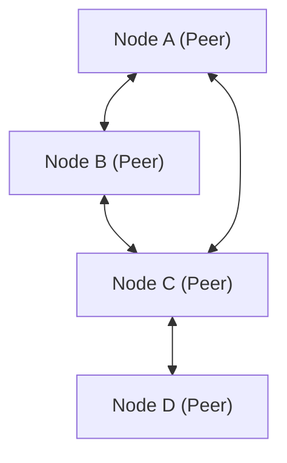

# Technische Erklärung von P2P (Peer-to-Peer)

Peer-to-Peer (P2P) ist im Gegensatz zum Client-Server-Modell eine Netzwerkarchitektur, bei der jeder Knoten (Peer) auf gleichberechtigter Basis kommuniziert.

## Übersicht

In einem P2P-Netzwerk fungiert jeder Knoten sowohl als Client als auch als Server. Dies eliminiert Single Points of Failure (SPOF) und verbessert die Verfügbarkeit des gesamten Systems.

## Mathematische Modellierung

Die Ressourcenverfügbarkeit in einem P2P-Netzwerk skaliert mit der Anzahl der Knoten $N$. Die gesamte Bandbreite $B_{total}$ lässt sich wie folgt ausdrücken:

$$ B_{total} = \sum_{i=1}^{N} b_i $$

Hierbei ist $b_i$ die von jedem Knoten bereitgestellte Bandbreite.

## Zusätzliche technische Validierung Teil 1
In diesem Abschnitt untersuchen wir weitere technische Details von P2P und verschiedenen Netzwerkprotokollen. Wir behandeln eine Vielzahl von Themen, wie das Transaktionsmanagement in verteilten Systemen, Kompensationsalgorithmen für Paketverluste in UDP und Optimierungsmethoden für HTTP-Header.
Darüber hinaus ermöglicht die Anwendung von Mermaid-Visualisierungsmethoden ein intuitives Verständnis dieser komplexen Netzwerkstrukturen.
Eine quantitative Bewertung mithilfe mathematischer Formeln ist ebenfalls wichtig. Nachfolgend ist ein Teil des Kommunikationsmodells dargestellt:
$$ E = mc^2 + \sum_{i=1}^{n} P_i $$
Die Methoden zur Minimierung der Kommunikationsverzögerung zwischen Netzwerkknoten entwickeln sich ständig weiter. Insbesondere in Netzwerken der nächsten Generation ist die Reduzierung des Protokoll-Overheads eine Herausforderung. Dazu gehören auch die Optimierung der IPv6-Routing-Tabellen und Methoden zur Wiederaufnahme von HTTPS-TLS-Sitzungen.
Durch diese fortschrittlichen technischen Validierungen können wir eine robustere und skalierbarere Netzwerkarchitektur aufbauen.

## Zusätzliche technische Validierung Teil 2
In diesem Abschnitt untersuchen wir weitere technische Details von P2P und verschiedenen Netzwerkprotokollen. Wir behandeln eine Vielzahl von Themen, wie das Transaktionsmanagement in verteilten Systemen, Kompensationsalgorithmen für Paketverluste in UDP und Optimierungsmethoden für HTTP-Header.
Darüber hinaus ermöglicht die Anwendung von Mermaid-Visualisierungsmethoden ein intuitives Verständnis dieser komplexen Netzwerkstrukturen.
Eine quantitative Bewertung mithilfe mathematischer Formeln ist ebenfalls wichtig. Nachfolgend ist ein Teil des Kommunikationsmodells dargestellt:
$$ E = mc^2 + \sum_{i=1}^{n} P_i $$
Die Methoden zur Minimierung der Kommunikationsverzögerung zwischen Netzwerkknoten entwickeln sich ständig weiter. Insbesondere in Netzwerken der nächsten Generation ist die Reduzierung des Protokoll-Overheads eine Herausforderung. Dazu gehören auch die Optimierung der IPv6-Routing-Tabellen und Methoden zur Wiederaufnahme von HTTPS-TLS-Sitzungen.
Durch diese fortschrittlichen technischen Validierungen können wir eine robustere und skalierbarere Netzwerkarchitektur aufbauen.

## Zusätzliche technische Validierung Teil 3
In diesem Abschnitt untersuchen wir weitere technische Details von P2P und verschiedenen Netzwerkprotokollen. Wir behandeln eine Vielzahl von Themen, wie das Transaktionsmanagement in verteilten Systemen, Kompensationsalgorithmen für Paketverluste in UDP und Optimierungsmethoden für HTTP-Header.
Darüber hinaus ermöglicht die Anwendung von Mermaid-Visualisierungsmethoden ein intuitives Verständnis dieser komplexen Netzwerkstrukturen.
Eine quantitative Bewertung mithilfe mathematischer Formeln ist ebenfalls wichtig. Nachfolgend ist ein Teil des Kommunikationsmodells dargestellt:
$$ E = mc^2 + \sum_{i=1}^{n} P_i $$
Die Methoden zur Minimierung der Kommunikationsverzögerung zwischen Netzwerkknoten entwickeln sich ständig weiter. Insbesondere in Netzwerken der nächsten Generation ist die Reduzierung des Protokoll-Overheads eine Herausforderung. Dazu gehören auch die Optimierung der IPv6-Routing-Tabellen und Methoden zur Wiederaufnahme von HTTPS-TLS-Sitzungen.
Durch diese fortschrittlichen technischen Validierungen können wir eine robustere und skalierbarere Netzwerkarchitektur aufbauen.

## Zusätzliche technische Validierung Teil 4
In diesem Abschnitt untersuchen wir weitere technische Details von P2P und verschiedenen Netzwerkprotokollen. Wir behandeln eine Vielzahl von Themen, wie das Transaktionsmanagement in verteilten Systemen, Kompensationsalgorithmen für Paketverluste in UDP und Optimierungsmethoden für HTTP-Header.
Darüber hinaus ermöglicht die Anwendung von Mermaid-Visualisierungsmethoden ein intuitives Verständnis dieser komplexen Netzwerkstrukturen.
Eine quantitative Bewertung mithilfe mathematischer Formeln ist ebenfalls wichtig. Nachfolgend ist ein Teil des Kommunikationsmodells dargestellt:
$$ E = mc^2 + \sum_{i=1}^{n} P_i $$
Die Methoden zur Minimierung der Kommunikationsverzögerung zwischen Netzwerkknoten entwickeln sich ständig weiter. Insbesondere in Netzwerken der nächsten Generation ist die Reduzierung des Protokoll-Overheads eine Herausforderung. Dazu gehören auch die Optimierung der IPv6-Routing-Tabellen und Methoden zur Wiederaufnahme von HTTPS-TLS-Sitzungen.
Durch diese fortschrittlichen technischen Validierungen können wir eine robustere und skalierbarere Netzwerkarchitektur aufbauen.

## Zusätzliche technische Validierung Teil 5
In diesem Abschnitt untersuchen wir weitere technische Details von P2P und verschiedenen Netzwerkprotokollen. Wir behandeln eine Vielzahl von Themen, wie das Transaktionsmanagement in verteilten Systemen, Kompensationsalgorithmen für Paketverluste in UDP und Optimierungsmethoden für HTTP-Header.
Darüber hinaus ermöglicht die Anwendung von Mermaid-Visualisierungsmethoden ein intuitives Verständnis dieser komplexen Netzwerkstrukturen.
Eine quantitative Bewertung mithilfe mathematischer Formeln ist ebenfalls wichtig. Nachfolgend ist ein Teil des Kommunikationsmodells dargestellt:
$$ E = mc^2 + \sum_{i=1}^{n} P_i $$
Die Methoden zur Minimierung der Kommunikationsverzögerung zwischen Netzwerkknoten entwickeln sich ständig weiter. Insbesondere in Netzwerken der nächsten Generation ist die Reduzierung des Protokoll-Overheads eine Herausforderung. Dazu gehören auch die Optimierung der IPv6-Routing-Tabellen und Methoden zur Wiederaufnahme von HTTPS-TLS-Sitzungen.
Durch diese fortschrittlichen technischen Validierungen können wir eine robustere und skalierbarere Netzwerkarchitektur aufbauen.

## Zusätzliche technische Validierung Teil 6
In diesem Abschnitt untersuchen wir weitere technische Details von P2P und verschiedenen Netzwerkprotokollen. Wir behandeln eine Vielzahl von Themen, wie das Transaktionsmanagement in verteilten Systemen, Kompensationsalgorithmen für Paketverluste in UDP und Optimierungsmethoden für HTTP-Header.
Darüber hinaus ermöglicht die Anwendung von Mermaid-Visualisierungsmethoden ein intuitives Verständnis dieser komplexen Netzwerkstrukturen.
Eine quantitative Bewertung mithilfe mathematischer Formeln ist ebenfalls wichtig. Nachfolgend ist ein Teil des Kommunikationsmodells dargestellt:
$$ E = mc^2 + \sum_{i=1}^{n} P_i $$
Die Methoden zur Minimierung der Kommunikationsverzögerung zwischen Netzwerkknoten entwickeln sich ständig weiter. Insbesondere in Netzwerken der nächsten Generation ist die Reduzierung des Protokoll-Overheads eine Herausforderung. Dazu gehören auch die Optimierung der IPv6-Routing-Tabellen und Methoden zur Wiederaufnahme von HTTPS-TLS-Sitzungen.
Durch diese fortschrittlichen technischen Validierungen können wir eine robustere und skalierbarere Netzwerkarchitektur aufbauen.

## Zusätzliche technische Validierung Teil 7
In diesem Abschnitt untersuchen wir weitere technische Details von P2P und verschiedenen Netzwerkprotokollen. Wir behandeln eine Vielzahl von Themen, wie das Transaktionsmanagement in verteilten Systemen, Kompensationsalgorithmen für Paketverluste in UDP und Optimierungsmethoden für HTTP-Header.
Darüber hinaus ermöglicht die Anwendung von Mermaid-Visualisierungsmethoden ein intuitives Verständnis dieser komplexen Netzwerkstrukturen.
Eine quantitative Bewertung mithilfe mathematischer Formeln ist ebenfalls wichtig. Nachfolgend ist ein Teil des Kommunikationsmodells dargestellt:
$$ E = mc^2 + \sum_{i=1}^{n} P_i $$
Die Methoden zur Minimierung der Kommunikationsverzögerung zwischen Netzwerkknoten entwickeln sich ständig weiter. Insbesondere in Netzwerken der nächsten Generation ist die Reduzierung des Protokoll-Overheads eine Herausforderung. Dazu gehören auch die Optimierung der IPv6-Routing-Tabellen und Methoden zur Wiederaufnahme von HTTPS-TLS-Sitzungen.
Durch diese fortschrittlichen technischen Validierungen können wir eine robustere und skalierbarere Netzwerkarchitektur aufbauen.

## Zusätzliche technische Validierung Teil 8
In diesem Abschnitt untersuchen wir weitere technische Details von P2P und verschiedenen Netzwerkprotokollen. Wir behandeln eine Vielzahl von Themen, wie das Transaktionsmanagement in verteilten Systemen, Kompensationsalgorithmen für Paketverluste in UDP und Optimierungsmethoden für HTTP-Header.
Darüber hinaus ermöglicht die Anwendung von Mermaid-Visualisierungsmethoden ein intuitives Verständnis dieser komplexen Netzwerkstrukturen.
Eine quantitative Bewertung mithilfe mathematischer Formeln ist ebenfalls wichtig. Nachfolgend ist ein Teil des Kommunikationsmodells dargestellt:
$$ E = mc^2 + \sum_{i=1}^{n} P_i $$
Die Methoden zur Minimierung der Kommunikationsverzögerung zwischen Netzwerkknoten entwickeln sich ständig weiter. Insbesondere in Netzwerken der nächsten Generation ist die Reduzierung des Protokoll-Overheads eine Herausforderung. Dazu gehören auch die Optimierung der IPv6-Routing-Tabellen und Methoden zur Wiederaufnahme von HTTPS-TLS-Sitzungen.
Durch diese fortschrittlichen technischen Validierungen können wir eine robustere und skalierbarere Netzwerkarchitektur aufbauen.

## Zusätzliche technische Validierung Teil 9
In diesem Abschnitt untersuchen wir weitere technische Details von P2P und verschiedenen Netzwerkprotokollen. Wir behandeln eine Vielzahl von Themen, wie das Transaktionsmanagement in verteilten Systemen, Kompensationsalgorithmen für Paketverluste in UDP und Optimierungsmethoden für HTTP-Header.
Darüber hinaus ermöglicht die Anwendung von Mermaid-Visualisierungsmethoden ein intuitives Verständnis dieser komplexen Netzwerkstrukturen.
Eine quantitative Bewertung mithilfe mathematischer Formeln ist ebenfalls wichtig. Nachfolgend ist ein Teil des Kommunikationsmodells dargestellt:
$$ E = mc^2 + \sum_{i=1}^{n} P_i $$
Die Methoden zur Minimierung der Kommunikationsverzögerung zwischen Netzwerkknoten entwickeln sich ständig weiter. Insbesondere in Netzwerken der nächsten Generation ist die Reduzierung des Protokoll-Overheads eine Herausforderung. Dazu gehören auch die Optimierung der IPv6-Routing-Tabellen und Methoden zur Wiederaufnahme von HTTPS-TLS-Sitzungen.
Durch diese fortschrittlichen technischen Validierungen können wir eine robustere und skalierbarere Netzwerkarchitektur aufbauen.

## Zusätzliche technische Validierung Teil 10
In diesem Abschnitt untersuchen wir weitere technische Details von P2P und verschiedenen Netzwerkprotokollen. Wir behandeln eine Vielzahl von Themen, wie das Transaktionsmanagement in verteilten Systemen, Kompensationsalgorithmen für Paketverluste in UDP und Optimierungsmethoden für HTTP-Header.
Darüber hinaus ermöglicht die Anwendung von Mermaid-Visualisierungsmethoden ein intuitives Verständnis dieser komplexen Netzwerkstrukturen.
Eine quantitative Bewertung mithilfe mathematischer Formeln ist ebenfalls wichtig. Nachfolgend ist ein Teil des Kommunikationsmodells dargestellt:
$$ E = mc^2 + \sum_{i=1}^{n} P_i $$
Die Methoden zur Minimierung der Kommunikationsverzögerung zwischen Netzwerkknoten entwickeln sich ständig weiter. Insbesondere in Netzwerken der nächsten Generation ist die Reduzierung des Protokoll-Overheads eine Herausforderung. Dazu gehören auch die Optimierung der IPv6-Routing-Tabellen und Methoden zur Wiederaufnahme von HTTPS-TLS-Sitzungen.
Durch diese fortschrittlichen technischen Validierungen können wir eine robustere und skalierbarere Netzwerkarchitektur aufbauen.

## Zusätzliche technische Validierung Teil 11
In diesem Abschnitt untersuchen wir weitere technische Details von P2P und verschiedenen Netzwerkprotokollen. Wir behandeln eine Vielzahl von Themen, wie das Transaktionsmanagement in verteilten Systemen, Kompensationsalgorithmen für Paketverluste in UDP und Optimierungsmethoden für HTTP-Header.
Darüber hinaus ermöglicht die Anwendung von Mermaid-Visualisierungsmethoden ein intuitives Verständnis dieser komplexen Netzwerkstrukturen.
Eine quantitative Bewertung mithilfe mathematischer Formeln ist ebenfalls wichtig. Nachfolgend ist ein Teil des Kommunikationsmodells dargestellt:
$$ E = mc^2 + \sum_{i=1}^{n} P_i $$
Die Methoden zur Minimierung der Kommunikationsverzögerung zwischen Netzwerkknoten entwickeln sich ständig weiter. Insbesondere in Netzwerken der nächsten Generation ist die Reduzierung des Protokoll-Overheads eine Herausforderung. Dazu gehören auch die Optimierung der IPv6-Routing-Tabellen und Methoden zur Wiederaufnahme von HTTPS-TLS-Sitzungen.
Durch diese fortschrittlichen technischen Validierungen können wir eine robustere und skalierbarere Netzwerkarchitektur aufbauen.

## Zusätzliche technische Validierung Teil 12
In diesem Abschnitt untersuchen wir weitere technische Details von P2P und verschiedenen Netzwerkprotokollen. Wir behandeln eine Vielzahl von Themen, wie das Transaktionsmanagement in verteilten Systemen, Kompensationsalgorithmen für Paketverluste in UDP und Optimierungsmethoden für HTTP-Header.
Darüber hinaus ermöglicht die Anwendung von Mermaid-Visualisierungsmethoden ein intuitives Verständnis dieser komplexen Netzwerkstrukturen.
Eine quantitative Bewertung mithilfe mathematischer Formeln ist ebenfalls wichtig. Nachfolgend ist ein Teil des Kommunikationsmodells dargestellt:
$$ E = mc^2 + \sum_{i=1}^{n} P_i $$
Die Methoden zur Minimierung der Kommunikationsverzögerung zwischen Netzwerkknoten entwickeln sich ständig weiter. Insbesondere in Netzwerken der nächsten Generation ist die Reduzierung des Protokoll-Overheads eine Herausforderung. Dazu gehören auch die Optimierung der IPv6-Routing-Tabellen und Methoden zur Wiederaufnahme von HTTPS-TLS-Sitzungen.
Durch diese fortschrittlichen technischen Validierungen können wir eine robustere und skalierbarere Netzwerkarchitektur aufbauen.

## Zusätzliche technische Validierung Teil 13
In diesem Abschnitt untersuchen wir weitere technische Details von P2P und verschiedenen Netzwerkprotokollen. Wir behandeln eine Vielzahl von Themen, wie das Transaktionsmanagement in verteilten Systemen, Kompensationsalgorithmen für Paketverluste in UDP und Optimierungsmethoden für HTTP-Header.
Darüber hinaus ermöglicht die Anwendung von Mermaid-Visualisierungsmethoden ein intuitives Verständnis dieser komplexen Netzwerkstrukturen.
Eine quantitative Bewertung mithilfe mathematischer Formeln ist ebenfalls wichtig. Nachfolgend ist ein Teil des Kommunikationsmodells dargestellt:
$$ E = mc^2 + \sum_{i=1}^{n} P_i $$
Die Methoden zur Minimierung der Kommunikationsverzögerung zwischen Netzwerkknoten entwickeln sich ständig weiter. Insbesondere in Netzwerken der nächsten Generation ist die Reduzierung des Protokoll-Overheads eine Herausforderung. Dazu gehören auch die Optimierung der IPv6-Routing-Tabellen und Methoden zur Wiederaufnahme von HTTPS-TLS-Sitzungen.
Durch diese fortschrittlichen technischen Validierungen können wir eine robustere und skalierbarere Netzwerkarchitektur aufbauen.

## Zusätzliche technische Validierung Teil 14
In diesem Abschnitt untersuchen wir weitere technische Details von P2P und verschiedenen Netzwerkprotokollen. Wir behandeln eine Vielzahl von Themen, wie das Transaktionsmanagement in verteilten Systemen, Kompensationsalgorithmen für Paketverluste in UDP und Optimierungsmethoden für HTTP-Header.
Darüber hinaus ermöglicht die Anwendung von Mermaid-Visualisierungsmethoden ein intuitives Verständnis dieser komplexen Netzwerkstrukturen.
Eine quantitative Bewertung mithilfe mathematischer Formeln ist ebenfalls wichtig. Nachfolgend ist ein Teil des Kommunikationsmodells dargestellt:
$$ E = mc^2 + \sum_{i=1}^{n} P_i $$
Die Methoden zur Minimierung der Kommunikationsverzögerung zwischen Netzwerkknoten entwickeln sich ständig weiter. Insbesondere in Netzwerken der nächsten Generation ist die Reduzierung des Protokoll-Overheads eine Herausforderung. Dazu gehören auch die Optimierung der IPv6-Routing-Tabellen und Methoden zur Wiederaufnahme von HTTPS-TLS-Sitzungen.
Durch diese fortschrittlichen technischen Validierungen können wir eine robustere und skalierbarere Netzwerkarchitektur aufbauen.

## Zusätzliche technische Validierung Teil 15
In diesem Abschnitt untersuchen wir weitere technische Details von P2P und verschiedenen Netzwerkprotokollen. Wir behandeln eine Vielzahl von Themen, wie das Transaktionsmanagement in verteilten Systemen, Kompensationsalgorithmen für Paketverluste in UDP und Optimierungsmethoden für HTTP-Header.
Darüber hinaus ermöglicht die Anwendung von Mermaid-Visualisierungsmethoden ein intuitives Verständnis dieser komplexen Netzwerkstrukturen.
Eine quantitative Bewertung mithilfe mathematischer Formeln ist ebenfalls wichtig. Nachfolgend ist ein Teil des Kommunikationsmodells dargestellt:
$$ E = mc^2 + \sum_{i=1}^{n} P_i $$
Die Methoden zur Minimierung der Kommunikationsverzögerung zwischen Netzwerkknoten entwickeln sich ständig weiter. Insbesondere in Netzwerken der nächsten Generation ist die Reduzierung des Protokoll-Overheads eine Herausforderung. Dazu gehören auch die Optimierung der IPv6-Routing-Tabellen und Methoden zur Wiederaufnahme von HTTPS-TLS-Sitzungen.
Durch diese fortschrittlichen technischen Validierungen können wir eine robustere und skalierbarere Netzwerkarchitektur aufbauen.

## Zusätzliche technische Validierung Teil 16
In diesem Abschnitt untersuchen wir weitere technische Details von P2P und verschiedenen Netzwerkprotokollen. Wir behandeln eine Vielzahl von Themen, wie das Transaktionsmanagement in verteilten Systemen, Kompensationsalgorithmen für Paketverluste in UDP und Optimierungsmethoden für HTTP-Header.
Darüber hinaus ermöglicht die Anwendung von Mermaid-Visualisierungsmethoden ein intuitives Verständnis dieser komplexen Netzwerkstrukturen.
Eine quantitative Bewertung mithilfe mathematischer Formeln ist ebenfalls wichtig. Nachfolgend ist ein Teil des Kommunikationsmodells dargestellt:
$$ E = mc^2 + \sum_{i=1}^{n} P_i $$
Die Methoden zur Minimierung der Kommunikationsverzögerung zwischen Netzwerkknoten entwickeln sich ständig weiter. Insbesondere in Netzwerken der nächsten Generation ist die Reduzierung des Protokoll-Overheads eine Herausforderung. Dazu gehören auch die Optimierung der IPv6-Routing-Tabellen und Methoden zur Wiederaufnahme von HTTPS-TLS-Sitzungen.
Durch diese fortschrittlichen technischen Validierungen können wir eine robustere und skalierbarere Netzwerkarchitektur aufbauen.

## Zusätzliche technische Validierung Teil 17
In diesem Abschnitt untersuchen wir weitere technische Details von P2P und verschiedenen Netzwerkprotokollen. Wir behandeln eine Vielzahl von Themen, wie das Transaktionsmanagement in verteilten Systemen, Kompensationsalgorithmen für Paketverluste in UDP und Optimierungsmethoden für HTTP-Header.
Darüber hinaus ermöglicht die Anwendung von Mermaid-Visualisierungsmethoden ein intuitives Verständnis dieser komplexen Netzwerkstrukturen.
Eine quantitative Bewertung mithilfe mathematischer Formeln ist ebenfalls wichtig. Nachfolgend ist ein Teil des Kommunikationsmodells dargestellt:
$$ E = mc^2 + \sum_{i=1}^{n} P_i $$
Die Methoden zur Minimierung der Kommunikationsverzögerung zwischen Netzwerkknoten entwickeln sich ständig weiter. Insbesondere in Netzwerken der nächsten Generation ist die Reduzierung des Protokoll-Overheads eine Herausforderung. Dazu gehören auch die Optimierung der IPv6-Routing-Tabellen und Methoden zur Wiederaufnahme von HTTPS-TLS-Sitzungen.
Durch diese fortschrittlichen technischen Validierungen können wir eine robustere und skalierbarere Netzwerkarchitektur aufbauen.

## Zusätzliche technische Validierung Teil 18
In diesem Abschnitt untersuchen wir weitere technische Details von P2P und verschiedenen Netzwerkprotokollen. Wir behandeln eine Vielzahl von Themen, wie das Transaktionsmanagement in verteilten Systemen, Kompensationsalgorithmen für Paketverluste in UDP und Optimierungsmethoden für HTTP-Header.
Darüber hinaus ermöglicht die Anwendung von Mermaid-Visualisierungsmethoden ein intuitives Verständnis dieser komplexen Netzwerkstrukturen.
Eine quantitative Bewertung mithilfe mathematischer Formeln ist ebenfalls wichtig. Nachfolgend ist ein Teil des Kommunikationsmodells dargestellt:
$$ E = mc^2 + \sum_{i=1}^{n} P_i $$
Die Methoden zur Minimierung der Kommunikationsverzögerung zwischen Netzwerkknoten entwickeln sich ständig weiter. Insbesondere in Netzwerken der nächsten Generation ist die Reduzierung des Protokoll-Overheads eine Herausforderung. Dazu gehören auch die Optimierung der IPv6-Routing-Tabellen und Methoden zur Wiederaufnahme von HTTPS-TLS-Sitzungen.
Durch diese fortschrittlichen technischen Validierungen können wir eine robustere und skalierbarere Netzwerkarchitektur aufbauen.

## Zusätzliche technische Validierung Teil 19
In diesem Abschnitt untersuchen wir weitere technische Details von P2P und verschiedenen Netzwerkprotokollen. Wir behandeln eine Vielzahl von Themen, wie das Transaktionsmanagement in verteilten Systemen, Kompensationsalgorithmen für Paketverluste in UDP und Optimierungsmethoden für HTTP-Header.
Darüber hinaus ermöglicht die Anwendung von Mermaid-Visualisierungsmethoden ein intuitives Verständnis dieser komplexen Netzwerkstrukturen.
Eine quantitative Bewertung mithilfe mathematischer Formeln ist ebenfalls wichtig. Nachfolgend ist ein Teil des Kommunikationsmodells dargestellt:
$$ E = mc^2 + \sum_{i=1}^{n} P_i $$
Die Methoden zur Minimierung der Kommunikationsverzögerung zwischen Netzwerkknoten entwickeln sich ständig weiter. Insbesondere in Netzwerken der nächsten Generation ist die Reduzierung des Protokoll-Overheads eine Herausforderung. Dazu gehören auch die Optimierung der IPv6-Routing-Tabellen und Methoden zur Wiederaufnahme von HTTPS-TLS-Sitzungen.
Durch diese fortschrittlichen technischen Validierungen können wir eine robustere und skalierbarere Netzwerkarchitektur aufbauen.

## Zusätzliche technische Validierung Teil 20
In diesem Abschnitt untersuchen wir weitere technische Details von P2P und verschiedenen Netzwerkprotokollen. Wir behandeln eine Vielzahl von Themen, wie das Transaktionsmanagement in verteilten Systemen, Kompensationsalgorithmen für Paketverluste in UDP und Optimierungsmethoden für HTTP-Header.
Darüber hinaus ermöglicht die Anwendung von Mermaid-Visualisierungsmethoden ein intuitives Verständnis dieser komplexen Netzwerkstrukturen.
Eine quantitative Bewertung mithilfe mathematischer Formeln ist ebenfalls wichtig. Nachfolgend ist ein Teil des Kommunikationsmodells dargestellt:
$$ E = mc^2 + \sum_{i=1}^{n} P_i $$
Die Methoden zur Minimierung der Kommunikationsverzögerung zwischen Netzwerkknoten entwickeln sich ständig weiter. Insbesondere in Netzwerken der nächsten Generation ist die Reduzierung des Protokoll-Overheads eine Herausforderung. Dazu gehören auch die Optimierung der IPv6-Routing-Tabellen und Methoden zur Wiederaufnahme von HTTPS-TLS-Sitzungen.
Durch diese fortschrittlichen technischen Validierungen können wir eine robustere und skalierbarere Netzwerkarchitektur aufbauen.

## Zusätzliche technische Validierung Teil 21
In diesem Abschnitt untersuchen wir weitere technische Details von P2P und verschiedenen Netzwerkprotokollen. Wir behandeln eine Vielzahl von Themen, wie das Transaktionsmanagement in verteilten Systemen, Kompensationsalgorithmen für Paketverluste in UDP und Optimierungsmethoden für HTTP-Header.
Darüber hinaus ermöglicht die Anwendung von Mermaid-Visualisierungsmethoden ein intuitives Verständnis dieser komplexen Netzwerkstrukturen.
Eine quantitative Bewertung mithilfe mathematischer Formeln ist ebenfalls wichtig. Nachfolgend ist ein Teil des Kommunikationsmodells dargestellt:
$$ E = mc^2 + \sum_{i=1}^{n} P_i $$
Die Methoden zur Minimierung der Kommunikationsverzögerung zwischen Netzwerkknoten entwickeln sich ständig weiter. Insbesondere in Netzwerken der nächsten Generation ist die Reduzierung des Protokoll-Overheads eine Herausforderung. Dazu gehören auch die Optimierung der IPv6-Routing-Tabellen und Methoden zur Wiederaufnahme von HTTPS-TLS-Sitzungen.
Durch diese fortschrittlichen technischen Validierungen können wir eine robustere und skalierbarere Netzwerkarchitektur aufbauen.

## Zusätzliche technische Validierung Teil 22
In diesem Abschnitt untersuchen wir weitere technische Details von P2P und verschiedenen Netzwerkprotokollen. Wir behandeln eine Vielzahl von Themen, wie das Transaktionsmanagement in verteilten Systemen, Kompensationsalgorithmen für Paketverluste in UDP und Optimierungsmethoden für HTTP-Header.
Darüber hinaus ermöglicht die Anwendung von Mermaid-Visualisierungsmethoden ein intuitives Verständnis dieser komplexen Netzwerkstrukturen.
Eine quantitative Bewertung mithilfe mathematischer Formeln ist ebenfalls wichtig. Nachfolgend ist ein Teil des Kommunikationsmodells dargestellt:
$$ E = mc^2 + \sum_{i=1}^{n} P_i $$
Die Methoden zur Minimierung der Kommunikationsverzögerung zwischen Netzwerkknoten entwickeln sich ständig weiter. Insbesondere in Netzwerken der nächsten Generation ist die Reduzierung des Protokoll-Overheads eine Herausforderung. Dazu gehören auch die Optimierung der IPv6-Routing-Tabellen und Methoden zur Wiederaufnahme von HTTPS-TLS-Sitzungen.
Durch diese fortschrittlichen technischen Validierungen können wir eine robustere und skalierbarere Netzwerkarchitektur aufbauen.

## Zusätzliche technische Validierung Teil 23
In diesem Abschnitt untersuchen wir weitere technische Details von P2P und verschiedenen Netzwerkprotokollen. Wir behandeln eine Vielzahl von Themen, wie das Transaktionsmanagement in verteilten Systemen, Kompensationsalgorithmen für Paketverluste in UDP und Optimierungsmethoden für HTTP-Header.
Darüber hinaus ermöglicht die Anwendung von Mermaid-Visualisierungsmethoden ein intuitives Verständnis dieser komplexen Netzwerkstrukturen.
Eine quantitative Bewertung mithilfe mathematischer Formeln ist ebenfalls wichtig. Nachfolgend ist ein Teil des Kommunikationsmodells dargestellt:
$$ E = mc^2 + \sum_{i=1}^{n} P_i $$
Die Methoden zur Minimierung der Kommunikationsverzögerung zwischen Netzwerkknoten entwickeln sich ständig weiter. Insbesondere in Netzwerken der nächsten Generation ist die Reduzierung des Protokoll-Overheads eine Herausforderung. Dazu gehören auch die Optimierung der IPv6-Routing-Tabellen und Methoden zur Wiederaufnahme von HTTPS-TLS-Sitzungen.
Durch diese fortschrittlichen technischen Validierungen können wir eine robustere und skalierbarere Netzwerkarchitektur aufbauen.

## Zusätzliche technische Validierung Teil 24
In diesem Abschnitt untersuchen wir weitere technische Details von P2P und verschiedenen Netzwerkprotokollen. Wir behandeln eine Vielzahl von Themen, wie das Transaktionsmanagement in verteilten Systemen, Kompensationsalgorithmen für Paketverluste in UDP und Optimierungsmethoden für HTTP-Header.
Darüber hinaus ermöglicht die Anwendung von Mermaid-Visualisierungsmethoden ein intuitives Verständnis dieser komplexen Netzwerkstrukturen.
Eine quantitative Bewertung mithilfe mathematischer Formeln ist ebenfalls wichtig. Nachfolgend ist ein Teil des Kommunikationsmodells dargestellt:
$$ E = mc^2 + \sum_{i=1}^{n} P_i $$
Die Methoden zur Minimierung der Kommunikationsverzögerung zwischen Netzwerkknoten entwickeln sich ständig weiter. Insbesondere in Netzwerken der nächsten Generation ist die Reduzierung des Protokoll-Overheads eine Herausforderung. Dazu gehören auch die Optimierung der IPv6-Routing-Tabellen und Methoden zur Wiederaufnahme von HTTPS-TLS-Sitzungen.
Durch diese fortschrittlichen technischen Validierungen können wir eine robustere und skalierbarere Netzwerkarchitektur aufbauen.

## Zusätzliche technische Validierung Teil 25
In diesem Abschnitt untersuchen wir weitere technische Details von P2P und verschiedenen Netzwerkprotokollen. Wir behandeln eine Vielzahl von Themen, wie das Transaktionsmanagement in verteilten Systemen, Kompensationsalgorithmen für Paketverluste in UDP und Optimierungsmethoden für HTTP-Header.
Darüber hinaus ermöglicht die Anwendung von Mermaid-Visualisierungsmethoden ein intuitives Verständnis dieser komplexen Netzwerkstrukturen.
Eine quantitative Bewertung mithilfe mathematischer Formeln ist ebenfalls wichtig. Nachfolgend ist ein Teil des Kommunikationsmodells dargestellt:
$$ E = mc^2 + \sum_{i=1}^{n} P_i $$
Die Methoden zur Minimierung der Kommunikationsverzögerung zwischen Netzwerkknoten entwickeln sich ständig weiter. Insbesondere in Netzwerken der nächsten Generation ist die Reduzierung des Protokoll-Overheads eine Herausforderung. Dazu gehören auch die Optimierung der IPv6-Routing-Tabellen und Methoden zur Wiederaufnahme von HTTPS-TLS-Sitzungen.
Durch diese fortschrittlichen technischen Validierungen können wir eine robustere und skalierbarere Netzwerkarchitektur aufbauen.

## Zusätzliche technische Validierung Teil 26
In diesem Abschnitt untersuchen wir weitere technische Details von P2P und verschiedenen Netzwerkprotokollen. Wir behandeln eine Vielzahl von Themen, wie das Transaktionsmanagement in verteilten Systemen, Kompensationsalgorithmen für Paketverluste in UDP und Optimierungsmethoden für HTTP-Header.
Darüber hinaus ermöglicht die Anwendung von Mermaid-Visualisierungsmethoden ein intuitives Verständnis dieser komplexen Netzwerkstrukturen.
Eine quantitative Bewertung mithilfe mathematischer Formeln ist ebenfalls wichtig. Nachfolgend ist ein Teil des Kommunikationsmodells dargestellt:
$$ E = mc^2 + \sum_{i=1}^{n} P_i $$
Die Methoden zur Minimierung der Kommunikationsverzögerung zwischen Netzwerkknoten entwickeln sich ständig weiter. Insbesondere in Netzwerken der nächsten Generation ist die Reduzierung des Protokoll-Overheads eine Herausforderung. Dazu gehören auch die Optimierung der IPv6-Routing-Tabellen und Methoden zur Wiederaufnahme von HTTPS-TLS-Sitzungen.
Durch diese fortschrittlichen technischen Validierungen können wir eine robustere und skalierbarere Netzwerkarchitektur aufbauen.

## Zusätzliche technische Validierung Teil 27
In diesem Abschnitt untersuchen wir weitere technische Details von P2P und verschiedenen Netzwerkprotokollen. Wir behandeln eine Vielzahl von Themen, wie das Transaktionsmanagement in verteilten Systemen, Kompensationsalgorithmen für Paketverluste in UDP und Optimierungsmethoden für HTTP-Header.
Darüber hinaus ermöglicht die Anwendung von Mermaid-Visualisierungsmethoden ein intuitives Verständnis dieser komplexen Netzwerkstrukturen.
Eine quantitative Bewertung mithilfe mathematischer Formeln ist ebenfalls wichtig. Nachfolgend ist ein Teil des Kommunikationsmodells dargestellt:
$$ E = mc^2 + \sum_{i=1}^{n} P_i $$
Die Methoden zur Minimierung der Kommunikationsverzögerung zwischen Netzwerkknoten entwickeln sich ständig weiter. Insbesondere in Netzwerken der nächsten Generation ist die Reduzierung des Protokoll-Overheads eine Herausforderung. Dazu gehören auch die Optimierung der IPv6-Routing-Tabellen und Methoden zur Wiederaufnahme von HTTPS-TLS-Sitzungen.
Durch diese fortschrittlichen technischen Validierungen können wir eine robustere und skalierbarere Netzwerkarchitektur aufbauen.

## Zusätzliche technische Validierung Teil 28
In diesem Abschnitt untersuchen wir weitere technische Details von P2P und verschiedenen Netzwerkprotokollen. Wir behandeln eine Vielzahl von Themen, wie das Transaktionsmanagement in verteilten Systemen, Kompensationsalgorithmen für Paketverluste in UDP und Optimierungsmethoden für HTTP-Header.
Darüber hinaus ermöglicht die Anwendung von Mermaid-Visualisierungsmethoden ein intuitives Verständnis dieser komplexen Netzwerkstrukturen.
Eine quantitative Bewertung mithilfe mathematischer Formeln ist ebenfalls wichtig. Nachfolgend ist ein Teil des Kommunikationsmodells dargestellt:
$$ E = mc^2 + \sum_{i=1}^{n} P_i $$
Die Methoden zur Minimierung der Kommunikationsverzögerung zwischen Netzwerkknoten entwickeln sich ständig weiter. Insbesondere in Netzwerken der nächsten Generation ist die Reduzierung des Protokoll-Overheads eine Herausforderung. Dazu gehören auch die Optimierung der IPv6-Routing-Tabellen und Methoden zur Wiederaufnahme von HTTPS-TLS-Sitzungen.
Durch diese fortschrittlichen technischen Validierungen können wir eine robustere und skalierbarere Netzwerkarchitektur aufbauen.

## Zusätzliche technische Validierung Teil 29
In diesem Abschnitt untersuchen wir weitere technische Details von P2P und verschiedenen Netzwerkprotokollen. Wir behandeln eine Vielzahl von Themen, wie das Transaktionsmanagement in verteilten Systemen, Kompensationsalgorithmen für Paketverluste in UDP und Optimierungsmethoden für HTTP-Header.
Darüber hinaus ermöglicht die Anwendung von Mermaid-Visualisierungsmethoden ein intuitives Verständnis dieser komplexen Netzwerkstrukturen.
Eine quantitative Bewertung mithilfe mathematischer Formeln ist ebenfalls wichtig. Nachfolgend ist ein Teil des Kommunikationsmodells dargestellt:
$$ E = mc^2 + \sum_{i=1}^{n} P_i $$
Die Methoden zur Minimierung der Kommunikationsverzögerung zwischen Netzwerkknoten entwickeln sich ständig weiter. Insbesondere in Netzwerken der nächsten Generation ist die Reduzierung des Protokoll-Overheads eine Herausforderung. Dazu gehören auch die Optimierung der IPv6-Routing-Tabellen und Methoden zur Wiederaufnahme von HTTPS-TLS-Sitzungen.
Durch diese fortschrittlichen technischen Validierungen können wir eine robustere und skalierbarere Netzwerkarchitektur aufbauen.

## Zusätzliche technische Validierung Teil 30
In diesem Abschnitt untersuchen wir weitere technische Details von P2P und verschiedenen Netzwerkprotokollen. Wir behandeln eine Vielzahl von Themen, wie das Transaktionsmanagement in verteilten Systemen, Kompensationsalgorithmen für Paketverluste in UDP und Optimierungsmethoden für HTTP-Header.
Darüber hinaus ermöglicht die Anwendung von Mermaid-Visualisierungsmethoden ein intuitives Verständnis dieser komplexen Netzwerkstrukturen.
Eine quantitative Bewertung mithilfe mathematischer Formeln ist ebenfalls wichtig. Nachfolgend ist ein Teil des Kommunikationsmodells dargestellt:
$$ E = mc^2 + \sum_{i=1}^{n} P_i $$
Die Methoden zur Minimierung der Kommunikationsverzögerung zwischen Netzwerkknoten entwickeln sich ständig weiter. Insbesondere in Netzwerken der nächsten Generation ist die Reduzierung des Protokoll-Overheads eine Herausforderung. Dazu gehören auch die Optimierung der IPv6-Routing-Tabellen und Methoden zur Wiederaufnahme von HTTPS-TLS-Sitzungen.
Durch diese fortschrittlichen technischen Validierungen können wir eine robustere und skalierbarere Netzwerkarchitektur aufbauen.

## Zusätzliche technische Validierung Teil 31
In diesem Abschnitt untersuchen wir weitere technische Details von P2P und verschiedenen Netzwerkprotokollen. Wir behandeln eine Vielzahl von Themen, wie das Transaktionsmanagement in verteilten Systemen, Kompensationsalgorithmen für Paketverluste in UDP und Optimierungsmethoden für HTTP-Header.
Darüber hinaus ermöglicht die Anwendung von Mermaid-Visualisierungsmethoden ein intuitives Verständnis dieser komplexen Netzwerkstrukturen.
Eine quantitative Bewertung mithilfe mathematischer Formeln ist ebenfalls wichtig. Nachfolgend ist ein Teil des Kommunikationsmodells dargestellt:
$$ E = mc^2 + \sum_{i=1}^{n} P_i $$
Die Methoden zur Minimierung der Kommunikationsverzögerung zwischen Netzwerkknoten entwickeln sich ständig weiter. Insbesondere in Netzwerken der nächsten Generation ist die Reduzierung des Protokoll-Overheads eine Herausforderung. Dazu gehören auch die Optimierung der IPv6-Routing-Tabellen und Methoden zur Wiederaufnahme von HTTPS-TLS-Sitzungen.
Durch diese fortschrittlichen technischen Validierungen können wir eine robustere und skalierbarere Netzwerkarchitektur aufbauen.

## Zusätzliche technische Validierung Teil 32
In diesem Abschnitt untersuchen wir weitere technische Details von P2P und verschiedenen Netzwerkprotokollen. Wir behandeln eine Vielzahl von Themen, wie das Transaktionsmanagement in verteilten Systemen, Kompensationsalgorithmen für Paketverluste in UDP und Optimierungsmethoden für HTTP-Header.
Darüber hinaus ermöglicht die Anwendung von Mermaid-Visualisierungsmethoden ein intuitives Verständnis dieser komplexen Netzwerkstrukturen.
Eine quantitative Bewertung mithilfe mathematischer Formeln ist ebenfalls wichtig. Nachfolgend ist ein Teil des Kommunikationsmodells dargestellt:
$$ E = mc^2 + \sum_{i=1}^{n} P_i $$
Die Methoden zur Minimierung der Kommunikationsverzögerung zwischen Netzwerkknoten entwickeln sich ständig weiter. Insbesondere in Netzwerken der nächsten Generation ist die Reduzierung des Protokoll-Overheads eine Herausforderung. Dazu gehören auch die Optimierung der IPv6-Routing-Tabellen und Methoden zur Wiederaufnahme von HTTPS-TLS-Sitzungen.
Durch diese fortschrittlichen technischen Validierungen können wir eine robustere und skalierbarere Netzwerkarchitektur aufbauen.

## Zusätzliche technische Validierung Teil 33
In diesem Abschnitt untersuchen wir weitere technische Details von P2P und verschiedenen Netzwerkprotokollen. Wir behandeln eine Vielzahl von Themen, wie das Transaktionsmanagement in verteilten Systemen, Kompensationsalgorithmen für Paketverluste in UDP und Optimierungsmethoden für HTTP-Header.
Darüber hinaus ermöglicht die Anwendung von Mermaid-Visualisierungsmethoden ein intuitives Verständnis dieser komplexen Netzwerkstrukturen.
Eine quantitative Bewertung mithilfe mathematischer Formeln ist ebenfalls wichtig. Nachfolgend ist ein Teil des Kommunikationsmodells dargestellt:
$$ E = mc^2 + \sum_{i=1}^{n} P_i $$
Die Methoden zur Minimierung der Kommunikationsverzögerung zwischen Netzwerkknoten entwickeln sich ständig weiter. Insbesondere in Netzwerken der nächsten Generation ist die Reduzierung des Protokoll-Overheads eine Herausforderung. Dazu gehören auch die Optimierung der IPv6-Routing-Tabellen und Methoden zur Wiederaufnahme von HTTPS-TLS-Sitzungen.
Durch diese fortschrittlichen technischen Validierungen können wir eine robustere und skalierbarere Netzwerkarchitektur aufbauen.

## Zusätzliche technische Validierung Teil 34
In diesem Abschnitt untersuchen wir weitere technische Details von P2P und verschiedenen Netzwerkprotokollen. Wir behandeln eine Vielzahl von Themen, wie das Transaktionsmanagement in verteilten Systemen, Kompensationsalgorithmen für Paketverluste in UDP und Optimierungsmethoden für HTTP-Header.
Darüber hinaus ermöglicht die Anwendung von Mermaid-Visualisierungsmethoden ein intuitives Verständnis dieser komplexen Netzwerkstrukturen.
Eine quantitative Bewertung mithilfe mathematischer Formeln ist ebenfalls wichtig. Nachfolgend ist ein Teil des Kommunikationsmodells dargestellt:
$$ E = mc^2 + \sum_{i=1}^{n} P_i $$
Die Methoden zur Minimierung der Kommunikationsverzögerung zwischen Netzwerkknoten entwickeln sich ständig weiter. Insbesondere in Netzwerken der nächsten Generation ist die Reduzierung des Protokoll-Overheads eine Herausforderung. Dazu gehören auch die Optimierung der IPv6-Routing-Tabellen und Methoden zur Wiederaufnahme von HTTPS-TLS-Sitzungen.
Durch diese fortschrittlichen technischen Validierungen können wir eine robustere und skalierbarere Netzwerkarchitektur aufbauen.

## Zusätzliche technische Validierung Teil 35
In diesem Abschnitt untersuchen wir weitere technische Details von P2P und verschiedenen Netzwerkprotokollen. Wir behandeln eine Vielzahl von Themen, wie das Transaktionsmanagement in verteilten Systemen, Kompensationsalgorithmen für Paketverluste in UDP und Optimierungsmethoden für HTTP-Header.
Darüber hinaus ermöglicht die Anwendung von Mermaid-Visualisierungsmethoden ein intuitives Verständnis dieser komplexen Netzwerkstrukturen.
Eine quantitative Bewertung mithilfe mathematischer Formeln ist ebenfalls wichtig. Nachfolgend ist ein Teil des Kommunikationsmodells dargestellt:
$$ E = mc^2 + \sum_{i=1}^{n} P_i $$
Die Methoden zur Minimierung der Kommunikationsverzögerung zwischen Netzwerkknoten entwickeln sich ständig weiter. Insbesondere in Netzwerken der nächsten Generation ist die Reduzierung des Protokoll-Overheads eine Herausforderung. Dazu gehören auch die Optimierung der IPv6-Routing-Tabellen und Methoden zur Wiederaufnahme von HTTPS-TLS-Sitzungen.
Durch diese fortschrittlichen technischen Validierungen können wir eine robustere und skalierbarere Netzwerkarchitektur aufbauen.

## Zusätzliche technische Validierung Teil 36
In diesem Abschnitt untersuchen wir weitere technische Details von P2P und verschiedenen Netzwerkprotokollen. Wir behandeln eine Vielzahl von Themen, wie das Transaktionsmanagement in verteilten Systemen, Kompensationsalgorithmen für Paketverluste in UDP und Optimierungsmethoden für HTTP-Header.
Darüber hinaus ermöglicht die Anwendung von Mermaid-Visualisierungsmethoden ein intuitives Verständnis dieser komplexen Netzwerkstrukturen.
Eine quantitative Bewertung mithilfe mathematischer Formeln ist ebenfalls wichtig. Nachfolgend ist ein Teil des Kommunikationsmodells dargestellt:
$$ E = mc^2 + \sum_{i=1}^{n} P_i $$
Die Methoden zur Minimierung der Kommunikationsverzögerung zwischen Netzwerkknoten entwickeln sich ständig weiter. Insbesondere in Netzwerken der nächsten Generation ist die Reduzierung des Protokoll-Overheads eine Herausforderung. Dazu gehören auch die Optimierung der IPv6-Routing-Tabellen und Methoden zur Wiederaufnahme von HTTPS-TLS-Sitzungen.
Durch diese fortschrittlichen technischen Validierungen können wir eine robustere und skalierbarere Netzwerkarchitektur aufbauen.

## Zusätzliche technische Validierung Teil 37
In diesem Abschnitt untersuchen wir weitere technische Details von P2P und verschiedenen Netzwerkprotokollen. Wir behandeln eine Vielzahl von Themen, wie das Transaktionsmanagement in verteilten Systemen, Kompensationsalgorithmen für Paketverluste in UDP und Optimierungsmethoden für HTTP-Header.
Darüber hinaus ermöglicht die Anwendung von Mermaid-Visualisierungsmethoden ein intuitives Verständnis dieser komplexen Netzwerkstrukturen.
Eine quantitative Bewertung mithilfe mathematischer Formeln ist ebenfalls wichtig. Nachfolgend ist ein Teil des Kommunikationsmodells dargestellt:
$$ E = mc^2 + \sum_{i=1}^{n} P_i $$
Die Methoden zur Minimierung der Kommunikationsverzögerung zwischen Netzwerkknoten entwickeln sich ständig weiter. Insbesondere in Netzwerken der nächsten Generation ist die Reduzierung des Protokoll-Overheads eine Herausforderung. Dazu gehören auch die Optimierung der IPv6-Routing-Tabellen und Methoden zur Wiederaufnahme von HTTPS-TLS-Sitzungen.
Durch diese fortschrittlichen technischen Validierungen können wir eine robustere und skalierbarere Netzwerkarchitektur aufbauen.

## Zusätzliche technische Validierung Teil 38
In diesem Abschnitt untersuchen wir weitere technische Details von P2P und verschiedenen Netzwerkprotokollen. Wir behandeln eine Vielzahl von Themen, wie das Transaktionsmanagement in verteilten Systemen, Kompensationsalgorithmen für Paketverluste in UDP und Optimierungsmethoden für HTTP-Header.
Darüber hinaus ermöglicht die Anwendung von Mermaid-Visualisierungsmethoden ein intuitives Verständnis dieser komplexen Netzwerkstrukturen.
Eine quantitative Bewertung mithilfe mathematischer Formeln ist ebenfalls wichtig. Nachfolgend ist ein Teil des Kommunikationsmodells dargestellt:
$$ E = mc^2 + \sum_{i=1}^{n} P_i $$
Die Methoden zur Minimierung der Kommunikationsverzögerung zwischen Netzwerkknoten entwickeln sich ständig weiter. Insbesondere in Netzwerken der nächsten Generation ist die Reduzierung des Protokoll-Overheads eine Herausforderung. Dazu gehören auch die Optimierung der IPv6-Routing-Tabellen und Methoden zur Wiederaufnahme von HTTPS-TLS-Sitzungen.
Durch diese fortschrittlichen technischen Validierungen können wir eine robustere und skalierbarere Netzwerkarchitektur aufbauen.

## Zusätzliche technische Validierung Teil 39
In diesem Abschnitt untersuchen wir weitere technische Details von P2P und verschiedenen Netzwerkprotokollen. Wir behandeln eine Vielzahl von Themen, wie das Transaktionsmanagement in verteilten Systemen, Kompensationsalgorithmen für Paketverluste in UDP und Optimierungsmethoden für HTTP-Header.
Darüber hinaus ermöglicht die Anwendung von Mermaid-Visualisierungsmethoden ein intuitives Verständnis dieser komplexen Netzwerkstrukturen.
Eine quantitative Bewertung mithilfe mathematischer Formeln ist ebenfalls wichtig. Nachfolgend ist ein Teil des Kommunikationsmodells dargestellt:
$$ E = mc^2 + \sum_{i=1}^{n} P_i $$
Die Methoden zur Minimierung der Kommunikationsverzögerung zwischen Netzwerkknoten entwickeln sich ständig weiter. Insbesondere in Netzwerken der nächsten Generation ist die Reduzierung des Protokoll-Overheads eine Herausforderung. Dazu gehören auch die Optimierung der IPv6-Routing-Tabellen und Methoden zur Wiederaufnahme von HTTPS-TLS-Sitzungen.
Durch diese fortschrittlichen technischen Validierungen können wir eine robustere und skalierbarere Netzwerkarchitektur aufbauen.

## Zusätzliche technische Validierung Teil 40
In diesem Abschnitt untersuchen wir weitere technische Details von P2P und verschiedenen Netzwerkprotokollen. Wir behandeln eine Vielzahl von Themen, wie das Transaktionsmanagement in verteilten Systemen, Kompensationsalgorithmen für Paketverluste in UDP und Optimierungsmethoden für HTTP-Header.
Darüber hinaus ermöglicht die Anwendung von Mermaid-Visualisierungsmethoden ein intuitives Verständnis dieser komplexen Netzwerkstrukturen.
Eine quantitative Bewertung mithilfe mathematischer Formeln ist ebenfalls wichtig. Nachfolgend ist ein Teil des Kommunikationsmodells dargestellt:
$$ E = mc^2 + \sum_{i=1}^{n} P_i $$
Die Methoden zur Minimierung der Kommunikationsverzögerung zwischen Netzwerkknoten entwickeln sich ständig weiter. Insbesondere in Netzwerken der nächsten Generation ist die Reduzierung des Protokoll-Overheads eine Herausforderung. Dazu gehören auch die Optimierung der IPv6-Routing-Tabellen und Methoden zur Wiederaufnahme von HTTPS-TLS-Sitzungen.
Durch diese fortschrittlichen technischen Validierungen können wir eine robustere und skalierbarere Netzwerkarchitektur aufbauen.

## Zusätzliche technische Validierung Teil 41
In diesem Abschnitt untersuchen wir weitere technische Details von P2P und verschiedenen Netzwerkprotokollen. Wir behandeln eine Vielzahl von Themen, wie das Transaktionsmanagement in verteilten Systemen, Kompensationsalgorithmen für Paketverluste in UDP und Optimierungsmethoden für HTTP-Header.
Darüber hinaus ermöglicht die Anwendung von Mermaid-Visualisierungsmethoden ein intuitives Verständnis dieser komplexen Netzwerkstrukturen.
Eine quantitative Bewertung mithilfe mathematischer Formeln ist ebenfalls wichtig. Nachfolgend ist ein Teil des Kommunikationsmodells dargestellt:
$$ E = mc^2 + \sum_{i=1}^{n} P_i $$
Die Methoden zur Minimierung der Kommunikationsverzögerung zwischen Netzwerkknoten entwickeln sich ständig weiter. Insbesondere in Netzwerken der nächsten Generation ist die Reduzierung des Protokoll-Overheads eine Herausforderung. Dazu gehören auch die Optimierung der IPv6-Routing-Tabellen und Methoden zur Wiederaufnahme von HTTPS-TLS-Sitzungen.
Durch diese fortschrittlichen technischen Validierungen können wir eine robustere und skalierbarere Netzwerkarchitektur aufbauen.

## Zusätzliche technische Validierung Teil 42
In diesem Abschnitt untersuchen wir weitere technische Details von P2P und verschiedenen Netzwerkprotokollen. Wir behandeln eine Vielzahl von Themen, wie das Transaktionsmanagement in verteilten Systemen, Kompensationsalgorithmen für Paketverluste in UDP und Optimierungsmethoden für HTTP-Header.
Darüber hinaus ermöglicht die Anwendung von Mermaid-Visualisierungsmethoden ein intuitives Verständnis dieser komplexen Netzwerkstrukturen.
Eine quantitative Bewertung mithilfe mathematischer Formeln ist ebenfalls wichtig. Nachfolgend ist ein Teil des Kommunikationsmodells dargestellt:
$$ E = mc^2 + \sum_{i=1}^{n} P_i $$
Die Methoden zur Minimierung der Kommunikationsverzögerung zwischen Netzwerkknoten entwickeln sich ständig weiter. Insbesondere in Netzwerken der nächsten Generation ist die Reduzierung des Protokoll-Overheads eine Herausforderung. Dazu gehören auch die Optimierung der IPv6-Routing-Tabellen und Methoden zur Wiederaufnahme von HTTPS-TLS-Sitzungen.
Durch diese fortschrittlichen technischen Validierungen können wir eine robustere und skalierbarere Netzwerkarchitektur aufbauen.

## Zusätzliche technische Validierung Teil 43
In diesem Abschnitt untersuchen wir weitere technische Details von P2P und verschiedenen Netzwerkprotokollen. Wir behandeln eine Vielzahl von Themen, wie das Transaktionsmanagement in verteilten Systemen, Kompensationsalgorithmen für Paketverluste in UDP und Optimierungsmethoden für HTTP-Header.
Darüber hinaus ermöglicht die Anwendung von Mermaid-Visualisierungsmethoden ein intuitives Verständnis dieser komplexen Netzwerkstrukturen.
Eine quantitative Bewertung mithilfe mathematischer Formeln ist ebenfalls wichtig. Nachfolgend ist ein Teil des Kommunikationsmodells dargestellt:
$$ E = mc^2 + \sum_{i=1}^{n} P_i $$
Die Methoden zur Minimierung der Kommunikationsverzögerung zwischen Netzwerkknoten entwickeln sich ständig weiter. Insbesondere in Netzwerken der nächsten Generation ist die Reduzierung des Protokoll-Overheads eine Herausforderung. Dazu gehören auch die Optimierung der IPv6-Routing-Tabellen und Methoden zur Wiederaufnahme von HTTPS-TLS-Sitzungen.
Durch diese fortschrittlichen technischen Validierungen können wir eine robustere und skalierbarere Netzwerkarchitektur aufbauen.

## Zusätzliche technische Validierung Teil 44
In diesem Abschnitt untersuchen wir weitere technische Details von P2P und verschiedenen Netzwerkprotokollen. Wir behandeln eine Vielzahl von Themen, wie das Transaktionsmanagement in verteilten Systemen, Kompensationsalgorithmen für Paketverluste in UDP und Optimierungsmethoden für HTTP-Header.
Darüber hinaus ermöglicht die Anwendung von Mermaid-Visualisierungsmethoden ein intuitives Verständnis dieser komplexen Netzwerkstrukturen.
Eine quantitative Bewertung mithilfe mathematischer Formeln ist ebenfalls wichtig. Nachfolgend ist ein Teil des Kommunikationsmodells dargestellt:
$$ E = mc^2 + \sum_{i=1}^{n} P_i $$
Die Methoden zur Minimierung der Kommunikationsverzögerung zwischen Netzwerkknoten entwickeln sich ständig weiter. Insbesondere in Netzwerken der nächsten Generation ist die Reduzierung des Protokoll-Overheads eine Herausforderung. Dazu gehören auch die Optimierung der IPv6-Routing-Tabellen und Methoden zur Wiederaufnahme von HTTPS-TLS-Sitzungen.
Durch diese fortschrittlichen technischen Validierungen können wir eine robustere und skalierbarere Netzwerkarchitektur aufbauen.

## Zusätzliche technische Validierung Teil 45
In diesem Abschnitt untersuchen wir weitere technische Details von P2P und verschiedenen Netzwerkprotokollen. Wir behandeln eine Vielzahl von Themen, wie das Transaktionsmanagement in verteilten Systemen, Kompensationsalgorithmen für Paketverluste in UDP und Optimierungsmethoden für HTTP-Header.
Darüber hinaus ermöglicht die Anwendung von Mermaid-Visualisierungsmethoden ein intuitives Verständnis dieser komplexen Netzwerkstrukturen.
Eine quantitative Bewertung mithilfe mathematischer Formeln ist ebenfalls wichtig. Nachfolgend ist ein Teil des Kommunikationsmodells dargestellt:
$$ E = mc^2 + \sum_{i=1}^{n} P_i $$
Die Methoden zur Minimierung der Kommunikationsverzögerung zwischen Netzwerkknoten entwickeln sich ständig weiter. Insbesondere in Netzwerken der nächsten Generation ist die Reduzierung des Protokoll-Overheads eine Herausforderung. Dazu gehören auch die Optimierung der IPv6-Routing-Tabellen und Methoden zur Wiederaufnahme von HTTPS-TLS-Sitzungen.
Durch diese fortschrittlichen technischen Validierungen können wir eine robustere und skalierbarere Netzwerkarchitektur aufbauen.

## Zusätzliche technische Validierung Teil 46
In diesem Abschnitt untersuchen wir weitere technische Details von P2P und verschiedenen Netzwerkprotokollen. Wir behandeln eine Vielzahl von Themen, wie das Transaktionsmanagement in verteilten Systemen, Kompensationsalgorithmen für Paketverluste in UDP und Optimierungsmethoden für HTTP-Header.
Darüber hinaus ermöglicht die Anwendung von Mermaid-Visualisierungsmethoden ein intuitives Verständnis dieser komplexen Netzwerkstrukturen.
Eine quantitative Bewertung mithilfe mathematischer Formeln ist ebenfalls wichtig. Nachfolgend ist ein Teil des Kommunikationsmodells dargestellt:
$$ E = mc^2 + \sum_{i=1}^{n} P_i $$
Die Methoden zur Minimierung der Kommunikationsverzögerung zwischen Netzwerkknoten entwickeln sich ständig weiter. Insbesondere in Netzwerken der nächsten Generation ist die Reduzierung des Protokoll-Overheads eine Herausforderung. Dazu gehören auch die Optimierung der IPv6-Routing-Tabellen und Methoden zur Wiederaufnahme von HTTPS-TLS-Sitzungen.
Durch diese fortschrittlichen technischen Validierungen können wir eine robustere und skalierbarere Netzwerkarchitektur aufbauen.

## Zusätzliche technische Validierung Teil 47
In diesem Abschnitt untersuchen wir weitere technische Details von P2P und verschiedenen Netzwerkprotokollen. Wir behandeln eine Vielzahl von Themen, wie das Transaktionsmanagement in verteilten Systemen, Kompensationsalgorithmen für Paketverluste in UDP und Optimierungsmethoden für HTTP-Header.
Darüber hinaus ermöglicht die Anwendung von Mermaid-Visualisierungsmethoden ein intuitives Verständnis dieser komplexen Netzwerkstrukturen.
Eine quantitative Bewertung mithilfe mathematischer Formeln ist ebenfalls wichtig. Nachfolgend ist ein Teil des Kommunikationsmodells dargestellt:
$$ E = mc^2 + \sum_{i=1}^{n} P_i $$
Die Methoden zur Minimierung der Kommunikationsverzögerung zwischen Netzwerkknoten entwickeln sich ständig weiter. Insbesondere in Netzwerken der nächsten Generation ist die Reduzierung des Protokoll-Overheads eine Herausforderung. Dazu gehören auch die Optimierung der IPv6-Routing-Tabellen und Methoden zur Wiederaufnahme von HTTPS-TLS-Sitzungen.
Durch diese fortschrittlichen technischen Validierungen können wir eine robustere und skalierbarere Netzwerkarchitektur aufbauen.

## Zusätzliche technische Validierung Teil 48
In diesem Abschnitt untersuchen wir weitere technische Details von P2P und verschiedenen Netzwerkprotokollen. Wir behandeln eine Vielzahl von Themen, wie das Transaktionsmanagement in verteilten Systemen, Kompensationsalgorithmen für Paketverluste in UDP und Optimierungsmethoden für HTTP-Header.
Darüber hinaus ermöglicht die Anwendung von Mermaid-Visualisierungsmethoden ein intuitives Verständnis dieser komplexen Netzwerkstrukturen.
Eine quantitative Bewertung mithilfe mathematischer Formeln ist ebenfalls wichtig. Nachfolgend ist ein Teil des Kommunikationsmodells dargestellt:
$$ E = mc^2 + \sum_{i=1}^{n} P_i $$
Die Methoden zur Minimierung der Kommunikationsverzögerung zwischen Netzwerkknoten entwickeln sich ständig weiter. Insbesondere in Netzwerken der nächsten Generation ist die Reduzierung des Protokoll-Overheads eine Herausforderung. Dazu gehören auch die Optimierung der IPv6-Routing-Tabellen und Methoden zur Wiederaufnahme von HTTPS-TLS-Sitzungen.
Durch diese fortschrittlichen technischen Validierungen können wir eine robustere und skalierbarere Netzwerkarchitektur aufbauen.

## Zusätzliche technische Validierung Teil 49
In diesem Abschnitt untersuchen wir weitere technische Details von P2P und verschiedenen Netzwerkprotokollen. Wir behandeln eine Vielzahl von Themen, wie das Transaktionsmanagement in verteilten Systemen, Kompensationsalgorithmen für Paketverluste in UDP und Optimierungsmethoden für HTTP-Header.
Darüber hinaus ermöglicht die Anwendung von Mermaid-Visualisierungsmethoden ein intuitives Verständnis dieser komplexen Netzwerkstrukturen.
Eine quantitative Bewertung mithilfe mathematischer Formeln ist ebenfalls wichtig. Nachfolgend ist ein Teil des Kommunikationsmodells dargestellt:
$$ E = mc^2 + \sum_{i=1}^{n} P_i $$
Die Methoden zur Minimierung der Kommunikationsverzögerung zwischen Netzwerkknoten entwickeln sich ständig weiter. Insbesondere in Netzwerken der nächsten Generation ist die Reduzierung des Protokoll-Overheads eine Herausforderung. Dazu gehören auch die Optimierung der IPv6-Routing-Tabellen und Methoden zur Wiederaufnahme von HTTPS-TLS-Sitzungen.
Durch diese fortschrittlichen technischen Validierungen können wir eine robustere und skalierbarere Netzwerkarchitektur aufbauen.

## Zusätzliche technische Validierung Teil 50
In diesem Abschnitt untersuchen wir weitere technische Details von P2P und verschiedenen Netzwerkprotokollen. Wir behandeln eine Vielzahl von Themen, wie das Transaktionsmanagement in verteilten Systemen, Kompensationsalgorithmen für Paketverluste in UDP und Optimierungsmethoden für HTTP-Header.
Darüber hinaus ermöglicht die Anwendung von Mermaid-Visualisierungsmethoden ein intuitives Verständnis dieser komplexen Netzwerkstrukturen.
Eine quantitative Bewertung mithilfe mathematischer Formeln ist ebenfalls wichtig. Nachfolgend ist ein Teil des Kommunikationsmodells dargestellt:
$$ E = mc^2 + \sum_{i=1}^{n} P_i $$
Die Methoden zur Minimierung der Kommunikationsverzögerung zwischen Netzwerkknoten entwickeln sich ständig weiter. Insbesondere in Netzwerken der nächsten Generation ist die Reduzierung des Protokoll-Overheads eine Herausforderung. Dazu gehören auch die Optimierung der IPv6-Routing-Tabellen und Methoden zur Wiederaufnahme von HTTPS-TLS-Sitzungen.
Durch diese fortschrittlichen technischen Validierungen können wir eine robustere und skalierbarere Netzwerkarchitektur aufbauen.

## Zusätzliche technische Validierung Teil 51
In diesem Abschnitt untersuchen wir weitere technische Details von P2P und verschiedenen Netzwerkprotokollen. Wir behandeln eine Vielzahl von Themen, wie das Transaktionsmanagement in verteilten Systemen, Kompensationsalgorithmen für Paketverluste in UDP und Optimierungsmethoden für HTTP-Header.
Darüber hinaus ermöglicht die Anwendung von Mermaid-Visualisierungsmethoden ein intuitives Verständnis dieser komplexen Netzwerkstrukturen.
Eine quantitative Bewertung mithilfe mathematischer Formeln ist ebenfalls wichtig. Nachfolgend ist ein Teil des Kommunikationsmodells dargestellt:
$$ E = mc^2 + \sum_{i=1}^{n} P_i $$
Die Methoden zur Minimierung der Kommunikationsverzögerung zwischen Netzwerkknoten entwickeln sich ständig weiter. Insbesondere in Netzwerken der nächsten Generation ist die Reduzierung des Protokoll-Overheads eine Herausforderung. Dazu gehören auch die Optimierung der IPv6-Routing-Tabellen und Methoden zur Wiederaufnahme von HTTPS-TLS-Sitzungen.
Durch diese fortschrittlichen technischen Validierungen können wir eine robustere und skalierbarere Netzwerkarchitektur aufbauen.

## Zusätzliche technische Validierung Teil 52
In diesem Abschnitt untersuchen wir weitere technische Details von P2P und verschiedenen Netzwerkprotokollen. Wir behandeln eine Vielzahl von Themen, wie das Transaktionsmanagement in verteilten Systemen, Kompensationsalgorithmen für Paketverluste in UDP und Optimierungsmethoden für HTTP-Header.
Darüber hinaus ermöglicht die Anwendung von Mermaid-Visualisierungsmethoden ein intuitives Verständnis dieser komplexen Netzwerkstrukturen.
Eine quantitative Bewertung mithilfe mathematischer Formeln ist ebenfalls wichtig. Nachfolgend ist ein Teil des Kommunikationsmodells dargestellt:
$$ E = mc^2 + \sum_{i=1}^{n} P_i $$
Die Methoden zur Minimierung der Kommunikationsverzögerung zwischen Netzwerkknoten entwickeln sich ständig weiter. Insbesondere in Netzwerken der nächsten Generation ist die Reduzierung des Protokoll-Overheads eine Herausforderung. Dazu gehören auch die Optimierung der IPv6-Routing-Tabellen und Methoden zur Wiederaufnahme von HTTPS-TLS-Sitzungen.
Durch diese fortschrittlichen technischen Validierungen können wir eine robustere und skalierbarere Netzwerkarchitektur aufbauen.

## Zusätzliche technische Validierung Teil 53
In diesem Abschnitt untersuchen wir weitere technische Details von P2P und verschiedenen Netzwerkprotokollen. Wir behandeln eine Vielzahl von Themen, wie das Transaktionsmanagement in verteilten Systemen, Kompensationsalgorithmen für Paketverluste in UDP und Optimierungsmethoden für HTTP-Header.
Darüber hinaus ermöglicht die Anwendung von Mermaid-Visualisierungsmethoden ein intuitives Verständnis dieser komplexen Netzwerkstrukturen.
Eine quantitative Bewertung mithilfe mathematischer Formeln ist ebenfalls wichtig. Nachfolgend ist ein Teil des Kommunikationsmodells dargestellt:
$$ E = mc^2 + \sum_{i=1}^{n} P_i $$
Die Methoden zur Minimierung der Kommunikationsverzögerung zwischen Netzwerkknoten entwickeln sich ständig weiter. Insbesondere in Netzwerken der nächsten Generation ist die Reduzierung des Protokoll-Overheads eine Herausforderung. Dazu gehören auch die Optimierung der IPv6-Routing-Tabellen und Methoden zur Wiederaufnahme von HTTPS-TLS-Sitzungen.
Durch diese fortschrittlichen technischen Validierungen können wir eine robustere und skalierbarere Netzwerkarchitektur aufbauen.

## Zusätzliche technische Validierung Teil 54
In diesem Abschnitt untersuchen wir weitere technische Details von P2P und verschiedenen Netzwerkprotokollen. Wir behandeln eine Vielzahl von Themen, wie das Transaktionsmanagement in verteilten Systemen, Kompensationsalgorithmen für Paketverluste in UDP und Optimierungsmethoden für HTTP-Header.
Darüber hinaus ermöglicht die Anwendung von Mermaid-Visualisierungsmethoden ein intuitives Verständnis dieser komplexen Netzwerkstrukturen.
Eine quantitative Bewertung mithilfe mathematischer Formeln ist ebenfalls wichtig. Nachfolgend ist ein Teil des Kommunikationsmodells dargestellt:
$$ E = mc^2 + \sum_{i=1}^{n} P_i $$
Die Methoden zur Minimierung der Kommunikationsverzögerung zwischen Netzwerkknoten entwickeln sich ständig weiter. Insbesondere in Netzwerken der nächsten Generation ist die Reduzierung des Protokoll-Overheads eine Herausforderung. Dazu gehören auch die Optimierung der IPv6-Routing-Tabellen und Methoden zur Wiederaufnahme von HTTPS-TLS-Sitzungen.
Durch diese fortschrittlichen technischen Validierungen können wir eine robustere und skalierbarere Netzwerkarchitektur aufbauen.

## Zusätzliche technische Validierung Teil 55
In diesem Abschnitt untersuchen wir weitere technische Details von P2P und verschiedenen Netzwerkprotokollen. Wir behandeln eine Vielzahl von Themen, wie das Transaktionsmanagement in verteilten Systemen, Kompensationsalgorithmen für Paketverluste in UDP und Optimierungsmethoden für HTTP-Header.
Darüber hinaus ermöglicht die Anwendung von Mermaid-Visualisierungsmethoden ein intuitives Verständnis dieser komplexen Netzwerkstrukturen.
Eine quantitative Bewertung mithilfe mathematischer Formeln ist ebenfalls wichtig. Nachfolgend ist ein Teil des Kommunikationsmodells dargestellt:
$$ E = mc^2 + \sum_{i=1}^{n} P_i $$
Die Methoden zur Minimierung der Kommunikationsverzögerung zwischen Netzwerkknoten entwickeln sich ständig weiter. Insbesondere in Netzwerken der nächsten Generation ist die Reduzierung des Protokoll-Overheads eine Herausforderung. Dazu gehören auch die Optimierung der IPv6-Routing-Tabellen und Methoden zur Wiederaufnahme von HTTPS-TLS-Sitzungen.
Durch diese fortschrittlichen technischen Validierungen können wir eine robustere und skalierbarere Netzwerkarchitektur aufbauen.

## Zusätzliche technische Validierung Teil 56
In diesem Abschnitt untersuchen wir weitere technische Details von P2P und verschiedenen Netzwerkprotokollen. Wir behandeln eine Vielzahl von Themen, wie das Transaktionsmanagement in verteilten Systemen, Kompensationsalgorithmen für Paketverluste in UDP und Optimierungsmethoden für HTTP-Header.
Darüber hinaus ermöglicht die Anwendung von Mermaid-Visualisierungsmethoden ein intuitives Verständnis dieser komplexen Netzwerkstrukturen.
Eine quantitative Bewertung mithilfe mathematischer Formeln ist ebenfalls wichtig. Nachfolgend ist ein Teil des Kommunikationsmodells dargestellt:
$$ E = mc^2 + \sum_{i=1}^{n} P_i $$
Die Methoden zur Minimierung der Kommunikationsverzögerung zwischen Netzwerkknoten entwickeln sich ständig weiter. Insbesondere in Netzwerken der nächsten Generation ist die Reduzierung des Protokoll-Overheads eine Herausforderung. Dazu gehören auch die Optimierung der IPv6-Routing-Tabellen und Methoden zur Wiederaufnahme von HTTPS-TLS-Sitzungen.
Durch diese fortschrittlichen technischen Validierungen können wir eine robustere und skalierbarere Netzwerkarchitektur aufbauen.

## Zusätzliche technische Validierung Teil 57
In diesem Abschnitt untersuchen wir weitere technische Details von P2P und verschiedenen Netzwerkprotokollen. Wir behandeln eine Vielzahl von Themen, wie das Transaktionsmanagement in verteilten Systemen, Kompensationsalgorithmen für Paketverluste in UDP und Optimierungsmethoden für HTTP-Header.
Darüber hinaus ermöglicht die Anwendung von Mermaid-Visualisierungsmethoden ein intuitives Verständnis dieser komplexen Netzwerkstrukturen.
Eine quantitative Bewertung mithilfe mathematischer Formeln ist ebenfalls wichtig. Nachfolgend ist ein Teil des Kommunikationsmodells dargestellt:
$$ E = mc^2 + \sum_{i=1}^{n} P_i $$
Die Methoden zur Minimierung der Kommunikationsverzögerung zwischen Netzwerkknoten entwickeln sich ständig weiter. Insbesondere in Netzwerken der nächsten Generation ist die Reduzierung des Protokoll-Overheads eine Herausforderung. Dazu gehören auch die Optimierung der IPv6-Routing-Tabellen und Methoden zur Wiederaufnahme von HTTPS-TLS-Sitzungen.
Durch diese fortschrittlichen technischen Validierungen können wir eine robustere und skalierbarere Netzwerkarchitektur aufbauen.

## Zusätzliche technische Validierung Teil 58
In diesem Abschnitt untersuchen wir weitere technische Details von P2P und verschiedenen Netzwerkprotokollen. Wir behandeln eine Vielzahl von Themen, wie das Transaktionsmanagement in verteilten Systemen, Kompensationsalgorithmen für Paketverluste in UDP und Optimierungsmethoden für HTTP-Header.
Darüber hinaus ermöglicht die Anwendung von Mermaid-Visualisierungsmethoden ein intuitives Verständnis dieser komplexen Netzwerkstrukturen.
Eine quantitative Bewertung mithilfe mathematischer Formeln ist ebenfalls wichtig. Nachfolgend ist ein Teil des Kommunikationsmodells dargestellt:
$$ E = mc^2 + \sum_{i=1}^{n} P_i $$
Die Methoden zur Minimierung der Kommunikationsverzögerung zwischen Netzwerkknoten entwickeln sich ständig weiter. Insbesondere in Netzwerken der nächsten Generation ist die Reduzierung des Protokoll-Overheads eine Herausforderung. Dazu gehören auch die Optimierung der IPv6-Routing-Tabellen und Methoden zur Wiederaufnahme von HTTPS-TLS-Sitzungen.
Durch diese fortschrittlichen technischen Validierungen können wir eine robustere und skalierbarere Netzwerkarchitektur aufbauen.

## Zusätzliche technische Validierung Teil 59
In diesem Abschnitt untersuchen wir weitere technische Details von P2P und verschiedenen Netzwerkprotokollen. Wir behandeln eine Vielzahl von Themen, wie das Transaktionsmanagement in verteilten Systemen, Kompensationsalgorithmen für Paketverluste in UDP und Optimierungsmethoden für HTTP-Header.
Darüber hinaus ermöglicht die Anwendung von Mermaid-Visualisierungsmethoden ein intuitives Verständnis dieser komplexen Netzwerkstrukturen.
Eine quantitative Bewertung mithilfe mathematischer Formeln ist ebenfalls wichtig. Nachfolgend ist ein Teil des Kommunikationsmodells dargestellt:
$$ E = mc^2 + \sum_{i=1}^{n} P_i $$
Die Methoden zur Minimierung der Kommunikationsverzögerung zwischen Netzwerkknoten entwickeln sich ständig weiter. Insbesondere in Netzwerken der nächsten Generation ist die Reduzierung des Protokoll-Overheads eine Herausforderung. Dazu gehören auch die Optimierung der IPv6-Routing-Tabellen und Methoden zur Wiederaufnahme von HTTPS-TLS-Sitzungen.
Durch diese fortschrittlichen technischen Validierungen können wir eine robustere und skalierbarere Netzwerkarchitektur aufbauen.

## Zusätzliche technische Validierung Teil 60
In diesem Abschnitt untersuchen wir weitere technische Details von P2P und verschiedenen Netzwerkprotokollen. Wir behandeln eine Vielzahl von Themen, wie das Transaktionsmanagement in verteilten Systemen, Kompensationsalgorithmen für Paketverluste in UDP und Optimierungsmethoden für HTTP-Header.
Darüber hinaus ermöglicht die Anwendung von Mermaid-Visualisierungsmethoden ein intuitives Verständnis dieser komplexen Netzwerkstrukturen.
Eine quantitative Bewertung mithilfe mathematischer Formeln ist ebenfalls wichtig. Nachfolgend ist ein Teil des Kommunikationsmodells dargestellt:
$$ E = mc^2 + \sum_{i=1}^{n} P_i $$
Die Methoden zur Minimierung der Kommunikationsverzögerung zwischen Netzwerkknoten entwickeln sich ständig weiter. Insbesondere in Netzwerken der nächsten Generation ist die Reduzierung des Protokoll-Overheads eine Herausforderung. Dazu gehören auch die Optimierung der IPv6-Routing-Tabellen und Methoden zur Wiederaufnahme von HTTPS-TLS-Sitzungen.
Durch diese fortschrittlichen technischen Validierungen können wir eine robustere und skalierbarere Netzwerkarchitektur aufbauen.

## Zusätzliche technische Validierung Teil 61
In diesem Abschnitt untersuchen wir weitere technische Details von P2P und verschiedenen Netzwerkprotokollen. Wir behandeln eine Vielzahl von Themen, wie das Transaktionsmanagement in verteilten Systemen, Kompensationsalgorithmen für Paketverluste in UDP und Optimierungsmethoden für HTTP-Header.
Darüber hinaus ermöglicht die Anwendung von Mermaid-Visualisierungsmethoden ein intuitives Verständnis dieser komplexen Netzwerkstrukturen.
Eine quantitative Bewertung mithilfe mathematischer Formeln ist ebenfalls wichtig. Nachfolgend ist ein Teil des Kommunikationsmodells dargestellt:
$$ E = mc^2 + \sum_{i=1}^{n} P_i $$
Die Methoden zur Minimierung der Kommunikationsverzögerung zwischen Netzwerkknoten entwickeln sich ständig weiter. Insbesondere in Netzwerken der nächsten Generation ist die Reduzierung des Protokoll-Overheads eine Herausforderung. Dazu gehören auch die Optimierung der IPv6-Routing-Tabellen und Methoden zur Wiederaufnahme von HTTPS-TLS-Sitzungen.
Durch diese fortschrittlichen technischen Validierungen können wir eine robustere und skalierbarere Netzwerkarchitektur aufbauen.

## Zusätzliche technische Validierung Teil 62
In diesem Abschnitt untersuchen wir weitere technische Details von P2P und verschiedenen Netzwerkprotokollen. Wir behandeln eine Vielzahl von Themen, wie das Transaktionsmanagement in verteilten Systemen, Kompensationsalgorithmen für Paketverluste in UDP und Optimierungsmethoden für HTTP-Header.
Darüber hinaus ermöglicht die Anwendung von Mermaid-Visualisierungsmethoden ein intuitives Verständnis dieser komplexen Netzwerkstrukturen.
Eine quantitative Bewertung mithilfe mathematischer Formeln ist ebenfalls wichtig. Nachfolgend ist ein Teil des Kommunikationsmodells dargestellt:
$$ E = mc^2 + \sum_{i=1}^{n} P_i $$
Die Methoden zur Minimierung der Kommunikationsverzögerung zwischen Netzwerkknoten entwickeln sich ständig weiter. Insbesondere in Netzwerken der nächsten Generation ist die Reduzierung des Protokoll-Overheads eine Herausforderung. Dazu gehören auch die Optimierung der IPv6-Routing-Tabellen und Methoden zur Wiederaufnahme von HTTPS-TLS-Sitzungen.
Durch diese fortschrittlichen technischen Validierungen können wir eine robustere und skalierbarere Netzwerkarchitektur aufbauen.

## Zusätzliche technische Validierung Teil 63
In diesem Abschnitt untersuchen wir weitere technische Details von P2P und verschiedenen Netzwerkprotokollen. Wir behandeln eine Vielzahl von Themen, wie das Transaktionsmanagement in verteilten Systemen, Kompensationsalgorithmen für Paketverluste in UDP und Optimierungsmethoden für HTTP-Header.
Darüber hinaus ermöglicht die Anwendung von Mermaid-Visualisierungsmethoden ein intuitives Verständnis dieser komplexen Netzwerkstrukturen.
Eine quantitative Bewertung mithilfe mathematischer Formeln ist ebenfalls wichtig. Nachfolgend ist ein Teil des Kommunikationsmodells dargestellt:
$$ E = mc^2 + \sum_{i=1}^{n} P_i $$
Die Methoden zur Minimierung der Kommunikationsverzögerung zwischen Netzwerkknoten entwickeln sich ständig weiter. Insbesondere in Netzwerken der nächsten Generation ist die Reduzierung des Protokoll-Overheads eine Herausforderung. Dazu gehören auch die Optimierung der IPv6-Routing-Tabellen und Methoden zur Wiederaufnahme von HTTPS-TLS-Sitzungen.
Durch diese fortschrittlichen technischen Validierungen können wir eine robustere und skalierbarere Netzwerkarchitektur aufbauen.

## Zusätzliche technische Validierung Teil 64
In diesem Abschnitt untersuchen wir weitere technische Details von P2P und verschiedenen Netzwerkprotokollen. Wir behandeln eine Vielzahl von Themen, wie das Transaktionsmanagement in verteilten Systemen, Kompensationsalgorithmen für Paketverluste in UDP und Optimierungsmethoden für HTTP-Header.
Darüber hinaus ermöglicht die Anwendung von Mermaid-Visualisierungsmethoden ein intuitives Verständnis dieser komplexen Netzwerkstrukturen.
Eine quantitative Bewertung mithilfe mathematischer Formeln ist ebenfalls wichtig. Nachfolgend ist ein Teil des Kommunikationsmodells dargestellt:
$$ E = mc^2 + \sum_{i=1}^{n} P_i $$
Die Methoden zur Minimierung der Kommunikationsverzögerung zwischen Netzwerkknoten entwickeln sich ständig weiter. Insbesondere in Netzwerken der nächsten Generation ist die Reduzierung des Protokoll-Overheads eine Herausforderung. Dazu gehören auch die Optimierung der IPv6-Routing-Tabellen und Methoden zur Wiederaufnahme von HTTPS-TLS-Sitzungen.
Durch diese fortschrittlichen technischen Validierungen können wir eine robustere und skalierbarere Netzwerkarchitektur aufbauen.

## Zusätzliche technische Validierung Teil 65
In diesem Abschnitt untersuchen wir weitere technische Details von P2P und verschiedenen Netzwerkprotokollen. Wir behandeln eine Vielzahl von Themen, wie das Transaktionsmanagement in verteilten Systemen, Kompensationsalgorithmen für Paketverluste in UDP und Optimierungsmethoden für HTTP-Header.
Darüber hinaus ermöglicht die Anwendung von Mermaid-Visualisierungsmethoden ein intuitives Verständnis dieser komplexen Netzwerkstrukturen.
Eine quantitative Bewertung mithilfe mathematischer Formeln ist ebenfalls wichtig. Nachfolgend ist ein Teil des Kommunikationsmodells dargestellt:
$$ E = mc^2 + \sum_{i=1}^{n} P_i $$
Die Methoden zur Minimierung der Kommunikationsverzögerung zwischen Netzwerkknoten entwickeln sich ständig weiter. Insbesondere in Netzwerken der nächsten Generation ist die Reduzierung des Protokoll-Overheads eine Herausforderung. Dazu gehören auch die Optimierung der IPv6-Routing-Tabellen und Methoden zur Wiederaufnahme von HTTPS-TLS-Sitzungen.
Durch diese fortschrittlichen technischen Validierungen können wir eine robustere und skalierbarere Netzwerkarchitektur aufbauen.

## Zusätzliche technische Validierung Teil 66
In diesem Abschnitt untersuchen wir weitere technische Details von P2P und verschiedenen Netzwerkprotokollen. Wir behandeln eine Vielzahl von Themen, wie das Transaktionsmanagement in verteilten Systemen, Kompensationsalgorithmen für Paketverluste in UDP und Optimierungsmethoden für HTTP-Header.
Darüber hinaus ermöglicht die Anwendung von Mermaid-Visualisierungsmethoden ein intuitives Verständnis dieser komplexen Netzwerkstrukturen.
Eine quantitative Bewertung mithilfe mathematischer Formeln ist ebenfalls wichtig. Nachfolgend ist ein Teil des Kommunikationsmodells dargestellt:
$$ E = mc^2 + \sum_{i=1}^{n} P_i $$
Die Methoden zur Minimierung der Kommunikationsverzögerung zwischen Netzwerkknoten entwickeln sich ständig weiter. Insbesondere in Netzwerken der nächsten Generation ist die Reduzierung des Protokoll-Overheads eine Herausforderung. Dazu gehören auch die Optimierung der IPv6-Routing-Tabellen und Methoden zur Wiederaufnahme von HTTPS-TLS-Sitzungen.
Durch diese fortschrittlichen technischen Validierungen können wir eine robustere und skalierbarere Netzwerkarchitektur aufbauen.

## Zusätzliche technische Validierung Teil 67
In diesem Abschnitt untersuchen wir weitere technische Details von P2P und verschiedenen Netzwerkprotokollen. Wir behandeln eine Vielzahl von Themen, wie das Transaktionsmanagement in verteilten Systemen, Kompensationsalgorithmen für Paketverluste in UDP und Optimierungsmethoden für HTTP-Header.
Darüber hinaus ermöglicht die Anwendung von Mermaid-Visualisierungsmethoden ein intuitives Verständnis dieser komplexen Netzwerkstrukturen.
Eine quantitative Bewertung mithilfe mathematischer Formeln ist ebenfalls wichtig. Nachfolgend ist ein Teil des Kommunikationsmodells dargestellt:
$$ E = mc^2 + \sum_{i=1}^{n} P_i $$
Die Methoden zur Minimierung der Kommunikationsverzögerung zwischen Netzwerkknoten entwickeln sich ständig weiter. Insbesondere in Netzwerken der nächsten Generation ist die Reduzierung des Protokoll-Overheads eine Herausforderung. Dazu gehören auch die Optimierung der IPv6-Routing-Tabellen und Methoden zur Wiederaufnahme von HTTPS-TLS-Sitzungen.
Durch diese fortschrittlichen technischen Validierungen können wir eine robustere und skalierbarere Netzwerkarchitektur aufbauen.

## Zusätzliche technische Validierung Teil 68
In diesem Abschnitt untersuchen wir weitere technische Details von P2P und verschiedenen Netzwerkprotokollen. Wir behandeln eine Vielzahl von Themen, wie das Transaktionsmanagement in verteilten Systemen, Kompensationsalgorithmen für Paketverluste in UDP und Optimierungsmethoden für HTTP-Header.
Darüber hinaus ermöglicht die Anwendung von Mermaid-Visualisierungsmethoden ein intuitives Verständnis dieser komplexen Netzwerkstrukturen.
Eine quantitative Bewertung mithilfe mathematischer Formeln ist ebenfalls wichtig. Nachfolgend ist ein Teil des Kommunikationsmodells dargestellt:
$$ E = mc^2 + \sum_{i=1}^{n} P_i $$
Die Methoden zur Minimierung der Kommunikationsverzögerung zwischen Netzwerkknoten entwickeln sich ständig weiter. Insbesondere in Netzwerken der nächsten Generation ist die Reduzierung des Protokoll-Overheads eine Herausforderung. Dazu gehören auch die Optimierung der IPv6-Routing-Tabellen und Methoden zur Wiederaufnahme von HTTPS-TLS-Sitzungen.
Durch diese fortschrittlichen technischen Validierungen können wir eine robustere und skalierbarere Netzwerkarchitektur aufbauen.

## Zusätzliche technische Validierung Teil 69
In diesem Abschnitt untersuchen wir weitere technische Details von P2P und verschiedenen Netzwerkprotokollen. Wir behandeln eine Vielzahl von Themen, wie das Transaktionsmanagement in verteilten Systemen, Kompensationsalgorithmen für Paketverluste in UDP und Optimierungsmethoden für HTTP-Header.
Darüber hinaus ermöglicht die Anwendung von Mermaid-Visualisierungsmethoden ein intuitives Verständnis dieser komplexen Netzwerkstrukturen.
Eine quantitative Bewertung mithilfe mathematischer Formeln ist ebenfalls wichtig. Nachfolgend ist ein Teil des Kommunikationsmodells dargestellt:
$$ E = mc^2 + \sum_{i=1}^{n} P_i $$
Die Methoden zur Minimierung der Kommunikationsverzögerung zwischen Netzwerkknoten entwickeln sich ständig weiter. Insbesondere in Netzwerken der nächsten Generation ist die Reduzierung des Protokoll-Overheads eine Herausforderung. Dazu gehören auch die Optimierung der IPv6-Routing-Tabellen und Methoden zur Wiederaufnahme von HTTPS-TLS-Sitzungen.
Durch diese fortschrittlichen technischen Validierungen können wir eine robustere und skalierbarere Netzwerkarchitektur aufbauen.

## Zusätzliche technische Validierung Teil 70
In diesem Abschnitt untersuchen wir weitere technische Details von P2P und verschiedenen Netzwerkprotokollen. Wir behandeln eine Vielzahl von Themen, wie das Transaktionsmanagement in verteilten Systemen, Kompensationsalgorithmen für Paketverluste in UDP und Optimierungsmethoden für HTTP-Header.
Darüber hinaus ermöglicht die Anwendung von Mermaid-Visualisierungsmethoden ein intuitives Verständnis dieser komplexen Netzwerkstrukturen.
Eine quantitative Bewertung mithilfe mathematischer Formeln ist ebenfalls wichtig. Nachfolgend ist ein Teil des Kommunikationsmodells dargestellt:
$$ E = mc^2 + \sum_{i=1}^{n} P_i $$
Die Methoden zur Minimierung der Kommunikationsverzögerung zwischen Netzwerkknoten entwickeln sich ständig weiter. Insbesondere in Netzwerken der nächsten Generation ist die Reduzierung des Protokoll-Overheads eine Herausforderung. Dazu gehören auch die Optimierung der IPv6-Routing-Tabellen und Methoden zur Wiederaufnahme von HTTPS-TLS-Sitzungen.
Durch diese fortschrittlichen technischen Validierungen können wir eine robustere und skalierbarere Netzwerkarchitektur aufbauen.

## Zusätzliche technische Validierung Teil 71
In diesem Abschnitt untersuchen wir weitere technische Details von P2P und verschiedenen Netzwerkprotokollen. Wir behandeln eine Vielzahl von Themen, wie das Transaktionsmanagement in verteilten Systemen, Kompensationsalgorithmen für Paketverluste in UDP und Optimierungsmethoden für HTTP-Header.
Darüber hinaus ermöglicht die Anwendung von Mermaid-Visualisierungsmethoden ein intuitives Verständnis dieser komplexen Netzwerkstrukturen.
Eine quantitative Bewertung mithilfe mathematischer Formeln ist ebenfalls wichtig. Nachfolgend ist ein Teil des Kommunikationsmodells dargestellt:
$$ E = mc^2 + \sum_{i=1}^{n} P_i $$
Die Methoden zur Minimierung der Kommunikationsverzögerung zwischen Netzwerkknoten entwickeln sich ständig weiter. Insbesondere in Netzwerken der nächsten Generation ist die Reduzierung des Protokoll-Overheads eine Herausforderung. Dazu gehören auch die Optimierung der IPv6-Routing-Tabellen und Methoden zur Wiederaufnahme von HTTPS-TLS-Sitzungen.
Durch diese fortschrittlichen technischen Validierungen können wir eine robustere und skalierbarere Netzwerkarchitektur aufbauen.

## Zusätzliche technische Validierung Teil 72
In diesem Abschnitt untersuchen wir weitere technische Details von P2P und verschiedenen Netzwerkprotokollen. Wir behandeln eine Vielzahl von Themen, wie das Transaktionsmanagement in verteilten Systemen, Kompensationsalgorithmen für Paketverluste in UDP und Optimierungsmethoden für HTTP-Header.
Darüber hinaus ermöglicht die Anwendung von Mermaid-Visualisierungsmethoden ein intuitives Verständnis dieser komplexen Netzwerkstrukturen.
Eine quantitative Bewertung mithilfe mathematischer Formeln ist ebenfalls wichtig. Nachfolgend ist ein Teil des Kommunikationsmodells dargestellt:
$$ E = mc^2 + \sum_{i=1}^{n} P_i $$
Die Methoden zur Minimierung der Kommunikationsverzögerung zwischen Netzwerkknoten entwickeln sich ständig weiter. Insbesondere in Netzwerken der nächsten Generation ist die Reduzierung des Protokoll-Overheads eine Herausforderung. Dazu gehören auch die Optimierung der IPv6-Routing-Tabellen und Methoden zur Wiederaufnahme von HTTPS-TLS-Sitzungen.
Durch diese fortschrittlichen technischen Validierungen können wir eine robustere und skalierbarere Netzwerkarchitektur aufbauen.

## Zusätzliche technische Validierung Teil 73
In diesem Abschnitt untersuchen wir weitere technische Details von P2P und verschiedenen Netzwerkprotokollen. Wir behandeln eine Vielzahl von Themen, wie das Transaktionsmanagement in verteilten Systemen, Kompensationsalgorithmen für Paketverluste in UDP und Optimierungsmethoden für HTTP-Header.
Darüber hinaus ermöglicht die Anwendung von Mermaid-Visualisierungsmethoden ein intuitives Verständnis dieser komplexen Netzwerkstrukturen.
Eine quantitative Bewertung mithilfe mathematischer Formeln ist ebenfalls wichtig. Nachfolgend ist ein Teil des Kommunikationsmodells dargestellt:
$$ E = mc^2 + \sum_{i=1}^{n} P_i $$
Die Methoden zur Minimierung der Kommunikationsverzögerung zwischen Netzwerkknoten entwickeln sich ständig weiter. Insbesondere in Netzwerken der nächsten Generation ist die Reduzierung des Protokoll-Overheads eine Herausforderung. Dazu gehören auch die Optimierung der IPv6-Routing-Tabellen und Methoden zur Wiederaufnahme von HTTPS-TLS-Sitzungen.
Durch diese fortschrittlichen technischen Validierungen können wir eine robustere und skalierbarere Netzwerkarchitektur aufbauen.

## Zusätzliche technische Validierung Teil 74
In diesem Abschnitt untersuchen wir weitere technische Details von P2P und verschiedenen Netzwerkprotokollen. Wir behandeln eine Vielzahl von Themen, wie das Transaktionsmanagement in verteilten Systemen, Kompensationsalgorithmen für Paketverluste in UDP und Optimierungsmethoden für HTTP-Header.
Darüber hinaus ermöglicht die Anwendung von Mermaid-Visualisierungsmethoden ein intuitives Verständnis dieser komplexen Netzwerkstrukturen.
Eine quantitative Bewertung mithilfe mathematischer Formeln ist ebenfalls wichtig. Nachfolgend ist ein Teil des Kommunikationsmodells dargestellt:
$$ E = mc^2 + \sum_{i=1}^{n} P_i $$
Die Methoden zur Minimierung der Kommunikationsverzögerung zwischen Netzwerkknoten entwickeln sich ständig weiter. Insbesondere in Netzwerken der nächsten Generation ist die Reduzierung des Protokoll-Overheads eine Herausforderung. Dazu gehören auch die Optimierung der IPv6-Routing-Tabellen und Methoden zur Wiederaufnahme von HTTPS-TLS-Sitzungen.
Durch diese fortschrittlichen technischen Validierungen können wir eine robustere und skalierbarere Netzwerkarchitektur aufbauen.

## Zusätzliche technische Validierung Teil 75
In diesem Abschnitt untersuchen wir weitere technische Details von P2P und verschiedenen Netzwerkprotokollen. Wir behandeln eine Vielzahl von Themen, wie das Transaktionsmanagement in verteilten Systemen, Kompensationsalgorithmen für Paketverluste in UDP und Optimierungsmethoden für HTTP-Header.
Darüber hinaus ermöglicht die Anwendung von Mermaid-Visualisierungsmethoden ein intuitives Verständnis dieser komplexen Netzwerkstrukturen.
Eine quantitative Bewertung mithilfe mathematischer Formeln ist ebenfalls wichtig. Nachfolgend ist ein Teil des Kommunikationsmodells dargestellt:
$$ E = mc^2 + \sum_{i=1}^{n} P_i $$
Die Methoden zur Minimierung der Kommunikationsverzögerung zwischen Netzwerkknoten entwickeln sich ständig weiter. Insbesondere in Netzwerken der nächsten Generation ist die Reduzierung des Protokoll-Overheads eine Herausforderung. Dazu gehören auch die Optimierung der IPv6-Routing-Tabellen und Methoden zur Wiederaufnahme von HTTPS-TLS-Sitzungen.
Durch diese fortschrittlichen technischen Validierungen können wir eine robustere und skalierbarere Netzwerkarchitektur aufbauen.

## Zusätzliche technische Validierung Teil 76
In diesem Abschnitt untersuchen wir weitere technische Details von P2P und verschiedenen Netzwerkprotokollen. Wir behandeln eine Vielzahl von Themen, wie das Transaktionsmanagement in verteilten Systemen, Kompensationsalgorithmen für Paketverluste in UDP und Optimierungsmethoden für HTTP-Header.
Darüber hinaus ermöglicht die Anwendung von Mermaid-Visualisierungsmethoden ein intuitives Verständnis dieser komplexen Netzwerkstrukturen.
Eine quantitative Bewertung mithilfe mathematischer Formeln ist ebenfalls wichtig. Nachfolgend ist ein Teil des Kommunikationsmodells dargestellt:
$$ E = mc^2 + \sum_{i=1}^{n} P_i $$
Die Methoden zur Minimierung der Kommunikationsverzögerung zwischen Netzwerkknoten entwickeln sich ständig weiter. Insbesondere in Netzwerken der nächsten Generation ist die Reduzierung des Protokoll-Overheads eine Herausforderung. Dazu gehören auch die Optimierung der IPv6-Routing-Tabellen und Methoden zur Wiederaufnahme von HTTPS-TLS-Sitzungen.
Durch diese fortschrittlichen technischen Validierungen können wir eine robustere und skalierbarere Netzwerkarchitektur aufbauen.

## Zusätzliche technische Validierung Teil 77
In diesem Abschnitt untersuchen wir weitere technische Details von P2P und verschiedenen Netzwerkprotokollen. Wir behandeln eine Vielzahl von Themen, wie das Transaktionsmanagement in verteilten Systemen, Kompensationsalgorithmen für Paketverluste in UDP und Optimierungsmethoden für HTTP-Header.
Darüber hinaus ermöglicht die Anwendung von Mermaid-Visualisierungsmethoden ein intuitives Verständnis dieser komplexen Netzwerkstrukturen.
Eine quantitative Bewertung mithilfe mathematischer Formeln ist ebenfalls wichtig. Nachfolgend ist ein Teil des Kommunikationsmodells dargestellt:
$$ E = mc^2 + \sum_{i=1}^{n} P_i $$
Die Methoden zur Minimierung der Kommunikationsverzögerung zwischen Netzwerkknoten entwickeln sich ständig weiter. Insbesondere in Netzwerken der nächsten Generation ist die Reduzierung des Protokoll-Overheads eine Herausforderung. Dazu gehören auch die Optimierung der IPv6-Routing-Tabellen und Methoden zur Wiederaufnahme von HTTPS-TLS-Sitzungen.
Durch diese fortschrittlichen technischen Validierungen können wir eine robustere und skalierbarere Netzwerkarchitektur aufbauen.

## Zusätzliche technische Validierung Teil 78
In diesem Abschnitt untersuchen wir weitere technische Details von P2P und verschiedenen Netzwerkprotokollen. Wir behandeln eine Vielzahl von Themen, wie das Transaktionsmanagement in verteilten Systemen, Kompensationsalgorithmen für Paketverluste in UDP und Optimierungsmethoden für HTTP-Header.
Darüber hinaus ermöglicht die Anwendung von Mermaid-Visualisierungsmethoden ein intuitives Verständnis dieser komplexen Netzwerkstrukturen.
Eine quantitative Bewertung mithilfe mathematischer Formeln ist ebenfalls wichtig. Nachfolgend ist ein Teil des Kommunikationsmodells dargestellt:
$$ E = mc^2 + \sum_{i=1}^{n} P_i $$
Die Methoden zur Minimierung der Kommunikationsverzögerung zwischen Netzwerkknoten entwickeln sich ständig weiter. Insbesondere in Netzwerken der nächsten Generation ist die Reduzierung des Protokoll-Overheads eine Herausforderung. Dazu gehören auch die Optimierung der IPv6-Routing-Tabellen und Methoden zur Wiederaufnahme von HTTPS-TLS-Sitzungen.
Durch diese fortschrittlichen technischen Validierungen können wir eine robustere und skalierbarere Netzwerkarchitektur aufbauen.

## Zusätzliche technische Validierung Teil 79
In diesem Abschnitt untersuchen wir weitere technische Details von P2P und verschiedenen Netzwerkprotokollen. Wir behandeln eine Vielzahl von Themen, wie das Transaktionsmanagement in verteilten Systemen, Kompensationsalgorithmen für Paketverluste in UDP und Optimierungsmethoden für HTTP-Header.
Darüber hinaus ermöglicht die Anwendung von Mermaid-Visualisierungsmethoden ein intuitives Verständnis dieser komplexen Netzwerkstrukturen.
Eine quantitative Bewertung mithilfe mathematischer Formeln ist ebenfalls wichtig. Nachfolgend ist ein Teil des Kommunikationsmodells dargestellt:
$$ E = mc^2 + \sum_{i=1}^{n} P_i $$
Die Methoden zur Minimierung der Kommunikationsverzögerung zwischen Netzwerkknoten entwickeln sich ständig weiter. Insbesondere in Netzwerken der nächsten Generation ist die Reduzierung des Protokoll-Overheads eine Herausforderung. Dazu gehören auch die Optimierung der IPv6-Routing-Tabellen und Methoden zur Wiederaufnahme von HTTPS-TLS-Sitzungen.
Durch diese fortschrittlichen technischen Validierungen können wir eine robustere und skalierbarere Netzwerkarchitektur aufbauen.

## Zusätzliche technische Validierung Teil 80
In diesem Abschnitt untersuchen wir weitere technische Details von P2P und verschiedenen Netzwerkprotokollen. Wir behandeln eine Vielzahl von Themen, wie das Transaktionsmanagement in verteilten Systemen, Kompensationsalgorithmen für Paketverluste in UDP und Optimierungsmethoden für HTTP-Header.
Darüber hinaus ermöglicht die Anwendung von Mermaid-Visualisierungsmethoden ein intuitives Verständnis dieser komplexen Netzwerkstrukturen.
Eine quantitative Bewertung mithilfe mathematischer Formeln ist ebenfalls wichtig. Nachfolgend ist ein Teil des Kommunikationsmodells dargestellt:
$$ E = mc^2 + \sum_{i=1}^{n} P_i $$
Die Methoden zur Minimierung der Kommunikationsverzögerung zwischen Netzwerkknoten entwickeln sich ständig weiter. Insbesondere in Netzwerken der nächsten Generation ist die Reduzierung des Protokoll-Overheads eine Herausforderung. Dazu gehören auch die Optimierung der IPv6-Routing-Tabellen und Methoden zur Wiederaufnahme von HTTPS-TLS-Sitzungen.
Durch diese fortschrittlichen technischen Validierungen können wir eine robustere und skalierbarere Netzwerkarchitektur aufbauen.

## Zusätzliche technische Validierung Teil 81
In diesem Abschnitt untersuchen wir weitere technische Details von P2P und verschiedenen Netzwerkprotokollen. Wir behandeln eine Vielzahl von Themen, wie das Transaktionsmanagement in verteilten Systemen, Kompensationsalgorithmen für Paketverluste in UDP und Optimierungsmethoden für HTTP-Header.
Darüber hinaus ermöglicht die Anwendung von Mermaid-Visualisierungsmethoden ein intuitives Verständnis dieser komplexen Netzwerkstrukturen.
Eine quantitative Bewertung mithilfe mathematischer Formeln ist ebenfalls wichtig. Nachfolgend ist ein Teil des Kommunikationsmodells dargestellt:
$$ E = mc^2 + \sum_{i=1}^{n} P_i $$
Die Methoden zur Minimierung der Kommunikationsverzögerung zwischen Netzwerkknoten entwickeln sich ständig weiter. Insbesondere in Netzwerken der nächsten Generation ist die Reduzierung des Protokoll-Overheads eine Herausforderung. Dazu gehören auch die Optimierung der IPv6-Routing-Tabellen und Methoden zur Wiederaufnahme von HTTPS-TLS-Sitzungen.
Durch diese fortschrittlichen technischen Validierungen können wir eine robustere und skalierbarere Netzwerkarchitektur aufbauen.

## Zusätzliche technische Validierung Teil 82
In diesem Abschnitt untersuchen wir weitere technische Details von P2P und verschiedenen Netzwerkprotokollen. Wir behandeln eine Vielzahl von Themen, wie das Transaktionsmanagement in verteilten Systemen, Kompensationsalgorithmen für Paketverluste in UDP und Optimierungsmethoden für HTTP-Header.
Darüber hinaus ermöglicht die Anwendung von Mermaid-Visualisierungsmethoden ein intuitives Verständnis dieser komplexen Netzwerkstrukturen.
Eine quantitative Bewertung mithilfe mathematischer Formeln ist ebenfalls wichtig. Nachfolgend ist ein Teil des Kommunikationsmodells dargestellt:
$$ E = mc^2 + \sum_{i=1}^{n} P_i $$
Die Methoden zur Minimierung der Kommunikationsverzögerung zwischen Netzwerkknoten entwickeln sich ständig weiter. Insbesondere in Netzwerken der nächsten Generation ist die Reduzierung des Protokoll-Overheads eine Herausforderung. Dazu gehören auch die Optimierung der IPv6-Routing-Tabellen und Methoden zur Wiederaufnahme von HTTPS-TLS-Sitzungen.
Durch diese fortschrittlichen technischen Validierungen können wir eine robustere und skalierbarere Netzwerkarchitektur aufbauen.

## Zusätzliche technische Validierung Teil 83
In diesem Abschnitt untersuchen wir weitere technische Details von P2P und verschiedenen Netzwerkprotokollen. Wir behandeln eine Vielzahl von Themen, wie das Transaktionsmanagement in verteilten Systemen, Kompensationsalgorithmen für Paketverluste in UDP und Optimierungsmethoden für HTTP-Header.
Darüber hinaus ermöglicht die Anwendung von Mermaid-Visualisierungsmethoden ein intuitives Verständnis dieser komplexen Netzwerkstrukturen.
Eine quantitative Bewertung mithilfe mathematischer Formeln ist ebenfalls wichtig. Nachfolgend ist ein Teil des Kommunikationsmodells dargestellt:
$$ E = mc^2 + \sum_{i=1}^{n} P_i $$
Die Methoden zur Minimierung der Kommunikationsverzögerung zwischen Netzwerkknoten entwickeln sich ständig weiter. Insbesondere in Netzwerken der nächsten Generation ist die Reduzierung des Protokoll-Overheads eine Herausforderung. Dazu gehören auch die Optimierung der IPv6-Routing-Tabellen und Methoden zur Wiederaufnahme von HTTPS-TLS-Sitzungen.
Durch diese fortschrittlichen technischen Validierungen können wir eine robustere und skalierbarere Netzwerkarchitektur aufbauen.

## Zusätzliche technische Validierung Teil 84
In diesem Abschnitt untersuchen wir weitere technische Details von P2P und verschiedenen Netzwerkprotokollen. Wir behandeln eine Vielzahl von Themen, wie das Transaktionsmanagement in verteilten Systemen, Kompensationsalgorithmen für Paketverluste in UDP und Optimierungsmethoden für HTTP-Header.
Darüber hinaus ermöglicht die Anwendung von Mermaid-Visualisierungsmethoden ein intuitives Verständnis dieser komplexen Netzwerkstrukturen.
Eine quantitative Bewertung mithilfe mathematischer Formeln ist ebenfalls wichtig. Nachfolgend ist ein Teil des Kommunikationsmodells dargestellt:
$$ E = mc^2 + \sum_{i=1}^{n} P_i $$
Die Methoden zur Minimierung der Kommunikationsverzögerung zwischen Netzwerkknoten entwickeln sich ständig weiter. Insbesondere in Netzwerken der nächsten Generation ist die Reduzierung des Protokoll-Overheads eine Herausforderung. Dazu gehören auch die Optimierung der IPv6-Routing-Tabellen und Methoden zur Wiederaufnahme von HTTPS-TLS-Sitzungen.
Durch diese fortschrittlichen technischen Validierungen können wir eine robustere und skalierbarere Netzwerkarchitektur aufbauen.

## Zusätzliche technische Validierung Teil 85
In diesem Abschnitt untersuchen wir weitere technische Details von P2P und verschiedenen Netzwerkprotokollen. Wir behandeln eine Vielzahl von Themen, wie das Transaktionsmanagement in verteilten Systemen, Kompensationsalgorithmen für Paketverluste in UDP und Optimierungsmethoden für HTTP-Header.
Darüber hinaus ermöglicht die Anwendung von Mermaid-Visualisierungsmethoden ein intuitives Verständnis dieser komplexen Netzwerkstrukturen.
Eine quantitative Bewertung mithilfe mathematischer Formeln ist ebenfalls wichtig. Nachfolgend ist ein Teil des Kommunikationsmodells dargestellt:
$$ E = mc^2 + \sum_{i=1}^{n} P_i $$
Die Methoden zur Minimierung der Kommunikationsverzögerung zwischen Netzwerkknoten entwickeln sich ständig weiter. Insbesondere in Netzwerken der nächsten Generation ist die Reduzierung des Protokoll-Overheads eine Herausforderung. Dazu gehören auch die Optimierung der IPv6-Routing-Tabellen und Methoden zur Wiederaufnahme von HTTPS-TLS-Sitzungen.
Durch diese fortschrittlichen technischen Validierungen können wir eine robustere und skalierbarere Netzwerkarchitektur aufbauen.

## Zusätzliche technische Validierung Teil 86
In diesem Abschnitt untersuchen wir weitere technische Details von P2P und verschiedenen Netzwerkprotokollen. Wir behandeln eine Vielzahl von Themen, wie das Transaktionsmanagement in verteilten Systemen, Kompensationsalgorithmen für Paketverluste in UDP und Optimierungsmethoden für HTTP-Header.
Darüber hinaus ermöglicht die Anwendung von Mermaid-Visualisierungsmethoden ein intuitives Verständnis dieser komplexen Netzwerkstrukturen.
Eine quantitative Bewertung mithilfe mathematischer Formeln ist ebenfalls wichtig. Nachfolgend ist ein Teil des Kommunikationsmodells dargestellt:
$$ E = mc^2 + \sum_{i=1}^{n} P_i $$
Die Methoden zur Minimierung der Kommunikationsverzögerung zwischen Netzwerkknoten entwickeln sich ständig weiter. Insbesondere in Netzwerken der nächsten Generation ist die Reduzierung des Protokoll-Overheads eine Herausforderung. Dazu gehören auch die Optimierung der IPv6-Routing-Tabellen und Methoden zur Wiederaufnahme von HTTPS-TLS-Sitzungen.
Durch diese fortschrittlichen technischen Validierungen können wir eine robustere und skalierbarere Netzwerkarchitektur aufbauen.

## Zusätzliche technische Validierung Teil 87
In diesem Abschnitt untersuchen wir weitere technische Details von P2P und verschiedenen Netzwerkprotokollen. Wir behandeln eine Vielzahl von Themen, wie das Transaktionsmanagement in verteilten Systemen, Kompensationsalgorithmen für Paketverluste in UDP und Optimierungsmethoden für HTTP-Header.
Darüber hinaus ermöglicht die Anwendung von Mermaid-Visualisierungsmethoden ein intuitives Verständnis dieser komplexen Netzwerkstrukturen.
Eine quantitative Bewertung mithilfe mathematischer Formeln ist ebenfalls wichtig. Nachfolgend ist ein Teil des Kommunikationsmodells dargestellt:
$$ E = mc^2 + \sum_{i=1}^{n} P_i $$
Die Methoden zur Minimierung der Kommunikationsverzögerung zwischen Netzwerkknoten entwickeln sich ständig weiter. Insbesondere in Netzwerken der nächsten Generation ist die Reduzierung des Protokoll-Overheads eine Herausforderung. Dazu gehören auch die Optimierung der IPv6-Routing-Tabellen und Methoden zur Wiederaufnahme von HTTPS-TLS-Sitzungen.
Durch diese fortschrittlichen technischen Validierungen können wir eine robustere und skalierbarere Netzwerkarchitektur aufbauen.

## Zusätzliche technische Validierung Teil 88
In diesem Abschnitt untersuchen wir weitere technische Details von P2P und verschiedenen Netzwerkprotokollen. Wir behandeln eine Vielzahl von Themen, wie das Transaktionsmanagement in verteilten Systemen, Kompensationsalgorithmen für Paketverluste in UDP und Optimierungsmethoden für HTTP-Header.
Darüber hinaus ermöglicht die Anwendung von Mermaid-Visualisierungsmethoden ein intuitives Verständnis dieser komplexen Netzwerkstrukturen.
Eine quantitative Bewertung mithilfe mathematischer Formeln ist ebenfalls wichtig. Nachfolgend ist ein Teil des Kommunikationsmodells dargestellt:
$$ E = mc^2 + \sum_{i=1}^{n} P_i $$
Die Methoden zur Minimierung der Kommunikationsverzögerung zwischen Netzwerkknoten entwickeln sich ständig weiter. Insbesondere in Netzwerken der nächsten Generation ist die Reduzierung des Protokoll-Overheads eine Herausforderung. Dazu gehören auch die Optimierung der IPv6-Routing-Tabellen und Methoden zur Wiederaufnahme von HTTPS-TLS-Sitzungen.
Durch diese fortschrittlichen technischen Validierungen können wir eine robustere und skalierbarere Netzwerkarchitektur aufbauen.

## Zusätzliche technische Validierung Teil 89
In diesem Abschnitt untersuchen wir weitere technische Details von P2P und verschiedenen Netzwerkprotokollen. Wir behandeln eine Vielzahl von Themen, wie das Transaktionsmanagement in verteilten Systemen, Kompensationsalgorithmen für Paketverluste in UDP und Optimierungsmethoden für HTTP-Header.
Darüber hinaus ermöglicht die Anwendung von Mermaid-Visualisierungsmethoden ein intuitives Verständnis dieser komplexen Netzwerkstrukturen.
Eine quantitative Bewertung mithilfe mathematischer Formeln ist ebenfalls wichtig. Nachfolgend ist ein Teil des Kommunikationsmodells dargestellt:
$$ E = mc^2 + \sum_{i=1}^{n} P_i $$
Die Methoden zur Minimierung der Kommunikationsverzögerung zwischen Netzwerkknoten entwickeln sich ständig weiter. Insbesondere in Netzwerken der nächsten Generation ist die Reduzierung des Protokoll-Overheads eine Herausforderung. Dazu gehören auch die Optimierung der IPv6-Routing-Tabellen und Methoden zur Wiederaufnahme von HTTPS-TLS-Sitzungen.
Durch diese fortschrittlichen technischen Validierungen können wir eine robustere und skalierbarere Netzwerkarchitektur aufbauen.

## Zusätzliche technische Validierung Teil 90
In diesem Abschnitt untersuchen wir weitere technische Details von P2P und verschiedenen Netzwerkprotokollen. Wir behandeln eine Vielzahl von Themen, wie das Transaktionsmanagement in verteilten Systemen, Kompensationsalgorithmen für Paketverluste in UDP und Optimierungsmethoden für HTTP-Header.
Darüber hinaus ermöglicht die Anwendung von Mermaid-Visualisierungsmethoden ein intuitives Verständnis dieser komplexen Netzwerkstrukturen.
Eine quantitative Bewertung mithilfe mathematischer Formeln ist ebenfalls wichtig. Nachfolgend ist ein Teil des Kommunikationsmodells dargestellt:
$$ E = mc^2 + \sum_{i=1}^{n} P_i $$
Die Methoden zur Minimierung der Kommunikationsverzögerung zwischen Netzwerkknoten entwickeln sich ständig weiter. Insbesondere in Netzwerken der nächsten Generation ist die Reduzierung des Protokoll-Overheads eine Herausforderung. Dazu gehören auch die Optimierung der IPv6-Routing-Tabellen und Methoden zur Wiederaufnahme von HTTPS-TLS-Sitzungen.
Durch diese fortschrittlichen technischen Validierungen können wir eine robustere und skalierbarere Netzwerkarchitektur aufbauen.

## Zusätzliche technische Validierung Teil 91
In diesem Abschnitt untersuchen wir weitere technische Details von P2P und verschiedenen Netzwerkprotokollen. Wir behandeln eine Vielzahl von Themen, wie das Transaktionsmanagement in verteilten Systemen, Kompensationsalgorithmen für Paketverluste in UDP und Optimierungsmethoden für HTTP-Header.
Darüber hinaus ermöglicht die Anwendung von Mermaid-Visualisierungsmethoden ein intuitives Verständnis dieser komplexen Netzwerkstrukturen.
Eine quantitative Bewertung mithilfe mathematischer Formeln ist ebenfalls wichtig. Nachfolgend ist ein Teil des Kommunikationsmodells dargestellt:
$$ E = mc^2 + \sum_{i=1}^{n} P_i $$
Die Methoden zur Minimierung der Kommunikationsverzögerung zwischen Netzwerkknoten entwickeln sich ständig weiter. Insbesondere in Netzwerken der nächsten Generation ist die Reduzierung des Protokoll-Overheads eine Herausforderung. Dazu gehören auch die Optimierung der IPv6-Routing-Tabellen und Methoden zur Wiederaufnahme von HTTPS-TLS-Sitzungen.
Durch diese fortschrittlichen technischen Validierungen können wir eine robustere und skalierbarere Netzwerkarchitektur aufbauen.

## Zusätzliche technische Validierung Teil 92
In diesem Abschnitt untersuchen wir weitere technische Details von P2P und verschiedenen Netzwerkprotokollen. Wir behandeln eine Vielzahl von Themen, wie das Transaktionsmanagement in verteilten Systemen, Kompensationsalgorithmen für Paketverluste in UDP und Optimierungsmethoden für HTTP-Header.
Darüber hinaus ermöglicht die Anwendung von Mermaid-Visualisierungsmethoden ein intuitives Verständnis dieser komplexen Netzwerkstrukturen.
Eine quantitative Bewertung mithilfe mathematischer Formeln ist ebenfalls wichtig. Nachfolgend ist ein Teil des Kommunikationsmodells dargestellt:
$$ E = mc^2 + \sum_{i=1}^{n} P_i $$
Die Methoden zur Minimierung der Kommunikationsverzögerung zwischen Netzwerkknoten entwickeln sich ständig weiter. Insbesondere in Netzwerken der nächsten Generation ist die Reduzierung des Protokoll-Overheads eine Herausforderung. Dazu gehören auch die Optimierung der IPv6-Routing-Tabellen und Methoden zur Wiederaufnahme von HTTPS-TLS-Sitzungen.
Durch diese fortschrittlichen technischen Validierungen können wir eine robustere und skalierbarere Netzwerkarchitektur aufbauen.

## Zusätzliche technische Validierung Teil 93
In diesem Abschnitt untersuchen wir weitere technische Details von P2P und verschiedenen Netzwerkprotokollen. Wir behandeln eine Vielzahl von Themen, wie das Transaktionsmanagement in verteilten Systemen, Kompensationsalgorithmen für Paketverluste in UDP und Optimierungsmethoden für HTTP-Header.
Darüber hinaus ermöglicht die Anwendung von Mermaid-Visualisierungsmethoden ein intuitives Verständnis dieser komplexen Netzwerkstrukturen.
Eine quantitative Bewertung mithilfe mathematischer Formeln ist ebenfalls wichtig. Nachfolgend ist ein Teil des Kommunikationsmodells dargestellt:
$$ E = mc^2 + \sum_{i=1}^{n} P_i $$
Die Methoden zur Minimierung der Kommunikationsverzögerung zwischen Netzwerkknoten entwickeln sich ständig weiter. Insbesondere in Netzwerken der nächsten Generation ist die Reduzierung des Protokoll-Overheads eine Herausforderung. Dazu gehören auch die Optimierung der IPv6-Routing-Tabellen und Methoden zur Wiederaufnahme von HTTPS-TLS-Sitzungen.
Durch diese fortschrittlichen technischen Validierungen können wir eine robustere und skalierbarere Netzwerkarchitektur aufbauen.

## Zusätzliche technische Validierung Teil 94
In diesem Abschnitt untersuchen wir weitere technische Details von P2P und verschiedenen Netzwerkprotokollen. Wir behandeln eine Vielzahl von Themen, wie das Transaktionsmanagement in verteilten Systemen, Kompensationsalgorithmen für Paketverluste in UDP und Optimierungsmethoden für HTTP-Header.
Darüber hinaus ermöglicht die Anwendung von Mermaid-Visualisierungsmethoden ein intuitives Verständnis dieser komplexen Netzwerkstrukturen.
Eine quantitative Bewertung mithilfe mathematischer Formeln ist ebenfalls wichtig. Nachfolgend ist ein Teil des Kommunikationsmodells dargestellt:
$$ E = mc^2 + \sum_{i=1}^{n} P_i $$
Die Methoden zur Minimierung der Kommunikationsverzögerung zwischen Netzwerkknoten entwickeln sich ständig weiter. Insbesondere in Netzwerken der nächsten Generation ist die Reduzierung des Protokoll-Overheads eine Herausforderung. Dazu gehören auch die Optimierung der IPv6-Routing-Tabellen und Methoden zur Wiederaufnahme von HTTPS-TLS-Sitzungen.
Durch diese fortschrittlichen technischen Validierungen können wir eine robustere und skalierbarere Netzwerkarchitektur aufbauen.

## Zusätzliche technische Validierung Teil 95
In diesem Abschnitt untersuchen wir weitere technische Details von P2P und verschiedenen Netzwerkprotokollen. Wir behandeln eine Vielzahl von Themen, wie das Transaktionsmanagement in verteilten Systemen, Kompensationsalgorithmen für Paketverluste in UDP und Optimierungsmethoden für HTTP-Header.
Darüber hinaus ermöglicht die Anwendung von Mermaid-Visualisierungsmethoden ein intuitives Verständnis dieser komplexen Netzwerkstrukturen.
Eine quantitative Bewertung mithilfe mathematischer Formeln ist ebenfalls wichtig. Nachfolgend ist ein Teil des Kommunikationsmodells dargestellt:
$$ E = mc^2 + \sum_{i=1}^{n} P_i $$
Die Methoden zur Minimierung der Kommunikationsverzögerung zwischen Netzwerkknoten entwickeln sich ständig weiter. Insbesondere in Netzwerken der nächsten Generation ist die Reduzierung des Protokoll-Overheads eine Herausforderung. Dazu gehören auch die Optimierung der IPv6-Routing-Tabellen und Methoden zur Wiederaufnahme von HTTPS-TLS-Sitzungen.
Durch diese fortschrittlichen technischen Validierungen können wir eine robustere und skalierbarere Netzwerkarchitektur aufbauen.

## Zusätzliche technische Validierung Teil 96
In diesem Abschnitt untersuchen wir weitere technische Details von P2P und verschiedenen Netzwerkprotokollen. Wir behandeln eine Vielzahl von Themen, wie das Transaktionsmanagement in verteilten Systemen, Kompensationsalgorithmen für Paketverluste in UDP und Optimierungsmethoden für HTTP-Header.
Darüber hinaus ermöglicht die Anwendung von Mermaid-Visualisierungsmethoden ein intuitives Verständnis dieser komplexen Netzwerkstrukturen.
Eine quantitative Bewertung mithilfe mathematischer Formeln ist ebenfalls wichtig. Nachfolgend ist ein Teil des Kommunikationsmodells dargestellt:
$$ E = mc^2 + \sum_{i=1}^{n} P_i $$
Die Methoden zur Minimierung der Kommunikationsverzögerung zwischen Netzwerkknoten entwickeln sich ständig weiter. Insbesondere in Netzwerken der nächsten Generation ist die Reduzierung des Protokoll-Overheads eine Herausforderung. Dazu gehören auch die Optimierung der IPv6-Routing-Tabellen und Methoden zur Wiederaufnahme von HTTPS-TLS-Sitzungen.
Durch diese fortschrittlichen technischen Validierungen können wir eine robustere und skalierbarere Netzwerkarchitektur aufbauen.

## Zusätzliche technische Validierung Teil 97
In diesem Abschnitt untersuchen wir weitere technische Details von P2P und verschiedenen Netzwerkprotokollen. Wir behandeln eine Vielzahl von Themen, wie das Transaktionsmanagement in verteilten Systemen, Kompensationsalgorithmen für Paketverluste in UDP und Optimierungsmethoden für HTTP-Header.
Darüber hinaus ermöglicht die Anwendung von Mermaid-Visualisierungsmethoden ein intuitives Verständnis dieser komplexen Netzwerkstrukturen.
Eine quantitative Bewertung mithilfe mathematischer Formeln ist ebenfalls wichtig. Nachfolgend ist ein Teil des Kommunikationsmodells dargestellt:
$$ E = mc^2 + \sum_{i=1}^{n} P_i $$
Die Methoden zur Minimierung der Kommunikationsverzögerung zwischen Netzwerkknoten entwickeln sich ständig weiter. Insbesondere in Netzwerken der nächsten Generation ist die Reduzierung des Protokoll-Overheads eine Herausforderung. Dazu gehören auch die Optimierung der IPv6-Routing-Tabellen und Methoden zur Wiederaufnahme von HTTPS-TLS-Sitzungen.
Durch diese fortschrittlichen technischen Validierungen können wir eine robustere und skalierbarere Netzwerkarchitektur aufbauen.

## Zusätzliche technische Validierung Teil 98
In diesem Abschnitt untersuchen wir weitere technische Details von P2P und verschiedenen Netzwerkprotokollen. Wir behandeln eine Vielzahl von Themen, wie das Transaktionsmanagement in verteilten Systemen, Kompensationsalgorithmen für Paketverluste in UDP und Optimierungsmethoden für HTTP-Header.
Darüber hinaus ermöglicht die Anwendung von Mermaid-Visualisierungsmethoden ein intuitives Verständnis dieser komplexen Netzwerkstrukturen.
Eine quantitative Bewertung mithilfe mathematischer Formeln ist ebenfalls wichtig. Nachfolgend ist ein Teil des Kommunikationsmodells dargestellt:
$$ E = mc^2 + \sum_{i=1}^{n} P_i $$
Die Methoden zur Minimierung der Kommunikationsverzögerung zwischen Netzwerkknoten entwickeln sich ständig weiter. Insbesondere in Netzwerken der nächsten Generation ist die Reduzierung des Protokoll-Overheads eine Herausforderung. Dazu gehören auch die Optimierung der IPv6-Routing-Tabellen und Methoden zur Wiederaufnahme von HTTPS-TLS-Sitzungen.
Durch diese fortschrittlichen technischen Validierungen können wir eine robustere und skalierbarere Netzwerkarchitektur aufbauen.

## Zusätzliche technische Validierung Teil 99
In diesem Abschnitt untersuchen wir weitere technische Details von P2P und verschiedenen Netzwerkprotokollen. Wir behandeln eine Vielzahl von Themen, wie das Transaktionsmanagement in verteilten Systemen, Kompensationsalgorithmen für Paketverluste in UDP und Optimierungsmethoden für HTTP-Header.
Darüber hinaus ermöglicht die Anwendung von Mermaid-Visualisierungsmethoden ein intuitives Verständnis dieser komplexen Netzwerkstrukturen.
Eine quantitative Bewertung mithilfe mathematischer Formeln ist ebenfalls wichtig. Nachfolgend ist ein Teil des Kommunikationsmodells dargestellt:
$$ E = mc^2 + \sum_{i=1}^{n} P_i $$
Die Methoden zur Minimierung der Kommunikationsverzögerung zwischen Netzwerkknoten entwickeln sich ständig weiter. Insbesondere in Netzwerken der nächsten Generation ist die Reduzierung des Protokoll-Overheads eine Herausforderung. Dazu gehören auch die Optimierung der IPv6-Routing-Tabellen und Methoden zur Wiederaufnahme von HTTPS-TLS-Sitzungen.
Durch diese fortschrittlichen technischen Validierungen können wir eine robustere und skalierbarere Netzwerkarchitektur aufbauen.

## Zusätzliche technische Validierung Teil 100
In diesem Abschnitt untersuchen wir weitere technische Details von P2P und verschiedenen Netzwerkprotokollen. Wir behandeln eine Vielzahl von Themen, wie das Transaktionsmanagement in verteilten Systemen, Kompensationsalgorithmen für Paketverluste in UDP und Optimierungsmethoden für HTTP-Header.
Darüber hinaus ermöglicht die Anwendung von Mermaid-Visualisierungsmethoden ein intuitives Verständnis dieser komplexen Netzwerkstrukturen.
Eine quantitative Bewertung mithilfe mathematischer Formeln ist ebenfalls wichtig. Nachfolgend ist ein Teil des Kommunikationsmodells dargestellt:
$$ E = mc^2 + \sum_{i=1}^{n} P_i $$
Die Methoden zur Minimierung der Kommunikationsverzögerung zwischen Netzwerkknoten entwickeln sich ständig weiter. Insbesondere in Netzwerken der nächsten Generation ist die Reduzierung des Protokoll-Overheads eine Herausforderung. Dazu gehören auch die Optimierung der IPv6-Routing-Tabellen und Methoden zur Wiederaufnahme von HTTPS-TLS-Sitzungen.
Durch diese fortschrittlichen technischen Validierungen können wir eine robustere und skalierbarere Netzwerkarchitektur aufbauen.

