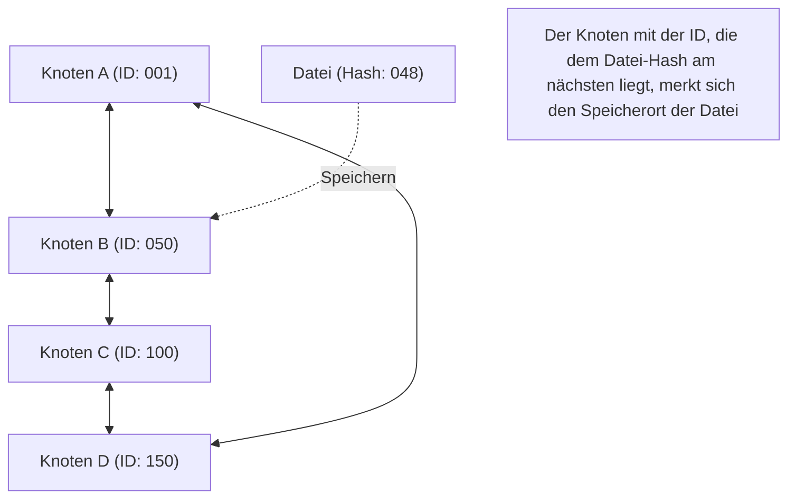

## 1. Abkehr vom zentralisierten Netzwerkmodell

In der Welt des Internets ist die überwältigende Mehrheit der Kommunikationsmodelle, die wir normalerweise unbewusst nutzen, das „**Client-Server-Modell**“.
Wenn wir Websites durchsuchen oder Videos ansehen, fordern unsere Smartphones (Clients) ständig Daten von leistungsstarken Computern (Servern) in riesigen Rechenzentren an und empfangen diese.

Dieses Modell hat jedoch eine klare Schwachstelle. Es ist das Problem des „Single Point of Failure“, bei dem der Server ausfällt, wenn sich die Zugriffe zu sehr konzentrieren und die Verarbeitung nicht mehr mithalten kann. Zudem gibt es ein strukturelles Problem, bei dem enorme Kosten und Macht bei dem Unternehmen konzentriert werden, das den Server unterhält und verwaltet.

Als völlig anderer Ansatz hierfür wurde das „**P2P-Modell (Peer-to-Peer)**“ erdacht.
Bei P2P gibt es keine privilegierten „Server“. Alle Computer (Peers), die am Netzwerk teilnehmen, tauschen Daten direkt miteinander in einer gleichberechtigten (Peer) Beziehung aus.

## 2. Die drei Architekturen von P2P

Die P2P-Technologie hat sich im Laufe ihrer Geschichte im Wesentlichen zu drei Architekturen weiterentwickelt.

### Erste Generation: Hybrid-P2P (Napster-Typ)
Ein typisches Beispiel ist „Napster“, das 1999 erschien und einen weltweiten Sturm des Musik-File-Sharings auslöste.
Der tatsächliche Dateiaustausch findet zwischen den PCs der Benutzer statt (P2P), aber **nur die Indexinformationen (Inhaltsverzeichnis)** darüber, „wer welche Datei hat“, **wurden zentral auf einem Server verwaltet**.
Die Suche war extrem schnell und effizient, aber es gab die Schwachstelle, dass das gesamte Netzwerk nicht mehr funktionierte, wenn der zentrale Server gerichtlich gestoppt und abgeschaltet wurde.

### Zweite Generation: Pure-P2P (Gnutella-, Winny-Typ)
Dies ist ein System, das zentrale Server vollständig eliminiert und auch Suchanfragen durch eine Eimerkette (Bucket Brigade) zwischen Benutzern durchführt.
Indem sogar der „Index“ dezentralisiert wurde, erreichte es eine extrem hohe Robustheit (Fehlertoleranz), bei der das Netzwerk nicht stoppt, selbst wenn ein bestimmter Server ausfällt. Es hatte jedoch ein „Skalierbarkeitsproblem“, da Suchpakete das gesamte Netzwerk überschwemmten, um die gewünschte Datei zu finden, was die Kommunikationsbandbreite belastete.

### Dritte Generation: P2P mittels DHT (Verteilte Hash-Tabelle)
Der heutige Mainstream der P2P-Technologie ist das System, das **DHT (Distributed Hash Table)** verwendet. Es wird weitgehend in Systemen wie BitTorrent eingesetzt.

DHT weist allen Peers und Dateien im Netzwerk eine „mathematische ID (Hash-Wert)“ zu und unterteilt und verwaltet den riesigen Netzwerkraum basierend auf Regeln. Bei der Suche nach der gewünschten Datei fragt man nicht blindlings herum, sondern leitet die Suchanfrage auf dem kürzesten Weg an den „Peer mit der ID, die der ID der Datei am nächsten ist“ weiter, wodurch man die gewünschten Daten selbst in einem Netzwerk mit Millionen von Teilnehmern in extrem kurzer Zeit erreichen kann.

## 3. Die Stärke dezentraler Systeme: Skalierbarkeit

Die größte Magie der P2P-Technologie liegt in ihrer paradoxen Eigenschaft: „**Je mehr Benutzer es gibt, desto mehr verbessert sich die Kapazität des gesamten Systems**“.

Im Client-Server-Modell wird die Serverlast millionenfach höher, wenn es eine Million Nutzer gibt.
In einem P2P-Netzwerk bedeutet die Teilnahme von einer Million Menschen jedoch gleichzeitig, dass dem System „die CPU-Leistung von einer Million Geräten und die Kommunikationsbandbreite von einer Million Leitungen“ hinzugefügt wird. Je mehr Menschen Daten anfordern, desto mehr Menschen können diese Daten gleichzeitig bereitstellen, sodass das Gesamtsystem niemals ausfällt.

Das „**BitTorrent**“-Protokoll, das es Zehntausenden von Menschen ermöglicht, riesige Dateien gleichzeitig und mit hoher Geschwindigkeit herunterzuladen, macht von dieser Eigenschaft in höchstem Maße Gebrauch. Es wird weithin als eine Technologie genutzt, die moderne, gigantische Infrastrukturen im Hintergrund unterstützt, wie beispielsweise die Verteilung von Windows-OS-Images oder Update-Verteilungen für Steam, die größte Gaming-Plattform der Welt.

## 4. P2P und Blockchain: Die Genealogie zum Web3

Im Jahr 2008 begann mit der Veröffentlichung eines Papiers durch eine Person, die sich Satoshi Nakamoto nannte, eine neue Geschichte des P2P.
Es ist „**Bitcoin**“.

Bisherige P2P-Systeme wurden für das „Teilen von Dateien“ oder die „Verteilung von Rechenprozessen“ verwendet, aber Bitcoin nutzte das P2P-Netzwerk für die „**Verteilung von Vertrauen**“.
Selbst ohne eine zentrale Bank oder einen Administrator überwachen unzählige Knoten, die am P2P-Netzwerk teilnehmen, gegenseitig ihre Transaktionsaufzeichnungen (Ledger). Durch die Kombination von Kryptographie (Hash-Funktionen und Public-Key-Verschlüsselung) und Konsensalgorithmen (Proof of Work) bauten sie ein „dezentrales System auf, bei dem die Manipulation von Daten praktisch unmöglich ist = **Blockchain**“.

Diese Idee eines „autonomen, dezentralen Netzwerks, das nicht von einem bestimmten Administrator abhängig ist“, führt direkt zur aktuellen „Web3 (dezentrales Web)“-Bewegung.

## 5. Herausforderungen und Zukunft der P2P-Technologie

P2P ist eine großartige Technologie, aber es gibt auch Herausforderungen.

Eine davon ist das „**Trittbrettfahrer (Free Rider)**“-Problem. Wenn es zu viele Benutzer gibt, die nur Daten empfangen, aber nicht selbst bereitstellen, wird das Netzwerk verfallen. Um dieses Problem zu lösen, wird an Mechanismen geforscht, die auf Grundlage der bereitgestellten Datenmenge vorrangige Download-Rechte gewähren, oder an Mechanismen, die finanzielle Anreize (Token) ähnlich der Blockchain bieten.

Ein weiteres Problem ist „**Governance und Sicherheit**“. Da es keinen zentralen Administrator gibt, ist es schwierig, böswillige Knoten sofort zu blockieren, wenn sie gefälschte Daten oder Viren verbreiten.

P2P ist nicht einfach nur eine Technologie für „File-Sharing-Software“. Es ist der Gipfel der „dezentralen Systeme“ in der Informatik und eine Architektur mit der starken Philosophie, Macht nicht an einem einzigen Punkt zu konzentrieren. Die P2P-Technologie wird sich auch in Zukunft als Grundlage für die Kommunikation zwischen IoT-Geräten und für die nächste Generation dezentraler Internetinfrastrukturen weiterentwickeln.
