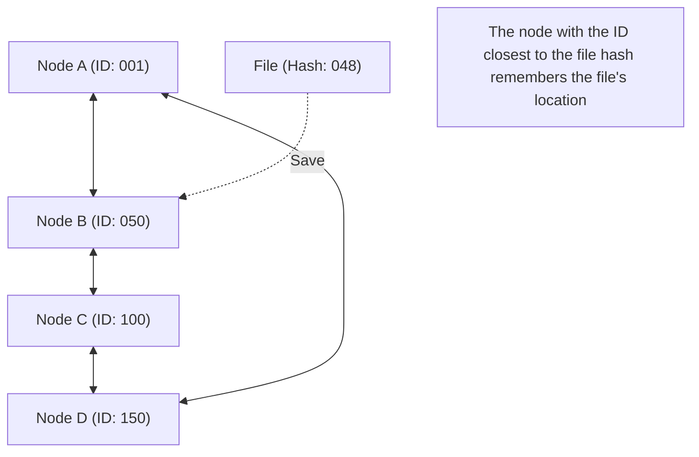

## 1. Decentralized Network Model

In the world of the internet, the overwhelming majority of communication models we use without usually noticing is the "**client-server model**".
When browsing websites or watching videos, our smartphones (clients) constantly request data from and receive it from high-performance computers (servers) in massive data centers.

However, this model has a clear weakness. It suffers from the "Single Point of Failure" problem, where servers can crash if access is too concentrated and processing cannot keep up. It also faces the structural issue of enormous costs and power being concentrated in the companies that maintain and manage the servers.

The "**P2P (Peer-to-Peer) model**" was devised as a completely different approach to this.
In P2P, there are no privileged "servers". All computers (peers) participating in the network exchange data directly in an equal (Peer) relationship with one another.

## 2. The Three Architectures of P2P

P2P technology has evolved largely into three architectures throughout its history.

### First Generation: Hybrid P2P (Napster Model)
"Napster," which appeared in 1999 and caused a storm of music file sharing worldwide, is a prime example.
The exchange of files itself was done between users' PCs (P2P), but only the **index (table of contents) information of "who has which file" was centrally managed by a central server**.
While searching was extremely fast and efficient, it had the weakness that if the central server was legally enjoined and shut down, the entire network would cease to function.

### Second Generation: Pure P2P (Gnutella, Winny Model)
This method completely eliminates the central server, and search requests are also performed through a bucket brigade among users.
By decentralizing even the "index," it achieved extremely high robustness (fault tolerance) where the network would not stop even if specific servers were taken down. However, it faced a "scalability problem" because search packets flooded the entire network to find the desired files, putting pressure on communication bandwidth.

### Third Generation: P2P Using DHT (Distributed Hash Table)
The method using **DHT (Distributed Hash Table)** has become the mainstream of current P2P technology. It is widely used in systems like BitTorrent.

DHT assigns a "mathematical ID (hash value)" to all peers and files on the network, dividing and managing the vast network space based on rules. When searching for a desired file, instead of asking around blindly, it forwards the search request along the shortest route toward "the peer with the ID closest to that file's ID," allowing it to reach the target data in an extremely short time even in a network with millions of participants.

## 3. The Strength of Distributed Systems: Scalability

The greatest magic of P2P technology lies in its paradoxical nature: "**the more users increase, the more the overall capability of the system improves.**"

In the client-server model, if the number of users becomes 1 million, the server load increases 1 million times.
However, in a P2P network, the participation of 1 million people simultaneously means that "the CPU power of 1 million machines and the communication bandwidth of 1 million lines" are added to the system. As the number of people wanting data increases, the number of people who can supply that data also increases simultaneously, so the system as a whole never goes down.

The "**BitTorrent**" protocol, which allows tens of thousands of people to simultaneously download huge files at high speeds, takes this characteristic to its limits. It is widely utilized as the technology supporting modern massive infrastructures behind the scenes, such as the distribution of Windows OS images and update deliveries for Steam, the world's largest game platform.

## 4. P2P and Blockchain: The Genealogy to Web3

In 2008, a new history of P2P began with a paper published by a person calling themselves Satoshi Nakamoto.
It was "**Bitcoin**".

While traditional P2P systems were used for "file sharing" and "distributed computing," Bitcoin used the P2P network for the "**distribution of trust**".
Even without a central bank or administrator, the countless nodes participating in the P2P network monitor each other's transaction records (ledgers), and by combining cryptographic technology (hash functions and public key cryptography) with a consensus algorithm (Proof of Work), they constructed a "distributed system where data tampering is practically impossible = **blockchain**".

This philosophy of an "autonomous decentralized network that does not rely on a specific administrator" connects directly to the current "Web3 (Decentralized Web)" movement.

## 5. Challenges and the Future of P2P Technology

P2P is a wonderful technology, but challenges also exist.

One is the "**free rider**" problem. If there are many users who only receive data but do not provide it themselves, the network will decline. To solve this problem, mechanisms that grant the right to download preferentially based on the amount provided, and mechanisms that provide financial incentives (tokens) like blockchain, are being researched.

Another is "**governance and security**". Because there is no central administrator, if a malicious node scatters fake data or viruses, it is difficult to block it immediately.

P2P is not just a technology for "file-sharing software." It is the ultimate form of "distributed systems" in computer science and an architecture with a strong philosophy of not concentrating power in a single point. P2P technology will continue to evolve in the future as a foundation for communication between IoT devices and next-generation decentralized internet infrastructure.
