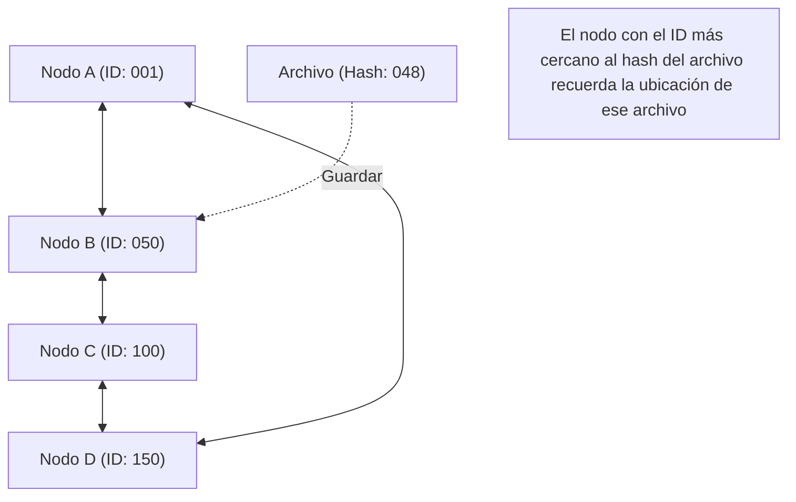

## 1. Un modelo de red descentralizado

En el mundo de Internet, la inmensa mayoría de los modelos de comunicación que utilizamos sin darnos cuenta son el modelo **cliente-servidor**.
Al navegar por un sitio web o ver un vídeo, nuestros teléfonos inteligentes (clientes) siempre solicitan y reciben datos de ordenadores de alto rendimiento (servidores) situados en enormes centros de datos.

Sin embargo, este modelo tiene una debilidad clara. Existe el problema del "Punto Único de Fallo" (Single Point of Failure), donde si el acceso se concentra demasiado en el servidor, este no puede seguir el ritmo del procesamiento y se cae. También tiene el problema estructural de que una enorme cantidad de costes y poder se concentran en las empresas que mantienen y gestionan los servidores.

Como un enfoque completamente diferente a este, se concibió el modelo **P2P (Peer-to-Peer)**.
En P2P, no existen "servidores" privilegiados. Todos los ordenadores (peers) que participan en la red intercambian datos directamente entre sí en una relación de igualdad (Peer).

## 2. Las tres arquitecturas de P2P

La tecnología P2P ha evolucionado hacia tres grandes arquitecturas a lo largo de su historia.

### Primera generación: P2P híbrido (Tipo Napster)
Un ejemplo representativo es "Napster", que apareció en 1999 y desató una tormenta de intercambio de archivos musicales en todo el mundo.
Aunque el intercambio de archivos en sí se realiza entre los PC de los usuarios (P2P), **la información de índice, sobre "quién tiene qué archivo", se gestionaba de forma centralizada en un servidor central**.
Las búsquedas eran extremadamente rápidas y eficientes, pero tenía la debilidad de que, si el servidor central era cerrado legalmente y se detenía, toda la red dejaba de funcionar.

### Segunda generación: P2P puro (Tipo Gnutella, Winny)
Este método elimina por completo el servidor central y realiza las solicitudes de búsqueda mediante un sistema de relevos ("bucket brigade") entre los propios usuarios.
Al descentralizar incluso el "índice", logró un nivel extremadamente alto de robustez (tolerancia a fallos) en el que la red no se detiene incluso si un servidor específico se cae. Sin embargo, tenía un "problema de escalabilidad", ya que la red entera se inundaba de paquetes de búsqueda para encontrar el archivo deseado, consumiendo una gran cantidad de ancho de banda.

### Tercera generación: P2P mediante DHT (Tabla Hash Distribuida)
La corriente principal actual de la tecnología P2P es el método que utiliza **DHT (Distributed Hash Table)**. Se utiliza ampliamente en BitTorrent y otros.

El DHT asigna un "ID matemático (valor hash)" a todos los peers y archivos de la red, y divide y gestiona el vasto espacio de la red en base a reglas. Al buscar el archivo deseado, en lugar de preguntar a ciegas a los alrededores, la solicitud de búsqueda se transfiere por la ruta más corta hacia "el peer que tiene el ID más cercano al ID de ese archivo", lo que permite llegar a los datos deseados en muy poco tiempo, incluso en redes en las que participan millones de personas.

## 3. La fortaleza de los sistemas distribuidos: Escalabilidad

La mayor magia de la tecnología P2P reside en su naturaleza paradójica: "**cuantos más usuarios hay, mayor es la capacidad general del sistema**".

En un modelo cliente-servidor, si el número de usuarios llega a un millón, la carga del servidor se multiplica por un millón.
Sin embargo, en una red P2P, que participen un millón de personas significa al mismo tiempo que se añaden al sistema "un millón de unidades de potencia de CPU y un millón de líneas de ancho de banda". Cuantas más personas deseen los datos, más personas podrán suministrarlos simultáneamente, por lo que el sistema en su conjunto nunca se cae.

El protocolo que ha aprovechado al máximo esta característica es **BitTorrent**, que permite que decenas de miles de personas descarguen simultáneamente y a gran velocidad archivos de gran tamaño. Se utiliza ampliamente como tecnología subyacente para infraestructuras modernas de gran tamaño, como la distribución de imágenes del sistema operativo Windows y la distribución de actualizaciones en Steam, la plataforma de juegos más grande del mundo.

## 4. P2P y Blockchain: Genealogía hacia Web3

En 2008, comenzó una nueva historia del P2P con la publicación de un documento por parte de una persona que se hacía llamar Satoshi Nakamoto.
Se trata de **Bitcoin**.

Los sistemas P2P tradicionales se utilizaban para "compartir archivos" o "distribuir el procesamiento computacional", pero Bitcoin utilizó la red P2P para "la **distribución de la confianza**".
Incluso sin un banco central o administrador, los innumerables nodos que participan en la red P2P supervisan los registros de transacciones (el libro mayor) de los demás, y combinando la criptografía (funciones hash y criptografía de clave pública) con los algoritmos de consenso (Proof of Work), construyeron un "sistema distribuido donde la alteración de datos es prácticamente imposible: la **blockchain**".

Esta idea de una "red descentralizada autónoma que no depende de un administrador específico" está directamente vinculada al movimiento actual llamado "Web3 (Web Descentralizada)".

## 5. Retos y futuro de la tecnología P2P

El P2P es una tecnología maravillosa, pero también presenta desafíos.
Uno de ellos es el problema de los "**polizones (free riders)**". Si aumenta el número de usuarios que solo reciben datos pero no los proporcionan, la red declina. Para resolver este problema, se están investigando mecanismos como el otorgamiento de derechos de descarga prioritaria en función de la cantidad proporcionada, o incentivos económicos (tokens) como en la blockchain.

Otro es "**la gobernanza y la seguridad**". Dado que no hay un administrador central, si un nodo malicioso difunde datos falsos o virus, es difícil bloquearlo de inmediato.

El P2P no es solo una tecnología de "software para compartir archivos". Es el pináculo de los "sistemas distribuidos" en la informática y una arquitectura con una fuerte filosofía de no concentrar el poder en un solo punto. En el futuro, la tecnología P2P continuará evolucionando como base para la comunicación entre dispositivos IoT y la infraestructura de internet descentralizada de próxima generación.
