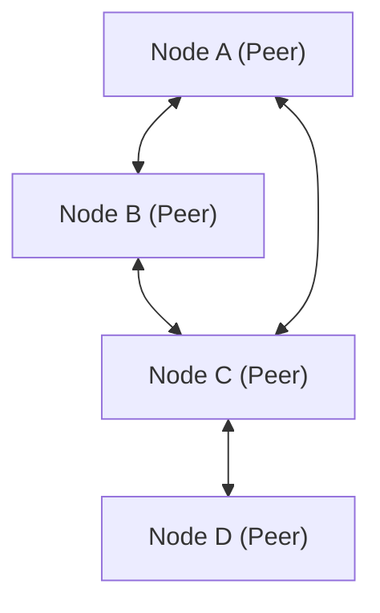

# Explication technique du P2P (Peer-to-Peer)

Le peer-to-peer (P2P), contrairement au modèle client-serveur, est une architecture réseau dans laquelle chaque nœud (pair) communique sur un pied d'égalité.

## Aperçu

Dans un réseau P2P, chaque nœud agit à la fois comme client et comme serveur. Cela élimine les points de défaillance uniques (SPOF) et améliore la disponibilité globale du système.

## Modélisation mathématique

La disponibilité des ressources dans un réseau P2P augmente de manière évolutive avec le nombre de nœuds $N$. La bande passante totale $B_{total}$ est exprimée comme suit :

$$ B_{total} = \sum_{i=1}^{N} b_i $$

Où $b_i$ est la bande passante fournie par chaque nœud.
