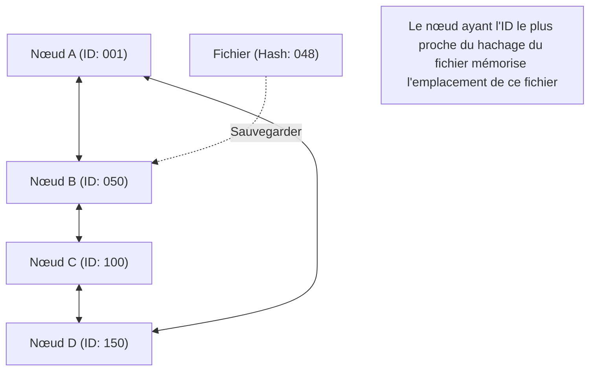

## 1. Un modèle de réseau au-delà de la centralisation

Dans le monde d'Internet, la grande majorité des modèles de communication que nous utilisons sans en avoir conscience sont des « **modèles client-serveur** ».
Lorsque nous naviguons sur un site Web ou regardons une vidéo, notre smartphone (le client) demande en permanence des données à des ordinateurs performants (les serveurs) situés dans de gigantesques centres de données, et les reçoit.

Cependant, ce modèle présente une faiblesse évidente. Il s'agit du problème du « point de défaillance unique (Single Point of Failure) », où si l'accès à un serveur est trop concentré, le traitement ne peut pas suivre et le serveur tombe en panne. Il comporte également un problème structurel en ce sens que d'énormes coûts et pouvoirs sont concentrés dans les entreprises qui maintiennent et gèrent ces serveurs.

Conçu comme une approche complètement différente pour contrer cela, le « **modèle P2P (Peer-to-Peer)** » a vu le jour.
Dans le P2P, il n'existe pas de « serveurs » privilégiés. Tous les ordinateurs (pairs) participant au réseau s'échangent des données directement et sur un pied d'égalité (Peer).

## 2. Les 3 architectures du P2P

La technologie P2P a évolué vers trois architectures majeures au cours de son histoire.

### Première génération : P2P hybride (Modèle Napster)
« Napster », apparu en 1999 et ayant déclenché une tempête de partage de fichiers musicaux dans le monde entier, en est l'exemple typique.
Bien que l'échange de fichiers lui-même s'effectue entre les PC des utilisateurs (P2P), **seules les informations d'index (le sommaire) indiquant « qui possède quel fichier » étaient gérées de manière centralisée par un serveur central**.
La recherche était très rapide et efficace, mais cela présentait l'inconvénient que si le serveur central était légalement bloqué et arrêté, le réseau entier cessait de fonctionner.

### Deuxième génération : P2P pur (Modèle Gnutella, Winny)
Il s'agit d'une méthode qui élimine complètement le serveur central et effectue les requêtes de recherche via un relais de type « chaîne de seaux » entre les utilisateurs.
Même l'« index » a été distribué, ce qui a permis d'acquérir une robustesse (tolérance aux pannes) extrêmement élevée, de sorte que le réseau ne s'arrête pas même si un serveur spécifique tombe en panne. Cependant, cette méthode présentait un « problème de scalabilité », car les paquets de recherche inondaient l'ensemble du réseau pour trouver le fichier souhaité, saturant ainsi la bande passante de communication.

### Troisième génération : P2P utilisant la DHT (Table de hachage distribuée)
La méthode utilisant une **DHT (Distributed Hash Table)** est aujourd'hui dominante dans la technologie P2P actuelle. Elle est largement utilisée par des systèmes comme BitTorrent.

La DHT attribue un « ID mathématique (valeur de hachage) » à tous les pairs et fichiers sur le réseau, et divise et gère le vaste espace réseau en fonction de règles. Lors de la recherche du fichier souhaité, au lieu de demander à l'aveuglette aux alentours, la requête de recherche est transférée par l'itinéraire le plus court vers « le pair ayant l'ID le plus proche de l'ID de ce fichier », de sorte que même dans un réseau réunissant des millions de participants, les données souhaitées peuvent être atteintes en un temps extrêmement court.

## 3. La force des systèmes distribués : La scalabilité

La plus grande magie de la technologie P2P réside dans sa nature paradoxale : « **plus le nombre d'utilisateurs augmente, plus la capacité de l'ensemble du système s'améliore** ».

Dans le modèle client-serveur, s'il y a un million d'utilisateurs, la charge du serveur est multipliée par un million.
Cependant, dans un réseau P2P, la participation d'un million de personnes signifie qu'« un million de fois la puissance du processeur et un million de lignes de bande passante » sont simultanément ajoutées au système. Plus il y a de personnes qui veulent des données, plus il y a de personnes qui peuvent fournir ces données, de sorte que le système dans son ensemble ne tombe jamais en panne.

C'est le protocole « **BitTorrent** », capable de télécharger des fichiers géants à grande vitesse simultanément avec des dizaines de milliers de personnes, qui a exploité au maximum cette caractéristique. Il est largement utilisé comme technologie de l'ombre pour soutenir d'immenses infrastructures modernes, telles que la distribution d'images du système d'exploitation Windows ou les diffusions de mises à jour pour Steam, la plus grande plateforme de jeux au monde.

## 4. Le P2P et la blockchain : L'origine du Web3

En 2008, avec la publication d'un article par une personne nommée Satoshi Nakamoto, une nouvelle histoire du P2P a commencé.
Il s'agit du « **Bitcoin** ».

Les systèmes P2P traditionnels étaient utilisés pour le « partage de fichiers » ou la « distribution de la puissance de calcul », mais le Bitcoin a utilisé le réseau P2P pour la « **distribution de la confiance** ».
Même en l'absence de banque ou d'administrateur centralisé, les innombrables nœuds participant au réseau P2P surveillent mutuellement leurs historiques de transactions (grands livres), et en combinant la cryptographie (fonctions de hachage et cryptographie à clé publique) avec un algorithme de consensus (Proof of Work), ils ont construit un « système distribué où l'altération des données est virtuellement impossible = **la [blockchain](/fr/p/blockchain-technology-smart-contract-distributed-ledger/)** ».

Cette idée d'un « réseau décentralisé et autonome qui ne dépend pas d'un administrateur spécifique » est directement liée au mouvement actuel du « Web3 (Web décentralisé) ».

## 5. Les défis et l'avenir de la technologie P2P

Le P2P est une technologie fantastique, mais elle présente aussi des défis.
L'un d'eux est le problème du « **passager clandestin (Free Rider)** ». Si un trop grand nombre d'utilisateurs ne font que recevoir des données sans les fournir, le réseau dépérit. Pour résoudre ce problème, des recherches portent sur des mécanismes accordant des droits de téléchargement prioritaire en fonction de la quantité fournie, ou des mécanismes offrant des incitations financières (jetons) comme la [blockchain](/fr/p/blockchain-technology-smart-contract-distributed-ledger/).

L'autre est la « **gouvernance et sécurité** ». Puisqu'il n'y a pas d'administrateur centralisé, si des nœuds malveillants diffusent de fausses données ou des virus, il est difficile de les bloquer immédiatement.

Le P2P n'est pas simplement une technologie de « logiciel de partage de fichiers ». C'est le sommet des « [systèmes distribués](/fr/p/cap-theorem-distributed-systems-tradeoff/) » en informatique, et c'est une architecture dotée d'une philosophie forte consistant à ne pas concentrer le pouvoir en un seul point. À l'avenir, la technologie P2P continuera probablement d'évoluer en tant que communication entre les appareils IoT et comme base de l'infrastructure Internet décentralisée de nouvelle génération.
