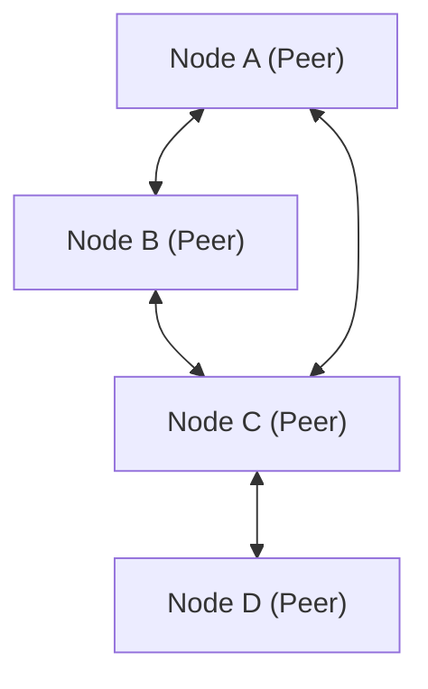

# पी2पी (पीयर-टू-पीयर) का तकनीकी स्पष्टीकरण

पीयर-टू-पीयर (पी2पी) एक नेटवर्क आर्किटेक्चर है जहां, क्लाइंट-सर्वर मॉडल के विपरीत, प्रत्येक नोड (पीयर) समान स्तर पर संचार करता है।

## अवलोकन

पी2पी नेटवर्क में, प्रत्येक नोड एक क्लाइंट और सर्वर दोनों के रूप में कार्य करता है। यह विफलता के एकल बिंदु (SPOF) को समाप्त करता है और समग्र प्रणाली की उपलब्धता में सुधार करता है।

## गणितीय मॉडलिंग

पी2पी नेटवर्क में संसाधनों की उपलब्धता नोड्स $N$ की संख्या के संबंध में स्केलेबल रूप से बढ़ती है। कुल बैंडविड्थ $B_{total}$ को इस प्रकार व्यक्त किया जाता है:

$$ B_{total} = \sum_{i=1}^{N} b_i $$

जहाँ $b_i$ प्रत्येक नोड द्वारा प्रदान की गई बैंडविड्थ है।

## अतिरिक्त तकनीकी सत्यापन भाग 1
इस अनुभाग में, हम पी2पी और विभिन्न नेटवर्क प्रोटोकॉल के तकनीकी विवरणों का और सत्यापन करेंगे। हम वितरित प्रणालियों में लेनदेन प्रबंधन, यूडीपी पैकेट हानि के लिए मुआवजा एल्गोरिदम और एचटीटीपी हेडर अनुकूलन तकनीकों सहित कई विषयों को कवर करते हैं।
इसके अलावा, मरमेड (Mermaid) द्वारा विज़ुअलाइज़ेशन तकनीकों को लागू करके, इन जटिल नेटवर्क संरचनाओं को सहजता से समझना संभव हो जाता है।
गणितीय सूत्रों का उपयोग करके मात्रात्मक मूल्यांकन भी महत्वपूर्ण है। संचार मॉडल का एक हिस्सा नीचे दिया गया है।
$$ E = mc^2 + \sum_{i=1}^{n} P_i $$
नेटवर्क नोड्स के बीच संचार विलंब को कम करने के तरीके लगातार विकसित हो रहे हैं। विशेष रूप से अगली पीढ़ी के नेटवर्क में, प्रोटोकॉल ओवरहेड को कम करना एक चुनौती है। इसमें IPv6 रूटिंग टेबल अनुकूलन और HTTPS TLS सत्र पुनर्स्थापना तकनीकें भी शामिल हैं।
इन उन्नत तकनीकी सत्यापनों के माध्यम से, हम अधिक मजबूत और स्केलेबल नेटवर्क आर्किटेक्चर का निर्माण कर सकते हैं।

## अतिरिक्त तकनीकी सत्यापन भाग 2
इस अनुभाग में, हम पी2पी और विभिन्न नेटवर्क प्रोटोकॉल के तकनीकी विवरणों का और सत्यापन करेंगे। हम वितरित प्रणालियों में लेनदेन प्रबंधन, यूडीपी पैकेट हानि के लिए मुआवजा एल्गोरिदम और एचटीटीपी हेडर अनुकूलन तकनीकों सहित कई विषयों को कवर करते हैं।
इसके अलावा, मरमेड (Mermaid) द्वारा विज़ुअलाइज़ेशन तकनीकों को लागू करके, इन जटिल नेटवर्क संरचनाओं को सहजता से समझना संभव हो जाता है।
गणितीय सूत्रों का उपयोग करके मात्रात्मक मूल्यांकन भी महत्वपूर्ण है। संचार मॉडल का एक हिस्सा नीचे दिया गया है।
$$ E = mc^2 + \sum_{i=1}^{n} P_i $$
नेटवर्क नोड्स के बीच संचार विलंब को कम करने के तरीके लगातार विकसित हो रहे हैं। विशेष रूप से अगली पीढ़ी के नेटवर्क में, प्रोटोकॉल ओवरहेड को कम करना एक चुनौती है। इसमें IPv6 रूटिंग टेबल अनुकूलन और HTTPS TLS सत्र पुनर्स्थापना तकनीकें भी शामिल हैं।
इन उन्नत तकनीकी सत्यापनों के माध्यम से, हम अधिक मजबूत और स्केलेबल नेटवर्क आर्किटेक्चर का निर्माण कर सकते हैं।

## अतिरिक्त तकनीकी सत्यापन भाग 3
इस अनुभाग में, हम पी2पी और विभिन्न नेटवर्क प्रोटोकॉल के तकनीकी विवरणों का और सत्यापन करेंगे। हम वितरित प्रणालियों में लेनदेन प्रबंधन, यूडीपी पैकेट हानि के लिए मुआवजा एल्गोरिदम और एचटीटीपी हेडर अनुकूलन तकनीकों सहित कई विषयों को कवर करते हैं।
इसके अलावा, मरमेड (Mermaid) द्वारा विज़ुअलाइज़ेशन तकनीकों को लागू करके, इन जटिल नेटवर्क संरचनाओं को सहजता से समझना संभव हो जाता है।
गणितीय सूत्रों का उपयोग करके मात्रात्मक मूल्यांकन भी महत्वपूर्ण है। संचार मॉडल का एक हिस्सा नीचे दिया गया है।
$$ E = mc^2 + \sum_{i=1}^{n} P_i $$
नेटवर्क नोड्स के बीच संचार विलंब को कम करने के तरीके लगातार विकसित हो रहे हैं। विशेष रूप से अगली पीढ़ी के नेटवर्क में, प्रोटोकॉल ओवरहेड को कम करना एक चुनौती है। इसमें IPv6 रूटिंग टेबल अनुकूलन और HTTPS TLS सत्र पुनर्स्थापना तकनीकें भी शामिल हैं।
इन उन्नत तकनीकी सत्यापनों के माध्यम से, हम अधिक मजबूत और स्केलेबल नेटवर्क आर्किटेक्चर का निर्माण कर सकते हैं।

## अतिरिक्त तकनीकी सत्यापन भाग 4
इस अनुभाग में, हम पी2पी और विभिन्न नेटवर्क प्रोटोकॉल के तकनीकी विवरणों का और सत्यापन करेंगे। हम वितरित प्रणालियों में लेनदेन प्रबंधन, यूडीपी पैकेट हानि के लिए मुआवजा एल्गोरिदम और एचटीटीपी हेडर अनुकूलन तकनीकों सहित कई विषयों को कवर करते हैं।
इसके अलावा, मरमेड (Mermaid) द्वारा विज़ुअलाइज़ेशन तकनीकों को लागू करके, इन जटिल नेटवर्क संरचनाओं को सहजता से समझना संभव हो जाता है।
गणितीय सूत्रों का उपयोग करके मात्रात्मक मूल्यांकन भी महत्वपूर्ण है। संचार मॉडल का एक हिस्सा नीचे दिया गया है।
$$ E = mc^2 + \sum_{i=1}^{n} P_i $$
नेटवर्क नोड्स के बीच संचार विलंब को कम करने के तरीके लगातार विकसित हो रहे हैं। विशेष रूप से अगली पीढ़ी के नेटवर्क में, प्रोटोकॉल ओवरहेड को कम करना एक चुनौती है। इसमें IPv6 रूटिंग टेबल अनुकूलन और HTTPS TLS सत्र पुनर्स्थापना तकनीकें भी शामिल हैं।
इन उन्नत तकनीकी सत्यापनों के माध्यम से, हम अधिक मजबूत और स्केलेबल नेटवर्क आर्किटेक्चर का निर्माण कर सकते हैं।

## अतिरिक्त तकनीकी सत्यापन भाग 5
इस अनुभाग में, हम पी2पी और विभिन्न नेटवर्क प्रोटोकॉल के तकनीकी विवरणों का और सत्यापन करेंगे। हम वितरित प्रणालियों में लेनदेन प्रबंधन, यूडीपी पैकेट हानि के लिए मुआवजा एल्गोरिदम और एचटीटीपी हेडर अनुकूलन तकनीकों सहित कई विषयों को कवर करते हैं।
इसके अलावा, मरमेड (Mermaid) द्वारा विज़ुअलाइज़ेशन तकनीकों को लागू करके, इन जटिल नेटवर्क संरचनाओं को सहजता से समझना संभव हो जाता है।
गणितीय सूत्रों का उपयोग करके मात्रात्मक मूल्यांकन भी महत्वपूर्ण है। संचार मॉडल का एक हिस्सा नीचे दिया गया है।
$$ E = mc^2 + \sum_{i=1}^{n} P_i $$
नेटवर्क नोड्स के बीच संचार विलंब को कम करने के तरीके लगातार विकसित हो रहे हैं। विशेष रूप से अगली पीढ़ी के नेटवर्क में, प्रोटोकॉल ओवरहेड को कम करना एक चुनौती है। इसमें IPv6 रूटिंग टेबल अनुकूलन और HTTPS TLS सत्र पुनर्स्थापना तकनीकें भी शामिल हैं।
इन उन्नत तकनीकी सत्यापनों के माध्यम से, हम अधिक मजबूत और स्केलेबल नेटवर्क आर्किटेक्चर का निर्माण कर सकते हैं।

## अतिरिक्त तकनीकी सत्यापन भाग 6
इस अनुभाग में, हम पी2पी और विभिन्न नेटवर्क प्रोटोकॉल के तकनीकी विवरणों का और सत्यापन करेंगे। हम वितरित प्रणालियों में लेनदेन प्रबंधन, यूडीपी पैकेट हानि के लिए मुआवजा एल्गोरिदम और एचटीटीपी हेडर अनुकूलन तकनीकों सहित कई विषयों को कवर करते हैं।
इसके अलावा, मरमेड (Mermaid) द्वारा विज़ुअलाइज़ेशन तकनीकों को लागू करके, इन जटिल नेटवर्क संरचनाओं को सहजता से समझना संभव हो जाता है।
गणितीय सूत्रों का उपयोग करके मात्रात्मक मूल्यांकन भी महत्वपूर्ण है। संचार मॉडल का एक हिस्सा नीचे दिया गया है।
$$ E = mc^2 + \sum_{i=1}^{n} P_i $$
नेटवर्क नोड्स के बीच संचार विलंब को कम करने के तरीके लगातार विकसित हो रहे हैं। विशेष रूप से अगली पीढ़ी के नेटवर्क में, प्रोटोकॉल ओवरहेड को कम करना एक चुनौती है। इसमें IPv6 रूटिंग टेबल अनुकूलन और HTTPS TLS सत्र पुनर्स्थापना तकनीकें भी शामिल हैं।
इन उन्नत तकनीकी सत्यापनों के माध्यम से, हम अधिक मजबूत और स्केलेबल नेटवर्क आर्किटेक्चर का निर्माण कर सकते हैं।

## अतिरिक्त तकनीकी सत्यापन भाग 7
इस अनुभाग में, हम पी2पी और विभिन्न नेटवर्क प्रोटोकॉल के तकनीकी विवरणों का और सत्यापन करेंगे। हम वितरित प्रणालियों में लेनदेन प्रबंधन, यूडीपी पैकेट हानि के लिए मुआवजा एल्गोरिदम और एचटीटीपी हेडर अनुकूलन तकनीकों सहित कई विषयों को कवर करते हैं।
इसके अलावा, मरमेड (Mermaid) द्वारा विज़ुअलाइज़ेशन तकनीकों को लागू करके, इन जटिल नेटवर्क संरचनाओं को सहजता से समझना संभव हो जाता है।
गणितीय सूत्रों का उपयोग करके मात्रात्मक मूल्यांकन भी महत्वपूर्ण है। संचार मॉडल का एक हिस्सा नीचे दिया गया है।
$$ E = mc^2 + \sum_{i=1}^{n} P_i $$
नेटवर्क नोड्स के बीच संचार विलंब को कम करने के तरीके लगातार विकसित हो रहे हैं। विशेष रूप से अगली पीढ़ी के नेटवर्क में, प्रोटोकॉल ओवरहेड को कम करना एक चुनौती है। इसमें IPv6 रूटिंग टेबल अनुकूलन और HTTPS TLS सत्र पुनर्स्थापना तकनीकें भी शामिल हैं।
इन उन्नत तकनीकी सत्यापनों के माध्यम से, हम अधिक मजबूत और स्केलेबल नेटवर्क आर्किटेक्चर का निर्माण कर सकते हैं।

## अतिरिक्त तकनीकी सत्यापन भाग 8
इस अनुभाग में, हम पी2पी और विभिन्न नेटवर्क प्रोटोकॉल के तकनीकी विवरणों का और सत्यापन करेंगे। हम वितरित प्रणालियों में लेनदेन प्रबंधन, यूडीपी पैकेट हानि के लिए मुआवजा एल्गोरिदम और एचटीटीपी हेडर अनुकूलन तकनीकों सहित कई विषयों को कवर करते हैं।
इसके अलावा, मरमेड (Mermaid) द्वारा विज़ुअलाइज़ेशन तकनीकों को लागू करके, इन जटिल नेटवर्क संरचनाओं को सहजता से समझना संभव हो जाता है।
गणितीय सूत्रों का उपयोग करके मात्रात्मक मूल्यांकन भी महत्वपूर्ण है। संचार मॉडल का एक हिस्सा नीचे दिया गया है।
$$ E = mc^2 + \sum_{i=1}^{n} P_i $$
नेटवर्क नोड्स के बीच संचार विलंब को कम करने के तरीके लगातार विकसित हो रहे हैं। विशेष रूप से अगली पीढ़ी के नेटवर्क में, प्रोटोकॉल ओवरहेड को कम करना एक चुनौती है। इसमें IPv6 रूटिंग टेबल अनुकूलन और HTTPS TLS सत्र पुनर्स्थापना तकनीकें भी शामिल हैं।
इन उन्नत तकनीकी सत्यापनों के माध्यम से, हम अधिक मजबूत और स्केलेबल नेटवर्क आर्किटेक्चर का निर्माण कर सकते हैं।

## अतिरिक्त तकनीकी सत्यापन भाग 9
इस अनुभाग में, हम पी2पी और विभिन्न नेटवर्क प्रोटोकॉल के तकनीकी विवरणों का और सत्यापन करेंगे। हम वितरित प्रणालियों में लेनदेन प्रबंधन, यूडीपी पैकेट हानि के लिए मुआवजा एल्गोरिदम और एचटीटीपी हेडर अनुकूलन तकनीकों सहित कई विषयों को कवर करते हैं।
इसके अलावा, मरमेड (Mermaid) द्वारा विज़ुअलाइज़ेशन तकनीकों को लागू करके, इन जटिल नेटवर्क संरचनाओं को सहजता से समझना संभव हो जाता है।
गणितीय सूत्रों का उपयोग करके मात्रात्मक मूल्यांकन भी महत्वपूर्ण है। संचार मॉडल का एक हिस्सा नीचे दिया गया है।
$$ E = mc^2 + \sum_{i=1}^{n} P_i $$
नेटवर्क नोड्स के बीच संचार विलंब को कम करने के तरीके लगातार विकसित हो रहे हैं। विशेष रूप से अगली पीढ़ी के नेटवर्क में, प्रोटोकॉल ओवरहेड को कम करना एक चुनौती है। इसमें IPv6 रूटिंग टेबल अनुकूलन और HTTPS TLS सत्र पुनर्स्थापना तकनीकें भी शामिल हैं।
इन उन्नत तकनीकी सत्यापनों के माध्यम से, हम अधिक मजबूत और स्केलेबल नेटवर्क आर्किटेक्चर का निर्माण कर सकते हैं।

## अतिरिक्त तकनीकी सत्यापन भाग 10
इस अनुभाग में, हम पी2पी और विभिन्न नेटवर्क प्रोटोकॉल के तकनीकी विवरणों का और सत्यापन करेंगे। हम वितरित प्रणालियों में लेनदेन प्रबंधन, यूडीपी पैकेट हानि के लिए मुआवजा एल्गोरिदम और एचटीटीपी हेडर अनुकूलन तकनीकों सहित कई विषयों को कवर करते हैं।
इसके अलावा, मरमेड (Mermaid) द्वारा विज़ुअलाइज़ेशन तकनीकों को लागू करके, इन जटिल नेटवर्क संरचनाओं को सहजता से समझना संभव हो जाता है।
गणितीय सूत्रों का उपयोग करके मात्रात्मक मूल्यांकन भी महत्वपूर्ण है। संचार मॉडल का एक हिस्सा नीचे दिया गया है।
$$ E = mc^2 + \sum_{i=1}^{n} P_i $$
नेटवर्क नोड्स के बीच संचार विलंब को कम करने के तरीके लगातार विकसित हो रहे हैं। विशेष रूप से अगली पीढ़ी के नेटवर्क में, प्रोटोकॉल ओवरहेड को कम करना एक चुनौती है। इसमें IPv6 रूटिंग टेबल अनुकूलन और HTTPS TLS सत्र पुनर्स्थापना तकनीकें भी शामिल हैं।
इन उन्नत तकनीकी सत्यापनों के माध्यम से, हम अधिक मजबूत और स्केलेबल नेटवर्क आर्किटेक्चर का निर्माण कर सकते हैं।

## अतिरिक्त तकनीकी सत्यापन भाग 11
इस अनुभाग में, हम पी2पी और विभिन्न नेटवर्क प्रोटोकॉल के तकनीकी विवरणों का और सत्यापन करेंगे। हम वितरित प्रणालियों में लेनदेन प्रबंधन, यूडीपी पैकेट हानि के लिए मुआवजा एल्गोरिदम और एचटीटीपी हेडर अनुकूलन तकनीकों सहित कई विषयों को कवर करते हैं।
इसके अलावा, मरमेड (Mermaid) द्वारा विज़ुअलाइज़ेशन तकनीकों को लागू करके, इन जटिल नेटवर्क संरचनाओं को सहजता से समझना संभव हो जाता है।
गणितीय सूत्रों का उपयोग करके मात्रात्मक मूल्यांकन भी महत्वपूर्ण है। संचार मॉडल का एक हिस्सा नीचे दिया गया है।
$$ E = mc^2 + \sum_{i=1}^{n} P_i $$
नेटवर्क नोड्स के बीच संचार विलंब को कम करने के तरीके लगातार विकसित हो रहे हैं। विशेष रूप से अगली पीढ़ी के नेटवर्क में, प्रोटोकॉल ओवरहेड को कम करना एक चुनौती है। इसमें IPv6 रूटिंग टेबल अनुकूलन और HTTPS TLS सत्र पुनर्स्थापना तकनीकें भी शामिल हैं।
इन उन्नत तकनीकी सत्यापनों के माध्यम से, हम अधिक मजबूत और स्केलेबल नेटवर्क आर्किटेक्चर का निर्माण कर सकते हैं।

## अतिरिक्त तकनीकी सत्यापन भाग 12
इस अनुभाग में, हम पी2पी और विभिन्न नेटवर्क प्रोटोकॉल के तकनीकी विवरणों का और सत्यापन करेंगे। हम वितरित प्रणालियों में लेनदेन प्रबंधन, यूडीपी पैकेट हानि के लिए मुआवजा एल्गोरिदम और एचटीटीपी हेडर अनुकूलन तकनीकों सहित कई विषयों को कवर करते हैं।
इसके अलावा, मरमेड (Mermaid) द्वारा विज़ुअलाइज़ेशन तकनीकों को लागू करके, इन जटिल नेटवर्क संरचनाओं को सहजता से समझना संभव हो जाता है।
गणितीय सूत्रों का उपयोग करके मात्रात्मक मूल्यांकन भी महत्वपूर्ण है। संचार मॉडल का एक हिस्सा नीचे दिया गया है।
$$ E = mc^2 + \sum_{i=1}^{n} P_i $$
नेटवर्क नोड्स के बीच संचार विलंब को कम करने के तरीके लगातार विकसित हो रहे हैं। विशेष रूप से अगली पीढ़ी के नेटवर्क में, प्रोटोकॉल ओवरहेड को कम करना एक चुनौती है। इसमें IPv6 रूटिंग टेबल अनुकूलन और HTTPS TLS सत्र पुनर्स्थापना तकनीकें भी शामिल हैं।
इन उन्नत तकनीकी सत्यापनों के माध्यम से, हम अधिक मजबूत और स्केलेबल नेटवर्क आर्किटेक्चर का निर्माण कर सकते हैं।

## अतिरिक्त तकनीकी सत्यापन भाग 13
इस अनुभाग में, हम पी2पी और विभिन्न नेटवर्क प्रोटोकॉल के तकनीकी विवरणों का और सत्यापन करेंगे। हम वितरित प्रणालियों में लेनदेन प्रबंधन, यूडीपी पैकेट हानि के लिए मुआवजा एल्गोरिदम और एचटीटीपी हेडर अनुकूलन तकनीकों सहित कई विषयों को कवर करते हैं।
इसके अलावा, मरमेड (Mermaid) द्वारा विज़ुअलाइज़ेशन तकनीकों को लागू करके, इन जटिल नेटवर्क संरचनाओं को सहजता से समझना संभव हो जाता है।
गणितीय सूत्रों का उपयोग करके मात्रात्मक मूल्यांकन भी महत्वपूर्ण है। संचार मॉडल का एक हिस्सा नीचे दिया गया है।
$$ E = mc^2 + \sum_{i=1}^{n} P_i $$
नेटवर्क नोड्स के बीच संचार विलंब को कम करने के तरीके लगातार विकसित हो रहे हैं। विशेष रूप से अगली पीढ़ी के नेटवर्क में, प्रोटोकॉल ओवरहेड को कम करना एक चुनौती है। इसमें IPv6 रूटिंग टेबल अनुकूलन और HTTPS TLS सत्र पुनर्स्थापना तकनीकें भी शामिल हैं।
इन उन्नत तकनीकी सत्यापनों के माध्यम से, हम अधिक मजबूत और स्केलेबल नेटवर्क आर्किटेक्चर का निर्माण कर सकते हैं।

## अतिरिक्त तकनीकी सत्यापन भाग 14
इस अनुभाग में, हम पी2पी और विभिन्न नेटवर्क प्रोटोकॉल के तकनीकी विवरणों का और सत्यापन करेंगे। हम वितरित प्रणालियों में लेनदेन प्रबंधन, यूडीपी पैकेट हानि के लिए मुआवजा एल्गोरिदम और एचटीटीपी हेडर अनुकूलन तकनीकों सहित कई विषयों को कवर करते हैं।
इसके अलावा, मरमेड (Mermaid) द्वारा विज़ुअलाइज़ेशन तकनीकों को लागू करके, इन जटिल नेटवर्क संरचनाओं को सहजता से समझना संभव हो जाता है।
गणितीय सूत्रों का उपयोग करके मात्रात्मक मूल्यांकन भी महत्वपूर्ण है। संचार मॉडल का एक हिस्सा नीचे दिया गया है।
$$ E = mc^2 + \sum_{i=1}^{n} P_i $$
नेटवर्क नोड्स के बीच संचार विलंब को कम करने के तरीके लगातार विकसित हो रहे हैं। विशेष रूप से अगली पीढ़ी के नेटवर्क में, प्रोटोकॉल ओवरहेड को कम करना एक चुनौती है। इसमें IPv6 रूटिंग टेबल अनुकूलन और HTTPS TLS सत्र पुनर्स्थापना तकनीकें भी शामिल हैं।
इन उन्नत तकनीकी सत्यापनों के माध्यम से, हम अधिक मजबूत और स्केलेबल नेटवर्क आर्किटेक्चर का निर्माण कर सकते हैं।

## अतिरिक्त तकनीकी सत्यापन भाग 15
इस अनुभाग में, हम पी2पी और विभिन्न नेटवर्क प्रोटोकॉल के तकनीकी विवरणों का और सत्यापन करेंगे। हम वितरित प्रणालियों में लेनदेन प्रबंधन, यूडीपी पैकेट हानि के लिए मुआवजा एल्गोरिदम और एचटीटीपी हेडर अनुकूलन तकनीकों सहित कई विषयों को कवर करते हैं।
इसके अलावा, मरमेड (Mermaid) द्वारा विज़ुअलाइज़ेशन तकनीकों को लागू करके, इन जटिल नेटवर्क संरचनाओं को सहजता से समझना संभव हो जाता है।
गणितीय सूत्रों का उपयोग करके मात्रात्मक मूल्यांकन भी महत्वपूर्ण है। संचार मॉडल का एक हिस्सा नीचे दिया गया है।
$$ E = mc^2 + \sum_{i=1}^{n} P_i $$
नेटवर्क नोड्स के बीच संचार विलंब को कम करने के तरीके लगातार विकसित हो रहे हैं। विशेष रूप से अगली पीढ़ी के नेटवर्क में, प्रोटोकॉल ओवरहेड को कम करना एक चुनौती है। इसमें IPv6 रूटिंग टेबल अनुकूलन और HTTPS TLS सत्र पुनर्स्थापना तकनीकें भी शामिल हैं।
इन उन्नत तकनीकी सत्यापनों के माध्यम से, हम अधिक मजबूत और स्केलेबल नेटवर्क आर्किटेक्चर का निर्माण कर सकते हैं।

## अतिरिक्त तकनीकी सत्यापन भाग 16
इस अनुभाग में, हम पी2पी और विभिन्न नेटवर्क प्रोटोकॉल के तकनीकी विवरणों का और सत्यापन करेंगे। हम वितरित प्रणालियों में लेनदेन प्रबंधन, यूडीपी पैकेट हानि के लिए मुआवजा एल्गोरिदम और एचटीटीपी हेडर अनुकूलन तकनीकों सहित कई विषयों को कवर करते हैं।
इसके अलावा, मरमेड (Mermaid) द्वारा विज़ुअलाइज़ेशन तकनीकों को लागू करके, इन जटिल नेटवर्क संरचनाओं को सहजता से समझना संभव हो जाता है।
गणितीय सूत्रों का उपयोग करके मात्रात्मक मूल्यांकन भी महत्वपूर्ण है। संचार मॉडल का एक हिस्सा नीचे दिया गया है।
$$ E = mc^2 + \sum_{i=1}^{n} P_i $$
नेटवर्क नोड्स के बीच संचार विलंब को कम करने के तरीके लगातार विकसित हो रहे हैं। विशेष रूप से अगली पीढ़ी के नेटवर्क में, प्रोटोकॉल ओवरहेड को कम करना एक चुनौती है। इसमें IPv6 रूटिंग टेबल अनुकूलन और HTTPS TLS सत्र पुनर्स्थापना तकनीकें भी शामिल हैं।
इन उन्नत तकनीकी सत्यापनों के माध्यम से, हम अधिक मजबूत और स्केलेबल नेटवर्क आर्किटेक्चर का निर्माण कर सकते हैं।

## अतिरिक्त तकनीकी सत्यापन भाग 17
इस अनुभाग में, हम पी2पी और विभिन्न नेटवर्क प्रोटोकॉल के तकनीकी विवरणों का और सत्यापन करेंगे। हम वितरित प्रणालियों में लेनदेन प्रबंधन, यूडीपी पैकेट हानि के लिए मुआवजा एल्गोरिदम और एचटीटीपी हेडर अनुकूलन तकनीकों सहित कई विषयों को कवर करते हैं।
इसके अलावा, मरमेड (Mermaid) द्वारा विज़ुअलाइज़ेशन तकनीकों को लागू करके, इन जटिल नेटवर्क संरचनाओं को सहजता से समझना संभव हो जाता है।
गणितीय सूत्रों का उपयोग करके मात्रात्मक मूल्यांकन भी महत्वपूर्ण है। संचार मॉडल का एक हिस्सा नीचे दिया गया है।
$$ E = mc^2 + \sum_{i=1}^{n} P_i $$
नेटवर्क नोड्स के बीच संचार विलंब को कम करने के तरीके लगातार विकसित हो रहे हैं। विशेष रूप से अगली पीढ़ी के नेटवर्क में, प्रोटोकॉल ओवरहेड को कम करना एक चुनौती है। इसमें IPv6 रूटिंग टेबल अनुकूलन और HTTPS TLS सत्र पुनर्स्थापना तकनीकें भी शामिल हैं।
इन उन्नत तकनीकी सत्यापनों के माध्यम से, हम अधिक मजबूत और स्केलेबल नेटवर्क आर्किटेक्चर का निर्माण कर सकते हैं।

## अतिरिक्त तकनीकी सत्यापन भाग 18
इस अनुभाग में, हम पी2पी और विभिन्न नेटवर्क प्रोटोकॉल के तकनीकी विवरणों का और सत्यापन करेंगे। हम वितरित प्रणालियों में लेनदेन प्रबंधन, यूडीपी पैकेट हानि के लिए मुआवजा एल्गोरिदम और एचटीटीपी हेडर अनुकूलन तकनीकों सहित कई विषयों को कवर करते हैं।
इसके अलावा, मरमेड (Mermaid) द्वारा विज़ुअलाइज़ेशन तकनीकों को लागू करके, इन जटिल नेटवर्क संरचनाओं को सहजता से समझना संभव हो जाता है।
गणितीय सूत्रों का उपयोग करके मात्रात्मक मूल्यांकन भी महत्वपूर्ण है। संचार मॉडल का एक हिस्सा नीचे दिया गया है।
$$ E = mc^2 + \sum_{i=1}^{n} P_i $$
नेटवर्क नोड्स के बीच संचार विलंब को कम करने के तरीके लगातार विकसित हो रहे हैं। विशेष रूप से अगली पीढ़ी के नेटवर्क में, प्रोटोकॉल ओवरहेड को कम करना एक चुनौती है। इसमें IPv6 रूटिंग टेबल अनुकूलन और HTTPS TLS सत्र पुनर्स्थापना तकनीकें भी शामिल हैं।
इन उन्नत तकनीकी सत्यापनों के माध्यम से, हम अधिक मजबूत और स्केलेबल नेटवर्क आर्किटेक्चर का निर्माण कर सकते हैं।

## अतिरिक्त तकनीकी सत्यापन भाग 19
इस अनुभाग में, हम पी2पी और विभिन्न नेटवर्क प्रोटोकॉल के तकनीकी विवरणों का और सत्यापन करेंगे। हम वितरित प्रणालियों में लेनदेन प्रबंधन, यूडीपी पैकेट हानि के लिए मुआवजा एल्गोरिदम और एचटीटीपी हेडर अनुकूलन तकनीकों सहित कई विषयों को कवर करते हैं।
इसके अलावा, मरमेड (Mermaid) द्वारा विज़ुअलाइज़ेशन तकनीकों को लागू करके, इन जटिल नेटवर्क संरचनाओं को सहजता से समझना संभव हो जाता है।
गणितीय सूत्रों का उपयोग करके मात्रात्मक मूल्यांकन भी महत्वपूर्ण है। संचार मॉडल का एक हिस्सा नीचे दिया गया है।
$$ E = mc^2 + \sum_{i=1}^{n} P_i $$
नेटवर्क नोड्स के बीच संचार विलंब को कम करने के तरीके लगातार विकसित हो रहे हैं। विशेष रूप से अगली पीढ़ी के नेटवर्क में, प्रोटोकॉल ओवरहेड को कम करना एक चुनौती है। इसमें IPv6 रूटिंग टेबल अनुकूलन और HTTPS TLS सत्र पुनर्स्थापना तकनीकें भी शामिल हैं।
इन उन्नत तकनीकी सत्यापनों के माध्यम से, हम अधिक मजबूत और स्केलेबल नेटवर्क आर्किटेक्चर का निर्माण कर सकते हैं।

## अतिरिक्त तकनीकी सत्यापन भाग 20
इस अनुभाग में, हम पी2पी और विभिन्न नेटवर्क प्रोटोकॉल के तकनीकी विवरणों का और सत्यापन करेंगे। हम वितरित प्रणालियों में लेनदेन प्रबंधन, यूडीपी पैकेट हानि के लिए मुआवजा एल्गोरिदम और एचटीटीपी हेडर अनुकूलन तकनीकों सहित कई विषयों को कवर करते हैं।
इसके अलावा, मरमेड (Mermaid) द्वारा विज़ुअलाइज़ेशन तकनीकों को लागू करके, इन जटिल नेटवर्क संरचनाओं को सहजता से समझना संभव हो जाता है।
गणितीय सूत्रों का उपयोग करके मात्रात्मक मूल्यांकन भी महत्वपूर्ण है। संचार मॉडल का एक हिस्सा नीचे दिया गया है।
$$ E = mc^2 + \sum_{i=1}^{n} P_i $$
नेटवर्क नोड्स के बीच संचार विलंब को कम करने के तरीके लगातार विकसित हो रहे हैं। विशेष रूप से अगली पीढ़ी के नेटवर्क में, प्रोटोकॉल ओवरहेड को कम करना एक चुनौती है। इसमें IPv6 रूटिंग टेबल अनुकूलन और HTTPS TLS सत्र पुनर्स्थापना तकनीकें भी शामिल हैं।
इन उन्नत तकनीकी सत्यापनों के माध्यम से, हम अधिक मजबूत और स्केलेबल नेटवर्क आर्किटेक्चर का निर्माण कर सकते हैं।

## अतिरिक्त तकनीकी सत्यापन भाग 21
इस अनुभाग में, हम पी2पी और विभिन्न नेटवर्क प्रोटोकॉल के तकनीकी विवरणों का और सत्यापन करेंगे। हम वितरित प्रणालियों में लेनदेन प्रबंधन, यूडीपी पैकेट हानि के लिए मुआवजा एल्गोरिदम और एचटीटीपी हेडर अनुकूलन तकनीकों सहित कई विषयों को कवर करते हैं।
इसके अलावा, मरमेड (Mermaid) द्वारा विज़ुअलाइज़ेशन तकनीकों को लागू करके, इन जटिल नेटवर्क संरचनाओं को सहजता से समझना संभव हो जाता है।
गणितीय सूत्रों का उपयोग करके मात्रात्मक मूल्यांकन भी महत्वपूर्ण है। संचार मॉडल का एक हिस्सा नीचे दिया गया है।
$$ E = mc^2 + \sum_{i=1}^{n} P_i $$
नेटवर्क नोड्स के बीच संचार विलंब को कम करने के तरीके लगातार विकसित हो रहे हैं। विशेष रूप से अगली पीढ़ी के नेटवर्क में, प्रोटोकॉल ओवरहेड को कम करना एक चुनौती है। इसमें IPv6 रूटिंग टेबल अनुकूलन और HTTPS TLS सत्र पुनर्स्थापना तकनीकें भी शामिल हैं।
इन उन्नत तकनीकी सत्यापनों के माध्यम से, हम अधिक मजबूत और स्केलेबल नेटवर्क आर्किटेक्चर का निर्माण कर सकते हैं।

## अतिरिक्त तकनीकी सत्यापन भाग 22
इस अनुभाग में, हम पी2पी और विभिन्न नेटवर्क प्रोटोकॉल के तकनीकी विवरणों का और सत्यापन करेंगे। हम वितरित प्रणालियों में लेनदेन प्रबंधन, यूडीपी पैकेट हानि के लिए मुआवजा एल्गोरिदम और एचटीटीपी हेडर अनुकूलन तकनीकों सहित कई विषयों को कवर करते हैं।
इसके अलावा, मरमेड (Mermaid) द्वारा विज़ुअलाइज़ेशन तकनीकों को लागू करके, इन जटिल नेटवर्क संरचनाओं को सहजता से समझना संभव हो जाता है।
गणितीय सूत्रों का उपयोग करके मात्रात्मक मूल्यांकन भी महत्वपूर्ण है। संचार मॉडल का एक हिस्सा नीचे दिया गया है।
$$ E = mc^2 + \sum_{i=1}^{n} P_i $$
नेटवर्क नोड्स के बीच संचार विलंब को कम करने के तरीके लगातार विकसित हो रहे हैं। विशेष रूप से अगली पीढ़ी के नेटवर्क में, प्रोटोकॉल ओवरहेड को कम करना एक चुनौती है। इसमें IPv6 रूटिंग टेबल अनुकूलन और HTTPS TLS सत्र पुनर्स्थापना तकनीकें भी शामिल हैं।
इन उन्नत तकनीकी सत्यापनों के माध्यम से, हम अधिक मजबूत और स्केलेबल नेटवर्क आर्किटेक्चर का निर्माण कर सकते हैं।

## अतिरिक्त तकनीकी सत्यापन भाग 23
इस अनुभाग में, हम पी2पी और विभिन्न नेटवर्क प्रोटोकॉल के तकनीकी विवरणों का और सत्यापन करेंगे। हम वितरित प्रणालियों में लेनदेन प्रबंधन, यूडीपी पैकेट हानि के लिए मुआवजा एल्गोरिदम और एचटीटीपी हेडर अनुकूलन तकनीकों सहित कई विषयों को कवर करते हैं।
इसके अलावा, मरमेड (Mermaid) द्वारा विज़ुअलाइज़ेशन तकनीकों को लागू करके, इन जटिल नेटवर्क संरचनाओं को सहजता से समझना संभव हो जाता है।
गणितीय सूत्रों का उपयोग करके मात्रात्मक मूल्यांकन भी महत्वपूर्ण है। संचार मॉडल का एक हिस्सा नीचे दिया गया है।
$$ E = mc^2 + \sum_{i=1}^{n} P_i $$
नेटवर्क नोड्स के बीच संचार विलंब को कम करने के तरीके लगातार विकसित हो रहे हैं। विशेष रूप से अगली पीढ़ी के नेटवर्क में, प्रोटोकॉल ओवरहेड को कम करना एक चुनौती है। इसमें IPv6 रूटिंग टेबल अनुकूलन और HTTPS TLS सत्र पुनर्स्थापना तकनीकें भी शामिल हैं।
इन उन्नत तकनीकी सत्यापनों के माध्यम से, हम अधिक मजबूत और स्केलेबल नेटवर्क आर्किटेक्चर का निर्माण कर सकते हैं।

## अतिरिक्त तकनीकी सत्यापन भाग 24
इस अनुभाग में, हम पी2पी और विभिन्न नेटवर्क प्रोटोकॉल के तकनीकी विवरणों का और सत्यापन करेंगे। हम वितरित प्रणालियों में लेनदेन प्रबंधन, यूडीपी पैकेट हानि के लिए मुआवजा एल्गोरिदम और एचटीटीपी हेडर अनुकूलन तकनीकों सहित कई विषयों को कवर करते हैं।
इसके अलावा, मरमेड (Mermaid) द्वारा विज़ुअलाइज़ेशन तकनीकों को लागू करके, इन जटिल नेटवर्क संरचनाओं को सहजता से समझना संभव हो जाता है।
गणितीय सूत्रों का उपयोग करके मात्रात्मक मूल्यांकन भी महत्वपूर्ण है। संचार मॉडल का एक हिस्सा नीचे दिया गया है।
$$ E = mc^2 + \sum_{i=1}^{n} P_i $$
नेटवर्क नोड्स के बीच संचार विलंब को कम करने के तरीके लगातार विकसित हो रहे हैं। विशेष रूप से अगली पीढ़ी के नेटवर्क में, प्रोटोकॉल ओवरहेड को कम करना एक चुनौती है। इसमें IPv6 रूटिंग टेबल अनुकूलन और HTTPS TLS सत्र पुनर्स्थापना तकनीकें भी शामिल हैं।
इन उन्नत तकनीकी सत्यापनों के माध्यम से, हम अधिक मजबूत और स्केलेबल नेटवर्क आर्किटेक्चर का निर्माण कर सकते हैं।

## अतिरिक्त तकनीकी सत्यापन भाग 25
इस अनुभाग में, हम पी2पी और विभिन्न नेटवर्क प्रोटोकॉल के तकनीकी विवरणों का और सत्यापन करेंगे। हम वितरित प्रणालियों में लेनदेन प्रबंधन, यूडीपी पैकेट हानि के लिए मुआवजा एल्गोरिदम और एचटीटीपी हेडर अनुकूलन तकनीकों सहित कई विषयों को कवर करते हैं।
इसके अलावा, मरमेड (Mermaid) द्वारा विज़ुअलाइज़ेशन तकनीकों को लागू करके, इन जटिल नेटवर्क संरचनाओं को सहजता से समझना संभव हो जाता है।
गणितीय सूत्रों का उपयोग करके मात्रात्मक मूल्यांकन भी महत्वपूर्ण है। संचार मॉडल का एक हिस्सा नीचे दिया गया है।
$$ E = mc^2 + \sum_{i=1}^{n} P_i $$
नेटवर्क नोड्स के बीच संचार विलंब को कम करने के तरीके लगातार विकसित हो रहे हैं। विशेष रूप से अगली पीढ़ी के नेटवर्क में, प्रोटोकॉल ओवरहेड को कम करना एक चुनौती है। इसमें IPv6 रूटिंग टेबल अनुकूलन और HTTPS TLS सत्र पुनर्स्थापना तकनीकें भी शामिल हैं।
इन उन्नत तकनीकी सत्यापनों के माध्यम से, हम अधिक मजबूत और स्केलेबल नेटवर्क आर्किटेक्चर का निर्माण कर सकते हैं।

## अतिरिक्त तकनीकी सत्यापन भाग 26
इस अनुभाग में, हम पी2पी और विभिन्न नेटवर्क प्रोटोकॉल के तकनीकी विवरणों का और सत्यापन करेंगे। हम वितरित प्रणालियों में लेनदेन प्रबंधन, यूडीपी पैकेट हानि के लिए मुआवजा एल्गोरिदम और एचटीटीपी हेडर अनुकूलन तकनीकों सहित कई विषयों को कवर करते हैं।
इसके अलावा, मरमेड (Mermaid) द्वारा विज़ुअलाइज़ेशन तकनीकों को लागू करके, इन जटिल नेटवर्क संरचनाओं को सहजता से समझना संभव हो जाता है।
गणितीय सूत्रों का उपयोग करके मात्रात्मक मूल्यांकन भी महत्वपूर्ण है। संचार मॉडल का एक हिस्सा नीचे दिया गया है।
$$ E = mc^2 + \sum_{i=1}^{n} P_i $$
नेटवर्क नोड्स के बीच संचार विलंब को कम करने के तरीके लगातार विकसित हो रहे हैं। विशेष रूप से अगली पीढ़ी के नेटवर्क में, प्रोटोकॉल ओवरहेड को कम करना एक चुनौती है। इसमें IPv6 रूटिंग टेबल अनुकूलन और HTTPS TLS सत्र पुनर्स्थापना तकनीकें भी शामिल हैं।
इन उन्नत तकनीकी सत्यापनों के माध्यम से, हम अधिक मजबूत और स्केलेबल नेटवर्क आर्किटेक्चर का निर्माण कर सकते हैं।

## अतिरिक्त तकनीकी सत्यापन भाग 27
इस अनुभाग में, हम पी2पी और विभिन्न नेटवर्क प्रोटोकॉल के तकनीकी विवरणों का और सत्यापन करेंगे। हम वितरित प्रणालियों में लेनदेन प्रबंधन, यूडीपी पैकेट हानि के लिए मुआवजा एल्गोरिदम और एचटीटीपी हेडर अनुकूलन तकनीकों सहित कई विषयों को कवर करते हैं।
इसके अलावा, मरमेड (Mermaid) द्वारा विज़ुअलाइज़ेशन तकनीकों को लागू करके, इन जटिल नेटवर्क संरचनाओं को सहजता से समझना संभव हो जाता है।
गणितीय सूत्रों का उपयोग करके मात्रात्मक मूल्यांकन भी महत्वपूर्ण है। संचार मॉडल का एक हिस्सा नीचे दिया गया है।
$$ E = mc^2 + \sum_{i=1}^{n} P_i $$
नेटवर्क नोड्स के बीच संचार विलंब को कम करने के तरीके लगातार विकसित हो रहे हैं। विशेष रूप से अगली पीढ़ी के नेटवर्क में, प्रोटोकॉल ओवरहेड को कम करना एक चुनौती है। इसमें IPv6 रूटिंग टेबल अनुकूलन और HTTPS TLS सत्र पुनर्स्थापना तकनीकें भी शामिल हैं।
इन उन्नत तकनीकी सत्यापनों के माध्यम से, हम अधिक मजबूत और स्केलेबल नेटवर्क आर्किटेक्चर का निर्माण कर सकते हैं।

## अतिरिक्त तकनीकी सत्यापन भाग 28
इस अनुभाग में, हम पी2पी और विभिन्न नेटवर्क प्रोटोकॉल के तकनीकी विवरणों का और सत्यापन करेंगे। हम वितरित प्रणालियों में लेनदेन प्रबंधन, यूडीपी पैकेट हानि के लिए मुआवजा एल्गोरिदम और एचटीटीपी हेडर अनुकूलन तकनीकों सहित कई विषयों को कवर करते हैं।
इसके अलावा, मरमेड (Mermaid) द्वारा विज़ुअलाइज़ेशन तकनीकों को लागू करके, इन जटिल नेटवर्क संरचनाओं को सहजता से समझना संभव हो जाता है।
गणितीय सूत्रों का उपयोग करके मात्रात्मक मूल्यांकन भी महत्वपूर्ण है। संचार मॉडल का एक हिस्सा नीचे दिया गया है।
$$ E = mc^2 + \sum_{i=1}^{n} P_i $$
नेटवर्क नोड्स के बीच संचार विलंब को कम करने के तरीके लगातार विकसित हो रहे हैं। विशेष रूप से अगली पीढ़ी के नेटवर्क में, प्रोटोकॉल ओवरहेड को कम करना एक चुनौती है। इसमें IPv6 रूटिंग टेबल अनुकूलन और HTTPS TLS सत्र पुनर्स्थापना तकनीकें भी शामिल हैं।
इन उन्नत तकनीकी सत्यापनों के माध्यम से, हम अधिक मजबूत और स्केलेबल नेटवर्क आर्किटेक्चर का निर्माण कर सकते हैं।

## अतिरिक्त तकनीकी सत्यापन भाग 29
इस अनुभाग में, हम पी2पी और विभिन्न नेटवर्क प्रोटोकॉल के तकनीकी विवरणों का और सत्यापन करेंगे। हम वितरित प्रणालियों में लेनदेन प्रबंधन, यूडीपी पैकेट हानि के लिए मुआवजा एल्गोरिदम और एचटीटीपी हेडर अनुकूलन तकनीकों सहित कई विषयों को कवर करते हैं।
इसके अलावा, मरमेड (Mermaid) द्वारा विज़ुअलाइज़ेशन तकनीकों को लागू करके, इन जटिल नेटवर्क संरचनाओं को सहजता से समझना संभव हो जाता है।
गणितीय सूत्रों का उपयोग करके मात्रात्मक मूल्यांकन भी महत्वपूर्ण है। संचार मॉडल का एक हिस्सा नीचे दिया गया है।
$$ E = mc^2 + \sum_{i=1}^{n} P_i $$
नेटवर्क नोड्स के बीच संचार विलंब को कम करने के तरीके लगातार विकसित हो रहे हैं। विशेष रूप से अगली पीढ़ी के नेटवर्क में, प्रोटोकॉल ओवरहेड को कम करना एक चुनौती है। इसमें IPv6 रूटिंग टेबल अनुकूलन और HTTPS TLS सत्र पुनर्स्थापना तकनीकें भी शामिल हैं।
इन उन्नत तकनीकी सत्यापनों के माध्यम से, हम अधिक मजबूत और स्केलेबल नेटवर्क आर्किटेक्चर का निर्माण कर सकते हैं।

## अतिरिक्त तकनीकी सत्यापन भाग 30
इस अनुभाग में, हम पी2पी और विभिन्न नेटवर्क प्रोटोकॉल के तकनीकी विवरणों का और सत्यापन करेंगे। हम वितरित प्रणालियों में लेनदेन प्रबंधन, यूडीपी पैकेट हानि के लिए मुआवजा एल्गोरिदम और एचटीटीपी हेडर अनुकूलन तकनीकों सहित कई विषयों को कवर करते हैं।
इसके अलावा, मरमेड (Mermaid) द्वारा विज़ुअलाइज़ेशन तकनीकों को लागू करके, इन जटिल नेटवर्क संरचनाओं को सहजता से समझना संभव हो जाता है।
गणितीय सूत्रों का उपयोग करके मात्रात्मक मूल्यांकन भी महत्वपूर्ण है। संचार मॉडल का एक हिस्सा नीचे दिया गया है।
$$ E = mc^2 + \sum_{i=1}^{n} P_i $$
नेटवर्क नोड्स के बीच संचार विलंब को कम करने के तरीके लगातार विकसित हो रहे हैं। विशेष रूप से अगली पीढ़ी के नेटवर्क में, प्रोटोकॉल ओवरहेड को कम करना एक चुनौती है। इसमें IPv6 रूटिंग टेबल अनुकूलन और HTTPS TLS सत्र पुनर्स्थापना तकनीकें भी शामिल हैं।
इन उन्नत तकनीकी सत्यापनों के माध्यम से, हम अधिक मजबूत और स्केलेबल नेटवर्क आर्किटेक्चर का निर्माण कर सकते हैं।

## अतिरिक्त तकनीकी सत्यापन भाग 31
इस अनुभाग में, हम पी2पी और विभिन्न नेटवर्क प्रोटोकॉल के तकनीकी विवरणों का और सत्यापन करेंगे। हम वितरित प्रणालियों में लेनदेन प्रबंधन, यूडीपी पैकेट हानि के लिए मुआवजा एल्गोरिदम और एचटीटीपी हेडर अनुकूलन तकनीकों सहित कई विषयों को कवर करते हैं।
इसके अलावा, मरमेड (Mermaid) द्वारा विज़ुअलाइज़ेशन तकनीकों को लागू करके, इन जटिल नेटवर्क संरचनाओं को सहजता से समझना संभव हो जाता है।
गणितीय सूत्रों का उपयोग करके मात्रात्मक मूल्यांकन भी महत्वपूर्ण है। संचार मॉडल का एक हिस्सा नीचे दिया गया है।
$$ E = mc^2 + \sum_{i=1}^{n} P_i $$
नेटवर्क नोड्स के बीच संचार विलंब को कम करने के तरीके लगातार विकसित हो रहे हैं। विशेष रूप से अगली पीढ़ी के नेटवर्क में, प्रोटोकॉल ओवरहेड को कम करना एक चुनौती है। इसमें IPv6 रूटिंग टेबल अनुकूलन और HTTPS TLS सत्र पुनर्स्थापना तकनीकें भी शामिल हैं।
इन उन्नत तकनीकी सत्यापनों के माध्यम से, हम अधिक मजबूत और स्केलेबल नेटवर्क आर्किटेक्चर का निर्माण कर सकते हैं।

## अतिरिक्त तकनीकी सत्यापन भाग 32
इस अनुभाग में, हम पी2पी और विभिन्न नेटवर्क प्रोटोकॉल के तकनीकी विवरणों का और सत्यापन करेंगे। हम वितरित प्रणालियों में लेनदेन प्रबंधन, यूडीपी पैकेट हानि के लिए मुआवजा एल्गोरिदम और एचटीटीपी हेडर अनुकूलन तकनीकों सहित कई विषयों को कवर करते हैं।
इसके अलावा, मरमेड (Mermaid) द्वारा विज़ुअलाइज़ेशन तकनीकों को लागू करके, इन जटिल नेटवर्क संरचनाओं को सहजता से समझना संभव हो जाता है।
गणितीय सूत्रों का उपयोग करके मात्रात्मक मूल्यांकन भी महत्वपूर्ण है। संचार मॉडल का एक हिस्सा नीचे दिया गया है।
$$ E = mc^2 + \sum_{i=1}^{n} P_i $$
नेटवर्क नोड्स के बीच संचार विलंब को कम करने के तरीके लगातार विकसित हो रहे हैं। विशेष रूप से अगली पीढ़ी के नेटवर्क में, प्रोटोकॉल ओवरहेड को कम करना एक चुनौती है। इसमें IPv6 रूटिंग टेबल अनुकूलन और HTTPS TLS सत्र पुनर्स्थापना तकनीकें भी शामिल हैं।
इन उन्नत तकनीकी सत्यापनों के माध्यम से, हम अधिक मजबूत और स्केलेबल नेटवर्क आर्किटेक्चर का निर्माण कर सकते हैं।

## अतिरिक्त तकनीकी सत्यापन भाग 33
इस अनुभाग में, हम पी2पी और विभिन्न नेटवर्क प्रोटोकॉल के तकनीकी विवरणों का और सत्यापन करेंगे। हम वितरित प्रणालियों में लेनदेन प्रबंधन, यूडीपी पैकेट हानि के लिए मुआवजा एल्गोरिदम और एचटीटीपी हेडर अनुकूलन तकनीकों सहित कई विषयों को कवर करते हैं।
इसके अलावा, मरमेड (Mermaid) द्वारा विज़ुअलाइज़ेशन तकनीकों को लागू करके, इन जटिल नेटवर्क संरचनाओं को सहजता से समझना संभव हो जाता है।
गणितीय सूत्रों का उपयोग करके मात्रात्मक मूल्यांकन भी महत्वपूर्ण है। संचार मॉडल का एक हिस्सा नीचे दिया गया है।
$$ E = mc^2 + \sum_{i=1}^{n} P_i $$
नेटवर्क नोड्स के बीच संचार विलंब को कम करने के तरीके लगातार विकसित हो रहे हैं। विशेष रूप से अगली पीढ़ी के नेटवर्क में, प्रोटोकॉल ओवरहेड को कम करना एक चुनौती है। इसमें IPv6 रूटिंग टेबल अनुकूलन और HTTPS TLS सत्र पुनर्स्थापना तकनीकें भी शामिल हैं।
इन उन्नत तकनीकी सत्यापनों के माध्यम से, हम अधिक मजबूत और स्केलेबल नेटवर्क आर्किटेक्चर का निर्माण कर सकते हैं।

## अतिरिक्त तकनीकी सत्यापन भाग 34
इस अनुभाग में, हम पी2पी और विभिन्न नेटवर्क प्रोटोकॉल के तकनीकी विवरणों का और सत्यापन करेंगे। हम वितरित प्रणालियों में लेनदेन प्रबंधन, यूडीपी पैकेट हानि के लिए मुआवजा एल्गोरिदम और एचटीटीपी हेडर अनुकूलन तकनीकों सहित कई विषयों को कवर करते हैं।
इसके अलावा, मरमेड (Mermaid) द्वारा विज़ुअलाइज़ेशन तकनीकों को लागू करके, इन जटिल नेटवर्क संरचनाओं को सहजता से समझना संभव हो जाता है।
गणितीय सूत्रों का उपयोग करके मात्रात्मक मूल्यांकन भी महत्वपूर्ण है। संचार मॉडल का एक हिस्सा नीचे दिया गया है।
$$ E = mc^2 + \sum_{i=1}^{n} P_i $$
नेटवर्क नोड्स के बीच संचार विलंब को कम करने के तरीके लगातार विकसित हो रहे हैं। विशेष रूप से अगली पीढ़ी के नेटवर्क में, प्रोटोकॉल ओवरहेड को कम करना एक चुनौती है। इसमें IPv6 रूटिंग टेबल अनुकूलन और HTTPS TLS सत्र पुनर्स्थापना तकनीकें भी शामिल हैं।
इन उन्नत तकनीकी सत्यापनों के माध्यम से, हम अधिक मजबूत और स्केलेबल नेटवर्क आर्किटेक्चर का निर्माण कर सकते हैं।

## अतिरिक्त तकनीकी सत्यापन भाग 35
इस अनुभाग में, हम पी2पी और विभिन्न नेटवर्क प्रोटोकॉल के तकनीकी विवरणों का और सत्यापन करेंगे। हम वितरित प्रणालियों में लेनदेन प्रबंधन, यूडीपी पैकेट हानि के लिए मुआवजा एल्गोरिदम और एचटीटीपी हेडर अनुकूलन तकनीकों सहित कई विषयों को कवर करते हैं।
इसके अलावा, मरमेड (Mermaid) द्वारा विज़ुअलाइज़ेशन तकनीकों को लागू करके, इन जटिल नेटवर्क संरचनाओं को सहजता से समझना संभव हो जाता है।
गणितीय सूत्रों का उपयोग करके मात्रात्मक मूल्यांकन भी महत्वपूर्ण है। संचार मॉडल का एक हिस्सा नीचे दिया गया है।
$$ E = mc^2 + \sum_{i=1}^{n} P_i $$
नेटवर्क नोड्स के बीच संचार विलंब को कम करने के तरीके लगातार विकसित हो रहे हैं। विशेष रूप से अगली पीढ़ी के नेटवर्क में, प्रोटोकॉल ओवरहेड को कम करना एक चुनौती है। इसमें IPv6 रूटिंग टेबल अनुकूलन और HTTPS TLS सत्र पुनर्स्थापना तकनीकें भी शामिल हैं।
इन उन्नत तकनीकी सत्यापनों के माध्यम से, हम अधिक मजबूत और स्केलेबल नेटवर्क आर्किटेक्चर का निर्माण कर सकते हैं।

## अतिरिक्त तकनीकी सत्यापन भाग 36
इस अनुभाग में, हम पी2पी और विभिन्न नेटवर्क प्रोटोकॉल के तकनीकी विवरणों का और सत्यापन करेंगे। हम वितरित प्रणालियों में लेनदेन प्रबंधन, यूडीपी पैकेट हानि के लिए मुआवजा एल्गोरिदम और एचटीटीपी हेडर अनुकूलन तकनीकों सहित कई विषयों को कवर करते हैं।
इसके अलावा, मरमेड (Mermaid) द्वारा विज़ुअलाइज़ेशन तकनीकों को लागू करके, इन जटिल नेटवर्क संरचनाओं को सहजता से समझना संभव हो जाता है।
गणितीय सूत्रों का उपयोग करके मात्रात्मक मूल्यांकन भी महत्वपूर्ण है। संचार मॉडल का एक हिस्सा नीचे दिया गया है।
$$ E = mc^2 + \sum_{i=1}^{n} P_i $$
नेटवर्क नोड्स के बीच संचार विलंब को कम करने के तरीके लगातार विकसित हो रहे हैं। विशेष रूप से अगली पीढ़ी के नेटवर्क में, प्रोटोकॉल ओवरहेड को कम करना एक चुनौती है। इसमें IPv6 रूटिंग टेबल अनुकूलन और HTTPS TLS सत्र पुनर्स्थापना तकनीकें भी शामिल हैं।
इन उन्नत तकनीकी सत्यापनों के माध्यम से, हम अधिक मजबूत और स्केलेबल नेटवर्क आर्किटेक्चर का निर्माण कर सकते हैं।

## अतिरिक्त तकनीकी सत्यापन भाग 37
इस अनुभाग में, हम पी2पी और विभिन्न नेटवर्क प्रोटोकॉल के तकनीकी विवरणों का और सत्यापन करेंगे। हम वितरित प्रणालियों में लेनदेन प्रबंधन, यूडीपी पैकेट हानि के लिए मुआवजा एल्गोरिदम और एचटीटीपी हेडर अनुकूलन तकनीकों सहित कई विषयों को कवर करते हैं।
इसके अलावा, मरमेड (Mermaid) द्वारा विज़ुअलाइज़ेशन तकनीकों को लागू करके, इन जटिल नेटवर्क संरचनाओं को सहजता से समझना संभव हो जाता है।
गणितीय सूत्रों का उपयोग करके मात्रात्मक मूल्यांकन भी महत्वपूर्ण है। संचार मॉडल का एक हिस्सा नीचे दिया गया है।
$$ E = mc^2 + \sum_{i=1}^{n} P_i $$
नेटवर्क नोड्स के बीच संचार विलंब को कम करने के तरीके लगातार विकसित हो रहे हैं। विशेष रूप से अगली पीढ़ी के नेटवर्क में, प्रोटोकॉल ओवरहेड को कम करना एक चुनौती है। इसमें IPv6 रूटिंग टेबल अनुकूलन और HTTPS TLS सत्र पुनर्स्थापना तकनीकें भी शामिल हैं।
इन उन्नत तकनीकी सत्यापनों के माध्यम से, हम अधिक मजबूत और स्केलेबल नेटवर्क आर्किटेक्चर का निर्माण कर सकते हैं।

## अतिरिक्त तकनीकी सत्यापन भाग 38
इस अनुभाग में, हम पी2पी और विभिन्न नेटवर्क प्रोटोकॉल के तकनीकी विवरणों का और सत्यापन करेंगे। हम वितरित प्रणालियों में लेनदेन प्रबंधन, यूडीपी पैकेट हानि के लिए मुआवजा एल्गोरिदम और एचटीटीपी हेडर अनुकूलन तकनीकों सहित कई विषयों को कवर करते हैं।
इसके अलावा, मरमेड (Mermaid) द्वारा विज़ुअलाइज़ेशन तकनीकों को लागू करके, इन जटिल नेटवर्क संरचनाओं को सहजता से समझना संभव हो जाता है।
गणितीय सूत्रों का उपयोग करके मात्रात्मक मूल्यांकन भी महत्वपूर्ण है। संचार मॉडल का एक हिस्सा नीचे दिया गया है।
$$ E = mc^2 + \sum_{i=1}^{n} P_i $$
नेटवर्क नोड्स के बीच संचार विलंब को कम करने के तरीके लगातार विकसित हो रहे हैं। विशेष रूप से अगली पीढ़ी के नेटवर्क में, प्रोटोकॉल ओवरहेड को कम करना एक चुनौती है। इसमें IPv6 रूटिंग टेबल अनुकूलन और HTTPS TLS सत्र पुनर्स्थापना तकनीकें भी शामिल हैं।
इन उन्नत तकनीकी सत्यापनों के माध्यम से, हम अधिक मजबूत और स्केलेबल नेटवर्क आर्किटेक्चर का निर्माण कर सकते हैं।

## अतिरिक्त तकनीकी सत्यापन भाग 39
इस अनुभाग में, हम पी2पी और विभिन्न नेटवर्क प्रोटोकॉल के तकनीकी विवरणों का और सत्यापन करेंगे। हम वितरित प्रणालियों में लेनदेन प्रबंधन, यूडीपी पैकेट हानि के लिए मुआवजा एल्गोरिदम और एचटीटीपी हेडर अनुकूलन तकनीकों सहित कई विषयों को कवर करते हैं।
इसके अलावा, मरमेड (Mermaid) द्वारा विज़ुअलाइज़ेशन तकनीकों को लागू करके, इन जटिल नेटवर्क संरचनाओं को सहजता से समझना संभव हो जाता है।
गणितीय सूत्रों का उपयोग करके मात्रात्मक मूल्यांकन भी महत्वपूर्ण है। संचार मॉडल का एक हिस्सा नीचे दिया गया है।
$$ E = mc^2 + \sum_{i=1}^{n} P_i $$
नेटवर्क नोड्स के बीच संचार विलंब को कम करने के तरीके लगातार विकसित हो रहे हैं। विशेष रूप से अगली पीढ़ी के नेटवर्क में, प्रोटोकॉल ओवरहेड को कम करना एक चुनौती है। इसमें IPv6 रूटिंग टेबल अनुकूलन और HTTPS TLS सत्र पुनर्स्थापना तकनीकें भी शामिल हैं।
इन उन्नत तकनीकी सत्यापनों के माध्यम से, हम अधिक मजबूत और स्केलेबल नेटवर्क आर्किटेक्चर का निर्माण कर सकते हैं।

## अतिरिक्त तकनीकी सत्यापन भाग 40
इस अनुभाग में, हम पी2पी और विभिन्न नेटवर्क प्रोटोकॉल के तकनीकी विवरणों का और सत्यापन करेंगे। हम वितरित प्रणालियों में लेनदेन प्रबंधन, यूडीपी पैकेट हानि के लिए मुआवजा एल्गोरिदम और एचटीटीपी हेडर अनुकूलन तकनीकों सहित कई विषयों को कवर करते हैं।
इसके अलावा, मरमेड (Mermaid) द्वारा विज़ुअलाइज़ेशन तकनीकों को लागू करके, इन जटिल नेटवर्क संरचनाओं को सहजता से समझना संभव हो जाता है।
गणितीय सूत्रों का उपयोग करके मात्रात्मक मूल्यांकन भी महत्वपूर्ण है। संचार मॉडल का एक हिस्सा नीचे दिया गया है।
$$ E = mc^2 + \sum_{i=1}^{n} P_i $$
नेटवर्क नोड्स के बीच संचार विलंब को कम करने के तरीके लगातार विकसित हो रहे हैं। विशेष रूप से अगली पीढ़ी के नेटवर्क में, प्रोटोकॉल ओवरहेड को कम करना एक चुनौती है। इसमें IPv6 रूटिंग टेबल अनुकूलन और HTTPS TLS सत्र पुनर्स्थापना तकनीकें भी शामिल हैं।
इन उन्नत तकनीकी सत्यापनों के माध्यम से, हम अधिक मजबूत और स्केलेबल नेटवर्क आर्किटेक्चर का निर्माण कर सकते हैं।

## अतिरिक्त तकनीकी सत्यापन भाग 41
इस अनुभाग में, हम पी2पी और विभिन्न नेटवर्क प्रोटोकॉल के तकनीकी विवरणों का और सत्यापन करेंगे। हम वितरित प्रणालियों में लेनदेन प्रबंधन, यूडीपी पैकेट हानि के लिए मुआवजा एल्गोरिदम और एचटीटीपी हेडर अनुकूलन तकनीकों सहित कई विषयों को कवर करते हैं।
इसके अलावा, मरमेड (Mermaid) द्वारा विज़ुअलाइज़ेशन तकनीकों को लागू करके, इन जटिल नेटवर्क संरचनाओं को सहजता से समझना संभव हो जाता है।
गणितीय सूत्रों का उपयोग करके मात्रात्मक मूल्यांकन भी महत्वपूर्ण है। संचार मॉडल का एक हिस्सा नीचे दिया गया है।
$$ E = mc^2 + \sum_{i=1}^{n} P_i $$
नेटवर्क नोड्स के बीच संचार विलंब को कम करने के तरीके लगातार विकसित हो रहे हैं। विशेष रूप से अगली पीढ़ी के नेटवर्क में, प्रोटोकॉल ओवरहेड को कम करना एक चुनौती है। इसमें IPv6 रूटिंग टेबल अनुकूलन और HTTPS TLS सत्र पुनर्स्थापना तकनीकें भी शामिल हैं।
इन उन्नत तकनीकी सत्यापनों के माध्यम से, हम अधिक मजबूत और स्केलेबल नेटवर्क आर्किटेक्चर का निर्माण कर सकते हैं।

## अतिरिक्त तकनीकी सत्यापन भाग 42
इस अनुभाग में, हम पी2पी और विभिन्न नेटवर्क प्रोटोकॉल के तकनीकी विवरणों का और सत्यापन करेंगे। हम वितरित प्रणालियों में लेनदेन प्रबंधन, यूडीपी पैकेट हानि के लिए मुआवजा एल्गोरिदम और एचटीटीपी हेडर अनुकूलन तकनीकों सहित कई विषयों को कवर करते हैं।
इसके अलावा, मरमेड (Mermaid) द्वारा विज़ुअलाइज़ेशन तकनीकों को लागू करके, इन जटिल नेटवर्क संरचनाओं को सहजता से समझना संभव हो जाता है।
गणितीय सूत्रों का उपयोग करके मात्रात्मक मूल्यांकन भी महत्वपूर्ण है। संचार मॉडल का एक हिस्सा नीचे दिया गया है।
$$ E = mc^2 + \sum_{i=1}^{n} P_i $$
नेटवर्क नोड्स के बीच संचार विलंब को कम करने के तरीके लगातार विकसित हो रहे हैं। विशेष रूप से अगली पीढ़ी के नेटवर्क में, प्रोटोकॉल ओवरहेड को कम करना एक चुनौती है। इसमें IPv6 रूटिंग टेबल अनुकूलन और HTTPS TLS सत्र पुनर्स्थापना तकनीकें भी शामिल हैं।
इन उन्नत तकनीकी सत्यापनों के माध्यम से, हम अधिक मजबूत और स्केलेबल नेटवर्क आर्किटेक्चर का निर्माण कर सकते हैं।

## अतिरिक्त तकनीकी सत्यापन भाग 43
इस अनुभाग में, हम पी2पी और विभिन्न नेटवर्क प्रोटोकॉल के तकनीकी विवरणों का और सत्यापन करेंगे। हम वितरित प्रणालियों में लेनदेन प्रबंधन, यूडीपी पैकेट हानि के लिए मुआवजा एल्गोरिदम और एचटीटीपी हेडर अनुकूलन तकनीकों सहित कई विषयों को कवर करते हैं।
इसके अलावा, मरमेड (Mermaid) द्वारा विज़ुअलाइज़ेशन तकनीकों को लागू करके, इन जटिल नेटवर्क संरचनाओं को सहजता से समझना संभव हो जाता है।
गणितीय सूत्रों का उपयोग करके मात्रात्मक मूल्यांकन भी महत्वपूर्ण है। संचार मॉडल का एक हिस्सा नीचे दिया गया है।
$$ E = mc^2 + \sum_{i=1}^{n} P_i $$
नेटवर्क नोड्स के बीच संचार विलंब को कम करने के तरीके लगातार विकसित हो रहे हैं। विशेष रूप से अगली पीढ़ी के नेटवर्क में, प्रोटोकॉल ओवरहेड को कम करना एक चुनौती है। इसमें IPv6 रूटिंग टेबल अनुकूलन और HTTPS TLS सत्र पुनर्स्थापना तकनीकें भी शामिल हैं।
इन उन्नत तकनीकी सत्यापनों के माध्यम से, हम अधिक मजबूत और स्केलेबल नेटवर्क आर्किटेक्चर का निर्माण कर सकते हैं।

## अतिरिक्त तकनीकी सत्यापन भाग 44
इस अनुभाग में, हम पी2पी और विभिन्न नेटवर्क प्रोटोकॉल के तकनीकी विवरणों का और सत्यापन करेंगे। हम वितरित प्रणालियों में लेनदेन प्रबंधन, यूडीपी पैकेट हानि के लिए मुआवजा एल्गोरिदम और एचटीटीपी हेडर अनुकूलन तकनीकों सहित कई विषयों को कवर करते हैं।
इसके अलावा, मरमेड (Mermaid) द्वारा विज़ुअलाइज़ेशन तकनीकों को लागू करके, इन जटिल नेटवर्क संरचनाओं को सहजता से समझना संभव हो जाता है।
गणितीय सूत्रों का उपयोग करके मात्रात्मक मूल्यांकन भी महत्वपूर्ण है। संचार मॉडल का एक हिस्सा नीचे दिया गया है।
$$ E = mc^2 + \sum_{i=1}^{n} P_i $$
नेटवर्क नोड्स के बीच संचार विलंब को कम करने के तरीके लगातार विकसित हो रहे हैं। विशेष रूप से अगली पीढ़ी के नेटवर्क में, प्रोटोकॉल ओवरहेड को कम करना एक चुनौती है। इसमें IPv6 रूटिंग टेबल अनुकूलन और HTTPS TLS सत्र पुनर्स्थापना तकनीकें भी शामिल हैं।
इन उन्नत तकनीकी सत्यापनों के माध्यम से, हम अधिक मजबूत और स्केलेबल नेटवर्क आर्किटेक्चर का निर्माण कर सकते हैं।

## अतिरिक्त तकनीकी सत्यापन भाग 45
इस अनुभाग में, हम पी2पी और विभिन्न नेटवर्क प्रोटोकॉल के तकनीकी विवरणों का और सत्यापन करेंगे। हम वितरित प्रणालियों में लेनदेन प्रबंधन, यूडीपी पैकेट हानि के लिए मुआवजा एल्गोरिदम और एचटीटीपी हेडर अनुकूलन तकनीकों सहित कई विषयों को कवर करते हैं।
इसके अलावा, मरमेड (Mermaid) द्वारा विज़ुअलाइज़ेशन तकनीकों को लागू करके, इन जटिल नेटवर्क संरचनाओं को सहजता से समझना संभव हो जाता है।
गणितीय सूत्रों का उपयोग करके मात्रात्मक मूल्यांकन भी महत्वपूर्ण है। संचार मॉडल का एक हिस्सा नीचे दिया गया है।
$$ E = mc^2 + \sum_{i=1}^{n} P_i $$
नेटवर्क नोड्स के बीच संचार विलंब को कम करने के तरीके लगातार विकसित हो रहे हैं। विशेष रूप से अगली पीढ़ी के नेटवर्क में, प्रोटोकॉल ओवरहेड को कम करना एक चुनौती है। इसमें IPv6 रूटिंग टेबल अनुकूलन और HTTPS TLS सत्र पुनर्स्थापना तकनीकें भी शामिल हैं।
इन उन्नत तकनीकी सत्यापनों के माध्यम से, हम अधिक मजबूत और स्केलेबल नेटवर्क आर्किटेक्चर का निर्माण कर सकते हैं।

## अतिरिक्त तकनीकी सत्यापन भाग 46
इस अनुभाग में, हम पी2पी और विभिन्न नेटवर्क प्रोटोकॉल के तकनीकी विवरणों का और सत्यापन करेंगे। हम वितरित प्रणालियों में लेनदेन प्रबंधन, यूडीपी पैकेट हानि के लिए मुआवजा एल्गोरिदम और एचटीटीपी हेडर अनुकूलन तकनीकों सहित कई विषयों को कवर करते हैं।
इसके अलावा, मरमेड (Mermaid) द्वारा विज़ुअलाइज़ेशन तकनीकों को लागू करके, इन जटिल नेटवर्क संरचनाओं को सहजता से समझना संभव हो जाता है।
गणितीय सूत्रों का उपयोग करके मात्रात्मक मूल्यांकन भी महत्वपूर्ण है। संचार मॉडल का एक हिस्सा नीचे दिया गया है।
$$ E = mc^2 + \sum_{i=1}^{n} P_i $$
नेटवर्क नोड्स के बीच संचार विलंब को कम करने के तरीके लगातार विकसित हो रहे हैं। विशेष रूप से अगली पीढ़ी के नेटवर्क में, प्रोटोकॉल ओवरहेड को कम करना एक चुनौती है। इसमें IPv6 रूटिंग टेबल अनुकूलन और HTTPS TLS सत्र पुनर्स्थापना तकनीकें भी शामिल हैं।
इन उन्नत तकनीकी सत्यापनों के माध्यम से, हम अधिक मजबूत और स्केलेबल नेटवर्क आर्किटेक्चर का निर्माण कर सकते हैं।

## अतिरिक्त तकनीकी सत्यापन भाग 47
इस अनुभाग में, हम पी2पी और विभिन्न नेटवर्क प्रोटोकॉल के तकनीकी विवरणों का और सत्यापन करेंगे। हम वितरित प्रणालियों में लेनदेन प्रबंधन, यूडीपी पैकेट हानि के लिए मुआवजा एल्गोरिदम और एचटीटीपी हेडर अनुकूलन तकनीकों सहित कई विषयों को कवर करते हैं।
इसके अलावा, मरमेड (Mermaid) द्वारा विज़ुअलाइज़ेशन तकनीकों को लागू करके, इन जटिल नेटवर्क संरचनाओं को सहजता से समझना संभव हो जाता है।
गणितीय सूत्रों का उपयोग करके मात्रात्मक मूल्यांकन भी महत्वपूर्ण है। संचार मॉडल का एक हिस्सा नीचे दिया गया है।
$$ E = mc^2 + \sum_{i=1}^{n} P_i $$
नेटवर्क नोड्स के बीच संचार विलंब को कम करने के तरीके लगातार विकसित हो रहे हैं। विशेष रूप से अगली पीढ़ी के नेटवर्क में, प्रोटोकॉल ओवरहेड को कम करना एक चुनौती है। इसमें IPv6 रूटिंग टेबल अनुकूलन और HTTPS TLS सत्र पुनर्स्थापना तकनीकें भी शामिल हैं।
इन उन्नत तकनीकी सत्यापनों के माध्यम से, हम अधिक मजबूत और स्केलेबल नेटवर्क आर्किटेक्चर का निर्माण कर सकते हैं।

## अतिरिक्त तकनीकी सत्यापन भाग 48
इस अनुभाग में, हम पी2पी और विभिन्न नेटवर्क प्रोटोकॉल के तकनीकी विवरणों का और सत्यापन करेंगे। हम वितरित प्रणालियों में लेनदेन प्रबंधन, यूडीपी पैकेट हानि के लिए मुआवजा एल्गोरिदम और एचटीटीपी हेडर अनुकूलन तकनीकों सहित कई विषयों को कवर करते हैं।
इसके अलावा, मरमेड (Mermaid) द्वारा विज़ुअलाइज़ेशन तकनीकों को लागू करके, इन जटिल नेटवर्क संरचनाओं को सहजता से समझना संभव हो जाता है।
गणितीय सूत्रों का उपयोग करके मात्रात्मक मूल्यांकन भी महत्वपूर्ण है। संचार मॉडल का एक हिस्सा नीचे दिया गया है।
$$ E = mc^2 + \sum_{i=1}^{n} P_i $$
नेटवर्क नोड्स के बीच संचार विलंब को कम करने के तरीके लगातार विकसित हो रहे हैं। विशेष रूप से अगली पीढ़ी के नेटवर्क में, प्रोटोकॉल ओवरहेड को कम करना एक चुनौती है। इसमें IPv6 रूटिंग टेबल अनुकूलन और HTTPS TLS सत्र पुनर्स्थापना तकनीकें भी शामिल हैं।
इन उन्नत तकनीकी सत्यापनों के माध्यम से, हम अधिक मजबूत और स्केलेबल नेटवर्क आर्किटेक्चर का निर्माण कर सकते हैं।

## अतिरिक्त तकनीकी सत्यापन भाग 49
इस अनुभाग में, हम पी2पी और विभिन्न नेटवर्क प्रोटोकॉल के तकनीकी विवरणों का और सत्यापन करेंगे। हम वितरित प्रणालियों में लेनदेन प्रबंधन, यूडीपी पैकेट हानि के लिए मुआवजा एल्गोरिदम और एचटीटीपी हेडर अनुकूलन तकनीकों सहित कई विषयों को कवर करते हैं।
इसके अलावा, मरमेड (Mermaid) द्वारा विज़ुअलाइज़ेशन तकनीकों को लागू करके, इन जटिल नेटवर्क संरचनाओं को सहजता से समझना संभव हो जाता है।
गणितीय सूत्रों का उपयोग करके मात्रात्मक मूल्यांकन भी महत्वपूर्ण है। संचार मॉडल का एक हिस्सा नीचे दिया गया है।
$$ E = mc^2 + \sum_{i=1}^{n} P_i $$
नेटवर्क नोड्स के बीच संचार विलंब को कम करने के तरीके लगातार विकसित हो रहे हैं। विशेष रूप से अगली पीढ़ी के नेटवर्क में, प्रोटोकॉल ओवरहेड को कम करना एक चुनौती है। इसमें IPv6 रूटिंग टेबल अनुकूलन और HTTPS TLS सत्र पुनर्स्थापना तकनीकें भी शामिल हैं।
इन उन्नत तकनीकी सत्यापनों के माध्यम से, हम अधिक मजबूत और स्केलेबल नेटवर्क आर्किटेक्चर का निर्माण कर सकते हैं।

## अतिरिक्त तकनीकी सत्यापन भाग 50
इस अनुभाग में, हम पी2पी और विभिन्न नेटवर्क प्रोटोकॉल के तकनीकी विवरणों का और सत्यापन करेंगे। हम वितरित प्रणालियों में लेनदेन प्रबंधन, यूडीपी पैकेट हानि के लिए मुआवजा एल्गोरिदम और एचटीटीपी हेडर अनुकूलन तकनीकों सहित कई विषयों को कवर करते हैं।
इसके अलावा, मरमेड (Mermaid) द्वारा विज़ुअलाइज़ेशन तकनीकों को लागू करके, इन जटिल नेटवर्क संरचनाओं को सहजता से समझना संभव हो जाता है।
गणितीय सूत्रों का उपयोग करके मात्रात्मक मूल्यांकन भी महत्वपूर्ण है। संचार मॉडल का एक हिस्सा नीचे दिया गया है।
$$ E = mc^2 + \sum_{i=1}^{n} P_i $$
नेटवर्क नोड्स के बीच संचार विलंब को कम करने के तरीके लगातार विकसित हो रहे हैं। विशेष रूप से अगली पीढ़ी के नेटवर्क में, प्रोटोकॉल ओवरहेड को कम करना एक चुनौती है। इसमें IPv6 रूटिंग टेबल अनुकूलन और HTTPS TLS सत्र पुनर्स्थापना तकनीकें भी शामिल हैं।
इन उन्नत तकनीकी सत्यापनों के माध्यम से, हम अधिक मजबूत और स्केलेबल नेटवर्क आर्किटेक्चर का निर्माण कर सकते हैं।

## अतिरिक्त तकनीकी सत्यापन भाग 51
इस अनुभाग में, हम पी2पी और विभिन्न नेटवर्क प्रोटोकॉल के तकनीकी विवरणों का और सत्यापन करेंगे। हम वितरित प्रणालियों में लेनदेन प्रबंधन, यूडीपी पैकेट हानि के लिए मुआवजा एल्गोरिदम और एचटीटीपी हेडर अनुकूलन तकनीकों सहित कई विषयों को कवर करते हैं।
इसके अलावा, मरमेड (Mermaid) द्वारा विज़ुअलाइज़ेशन तकनीकों को लागू करके, इन जटिल नेटवर्क संरचनाओं को सहजता से समझना संभव हो जाता है।
गणितीय सूत्रों का उपयोग करके मात्रात्मक मूल्यांकन भी महत्वपूर्ण है। संचार मॉडल का एक हिस्सा नीचे दिया गया है।
$$ E = mc^2 + \sum_{i=1}^{n} P_i $$
नेटवर्क नोड्स के बीच संचार विलंब को कम करने के तरीके लगातार विकसित हो रहे हैं। विशेष रूप से अगली पीढ़ी के नेटवर्क में, प्रोटोकॉल ओवरहेड को कम करना एक चुनौती है। इसमें IPv6 रूटिंग टेबल अनुकूलन और HTTPS TLS सत्र पुनर्स्थापना तकनीकें भी शामिल हैं।
इन उन्नत तकनीकी सत्यापनों के माध्यम से, हम अधिक मजबूत और स्केलेबल नेटवर्क आर्किटेक्चर का निर्माण कर सकते हैं।

## अतिरिक्त तकनीकी सत्यापन भाग 52
इस अनुभाग में, हम पी2पी और विभिन्न नेटवर्क प्रोटोकॉल के तकनीकी विवरणों का और सत्यापन करेंगे। हम वितरित प्रणालियों में लेनदेन प्रबंधन, यूडीपी पैकेट हानि के लिए मुआवजा एल्गोरिदम और एचटीटीपी हेडर अनुकूलन तकनीकों सहित कई विषयों को कवर करते हैं।
इसके अलावा, मरमेड (Mermaid) द्वारा विज़ुअलाइज़ेशन तकनीकों को लागू करके, इन जटिल नेटवर्क संरचनाओं को सहजता से समझना संभव हो जाता है।
गणितीय सूत्रों का उपयोग करके मात्रात्मक मूल्यांकन भी महत्वपूर्ण है। संचार मॉडल का एक हिस्सा नीचे दिया गया है।
$$ E = mc^2 + \sum_{i=1}^{n} P_i $$
नेटवर्क नोड्स के बीच संचार विलंब को कम करने के तरीके लगातार विकसित हो रहे हैं। विशेष रूप से अगली पीढ़ी के नेटवर्क में, प्रोटोकॉल ओवरहेड को कम करना एक चुनौती है। इसमें IPv6 रूटिंग टेबल अनुकूलन और HTTPS TLS सत्र पुनर्स्थापना तकनीकें भी शामिल हैं।
इन उन्नत तकनीकी सत्यापनों के माध्यम से, हम अधिक मजबूत और स्केलेबल नेटवर्क आर्किटेक्चर का निर्माण कर सकते हैं।

## अतिरिक्त तकनीकी सत्यापन भाग 53
इस अनुभाग में, हम पी2पी और विभिन्न नेटवर्क प्रोटोकॉल के तकनीकी विवरणों का और सत्यापन करेंगे। हम वितरित प्रणालियों में लेनदेन प्रबंधन, यूडीपी पैकेट हानि के लिए मुआवजा एल्गोरिदम और एचटीटीपी हेडर अनुकूलन तकनीकों सहित कई विषयों को कवर करते हैं।
इसके अलावा, मरमेड (Mermaid) द्वारा विज़ुअलाइज़ेशन तकनीकों को लागू करके, इन जटिल नेटवर्क संरचनाओं को सहजता से समझना संभव हो जाता है।
गणितीय सूत्रों का उपयोग करके मात्रात्मक मूल्यांकन भी महत्वपूर्ण है। संचार मॉडल का एक हिस्सा नीचे दिया गया है।
$$ E = mc^2 + \sum_{i=1}^{n} P_i $$
नेटवर्क नोड्स के बीच संचार विलंब को कम करने के तरीके लगातार विकसित हो रहे हैं। विशेष रूप से अगली पीढ़ी के नेटवर्क में, प्रोटोकॉल ओवरहेड को कम करना एक चुनौती है। इसमें IPv6 रूटिंग टेबल अनुकूलन और HTTPS TLS सत्र पुनर्स्थापना तकनीकें भी शामिल हैं।
इन उन्नत तकनीकी सत्यापनों के माध्यम से, हम अधिक मजबूत और स्केलेबल नेटवर्क आर्किटेक्चर का निर्माण कर सकते हैं।

## अतिरिक्त तकनीकी सत्यापन भाग 54
इस अनुभाग में, हम पी2पी और विभिन्न नेटवर्क प्रोटोकॉल के तकनीकी विवरणों का और सत्यापन करेंगे। हम वितरित प्रणालियों में लेनदेन प्रबंधन, यूडीपी पैकेट हानि के लिए मुआवजा एल्गोरिदम और एचटीटीपी हेडर अनुकूलन तकनीकों सहित कई विषयों को कवर करते हैं।
इसके अलावा, मरमेड (Mermaid) द्वारा विज़ुअलाइज़ेशन तकनीकों को लागू करके, इन जटिल नेटवर्क संरचनाओं को सहजता से समझना संभव हो जाता है।
गणितीय सूत्रों का उपयोग करके मात्रात्मक मूल्यांकन भी महत्वपूर्ण है। संचार मॉडल का एक हिस्सा नीचे दिया गया है।
$$ E = mc^2 + \sum_{i=1}^{n} P_i $$
नेटवर्क नोड्स के बीच संचार विलंब को कम करने के तरीके लगातार विकसित हो रहे हैं। विशेष रूप से अगली पीढ़ी के नेटवर्क में, प्रोटोकॉल ओवरहेड को कम करना एक चुनौती है। इसमें IPv6 रूटिंग टेबल अनुकूलन और HTTPS TLS सत्र पुनर्स्थापना तकनीकें भी शामिल हैं।
इन उन्नत तकनीकी सत्यापनों के माध्यम से, हम अधिक मजबूत और स्केलेबल नेटवर्क आर्किटेक्चर का निर्माण कर सकते हैं।

## अतिरिक्त तकनीकी सत्यापन भाग 55
इस अनुभाग में, हम पी2पी और विभिन्न नेटवर्क प्रोटोकॉल के तकनीकी विवरणों का और सत्यापन करेंगे। हम वितरित प्रणालियों में लेनदेन प्रबंधन, यूडीपी पैकेट हानि के लिए मुआवजा एल्गोरिदम और एचटीटीपी हेडर अनुकूलन तकनीकों सहित कई विषयों को कवर करते हैं।
इसके अलावा, मरमेड (Mermaid) द्वारा विज़ुअलाइज़ेशन तकनीकों को लागू करके, इन जटिल नेटवर्क संरचनाओं को सहजता से समझना संभव हो जाता है।
गणितीय सूत्रों का उपयोग करके मात्रात्मक मूल्यांकन भी महत्वपूर्ण है। संचार मॉडल का एक हिस्सा नीचे दिया गया है।
$$ E = mc^2 + \sum_{i=1}^{n} P_i $$
नेटवर्क नोड्स के बीच संचार विलंब को कम करने के तरीके लगातार विकसित हो रहे हैं। विशेष रूप से अगली पीढ़ी के नेटवर्क में, प्रोटोकॉल ओवरहेड को कम करना एक चुनौती है। इसमें IPv6 रूटिंग टेबल अनुकूलन और HTTPS TLS सत्र पुनर्स्थापना तकनीकें भी शामिल हैं।
इन उन्नत तकनीकी सत्यापनों के माध्यम से, हम अधिक मजबूत और स्केलेबल नेटवर्क आर्किटेक्चर का निर्माण कर सकते हैं।

## अतिरिक्त तकनीकी सत्यापन भाग 56
इस अनुभाग में, हम पी2पी और विभिन्न नेटवर्क प्रोटोकॉल के तकनीकी विवरणों का और सत्यापन करेंगे। हम वितरित प्रणालियों में लेनदेन प्रबंधन, यूडीपी पैकेट हानि के लिए मुआवजा एल्गोरिदम और एचटीटीपी हेडर अनुकूलन तकनीकों सहित कई विषयों को कवर करते हैं।
इसके अलावा, मरमेड (Mermaid) द्वारा विज़ुअलाइज़ेशन तकनीकों को लागू करके, इन जटिल नेटवर्क संरचनाओं को सहजता से समझना संभव हो जाता है।
गणितीय सूत्रों का उपयोग करके मात्रात्मक मूल्यांकन भी महत्वपूर्ण है। संचार मॉडल का एक हिस्सा नीचे दिया गया है।
$$ E = mc^2 + \sum_{i=1}^{n} P_i $$
नेटवर्क नोड्स के बीच संचार विलंब को कम करने के तरीके लगातार विकसित हो रहे हैं। विशेष रूप से अगली पीढ़ी के नेटवर्क में, प्रोटोकॉल ओवरहेड को कम करना एक चुनौती है। इसमें IPv6 रूटिंग टेबल अनुकूलन और HTTPS TLS सत्र पुनर्स्थापना तकनीकें भी शामिल हैं।
इन उन्नत तकनीकी सत्यापनों के माध्यम से, हम अधिक मजबूत और स्केलेबल नेटवर्क आर्किटेक्चर का निर्माण कर सकते हैं।

## अतिरिक्त तकनीकी सत्यापन भाग 57
इस अनुभाग में, हम पी2पी और विभिन्न नेटवर्क प्रोटोकॉल के तकनीकी विवरणों का और सत्यापन करेंगे। हम वितरित प्रणालियों में लेनदेन प्रबंधन, यूडीपी पैकेट हानि के लिए मुआवजा एल्गोरिदम और एचटीटीपी हेडर अनुकूलन तकनीकों सहित कई विषयों को कवर करते हैं।
इसके अलावा, मरमेड (Mermaid) द्वारा विज़ुअलाइज़ेशन तकनीकों को लागू करके, इन जटिल नेटवर्क संरचनाओं को सहजता से समझना संभव हो जाता है।
गणितीय सूत्रों का उपयोग करके मात्रात्मक मूल्यांकन भी महत्वपूर्ण है। संचार मॉडल का एक हिस्सा नीचे दिया गया है।
$$ E = mc^2 + \sum_{i=1}^{n} P_i $$
नेटवर्क नोड्स के बीच संचार विलंब को कम करने के तरीके लगातार विकसित हो रहे हैं। विशेष रूप से अगली पीढ़ी के नेटवर्क में, प्रोटोकॉल ओवरहेड को कम करना एक चुनौती है। इसमें IPv6 रूटिंग टेबल अनुकूलन और HTTPS TLS सत्र पुनर्स्थापना तकनीकें भी शामिल हैं।
इन उन्नत तकनीकी सत्यापनों के माध्यम से, हम अधिक मजबूत और स्केलेबल नेटवर्क आर्किटेक्चर का निर्माण कर सकते हैं।

## अतिरिक्त तकनीकी सत्यापन भाग 58
इस अनुभाग में, हम पी2पी और विभिन्न नेटवर्क प्रोटोकॉल के तकनीकी विवरणों का और सत्यापन करेंगे। हम वितरित प्रणालियों में लेनदेन प्रबंधन, यूडीपी पैकेट हानि के लिए मुआवजा एल्गोरिदम और एचटीटीपी हेडर अनुकूलन तकनीकों सहित कई विषयों को कवर करते हैं।
इसके अलावा, मरमेड (Mermaid) द्वारा विज़ुअलाइज़ेशन तकनीकों को लागू करके, इन जटिल नेटवर्क संरचनाओं को सहजता से समझना संभव हो जाता है।
गणितीय सूत्रों का उपयोग करके मात्रात्मक मूल्यांकन भी महत्वपूर्ण है। संचार मॉडल का एक हिस्सा नीचे दिया गया है।
$$ E = mc^2 + \sum_{i=1}^{n} P_i $$
नेटवर्क नोड्स के बीच संचार विलंब को कम करने के तरीके लगातार विकसित हो रहे हैं। विशेष रूप से अगली पीढ़ी के नेटवर्क में, प्रोटोकॉल ओवरहेड को कम करना एक चुनौती है। इसमें IPv6 रूटिंग टेबल अनुकूलन और HTTPS TLS सत्र पुनर्स्थापना तकनीकें भी शामिल हैं।
इन उन्नत तकनीकी सत्यापनों के माध्यम से, हम अधिक मजबूत और स्केलेबल नेटवर्क आर्किटेक्चर का निर्माण कर सकते हैं।

## अतिरिक्त तकनीकी सत्यापन भाग 59
इस अनुभाग में, हम पी2पी और विभिन्न नेटवर्क प्रोटोकॉल के तकनीकी विवरणों का और सत्यापन करेंगे। हम वितरित प्रणालियों में लेनदेन प्रबंधन, यूडीपी पैकेट हानि के लिए मुआवजा एल्गोरिदम और एचटीटीपी हेडर अनुकूलन तकनीकों सहित कई विषयों को कवर करते हैं।
इसके अलावा, मरमेड (Mermaid) द्वारा विज़ुअलाइज़ेशन तकनीकों को लागू करके, इन जटिल नेटवर्क संरचनाओं को सहजता से समझना संभव हो जाता है।
गणितीय सूत्रों का उपयोग करके मात्रात्मक मूल्यांकन भी महत्वपूर्ण है। संचार मॉडल का एक हिस्सा नीचे दिया गया है।
$$ E = mc^2 + \sum_{i=1}^{n} P_i $$
नेटवर्क नोड्स के बीच संचार विलंब को कम करने के तरीके लगातार विकसित हो रहे हैं। विशेष रूप से अगली पीढ़ी के नेटवर्क में, प्रोटोकॉल ओवरहेड को कम करना एक चुनौती है। इसमें IPv6 रूटिंग टेबल अनुकूलन और HTTPS TLS सत्र पुनर्स्थापना तकनीकें भी शामिल हैं।
इन उन्नत तकनीकी सत्यापनों के माध्यम से, हम अधिक मजबूत और स्केलेबल नेटवर्क आर्किटेक्चर का निर्माण कर सकते हैं।

## अतिरिक्त तकनीकी सत्यापन भाग 60
इस अनुभाग में, हम पी2पी और विभिन्न नेटवर्क प्रोटोकॉल के तकनीकी विवरणों का और सत्यापन करेंगे। हम वितरित प्रणालियों में लेनदेन प्रबंधन, यूडीपी पैकेट हानि के लिए मुआवजा एल्गोरिदम और एचटीटीपी हेडर अनुकूलन तकनीकों सहित कई विषयों को कवर करते हैं।
इसके अलावा, मरमेड (Mermaid) द्वारा विज़ुअलाइज़ेशन तकनीकों को लागू करके, इन जटिल नेटवर्क संरचनाओं को सहजता से समझना संभव हो जाता है।
गणितीय सूत्रों का उपयोग करके मात्रात्मक मूल्यांकन भी महत्वपूर्ण है। संचार मॉडल का एक हिस्सा नीचे दिया गया है।
$$ E = mc^2 + \sum_{i=1}^{n} P_i $$
नेटवर्क नोड्स के बीच संचार विलंब को कम करने के तरीके लगातार विकसित हो रहे हैं। विशेष रूप से अगली पीढ़ी के नेटवर्क में, प्रोटोकॉल ओवरहेड को कम करना एक चुनौती है। इसमें IPv6 रूटिंग टेबल अनुकूलन और HTTPS TLS सत्र पुनर्स्थापना तकनीकें भी शामिल हैं।
इन उन्नत तकनीकी सत्यापनों के माध्यम से, हम अधिक मजबूत और स्केलेबल नेटवर्क आर्किटेक्चर का निर्माण कर सकते हैं।

## अतिरिक्त तकनीकी सत्यापन भाग 61
इस अनुभाग में, हम पी2पी और विभिन्न नेटवर्क प्रोटोकॉल के तकनीकी विवरणों का और सत्यापन करेंगे। हम वितरित प्रणालियों में लेनदेन प्रबंधन, यूडीपी पैकेट हानि के लिए मुआवजा एल्गोरिदम और एचटीटीपी हेडर अनुकूलन तकनीकों सहित कई विषयों को कवर करते हैं।
इसके अलावा, मरमेड (Mermaid) द्वारा विज़ुअलाइज़ेशन तकनीकों को लागू करके, इन जटिल नेटवर्क संरचनाओं को सहजता से समझना संभव हो जाता है।
गणितीय सूत्रों का उपयोग करके मात्रात्मक मूल्यांकन भी महत्वपूर्ण है। संचार मॉडल का एक हिस्सा नीचे दिया गया है।
$$ E = mc^2 + \sum_{i=1}^{n} P_i $$
नेटवर्क नोड्स के बीच संचार विलंब को कम करने के तरीके लगातार विकसित हो रहे हैं। विशेष रूप से अगली पीढ़ी के नेटवर्क में, प्रोटोकॉल ओवरहेड को कम करना एक चुनौती है। इसमें IPv6 रूटिंग टेबल अनुकूलन और HTTPS TLS सत्र पुनर्स्थापना तकनीकें भी शामिल हैं।
इन उन्नत तकनीकी सत्यापनों के माध्यम से, हम अधिक मजबूत और स्केलेबल नेटवर्क आर्किटेक्चर का निर्माण कर सकते हैं।

## अतिरिक्त तकनीकी सत्यापन भाग 62
इस अनुभाग में, हम पी2पी और विभिन्न नेटवर्क प्रोटोकॉल के तकनीकी विवरणों का और सत्यापन करेंगे। हम वितरित प्रणालियों में लेनदेन प्रबंधन, यूडीपी पैकेट हानि के लिए मुआवजा एल्गोरिदम और एचटीटीपी हेडर अनुकूलन तकनीकों सहित कई विषयों को कवर करते हैं।
इसके अलावा, मरमेड (Mermaid) द्वारा विज़ुअलाइज़ेशन तकनीकों को लागू करके, इन जटिल नेटवर्क संरचनाओं को सहजता से समझना संभव हो जाता है।
गणितीय सूत्रों का उपयोग करके मात्रात्मक मूल्यांकन भी महत्वपूर्ण है। संचार मॉडल का एक हिस्सा नीचे दिया गया है।
$$ E = mc^2 + \sum_{i=1}^{n} P_i $$
नेटवर्क नोड्स के बीच संचार विलंब को कम करने के तरीके लगातार विकसित हो रहे हैं। विशेष रूप से अगली पीढ़ी के नेटवर्क में, प्रोटोकॉल ओवरहेड को कम करना एक चुनौती है। इसमें IPv6 रूटिंग टेबल अनुकूलन और HTTPS TLS सत्र पुनर्स्थापना तकनीकें भी शामिल हैं।
इन उन्नत तकनीकी सत्यापनों के माध्यम से, हम अधिक मजबूत और स्केलेबल नेटवर्क आर्किटेक्चर का निर्माण कर सकते हैं।

## अतिरिक्त तकनीकी सत्यापन भाग 63
इस अनुभाग में, हम पी2पी और विभिन्न नेटवर्क प्रोटोकॉल के तकनीकी विवरणों का और सत्यापन करेंगे। हम वितरित प्रणालियों में लेनदेन प्रबंधन, यूडीपी पैकेट हानि के लिए मुआवजा एल्गोरिदम और एचटीटीपी हेडर अनुकूलन तकनीकों सहित कई विषयों को कवर करते हैं।
इसके अलावा, मरमेड (Mermaid) द्वारा विज़ुअलाइज़ेशन तकनीकों को लागू करके, इन जटिल नेटवर्क संरचनाओं को सहजता से समझना संभव हो जाता है।
गणितीय सूत्रों का उपयोग करके मात्रात्मक मूल्यांकन भी महत्वपूर्ण है। संचार मॉडल का एक हिस्सा नीचे दिया गया है।
$$ E = mc^2 + \sum_{i=1}^{n} P_i $$
नेटवर्क नोड्स के बीच संचार विलंब को कम करने के तरीके लगातार विकसित हो रहे हैं। विशेष रूप से अगली पीढ़ी के नेटवर्क में, प्रोटोकॉल ओवरहेड को कम करना एक चुनौती है। इसमें IPv6 रूटिंग टेबल अनुकूलन और HTTPS TLS सत्र पुनर्स्थापना तकनीकें भी शामिल हैं।
इन उन्नत तकनीकी सत्यापनों के माध्यम से, हम अधिक मजबूत और स्केलेबल नेटवर्क आर्किटेक्चर का निर्माण कर सकते हैं।

## अतिरिक्त तकनीकी सत्यापन भाग 64
इस अनुभाग में, हम पी2पी और विभिन्न नेटवर्क प्रोटोकॉल के तकनीकी विवरणों का और सत्यापन करेंगे। हम वितरित प्रणालियों में लेनदेन प्रबंधन, यूडीपी पैकेट हानि के लिए मुआवजा एल्गोरिदम और एचटीटीपी हेडर अनुकूलन तकनीकों सहित कई विषयों को कवर करते हैं।
इसके अलावा, मरमेड (Mermaid) द्वारा विज़ुअलाइज़ेशन तकनीकों को लागू करके, इन जटिल नेटवर्क संरचनाओं को सहजता से समझना संभव हो जाता है।
गणितीय सूत्रों का उपयोग करके मात्रात्मक मूल्यांकन भी महत्वपूर्ण है। संचार मॉडल का एक हिस्सा नीचे दिया गया है।
$$ E = mc^2 + \sum_{i=1}^{n} P_i $$
नेटवर्क नोड्स के बीच संचार विलंब को कम करने के तरीके लगातार विकसित हो रहे हैं। विशेष रूप से अगली पीढ़ी के नेटवर्क में, प्रोटोकॉल ओवरहेड को कम करना एक चुनौती है। इसमें IPv6 रूटिंग टेबल अनुकूलन और HTTPS TLS सत्र पुनर्स्थापना तकनीकें भी शामिल हैं।
इन उन्नत तकनीकी सत्यापनों के माध्यम से, हम अधिक मजबूत और स्केलेबल नेटवर्क आर्किटेक्चर का निर्माण कर सकते हैं।

## अतिरिक्त तकनीकी सत्यापन भाग 65
इस अनुभाग में, हम पी2पी और विभिन्न नेटवर्क प्रोटोकॉल के तकनीकी विवरणों का और सत्यापन करेंगे। हम वितरित प्रणालियों में लेनदेन प्रबंधन, यूडीपी पैकेट हानि के लिए मुआवजा एल्गोरिदम और एचटीटीपी हेडर अनुकूलन तकनीकों सहित कई विषयों को कवर करते हैं।
इसके अलावा, मरमेड (Mermaid) द्वारा विज़ुअलाइज़ेशन तकनीकों को लागू करके, इन जटिल नेटवर्क संरचनाओं को सहजता से समझना संभव हो जाता है।
गणितीय सूत्रों का उपयोग करके मात्रात्मक मूल्यांकन भी महत्वपूर्ण है। संचार मॉडल का एक हिस्सा नीचे दिया गया है।
$$ E = mc^2 + \sum_{i=1}^{n} P_i $$
नेटवर्क नोड्स के बीच संचार विलंब को कम करने के तरीके लगातार विकसित हो रहे हैं। विशेष रूप से अगली पीढ़ी के नेटवर्क में, प्रोटोकॉल ओवरहेड को कम करना एक चुनौती है। इसमें IPv6 रूटिंग टेबल अनुकूलन और HTTPS TLS सत्र पुनर्स्थापना तकनीकें भी शामिल हैं।
इन उन्नत तकनीकी सत्यापनों के माध्यम से, हम अधिक मजबूत और स्केलेबल नेटवर्क आर्किटेक्चर का निर्माण कर सकते हैं।

## अतिरिक्त तकनीकी सत्यापन भाग 66
इस अनुभाग में, हम पी2पी और विभिन्न नेटवर्क प्रोटोकॉल के तकनीकी विवरणों का और सत्यापन करेंगे। हम वितरित प्रणालियों में लेनदेन प्रबंधन, यूडीपी पैकेट हानि के लिए मुआवजा एल्गोरिदम और एचटीटीपी हेडर अनुकूलन तकनीकों सहित कई विषयों को कवर करते हैं।
इसके अलावा, मरमेड (Mermaid) द्वारा विज़ुअलाइज़ेशन तकनीकों को लागू करके, इन जटिल नेटवर्क संरचनाओं को सहजता से समझना संभव हो जाता है।
गणितीय सूत्रों का उपयोग करके मात्रात्मक मूल्यांकन भी महत्वपूर्ण है। संचार मॉडल का एक हिस्सा नीचे दिया गया है।
$$ E = mc^2 + \sum_{i=1}^{n} P_i $$
नेटवर्क नोड्स के बीच संचार विलंब को कम करने के तरीके लगातार विकसित हो रहे हैं। विशेष रूप से अगली पीढ़ी के नेटवर्क में, प्रोटोकॉल ओवरहेड को कम करना एक चुनौती है। इसमें IPv6 रूटिंग टेबल अनुकूलन और HTTPS TLS सत्र पुनर्स्थापना तकनीकें भी शामिल हैं।
इन उन्नत तकनीकी सत्यापनों के माध्यम से, हम अधिक मजबूत और स्केलेबल नेटवर्क आर्किटेक्चर का निर्माण कर सकते हैं।

## अतिरिक्त तकनीकी सत्यापन भाग 67
इस अनुभाग में, हम पी2पी और विभिन्न नेटवर्क प्रोटोकॉल के तकनीकी विवरणों का और सत्यापन करेंगे। हम वितरित प्रणालियों में लेनदेन प्रबंधन, यूडीपी पैकेट हानि के लिए मुआवजा एल्गोरिदम और एचटीटीपी हेडर अनुकूलन तकनीकों सहित कई विषयों को कवर करते हैं।
इसके अलावा, मरमेड (Mermaid) द्वारा विज़ुअलाइज़ेशन तकनीकों को लागू करके, इन जटिल नेटवर्क संरचनाओं को सहजता से समझना संभव हो जाता है।
गणितीय सूत्रों का उपयोग करके मात्रात्मक मूल्यांकन भी महत्वपूर्ण है। संचार मॉडल का एक हिस्सा नीचे दिया गया है।
$$ E = mc^2 + \sum_{i=1}^{n} P_i $$
नेटवर्क नोड्स के बीच संचार विलंब को कम करने के तरीके लगातार विकसित हो रहे हैं। विशेष रूप से अगली पीढ़ी के नेटवर्क में, प्रोटोकॉल ओवरहेड को कम करना एक चुनौती है। इसमें IPv6 रूटिंग टेबल अनुकूलन और HTTPS TLS सत्र पुनर्स्थापना तकनीकें भी शामिल हैं।
इन उन्नत तकनीकी सत्यापनों के माध्यम से, हम अधिक मजबूत और स्केलेबल नेटवर्क आर्किटेक्चर का निर्माण कर सकते हैं।

## अतिरिक्त तकनीकी सत्यापन भाग 68
इस अनुभाग में, हम पी2पी और विभिन्न नेटवर्क प्रोटोकॉल के तकनीकी विवरणों का और सत्यापन करेंगे। हम वितरित प्रणालियों में लेनदेन प्रबंधन, यूडीपी पैकेट हानि के लिए मुआवजा एल्गोरिदम और एचटीटीपी हेडर अनुकूलन तकनीकों सहित कई विषयों को कवर करते हैं।
इसके अलावा, मरमेड (Mermaid) द्वारा विज़ुअलाइज़ेशन तकनीकों को लागू करके, इन जटिल नेटवर्क संरचनाओं को सहजता से समझना संभव हो जाता है।
गणितीय सूत्रों का उपयोग करके मात्रात्मक मूल्यांकन भी महत्वपूर्ण है। संचार मॉडल का एक हिस्सा नीचे दिया गया है।
$$ E = mc^2 + \sum_{i=1}^{n} P_i $$
नेटवर्क नोड्स के बीच संचार विलंब को कम करने के तरीके लगातार विकसित हो रहे हैं। विशेष रूप से अगली पीढ़ी के नेटवर्क में, प्रोटोकॉल ओवरहेड को कम करना एक चुनौती है। इसमें IPv6 रूटिंग टेबल अनुकूलन और HTTPS TLS सत्र पुनर्स्थापना तकनीकें भी शामिल हैं।
इन उन्नत तकनीकी सत्यापनों के माध्यम से, हम अधिक मजबूत और स्केलेबल नेटवर्क आर्किटेक्चर का निर्माण कर सकते हैं।

## अतिरिक्त तकनीकी सत्यापन भाग 69
इस अनुभाग में, हम पी2पी और विभिन्न नेटवर्क प्रोटोकॉल के तकनीकी विवरणों का और सत्यापन करेंगे। हम वितरित प्रणालियों में लेनदेन प्रबंधन, यूडीपी पैकेट हानि के लिए मुआवजा एल्गोरिदम और एचटीटीपी हेडर अनुकूलन तकनीकों सहित कई विषयों को कवर करते हैं।
इसके अलावा, मरमेड (Mermaid) द्वारा विज़ुअलाइज़ेशन तकनीकों को लागू करके, इन जटिल नेटवर्क संरचनाओं को सहजता से समझना संभव हो जाता है।
गणितीय सूत्रों का उपयोग करके मात्रात्मक मूल्यांकन भी महत्वपूर्ण है। संचार मॉडल का एक हिस्सा नीचे दिया गया है।
$$ E = mc^2 + \sum_{i=1}^{n} P_i $$
नेटवर्क नोड्स के बीच संचार विलंब को कम करने के तरीके लगातार विकसित हो रहे हैं। विशेष रूप से अगली पीढ़ी के नेटवर्क में, प्रोटोकॉल ओवरहेड को कम करना एक चुनौती है। इसमें IPv6 रूटिंग टेबल अनुकूलन और HTTPS TLS सत्र पुनर्स्थापना तकनीकें भी शामिल हैं।
इन उन्नत तकनीकी सत्यापनों के माध्यम से, हम अधिक मजबूत और स्केलेबल नेटवर्क आर्किटेक्चर का निर्माण कर सकते हैं।

## अतिरिक्त तकनीकी सत्यापन भाग 70
इस अनुभाग में, हम पी2पी और विभिन्न नेटवर्क प्रोटोकॉल के तकनीकी विवरणों का और सत्यापन करेंगे। हम वितरित प्रणालियों में लेनदेन प्रबंधन, यूडीपी पैकेट हानि के लिए मुआवजा एल्गोरिदम और एचटीटीपी हेडर अनुकूलन तकनीकों सहित कई विषयों को कवर करते हैं।
इसके अलावा, मरमेड (Mermaid) द्वारा विज़ुअलाइज़ेशन तकनीकों को लागू करके, इन जटिल नेटवर्क संरचनाओं को सहजता से समझना संभव हो जाता है।
गणितीय सूत्रों का उपयोग करके मात्रात्मक मूल्यांकन भी महत्वपूर्ण है। संचार मॉडल का एक हिस्सा नीचे दिया गया है।
$$ E = mc^2 + \sum_{i=1}^{n} P_i $$
नेटवर्क नोड्स के बीच संचार विलंब को कम करने के तरीके लगातार विकसित हो रहे हैं। विशेष रूप से अगली पीढ़ी के नेटवर्क में, प्रोटोकॉल ओवरहेड को कम करना एक चुनौती है। इसमें IPv6 रूटिंग टेबल अनुकूलन और HTTPS TLS सत्र पुनर्स्थापना तकनीकें भी शामिल हैं।
इन उन्नत तकनीकी सत्यापनों के माध्यम से, हम अधिक मजबूत और स्केलेबल नेटवर्क आर्किटेक्चर का निर्माण कर सकते हैं।

## अतिरिक्त तकनीकी सत्यापन भाग 71
इस अनुभाग में, हम पी2पी और विभिन्न नेटवर्क प्रोटोकॉल के तकनीकी विवरणों का और सत्यापन करेंगे। हम वितरित प्रणालियों में लेनदेन प्रबंधन, यूडीपी पैकेट हानि के लिए मुआवजा एल्गोरिदम और एचटीटीपी हेडर अनुकूलन तकनीकों सहित कई विषयों को कवर करते हैं।
इसके अलावा, मरमेड (Mermaid) द्वारा विज़ुअलाइज़ेशन तकनीकों को लागू करके, इन जटिल नेटवर्क संरचनाओं को सहजता से समझना संभव हो जाता है।
गणितीय सूत्रों का उपयोग करके मात्रात्मक मूल्यांकन भी महत्वपूर्ण है। संचार मॉडल का एक हिस्सा नीचे दिया गया है।
$$ E = mc^2 + \sum_{i=1}^{n} P_i $$
नेटवर्क नोड्स के बीच संचार विलंब को कम करने के तरीके लगातार विकसित हो रहे हैं। विशेष रूप से अगली पीढ़ी के नेटवर्क में, प्रोटोकॉल ओवरहेड को कम करना एक चुनौती है। इसमें IPv6 रूटिंग टेबल अनुकूलन और HTTPS TLS सत्र पुनर्स्थापना तकनीकें भी शामिल हैं।
इन उन्नत तकनीकी सत्यापनों के माध्यम से, हम अधिक मजबूत और स्केलेबल नेटवर्क आर्किटेक्चर का निर्माण कर सकते हैं।

## अतिरिक्त तकनीकी सत्यापन भाग 72
इस अनुभाग में, हम पी2पी और विभिन्न नेटवर्क प्रोटोकॉल के तकनीकी विवरणों का और सत्यापन करेंगे। हम वितरित प्रणालियों में लेनदेन प्रबंधन, यूडीपी पैकेट हानि के लिए मुआवजा एल्गोरिदम और एचटीटीपी हेडर अनुकूलन तकनीकों सहित कई विषयों को कवर करते हैं।
इसके अलावा, मरमेड (Mermaid) द्वारा विज़ुअलाइज़ेशन तकनीकों को लागू करके, इन जटिल नेटवर्क संरचनाओं को सहजता से समझना संभव हो जाता है।
गणितीय सूत्रों का उपयोग करके मात्रात्मक मूल्यांकन भी महत्वपूर्ण है। संचार मॉडल का एक हिस्सा नीचे दिया गया है।
$$ E = mc^2 + \sum_{i=1}^{n} P_i $$
नेटवर्क नोड्स के बीच संचार विलंब को कम करने के तरीके लगातार विकसित हो रहे हैं। विशेष रूप से अगली पीढ़ी के नेटवर्क में, प्रोटोकॉल ओवरहेड को कम करना एक चुनौती है। इसमें IPv6 रूटिंग टेबल अनुकूलन और HTTPS TLS सत्र पुनर्स्थापना तकनीकें भी शामिल हैं।
इन उन्नत तकनीकी सत्यापनों के माध्यम से, हम अधिक मजबूत और स्केलेबल नेटवर्क आर्किटेक्चर का निर्माण कर सकते हैं।

## अतिरिक्त तकनीकी सत्यापन भाग 73
इस अनुभाग में, हम पी2पी और विभिन्न नेटवर्क प्रोटोकॉल के तकनीकी विवरणों का और सत्यापन करेंगे। हम वितरित प्रणालियों में लेनदेन प्रबंधन, यूडीपी पैकेट हानि के लिए मुआवजा एल्गोरिदम और एचटीटीपी हेडर अनुकूलन तकनीकों सहित कई विषयों को कवर करते हैं।
इसके अलावा, मरमेड (Mermaid) द्वारा विज़ुअलाइज़ेशन तकनीकों को लागू करके, इन जटिल नेटवर्क संरचनाओं को सहजता से समझना संभव हो जाता है।
गणितीय सूत्रों का उपयोग करके मात्रात्मक मूल्यांकन भी महत्वपूर्ण है। संचार मॉडल का एक हिस्सा नीचे दिया गया है।
$$ E = mc^2 + \sum_{i=1}^{n} P_i $$
नेटवर्क नोड्स के बीच संचार विलंब को कम करने के तरीके लगातार विकसित हो रहे हैं। विशेष रूप से अगली पीढ़ी के नेटवर्क में, प्रोटोकॉल ओवरहेड को कम करना एक चुनौती है। इसमें IPv6 रूटिंग टेबल अनुकूलन और HTTPS TLS सत्र पुनर्स्थापना तकनीकें भी शामिल हैं।
इन उन्नत तकनीकी सत्यापनों के माध्यम से, हम अधिक मजबूत और स्केलेबल नेटवर्क आर्किटेक्चर का निर्माण कर सकते हैं।

## अतिरिक्त तकनीकी सत्यापन भाग 74
इस अनुभाग में, हम पी2पी और विभिन्न नेटवर्क प्रोटोकॉल के तकनीकी विवरणों का और सत्यापन करेंगे। हम वितरित प्रणालियों में लेनदेन प्रबंधन, यूडीपी पैकेट हानि के लिए मुआवजा एल्गोरिदम और एचटीटीपी हेडर अनुकूलन तकनीकों सहित कई विषयों को कवर करते हैं।
इसके अलावा, मरमेड (Mermaid) द्वारा विज़ुअलाइज़ेशन तकनीकों को लागू करके, इन जटिल नेटवर्क संरचनाओं को सहजता से समझना संभव हो जाता है।
गणितीय सूत्रों का उपयोग करके मात्रात्मक मूल्यांकन भी महत्वपूर्ण है। संचार मॉडल का एक हिस्सा नीचे दिया गया है।
$$ E = mc^2 + \sum_{i=1}^{n} P_i $$
नेटवर्क नोड्स के बीच संचार विलंब को कम करने के तरीके लगातार विकसित हो रहे हैं। विशेष रूप से अगली पीढ़ी के नेटवर्क में, प्रोटोकॉल ओवरहेड को कम करना एक चुनौती है। इसमें IPv6 रूटिंग टेबल अनुकूलन और HTTPS TLS सत्र पुनर्स्थापना तकनीकें भी शामिल हैं।
इन उन्नत तकनीकी सत्यापनों के माध्यम से, हम अधिक मजबूत और स्केलेबल नेटवर्क आर्किटेक्चर का निर्माण कर सकते हैं।

## अतिरिक्त तकनीकी सत्यापन भाग 75
इस अनुभाग में, हम पी2पी और विभिन्न नेटवर्क प्रोटोकॉल के तकनीकी विवरणों का और सत्यापन करेंगे। हम वितरित प्रणालियों में लेनदेन प्रबंधन, यूडीपी पैकेट हानि के लिए मुआवजा एल्गोरिदम और एचटीटीपी हेडर अनुकूलन तकनीकों सहित कई विषयों को कवर करते हैं।
इसके अलावा, मरमेड (Mermaid) द्वारा विज़ुअलाइज़ेशन तकनीकों को लागू करके, इन जटिल नेटवर्क संरचनाओं को सहजता से समझना संभव हो जाता है।
गणितीय सूत्रों का उपयोग करके मात्रात्मक मूल्यांकन भी महत्वपूर्ण है। संचार मॉडल का एक हिस्सा नीचे दिया गया है।
$$ E = mc^2 + \sum_{i=1}^{n} P_i $$
नेटवर्क नोड्स के बीच संचार विलंब को कम करने के तरीके लगातार विकसित हो रहे हैं। विशेष रूप से अगली पीढ़ी के नेटवर्क में, प्रोटोकॉल ओवरहेड को कम करना एक चुनौती है। इसमें IPv6 रूटिंग टेबल अनुकूलन और HTTPS TLS सत्र पुनर्स्थापना तकनीकें भी शामिल हैं।
इन उन्नत तकनीकी सत्यापनों के माध्यम से, हम अधिक मजबूत और स्केलेबल नेटवर्क आर्किटेक्चर का निर्माण कर सकते हैं।

## अतिरिक्त तकनीकी सत्यापन भाग 76
इस अनुभाग में, हम पी2पी और विभिन्न नेटवर्क प्रोटोकॉल के तकनीकी विवरणों का और सत्यापन करेंगे। हम वितरित प्रणालियों में लेनदेन प्रबंधन, यूडीपी पैकेट हानि के लिए मुआवजा एल्गोरिदम और एचटीटीपी हेडर अनुकूलन तकनीकों सहित कई विषयों को कवर करते हैं।
इसके अलावा, मरमेड (Mermaid) द्वारा विज़ुअलाइज़ेशन तकनीकों को लागू करके, इन जटिल नेटवर्क संरचनाओं को सहजता से समझना संभव हो जाता है।
गणितीय सूत्रों का उपयोग करके मात्रात्मक मूल्यांकन भी महत्वपूर्ण है। संचार मॉडल का एक हिस्सा नीचे दिया गया है।
$$ E = mc^2 + \sum_{i=1}^{n} P_i $$
नेटवर्क नोड्स के बीच संचार विलंब को कम करने के तरीके लगातार विकसित हो रहे हैं। विशेष रूप से अगली पीढ़ी के नेटवर्क में, प्रोटोकॉल ओवरहेड को कम करना एक चुनौती है। इसमें IPv6 रूटिंग टेबल अनुकूलन और HTTPS TLS सत्र पुनर्स्थापना तकनीकें भी शामिल हैं।
इन उन्नत तकनीकी सत्यापनों के माध्यम से, हम अधिक मजबूत और स्केलेबल नेटवर्क आर्किटेक्चर का निर्माण कर सकते हैं।

## अतिरिक्त तकनीकी सत्यापन भाग 77
इस अनुभाग में, हम पी2पी और विभिन्न नेटवर्क प्रोटोकॉल के तकनीकी विवरणों का और सत्यापन करेंगे। हम वितरित प्रणालियों में लेनदेन प्रबंधन, यूडीपी पैकेट हानि के लिए मुआवजा एल्गोरिदम और एचटीटीपी हेडर अनुकूलन तकनीकों सहित कई विषयों को कवर करते हैं।
इसके अलावा, मरमेड (Mermaid) द्वारा विज़ुअलाइज़ेशन तकनीकों को लागू करके, इन जटिल नेटवर्क संरचनाओं को सहजता से समझना संभव हो जाता है।
गणितीय सूत्रों का उपयोग करके मात्रात्मक मूल्यांकन भी महत्वपूर्ण है। संचार मॉडल का एक हिस्सा नीचे दिया गया है।
$$ E = mc^2 + \sum_{i=1}^{n} P_i $$
नेटवर्क नोड्स के बीच संचार विलंब को कम करने के तरीके लगातार विकसित हो रहे हैं। विशेष रूप से अगली पीढ़ी के नेटवर्क में, प्रोटोकॉल ओवरहेड को कम करना एक चुनौती है। इसमें IPv6 रूटिंग टेबल अनुकूलन और HTTPS TLS सत्र पुनर्स्थापना तकनीकें भी शामिल हैं।
इन उन्नत तकनीकी सत्यापनों के माध्यम से, हम अधिक मजबूत और स्केलेबल नेटवर्क आर्किटेक्चर का निर्माण कर सकते हैं।

## अतिरिक्त तकनीकी सत्यापन भाग 78
इस अनुभाग में, हम पी2पी और विभिन्न नेटवर्क प्रोटोकॉल के तकनीकी विवरणों का और सत्यापन करेंगे। हम वितरित प्रणालियों में लेनदेन प्रबंधन, यूडीपी पैकेट हानि के लिए मुआवजा एल्गोरिदम और एचटीटीपी हेडर अनुकूलन तकनीकों सहित कई विषयों को कवर करते हैं।
इसके अलावा, मरमेड (Mermaid) द्वारा विज़ुअलाइज़ेशन तकनीकों को लागू करके, इन जटिल नेटवर्क संरचनाओं को सहजता से समझना संभव हो जाता है।
गणितीय सूत्रों का उपयोग करके मात्रात्मक मूल्यांकन भी महत्वपूर्ण है। संचार मॉडल का एक हिस्सा नीचे दिया गया है।
$$ E = mc^2 + \sum_{i=1}^{n} P_i $$
नेटवर्क नोड्स के बीच संचार विलंब को कम करने के तरीके लगातार विकसित हो रहे हैं। विशेष रूप से अगली पीढ़ी के नेटवर्क में, प्रोटोकॉल ओवरहेड को कम करना एक चुनौती है। इसमें IPv6 रूटिंग टेबल अनुकूलन और HTTPS TLS सत्र पुनर्स्थापना तकनीकें भी शामिल हैं।
इन उन्नत तकनीकी सत्यापनों के माध्यम से, हम अधिक मजबूत और स्केलेबल नेटवर्क आर्किटेक्चर का निर्माण कर सकते हैं।

## अतिरिक्त तकनीकी सत्यापन भाग 79
इस अनुभाग में, हम पी2पी और विभिन्न नेटवर्क प्रोटोकॉल के तकनीकी विवरणों का और सत्यापन करेंगे। हम वितरित प्रणालियों में लेनदेन प्रबंधन, यूडीपी पैकेट हानि के लिए मुआवजा एल्गोरिदम और एचटीटीपी हेडर अनुकूलन तकनीकों सहित कई विषयों को कवर करते हैं।
इसके अलावा, मरमेड (Mermaid) द्वारा विज़ुअलाइज़ेशन तकनीकों को लागू करके, इन जटिल नेटवर्क संरचनाओं को सहजता से समझना संभव हो जाता है।
गणितीय सूत्रों का उपयोग करके मात्रात्मक मूल्यांकन भी महत्वपूर्ण है। संचार मॉडल का एक हिस्सा नीचे दिया गया है।
$$ E = mc^2 + \sum_{i=1}^{n} P_i $$
नेटवर्क नोड्स के बीच संचार विलंब को कम करने के तरीके लगातार विकसित हो रहे हैं। विशेष रूप से अगली पीढ़ी के नेटवर्क में, प्रोटोकॉल ओवरहेड को कम करना एक चुनौती है। इसमें IPv6 रूटिंग टेबल अनुकूलन और HTTPS TLS सत्र पुनर्स्थापना तकनीकें भी शामिल हैं।
इन उन्नत तकनीकी सत्यापनों के माध्यम से, हम अधिक मजबूत और स्केलेबल नेटवर्क आर्किटेक्चर का निर्माण कर सकते हैं।

## अतिरिक्त तकनीकी सत्यापन भाग 80
इस अनुभाग में, हम पी2पी और विभिन्न नेटवर्क प्रोटोकॉल के तकनीकी विवरणों का और सत्यापन करेंगे। हम वितरित प्रणालियों में लेनदेन प्रबंधन, यूडीपी पैकेट हानि के लिए मुआवजा एल्गोरिदम और एचटीटीपी हेडर अनुकूलन तकनीकों सहित कई विषयों को कवर करते हैं।
इसके अलावा, मरमेड (Mermaid) द्वारा विज़ुअलाइज़ेशन तकनीकों को लागू करके, इन जटिल नेटवर्क संरचनाओं को सहजता से समझना संभव हो जाता है।
गणितीय सूत्रों का उपयोग करके मात्रात्मक मूल्यांकन भी महत्वपूर्ण है। संचार मॉडल का एक हिस्सा नीचे दिया गया है।
$$ E = mc^2 + \sum_{i=1}^{n} P_i $$
नेटवर्क नोड्स के बीच संचार विलंब को कम करने के तरीके लगातार विकसित हो रहे हैं। विशेष रूप से अगली पीढ़ी के नेटवर्क में, प्रोटोकॉल ओवरहेड को कम करना एक चुनौती है। इसमें IPv6 रूटिंग टेबल अनुकूलन और HTTPS TLS सत्र पुनर्स्थापना तकनीकें भी शामिल हैं।
इन उन्नत तकनीकी सत्यापनों के माध्यम से, हम अधिक मजबूत और स्केलेबल नेटवर्क आर्किटेक्चर का निर्माण कर सकते हैं।

## अतिरिक्त तकनीकी सत्यापन भाग 81
इस अनुभाग में, हम पी2पी और विभिन्न नेटवर्क प्रोटोकॉल के तकनीकी विवरणों का और सत्यापन करेंगे। हम वितरित प्रणालियों में लेनदेन प्रबंधन, यूडीपी पैकेट हानि के लिए मुआवजा एल्गोरिदम और एचटीटीपी हेडर अनुकूलन तकनीकों सहित कई विषयों को कवर करते हैं।
इसके अलावा, मरमेड (Mermaid) द्वारा विज़ुअलाइज़ेशन तकनीकों को लागू करके, इन जटिल नेटवर्क संरचनाओं को सहजता से समझना संभव हो जाता है।
गणितीय सूत्रों का उपयोग करके मात्रात्मक मूल्यांकन भी महत्वपूर्ण है। संचार मॉडल का एक हिस्सा नीचे दिया गया है।
$$ E = mc^2 + \sum_{i=1}^{n} P_i $$
नेटवर्क नोड्स के बीच संचार विलंब को कम करने के तरीके लगातार विकसित हो रहे हैं। विशेष रूप से अगली पीढ़ी के नेटवर्क में, प्रोटोकॉल ओवरहेड को कम करना एक चुनौती है। इसमें IPv6 रूटिंग टेबल अनुकूलन और HTTPS TLS सत्र पुनर्स्थापना तकनीकें भी शामिल हैं।
इन उन्नत तकनीकी सत्यापनों के माध्यम से, हम अधिक मजबूत और स्केलेबल नेटवर्क आर्किटेक्चर का निर्माण कर सकते हैं।

## अतिरिक्त तकनीकी सत्यापन भाग 82
इस अनुभाग में, हम पी2पी और विभिन्न नेटवर्क प्रोटोकॉल के तकनीकी विवरणों का और सत्यापन करेंगे। हम वितरित प्रणालियों में लेनदेन प्रबंधन, यूडीपी पैकेट हानि के लिए मुआवजा एल्गोरिदम और एचटीटीपी हेडर अनुकूलन तकनीकों सहित कई विषयों को कवर करते हैं।
इसके अलावा, मरमेड (Mermaid) द्वारा विज़ुअलाइज़ेशन तकनीकों को लागू करके, इन जटिल नेटवर्क संरचनाओं को सहजता से समझना संभव हो जाता है।
गणितीय सूत्रों का उपयोग करके मात्रात्मक मूल्यांकन भी महत्वपूर्ण है। संचार मॉडल का एक हिस्सा नीचे दिया गया है।
$$ E = mc^2 + \sum_{i=1}^{n} P_i $$
नेटवर्क नोड्स के बीच संचार विलंब को कम करने के तरीके लगातार विकसित हो रहे हैं। विशेष रूप से अगली पीढ़ी के नेटवर्क में, प्रोटोकॉल ओवरहेड को कम करना एक चुनौती है। इसमें IPv6 रूटिंग टेबल अनुकूलन और HTTPS TLS सत्र पुनर्स्थापना तकनीकें भी शामिल हैं।
इन उन्नत तकनीकी सत्यापनों के माध्यम से, हम अधिक मजबूत और स्केलेबल नेटवर्क आर्किटेक्चर का निर्माण कर सकते हैं।

## अतिरिक्त तकनीकी सत्यापन भाग 83
इस अनुभाग में, हम पी2पी और विभिन्न नेटवर्क प्रोटोकॉल के तकनीकी विवरणों का और सत्यापन करेंगे। हम वितरित प्रणालियों में लेनदेन प्रबंधन, यूडीपी पैकेट हानि के लिए मुआवजा एल्गोरिदम और एचटीटीपी हेडर अनुकूलन तकनीकों सहित कई विषयों को कवर करते हैं।
इसके अलावा, मरमेड (Mermaid) द्वारा विज़ुअलाइज़ेशन तकनीकों को लागू करके, इन जटिल नेटवर्क संरचनाओं को सहजता से समझना संभव हो जाता है।
गणितीय सूत्रों का उपयोग करके मात्रात्मक मूल्यांकन भी महत्वपूर्ण है। संचार मॉडल का एक हिस्सा नीचे दिया गया है।
$$ E = mc^2 + \sum_{i=1}^{n} P_i $$
नेटवर्क नोड्स के बीच संचार विलंब को कम करने के तरीके लगातार विकसित हो रहे हैं। विशेष रूप से अगली पीढ़ी के नेटवर्क में, प्रोटोकॉल ओवरहेड को कम करना एक चुनौती है। इसमें IPv6 रूटिंग टेबल अनुकूलन और HTTPS TLS सत्र पुनर्स्थापना तकनीकें भी शामिल हैं।
इन उन्नत तकनीकी सत्यापनों के माध्यम से, हम अधिक मजबूत और स्केलेबल नेटवर्क आर्किटेक्चर का निर्माण कर सकते हैं।

## अतिरिक्त तकनीकी सत्यापन भाग 84
इस अनुभाग में, हम पी2पी और विभिन्न नेटवर्क प्रोटोकॉल के तकनीकी विवरणों का और सत्यापन करेंगे। हम वितरित प्रणालियों में लेनदेन प्रबंधन, यूडीपी पैकेट हानि के लिए मुआवजा एल्गोरिदम और एचटीटीपी हेडर अनुकूलन तकनीकों सहित कई विषयों को कवर करते हैं।
इसके अलावा, मरमेड (Mermaid) द्वारा विज़ुअलाइज़ेशन तकनीकों को लागू करके, इन जटिल नेटवर्क संरचनाओं को सहजता से समझना संभव हो जाता है।
गणितीय सूत्रों का उपयोग करके मात्रात्मक मूल्यांकन भी महत्वपूर्ण है। संचार मॉडल का एक हिस्सा नीचे दिया गया है।
$$ E = mc^2 + \sum_{i=1}^{n} P_i $$
नेटवर्क नोड्स के बीच संचार विलंब को कम करने के तरीके लगातार विकसित हो रहे हैं। विशेष रूप से अगली पीढ़ी के नेटवर्क में, प्रोटोकॉल ओवरहेड को कम करना एक चुनौती है। इसमें IPv6 रूटिंग टेबल अनुकूलन और HTTPS TLS सत्र पुनर्स्थापना तकनीकें भी शामिल हैं।
इन उन्नत तकनीकी सत्यापनों के माध्यम से, हम अधिक मजबूत और स्केलेबल नेटवर्क आर्किटेक्चर का निर्माण कर सकते हैं।

## अतिरिक्त तकनीकी सत्यापन भाग 85
इस अनुभाग में, हम पी2पी और विभिन्न नेटवर्क प्रोटोकॉल के तकनीकी विवरणों का और सत्यापन करेंगे। हम वितरित प्रणालियों में लेनदेन प्रबंधन, यूडीपी पैकेट हानि के लिए मुआवजा एल्गोरिदम और एचटीटीपी हेडर अनुकूलन तकनीकों सहित कई विषयों को कवर करते हैं।
इसके अलावा, मरमेड (Mermaid) द्वारा विज़ुअलाइज़ेशन तकनीकों को लागू करके, इन जटिल नेटवर्क संरचनाओं को सहजता से समझना संभव हो जाता है।
गणितीय सूत्रों का उपयोग करके मात्रात्मक मूल्यांकन भी महत्वपूर्ण है। संचार मॉडल का एक हिस्सा नीचे दिया गया है।
$$ E = mc^2 + \sum_{i=1}^{n} P_i $$
नेटवर्क नोड्स के बीच संचार विलंब को कम करने के तरीके लगातार विकसित हो रहे हैं। विशेष रूप से अगली पीढ़ी के नेटवर्क में, प्रोटोकॉल ओवरहेड को कम करना एक चुनौती है। इसमें IPv6 रूटिंग टेबल अनुकूलन और HTTPS TLS सत्र पुनर्स्थापना तकनीकें भी शामिल हैं।
इन उन्नत तकनीकी सत्यापनों के माध्यम से, हम अधिक मजबूत और स्केलेबल नेटवर्क आर्किटेक्चर का निर्माण कर सकते हैं।

## अतिरिक्त तकनीकी सत्यापन भाग 86
इस अनुभाग में, हम पी2पी और विभिन्न नेटवर्क प्रोटोकॉल के तकनीकी विवरणों का और सत्यापन करेंगे। हम वितरित प्रणालियों में लेनदेन प्रबंधन, यूडीपी पैकेट हानि के लिए मुआवजा एल्गोरिदम और एचटीटीपी हेडर अनुकूलन तकनीकों सहित कई विषयों को कवर करते हैं।
इसके अलावा, मरमेड (Mermaid) द्वारा विज़ुअलाइज़ेशन तकनीकों को लागू करके, इन जटिल नेटवर्क संरचनाओं को सहजता से समझना संभव हो जाता है।
गणितीय सूत्रों का उपयोग करके मात्रात्मक मूल्यांकन भी महत्वपूर्ण है। संचार मॉडल का एक हिस्सा नीचे दिया गया है।
$$ E = mc^2 + \sum_{i=1}^{n} P_i $$
नेटवर्क नोड्स के बीच संचार विलंब को कम करने के तरीके लगातार विकसित हो रहे हैं। विशेष रूप से अगली पीढ़ी के नेटवर्क में, प्रोटोकॉल ओवरहेड को कम करना एक चुनौती है। इसमें IPv6 रूटिंग टेबल अनुकूलन और HTTPS TLS सत्र पुनर्स्थापना तकनीकें भी शामिल हैं।
इन उन्नत तकनीकी सत्यापनों के माध्यम से, हम अधिक मजबूत और स्केलेबल नेटवर्क आर्किटेक्चर का निर्माण कर सकते हैं।

## अतिरिक्त तकनीकी सत्यापन भाग 87
इस अनुभाग में, हम पी2पी और विभिन्न नेटवर्क प्रोटोकॉल के तकनीकी विवरणों का और सत्यापन करेंगे। हम वितरित प्रणालियों में लेनदेन प्रबंधन, यूडीपी पैकेट हानि के लिए मुआवजा एल्गोरिदम और एचटीटीपी हेडर अनुकूलन तकनीकों सहित कई विषयों को कवर करते हैं।
इसके अलावा, मरमेड (Mermaid) द्वारा विज़ुअलाइज़ेशन तकनीकों को लागू करके, इन जटिल नेटवर्क संरचनाओं को सहजता से समझना संभव हो जाता है।
गणितीय सूत्रों का उपयोग करके मात्रात्मक मूल्यांकन भी महत्वपूर्ण है। संचार मॉडल का एक हिस्सा नीचे दिया गया है।
$$ E = mc^2 + \sum_{i=1}^{n} P_i $$
नेटवर्क नोड्स के बीच संचार विलंब को कम करने के तरीके लगातार विकसित हो रहे हैं। विशेष रूप से अगली पीढ़ी के नेटवर्क में, प्रोटोकॉल ओवरहेड को कम करना एक चुनौती है। इसमें IPv6 रूटिंग टेबल अनुकूलन और HTTPS TLS सत्र पुनर्स्थापना तकनीकें भी शामिल हैं।
इन उन्नत तकनीकी सत्यापनों के माध्यम से, हम अधिक मजबूत और स्केलेबल नेटवर्क आर्किटेक्चर का निर्माण कर सकते हैं।

## अतिरिक्त तकनीकी सत्यापन भाग 88
इस अनुभाग में, हम पी2पी और विभिन्न नेटवर्क प्रोटोकॉल के तकनीकी विवरणों का और सत्यापन करेंगे। हम वितरित प्रणालियों में लेनदेन प्रबंधन, यूडीपी पैकेट हानि के लिए मुआवजा एल्गोरिदम और एचटीटीपी हेडर अनुकूलन तकनीकों सहित कई विषयों को कवर करते हैं।
इसके अलावा, मरमेड (Mermaid) द्वारा विज़ुअलाइज़ेशन तकनीकों को लागू करके, इन जटिल नेटवर्क संरचनाओं को सहजता से समझना संभव हो जाता है।
गणितीय सूत्रों का उपयोग करके मात्रात्मक मूल्यांकन भी महत्वपूर्ण है। संचार मॉडल का एक हिस्सा नीचे दिया गया है।
$$ E = mc^2 + \sum_{i=1}^{n} P_i $$
नेटवर्क नोड्स के बीच संचार विलंब को कम करने के तरीके लगातार विकसित हो रहे हैं। विशेष रूप से अगली पीढ़ी के नेटवर्क में, प्रोटोकॉल ओवरहेड को कम करना एक चुनौती है। इसमें IPv6 रूटिंग टेबल अनुकूलन और HTTPS TLS सत्र पुनर्स्थापना तकनीकें भी शामिल हैं।
इन उन्नत तकनीकी सत्यापनों के माध्यम से, हम अधिक मजबूत और स्केलेबल नेटवर्क आर्किटेक्चर का निर्माण कर सकते हैं।

## अतिरिक्त तकनीकी सत्यापन भाग 89
इस अनुभाग में, हम पी2पी और विभिन्न नेटवर्क प्रोटोकॉल के तकनीकी विवरणों का और सत्यापन करेंगे। हम वितरित प्रणालियों में लेनदेन प्रबंधन, यूडीपी पैकेट हानि के लिए मुआवजा एल्गोरिदम और एचटीटीपी हेडर अनुकूलन तकनीकों सहित कई विषयों को कवर करते हैं।
इसके अलावा, मरमेड (Mermaid) द्वारा विज़ुअलाइज़ेशन तकनीकों को लागू करके, इन जटिल नेटवर्क संरचनाओं को सहजता से समझना संभव हो जाता है।
गणितीय सूत्रों का उपयोग करके मात्रात्मक मूल्यांकन भी महत्वपूर्ण है। संचार मॉडल का एक हिस्सा नीचे दिया गया है।
$$ E = mc^2 + \sum_{i=1}^{n} P_i $$
नेटवर्क नोड्स के बीच संचार विलंब को कम करने के तरीके लगातार विकसित हो रहे हैं। विशेष रूप से अगली पीढ़ी के नेटवर्क में, प्रोटोकॉल ओवरहेड को कम करना एक चुनौती है। इसमें IPv6 रूटिंग टेबल अनुकूलन और HTTPS TLS सत्र पुनर्स्थापना तकनीकें भी शामिल हैं।
इन उन्नत तकनीकी सत्यापनों के माध्यम से, हम अधिक मजबूत और स्केलेबल नेटवर्क आर्किटेक्चर का निर्माण कर सकते हैं।

## अतिरिक्त तकनीकी सत्यापन भाग 90
इस अनुभाग में, हम पी2पी और विभिन्न नेटवर्क प्रोटोकॉल के तकनीकी विवरणों का और सत्यापन करेंगे। हम वितरित प्रणालियों में लेनदेन प्रबंधन, यूडीपी पैकेट हानि के लिए मुआवजा एल्गोरिदम और एचटीटीपी हेडर अनुकूलन तकनीकों सहित कई विषयों को कवर करते हैं।
इसके अलावा, मरमेड (Mermaid) द्वारा विज़ुअलाइज़ेशन तकनीकों को लागू करके, इन जटिल नेटवर्क संरचनाओं को सहजता से समझना संभव हो जाता है।
गणितीय सूत्रों का उपयोग करके मात्रात्मक मूल्यांकन भी महत्वपूर्ण है। संचार मॉडल का एक हिस्सा नीचे दिया गया है।
$$ E = mc^2 + \sum_{i=1}^{n} P_i $$
नेटवर्क नोड्स के बीच संचार विलंब को कम करने के तरीके लगातार विकसित हो रहे हैं। विशेष रूप से अगली पीढ़ी के नेटवर्क में, प्रोटोकॉल ओवरहेड को कम करना एक चुनौती है। इसमें IPv6 रूटिंग टेबल अनुकूलन और HTTPS TLS सत्र पुनर्स्थापना तकनीकें भी शामिल हैं।
इन उन्नत तकनीकी सत्यापनों के माध्यम से, हम अधिक मजबूत और स्केलेबल नेटवर्क आर्किटेक्चर का निर्माण कर सकते हैं।

## अतिरिक्त तकनीकी सत्यापन भाग 91
इस अनुभाग में, हम पी2पी और विभिन्न नेटवर्क प्रोटोकॉल के तकनीकी विवरणों का और सत्यापन करेंगे। हम वितरित प्रणालियों में लेनदेन प्रबंधन, यूडीपी पैकेट हानि के लिए मुआवजा एल्गोरिदम और एचटीटीपी हेडर अनुकूलन तकनीकों सहित कई विषयों को कवर करते हैं।
इसके अलावा, मरमेड (Mermaid) द्वारा विज़ुअलाइज़ेशन तकनीकों को लागू करके, इन जटिल नेटवर्क संरचनाओं को सहजता से समझना संभव हो जाता है।
गणितीय सूत्रों का उपयोग करके मात्रात्मक मूल्यांकन भी महत्वपूर्ण है। संचार मॉडल का एक हिस्सा नीचे दिया गया है।
$$ E = mc^2 + \sum_{i=1}^{n} P_i $$
नेटवर्क नोड्स के बीच संचार विलंब को कम करने के तरीके लगातार विकसित हो रहे हैं। विशेष रूप से अगली पीढ़ी के नेटवर्क में, प्रोटोकॉल ओवरहेड को कम करना एक चुनौती है। इसमें IPv6 रूटिंग टेबल अनुकूलन और HTTPS TLS सत्र पुनर्स्थापना तकनीकें भी शामिल हैं।
इन उन्नत तकनीकी सत्यापनों के माध्यम से, हम अधिक मजबूत और स्केलेबल नेटवर्क आर्किटेक्चर का निर्माण कर सकते हैं।

## अतिरिक्त तकनीकी सत्यापन भाग 92
इस अनुभाग में, हम पी2पी और विभिन्न नेटवर्क प्रोटोकॉल के तकनीकी विवरणों का और सत्यापन करेंगे। हम वितरित प्रणालियों में लेनदेन प्रबंधन, यूडीपी पैकेट हानि के लिए मुआवजा एल्गोरिदम और एचटीटीपी हेडर अनुकूलन तकनीकों सहित कई विषयों को कवर करते हैं।
इसके अलावा, मरमेड (Mermaid) द्वारा विज़ुअलाइज़ेशन तकनीकों को लागू करके, इन जटिल नेटवर्क संरचनाओं को सहजता से समझना संभव हो जाता है।
गणितीय सूत्रों का उपयोग करके मात्रात्मक मूल्यांकन भी महत्वपूर्ण है। संचार मॉडल का एक हिस्सा नीचे दिया गया है।
$$ E = mc^2 + \sum_{i=1}^{n} P_i $$
नेटवर्क नोड्स के बीच संचार विलंब को कम करने के तरीके लगातार विकसित हो रहे हैं। विशेष रूप से अगली पीढ़ी के नेटवर्क में, प्रोटोकॉल ओवरहेड को कम करना एक चुनौती है। इसमें IPv6 रूटिंग टेबल अनुकूलन और HTTPS TLS सत्र पुनर्स्थापना तकनीकें भी शामिल हैं।
इन उन्नत तकनीकी सत्यापनों के माध्यम से, हम अधिक मजबूत और स्केलेबल नेटवर्क आर्किटेक्चर का निर्माण कर सकते हैं।

## अतिरिक्त तकनीकी सत्यापन भाग 93
इस अनुभाग में, हम पी2पी और विभिन्न नेटवर्क प्रोटोकॉल के तकनीकी विवरणों का और सत्यापन करेंगे। हम वितरित प्रणालियों में लेनदेन प्रबंधन, यूडीपी पैकेट हानि के लिए मुआवजा एल्गोरिदम और एचटीटीपी हेडर अनुकूलन तकनीकों सहित कई विषयों को कवर करते हैं।
इसके अलावा, मरमेड (Mermaid) द्वारा विज़ुअलाइज़ेशन तकनीकों को लागू करके, इन जटिल नेटवर्क संरचनाओं को सहजता से समझना संभव हो जाता है।
गणितीय सूत्रों का उपयोग करके मात्रात्मक मूल्यांकन भी महत्वपूर्ण है। संचार मॉडल का एक हिस्सा नीचे दिया गया है।
$$ E = mc^2 + \sum_{i=1}^{n} P_i $$
नेटवर्क नोड्स के बीच संचार विलंब को कम करने के तरीके लगातार विकसित हो रहे हैं। विशेष रूप से अगली पीढ़ी के नेटवर्क में, प्रोटोकॉल ओवरहेड को कम करना एक चुनौती है। इसमें IPv6 रूटिंग टेबल अनुकूलन और HTTPS TLS सत्र पुनर्स्थापना तकनीकें भी शामिल हैं।
इन उन्नत तकनीकी सत्यापनों के माध्यम से, हम अधिक मजबूत और स्केलेबल नेटवर्क आर्किटेक्चर का निर्माण कर सकते हैं।

## अतिरिक्त तकनीकी सत्यापन भाग 94
इस अनुभाग में, हम पी2पी और विभिन्न नेटवर्क प्रोटोकॉल के तकनीकी विवरणों का और सत्यापन करेंगे। हम वितरित प्रणालियों में लेनदेन प्रबंधन, यूडीपी पैकेट हानि के लिए मुआवजा एल्गोरिदम और एचटीटीपी हेडर अनुकूलन तकनीकों सहित कई विषयों को कवर करते हैं।
इसके अलावा, मरमेड (Mermaid) द्वारा विज़ुअलाइज़ेशन तकनीकों को लागू करके, इन जटिल नेटवर्क संरचनाओं को सहजता से समझना संभव हो जाता है।
गणितीय सूत्रों का उपयोग करके मात्रात्मक मूल्यांकन भी महत्वपूर्ण है। संचार मॉडल का एक हिस्सा नीचे दिया गया है।
$$ E = mc^2 + \sum_{i=1}^{n} P_i $$
नेटवर्क नोड्स के बीच संचार विलंब को कम करने के तरीके लगातार विकसित हो रहे हैं। विशेष रूप से अगली पीढ़ी के नेटवर्क में, प्रोटोकॉल ओवरहेड को कम करना एक चुनौती है। इसमें IPv6 रूटिंग टेबल अनुकूलन और HTTPS TLS सत्र पुनर्स्थापना तकनीकें भी शामिल हैं।
इन उन्नत तकनीकी सत्यापनों के माध्यम से, हम अधिक मजबूत और स्केलेबल नेटवर्क आर्किटेक्चर का निर्माण कर सकते हैं।

## अतिरिक्त तकनीकी सत्यापन भाग 95
इस अनुभाग में, हम पी2पी और विभिन्न नेटवर्क प्रोटोकॉल के तकनीकी विवरणों का और सत्यापन करेंगे। हम वितरित प्रणालियों में लेनदेन प्रबंधन, यूडीपी पैकेट हानि के लिए मुआवजा एल्गोरिदम और एचटीटीपी हेडर अनुकूलन तकनीकों सहित कई विषयों को कवर करते हैं।
इसके अलावा, मरमेड (Mermaid) द्वारा विज़ुअलाइज़ेशन तकनीकों को लागू करके, इन जटिल नेटवर्क संरचनाओं को सहजता से समझना संभव हो जाता है।
गणितीय सूत्रों का उपयोग करके मात्रात्मक मूल्यांकन भी महत्वपूर्ण है। संचार मॉडल का एक हिस्सा नीचे दिया गया है।
$$ E = mc^2 + \sum_{i=1}^{n} P_i $$
नेटवर्क नोड्स के बीच संचार विलंब को कम करने के तरीके लगातार विकसित हो रहे हैं। विशेष रूप से अगली पीढ़ी के नेटवर्क में, प्रोटोकॉल ओवरहेड को कम करना एक चुनौती है। इसमें IPv6 रूटिंग टेबल अनुकूलन और HTTPS TLS सत्र पुनर्स्थापना तकनीकें भी शामिल हैं।
इन उन्नत तकनीकी सत्यापनों के माध्यम से, हम अधिक मजबूत और स्केलेबल नेटवर्क आर्किटेक्चर का निर्माण कर सकते हैं।

## अतिरिक्त तकनीकी सत्यापन भाग 96
इस अनुभाग में, हम पी2पी और विभिन्न नेटवर्क प्रोटोकॉल के तकनीकी विवरणों का और सत्यापन करेंगे। हम वितरित प्रणालियों में लेनदेन प्रबंधन, यूडीपी पैकेट हानि के लिए मुआवजा एल्गोरिदम और एचटीटीपी हेडर अनुकूलन तकनीकों सहित कई विषयों को कवर करते हैं।
इसके अलावा, मरमेड (Mermaid) द्वारा विज़ुअलाइज़ेशन तकनीकों को लागू करके, इन जटिल नेटवर्क संरचनाओं को सहजता से समझना संभव हो जाता है।
गणितीय सूत्रों का उपयोग करके मात्रात्मक मूल्यांकन भी महत्वपूर्ण है। संचार मॉडल का एक हिस्सा नीचे दिया गया है।
$$ E = mc^2 + \sum_{i=1}^{n} P_i $$
नेटवर्क नोड्स के बीच संचार विलंब को कम करने के तरीके लगातार विकसित हो रहे हैं। विशेष रूप से अगली पीढ़ी के नेटवर्क में, प्रोटोकॉल ओवरहेड को कम करना एक चुनौती है। इसमें IPv6 रूटिंग टेबल अनुकूलन और HTTPS TLS सत्र पुनर्स्थापना तकनीकें भी शामिल हैं।
इन उन्नत तकनीकी सत्यापनों के माध्यम से, हम अधिक मजबूत और स्केलेबल नेटवर्क आर्किटेक्चर का निर्माण कर सकते हैं।

## अतिरिक्त तकनीकी सत्यापन भाग 97
इस अनुभाग में, हम पी2पी और विभिन्न नेटवर्क प्रोटोकॉल के तकनीकी विवरणों का और सत्यापन करेंगे। हम वितरित प्रणालियों में लेनदेन प्रबंधन, यूडीपी पैकेट हानि के लिए मुआवजा एल्गोरिदम और एचटीटीपी हेडर अनुकूलन तकनीकों सहित कई विषयों को कवर करते हैं।
इसके अलावा, मरमेड (Mermaid) द्वारा विज़ुअलाइज़ेशन तकनीकों को लागू करके, इन जटिल नेटवर्क संरचनाओं को सहजता से समझना संभव हो जाता है।
गणितीय सूत्रों का उपयोग करके मात्रात्मक मूल्यांकन भी महत्वपूर्ण है। संचार मॉडल का एक हिस्सा नीचे दिया गया है।
$$ E = mc^2 + \sum_{i=1}^{n} P_i $$
नेटवर्क नोड्स के बीच संचार विलंब को कम करने के तरीके लगातार विकसित हो रहे हैं। विशेष रूप से अगली पीढ़ी के नेटवर्क में, प्रोटोकॉल ओवरहेड को कम करना एक चुनौती है। इसमें IPv6 रूटिंग टेबल अनुकूलन और HTTPS TLS सत्र पुनर्स्थापना तकनीकें भी शामिल हैं।
इन उन्नत तकनीकी सत्यापनों के माध्यम से, हम अधिक मजबूत और स्केलेबल नेटवर्क आर्किटेक्चर का निर्माण कर सकते हैं।

## अतिरिक्त तकनीकी सत्यापन भाग 98
इस अनुभाग में, हम पी2पी और विभिन्न नेटवर्क प्रोटोकॉल के तकनीकी विवरणों का और सत्यापन करेंगे। हम वितरित प्रणालियों में लेनदेन प्रबंधन, यूडीपी पैकेट हानि के लिए मुआवजा एल्गोरिदम और एचटीटीपी हेडर अनुकूलन तकनीकों सहित कई विषयों को कवर करते हैं।
इसके अलावा, मरमेड (Mermaid) द्वारा विज़ुअलाइज़ेशन तकनीकों को लागू करके, इन जटिल नेटवर्क संरचनाओं को सहजता से समझना संभव हो जाता है।
गणितीय सूत्रों का उपयोग करके मात्रात्मक मूल्यांकन भी महत्वपूर्ण है। संचार मॉडल का एक हिस्सा नीचे दिया गया है।
$$ E = mc^2 + \sum_{i=1}^{n} P_i $$
नेटवर्क नोड्स के बीच संचार विलंब को कम करने के तरीके लगातार विकसित हो रहे हैं। विशेष रूप से अगली पीढ़ी के नेटवर्क में, प्रोटोकॉल ओवरहेड को कम करना एक चुनौती है। इसमें IPv6 रूटिंग टेबल अनुकूलन और HTTPS TLS सत्र पुनर्स्थापना तकनीकें भी शामिल हैं।
इन उन्नत तकनीकी सत्यापनों के माध्यम से, हम अधिक मजबूत और स्केलेबल नेटवर्क आर्किटेक्चर का निर्माण कर सकते हैं।

## अतिरिक्त तकनीकी सत्यापन भाग 99
इस अनुभाग में, हम पी2पी और विभिन्न नेटवर्क प्रोटोकॉल के तकनीकी विवरणों का और सत्यापन करेंगे। हम वितरित प्रणालियों में लेनदेन प्रबंधन, यूडीपी पैकेट हानि के लिए मुआवजा एल्गोरिदम और एचटीटीपी हेडर अनुकूलन तकनीकों सहित कई विषयों को कवर करते हैं।
इसके अलावा, मरमेड (Mermaid) द्वारा विज़ुअलाइज़ेशन तकनीकों को लागू करके, इन जटिल नेटवर्क संरचनाओं को सहजता से समझना संभव हो जाता है।
गणितीय सूत्रों का उपयोग करके मात्रात्मक मूल्यांकन भी महत्वपूर्ण है। संचार मॉडल का एक हिस्सा नीचे दिया गया है।
$$ E = mc^2 + \sum_{i=1}^{n} P_i $$
नेटवर्क नोड्स के बीच संचार विलंब को कम करने के तरीके लगातार विकसित हो रहे हैं। विशेष रूप से अगली पीढ़ी के नेटवर्क में, प्रोटोकॉल ओवरहेड को कम करना एक चुनौती है। इसमें IPv6 रूटिंग टेबल अनुकूलन और HTTPS TLS सत्र पुनर्स्थापना तकनीकें भी शामिल हैं।
इन उन्नत तकनीकी सत्यापनों के माध्यम से, हम अधिक मजबूत और स्केलेबल नेटवर्क आर्किटेक्चर का निर्माण कर सकते हैं।

## अतिरिक्त तकनीकी सत्यापन भाग 100
इस अनुभाग में, हम पी2पी और विभिन्न नेटवर्क प्रोटोकॉल के तकनीकी विवरणों का और सत्यापन करेंगे। हम वितरित प्रणालियों में लेनदेन प्रबंधन, यूडीपी पैकेट हानि के लिए मुआवजा एल्गोरिदम और एचटीटीपी हेडर अनुकूलन तकनीकों सहित कई विषयों को कवर करते हैं।
इसके अलावा, मरमेड (Mermaid) द्वारा विज़ुअलाइज़ेशन तकनीकों को लागू करके, इन जटिल नेटवर्क संरचनाओं को सहजता से समझना संभव हो जाता है।
गणितीय सूत्रों का उपयोग करके मात्रात्मक मूल्यांकन भी महत्वपूर्ण है। संचार मॉडल का एक हिस्सा नीचे दिया गया है।
$$ E = mc^2 + \sum_{i=1}^{n} P_i $$
नेटवर्क नोड्स के बीच संचार विलंब को कम करने के तरीके लगातार विकसित हो रहे हैं। विशेष रूप से अगली पीढ़ी के नेटवर्क में, प्रोटोकॉल ओवरहेड को कम करना एक चुनौती है। इसमें IPv6 रूटिंग टेबल अनुकूलन और HTTPS TLS सत्र पुनर्स्थापना तकनीकें भी शामिल हैं।
इन उन्नत तकनीकी सत्यापनों के माध्यम से, हम अधिक मजबूत और स्केलेबल नेटवर्क आर्किटेक्चर का निर्माण कर सकते हैं।
