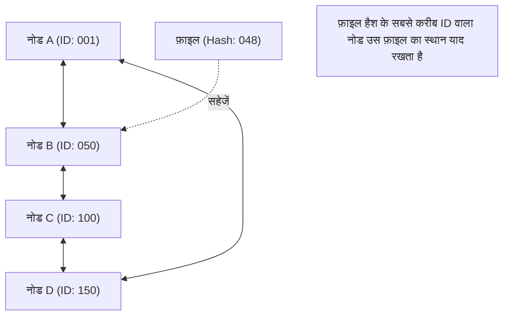

## 1. विकेंद्रीकृत नेटवर्क मॉडल

इंटरनेट की दुनिया में, हम बिना जाने जिस संचार मॉडल का सबसे अधिक उपयोग करते हैं, वह "**क्लाइंट-सर्वर मॉडल**" है।
वेबसाइट ब्राउज़ करते समय या वीडियो देखते समय, हमारे स्मार्टफोन (क्लाइंट) हमेशा विशाल डेटा केंद्रों में मौजूद उच्च-प्रदर्शन वाले कंप्यूटरों (सर्वर) से डेटा का अनुरोध करते हैं और उसे प्राप्त करते हैं।

हालाँकि, इस मॉडल में एक स्पष्ट कमजोरी है। यदि सर्वर पर एक साथ बहुत अधिक एक्सेस होता है, तो यह ओवरलोड होकर क्रैश हो सकता है, जिसे "विफलता का एकल बिंदु (Single Point of Failure)" समस्या कहा जाता है। इसके अलावा, इसकी एक संरचनात्मक समस्या भी है जहां सर्वर का रखरखाव करने वाली कंपनियों के पास भारी लागत और शक्ति केंद्रित हो जाती है।

इसके बिल्कुल विपरीत एक अलग दृष्टिकोण के रूप में "**P2P (पियर-टू-पियर: Peer-to-Peer) मॉडल**" को तैयार किया गया था।
P2P में, कोई विशेषाधिकार प्राप्त "सर्वर" नहीं होता है। नेटवर्क में भाग लेने वाले सभी कंप्यूटर (पियर) एक-दूसरे के साथ समान (Peer) संबंध में सीधे डेटा का आदान-प्रदान करते हैं।

## 2. P2P के 3 आर्किटेक्चर

P2P तकनीक अपने इतिहास में मुख्य रूप से तीन आर्किटेक्चर में विकसित हुई है।

### पहली पीढ़ी: हाइब्रिड P2P (Napster मॉडल)
1999 में सामने आया "Napster", जिसने पूरी दुनिया में म्यूजिक फाइल शेयरिंग का तहलका मचा दिया, इसका एक प्रमुख उदाहरण है।
फ़ाइलों का आदान-प्रदान स्वयं उपयोगकर्ताओं के पीसी (P2P) के बीच किया जाता है, लेकिन "किसके पास कौन सी फ़ाइल है" जैसी **अनुक्रमणिका (इंडेक्स) जानकारी को केंद्रीय सर्वर द्वारा केंद्रीकृत रूप से प्रबंधित किया जाता था**।
खोज बहुत तेज़ और कुशल थी, लेकिन इसकी एक कमजोरी थी: यदि केंद्रीय सर्वर को कानूनी रूप से रोक दिया जाता या बंद कर दिया जाता, तो पूरा नेटवर्क काम करना बंद कर देता था।

### दूसरी पीढ़ी: प्योर P2P (Gnutella, Winny मॉडल)
यह एक ऐसी प्रणाली है जो केंद्रीय सर्वर को पूरी तरह से समाप्त कर देती है और उपयोगकर्ता एक-दूसरे को खोज अनुरोधों को पास (बकेट ब्रिगेड की तरह) करते हैं।
"इंडेक्स" को भी विकेंद्रीकृत करके, इसने अत्यंत उच्च स्तर की मजबूती (दोष सहिष्णुता) प्राप्त की, जहां किसी विशिष्ट सर्वर के डाउन होने पर भी नेटवर्क नहीं रुकता था। हालाँकि, इसमें "स्केलेबिलिटी की समस्या" थी क्योंकि वांछित फ़ाइल को खोजने के लिए पूरे नेटवर्क में खोज पैकेट भर जाते थे, जिससे संचार बैंडविड्थ पर दबाव पड़ता था।

### तीसरी पीढ़ी: DHT (वितरित हैश टेबल) का उपयोग करने वाला P2P
वर्तमान P2P तकनीक की मुख्यधारा **DHT (Distributed Hash Table)** का उपयोग करने वाली प्रणाली है। इसका व्यापक रूप से BitTorrent आदि में उपयोग किया जाता है।

DHT नेटवर्क के सभी पियर और फ़ाइलों को एक "गणितीय ID (हैश मान)" प्रदान करता है, और नियमों के आधार पर विशाल नेटवर्क स्पेस को विभाजित और प्रबंधित करता है। वांछित फ़ाइल की खोज करते समय, यह आँख बंद करके आसपास पूछने के बजाय, "उस फ़ाइल की ID के सबसे करीब ID वाले पियर" की ओर सबसे छोटे मार्ग से खोज अनुरोध को अग्रेषित करता है, इसलिए लाखों लोगों के नेटवर्क में भी आप बेहद कम समय में वांछित डेटा तक पहुँच सकते हैं।

## 3. विकेंद्रीकृत प्रणालियों की ताकत: स्केलेबिलिटी

P2P तकनीक का सबसे बड़ा जादू इसकी इस विरोधाभासी प्रकृति में कि "**जितने अधिक उपयोगकर्ता जुड़ते हैं, पूरे सिस्टम की क्षमता उतनी ही बेहतर होती है**"।

क्लाइंट-सर्वर मॉडल में, यदि उपयोगकर्ताओं की संख्या 1 मिलियन हो जाती है, तो सर्वर का भार 1 मिलियन गुना बढ़ जाएगा।
हालाँकि, P2P नेटवर्क में, 1 मिलियन लोगों के जुड़ने का मतलब है कि एक ही समय में "1 मिलियन कंप्यूटरों की CPU शक्ति और 1 मिलियन लाइनों की संचार बैंडविड्थ" सिस्टम में जुड़ जाती है। जैसे-जैसे डेटा चाहने वाले लोगों की संख्या बढ़ती है, उस डेटा की आपूर्ति करने वाले लोगों की संख्या भी उसी समय बढ़ती है, इसलिए समग्र रूप से सिस्टम कभी डाउन नहीं होता है।

इस विशेषता का इसकी अधिकतम सीमा तक लाभ उठाने वाला प्रोटोकॉल "**BitTorrent (बिटटोरेंट)**" है, जो हजारों लोगों को एक ही समय में उच्च गति पर विशाल फ़ाइलों को डाउनलोड करने में सक्षम बनाता है। इसका व्यापक रूप से आधुनिक विशाल बुनियादी ढांचे का समर्थन करने वाली तकनीक के रूप में उपयोग किया जाता है, जैसे कि Windows OS छवियों का वितरण और दुनिया के सबसे बड़े गेमिंग प्लेटफॉर्म Steam के अपडेट का वितरण।

## 4. P2P और ब्लॉकचेन: Web3 की वंशावली

2008 में, सातोशी नाकामोटो नामक व्यक्ति द्वारा प्रकाशित एक पेपर से P2P का एक नया इतिहास शुरू हुआ।
यह "**Bitcoin (बिटकॉइन)**" है।

पारंपरिक P2P सिस्टम का उपयोग "फ़ाइल शेयरिंग" या "वितरित कंप्यूटिंग" के लिए किया जाता था, लेकिन बिटकॉइन ने P2P नेटवर्क का उपयोग "**विश्वास के विकेंद्रीकरण**" के लिए किया।
भले ही कोई केंद्रीय बैंक या व्यवस्थापक न हो, P2P नेटवर्क में भाग लेने वाले अनगिनत नोड एक-दूसरे के लेनदेन रिकॉर्ड (बहीखाते) की निगरानी करते हैं, और क्रिप्टोग्राफी (हैश फ़ंक्शन और सार्वजनिक-कुंजी क्रिप्टोग्राफी) को सर्वसम्मति एल्गोरिदम (Proof of Work) के साथ जोड़कर, उन्होंने एक "विकेंद्रीकृत प्रणाली जहाँ डेटा में छेड़छाड़ व्यावहारिक रूप से असंभव है = **[ब्लॉकचेन](/hi/p/blockchain-technology-smart-contract-distributed-ledger/)**" का निर्माण किया।

यह "विशिष्ट प्रशासकों पर निर्भर न रहने वाले स्वायत्त विकेंद्रीकृत नेटवर्क" की विचारधारा सीधे तौर पर वर्तमान "Web3 (विकेंद्रीकृत वेब)" आंदोलन से जुड़ी है।

## 5. P2P तकनीक की चुनौतियाँ और भविष्य

P2P एक अद्भुत तकनीक है, लेकिन इसमें चुनौतियाँ भी मौजूद हैं।

एक समस्या "**फ्री राइडर (मुफ्तखोर)**" की है। यदि ऐसे कई उपयोगकर्ता हो जाते हैं जो केवल डेटा प्राप्त करते हैं लेकिन उसे दूसरों को प्रदान नहीं करते हैं, तो नेटवर्क का पतन हो जाएगा। इस समस्या को हल करने के लिए, ऐसे तंत्रों पर शोध किया जा रहा है जो प्रदान की गई मात्रा के अनुसार तरजीही डाउनलोड के अधिकार देते हैं, या [ब्लॉकचेन](/hi/p/blockchain-technology-smart-contract-distributed-ledger/) की तरह वित्तीय प्रोत्साहन (टोकन) देते हैं।

दूसरी समस्या "**गवर्नेंस और सुरक्षा**" की है। क्योंकि कोई केंद्रीय व्यवस्थापक नहीं है, अगर दुर्भावनापूर्ण नोड्स नकली डेटा ক্যামी डेटा या वायरस फैलाते हैं, तो उन्हें तुरंत ब्लॉक करना मुश्किल होता है।

P2P केवल "फ़ाइल शेयरिंग सॉफ़्टवेयर" की तकनीक नहीं है। यह कंप्यूटर विज्ञान में "वितरित प्रणालियों" का चरम बिंदु है, और एक ऐसा आर्किटेक्चर है जिसका यह मजबूत दर्शन है कि शक्ति को एक बिंदु पर केंद्रित नहीं होना चाहिए। भविष्य में भी, P2P तकनीक IoT उपकरणों के बीच संचार और अगली पीढ़ी के विकेंद्रीकृत इंटरनेट बुनियादी ढांचे की नींव के रूप में विकसित होती रहेगी।
