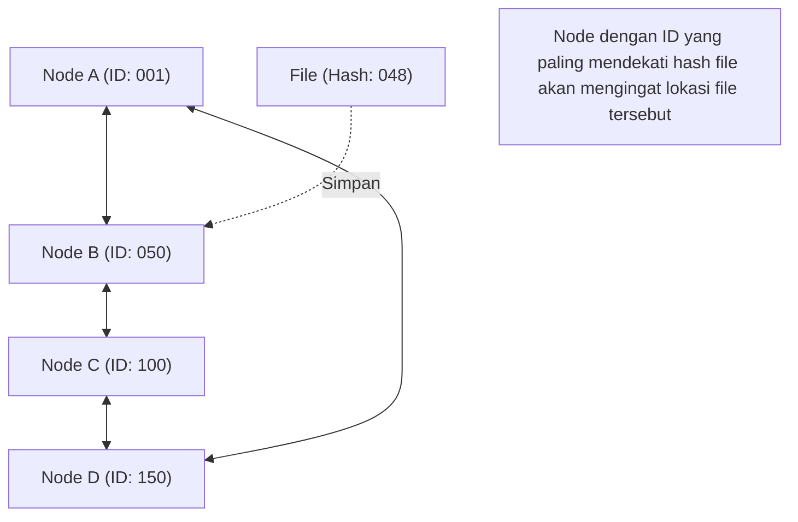

## 1. Model Jaringan Pasca-Sentralisasi

Di dunia internet, sebagian besar model komunikasi yang kita gunakan tanpa kita sadari adalah **model klien-server**.
Saat menelusuri situs web atau menonton video, ponsel cerdas kita (klien) selalu meminta data dari komputer berkinerja tinggi (server) yang berada di pusat data besar, lalu menerimanya.

Namun, model ini memiliki kelemahan yang jelas. Masalah "Titik Kegagalan Tunggal" (Single Point of Failure) terjadi ketika server kelebihan beban oleh terlalu banyak akses dan akhirnya tumbang. Selain itu, model ini juga memiliki masalah struktural di mana biaya dan kekuatan yang sangat besar terpusat pada perusahaan yang memelihara dan mengelola server.

Sebagai pendekatan yang sama sekali berbeda untuk mengatasi hal ini, **model P2P (Peer-to-Peer)** dirancang.
Dalam P2P, tidak ada "server" yang memiliki hak istimewa. Semua komputer (peer) yang berpartisipasi dalam jaringan bertukar data secara langsung dengan hubungan yang setara (Peer).

## 2. 3 Arsitektur P2P

Teknologi P2P telah berevolusi ke dalam tiga arsitektur utama sepanjang sejarahnya.

### Generasi Pertama: P2P Hibrida (Tipe Napster)
"Napster", yang muncul pada tahun 1999 dan menyebabkan badai berbagi file musik di seluruh dunia, adalah contoh utamanya.
Pertukaran file itu sendiri dilakukan antar PC pengguna (P2P), tetapi hanya **informasi indeks (daftar isi) mengenai siapa yang memiliki file mana yang dikelola secara terpusat oleh server pusat**.
Pencariannya sangat cepat dan efisien, tetapi memiliki kelemahan bahwa seluruh jaringan akan berhenti berfungsi jika server pusat dihentikan secara hukum.

### Generasi Kedua: P2P Murni (Tipe Gnutella, Winny)
Ini adalah metode di mana server pusat dihilangkan sepenuhnya, dan permintaan pencarian dilakukan melalui estafet antar pengguna.
Dengan mendesentralisasikan bahkan "indeks", ia memperoleh ketahanan yang sangat tinggi (toleransi kesalahan) sehingga jaringan tidak akan berhenti meskipun server tertentu tumbang. Namun, metode ini memiliki "masalah skalabilitas" karena paket pencarian membanjiri seluruh jaringan untuk menemukan file yang dituju, sehingga menekan bandwidth komunikasi.

### Generasi Ketiga: P2P menggunakan DHT (Distributed Hash Table)
Arsitektur yang mendominasi teknologi P2P saat ini adalah metode yang menggunakan **DHT (Distributed Hash Table)**. Metode ini banyak digunakan dalam BitTorrent dan lainnya.

DHT menetapkan "ID matematis (nilai hash)" ke semua peer dan file di jaringan, dan mengelola ruang jaringan yang luas dengan membaginya berdasarkan aturan. Saat mencari file yang dituju, alih-alih bertanya ke sekitar secara membabi buta, permintaan pencarian diteruskan melalui rute terpendek menuju "peer dengan ID yang paling mendekati ID file tersebut", sehingga bahkan dalam jaringan dengan jutaan peserta, data yang dituju dapat dicapai dalam waktu yang sangat singkat.

## 3. Kekuatan Sistem Terdesentralisasi: Skalabilitas

Keajaiban terbesar dari teknologi P2P terletak pada sifat paradoksnya: "**Semakin banyak pengguna, semakin meningkat pula kemampuan sistem secara keseluruhan**".

Dalam model klien-server, jika pengguna mencapai 1 juta orang, beban server akan menjadi 1 juta kali lipat.
Namun, dalam jaringan P2P, partisipasi 1 juta orang berarti "kekuatan CPU dari 1 juta mesin dan bandwidth komunikasi dari 1 juta jalur" secara otomatis ditambahkan ke sistem. Semakin banyak orang yang menginginkan data, semakin banyak pula orang yang dapat menyediakan data tersebut pada saat yang sama, sehingga sistem secara keseluruhan tidak akan pernah tumbang.

Protokol "**BitTorrent**", yang memungkinkan puluhan ribu orang mengunduh file besar secara bersamaan dengan kecepatan tinggi, memanfaatkan karakteristik ini hingga batas maksimal. Teknologi ini banyak digunakan sebagai tulang punggung infrastruktur besar modern, seperti distribusi image OS Windows dan pembaruan untuk platform game terbesar di dunia, Steam.

## 4. P2P dan Blockchain: Silsilah menuju Web3

Pada tahun 2008, sejarah baru P2P dimulai dari sebuah makalah yang diterbitkan oleh seseorang yang menyebut dirinya Satoshi Nakamoto.
Itu adalah "**Bitcoin**".

Sementara sistem P2P tradisional digunakan untuk "berbagi file" atau "mendistribusikan proses komputasi", Bitcoin menggunakan jaringan P2P untuk "**mendistribusikan kepercayaan**".
Bahkan tanpa bank sentral atau administrator, node tak terhitung jumlahnya yang berpartisipasi dalam jaringan P2P saling mengawasi catatan transaksi (buku besar) satu sama lain. Dengan menggabungkan teknologi kriptografi (fungsi hash dan kriptografi kunci publik) dan algoritma konsensus (Proof of Work), mereka membangun "sistem terdesentralisasi di mana perusakan data hampir tidak mungkin dilakukan = **Blockchain**".

Konsep "jaringan terdesentralisasi otonom yang tidak bergantung pada administrator tertentu" ini terhubung langsung ke gerakan "**Web3** (web terdesentralisasi)" saat ini.

## 5. Tantangan dan Masa Depan Teknologi P2P

Meskipun P2P adalah teknologi yang luar biasa, ada juga tantangan yang harus dihadapi.
Salah satunya adalah masalah "**Free Rider (Penumpang Gratis)**". Jika ada banyak pengguna yang hanya menerima data tanpa menyediakannya dari diri mereka sendiri, jaringan akan menurun. Untuk mengatasi masalah ini, sedang diteliti mekanisme yang memberikan hak prioritas unduhan sesuai dengan jumlah data yang disediakan, atau mekanisme yang memberikan insentif moneter (token) seperti blockchain.

Tantangan lainnya adalah "**Tata Kelola dan Keamanan**". Karena tidak ada administrator pusat, jika node jahat menyebarkan data palsu atau virus, akan sulit untuk memblokirnya dengan segera.

P2P bukanlah sekadar teknologi "perangkat lunak berbagi file". Ini adalah puncak dari "sistem terdesentralisasi" dalam ilmu komputer, sebuah arsitektur dengan filosofi kuat untuk tidak memusatkan kekuasaan pada satu titik. Ke depannya, teknologi P2P akan terus berkembang sebagai basis untuk komunikasi antar perangkat IoT dan infrastruktur internet terdesentralisasi generasi berikutnya.
