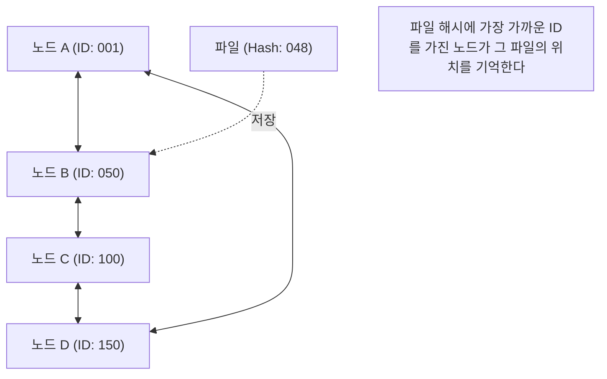

## 1. 탈 중앙집권적 네트워크 모델

인터넷 세계에서 우리가 평소 의식하지 않고 이용하고 있는 통신 모델의 압도적 다수는 「 **클라이언트・서버 모델** 」입니다.
Web 사이트를 열람할 때, 동영상을 시청할 때, 우리의 스마트폰(클라이언트)은 항상 거대한 데이터센터에 있는 고성능 컴퓨터(서버)에 데이터를 요청하고, 그것을 받고 있습니다.

하지만, 이 모델에는 명확한 약점이 있습니다. 서버에 접속이 너무 집중되면 처리를 따라가지 못하고 다운되어 버리는 '단일 장애점(Single Point of Failure)' 문제입니다. 또한, 서버를 유지 관리하는 기업에 막대한 비용과 권력이 집중되어 버린다는 구조적인 문제도 안고 있습니다.

이에 대한 전혀 다른 접근 방식으로 고안된 것이 「 **P2P(피어 투 피어: Peer-to-Peer) 모델** 」입니다.
P2P에서는 특권적인 '서버'는 존재하지 않습니다. 네트워크에 참여하고 있는 모든 컴퓨터(피어)가 서로 대등한(Peer) 관계로 직접 데이터를 주고받습니다.

## 2. P2P의 3가지 아키텍처

P2P 기술은 그 역사 속에서 크게 3가지 아키텍처로 진화해 왔습니다.

### 제1세대: 하이브리드 P2P(Napster형)
1999년에 등장하여 전 세계에 음악 파일 공유의 폭풍을 일으킨 'Napster'가 대표적인 예입니다.
파일의 교환 자체는 사용자의 PC끼리(P2P) 수행하지만, '누가 어떤 파일을 가지고 있는가'라는 **인덱스(목차) 정보만큼은 중앙 서버에서 일원 관리** 하고 있었습니다.
검색이 매우 빠르고 효율적이었지만, 중앙 서버가 법적 금지 명령 등으로 정지되면 네트워크 전체가 기능하지 않게 된다는 약점이 있었습니다.

### 제2세대: 퓨어 P2P(Gnutella, Winny형)
중앙 서버를 완전히 배제하고, 검색 요청도 사용자들 간의 릴레이 전송으로 처리하는 방식입니다.
'인덱스'마저 분산시킴으로써, 특정 서버를 다운시켜도 네트워크가 멈추지 않는다는 매우 높은 견고성(내결함성)을 획득했습니다. 하지만 원하는 파일을 찾기 위해 네트워크 전체에 검색 패킷이 넘쳐나서 통신 대역을 압박해 버린다는 '확장성 문제'를 안고 있었습니다.

### 제3세대: DHT(분산 해시 테이블)를 이용한 P2P
현재 P2P 기술의 주류가 되고 있는 것이, **DHT(Distributed Hash Table)** 를 이용한 방식입니다. BitTorrent 등에서 널리 이용되고 있습니다.

DHT는 네트워크 상의 모든 피어와 파일에 '수학적인 ID(해시값)'를 할당하여 광대한 네트워크 공간을 규칙에 따라 분할 관리합니다. 원하는 파일을 찾을 때 무턱대고 주위에 묻는 것이 아니라, '그 파일의 ID에 가장 가까운 ID를 가진 피어'를 향해 최단 루트로 검색 요청을 전송해 나가기 때문에, 수백만 명이 참여하는 네트워크에서도 매우 짧은 시간에 목적하는 데이터에 도달할 수 있는 것입니다.

## 3. 분산 시스템의 강점: 확장성

P2P 기술의 가장 큰 마법은 「 **사용자가 늘어나면 늘어날수록, 시스템 전체의 능력이 향상된다** 」는 역설적인 성질에 있습니다.

클라이언트・서버 모델에서는 이용자가 100만 명이 되면 서버의 부하는 100만 배가 됩니다.
하지만 P2P 네트워크에서는 100만 명이 참여한다는 것은, 동시에 '100만 대 분의 CPU 파워와, 100만 회선의 통신 대역'이 시스템에 추가된다는 것을 의미합니다. 데이터를 원하는 사람이 늘어나면 늘어날수록, 그 데이터를 공급할 수 있는 사람도 동시에 늘어나기 때문에 시스템 전체로서는 결코 다운되지 않습니다.

이 특성을 극한까지 살린 것이, 거대한 파일을 수만 명이 동시에 고속으로 다운로드할 수 있는 「 **BitTorrent(비트토렌트)** 」 프로토콜입니다. Windows의 OS 이미지 배포나 세계 최대의 게임 플랫폼 Steam의 업데이트 전송 등, 현대의 거대 인프라를 뒤에서 지탱하는 기술로 널리 활용되고 있습니다.

## 4. P2P와 블록체인: Web3로의 계보

2008년, 사토시 나카모토라고 자칭하는 인물에 의해 공개된 논문에서 새로운 P2P의 역사가 시작되었습니다.
「 **Bitcoin(비트코인)** 」입니다.

기존의 P2P 시스템은 '파일 공유'나 '계산 처리의 분산'에 사용되고 있었지만, 비트코인은 P2P 네트워크를 「 **신뢰의 분산** 」에 사용했습니다.
중앙 은행이나 관리자가 존재하지 않아도, P2P 네트워크에 참여하는 무수한 노드가 서로의 거래 기록(원장)을 감시하고, 암호 기술(해시 함수와 공개키 암호)과 합의 알고리즘(Proof of Work)을 결합함으로써 「데이터의 변조가 실질적으로 불가능한 분산형 시스템 = **블록체인** 」을 구축한 것입니다.

이 '특정 관리자에게 의존하지 않는 자율 분산형 네트워크'라는 사상은 현재의 'Web3(분산형 웹)'라는 무브먼트로 직결되고 있습니다.

## 5. P2P 기술의 과제와 미래

P2P는 훌륭한 기술이지만, 과제도 존재합니다.
하나는 「 **프리 라이더(무임승차)** 」 문제입니다. 데이터를 받기만 하고 자신은 제공하지 않는 사용자가 많아지면 네트워크는 쇠퇴합니다. 이 문제를 해결하기 위해, 제공량에 따라 우선적으로 다운로드할 수 있는 권리를 부여하는 시스템이나, 블록체인과 같은 금전적 인센티브(토큰)를 부여하는 시스템이 연구되고 있습니다.

또 다른 하나는 「 **거버넌스와 보안** 」입니다. 중앙 관리자가 없기 때문에 악의적인 노드가 가짜 데이터나 바이러스를 유포할 경우, 이를 즉각적으로 차단하는 것이 어렵습니다.

P2P는 단순한 '파일 공유 소프트웨어'의 기술이 아닙니다. 컴퓨터 과학에 있어서 '분산 시스템'의 극치이며, 권력을 한 점에 집중시키지 않겠다는 강력한 철학을 가진 아키텍처입니다. 앞으로도 IoT 디바이스 간의 통신이나 차세대 분산형 인터넷 인프라의 기반으로서 P2P 기술은 계속 진화해 나갈 것입니다.
