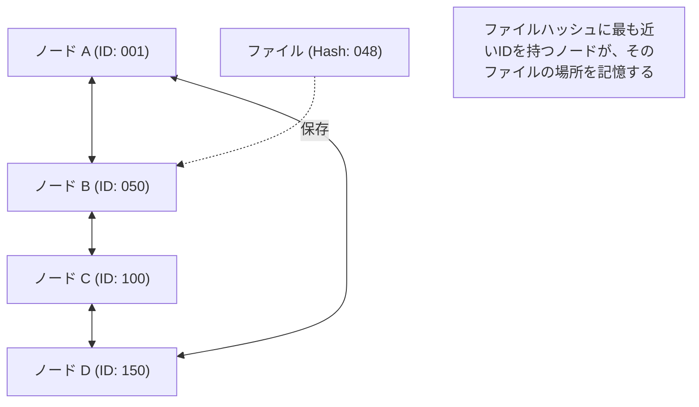

## 1. 脱・中央集権のネットワークモデル

インターネットの世界において、私たちが普段意識することなく利用している通信モデルの圧倒的多数は「**クライアント・サーバーモデル**」です。
Webサイトを閲覧するとき、動画を視聴するとき、私たちのスマートフォン（クライアント）は、常に巨大なデータセンターにある高性能なコンピュータ（サーバー）にデータを要求し、それを受け取っています。

しかし、このモデルには明確な弱点があります。サーバーにアクセスが集中しすぎると処理が追いつかずにダウンしてしまう「単一障害点（Single Point of Failure）」の問題です。また、サーバーを維持管理する企業に莫大なコストと権力が集中してしまうという構造的な問題も抱えています。

これに対する全く別のアプローチとして考案されたのが「**P2P（ピアツーピア：Peer-to-Peer）モデル**」です。
P2Pでは、特権的な「サーバー」は存在しません。ネットワークに参加しているすべてのコンピュータ（ピア）が、互いに対等（Peer）な関係で直接データをやり取りします。

## 2. P2Pの3つのアーキテクチャ

P2P技術は、その歴史の中で大きく3つのアーキテクチャへと進化してきました。

### 第一世代：ハイブリッドP2P（Napster型）
1999年に登場し、世界中に音楽ファイル共有の嵐を巻き起こした「Napster」が代表例です。
ファイルのやり取り自体はユーザーのPC同士（P2P）で行いますが、「誰がどのファイルを持っているか」という**インデックス（目次）情報だけは中央のサーバーで一元管理**していました。
検索が非常に高速で効率的でしたが、中央のサーバーが法的に差し止められて停止すると、ネットワーク全体が機能しなくなるという弱点がありました。

### 第二世代：ピュアP2P（Gnutella, Winny型）
中央サーバーを完全に排除し、検索リクエストもユーザー同士のバケツリレーで行う方式です。
「インデックス」すら分散させたことで、特定のサーバーを落としてもネットワークが止まらないという極めて高い堅牢性（耐障害性）を獲得しました。しかし、目的のファイルを探すためにネットワーク全体に検索パケットが溢れかえり、通信帯域を圧迫してしまうという「スケーラビリティの問題」を抱えていました。

### 第三世代：DHT（分散ハッシュテーブル）を用いたP2P
現在のP2P技術の主流となっているのが、**DHT（Distributed Hash Table）**を用いた方式です。BitTorrentなどで広く利用されています。

DHTは、ネットワーク上のすべてのピアとファイルに「数学的なID（ハッシュ値）」を割り当て、広大なネットワーク空間をルールに基づいて分割管理します。目的のファイルを探す際、闇雲に周囲に尋ねるのではなく、「そのファイルのIDに最も近いIDを持つピア」に向かって最短ルートで検索リクエストを転送していくため、数百万人が参加するネットワークでも極めて短時間で目的のデータに到達できるのです。

## 3. 分散システムの強み：スケーラビリティ

P2P技術の最大の魔法は、「**ユーザーが増えれば増えるほど、システム全体の能力が向上する**」という逆説的な性質にあります。

クライアント・サーバーモデルでは、利用者が100万人になれば、サーバーの負荷は100万倍になります。
しかしP2Pネットワークでは、100万人が参加するということは、同時に「100万台分のCPUパワーと、100万回線の通信帯域」がシステムに追加されることを意味します。データを欲しがる人が増えれば増えるほど、そのデータを供給できる人も同時に増えるため、システム全体としては決してダウンしません。

この特性を極限まで活かしたのが、巨大なファイルを数万人で同時に高速ダウンロードできる「**BitTorrent（ビットトレント）**」プロトコルです。WindowsのOSイメージの配布や、世界最大のゲームプラットフォームSteamのアップデート配信など、現代の巨大インフラを裏で支える技術として広く活用されています。

## 4. P2Pとブロックチェーン：Web3への系譜

2008年、サトシ・ナカモトと名乗る人物によって公開された論文から、新たなP2Pの歴史が始まりました。
「**Bitcoin（ビットコイン）**」です。

従来のP2Pシステムは「ファイルの共有」や「計算処理の分散」に使われていましたが、ビットコインはP2Pネットワークを「**信頼の分散**」に使いました。
中央の銀行や管理者が存在しなくても、P2Pネットワークに参加する無数のノードが、互いの取引記録（台帳）を監視し合い、暗号技術（ハッシュ関数と公開鍵暗号）とコンセンサスアルゴリズム（Proof of Work）を組み合わせることで、「データの改ざんが実質的に不可能な分散型システム＝**ブロックチェーン**」を構築したのです。

この「特定の管理者に依存しない自律分散型のネットワーク」という思想は、現在の「Web3（分散型ウェブ）」というムーブメントへと直結しています。

## 5. P2P技術の課題と未来

P2Pは素晴らしい技術ですが、課題も存在します。
一つは「**フリーライダー（ただ乗り）**」問題です。データをもらうだけもらって、自分からは提供しないユーザーが多くなると、ネットワークは衰退します。この問題を解決するため、提供量に応じて優先的にダウンロードできる権利を与える仕組みや、ブロックチェーンのような金銭的インセンティブ（トークン）を与える仕組みが研究されています。

もう一つは「**ガバナンスとセキュリティ**」です。中央の管理者がいないため、悪意のあるノードが偽のデータやウイルスをばら撒いた場合、それを即座に遮断することが困難です。

P2Pは、単なる「ファイル共有ソフト」の技術ではありません。コンピュータサイエンスにおける「分散システム」の極致であり、権力を一点に集中させないという強い哲学を持ったアーキテクチャです。今後も、IoTデバイス間の通信や、次世代の分散型インターネットインフラの基盤として、P2P技術は進化を続けていくでしょう。
