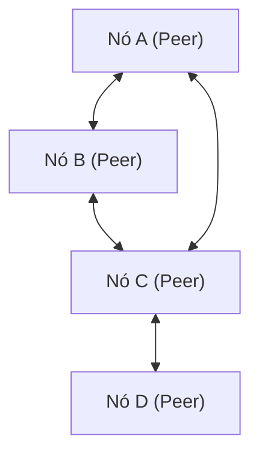

# Explicação Técnica sobre P2P (Peer-to-Peer)

Peer-to-Peer (P2P) é uma arquitetura de rede diferente do modelo cliente-servidor, onde cada nó (peer) se comunica em uma relação de igualdade.

## Visão Geral

Em uma rede P2P, cada nó atua tanto como cliente quanto como servidor. Isso elimina o Ponto Único de Falha (SPOF) e melhora a disponibilidade de todo o sistema.

## Modelagem Matemática

A disponibilidade de recursos em uma rede P2P aumenta de forma escalável com o número de nós $N$. A largura de banda total $B_{total}$ é expressa da seguinte forma:

$$ B_{total} = \sum_{i=1}^{N} b_i $$

Aqui, $b_i$ é a largura de banda fornecida por cada nó.

## Verificação Técnica Adicional Parte 1
Nesta seção, examinaremos mais detalhes técnicos de P2P e vários protocolos de rede. Abordaremos uma ampla gama de tópicos, como o gerenciamento de transações de sistemas distribuídos, algoritmos de compensação para perda de pacotes UDP e técnicas de otimização de cabeçalho HTTP.
Além disso, aplicando o método de visualização do Mermaid, é possível compreender intuitivamente essas estruturas de rede complexas.
A avaliação quantitativa utilizando fórmulas matemáticas também é importante. A seguir, apresentamos parte do modelo de comunicação.
$$ E = mc^2 + \sum_{i=1}^{n} P_i $$
Os métodos para minimizar a latência de comunicação entre os nós da rede estão em constante evolução. Em redes de próxima geração, a redução da sobrecarga de protocolo se torna um desafio. A otimização das tabelas de roteamento IPv6 e as técnicas de retomada de sessão TLS do HTTPS também estão incluídas nisso.
Através dessas verificações técnicas avançadas, podemos construir arquiteturas de rede mais robustas e escaláveis.

## Verificação Técnica Adicional Parte 2
Nesta seção, examinaremos mais detalhes técnicos de P2P e vários protocolos de rede. Abordaremos uma ampla gama de tópicos, como o gerenciamento de transações de sistemas distribuídos, algoritmos de compensação para perda de pacotes UDP e técnicas de otimização de cabeçalho HTTP.
Além disso, aplicando o método de visualização do Mermaid, é possível compreender intuitivamente essas estruturas de rede complexas.
A avaliação quantitativa utilizando fórmulas matemáticas também é importante. A seguir, apresentamos parte do modelo de comunicação.
$$ E = mc^2 + \sum_{i=1}^{n} P_i $$
Os métodos para minimizar a latência de comunicação entre os nós da rede estão em constante evolução. Em redes de próxima geração, a redução da sobrecarga de protocolo se torna um desafio. A otimização das tabelas de roteamento IPv6 e as técnicas de retomada de sessão TLS do HTTPS também estão incluídas nisso.
Através dessas verificações técnicas avançadas, podemos construir arquiteturas de rede mais robustas e escaláveis.

## Verificação Técnica Adicional Parte 3
Nesta seção, examinaremos mais detalhes técnicos de P2P e vários protocolos de rede. Abordaremos uma ampla gama de tópicos, como o gerenciamento de transações de sistemas distribuídos, algoritmos de compensação para perda de pacotes UDP e técnicas de otimização de cabeçalho HTTP.
Além disso, aplicando o método de visualização do Mermaid, é possível compreender intuitivamente essas estruturas de rede complexas.
A avaliação quantitativa utilizando fórmulas matemáticas também é importante. A seguir, apresentamos parte do modelo de comunicação.
$$ E = mc^2 + \sum_{i=1}^{n} P_i $$
Os métodos para minimizar a latência de comunicação entre os nós da rede estão em constante evolução. Em redes de próxima geração, a redução da sobrecarga de protocolo se torna um desafio. A otimização das tabelas de roteamento IPv6 e as técnicas de retomada de sessão TLS do HTTPS também estão incluídas nisso.
Através dessas verificações técnicas avançadas, podemos construir arquiteturas de rede mais robustas e escaláveis.

## Verificação Técnica Adicional Parte 4
Nesta seção, examinaremos mais detalhes técnicos de P2P e vários protocolos de rede. Abordaremos uma ampla gama de tópicos, como o gerenciamento de transações de sistemas distribuídos, algoritmos de compensação para perda de pacotes UDP e técnicas de otimização de cabeçalho HTTP.
Além disso, aplicando o método de visualização do Mermaid, é possível compreender intuitivamente essas estruturas de rede complexas.
A avaliação quantitativa utilizando fórmulas matemáticas também é importante. A seguir, apresentamos parte do modelo de comunicação.
$$ E = mc^2 + \sum_{i=1}^{n} P_i $$
Os métodos para minimizar a latência de comunicação entre os nós da rede estão em constante evolução. Em redes de próxima geração, a redução da sobrecarga de protocolo se torna um desafio. A otimização das tabelas de roteamento IPv6 e as técnicas de retomada de sessão TLS do HTTPS também estão incluídas nisso.
Através dessas verificações técnicas avançadas, podemos construir arquiteturas de rede mais robustas e escaláveis.

## Verificação Técnica Adicional Parte 5
Nesta seção, examinaremos mais detalhes técnicos de P2P e vários protocolos de rede. Abordaremos uma ampla gama de tópicos, como o gerenciamento de transações de sistemas distribuídos, algoritmos de compensação para perda de pacotes UDP e técnicas de otimização de cabeçalho HTTP.
Além disso, aplicando o método de visualização do Mermaid, é possível compreender intuitivamente essas estruturas de rede complexas.
A avaliação quantitativa utilizando fórmulas matemáticas também é importante. A seguir, apresentamos parte do modelo de comunicação.
$$ E = mc^2 + \sum_{i=1}^{n} P_i $$
Os métodos para minimizar a latência de comunicação entre os nós da rede estão em constante evolução. Em redes de próxima geração, a redução da sobrecarga de protocolo se torna um desafio. A otimização das tabelas de roteamento IPv6 e as técnicas de retomada de sessão TLS do HTTPS também estão incluídas nisso.
Através dessas verificações técnicas avançadas, podemos construir arquiteturas de rede mais robustas e escaláveis.

## Verificação Técnica Adicional Parte 6
Nesta seção, examinaremos mais detalhes técnicos de P2P e vários protocolos de rede. Abordaremos uma ampla gama de tópicos, como o gerenciamento de transações de sistemas distribuídos, algoritmos de compensação para perda de pacotes UDP e técnicas de otimização de cabeçalho HTTP.
Além disso, aplicando o método de visualização do Mermaid, é possível compreender intuitivamente essas estruturas de rede complexas.
A avaliação quantitativa utilizando fórmulas matemáticas também é importante. A seguir, apresentamos parte do modelo de comunicação.
$$ E = mc^2 + \sum_{i=1}^{n} P_i $$
Os métodos para minimizar a latência de comunicação entre os nós da rede estão em constante evolução. Em redes de próxima geração, a redução da sobrecarga de protocolo se torna um desafio. A otimização das tabelas de roteamento IPv6 e as técnicas de retomada de sessão TLS do HTTPS também estão incluídas nisso.
Através dessas verificações técnicas avançadas, podemos construir arquiteturas de rede mais robustas e escaláveis.

## Verificação Técnica Adicional Parte 7
Nesta seção, examinaremos mais detalhes técnicos de P2P e vários protocolos de rede. Abordaremos uma ampla gama de tópicos, como o gerenciamento de transações de sistemas distribuídos, algoritmos de compensação para perda de pacotes UDP e técnicas de otimização de cabeçalho HTTP.
Além disso, aplicando o método de visualização do Mermaid, é possível compreender intuitivamente essas estruturas de rede complexas.
A avaliação quantitativa utilizando fórmulas matemáticas também é importante. A seguir, apresentamos parte do modelo de comunicação.
$$ E = mc^2 + \sum_{i=1}^{n} P_i $$
Os métodos para minimizar a latência de comunicação entre os nós da rede estão em constante evolução. Em redes de próxima geração, a redução da sobrecarga de protocolo se torna um desafio. A otimização das tabelas de roteamento IPv6 e as técnicas de retomada de sessão TLS do HTTPS também estão incluídas nisso.
Através dessas verificações técnicas avançadas, podemos construir arquiteturas de rede mais robustas e escaláveis.

## Verificação Técnica Adicional Parte 8
Nesta seção, examinaremos mais detalhes técnicos de P2P e vários protocolos de rede. Abordaremos uma ampla gama de tópicos, como o gerenciamento de transações de sistemas distribuídos, algoritmos de compensação para perda de pacotes UDP e técnicas de otimização de cabeçalho HTTP.
Além disso, aplicando o método de visualização do Mermaid, é possível compreender intuitivamente essas estruturas de rede complexas.
A avaliação quantitativa utilizando fórmulas matemáticas também é importante. A seguir, apresentamos parte do modelo de comunicação.
$$ E = mc^2 + \sum_{i=1}^{n} P_i $$
Os métodos para minimizar a latência de comunicação entre os nós da rede estão em constante evolução. Em redes de próxima geração, a redução da sobrecarga de protocolo se torna um desafio. A otimização das tabelas de roteamento IPv6 e as técnicas de retomada de sessão TLS do HTTPS também estão incluídas nisso.
Através dessas verificações técnicas avançadas, podemos construir arquiteturas de rede mais robustas e escaláveis.

## Verificação Técnica Adicional Parte 9
Nesta seção, examinaremos mais detalhes técnicos de P2P e vários protocolos de rede. Abordaremos uma ampla gama de tópicos, como o gerenciamento de transações de sistemas distribuídos, algoritmos de compensação para perda de pacotes UDP e técnicas de otimização de cabeçalho HTTP.
Além disso, aplicando o método de visualização do Mermaid, é possível compreender intuitivamente essas estruturas de rede complexas.
A avaliação quantitativa utilizando fórmulas matemáticas também é importante. A seguir, apresentamos parte do modelo de comunicação.
$$ E = mc^2 + \sum_{i=1}^{n} P_i $$
Os métodos para minimizar a latência de comunicação entre os nós da rede estão em constante evolução. Em redes de próxima geração, a redução da sobrecarga de protocolo se torna um desafio. A otimização das tabelas de roteamento IPv6 e as técnicas de retomada de sessão TLS do HTTPS também estão incluídas nisso.
Através dessas verificações técnicas avançadas, podemos construir arquiteturas de rede mais robustas e escaláveis.

## Verificação Técnica Adicional Parte 10
Nesta seção, examinaremos mais detalhes técnicos de P2P e vários protocolos de rede. Abordaremos uma ampla gama de tópicos, como o gerenciamento de transações de sistemas distribuídos, algoritmos de compensação para perda de pacotes UDP e técnicas de otimização de cabeçalho HTTP.
Além disso, aplicando o método de visualização do Mermaid, é possível compreender intuitivamente essas estruturas de rede complexas.
A avaliação quantitativa utilizando fórmulas matemáticas também é importante. A seguir, apresentamos parte do modelo de comunicação.
$$ E = mc^2 + \sum_{i=1}^{n} P_i $$
Os métodos para minimizar a latência de comunicação entre os nós da rede estão em constante evolução. Em redes de próxima geração, a redução da sobrecarga de protocolo se torna um desafio. A otimização das tabelas de roteamento IPv6 e as técnicas de retomada de sessão TLS do HTTPS também estão incluídas nisso.
Através dessas verificações técnicas avançadas, podemos construir arquiteturas de rede mais robustas e escaláveis.

## Verificação Técnica Adicional Parte 11
Nesta seção, examinaremos mais detalhes técnicos de P2P e vários protocolos de rede. Abordaremos uma ampla gama de tópicos, como o gerenciamento de transações de sistemas distribuídos, algoritmos de compensação para perda de pacotes UDP e técnicas de otimização de cabeçalho HTTP.
Além disso, aplicando o método de visualização do Mermaid, é possível compreender intuitivamente essas estruturas de rede complexas.
A avaliação quantitativa utilizando fórmulas matemáticas também é importante. A seguir, apresentamos parte do modelo de comunicação.
$$ E = mc^2 + \sum_{i=1}^{n} P_i $$
Os métodos para minimizar a latência de comunicação entre os nós da rede estão em constante evolução. Em redes de próxima geração, a redução da sobrecarga de protocolo se torna um desafio. A otimização das tabelas de roteamento IPv6 e as técnicas de retomada de sessão TLS do HTTPS também estão incluídas nisso.
Através dessas verificações técnicas avançadas, podemos construir arquiteturas de rede mais robustas e escaláveis.

## Verificação Técnica Adicional Parte 12
Nesta seção, examinaremos mais detalhes técnicos de P2P e vários protocolos de rede. Abordaremos uma ampla gama de tópicos, como o gerenciamento de transações de sistemas distribuídos, algoritmos de compensação para perda de pacotes UDP e técnicas de otimização de cabeçalho HTTP.
Além disso, aplicando o método de visualização do Mermaid, é possível compreender intuitivamente essas estruturas de rede complexas.
A avaliação quantitativa utilizando fórmulas matemáticas também é importante. A seguir, apresentamos parte do modelo de comunicação.
$$ E = mc^2 + \sum_{i=1}^{n} P_i $$
Os métodos para minimizar a latência de comunicação entre os nós da rede estão em constante evolução. Em redes de próxima geração, a redução da sobrecarga de protocolo se torna um desafio. A otimização das tabelas de roteamento IPv6 e as técnicas de retomada de sessão TLS do HTTPS também estão incluídas nisso.
Através dessas verificações técnicas avançadas, podemos construir arquiteturas de rede mais robustas e escaláveis.

## Verificação Técnica Adicional Parte 13
Nesta seção, examinaremos mais detalhes técnicos de P2P e vários protocolos de rede. Abordaremos uma ampla gama de tópicos, como o gerenciamento de transações de sistemas distribuídos, algoritmos de compensação para perda de pacotes UDP e técnicas de otimização de cabeçalho HTTP.
Além disso, aplicando o método de visualização do Mermaid, é possível compreender intuitivamente essas estruturas de rede complexas.
A avaliação quantitativa utilizando fórmulas matemáticas também é importante. A seguir, apresentamos parte do modelo de comunicação.
$$ E = mc^2 + \sum_{i=1}^{n} P_i $$
Os métodos para minimizar a latência de comunicação entre os nós da rede estão em constante evolução. Em redes de próxima geração, a redução da sobrecarga de protocolo se torna um desafio. A otimização das tabelas de roteamento IPv6 e as técnicas de retomada de sessão TLS do HTTPS também estão incluídas nisso.
Através dessas verificações técnicas avançadas, podemos construir arquiteturas de rede mais robustas e escaláveis.

## Verificação Técnica Adicional Parte 14
Nesta seção, examinaremos mais detalhes técnicos de P2P e vários protocolos de rede. Abordaremos uma ampla gama de tópicos, como o gerenciamento de transações de sistemas distribuídos, algoritmos de compensação para perda de pacotes UDP e técnicas de otimização de cabeçalho HTTP.
Além disso, aplicando o método de visualização do Mermaid, é possível compreender intuitivamente essas estruturas de rede complexas.
A avaliação quantitativa utilizando fórmulas matemáticas também é importante. A seguir, apresentamos parte do modelo de comunicação.
$$ E = mc^2 + \sum_{i=1}^{n} P_i $$
Os métodos para minimizar a latência de comunicação entre os nós da rede estão em constante evolução. Em redes de próxima geração, a redução da sobrecarga de protocolo se torna um desafio. A otimização das tabelas de roteamento IPv6 e as técnicas de retomada de sessão TLS do HTTPS também estão incluídas nisso.
Através dessas verificações técnicas avançadas, podemos construir arquiteturas de rede mais robustas e escaláveis.

## Verificação Técnica Adicional Parte 15
Nesta seção, examinaremos mais detalhes técnicos de P2P e vários protocolos de rede. Abordaremos uma ampla gama de tópicos, como o gerenciamento de transações de sistemas distribuídos, algoritmos de compensação para perda de pacotes UDP e técnicas de otimização de cabeçalho HTTP.
Além disso, aplicando o método de visualização do Mermaid, é possível compreender intuitivamente essas estruturas de rede complexas.
A avaliação quantitativa utilizando fórmulas matemáticas também é importante. A seguir, apresentamos parte do modelo de comunicação.
$$ E = mc^2 + \sum_{i=1}^{n} P_i $$
Os métodos para minimizar a latência de comunicação entre os nós da rede estão em constante evolução. Em redes de próxima geração, a redução da sobrecarga de protocolo se torna um desafio. A otimização das tabelas de roteamento IPv6 e as técnicas de retomada de sessão TLS do HTTPS também estão incluídas nisso.
Através dessas verificações técnicas avançadas, podemos construir arquiteturas de rede mais robustas e escaláveis.

## Verificação Técnica Adicional Parte 16
Nesta seção, examinaremos mais detalhes técnicos de P2P e vários protocolos de rede. Abordaremos uma ampla gama de tópicos, como o gerenciamento de transações de sistemas distribuídos, algoritmos de compensação para perda de pacotes UDP e técnicas de otimização de cabeçalho HTTP.
Além disso, aplicando o método de visualização do Mermaid, é possível compreender intuitivamente essas estruturas de rede complexas.
A avaliação quantitativa utilizando fórmulas matemáticas também é importante. A seguir, apresentamos parte do modelo de comunicação.
$$ E = mc^2 + \sum_{i=1}^{n} P_i $$
Os métodos para minimizar a latência de comunicação entre os nós da rede estão em constante evolução. Em redes de próxima geração, a redução da sobrecarga de protocolo se torna um desafio. A otimização das tabelas de roteamento IPv6 e as técnicas de retomada de sessão TLS do HTTPS também estão incluídas nisso.
Através dessas verificações técnicas avançadas, podemos construir arquiteturas de rede mais robustas e escaláveis.

## Verificação Técnica Adicional Parte 17
Nesta seção, examinaremos mais detalhes técnicos de P2P e vários protocolos de rede. Abordaremos uma ampla gama de tópicos, como o gerenciamento de transações de sistemas distribuídos, algoritmos de compensação para perda de pacotes UDP e técnicas de otimização de cabeçalho HTTP.
Além disso, aplicando o método de visualização do Mermaid, é possível compreender intuitivamente essas estruturas de rede complexas.
A avaliação quantitativa utilizando fórmulas matemáticas também é importante. A seguir, apresentamos parte do modelo de comunicação.
$$ E = mc^2 + \sum_{i=1}^{n} P_i $$
Os métodos para minimizar a latência de comunicação entre os nós da rede estão em constante evolução. Em redes de próxima geração, a redução da sobrecarga de protocolo se torna um desafio. A otimização das tabelas de roteamento IPv6 e as técnicas de retomada de sessão TLS do HTTPS também estão incluídas nisso.
Através dessas verificações técnicas avançadas, podemos construir arquiteturas de rede mais robustas e escaláveis.

## Verificação Técnica Adicional Parte 18
Nesta seção, examinaremos mais detalhes técnicos de P2P e vários protocolos de rede. Abordaremos uma ampla gama de tópicos, como o gerenciamento de transações de sistemas distribuídos, algoritmos de compensação para perda de pacotes UDP e técnicas de otimização de cabeçalho HTTP.
Além disso, aplicando o método de visualização do Mermaid, é possível compreender intuitivamente essas estruturas de rede complexas.
A avaliação quantitativa utilizando fórmulas matemáticas também é importante. A seguir, apresentamos parte do modelo de comunicação.
$$ E = mc^2 + \sum_{i=1}^{n} P_i $$
Os métodos para minimizar a latência de comunicação entre os nós da rede estão em constante evolução. Em redes de próxima geração, a redução da sobrecarga de protocolo se torna um desafio. A otimização das tabelas de roteamento IPv6 e as técnicas de retomada de sessão TLS do HTTPS também estão incluídas nisso.
Através dessas verificações técnicas avançadas, podemos construir arquiteturas de rede mais robustas e escaláveis.

## Verificação Técnica Adicional Parte 19
Nesta seção, examinaremos mais detalhes técnicos de P2P e vários protocolos de rede. Abordaremos uma ampla gama de tópicos, como o gerenciamento de transações de sistemas distribuídos, algoritmos de compensação para perda de pacotes UDP e técnicas de otimização de cabeçalho HTTP.
Além disso, aplicando o método de visualização do Mermaid, é possível compreender intuitivamente essas estruturas de rede complexas.
A avaliação quantitativa utilizando fórmulas matemáticas também é importante. A seguir, apresentamos parte do modelo de comunicação.
$$ E = mc^2 + \sum_{i=1}^{n} P_i $$
Os métodos para minimizar a latência de comunicação entre os nós da rede estão em constante evolução. Em redes de próxima geração, a redução da sobrecarga de protocolo se torna um desafio. A otimização das tabelas de roteamento IPv6 e as técnicas de retomada de sessão TLS do HTTPS também estão incluídas nisso.
Através dessas verificações técnicas avançadas, podemos construir arquiteturas de rede mais robustas e escaláveis.

## Verificação Técnica Adicional Parte 20
Nesta seção, examinaremos mais detalhes técnicos de P2P e vários protocolos de rede. Abordaremos uma ampla gama de tópicos, como o gerenciamento de transações de sistemas distribuídos, algoritmos de compensação para perda de pacotes UDP e técnicas de otimização de cabeçalho HTTP.
Além disso, aplicando o método de visualização do Mermaid, é possível compreender intuitivamente essas estruturas de rede complexas.
A avaliação quantitativa utilizando fórmulas matemáticas também é importante. A seguir, apresentamos parte do modelo de comunicação.
$$ E = mc^2 + \sum_{i=1}^{n} P_i $$
Os métodos para minimizar a latência de comunicação entre os nós da rede estão em constante evolução. Em redes de próxima geração, a redução da sobrecarga de protocolo se torna um desafio. A otimização das tabelas de roteamento IPv6 e as técnicas de retomada de sessão TLS do HTTPS também estão incluídas nisso.
Através dessas verificações técnicas avançadas, podemos construir arquiteturas de rede mais robustas e escaláveis.

## Verificação Técnica Adicional Parte 21
Nesta seção, examinaremos mais detalhes técnicos de P2P e vários protocolos de rede. Abordaremos uma ampla gama de tópicos, como o gerenciamento de transações de sistemas distribuídos, algoritmos de compensação para perda de pacotes UDP e técnicas de otimização de cabeçalho HTTP.
Além disso, aplicando o método de visualização do Mermaid, é possível compreender intuitivamente essas estruturas de rede complexas.
A avaliação quantitativa utilizando fórmulas matemáticas também é importante. A seguir, apresentamos parte do modelo de comunicação.
$$ E = mc^2 + \sum_{i=1}^{n} P_i $$
Os métodos para minimizar a latência de comunicação entre os nós da rede estão em constante evolução. Em redes de próxima geração, a redução da sobrecarga de protocolo se torna um desafio. A otimização das tabelas de roteamento IPv6 e as técnicas de retomada de sessão TLS do HTTPS também estão incluídas nisso.
Através dessas verificações técnicas avançadas, podemos construir arquiteturas de rede mais robustas e escaláveis.

## Verificação Técnica Adicional Parte 22
Nesta seção, examinaremos mais detalhes técnicos de P2P e vários protocolos de rede. Abordaremos uma ampla gama de tópicos, como o gerenciamento de transações de sistemas distribuídos, algoritmos de compensação para perda de pacotes UDP e técnicas de otimização de cabeçalho HTTP.
Além disso, aplicando o método de visualização do Mermaid, é possível compreender intuitivamente essas estruturas de rede complexas.
A avaliação quantitativa utilizando fórmulas matemáticas também é importante. A seguir, apresentamos parte do modelo de comunicação.
$$ E = mc^2 + \sum_{i=1}^{n} P_i $$
Os métodos para minimizar a latência de comunicação entre os nós da rede estão em constante evolução. Em redes de próxima geração, a redução da sobrecarga de protocolo se torna um desafio. A otimização das tabelas de roteamento IPv6 e as técnicas de retomada de sessão TLS do HTTPS também estão incluídas nisso.
Através dessas verificações técnicas avançadas, podemos construir arquiteturas de rede mais robustas e escaláveis.

## Verificação Técnica Adicional Parte 23
Nesta seção, examinaremos mais detalhes técnicos de P2P e vários protocolos de rede. Abordaremos uma ampla gama de tópicos, como o gerenciamento de transações de sistemas distribuídos, algoritmos de compensação para perda de pacotes UDP e técnicas de otimização de cabeçalho HTTP.
Além disso, aplicando o método de visualização do Mermaid, é possível compreender intuitivamente essas estruturas de rede complexas.
A avaliação quantitativa utilizando fórmulas matemáticas também é importante. A seguir, apresentamos parte do modelo de comunicação.
$$ E = mc^2 + \sum_{i=1}^{n} P_i $$
Os métodos para minimizar a latência de comunicação entre os nós da rede estão em constante evolução. Em redes de próxima geração, a redução da sobrecarga de protocolo se torna um desafio. A otimização das tabelas de roteamento IPv6 e as técnicas de retomada de sessão TLS do HTTPS também estão incluídas nisso.
Através dessas verificações técnicas avançadas, podemos construir arquiteturas de rede mais robustas e escaláveis.

## Verificação Técnica Adicional Parte 24
Nesta seção, examinaremos mais detalhes técnicos de P2P e vários protocolos de rede. Abordaremos uma ampla gama de tópicos, como o gerenciamento de transações de sistemas distribuídos, algoritmos de compensação para perda de pacotes UDP e técnicas de otimização de cabeçalho HTTP.
Além disso, aplicando o método de visualização do Mermaid, é possível compreender intuitivamente essas estruturas de rede complexas.
A avaliação quantitativa utilizando fórmulas matemáticas também é importante. A seguir, apresentamos parte do modelo de comunicação.
$$ E = mc^2 + \sum_{i=1}^{n} P_i $$
Os métodos para minimizar a latência de comunicação entre os nós da rede estão em constante evolução. Em redes de próxima geração, a redução da sobrecarga de protocolo se torna um desafio. A otimização das tabelas de roteamento IPv6 e as técnicas de retomada de sessão TLS do HTTPS também estão incluídas nisso.
Através dessas verificações técnicas avançadas, podemos construir arquiteturas de rede mais robustas e escaláveis.

## Verificação Técnica Adicional Parte 25
Nesta seção, examinaremos mais detalhes técnicos de P2P e vários protocolos de rede. Abordaremos uma ampla gama de tópicos, como o gerenciamento de transações de sistemas distribuídos, algoritmos de compensação para perda de pacotes UDP e técnicas de otimização de cabeçalho HTTP.
Além disso, aplicando o método de visualização do Mermaid, é possível compreender intuitivamente essas estruturas de rede complexas.
A avaliação quantitativa utilizando fórmulas matemáticas também é importante. A seguir, apresentamos parte do modelo de comunicação.
$$ E = mc^2 + \sum_{i=1}^{n} P_i $$
Os métodos para minimizar a latência de comunicação entre os nós da rede estão em constante evolução. Em redes de próxima geração, a redução da sobrecarga de protocolo se torna um desafio. A otimização das tabelas de roteamento IPv6 e as técnicas de retomada de sessão TLS do HTTPS também estão incluídas nisso.
Através dessas verificações técnicas avançadas, podemos construir arquiteturas de rede mais robustas e escaláveis.

## Verificação Técnica Adicional Parte 26
Nesta seção, examinaremos mais detalhes técnicos de P2P e vários protocolos de rede. Abordaremos uma ampla gama de tópicos, como o gerenciamento de transações de sistemas distribuídos, algoritmos de compensação para perda de pacotes UDP e técnicas de otimização de cabeçalho HTTP.
Além disso, aplicando o método de visualização do Mermaid, é possível compreender intuitivamente essas estruturas de rede complexas.
A avaliação quantitativa utilizando fórmulas matemáticas também é importante. A seguir, apresentamos parte do modelo de comunicação.
$$ E = mc^2 + \sum_{i=1}^{n} P_i $$
Os métodos para minimizar a latência de comunicação entre os nós da rede estão em constante evolução. Em redes de próxima geração, a redução da sobrecarga de protocolo se torna um desafio. A otimização das tabelas de roteamento IPv6 e as técnicas de retomada de sessão TLS do HTTPS também estão incluídas nisso.
Através dessas verificações técnicas avançadas, podemos construir arquiteturas de rede mais robustas e escaláveis.

## Verificação Técnica Adicional Parte 27
Nesta seção, examinaremos mais detalhes técnicos de P2P e vários protocolos de rede. Abordaremos uma ampla gama de tópicos, como o gerenciamento de transações de sistemas distribuídos, algoritmos de compensação para perda de pacotes UDP e técnicas de otimização de cabeçalho HTTP.
Além disso, aplicando o método de visualização do Mermaid, é possível compreender intuitivamente essas estruturas de rede complexas.
A avaliação quantitativa utilizando fórmulas matemáticas também é importante. A seguir, apresentamos parte do modelo de comunicação.
$$ E = mc^2 + \sum_{i=1}^{n} P_i $$
Os métodos para minimizar a latência de comunicação entre os nós da rede estão em constante evolução. Em redes de próxima geração, a redução da sobrecarga de protocolo se torna um desafio. A otimização das tabelas de roteamento IPv6 e as técnicas de retomada de sessão TLS do HTTPS também estão incluídas nisso.
Através dessas verificações técnicas avançadas, podemos construir arquiteturas de rede mais robustas e escaláveis.

## Verificação Técnica Adicional Parte 28
Nesta seção, examinaremos mais detalhes técnicos de P2P e vários protocolos de rede. Abordaremos uma ampla gama de tópicos, como o gerenciamento de transações de sistemas distribuídos, algoritmos de compensação para perda de pacotes UDP e técnicas de otimização de cabeçalho HTTP.
Além disso, aplicando o método de visualização do Mermaid, é possível compreender intuitivamente essas estruturas de rede complexas.
A avaliação quantitativa utilizando fórmulas matemáticas também é importante. A seguir, apresentamos parte do modelo de comunicação.
$$ E = mc^2 + \sum_{i=1}^{n} P_i $$
Os métodos para minimizar a latência de comunicação entre os nós da rede estão em constante evolução. Em redes de próxima geração, a redução da sobrecarga de protocolo se torna um desafio. A otimização das tabelas de roteamento IPv6 e as técnicas de retomada de sessão TLS do HTTPS também estão incluídas nisso.
Através dessas verificações técnicas avançadas, podemos construir arquiteturas de rede mais robustas e escaláveis.

## Verificação Técnica Adicional Parte 29
Nesta seção, examinaremos mais detalhes técnicos de P2P e vários protocolos de rede. Abordaremos uma ampla gama de tópicos, como o gerenciamento de transações de sistemas distribuídos, algoritmos de compensação para perda de pacotes UDP e técnicas de otimização de cabeçalho HTTP.
Além disso, aplicando o método de visualização do Mermaid, é possível compreender intuitivamente essas estruturas de rede complexas.
A avaliação quantitativa utilizando fórmulas matemáticas também é importante. A seguir, apresentamos parte do modelo de comunicação.
$$ E = mc^2 + \sum_{i=1}^{n} P_i $$
Os métodos para minimizar a latência de comunicação entre os nós da rede estão em constante evolução. Em redes de próxima geração, a redução da sobrecarga de protocolo se torna um desafio. A otimização das tabelas de roteamento IPv6 e as técnicas de retomada de sessão TLS do HTTPS também estão incluídas nisso.
Através dessas verificações técnicas avançadas, podemos construir arquiteturas de rede mais robustas e escaláveis.

## Verificação Técnica Adicional Parte 30
Nesta seção, examinaremos mais detalhes técnicos de P2P e vários protocolos de rede. Abordaremos uma ampla gama de tópicos, como o gerenciamento de transações de sistemas distribuídos, algoritmos de compensação para perda de pacotes UDP e técnicas de otimização de cabeçalho HTTP.
Além disso, aplicando o método de visualização do Mermaid, é possível compreender intuitivamente essas estruturas de rede complexas.
A avaliação quantitativa utilizando fórmulas matemáticas também é importante. A seguir, apresentamos parte do modelo de comunicação.
$$ E = mc^2 + \sum_{i=1}^{n} P_i $$
Os métodos para minimizar a latência de comunicação entre os nós da rede estão em constante evolução. Em redes de próxima geração, a redução da sobrecarga de protocolo se torna um desafio. A otimização das tabelas de roteamento IPv6 e as técnicas de retomada de sessão TLS do HTTPS também estão incluídas nisso.
Através dessas verificações técnicas avançadas, podemos construir arquiteturas de rede mais robustas e escaláveis.

## Verificação Técnica Adicional Parte 31
Nesta seção, examinaremos mais detalhes técnicos de P2P e vários protocolos de rede. Abordaremos uma ampla gama de tópicos, como o gerenciamento de transações de sistemas distribuídos, algoritmos de compensação para perda de pacotes UDP e técnicas de otimização de cabeçalho HTTP.
Além disso, aplicando o método de visualização do Mermaid, é possível compreender intuitivamente essas estruturas de rede complexas.
A avaliação quantitativa utilizando fórmulas matemáticas também é importante. A seguir, apresentamos parte do modelo de comunicação.
$$ E = mc^2 + \sum_{i=1}^{n} P_i $$
Os métodos para minimizar a latência de comunicação entre os nós da rede estão em constante evolução. Em redes de próxima geração, a redução da sobrecarga de protocolo se torna um desafio. A otimização das tabelas de roteamento IPv6 e as técnicas de retomada de sessão TLS do HTTPS também estão incluídas nisso.
Através dessas verificações técnicas avançadas, podemos construir arquiteturas de rede mais robustas e escaláveis.

## Verificação Técnica Adicional Parte 32
Nesta seção, examinaremos mais detalhes técnicos de P2P e vários protocolos de rede. Abordaremos uma ampla gama de tópicos, como o gerenciamento de transações de sistemas distribuídos, algoritmos de compensação para perda de pacotes UDP e técnicas de otimização de cabeçalho HTTP.
Além disso, aplicando o método de visualização do Mermaid, é possível compreender intuitivamente essas estruturas de rede complexas.
A avaliação quantitativa utilizando fórmulas matemáticas também é importante. A seguir, apresentamos parte do modelo de comunicação.
$$ E = mc^2 + \sum_{i=1}^{n} P_i $$
Os métodos para minimizar a latência de comunicação entre os nós da rede estão em constante evolução. Em redes de próxima geração, a redução da sobrecarga de protocolo se torna um desafio. A otimização das tabelas de roteamento IPv6 e as técnicas de retomada de sessão TLS do HTTPS também estão incluídas nisso.
Através dessas verificações técnicas avançadas, podemos construir arquiteturas de rede mais robustas e escaláveis.

## Verificação Técnica Adicional Parte 33
Nesta seção, examinaremos mais detalhes técnicos de P2P e vários protocolos de rede. Abordaremos uma ampla gama de tópicos, como o gerenciamento de transações de sistemas distribuídos, algoritmos de compensação para perda de pacotes UDP e técnicas de otimização de cabeçalho HTTP.
Além disso, aplicando o método de visualização do Mermaid, é possível compreender intuitivamente essas estruturas de rede complexas.
A avaliação quantitativa utilizando fórmulas matemáticas também é importante. A seguir, apresentamos parte do modelo de comunicação.
$$ E = mc^2 + \sum_{i=1}^{n} P_i $$
Os métodos para minimizar a latência de comunicação entre os nós da rede estão em constante evolução. Em redes de próxima geração, a redução da sobrecarga de protocolo se torna um desafio. A otimização das tabelas de roteamento IPv6 e as técnicas de retomada de sessão TLS do HTTPS também estão incluídas nisso.
Através dessas verificações técnicas avançadas, podemos construir arquiteturas de rede mais robustas e escaláveis.

## Verificação Técnica Adicional Parte 34
Nesta seção, examinaremos mais detalhes técnicos de P2P e vários protocolos de rede. Abordaremos uma ampla gama de tópicos, como o gerenciamento de transações de sistemas distribuídos, algoritmos de compensação para perda de pacotes UDP e técnicas de otimização de cabeçalho HTTP.
Além disso, aplicando o método de visualização do Mermaid, é possível compreender intuitivamente essas estruturas de rede complexas.
A avaliação quantitativa utilizando fórmulas matemáticas também é importante. A seguir, apresentamos parte do modelo de comunicação.
$$ E = mc^2 + \sum_{i=1}^{n} P_i $$
Os métodos para minimizar a latência de comunicação entre os nós da rede estão em constante evolução. Em redes de próxima geração, a redução da sobrecarga de protocolo se torna um desafio. A otimização das tabelas de roteamento IPv6 e as técnicas de retomada de sessão TLS do HTTPS também estão incluídas nisso.
Através dessas verificações técnicas avançadas, podemos construir arquiteturas de rede mais robustas e escaláveis.

## Verificação Técnica Adicional Parte 35
Nesta seção, examinaremos mais detalhes técnicos de P2P e vários protocolos de rede. Abordaremos uma ampla gama de tópicos, como o gerenciamento de transações de sistemas distribuídos, algoritmos de compensação para perda de pacotes UDP e técnicas de otimização de cabeçalho HTTP.
Além disso, aplicando o método de visualização do Mermaid, é possível compreender intuitivamente essas estruturas de rede complexas.
A avaliação quantitativa utilizando fórmulas matemáticas também é importante. A seguir, apresentamos parte do modelo de comunicação.
$$ E = mc^2 + \sum_{i=1}^{n} P_i $$
Os métodos para minimizar a latência de comunicação entre os nós da rede estão em constante evolução. Em redes de próxima geração, a redução da sobrecarga de protocolo se torna um desafio. A otimização das tabelas de roteamento IPv6 e as técnicas de retomada de sessão TLS do HTTPS também estão incluídas nisso.
Através dessas verificações técnicas avançadas, podemos construir arquiteturas de rede mais robustas e escaláveis.

## Verificação Técnica Adicional Parte 36
Nesta seção, examinaremos mais detalhes técnicos de P2P e vários protocolos de rede. Abordaremos uma ampla gama de tópicos, como o gerenciamento de transações de sistemas distribuídos, algoritmos de compensação para perda de pacotes UDP e técnicas de otimização de cabeçalho HTTP.
Além disso, aplicando o método de visualização do Mermaid, é possível compreender intuitivamente essas estruturas de rede complexas.
A avaliação quantitativa utilizando fórmulas matemáticas também é importante. A seguir, apresentamos parte do modelo de comunicação.
$$ E = mc^2 + \sum_{i=1}^{n} P_i $$
Os métodos para minimizar a latência de comunicação entre os nós da rede estão em constante evolução. Em redes de próxima geração, a redução da sobrecarga de protocolo se torna um desafio. A otimização das tabelas de roteamento IPv6 e as técnicas de retomada de sessão TLS do HTTPS também estão incluídas nisso.
Através dessas verificações técnicas avançadas, podemos construir arquiteturas de rede mais robustas e escaláveis.

## Verificação Técnica Adicional Parte 37
Nesta seção, examinaremos mais detalhes técnicos de P2P e vários protocolos de rede. Abordaremos uma ampla gama de tópicos, como o gerenciamento de transações de sistemas distribuídos, algoritmos de compensação para perda de pacotes UDP e técnicas de otimização de cabeçalho HTTP.
Além disso, aplicando o método de visualização do Mermaid, é possível compreender intuitivamente essas estruturas de rede complexas.
A avaliação quantitativa utilizando fórmulas matemáticas também é importante. A seguir, apresentamos parte do modelo de comunicação.
$$ E = mc^2 + \sum_{i=1}^{n} P_i $$
Os métodos para minimizar a latência de comunicação entre os nós da rede estão em constante evolução. Em redes de próxima geração, a redução da sobrecarga de protocolo se torna um desafio. A otimização das tabelas de roteamento IPv6 e as técnicas de retomada de sessão TLS do HTTPS também estão incluídas nisso.
Através dessas verificações técnicas avançadas, podemos construir arquiteturas de rede mais robustas e escaláveis.

## Verificação Técnica Adicional Parte 38
Nesta seção, examinaremos mais detalhes técnicos de P2P e vários protocolos de rede. Abordaremos uma ampla gama de tópicos, como o gerenciamento de transações de sistemas distribuídos, algoritmos de compensação para perda de pacotes UDP e técnicas de otimização de cabeçalho HTTP.
Além disso, aplicando o método de visualização do Mermaid, é possível compreender intuitivamente essas estruturas de rede complexas.
A avaliação quantitativa utilizando fórmulas matemáticas também é importante. A seguir, apresentamos parte do modelo de comunicação.
$$ E = mc^2 + \sum_{i=1}^{n} P_i $$
Os métodos para minimizar a latência de comunicação entre os nós da rede estão em constante evolução. Em redes de próxima geração, a redução da sobrecarga de protocolo se torna um desafio. A otimização das tabelas de roteamento IPv6 e as técnicas de retomada de sessão TLS do HTTPS também estão incluídas nisso.
Através dessas verificações técnicas avançadas, podemos construir arquiteturas de rede mais robustas e escaláveis.

## Verificação Técnica Adicional Parte 39
Nesta seção, examinaremos mais detalhes técnicos de P2P e vários protocolos de rede. Abordaremos uma ampla gama de tópicos, como o gerenciamento de transações de sistemas distribuídos, algoritmos de compensação para perda de pacotes UDP e técnicas de otimização de cabeçalho HTTP.
Além disso, aplicando o método de visualização do Mermaid, é possível compreender intuitivamente essas estruturas de rede complexas.
A avaliação quantitativa utilizando fórmulas matemáticas também é importante. A seguir, apresentamos parte do modelo de comunicação.
$$ E = mc^2 + \sum_{i=1}^{n} P_i $$
Os métodos para minimizar a latência de comunicação entre os nós da rede estão em constante evolução. Em redes de próxima geração, a redução da sobrecarga de protocolo se torna um desafio. A otimização das tabelas de roteamento IPv6 e as técnicas de retomada de sessão TLS do HTTPS também estão incluídas nisso.
Através dessas verificações técnicas avançadas, podemos construir arquiteturas de rede mais robustas e escaláveis.

## Verificação Técnica Adicional Parte 40
Nesta seção, examinaremos mais detalhes técnicos de P2P e vários protocolos de rede. Abordaremos uma ampla gama de tópicos, como o gerenciamento de transações de sistemas distribuídos, algoritmos de compensação para perda de pacotes UDP e técnicas de otimização de cabeçalho HTTP.
Além disso, aplicando o método de visualização do Mermaid, é possível compreender intuitivamente essas estruturas de rede complexas.
A avaliação quantitativa utilizando fórmulas matemáticas também é importante. A seguir, apresentamos parte do modelo de comunicação.
$$ E = mc^2 + \sum_{i=1}^{n} P_i $$
Os métodos para minimizar a latência de comunicação entre os nós da rede estão em constante evolução. Em redes de próxima geração, a redução da sobrecarga de protocolo se torna um desafio. A otimização das tabelas de roteamento IPv6 e as técnicas de retomada de sessão TLS do HTTPS também estão incluídas nisso.
Através dessas verificações técnicas avançadas, podemos construir arquiteturas de rede mais robustas e escaláveis.

## Verificação Técnica Adicional Parte 41
Nesta seção, examinaremos mais detalhes técnicos de P2P e vários protocolos de rede. Abordaremos uma ampla gama de tópicos, como o gerenciamento de transações de sistemas distribuídos, algoritmos de compensação para perda de pacotes UDP e técnicas de otimização de cabeçalho HTTP.
Além disso, aplicando o método de visualização do Mermaid, é possível compreender intuitivamente essas estruturas de rede complexas.
A avaliação quantitativa utilizando fórmulas matemáticas também é importante. A seguir, apresentamos parte do modelo de comunicação.
$$ E = mc^2 + \sum_{i=1}^{n} P_i $$
Os métodos para minimizar a latência de comunicação entre os nós da rede estão em constante evolução. Em redes de próxima geração, a redução da sobrecarga de protocolo se torna um desafio. A otimização das tabelas de roteamento IPv6 e as técnicas de retomada de sessão TLS do HTTPS também estão incluídas nisso.
Através dessas verificações técnicas avançadas, podemos construir arquiteturas de rede mais robustas e escaláveis.

## Verificação Técnica Adicional Parte 42
Nesta seção, examinaremos mais detalhes técnicos de P2P e vários protocolos de rede. Abordaremos uma ampla gama de tópicos, como o gerenciamento de transações de sistemas distribuídos, algoritmos de compensação para perda de pacotes UDP e técnicas de otimização de cabeçalho HTTP.
Além disso, aplicando o método de visualização do Mermaid, é possível compreender intuitivamente essas estruturas de rede complexas.
A avaliação quantitativa utilizando fórmulas matemáticas também é importante. A seguir, apresentamos parte do modelo de comunicação.
$$ E = mc^2 + \sum_{i=1}^{n} P_i $$
Os métodos para minimizar a latência de comunicação entre os nós da rede estão em constante evolução. Em redes de próxima geração, a redução da sobrecarga de protocolo se torna um desafio. A otimização das tabelas de roteamento IPv6 e as técnicas de retomada de sessão TLS do HTTPS também estão incluídas nisso.
Através dessas verificações técnicas avançadas, podemos construir arquiteturas de rede mais robustas e escaláveis.

## Verificação Técnica Adicional Parte 43
Nesta seção, examinaremos mais detalhes técnicos de P2P e vários protocolos de rede. Abordaremos uma ampla gama de tópicos, como o gerenciamento de transações de sistemas distribuídos, algoritmos de compensação para perda de pacotes UDP e técnicas de otimização de cabeçalho HTTP.
Além disso, aplicando o método de visualização do Mermaid, é possível compreender intuitivamente essas estruturas de rede complexas.
A avaliação quantitativa utilizando fórmulas matemáticas também é importante. A seguir, apresentamos parte do modelo de comunicação.
$$ E = mc^2 + \sum_{i=1}^{n} P_i $$
Os métodos para minimizar a latência de comunicação entre os nós da rede estão em constante evolução. Em redes de próxima geração, a redução da sobrecarga de protocolo se torna um desafio. A otimização das tabelas de roteamento IPv6 e as técnicas de retomada de sessão TLS do HTTPS também estão incluídas nisso.
Através dessas verificações técnicas avançadas, podemos construir arquiteturas de rede mais robustas e escaláveis.

## Verificação Técnica Adicional Parte 44
Nesta seção, examinaremos mais detalhes técnicos de P2P e vários protocolos de rede. Abordaremos uma ampla gama de tópicos, como o gerenciamento de transações de sistemas distribuídos, algoritmos de compensação para perda de pacotes UDP e técnicas de otimização de cabeçalho HTTP.
Além disso, aplicando o método de visualização do Mermaid, é possível compreender intuitivamente essas estruturas de rede complexas.
A avaliação quantitativa utilizando fórmulas matemáticas também é importante. A seguir, apresentamos parte do modelo de comunicação.
$$ E = mc^2 + \sum_{i=1}^{n} P_i $$
Os métodos para minimizar a latência de comunicação entre os nós da rede estão em constante evolução. Em redes de próxima geração, a redução da sobrecarga de protocolo se torna um desafio. A otimização das tabelas de roteamento IPv6 e as técnicas de retomada de sessão TLS do HTTPS também estão incluídas nisso.
Através dessas verificações técnicas avançadas, podemos construir arquiteturas de rede mais robustas e escaláveis.

## Verificação Técnica Adicional Parte 45
Nesta seção, examinaremos mais detalhes técnicos de P2P e vários protocolos de rede. Abordaremos uma ampla gama de tópicos, como o gerenciamento de transações de sistemas distribuídos, algoritmos de compensação para perda de pacotes UDP e técnicas de otimização de cabeçalho HTTP.
Além disso, aplicando o método de visualização do Mermaid, é possível compreender intuitivamente essas estruturas de rede complexas.
A avaliação quantitativa utilizando fórmulas matemáticas também é importante. A seguir, apresentamos parte do modelo de comunicação.
$$ E = mc^2 + \sum_{i=1}^{n} P_i $$
Os métodos para minimizar a latência de comunicação entre os nós da rede estão em constante evolução. Em redes de próxima geração, a redução da sobrecarga de protocolo se torna um desafio. A otimização das tabelas de roteamento IPv6 e as técnicas de retomada de sessão TLS do HTTPS também estão incluídas nisso.
Através dessas verificações técnicas avançadas, podemos construir arquiteturas de rede mais robustas e escaláveis.

## Verificação Técnica Adicional Parte 46
Nesta seção, examinaremos mais detalhes técnicos de P2P e vários protocolos de rede. Abordaremos uma ampla gama de tópicos, como o gerenciamento de transações de sistemas distribuídos, algoritmos de compensação para perda de pacotes UDP e técnicas de otimização de cabeçalho HTTP.
Além disso, aplicando o método de visualização do Mermaid, é possível compreender intuitivamente essas estruturas de rede complexas.
A avaliação quantitativa utilizando fórmulas matemáticas também é importante. A seguir, apresentamos parte do modelo de comunicação.
$$ E = mc^2 + \sum_{i=1}^{n} P_i $$
Os métodos para minimizar a latência de comunicação entre os nós da rede estão em constante evolução. Em redes de próxima geração, a redução da sobrecarga de protocolo se torna um desafio. A otimização das tabelas de roteamento IPv6 e as técnicas de retomada de sessão TLS do HTTPS também estão incluídas nisso.
Através dessas verificações técnicas avançadas, podemos construir arquiteturas de rede mais robustas e escaláveis.

## Verificação Técnica Adicional Parte 47
Nesta seção, examinaremos mais detalhes técnicos de P2P e vários protocolos de rede. Abordaremos uma ampla gama de tópicos, como o gerenciamento de transações de sistemas distribuídos, algoritmos de compensação para perda de pacotes UDP e técnicas de otimização de cabeçalho HTTP.
Além disso, aplicando o método de visualização do Mermaid, é possível compreender intuitivamente essas estruturas de rede complexas.
A avaliação quantitativa utilizando fórmulas matemáticas também é importante. A seguir, apresentamos parte do modelo de comunicação.
$$ E = mc^2 + \sum_{i=1}^{n} P_i $$
Os métodos para minimizar a latência de comunicação entre os nós da rede estão em constante evolução. Em redes de próxima geração, a redução da sobrecarga de protocolo se torna um desafio. A otimização das tabelas de roteamento IPv6 e as técnicas de retomada de sessão TLS do HTTPS também estão incluídas nisso.
Através dessas verificações técnicas avançadas, podemos construir arquiteturas de rede mais robustas e escaláveis.

## Verificação Técnica Adicional Parte 48
Nesta seção, examinaremos mais detalhes técnicos de P2P e vários protocolos de rede. Abordaremos uma ampla gama de tópicos, como o gerenciamento de transações de sistemas distribuídos, algoritmos de compensação para perda de pacotes UDP e técnicas de otimização de cabeçalho HTTP.
Além disso, aplicando o método de visualização do Mermaid, é possível compreender intuitivamente essas estruturas de rede complexas.
A avaliação quantitativa utilizando fórmulas matemáticas também é importante. A seguir, apresentamos parte do modelo de comunicação.
$$ E = mc^2 + \sum_{i=1}^{n} P_i $$
Os métodos para minimizar a latência de comunicação entre os nós da rede estão em constante evolução. Em redes de próxima geração, a redução da sobrecarga de protocolo se torna um desafio. A otimização das tabelas de roteamento IPv6 e as técnicas de retomada de sessão TLS do HTTPS também estão incluídas nisso.
Através dessas verificações técnicas avançadas, podemos construir arquiteturas de rede mais robustas e escaláveis.

## Verificação Técnica Adicional Parte 49
Nesta seção, examinaremos mais detalhes técnicos de P2P e vários protocolos de rede. Abordaremos uma ampla gama de tópicos, como o gerenciamento de transações de sistemas distribuídos, algoritmos de compensação para perda de pacotes UDP e técnicas de otimização de cabeçalho HTTP.
Além disso, aplicando o método de visualização do Mermaid, é possível compreender intuitivamente essas estruturas de rede complexas.
A avaliação quantitativa utilizando fórmulas matemáticas também é importante. A seguir, apresentamos parte do modelo de comunicação.
$$ E = mc^2 + \sum_{i=1}^{n} P_i $$
Os métodos para minimizar a latência de comunicação entre os nós da rede estão em constante evolução. Em redes de próxima geração, a redução da sobrecarga de protocolo se torna um desafio. A otimização das tabelas de roteamento IPv6 e as técnicas de retomada de sessão TLS do HTTPS também estão incluídas nisso.
Através dessas verificações técnicas avançadas, podemos construir arquiteturas de rede mais robustas e escaláveis.

## Verificação Técnica Adicional Parte 50
Nesta seção, examinaremos mais detalhes técnicos de P2P e vários protocolos de rede. Abordaremos uma ampla gama de tópicos, como o gerenciamento de transações de sistemas distribuídos, algoritmos de compensação para perda de pacotes UDP e técnicas de otimização de cabeçalho HTTP.
Além disso, aplicando o método de visualização do Mermaid, é possível compreender intuitivamente essas estruturas de rede complexas.
A avaliação quantitativa utilizando fórmulas matemáticas também é importante. A seguir, apresentamos parte do modelo de comunicação.
$$ E = mc^2 + \sum_{i=1}^{n} P_i $$
Os métodos para minimizar a latência de comunicação entre os nós da rede estão em constante evolução. Em redes de próxima geração, a redução da sobrecarga de protocolo se torna um desafio. A otimização das tabelas de roteamento IPv6 e as técnicas de retomada de sessão TLS do HTTPS também estão incluídas nisso.
Através dessas verificações técnicas avançadas, podemos construir arquiteturas de rede mais robustas e escaláveis.

## Verificação Técnica Adicional Parte 51
Nesta seção, examinaremos mais detalhes técnicos de P2P e vários protocolos de rede. Abordaremos uma ampla gama de tópicos, como o gerenciamento de transações de sistemas distribuídos, algoritmos de compensação para perda de pacotes UDP e técnicas de otimização de cabeçalho HTTP.
Além disso, aplicando o método de visualização do Mermaid, é possível compreender intuitivamente essas estruturas de rede complexas.
A avaliação quantitativa utilizando fórmulas matemáticas também é importante. A seguir, apresentamos parte do modelo de comunicação.
$$ E = mc^2 + \sum_{i=1}^{n} P_i $$
Os métodos para minimizar a latência de comunicação entre os nós da rede estão em constante evolução. Em redes de próxima geração, a redução da sobrecarga de protocolo se torna um desafio. A otimização das tabelas de roteamento IPv6 e as técnicas de retomada de sessão TLS do HTTPS também estão incluídas nisso.
Através dessas verificações técnicas avançadas, podemos construir arquiteturas de rede mais robustas e escaláveis.

## Verificação Técnica Adicional Parte 52
Nesta seção, examinaremos mais detalhes técnicos de P2P e vários protocolos de rede. Abordaremos uma ampla gama de tópicos, como o gerenciamento de transações de sistemas distribuídos, algoritmos de compensação para perda de pacotes UDP e técnicas de otimização de cabeçalho HTTP.
Além disso, aplicando o método de visualização do Mermaid, é possível compreender intuitivamente essas estruturas de rede complexas.
A avaliação quantitativa utilizando fórmulas matemáticas também é importante. A seguir, apresentamos parte do modelo de comunicação.
$$ E = mc^2 + \sum_{i=1}^{n} P_i $$
Os métodos para minimizar a latência de comunicação entre os nós da rede estão em constante evolução. Em redes de próxima geração, a redução da sobrecarga de protocolo se torna um desafio. A otimização das tabelas de roteamento IPv6 e as técnicas de retomada de sessão TLS do HTTPS também estão incluídas nisso.
Através dessas verificações técnicas avançadas, podemos construir arquiteturas de rede mais robustas e escaláveis.

## Verificação Técnica Adicional Parte 53
Nesta seção, examinaremos mais detalhes técnicos de P2P e vários protocolos de rede. Abordaremos uma ampla gama de tópicos, como o gerenciamento de transações de sistemas distribuídos, algoritmos de compensação para perda de pacotes UDP e técnicas de otimização de cabeçalho HTTP.
Além disso, aplicando o método de visualização do Mermaid, é possível compreender intuitivamente essas estruturas de rede complexas.
A avaliação quantitativa utilizando fórmulas matemáticas também é importante. A seguir, apresentamos parte do modelo de comunicação.
$$ E = mc^2 + \sum_{i=1}^{n} P_i $$
Os métodos para minimizar a latência de comunicação entre os nós da rede estão em constante evolução. Em redes de próxima geração, a redução da sobrecarga de protocolo se torna um desafio. A otimização das tabelas de roteamento IPv6 e as técnicas de retomada de sessão TLS do HTTPS também estão incluídas nisso.
Através dessas verificações técnicas avançadas, podemos construir arquiteturas de rede mais robustas e escaláveis.

## Verificação Técnica Adicional Parte 54
Nesta seção, examinaremos mais detalhes técnicos de P2P e vários protocolos de rede. Abordaremos uma ampla gama de tópicos, como o gerenciamento de transações de sistemas distribuídos, algoritmos de compensação para perda de pacotes UDP e técnicas de otimização de cabeçalho HTTP.
Além disso, aplicando o método de visualização do Mermaid, é possível compreender intuitivamente essas estruturas de rede complexas.
A avaliação quantitativa utilizando fórmulas matemáticas também é importante. A seguir, apresentamos parte do modelo de comunicação.
$$ E = mc^2 + \sum_{i=1}^{n} P_i $$
Os métodos para minimizar a latência de comunicação entre os nós da rede estão em constante evolução. Em redes de próxima geração, a redução da sobrecarga de protocolo se torna um desafio. A otimização das tabelas de roteamento IPv6 e as técnicas de retomada de sessão TLS do HTTPS também estão incluídas nisso.
Através dessas verificações técnicas avançadas, podemos construir arquiteturas de rede mais robustas e escaláveis.

## Verificação Técnica Adicional Parte 55
Nesta seção, examinaremos mais detalhes técnicos de P2P e vários protocolos de rede. Abordaremos uma ampla gama de tópicos, como o gerenciamento de transações de sistemas distribuídos, algoritmos de compensação para perda de pacotes UDP e técnicas de otimização de cabeçalho HTTP.
Além disso, aplicando o método de visualização do Mermaid, é possível compreender intuitivamente essas estruturas de rede complexas.
A avaliação quantitativa utilizando fórmulas matemáticas também é importante. A seguir, apresentamos parte do modelo de comunicação.
$$ E = mc^2 + \sum_{i=1}^{n} P_i $$
Os métodos para minimizar a latência de comunicação entre os nós da rede estão em constante evolução. Em redes de próxima geração, a redução da sobrecarga de protocolo se torna um desafio. A otimização das tabelas de roteamento IPv6 e as técnicas de retomada de sessão TLS do HTTPS também estão incluídas nisso.
Através dessas verificações técnicas avançadas, podemos construir arquiteturas de rede mais robustas e escaláveis.

## Verificação Técnica Adicional Parte 56
Nesta seção, examinaremos mais detalhes técnicos de P2P e vários protocolos de rede. Abordaremos uma ampla gama de tópicos, como o gerenciamento de transações de sistemas distribuídos, algoritmos de compensação para perda de pacotes UDP e técnicas de otimização de cabeçalho HTTP.
Além disso, aplicando o método de visualização do Mermaid, é possível compreender intuitivamente essas estruturas de rede complexas.
A avaliação quantitativa utilizando fórmulas matemáticas também é importante. A seguir, apresentamos parte do modelo de comunicação.
$$ E = mc^2 + \sum_{i=1}^{n} P_i $$
Os métodos para minimizar a latência de comunicação entre os nós da rede estão em constante evolução. Em redes de próxima geração, a redução da sobrecarga de protocolo se torna um desafio. A otimização das tabelas de roteamento IPv6 e as técnicas de retomada de sessão TLS do HTTPS também estão incluídas nisso.
Através dessas verificações técnicas avançadas, podemos construir arquiteturas de rede mais robustas e escaláveis.

## Verificação Técnica Adicional Parte 57
Nesta seção, examinaremos mais detalhes técnicos de P2P e vários protocolos de rede. Abordaremos uma ampla gama de tópicos, como o gerenciamento de transações de sistemas distribuídos, algoritmos de compensação para perda de pacotes UDP e técnicas de otimização de cabeçalho HTTP.
Além disso, aplicando o método de visualização do Mermaid, é possível compreender intuitivamente essas estruturas de rede complexas.
A avaliação quantitativa utilizando fórmulas matemáticas também é importante. A seguir, apresentamos parte do modelo de comunicação.
$$ E = mc^2 + \sum_{i=1}^{n} P_i $$
Os métodos para minimizar a latência de comunicação entre os nós da rede estão em constante evolução. Em redes de próxima geração, a redução da sobrecarga de protocolo se torna um desafio. A otimização das tabelas de roteamento IPv6 e as técnicas de retomada de sessão TLS do HTTPS também estão incluídas nisso.
Através dessas verificações técnicas avançadas, podemos construir arquiteturas de rede mais robustas e escaláveis.

## Verificação Técnica Adicional Parte 58
Nesta seção, examinaremos mais detalhes técnicos de P2P e vários protocolos de rede. Abordaremos uma ampla gama de tópicos, como o gerenciamento de transações de sistemas distribuídos, algoritmos de compensação para perda de pacotes UDP e técnicas de otimização de cabeçalho HTTP.
Além disso, aplicando o método de visualização do Mermaid, é possível compreender intuitivamente essas estruturas de rede complexas.
A avaliação quantitativa utilizando fórmulas matemáticas também é importante. A seguir, apresentamos parte do modelo de comunicação.
$$ E = mc^2 + \sum_{i=1}^{n} P_i $$
Os métodos para minimizar a latência de comunicação entre os nós da rede estão em constante evolução. Em redes de próxima geração, a redução da sobrecarga de protocolo se torna um desafio. A otimização das tabelas de roteamento IPv6 e as técnicas de retomada de sessão TLS do HTTPS também estão incluídas nisso.
Através dessas verificações técnicas avançadas, podemos construir arquiteturas de rede mais robustas e escaláveis.

## Verificação Técnica Adicional Parte 59
Nesta seção, examinaremos mais detalhes técnicos de P2P e vários protocolos de rede. Abordaremos uma ampla gama de tópicos, como o gerenciamento de transações de sistemas distribuídos, algoritmos de compensação para perda de pacotes UDP e técnicas de otimização de cabeçalho HTTP.
Além disso, aplicando o método de visualização do Mermaid, é possível compreender intuitivamente essas estruturas de rede complexas.
A avaliação quantitativa utilizando fórmulas matemáticas também é importante. A seguir, apresentamos parte do modelo de comunicação.
$$ E = mc^2 + \sum_{i=1}^{n} P_i $$
Os métodos para minimizar a latência de comunicação entre os nós da rede estão em constante evolução. Em redes de próxima geração, a redução da sobrecarga de protocolo se torna um desafio. A otimização das tabelas de roteamento IPv6 e as técnicas de retomada de sessão TLS do HTTPS também estão incluídas nisso.
Através dessas verificações técnicas avançadas, podemos construir arquiteturas de rede mais robustas e escaláveis.

## Verificação Técnica Adicional Parte 60
Nesta seção, examinaremos mais detalhes técnicos de P2P e vários protocolos de rede. Abordaremos uma ampla gama de tópicos, como o gerenciamento de transações de sistemas distribuídos, algoritmos de compensação para perda de pacotes UDP e técnicas de otimização de cabeçalho HTTP.
Além disso, aplicando o método de visualização do Mermaid, é possível compreender intuitivamente essas estruturas de rede complexas.
A avaliação quantitativa utilizando fórmulas matemáticas também é importante. A seguir, apresentamos parte do modelo de comunicação.
$$ E = mc^2 + \sum_{i=1}^{n} P_i $$
Os métodos para minimizar a latência de comunicação entre os nós da rede estão em constante evolução. Em redes de próxima geração, a redução da sobrecarga de protocolo se torna um desafio. A otimização das tabelas de roteamento IPv6 e as técnicas de retomada de sessão TLS do HTTPS também estão incluídas nisso.
Através dessas verificações técnicas avançadas, podemos construir arquiteturas de rede mais robustas e escaláveis.

## Verificação Técnica Adicional Parte 61
Nesta seção, examinaremos mais detalhes técnicos de P2P e vários protocolos de rede. Abordaremos uma ampla gama de tópicos, como o gerenciamento de transações de sistemas distribuídos, algoritmos de compensação para perda de pacotes UDP e técnicas de otimização de cabeçalho HTTP.
Além disso, aplicando o método de visualização do Mermaid, é possível compreender intuitivamente essas estruturas de rede complexas.
A avaliação quantitativa utilizando fórmulas matemáticas também é importante. A seguir, apresentamos parte do modelo de comunicação.
$$ E = mc^2 + \sum_{i=1}^{n} P_i $$
Os métodos para minimizar a latência de comunicação entre os nós da rede estão em constante evolução. Em redes de próxima geração, a redução da sobrecarga de protocolo se torna um desafio. A otimização das tabelas de roteamento IPv6 e as técnicas de retomada de sessão TLS do HTTPS também estão incluídas nisso.
Através dessas verificações técnicas avançadas, podemos construir arquiteturas de rede mais robustas e escaláveis.

## Verificação Técnica Adicional Parte 62
Nesta seção, examinaremos mais detalhes técnicos de P2P e vários protocolos de rede. Abordaremos uma ampla gama de tópicos, como o gerenciamento de transações de sistemas distribuídos, algoritmos de compensação para perda de pacotes UDP e técnicas de otimização de cabeçalho HTTP.
Além disso, aplicando o método de visualização do Mermaid, é possível compreender intuitivamente essas estruturas de rede complexas.
A avaliação quantitativa utilizando fórmulas matemáticas também é importante. A seguir, apresentamos parte do modelo de comunicação.
$$ E = mc^2 + \sum_{i=1}^{n} P_i $$
Os métodos para minimizar a latência de comunicação entre os nós da rede estão em constante evolução. Em redes de próxima geração, a redução da sobrecarga de protocolo se torna um desafio. A otimização das tabelas de roteamento IPv6 e as técnicas de retomada de sessão TLS do HTTPS também estão incluídas nisso.
Através dessas verificações técnicas avançadas, podemos construir arquiteturas de rede mais robustas e escaláveis.

## Verificação Técnica Adicional Parte 63
Nesta seção, examinaremos mais detalhes técnicos de P2P e vários protocolos de rede. Abordaremos uma ampla gama de tópicos, como o gerenciamento de transações de sistemas distribuídos, algoritmos de compensação para perda de pacotes UDP e técnicas de otimização de cabeçalho HTTP.
Além disso, aplicando o método de visualização do Mermaid, é possível compreender intuitivamente essas estruturas de rede complexas.
A avaliação quantitativa utilizando fórmulas matemáticas também é importante. A seguir, apresentamos parte do modelo de comunicação.
$$ E = mc^2 + \sum_{i=1}^{n} P_i $$
Os métodos para minimizar a latência de comunicação entre os nós da rede estão em constante evolução. Em redes de próxima geração, a redução da sobrecarga de protocolo se torna um desafio. A otimização das tabelas de roteamento IPv6 e as técnicas de retomada de sessão TLS do HTTPS também estão incluídas nisso.
Através dessas verificações técnicas avançadas, podemos construir arquiteturas de rede mais robustas e escaláveis.

## Verificação Técnica Adicional Parte 64
Nesta seção, examinaremos mais detalhes técnicos de P2P e vários protocolos de rede. Abordaremos uma ampla gama de tópicos, como o gerenciamento de transações de sistemas distribuídos, algoritmos de compensação para perda de pacotes UDP e técnicas de otimização de cabeçalho HTTP.
Além disso, aplicando o método de visualização do Mermaid, é possível compreender intuitivamente essas estruturas de rede complexas.
A avaliação quantitativa utilizando fórmulas matemáticas também é importante. A seguir, apresentamos parte do modelo de comunicação.
$$ E = mc^2 + \sum_{i=1}^{n} P_i $$
Os métodos para minimizar a latência de comunicação entre os nós da rede estão em constante evolução. Em redes de próxima geração, a redução da sobrecarga de protocolo se torna um desafio. A otimização das tabelas de roteamento IPv6 e as técnicas de retomada de sessão TLS do HTTPS também estão incluídas nisso.
Através dessas verificações técnicas avançadas, podemos construir arquiteturas de rede mais robustas e escaláveis.

## Verificação Técnica Adicional Parte 65
Nesta seção, examinaremos mais detalhes técnicos de P2P e vários protocolos de rede. Abordaremos uma ampla gama de tópicos, como o gerenciamento de transações de sistemas distribuídos, algoritmos de compensação para perda de pacotes UDP e técnicas de otimização de cabeçalho HTTP.
Além disso, aplicando o método de visualização do Mermaid, é possível compreender intuitivamente essas estruturas de rede complexas.
A avaliação quantitativa utilizando fórmulas matemáticas também é importante. A seguir, apresentamos parte do modelo de comunicação.
$$ E = mc^2 + \sum_{i=1}^{n} P_i $$
Os métodos para minimizar a latência de comunicação entre os nós da rede estão em constante evolução. Em redes de próxima geração, a redução da sobrecarga de protocolo se torna um desafio. A otimização das tabelas de roteamento IPv6 e as técnicas de retomada de sessão TLS do HTTPS também estão incluídas nisso.
Através dessas verificações técnicas avançadas, podemos construir arquiteturas de rede mais robustas e escaláveis.

## Verificação Técnica Adicional Parte 66
Nesta seção, examinaremos mais detalhes técnicos de P2P e vários protocolos de rede. Abordaremos uma ampla gama de tópicos, como o gerenciamento de transações de sistemas distribuídos, algoritmos de compensação para perda de pacotes UDP e técnicas de otimização de cabeçalho HTTP.
Além disso, aplicando o método de visualização do Mermaid, é possível compreender intuitivamente essas estruturas de rede complexas.
A avaliação quantitativa utilizando fórmulas matemáticas também é importante. A seguir, apresentamos parte do modelo de comunicação.
$$ E = mc^2 + \sum_{i=1}^{n} P_i $$
Os métodos para minimizar a latência de comunicação entre os nós da rede estão em constante evolução. Em redes de próxima geração, a redução da sobrecarga de protocolo se torna um desafio. A otimização das tabelas de roteamento IPv6 e as técnicas de retomada de sessão TLS do HTTPS também estão incluídas nisso.
Através dessas verificações técnicas avançadas, podemos construir arquiteturas de rede mais robustas e escaláveis.

## Verificação Técnica Adicional Parte 67
Nesta seção, examinaremos mais detalhes técnicos de P2P e vários protocolos de rede. Abordaremos uma ampla gama de tópicos, como o gerenciamento de transações de sistemas distribuídos, algoritmos de compensação para perda de pacotes UDP e técnicas de otimização de cabeçalho HTTP.
Além disso, aplicando o método de visualização do Mermaid, é possível compreender intuitivamente essas estruturas de rede complexas.
A avaliação quantitativa utilizando fórmulas matemáticas também é importante. A seguir, apresentamos parte do modelo de comunicação.
$$ E = mc^2 + \sum_{i=1}^{n} P_i $$
Os métodos para minimizar a latência de comunicação entre os nós da rede estão em constante evolução. Em redes de próxima geração, a redução da sobrecarga de protocolo se torna um desafio. A otimização das tabelas de roteamento IPv6 e as técnicas de retomada de sessão TLS do HTTPS também estão incluídas nisso.
Através dessas verificações técnicas avançadas, podemos construir arquiteturas de rede mais robustas e escaláveis.

## Verificação Técnica Adicional Parte 68
Nesta seção, examinaremos mais detalhes técnicos de P2P e vários protocolos de rede. Abordaremos uma ampla gama de tópicos, como o gerenciamento de transações de sistemas distribuídos, algoritmos de compensação para perda de pacotes UDP e técnicas de otimização de cabeçalho HTTP.
Além disso, aplicando o método de visualização do Mermaid, é possível compreender intuitivamente essas estruturas de rede complexas.
A avaliação quantitativa utilizando fórmulas matemáticas também é importante. A seguir, apresentamos parte do modelo de comunicação.
$$ E = mc^2 + \sum_{i=1}^{n} P_i $$
Os métodos para minimizar a latência de comunicação entre os nós da rede estão em constante evolução. Em redes de próxima geração, a redução da sobrecarga de protocolo se torna um desafio. A otimização das tabelas de roteamento IPv6 e as técnicas de retomada de sessão TLS do HTTPS também estão incluídas nisso.
Através dessas verificações técnicas avançadas, podemos construir arquiteturas de rede mais robustas e escaláveis.

## Verificação Técnica Adicional Parte 69
Nesta seção, examinaremos mais detalhes técnicos de P2P e vários protocolos de rede. Abordaremos uma ampla gama de tópicos, como o gerenciamento de transações de sistemas distribuídos, algoritmos de compensação para perda de pacotes UDP e técnicas de otimização de cabeçalho HTTP.
Além disso, aplicando o método de visualização do Mermaid, é possível compreender intuitivamente essas estruturas de rede complexas.
A avaliação quantitativa utilizando fórmulas matemáticas também é importante. A seguir, apresentamos parte do modelo de comunicação.
$$ E = mc^2 + \sum_{i=1}^{n} P_i $$
Os métodos para minimizar a latência de comunicação entre os nós da rede estão em constante evolução. Em redes de próxima geração, a redução da sobrecarga de protocolo se torna um desafio. A otimização das tabelas de roteamento IPv6 e as técnicas de retomada de sessão TLS do HTTPS também estão incluídas nisso.
Através dessas verificações técnicas avançadas, podemos construir arquiteturas de rede mais robustas e escaláveis.

## Verificação Técnica Adicional Parte 70
Nesta seção, examinaremos mais detalhes técnicos de P2P e vários protocolos de rede. Abordaremos uma ampla gama de tópicos, como o gerenciamento de transações de sistemas distribuídos, algoritmos de compensação para perda de pacotes UDP e técnicas de otimização de cabeçalho HTTP.
Além disso, aplicando o método de visualização do Mermaid, é possível compreender intuitivamente essas estruturas de rede complexas.
A avaliação quantitativa utilizando fórmulas matemáticas também é importante. A seguir, apresentamos parte do modelo de comunicação.
$$ E = mc^2 + \sum_{i=1}^{n} P_i $$
Os métodos para minimizar a latência de comunicação entre os nós da rede estão em constante evolução. Em redes de próxima geração, a redução da sobrecarga de protocolo se torna um desafio. A otimização das tabelas de roteamento IPv6 e as técnicas de retomada de sessão TLS do HTTPS também estão incluídas nisso.
Através dessas verificações técnicas avançadas, podemos construir arquiteturas de rede mais robustas e escaláveis.

## Verificação Técnica Adicional Parte 71
Nesta seção, examinaremos mais detalhes técnicos de P2P e vários protocolos de rede. Abordaremos uma ampla gama de tópicos, como o gerenciamento de transações de sistemas distribuídos, algoritmos de compensação para perda de pacotes UDP e técnicas de otimização de cabeçalho HTTP.
Além disso, aplicando o método de visualização do Mermaid, é possível compreender intuitivamente essas estruturas de rede complexas.
A avaliação quantitativa utilizando fórmulas matemáticas também é importante. A seguir, apresentamos parte do modelo de comunicação.
$$ E = mc^2 + \sum_{i=1}^{n} P_i $$
Os métodos para minimizar a latência de comunicação entre os nós da rede estão em constante evolução. Em redes de próxima geração, a redução da sobrecarga de protocolo se torna um desafio. A otimização das tabelas de roteamento IPv6 e as técnicas de retomada de sessão TLS do HTTPS também estão incluídas nisso.
Através dessas verificações técnicas avançadas, podemos construir arquiteturas de rede mais robustas e escaláveis.

## Verificação Técnica Adicional Parte 72
Nesta seção, examinaremos mais detalhes técnicos de P2P e vários protocolos de rede. Abordaremos uma ampla gama de tópicos, como o gerenciamento de transações de sistemas distribuídos, algoritmos de compensação para perda de pacotes UDP e técnicas de otimização de cabeçalho HTTP.
Além disso, aplicando o método de visualização do Mermaid, é possível compreender intuitivamente essas estruturas de rede complexas.
A avaliação quantitativa utilizando fórmulas matemáticas também é importante. A seguir, apresentamos parte do modelo de comunicação.
$$ E = mc^2 + \sum_{i=1}^{n} P_i $$
Os métodos para minimizar a latência de comunicação entre os nós da rede estão em constante evolução. Em redes de próxima geração, a redução da sobrecarga de protocolo se torna um desafio. A otimização das tabelas de roteamento IPv6 e as técnicas de retomada de sessão TLS do HTTPS também estão incluídas nisso.
Através dessas verificações técnicas avançadas, podemos construir arquiteturas de rede mais robustas e escaláveis.

## Verificação Técnica Adicional Parte 73
Nesta seção, examinaremos mais detalhes técnicos de P2P e vários protocolos de rede. Abordaremos uma ampla gama de tópicos, como o gerenciamento de transações de sistemas distribuídos, algoritmos de compensação para perda de pacotes UDP e técnicas de otimização de cabeçalho HTTP.
Além disso, aplicando o método de visualização do Mermaid, é possível compreender intuitivamente essas estruturas de rede complexas.
A avaliação quantitativa utilizando fórmulas matemáticas também é importante. A seguir, apresentamos parte do modelo de comunicação.
$$ E = mc^2 + \sum_{i=1}^{n} P_i $$
Os métodos para minimizar a latência de comunicação entre os nós da rede estão em constante evolução. Em redes de próxima geração, a redução da sobrecarga de protocolo se torna um desafio. A otimização das tabelas de roteamento IPv6 e as técnicas de retomada de sessão TLS do HTTPS também estão incluídas nisso.
Através dessas verificações técnicas avançadas, podemos construir arquiteturas de rede mais robustas e escaláveis.

## Verificação Técnica Adicional Parte 74
Nesta seção, examinaremos mais detalhes técnicos de P2P e vários protocolos de rede. Abordaremos uma ampla gama de tópicos, como o gerenciamento de transações de sistemas distribuídos, algoritmos de compensação para perda de pacotes UDP e técnicas de otimização de cabeçalho HTTP.
Além disso, aplicando o método de visualização do Mermaid, é possível compreender intuitivamente essas estruturas de rede complexas.
A avaliação quantitativa utilizando fórmulas matemáticas também é importante. A seguir, apresentamos parte do modelo de comunicação.
$$ E = mc^2 + \sum_{i=1}^{n} P_i $$
Os métodos para minimizar a latência de comunicação entre os nós da rede estão em constante evolução. Em redes de próxima geração, a redução da sobrecarga de protocolo se torna um desafio. A otimização das tabelas de roteamento IPv6 e as técnicas de retomada de sessão TLS do HTTPS também estão incluídas nisso.
Através dessas verificações técnicas avançadas, podemos construir arquiteturas de rede mais robustas e escaláveis.

## Verificação Técnica Adicional Parte 75
Nesta seção, examinaremos mais detalhes técnicos de P2P e vários protocolos de rede. Abordaremos uma ampla gama de tópicos, como o gerenciamento de transações de sistemas distribuídos, algoritmos de compensação para perda de pacotes UDP e técnicas de otimização de cabeçalho HTTP.
Além disso, aplicando o método de visualização do Mermaid, é possível compreender intuitivamente essas estruturas de rede complexas.
A avaliação quantitativa utilizando fórmulas matemáticas também é importante. A seguir, apresentamos parte do modelo de comunicação.
$$ E = mc^2 + \sum_{i=1}^{n} P_i $$
Os métodos para minimizar a latência de comunicação entre os nós da rede estão em constante evolução. Em redes de próxima geração, a redução da sobrecarga de protocolo se torna um desafio. A otimização das tabelas de roteamento IPv6 e as técnicas de retomada de sessão TLS do HTTPS também estão incluídas nisso.
Através dessas verificações técnicas avançadas, podemos construir arquiteturas de rede mais robustas e escaláveis.

## Verificação Técnica Adicional Parte 76
Nesta seção, examinaremos mais detalhes técnicos de P2P e vários protocolos de rede. Abordaremos uma ampla gama de tópicos, como o gerenciamento de transações de sistemas distribuídos, algoritmos de compensação para perda de pacotes UDP e técnicas de otimização de cabeçalho HTTP.
Além disso, aplicando o método de visualização do Mermaid, é possível compreender intuitivamente essas estruturas de rede complexas.
A avaliação quantitativa utilizando fórmulas matemáticas também é importante. A seguir, apresentamos parte do modelo de comunicação.
$$ E = mc^2 + \sum_{i=1}^{n} P_i $$
Os métodos para minimizar a latência de comunicação entre os nós da rede estão em constante evolução. Em redes de próxima geração, a redução da sobrecarga de protocolo se torna um desafio. A otimização das tabelas de roteamento IPv6 e as técnicas de retomada de sessão TLS do HTTPS também estão incluídas nisso.
Através dessas verificações técnicas avançadas, podemos construir arquiteturas de rede mais robustas e escaláveis.

## Verificação Técnica Adicional Parte 77
Nesta seção, examinaremos mais detalhes técnicos de P2P e vários protocolos de rede. Abordaremos uma ampla gama de tópicos, como o gerenciamento de transações de sistemas distribuídos, algoritmos de compensação para perda de pacotes UDP e técnicas de otimização de cabeçalho HTTP.
Além disso, aplicando o método de visualização do Mermaid, é possível compreender intuitivamente essas estruturas de rede complexas.
A avaliação quantitativa utilizando fórmulas matemáticas também é importante. A seguir, apresentamos parte do modelo de comunicação.
$$ E = mc^2 + \sum_{i=1}^{n} P_i $$
Os métodos para minimizar a latência de comunicação entre os nós da rede estão em constante evolução. Em redes de próxima geração, a redução da sobrecarga de protocolo se torna um desafio. A otimização das tabelas de roteamento IPv6 e as técnicas de retomada de sessão TLS do HTTPS também estão incluídas nisso.
Através dessas verificações técnicas avançadas, podemos construir arquiteturas de rede mais robustas e escaláveis.

## Verificação Técnica Adicional Parte 78
Nesta seção, examinaremos mais detalhes técnicos de P2P e vários protocolos de rede. Abordaremos uma ampla gama de tópicos, como o gerenciamento de transações de sistemas distribuídos, algoritmos de compensação para perda de pacotes UDP e técnicas de otimização de cabeçalho HTTP.
Além disso, aplicando o método de visualização do Mermaid, é possível compreender intuitivamente essas estruturas de rede complexas.
A avaliação quantitativa utilizando fórmulas matemáticas também é importante. A seguir, apresentamos parte do modelo de comunicação.
$$ E = mc^2 + \sum_{i=1}^{n} P_i $$
Os métodos para minimizar a latência de comunicação entre os nós da rede estão em constante evolução. Em redes de próxima geração, a redução da sobrecarga de protocolo se torna um desafio. A otimização das tabelas de roteamento IPv6 e as técnicas de retomada de sessão TLS do HTTPS também estão incluídas nisso.
Através dessas verificações técnicas avançadas, podemos construir arquiteturas de rede mais robustas e escaláveis.

## Verificação Técnica Adicional Parte 79
Nesta seção, examinaremos mais detalhes técnicos de P2P e vários protocolos de rede. Abordaremos uma ampla gama de tópicos, como o gerenciamento de transações de sistemas distribuídos, algoritmos de compensação para perda de pacotes UDP e técnicas de otimização de cabeçalho HTTP.
Além disso, aplicando o método de visualização do Mermaid, é possível compreender intuitivamente essas estruturas de rede complexas.
A avaliação quantitativa utilizando fórmulas matemáticas também é importante. A seguir, apresentamos parte do modelo de comunicação.
$$ E = mc^2 + \sum_{i=1}^{n} P_i $$
Os métodos para minimizar a latência de comunicação entre os nós da rede estão em constante evolução. Em redes de próxima geração, a redução da sobrecarga de protocolo se torna um desafio. A otimização das tabelas de roteamento IPv6 e as técnicas de retomada de sessão TLS do HTTPS também estão incluídas nisso.
Através dessas verificações técnicas avançadas, podemos construir arquiteturas de rede mais robustas e escaláveis.

## Verificação Técnica Adicional Parte 80
Nesta seção, examinaremos mais detalhes técnicos de P2P e vários protocolos de rede. Abordaremos uma ampla gama de tópicos, como o gerenciamento de transações de sistemas distribuídos, algoritmos de compensação para perda de pacotes UDP e técnicas de otimização de cabeçalho HTTP.
Além disso, aplicando o método de visualização do Mermaid, é possível compreender intuitivamente essas estruturas de rede complexas.
A avaliação quantitativa utilizando fórmulas matemáticas também é importante. A seguir, apresentamos parte do modelo de comunicação.
$$ E = mc^2 + \sum_{i=1}^{n} P_i $$
Os métodos para minimizar a latência de comunicação entre os nós da rede estão em constante evolução. Em redes de próxima geração, a redução da sobrecarga de protocolo se torna um desafio. A otimização das tabelas de roteamento IPv6 e as técnicas de retomada de sessão TLS do HTTPS também estão incluídas nisso.
Através dessas verificações técnicas avançadas, podemos construir arquiteturas de rede mais robustas e escaláveis.

## Verificação Técnica Adicional Parte 81
Nesta seção, examinaremos mais detalhes técnicos de P2P e vários protocolos de rede. Abordaremos uma ampla gama de tópicos, como o gerenciamento de transações de sistemas distribuídos, algoritmos de compensação para perda de pacotes UDP e técnicas de otimização de cabeçalho HTTP.
Além disso, aplicando o método de visualização do Mermaid, é possível compreender intuitivamente essas estruturas de rede complexas.
A avaliação quantitativa utilizando fórmulas matemáticas também é importante. A seguir, apresentamos parte do modelo de comunicação.
$$ E = mc^2 + \sum_{i=1}^{n} P_i $$
Os métodos para minimizar a latência de comunicação entre os nós da rede estão em constante evolução. Em redes de próxima geração, a redução da sobrecarga de protocolo se torna um desafio. A otimização das tabelas de roteamento IPv6 e as técnicas de retomada de sessão TLS do HTTPS também estão incluídas nisso.
Através dessas verificações técnicas avançadas, podemos construir arquiteturas de rede mais robustas e escaláveis.

## Verificação Técnica Adicional Parte 82
Nesta seção, examinaremos mais detalhes técnicos de P2P e vários protocolos de rede. Abordaremos uma ampla gama de tópicos, como o gerenciamento de transações de sistemas distribuídos, algoritmos de compensação para perda de pacotes UDP e técnicas de otimização de cabeçalho HTTP.
Além disso, aplicando o método de visualização do Mermaid, é possível compreender intuitivamente essas estruturas de rede complexas.
A avaliação quantitativa utilizando fórmulas matemáticas também é importante. A seguir, apresentamos parte do modelo de comunicação.
$$ E = mc^2 + \sum_{i=1}^{n} P_i $$
Os métodos para minimizar a latência de comunicação entre os nós da rede estão em constante evolução. Em redes de próxima geração, a redução da sobrecarga de protocolo se torna um desafio. A otimização das tabelas de roteamento IPv6 e as técnicas de retomada de sessão TLS do HTTPS também estão incluídas nisso.
Através dessas verificações técnicas avançadas, podemos construir arquiteturas de rede mais robustas e escaláveis.

## Verificação Técnica Adicional Parte 83
Nesta seção, examinaremos mais detalhes técnicos de P2P e vários protocolos de rede. Abordaremos uma ampla gama de tópicos, como o gerenciamento de transações de sistemas distribuídos, algoritmos de compensação para perda de pacotes UDP e técnicas de otimização de cabeçalho HTTP.
Além disso, aplicando o método de visualização do Mermaid, é possível compreender intuitivamente essas estruturas de rede complexas.
A avaliação quantitativa utilizando fórmulas matemáticas também é importante. A seguir, apresentamos parte do modelo de comunicação.
$$ E = mc^2 + \sum_{i=1}^{n} P_i $$
Os métodos para minimizar a latência de comunicação entre os nós da rede estão em constante evolução. Em redes de próxima geração, a redução da sobrecarga de protocolo se torna um desafio. A otimização das tabelas de roteamento IPv6 e as técnicas de retomada de sessão TLS do HTTPS também estão incluídas nisso.
Através dessas verificações técnicas avançadas, podemos construir arquiteturas de rede mais robustas e escaláveis.

## Verificação Técnica Adicional Parte 84
Nesta seção, examinaremos mais detalhes técnicos de P2P e vários protocolos de rede. Abordaremos uma ampla gama de tópicos, como o gerenciamento de transações de sistemas distribuídos, algoritmos de compensação para perda de pacotes UDP e técnicas de otimização de cabeçalho HTTP.
Além disso, aplicando o método de visualização do Mermaid, é possível compreender intuitivamente essas estruturas de rede complexas.
A avaliação quantitativa utilizando fórmulas matemáticas também é importante. A seguir, apresentamos parte do modelo de comunicação.
$$ E = mc^2 + \sum_{i=1}^{n} P_i $$
Os métodos para minimizar a latência de comunicação entre os nós da rede estão em constante evolução. Em redes de próxima geração, a redução da sobrecarga de protocolo se torna um desafio. A otimização das tabelas de roteamento IPv6 e as técnicas de retomada de sessão TLS do HTTPS também estão incluídas nisso.
Através dessas verificações técnicas avançadas, podemos construir arquiteturas de rede mais robustas e escaláveis.

## Verificação Técnica Adicional Parte 85
Nesta seção, examinaremos mais detalhes técnicos de P2P e vários protocolos de rede. Abordaremos uma ampla gama de tópicos, como o gerenciamento de transações de sistemas distribuídos, algoritmos de compensação para perda de pacotes UDP e técnicas de otimização de cabeçalho HTTP.
Além disso, aplicando o método de visualização do Mermaid, é possível compreender intuitivamente essas estruturas de rede complexas.
A avaliação quantitativa utilizando fórmulas matemáticas também é importante. A seguir, apresentamos parte do modelo de comunicação.
$$ E = mc^2 + \sum_{i=1}^{n} P_i $$
Os métodos para minimizar a latência de comunicação entre os nós da rede estão em constante evolução. Em redes de próxima geração, a redução da sobrecarga de protocolo se torna um desafio. A otimização das tabelas de roteamento IPv6 e as técnicas de retomada de sessão TLS do HTTPS também estão incluídas nisso.
Através dessas verificações técnicas avançadas, podemos construir arquiteturas de rede mais robustas e escaláveis.

## Verificação Técnica Adicional Parte 86
Nesta seção, examinaremos mais detalhes técnicos de P2P e vários protocolos de rede. Abordaremos uma ampla gama de tópicos, como o gerenciamento de transações de sistemas distribuídos, algoritmos de compensação para perda de pacotes UDP e técnicas de otimização de cabeçalho HTTP.
Além disso, aplicando o método de visualização do Mermaid, é possível compreender intuitivamente essas estruturas de rede complexas.
A avaliação quantitativa utilizando fórmulas matemáticas também é importante. A seguir, apresentamos parte do modelo de comunicação.
$$ E = mc^2 + \sum_{i=1}^{n} P_i $$
Os métodos para minimizar a latência de comunicação entre os nós da rede estão em constante evolução. Em redes de próxima geração, a redução da sobrecarga de protocolo se torna um desafio. A otimização das tabelas de roteamento IPv6 e as técnicas de retomada de sessão TLS do HTTPS também estão incluídas nisso.
Através dessas verificações técnicas avançadas, podemos construir arquiteturas de rede mais robustas e escaláveis.

## Verificação Técnica Adicional Parte 87
Nesta seção, examinaremos mais detalhes técnicos de P2P e vários protocolos de rede. Abordaremos uma ampla gama de tópicos, como o gerenciamento de transações de sistemas distribuídos, algoritmos de compensação para perda de pacotes UDP e técnicas de otimização de cabeçalho HTTP.
Além disso, aplicando o método de visualização do Mermaid, é possível compreender intuitivamente essas estruturas de rede complexas.
A avaliação quantitativa utilizando fórmulas matemáticas também é importante. A seguir, apresentamos parte do modelo de comunicação.
$$ E = mc^2 + \sum_{i=1}^{n} P_i $$
Os métodos para minimizar a latência de comunicação entre os nós da rede estão em constante evolução. Em redes de próxima geração, a redução da sobrecarga de protocolo se torna um desafio. A otimização das tabelas de roteamento IPv6 e as técnicas de retomada de sessão TLS do HTTPS também estão incluídas nisso.
Através dessas verificações técnicas avançadas, podemos construir arquiteturas de rede mais robustas e escaláveis.

## Verificação Técnica Adicional Parte 88
Nesta seção, examinaremos mais detalhes técnicos de P2P e vários protocolos de rede. Abordaremos uma ampla gama de tópicos, como o gerenciamento de transações de sistemas distribuídos, algoritmos de compensação para perda de pacotes UDP e técnicas de otimização de cabeçalho HTTP.
Além disso, aplicando o método de visualização do Mermaid, é possível compreender intuitivamente essas estruturas de rede complexas.
A avaliação quantitativa utilizando fórmulas matemáticas também é importante. A seguir, apresentamos parte do modelo de comunicação.
$$ E = mc^2 + \sum_{i=1}^{n} P_i $$
Os métodos para minimizar a latência de comunicação entre os nós da rede estão em constante evolução. Em redes de próxima geração, a redução da sobrecarga de protocolo se torna um desafio. A otimização das tabelas de roteamento IPv6 e as técnicas de retomada de sessão TLS do HTTPS também estão incluídas nisso.
Através dessas verificações técnicas avançadas, podemos construir arquiteturas de rede mais robustas e escaláveis.

## Verificação Técnica Adicional Parte 89
Nesta seção, examinaremos mais detalhes técnicos de P2P e vários protocolos de rede. Abordaremos uma ampla gama de tópicos, como o gerenciamento de transações de sistemas distribuídos, algoritmos de compensação para perda de pacotes UDP e técnicas de otimização de cabeçalho HTTP.
Além disso, aplicando o método de visualização do Mermaid, é possível compreender intuitivamente essas estruturas de rede complexas.
A avaliação quantitativa utilizando fórmulas matemáticas também é importante. A seguir, apresentamos parte do modelo de comunicação.
$$ E = mc^2 + \sum_{i=1}^{n} P_i $$
Os métodos para minimizar a latência de comunicação entre os nós da rede estão em constante evolução. Em redes de próxima geração, a redução da sobrecarga de protocolo se torna um desafio. A otimização das tabelas de roteamento IPv6 e as técnicas de retomada de sessão TLS do HTTPS também estão incluídas nisso.
Através dessas verificações técnicas avançadas, podemos construir arquiteturas de rede mais robustas e escaláveis.

## Verificação Técnica Adicional Parte 90
Nesta seção, examinaremos mais detalhes técnicos de P2P e vários protocolos de rede. Abordaremos uma ampla gama de tópicos, como o gerenciamento de transações de sistemas distribuídos, algoritmos de compensação para perda de pacotes UDP e técnicas de otimização de cabeçalho HTTP.
Além disso, aplicando o método de visualização do Mermaid, é possível compreender intuitivamente essas estruturas de rede complexas.
A avaliação quantitativa utilizando fórmulas matemáticas também é importante. A seguir, apresentamos parte do modelo de comunicação.
$$ E = mc^2 + \sum_{i=1}^{n} P_i $$
Os métodos para minimizar a latência de comunicação entre os nós da rede estão em constante evolução. Em redes de próxima geração, a redução da sobrecarga de protocolo se torna um desafio. A otimização das tabelas de roteamento IPv6 e as técnicas de retomada de sessão TLS do HTTPS também estão incluídas nisso.
Através dessas verificações técnicas avançadas, podemos construir arquiteturas de rede mais robustas e escaláveis.

## Verificação Técnica Adicional Parte 91
Nesta seção, examinaremos mais detalhes técnicos de P2P e vários protocolos de rede. Abordaremos uma ampla gama de tópicos, como o gerenciamento de transações de sistemas distribuídos, algoritmos de compensação para perda de pacotes UDP e técnicas de otimização de cabeçalho HTTP.
Além disso, aplicando o método de visualização do Mermaid, é possível compreender intuitivamente essas estruturas de rede complexas.
A avaliação quantitativa utilizando fórmulas matemáticas também é importante. A seguir, apresentamos parte do modelo de comunicação.
$$ E = mc^2 + \sum_{i=1}^{n} P_i $$
Os métodos para minimizar a latência de comunicação entre os nós da rede estão em constante evolução. Em redes de próxima geração, a redução da sobrecarga de protocolo se torna um desafio. A otimização das tabelas de roteamento IPv6 e as técnicas de retomada de sessão TLS do HTTPS também estão incluídas nisso.
Através dessas verificações técnicas avançadas, podemos construir arquiteturas de rede mais robustas e escaláveis.

## Verificação Técnica Adicional Parte 92
Nesta seção, examinaremos mais detalhes técnicos de P2P e vários protocolos de rede. Abordaremos uma ampla gama de tópicos, como o gerenciamento de transações de sistemas distribuídos, algoritmos de compensação para perda de pacotes UDP e técnicas de otimização de cabeçalho HTTP.
Além disso, aplicando o método de visualização do Mermaid, é possível compreender intuitivamente essas estruturas de rede complexas.
A avaliação quantitativa utilizando fórmulas matemáticas também é importante. A seguir, apresentamos parte do modelo de comunicação.
$$ E = mc^2 + \sum_{i=1}^{n} P_i $$
Os métodos para minimizar a latência de comunicação entre os nós da rede estão em constante evolução. Em redes de próxima geração, a redução da sobrecarga de protocolo se torna um desafio. A otimização das tabelas de roteamento IPv6 e as técnicas de retomada de sessão TLS do HTTPS também estão incluídas nisso.
Através dessas verificações técnicas avançadas, podemos construir arquiteturas de rede mais robustas e escaláveis.

## Verificação Técnica Adicional Parte 93
Nesta seção, examinaremos mais detalhes técnicos de P2P e vários protocolos de rede. Abordaremos uma ampla gama de tópicos, como o gerenciamento de transações de sistemas distribuídos, algoritmos de compensação para perda de pacotes UDP e técnicas de otimização de cabeçalho HTTP.
Além disso, aplicando o método de visualização do Mermaid, é possível compreender intuitivamente essas estruturas de rede complexas.
A avaliação quantitativa utilizando fórmulas matemáticas também é importante. A seguir, apresentamos parte do modelo de comunicação.
$$ E = mc^2 + \sum_{i=1}^{n} P_i $$
Os métodos para minimizar a latência de comunicação entre os nós da rede estão em constante evolução. Em redes de próxima geração, a redução da sobrecarga de protocolo se torna um desafio. A otimização das tabelas de roteamento IPv6 e as técnicas de retomada de sessão TLS do HTTPS também estão incluídas nisso.
Através dessas verificações técnicas avançadas, podemos construir arquiteturas de rede mais robustas e escaláveis.

## Verificação Técnica Adicional Parte 94
Nesta seção, examinaremos mais detalhes técnicos de P2P e vários protocolos de rede. Abordaremos uma ampla gama de tópicos, como o gerenciamento de transações de sistemas distribuídos, algoritmos de compensação para perda de pacotes UDP e técnicas de otimização de cabeçalho HTTP.
Além disso, aplicando o método de visualização do Mermaid, é possível compreender intuitivamente essas estruturas de rede complexas.
A avaliação quantitativa utilizando fórmulas matemáticas também é importante. A seguir, apresentamos parte do modelo de comunicação.
$$ E = mc^2 + \sum_{i=1}^{n} P_i $$
Os métodos para minimizar a latência de comunicação entre os nós da rede estão em constante evolução. Em redes de próxima geração, a redução da sobrecarga de protocolo se torna um desafio. A otimização das tabelas de roteamento IPv6 e as técnicas de retomada de sessão TLS do HTTPS também estão incluídas nisso.
Através dessas verificações técnicas avançadas, podemos construir arquiteturas de rede mais robustas e escaláveis.

## Verificação Técnica Adicional Parte 95
Nesta seção, examinaremos mais detalhes técnicos de P2P e vários protocolos de rede. Abordaremos uma ampla gama de tópicos, como o gerenciamento de transações de sistemas distribuídos, algoritmos de compensação para perda de pacotes UDP e técnicas de otimização de cabeçalho HTTP.
Além disso, aplicando o método de visualização do Mermaid, é possível compreender intuitivamente essas estruturas de rede complexas.
A avaliação quantitativa utilizando fórmulas matemáticas também é importante. A seguir, apresentamos parte do modelo de comunicação.
$$ E = mc^2 + \sum_{i=1}^{n} P_i $$
Os métodos para minimizar a latência de comunicação entre os nós da rede estão em constante evolução. Em redes de próxima geração, a redução da sobrecarga de protocolo se torna um desafio. A otimização das tabelas de roteamento IPv6 e as técnicas de retomada de sessão TLS do HTTPS também estão incluídas nisso.
Através dessas verificações técnicas avançadas, podemos construir arquiteturas de rede mais robustas e escaláveis.

## Verificação Técnica Adicional Parte 96
Nesta seção, examinaremos mais detalhes técnicos de P2P e vários protocolos de rede. Abordaremos uma ampla gama de tópicos, como o gerenciamento de transações de sistemas distribuídos, algoritmos de compensação para perda de pacotes UDP e técnicas de otimização de cabeçalho HTTP.
Além disso, aplicando o método de visualização do Mermaid, é possível compreender intuitivamente essas estruturas de rede complexas.
A avaliação quantitativa utilizando fórmulas matemáticas também é importante. A seguir, apresentamos parte do modelo de comunicação.
$$ E = mc^2 + \sum_{i=1}^{n} P_i $$
Os métodos para minimizar a latência de comunicação entre os nós da rede estão em constante evolução. Em redes de próxima geração, a redução da sobrecarga de protocolo se torna um desafio. A otimização das tabelas de roteamento IPv6 e as técnicas de retomada de sessão TLS do HTTPS também estão incluídas nisso.
Através dessas verificações técnicas avançadas, podemos construir arquiteturas de rede mais robustas e escaláveis.

## Verificação Técnica Adicional Parte 97
Nesta seção, examinaremos mais detalhes técnicos de P2P e vários protocolos de rede. Abordaremos uma ampla gama de tópicos, como o gerenciamento de transações de sistemas distribuídos, algoritmos de compensação para perda de pacotes UDP e técnicas de otimização de cabeçalho HTTP.
Além disso, aplicando o método de visualização do Mermaid, é possível compreender intuitivamente essas estruturas de rede complexas.
A avaliação quantitativa utilizando fórmulas matemáticas também é importante. A seguir, apresentamos parte do modelo de comunicação.
$$ E = mc^2 + \sum_{i=1}^{n} P_i $$
Os métodos para minimizar a latência de comunicação entre os nós da rede estão em constante evolução. Em redes de próxima geração, a redução da sobrecarga de protocolo se torna um desafio. A otimização das tabelas de roteamento IPv6 e as técnicas de retomada de sessão TLS do HTTPS também estão incluídas nisso.
Através dessas verificações técnicas avançadas, podemos construir arquiteturas de rede mais robustas e escaláveis.

## Verificação Técnica Adicional Parte 98
Nesta seção, examinaremos mais detalhes técnicos de P2P e vários protocolos de rede. Abordaremos uma ampla gama de tópicos, como o gerenciamento de transações de sistemas distribuídos, algoritmos de compensação para perda de pacotes UDP e técnicas de otimização de cabeçalho HTTP.
Além disso, aplicando o método de visualização do Mermaid, é possível compreender intuitivamente essas estruturas de rede complexas.
A avaliação quantitativa utilizando fórmulas matemáticas também é importante. A seguir, apresentamos parte do modelo de comunicação.
$$ E = mc^2 + \sum_{i=1}^{n} P_i $$
Os métodos para minimizar a latência de comunicação entre os nós da rede estão em constante evolução. Em redes de próxima geração, a redução da sobrecarga de protocolo se torna um desafio. A otimização das tabelas de roteamento IPv6 e as técnicas de retomada de sessão TLS do HTTPS também estão incluídas nisso.
Através dessas verificações técnicas avançadas, podemos construir arquiteturas de rede mais robustas e escaláveis.

## Verificação Técnica Adicional Parte 99
Nesta seção, examinaremos mais detalhes técnicos de P2P e vários protocolos de rede. Abordaremos uma ampla gama de tópicos, como o gerenciamento de transações de sistemas distribuídos, algoritmos de compensação para perda de pacotes UDP e técnicas de otimização de cabeçalho HTTP.
Além disso, aplicando o método de visualização do Mermaid, é possível compreender intuitivamente essas estruturas de rede complexas.
A avaliação quantitativa utilizando fórmulas matemáticas também é importante. A seguir, apresentamos parte do modelo de comunicação.
$$ E = mc^2 + \sum_{i=1}^{n} P_i $$
Os métodos para minimizar a latência de comunicação entre os nós da rede estão em constante evolução. Em redes de próxima geração, a redução da sobrecarga de protocolo se torna um desafio. A otimização das tabelas de roteamento IPv6 e as técnicas de retomada de sessão TLS do HTTPS também estão incluídas nisso.
Através dessas verificações técnicas avançadas, podemos construir arquiteturas de rede mais robustas e escaláveis.

## Verificação Técnica Adicional Parte 100
Nesta seção, examinaremos mais detalhes técnicos de P2P e vários protocolos de rede. Abordaremos uma ampla gama de tópicos, como o gerenciamento de transações de sistemas distribuídos, algoritmos de compensação para perda de pacotes UDP e técnicas de otimização de cabeçalho HTTP.
Além disso, aplicando o método de visualização do Mermaid, é possível compreender intuitivamente essas estruturas de rede complexas.
A avaliação quantitativa utilizando fórmulas matemáticas também é importante. A seguir, apresentamos parte do modelo de comunicação.
$$ E = mc^2 + \sum_{i=1}^{n} P_i $$
Os métodos para minimizar a latência de comunicação entre os nós da rede estão em constante evolução. Em redes de próxima geração, a redução da sobrecarga de protocolo se torna um desafio. A otimização das tabelas de roteamento IPv6 e as técnicas de retomada de sessão TLS do HTTPS também estão incluídas nisso.
Através dessas verificações técnicas avançadas, podemos construir arquiteturas de rede mais robustas e escaláveis.

