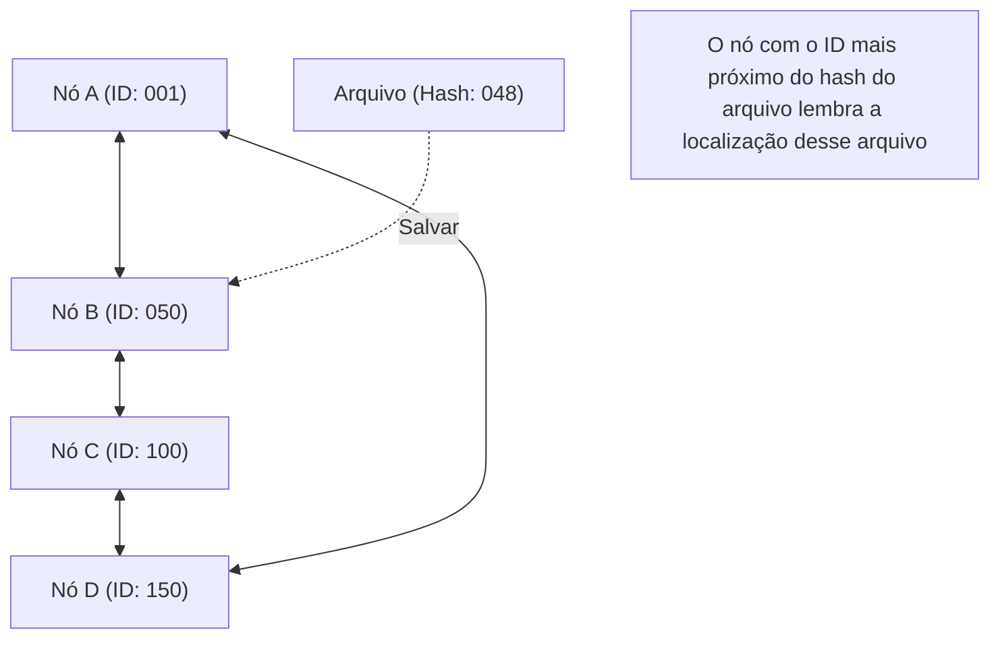

## 1. Modelo de rede descentralizada

No mundo da Internet, a esmagadora maioria dos modelos de comunicação que usamos sem perceber diariamente é o "**modelo cliente-servidor**".
Ao navegar em sites ou assistir a vídeos, nossos smartphones (clientes) estão constantemente solicitando e recebendo dados de computadores de alto desempenho (servidores) localizados em enormes data centers.

No entanto, esse modelo tem uma fraqueza clara. Trata-se do problema do "ponto único de falha" (Single Point of Failure), em que o servidor cai quando os acessos se concentram muito e o processamento não consegue acompanhar. Além disso, há um problema estrutural no qual custos enormes e poder se concentram nas empresas que mantêm e gerenciam os servidores.

Como uma abordagem completamente diferente para isso, foi idealizado o "**modelo P2P (Peer-to-Peer)**".
No P2P, não existe um "servidor" privilegiado. Todos os computadores (pares) que participam da rede trocam dados diretamente entre si em uma relação igualitária (Peer).

## 2. As três arquiteturas do P2P

A tecnologia P2P evoluiu para três grandes arquiteturas ao longo de sua história.

### Primeira Geração: P2P Híbrido (Tipo Napster)
O "Napster", que surgiu em 1999 e causou uma tempestade de compartilhamento de arquivos de música em todo o mundo, é um exemplo representativo.
Embora a troca de arquivos em si ocorresse entre os PCs dos usuários (P2P), a **informação de índice (catálogo) de "quem tem qual arquivo" era gerenciada centralmente em um servidor central**.
As buscas eram muito rápidas e eficientes, mas havia uma fraqueza: se o servidor central fosse legalmente bloqueado e interrompido, toda a rede deixaria de funcionar.

### Segunda Geração: P2P Puro (Tipo Gnutella, Winny)
É um método que elimina completamente o servidor central, e as solicitações de busca também são feitas através de um repasse entre os usuários.
Ao descentralizar até mesmo os "índices", obteve-se uma robustez (tolerância a falhas) extremamente alta, na qual a rede não para mesmo que um servidor específico caia. No entanto, havia um "problema de escalabilidade", pois pacotes de busca inundavam toda a rede para encontrar o arquivo desejado, sobrecarregando a largura de banda da comunicação.

### Terceira Geração: P2P usando DHT (Tabela de Hash Distribuída)
A atual corrente principal da tecnologia P2P é o método que usa **DHT (Distributed Hash Table)**. É amplamente utilizado no BitTorrent e outros.

O DHT atribui um "ID matemático (valor de hash)" a todos os pares e arquivos na rede e divide e gerencia o vasto espaço da rede com base em regras. Ao procurar um arquivo desejado, em vez de perguntar aleatoriamente aos arredores, a solicitação de pesquisa é encaminhada pela rota mais curta em direção ao "par que tem o ID mais próximo do ID desse arquivo". Portanto, mesmo em uma rede com milhões de participantes, é possível chegar aos dados desejados em um tempo extremamente curto.

## 3. Os pontos fortes dos sistemas distribuídos: Escalabilidade

A maior mágica da tecnologia P2P está na propriedade paradoxal de que "**quanto mais os usuários aumentam, mais melhora a capacidade de todo o sistema**".

No modelo cliente-servidor, se os usuários chegarem a 1 milhão, a carga no servidor será 1 milhão de vezes maior.
No entanto, em uma rede P2P, a participação de 1 milhão de pessoas significa que "poder de CPU equivalente a 1 milhão de máquinas e largura de banda de comunicação de 1 milhão de linhas" são adicionados ao sistema simultaneamente. Quanto mais as pessoas desejam dados, mais aumentam simultaneamente as pessoas que podem fornecer esses dados, de modo que o sistema como um todo nunca cai.

Quem aproveitou essa característica ao extremo foi o protocolo "**BitTorrent**", que permite que dezenas de milhares de pessoas baixem simultaneamente arquivos gigantes em alta velocidade. Ele é amplamente utilizado como uma tecnologia de suporte nos bastidores da gigantesca infraestrutura moderna, como a distribuição de imagens de SO do Windows e a entrega de atualizações do Steam, a maior plataforma de jogos do mundo.

## 4. P2P e Blockchain: A genealogia rumo à Web3

Em 2008, uma nova história do P2P começou a partir de um artigo publicado por uma pessoa que se intitulava Satoshi Nakamoto.
Trata-se do "**Bitcoin**".

Os sistemas P2P tradicionais eram usados para "compartilhamento de arquivos" e "descentralização de processamento computacional", mas o Bitcoin usou a rede P2P para a "**descentralização da confiança**".
Mesmo sem a existência de um banco central ou administrador, inúmeros nós que participam da rede P2P monitoram os registros de transações (livro-razão) uns dos outros. Ao combinar técnicas de criptografia (funções de hash e criptografia de chave pública) com algoritmos de consenso (Proof of Work), construiu-se "um sistema distribuído onde a falsificação de dados é virtualmente impossível = **Blockchain**".

Essa ideia de "uma rede autônoma e descentralizada que não depende de um administrador específico" está diretamente ligada ao movimento atual chamado "Web3" (Web descentralizada).

## 5. Desafios e futuro da tecnologia P2P

O P2P é uma tecnologia maravilhosa, mas também apresenta desafios.

Um deles é o problema dos "**caronas (free riders)**". Quando aumentam os usuários que apenas recebem dados e não fornecem nenhum, a rede entra em declínio. Para resolver esse problema, estão sendo pesquisados mecanismos que concedem o direito de baixar com prioridade de acordo com a quantidade fornecida, bem como mecanismos que oferecem incentivos financeiros (tokens), como nos blockchains.

Outro é a "**governança e segurança**". Como não há um administrador central, se nós mal-intencionados espalharem dados falsos ou vírus, é difícil bloqueá-los imediatamente.

O P2P não é apenas uma tecnologia para "softwares de compartilhamento de arquivos". É o auge dos "sistemas distribuídos" na ciência da computação e uma arquitetura que carrega uma forte filosofia de não concentrar o poder em um único ponto. Daqui para frente, a tecnologia P2P continuará a evoluir como a base da comunicação entre dispositivos IoT e da infraestrutura descentralizada da Internet da próxima geração.
