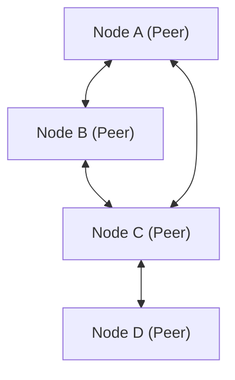

# Техническое объяснение P2P (Peer-to-Peer)

Peer-to-Peer (P2P) — это сетевая архитектура, в которой, в отличие от клиент-серверной модели, каждый узел (пир) взаимодействует на равных правах.

## Обзор

В сети P2P каждый узел функционирует как в качестве клиента, так и в качестве сервера. Это устраняет единую точку отказа (SPOF) и повышает доступность системы в целом.

## Математическое моделирование

Доступность ресурсов в сети P2P масштабируется с увеличением количества узлов $N$. Общая пропускная способность $B_{total}$ выражается следующим образом:

$$ B_{total} = \sum_{i=1}^{N} b_i $$

Где $b_i$ — это пропускная способность, предоставляемая каждым узлом.

