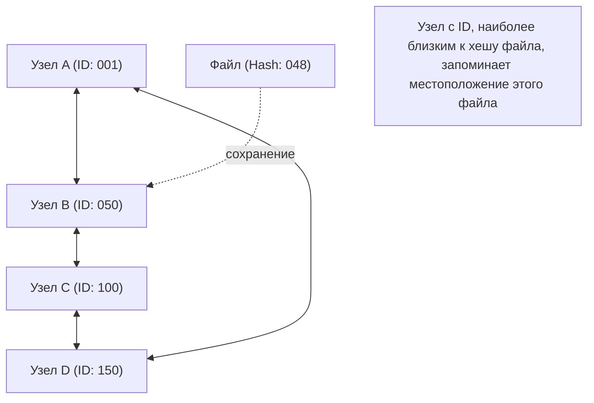

## 1. Децентрализованная сетевая модель

В мире Интернета подавляющее большинство моделей связи, которые мы обычно используем не задумываясь, — это **клиент-серверная модель**.
При просмотре веб-сайтов или видео наши смартфоны (клиенты) постоянно запрашивают и получают данные от высокопроизводительных компьютеров (серверов), расположенных в огромных центрах обработки данных.

Однако у этой модели есть явная слабость. Это проблема «единой точки отказа» (Single Point of Failure), когда сервер выходит из строя из-за того, что не справляется с обработкой при слишком большой концентрации обращений. Кроме того, существует структурная проблема, заключающаяся в том, что огромные затраты и власть сосредоточены в руках компаний, обслуживающих серверы.

В качестве совершенно иного подхода к решению этой проблемы была разработана **модель P2P (Peer-to-Peer)**.
В P2P нет привилегированных «серверов». Все компьютеры (пиры), участвующие в сети, напрямую обмениваются данными друг с другом на равных (Peer) условиях.

## 2. Три архитектуры P2P

За свою историю технология P2P превратилась в три основные архитектуры.

### Первое поколение: Гибридная P2P (тип Napster)
Типичным примером является «Napster», который появился в 1999 году и вызвал бурю обмена музыкальными файлами по всему миру.
Сам обмен файлами осуществлялся между ПК пользователей (P2P), но **информация об индексе (оглавлении)**, то есть о том, «у кого какой файл», **централизованно управлялась на центральном сервере**.
Поиск был очень быстрым и эффективным, но был и недостаток: если центральный сервер был юридически заблокирован и остановлен, вся сеть переставала функционировать.

### Второе поколение: Чистая P2P (тип Gnutella, Winny)
В этом методе центральный сервер полностью исключен, а поисковые запросы также передаются по цепочке между пользователями.
Благодаря распределению даже «индексов» была достигнута чрезвычайно высокая надежность (отказоустойчивость): даже если конкретный сервер выходил из строя, сеть не останавливалась. Однако была «проблема масштабируемости», заключавшаяся в том, что поисковые пакеты переполняли всю сеть в поисках нужного файла, что приводило к перегрузке полосы пропускания сети.

### Третье поколение: P2P с использованием DHT (распределенная хеш-таблица)
В настоящее время основным направлением технологии P2P является метод с использованием **DHT (Distributed Hash Table)**. Он широко используется в BitTorrent и других системах.

DHT назначает «математический ID (хеш-значение)» всем узлам и файлам в сети и разделяет, а также управляет огромным сетевым пространством на основе правил. При поиске нужного файла, вместо того чтобы спрашивать вслепую всех вокруг, поисковый запрос перенаправляется по кратчайшему маршруту к «узлу с ID, наиболее близким к ID файла», поэтому даже в сети с миллионами участников можно получить нужные данные за очень короткое время.

## 3. Сильная сторона распределенных систем: Масштабируемость

Главная магия технологии P2P заключается в парадоксальном свойстве: **чем больше пользователей, тем выше общая производительность системы**.

В клиент-серверной модели, если количество пользователей достигает 1 миллиона, нагрузка на сервер возрастает в 1 миллион раз.
Но в P2P-сети присоединение 1 миллиона человек означает, что в систему одновременно добавляются «мощность процессоров 1 миллиона компьютеров и пропускная способность 1 миллиона линий связи». Чем больше людей хотят получить данные, тем больше людей могут одновременно их предоставить, поэтому система в целом никогда не выходит из строя.

Этот принцип в максимальной степени используется в протоколе **BitTorrent**, который позволяет десяткам тысяч людей одновременно скачивать огромные файлы на высокой скорости. Он широко используется как технология, поддерживающая гигантскую современную инфраструктуру, например, для распространения образов ОС Windows и доставки обновлений для Steam, крупнейшей в мире игровой платформы.

## 4. P2P и блокчейн: Родословная к Web3

В 2008 году началась новая история P2P с публикации статьи человеком, назвавшимся Сатоши Накамото.
Это был **Bitcoin (Биткойн)**.

Традиционные P2P-системы использовались для «обмена файлами» или «распределения вычислительных процессов», но Биткойн использовал сеть P2P для **распределения доверия**.
Даже без центрального банка или администратора бесчисленные узлы, участвующие в сети P2P, контролируют записи транзакций (регистры) друг друга, и, комбинируя криптографические технологии (хеш-функции и криптография с открытым ключом) с алгоритмом консенсуса (Proof of Work), они создали «распределенную систему, в которой подделка данных практически невозможна = **[блокчейн](/ru/p/blockchain-technology-smart-contract-distributed-ledger/)**».

Эта идея «автономной децентрализованной сети, которая не зависит от конкретного администратора», напрямую связана с текущим движением **Web3 (децентрализованный веб)**.

## 5. Проблемы и будущее технологии P2P

P2P — это замечательная технология, но у нее есть и проблемы.
Одной из них является проблема **безбилетника (free rider)**. Если становится много пользователей, которые только получают данные, но не предоставляют их, сеть приходит в упадок. Для решения этой проблемы исследуются механизмы, предоставляющие право на приоритетное скачивание в зависимости от объема предоставленных данных, а также механизмы финансового стимулирования (токены), подобные тем, что используются в блокчейне.

Другая проблема — **управление и безопасность**. Поскольку центрального администратора нет, если вредоносный узел распространяет ложные данные или вирусы, немедленно заблокировать его становится трудно.

P2P — это не просто технология «программного обеспечения для обмена файлами». Это вершина «распределенных систем» в информатике и архитектура с сильной философией, направленной против концентрации власти в одной точке. В будущем технология P2P продолжит развиваться как основа для связи между устройствами IoT и децентрализованной интернет-инфраструктуры следующего поколения.
