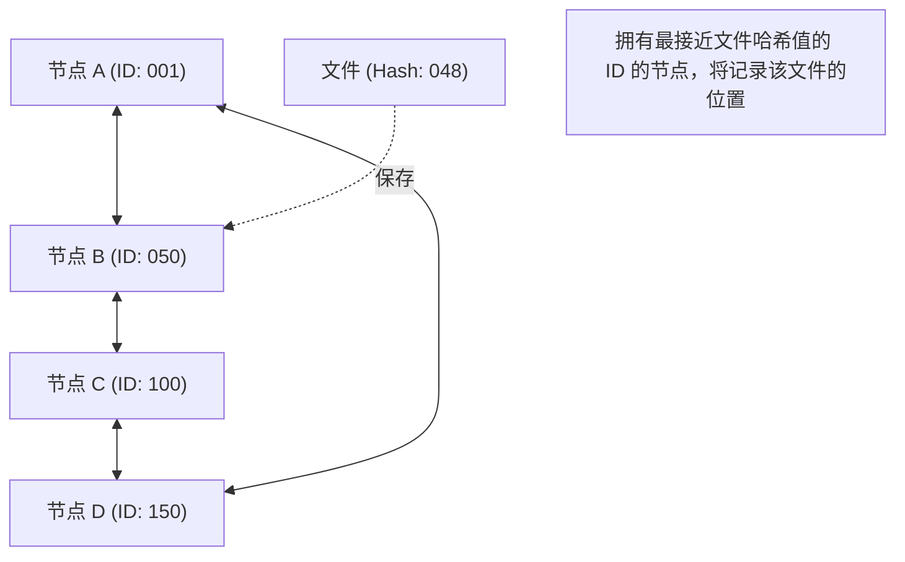

## 1. 脱离中心化的网络模型

在互联网世界中，我们平时无意识中使用的通信模型绝大多数是“ **客户端-服务器模型** ”。
在浏览 Web 网站、观看视频时，我们的智能手机（客户端）总是向位于巨大数据中心的高性能计算机（服务器）请求并接收数据。

然而，这种模型有明显的弱点。那就是当访问过度集中于服务器时，处理将跟不上而导致宕机的“单点故障”（Single Point of Failure）问题。此外，它还具有结构性问题，即维护和管理服务器的企业将集中巨大的成本和权力。

针对此问题，作为完全不同的方法而设计出来的便是“ **P2P（点对点：Peer-to-Peer）模型** ”。
在 P2P 中，不存在具有特权的“服务器”。参与网络的所有计算机（节点/Peer）都在相互对等（Peer）的关系下直接交换数据。

## 2. P2P 的 3 个架构

P2P 技术在其历史中主要演变为 3 个架构。

### 第一代：混合 P2P（Napster 型）
1999 年登场并在全球掀起音乐文件共享风暴的“Napster”是其典型代表。
文件本身的交换是在用户的 PC 之间（P2P）进行的，但 **只有“谁拥有哪个文件”的索引（目录）信息由中央服务器集中管理** 。
搜索非常快速且高效，但是存在一个弱点：一旦中央服务器因法律禁令而停止，整个网络将无法运作。

### 第二代：纯 P2P（Gnutella, Winny 型）
这是一种完全排除中央服务器，搜索请求也由用户之间像传水桶一样进行的模式。
由于连“索引”也被分散了，因此它获得了极高的稳健性（容错性），即使关闭特定服务器也不会停止网络。但是，为了寻找目标文件，搜索数据包将充斥整个网络，从而压迫通信带宽，存在“可扩展性问题”。

### 第三代：使用 DHT（分布式哈希表）的 P2P
目前 P2P 技术的主流是使用 **DHT（Distributed Hash Table）** 的方式。它在 BitTorrent 等中被广泛使用。

DHT 会为网络上的所有节点和文件分配“数学 ID（哈希值）”，并根据规则对广阔的网络空间进行分区管理。在寻找目标文件时，不是盲目地向周围询问，而是向“具有与该文件 ID 最接近的 ID 的节点”以最短路线转发搜索请求，因此即使在数万人参与的网络中，也能在极短的时间内到达目标数据。

## 3. 分布式系统的优势：可扩展性

P2P 技术的最大魔力在于其悖论性质：“ **用户越多，整个系统的能力就越高** ”。

在客户端-服务器模型中，如果用户达到 100 万人，服务器的负载将变成 100 万倍。
但是在 P2P 网络中，100 万人的参与意味着同时有“ 100 万台的 CPU 算力和 100 万条线路的通信带宽”被添加到系统中。想要数据的人越多，能提供该数据的人也同时增多，因此整个系统绝对不会宕机。

将这一特性发挥到极致的，便是能够让数万人同时高速下载巨大文件的“ **BitTorrent（比特流）** ”协议。作为在背后支撑现代巨大基础设施的技术，它被广泛应用于 Windows 的 OS 镜像分发、世界最大游戏平台 Steam 的更新分发等。

## 4. P2P 与区块链：迈向 Web3 的谱系

2008 年，自称中本聪的人发表的一篇论文开启了 P2P 的新历史。
那就是“ **Bitcoin（比特币）** ”。

传统的 P2P 系统被用于“文件共享”或“计算处理的分布式”，而比特币则将 P2P 网络用于“ **信任的分布式** ”。
即使不存在中央银行或管理者，参与 P2P 网络的无数节点也会相互监督彼此的交易记录（账本），通过结合密码技术（哈希函数和公钥密码）与[共识算法](/zh-cn/p/byzantine-generals-problem-consensus/)（Proof of Work），构建了“实际上无法篡改数据的[分布式系统](/zh-cn/p/cap-theorem-distributed-systems-tradeoff/) = **[区块链](/zh-cn/p/blockchain-technology-smart-contract-distributed-ledger/)** ”。

这种“不依赖特定管理者的自治分布式网络”的思想，直接连接到了当前的“ Web3（分布式网络）”运动。

## 5. P2P 技术的课题与未来

P2P 是一项了不起的技术，但也存在课题。
其中之一是“ **搭便车（Free Rider）** ”问题。如果只获取数据却不提供数据的用户变多，网络就会衰退。为了解决这个问题，研究人员正在研究根据提供量给予优先下载权利的机制，以及像[区块链](/zh-cn/p/blockchain-technology-smart-contract-distributed-ledger/)那样给予金钱激励（代币）的机制。

另一个是“ **治理与安全** ”。由于没有中央管理者，当恶意节点散布虚假数据或病毒时，很难立即将其阻断。

P2P 不仅仅是“文件共享软件”的技术。它是计算机科学中“[分布式系统](/zh-cn/p/cap-theorem-distributed-systems-tradeoff/)”的极致，是拥有不将权力集中于一点之强烈哲学的架构。今后，作为 IoT 设备间的通信以及下一代分布式互联网基础设施的基石，P2P 技术将继续进化。
