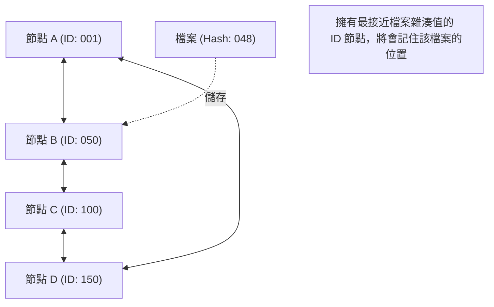

## 1. 脫離中央集權的網路模型

在網際網路的世界中，我們平時在不知不覺間使用的通訊模型中，絕大多數是「 **主從式架構 (Client-Server Model)** 」。
瀏覽網頁、觀看影片時，我們的智慧型手機 (客戶端) 總是不斷向位於巨大資料中心的高效能電腦 (伺服器) 發送資料請求並接收回傳內容。

然而，這個模型存在明顯的弱點。當對伺服器的連線過度集中而導致處理不及時，就會發生系統崩潰，這稱為「單點故障 (Single Point of Failure)」問題。此外，它還存在結構性問題，即龐大的成本和權力會集中在維護與管理伺服器的企業手中。

為了應對這個問題，人們構思出了一種截然不同的方法，那就是「 **P2P (對等網路：Peer-to-Peer) 模型** 」。
在 P2P 中，不存在擁有特權的「伺服器」。參與網路的所有電腦 (節點，Peer) 均處於對等 (Peer) 的關係中，彼此直接交換資料。

## 2. P2P 的 3 種架構

P2P 技術在其歷史發展過程中，大致演進出 3 種主要架構。

### 第一代：混合式 P2P (Napster 型)
1999 年問世，在全世界掀起音樂檔案分享風暴的「Napster」就是典型代表。
雖然檔案傳輸本身是在使用者的個人電腦之間 (P2P) 進行，但「誰擁有什麼檔案」的 **索引 (目錄) 資訊則由中央伺服器集中管理** 。
其搜尋速度非常快且有效率，但弱點是一旦中央伺服器遭到法律禁令而停止運作，整個網路就會失去作用。

### 第二代：純粹 P2P (Gnutella、Winny 型)
完全排除中央伺服器，搜尋請求也透過使用者之間以接力方式進行的模式。
連「索引」也被分散處理後，獲得了即使特定伺服器停機，網路也不會中斷的極高穩健性 (容錯能力)。然而，為了尋找目標檔案，搜尋封包會充斥整個網路，造成頻寬被大量佔用，這就是它所面臨的「擴展性問題」。

### 第三代：使用 DHT (分散式雜湊表) 的 P2P
目前 P2P 技術的主流是使用 **DHT (Distributed Hash Table)** 的模式。它被廣泛應用於 BitTorrent 等軟體中。

DHT 為網路上所有的節點與檔案分配「數學上的 ID (雜湊值)」，並根據規則對廣大的網路空間進行分割與管理。尋找目標檔案時，它不會盲目地向周圍詢問，而是以最短路徑將搜尋請求轉發給「擁有最接近該檔案 ID 的節點」，因此即使在數百萬人參與的網路中，也能在極短的時間內找到目標資料。

## 3. 分散式系統的優勢：擴展性

P2P 技術最神奇之處，在於它具備「 **使用者越多，系統整體能力反而越高** 」的悖論性質。

在主從式架構中，如果使用者達到 100 萬人，伺服器的負載就會變成 100 萬倍。
但在 P2P 網路中，100 萬人參與，同時也意味著系統加入了「 100 萬台 CPU 的運算能力以及 100 萬條線路的通訊頻寬」。想要資料的人越多，能同時提供該資料的人也隨之增加，因此系統整體絕不會崩潰。

將這種特性發揮到極致的，就是能讓數萬人同時高速下載巨大檔案的「 **BitTorrent** 」協定。從 Windows 作業系統映像檔的發布，到全球最大遊戲平台 Steam 的更新派送，它被廣泛活用於支撐現代巨大基礎設施的幕後技術。

## 4. P2P 與區塊鏈：邁向 Web3 的系譜

2008 年，由自稱中本聰 (Satoshi Nakamoto) 的人物發表的一篇論文，開啟了 P2P 歷史的新篇章。
這就是「 **Bitcoin (比特幣)** 」。

過去的 P2P 系統主要用於「檔案分享」或「分散運算處理」，但比特幣將 P2P 網路用於「 **信任的分散** 」。
即使不存在中央銀行或管理者，參與 P2P 網路的無數節點也會互相監督彼此的交易紀錄 (帳本)，藉由結合密碼學技術 (雜湊函數與公開金鑰密碼學) 和共識演算法 (Proof of Work)，構築出一個「資料實質上無法竄改的分散式系統 = **區塊鏈** 」。

這種「不依賴特定管理者，自主分散的網路」的設計思想，直接與現代「Web3 (分散式網路)」的浪潮相互連結。

## 5. P2P 技術的挑戰與未來

儘管 P2P 是一項卓越的技術，但它同樣面臨挑戰。
其中之一就是「 **搭便車 (Free Rider)** 」問題。如果越來越多使用者只獲取資料而不提供資料，網路就會逐漸衰退。為了解決這個問題，目前正在研究許多機制，例如根據提供量賦予優先下載權，或是像區塊鏈一樣提供金錢誘因 (代幣)。

另一個挑戰是「 **治理與安全性** 」。因為沒有中央管理者，若惡意節點散佈虛假資料或病毒，系統很難立即將其阻斷。

P2P 絕非僅僅是「檔案分享軟體」的技術。它是電腦科學中「分散式系統」的極致表現，是一種秉持著權力不應集中於一點的強烈哲學架構。在未來，作為物聯網 (IoT) 裝置間的通訊基礎，或是次世代分散式網際網路基礎設施，P2P 技術將會繼續演進。
