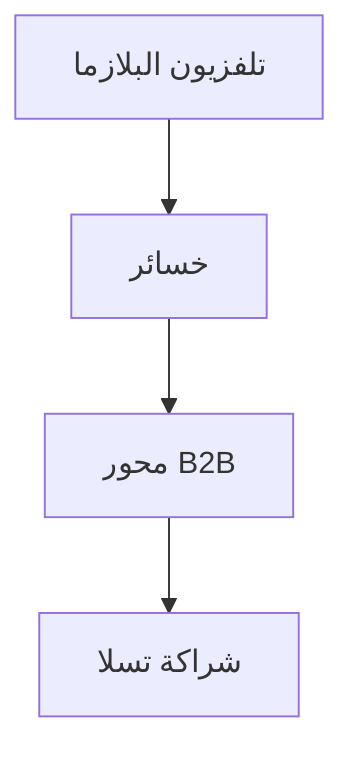

## 1. تأسيس شركة ماتسوشيتا للصناعات الكهربائية
في عام 1918، أسس كونوسوكي ماتسوشيتا الشركة بعد ابتكاره قابس ملحق محسّن (مقبس مزدوج). بناءً على "فلسفة ماء الصنبور"، وفرت الشركة أجهزة منزلية عالية الجودة للجماهير بأسعار رخيصة، وتربعت على العرش كـ "ملك الأجهزة المنزلية".

## 2. موجة الرقمنة وإخفاق تلفزيونات البلازما
في العقد الأول من القرن الحادي والعشرين، استثمرت الشركة مبالغ ضخمة في شاشات البلازما خلال المنافسة على أجهزة التلفزيون المسطحة، لكنها خسرت المنافسة أمام شاشات الكريستال السائل (LCD)، واضطرت إلى إجراء تحول كبير.

## 3. التحول إلى B2B وبطاريات السيارات
تم تنفيذ إصلاح هيكلي واسع النطاق تحت قيادة الرئيس كازوهيرو تسوجا. من خلال تشكيل شراكة قوية مع تسلا، عادت الشركة إلى القمة كأكبر مصنع لبطاريات الليثيوم أيون الأسطوانية للسيارات الكهربائية (EV).

## 4. نحو مستقبل مستدام
في الوقت الحاضر، تسير الشركة في تاريخ جديد كشركة B2B لحل المشكلات الاجتماعية، لا تقتصر على الأجهزة المنزلية فحسب، بل تشمل أيضاً تطوير المدن الذكية والتحول الرقمي (DX) لسلاسل التوريد.

## جزء التحقق التكنولوجي الإضافي 1

## جزء التحقق التكنولوجي الإضافي 2

## جزء التحقق التكنولوجي الإضافي 3

## جزء التحقق التكنولوجي الإضافي 4

## جزء التحقق التكنولوجي الإضافي 5

## جزء التحقق التكنولوجي الإضافي 6

## جزء التحقق التكنولوجي الإضافي 7

## جزء التحقق التكنولوجي الإضافي 8

## جزء التحقق التكنولوجي الإضافي 9

## جزء التحقق التكنولوجي الإضافي 10

## جزء التحقق التكنولوجي الإضافي 11

## جزء التحقق التكنولوجي الإضافي 12

## جزء التحقق التكنولوجي الإضافي 13

## جزء التحقق التكنولوجي الإضافي 14

