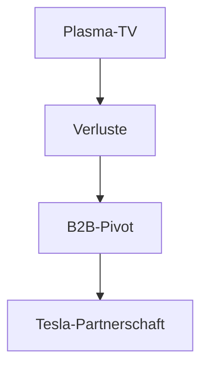

## 1. Gründung von Matsushita Electric Industrial
1918 gründete Konosuke Matsushita das Unternehmen durch die Erfindung eines verbesserten Anschlusssteckers (Doppelstecker). Basierend auf der "Leitungswasser-Philosophie" bot das Unternehmen den Massen hochwertige Haushaltsgeräte günstig an und regierte als "König der Haushaltsgeräte".

## 2. Die Welle der Digitalisierung und der Rückschlag bei Plasma-TVs
In den 2000er Jahren tätigte das Unternehmen im Wettbewerb um Flachbildfernseher riesige Investitionen in Plasmabildschirme, verlor jedoch den Konkurrenzkampf gegen Flüssigkristallanzeigen (LCD) und war zu einer großen Umstrukturierung gezwungen.

## 3. Pivot zu B2B und Autobatterien
Unter Präsident Kazuhiro Tsuga wurde eine groß angelegte Strukturreform durchgeführt. Das Unternehmen ging eine starke Partnerschaft mit Tesla ein und feierte ein Comeback als führender Hersteller von zylindrischen Lithium-Ionen-Batterien für Elektrofahrzeuge (EVs).

## 4. Auf dem Weg in eine nachhaltige Zukunft
Heute geht das Unternehmen als B2B-Unternehmen, das soziale Probleme löst – wie etwa bei der Entwicklung von Smart Cities und der digitalen Transformation (DX) von Lieferketten, nicht nur mit Haushaltsgeräten – in eine neue Geschichte ein.

## Zusätzlicher Technik-Validierungsteil 1

## Zusätzlicher Technik-Validierungsteil 2

## Zusätzlicher Technik-Validierungsteil 3

## Zusätzlicher Technik-Validierungsteil 4

## Zusätzlicher Technik-Validierungsteil 5

## Zusätzlicher Technik-Validierungsteil 6

## Zusätzlicher Technik-Validierungsteil 7

## Zusätzlicher Technik-Validierungsteil 8

## Zusätzlicher Technik-Validierungsteil 9

## Zusätzlicher Technik-Validierungsteil 10

## Zusätzlicher Technik-Validierungsteil 11

## Zusätzlicher Technik-Validierungsteil 12

## Zusätzlicher Technik-Validierungsteil 13

## Zusätzlicher Technik-Validierungsteil 14

