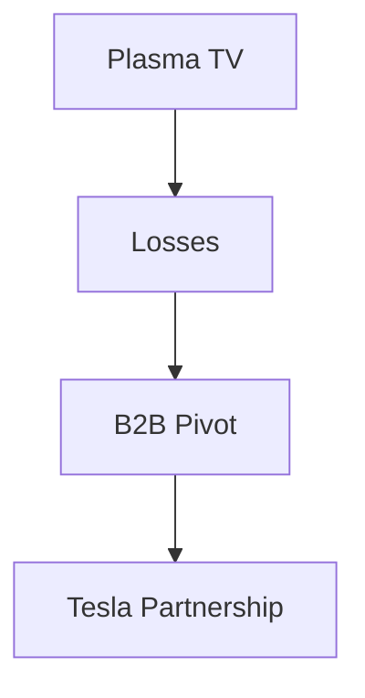

## 1. Founding of Matsushita Electric Industrial Co., Ltd.
In 1918, Konosuke Matsushita invented the improved attachment plug (twin socket) and founded the company. Based on his "Tap Water Philosophy," he provided high-quality home appliances to the masses at low prices, reigning as the "King of Home Appliances."

## 2. The Wave of Digitalization and the Setback of Plasma TVs
In the 2000s, the company invested heavily in plasma displays during the flat-screen TV competition, but lost to liquid crystal displays (LCDs) and was forced to make a major transition.

## 3. Pivot to B2B and Automotive Batteries
Under the leadership of President Kazuhiro Tsuga, a large-scale structural reform was implemented. By forming a strong partnership with Tesla, the company made a comeback as a top manufacturer of cylindrical lithium-ion batteries for EVs (electric vehicles).

## 4. Toward a Sustainable Future
Today, it is walking a new path in history as a B2B company that solves social issues, not only in home appliances but also in smart city development and supply chain DX (digital transformation).

