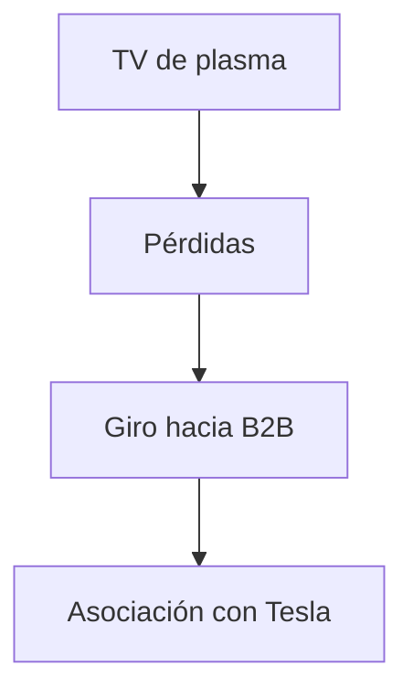

## 1. Fundación de Matsushita Electric Industrial
En 1918, Konosuke Matsushita fundó la empresa inventando un enchufe de fijación mejorado (enchufe de dos vías). Basándose en la "filosofía del agua", proporcionó electrodomésticos de alta calidad a las masas a precios bajos, reinando como el "rey de los electrodomésticos".

## 2. La ola de la digitalización y el fracaso de los televisores de plasma
En la década de 2000, en la competencia de los televisores de pantalla plana, la empresa realizó una gran inversión en pantallas de plasma, pero perdió la competencia frente al cristal líquido (LCD) y se vio obligada a realizar una gran transformación.

## 3. Giro hacia B2B y baterías automotrices
Bajo la dirección del presidente Kazuhiro Tsuga, se implementó una reestructuración a gran escala. Formaron una sólida asociación con Tesla y lograron revivir como el principal fabricante de baterías cilíndricas de iones de litio para EV (vehículos eléctricos).

## 4. Hacia un futuro sostenible
En la actualidad, está forjando una nueva historia como una empresa B2B orientada a resolver problemas sociales, no solo en electrodomésticos, sino también en el desarrollo de ciudades inteligentes y la transformación digital (DX) de las cadenas de suministro.

## Parte 1 de verificación técnica adicional

## Parte 2 de verificación técnica adicional

## Parte 3 de verificación técnica adicional

## Parte 4 de verificación técnica adicional

## Parte 5 de verificación técnica adicional

## Parte 6 de verificación técnica adicional

## Parte 7 de verificación técnica adicional

## Parte 8 de verificación técnica adicional

## Parte 9 de verificación técnica adicional

## Parte 10 de verificación técnica adicional

## Parte 11 de verificación técnica adicional

## Parte 12 de verificación técnica adicional

## Parte 13 de verificación técnica adicional

## Parte 14 de verificación técnica adicional

