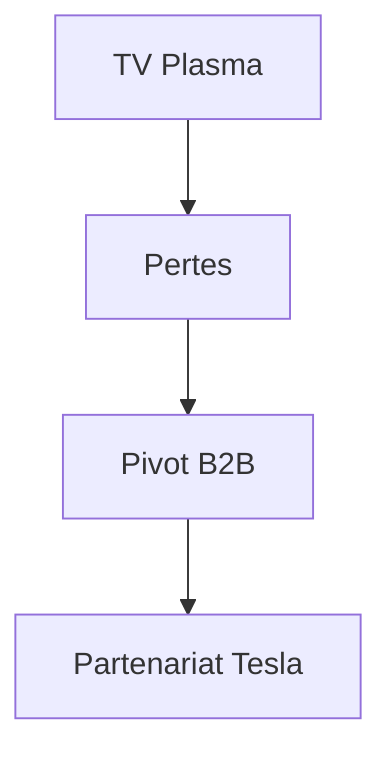

## 1. Fondation de Matsushita Electric Industrial
En 1918, Konosuke Matsushita a inventé la douille de fixation améliorée (douille à deux voies) et a fondé l'entreprise. Basée sur la « philosophie de l'eau du robinet », l'entreprise a fourni des appareils électroménagers de haute qualité au grand public à bas prix, régnant en tant que « roi de l'électroménager ».

## 2. La vague de la numérisation et l'échec des téléviseurs plasma
Dans les années 2000, l'entreprise a investi massivement dans les écrans plasma lors de la concurrence des téléviseurs à écran plat, mais a perdu face aux écrans à cristaux liquides (LCD) et a été contrainte d'opérer un changement majeur.

## 3. Pivot vers le B2B et les batteries automobiles
L'entreprise a mis en œuvre une restructuration à grande échelle sous la direction du président Kazuhiro Tsuga. En formant un partenariat solide avec Tesla, elle a réussi à renaître en tant que principal fabricant de batteries cylindriques lithium-ion pour véhicules électriques (VE).

## 4. Vers un avenir durable
Aujourd'hui, l'entreprise écrit une nouvelle page de son histoire en tant qu'entreprise B2B axée sur la résolution de problèmes sociaux, allant au-delà de l'électroménager pour inclure le développement de villes intelligentes et la transformation numérique (DX) des chaînes d'approvisionnement.

## Partie 1 de la vérification technique supplémentaire

## Partie 2 de la vérification technique supplémentaire

## Partie 3 de la vérification technique supplémentaire

## Partie 4 de la vérification technique supplémentaire

## Partie 5 de la vérification technique supplémentaire

## Partie 6 de la vérification technique supplémentaire

## Partie 7 de la vérification technique supplémentaire

## Partie 8 de la vérification technique supplémentaire

## Partie 9 de la vérification technique supplémentaire

## Partie 10 de la vérification technique supplémentaire

## Partie 11 de la vérification technique supplémentaire

## Partie 12 de la vérification technique supplémentaire

## Partie 13 de la vérification technique supplémentaire

## Partie 14 de la vérification technique supplémentaire

