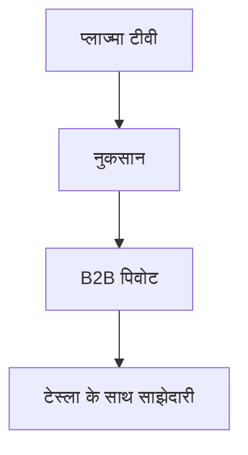

## 1. मात्सुशिता इलेक्ट्रिक इंडस्ट्रियल की स्थापना
1918 में, कोनोसुके मात्सुशिता ने बेहतर अटैचमेंट प्लग (टू-वे सॉकेट) का आविष्कार किया और कंपनी की स्थापना की। अपनी "नल-जल फिलॉसफी" के आधार पर, उन्होंने जनता को किफायती दामों पर उच्च गुणवत्ता वाले घरेलू उपकरण प्रदान किए और "घरेलू उपकरणों के राजा" के रूप में राज किया।

## 2. डिजिटलीकरण की लहर और प्लाज्मा टीवी की विफलता
2000 के दशक में, फ्लैट-स्क्रीन टीवी प्रतियोगिता में प्लाज्मा डिस्प्ले पर भारी निवेश किया गया था, लेकिन वे लिक्विड क्रिस्टल डिस्प्ले (LCD) से हार गए, जिसने एक बड़े बदलाव को मजबूर कर दिया।

## 3. B2B और ऑटोमोटिव बैटरी की ओर पिवोट
राष्ट्रपति काज़ुहिरो त्सुगा के नेतृत्व में बड़े पैमाने पर संरचनात्मक सुधार लागू किए गए। टेस्ला के साथ एक मजबूत साझेदारी स्थापित करके, कंपनी ईवी (इलेक्ट्रिक वाहन) के लिए बेलनाकार लिथियम-आयन बैटरी के शीर्ष निर्माता के रूप में फिर से उभरी।

## 4. एक टिकाऊ भविष्य की ओर
आज, कंपनी न केवल घरेलू उपकरणों बल्कि स्मार्ट सिटी विकास और आपूर्ति श्रृंखला के DX (डिजिटल ट्रांसफॉर्मेशन) जैसे क्षेत्रों में सामाजिक मुद्दों को हल करने वाली B2B कंपनी के रूप में एक नया इतिहास रच रही है।

## अतिरिक्त तकनीकी सत्यापन भाग 1

## अतिरिक्त तकनीकी सत्यापन भाग 2

## अतिरिक्त तकनीकी सत्यापन भाग 3

## अतिरिक्त तकनीकी सत्यापन भाग 4

## अतिरिक्त तकनीकी सत्यापन भाग 5

## अतिरिक्त तकनीकी सत्यापन भाग 6

## अतिरिक्त तकनीकी सत्यापन भाग 7

## अतिरिक्त तकनीकी सत्यापन भाग 8

## अतिरिक्त तकनीकी सत्यापन भाग 9

## अतिरिक्त तकनीकी सत्यापन भाग 10

## अतिरिक्त तकनीकी सत्यापन भाग 11

## अतिरिक्त तकनीकी सत्यापन भाग 12

## अतिरिक्त तकनीकी सत्यापन भाग 13

## अतिरिक्त तकनीकी सत्यापन भाग 14

