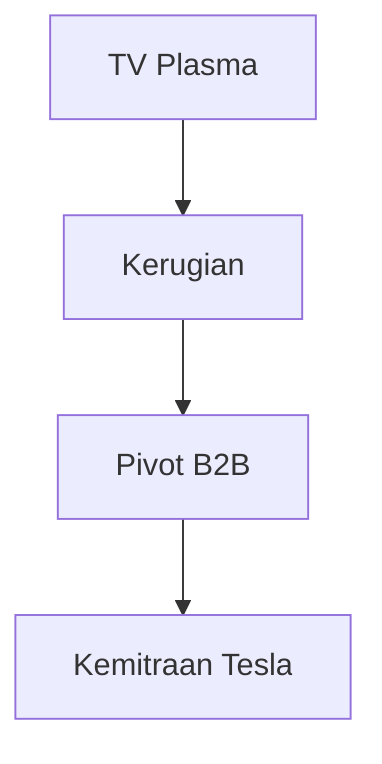

## 1. Pendirian Matsushita Electric Industrial
Pada tahun 1918, Konosuke Matsushita mendirikan perusahaan setelah merancang steker sambungan yang disempurnakan (stopkontak cabang dua). Berdasarkan "Filosofi Air Keran", perusahaan menyediakan peralatan rumah tangga berkualitas tinggi kepada masyarakat luas dengan harga terjangkau, dan bertahta sebagai "Raja Peralatan Rumah Tangga".

## 2. Gelombang Digitalisasi dan Kegagalan TV Plasma
Pada tahun 2000-an, perusahaan melakukan investasi besar-besaran dalam layar plasma selama kompetisi televisi layar datar, tetapi kalah dalam persaingan dengan layar kristal cair (LCD), yang memaksa terjadinya perubahan besar.

## 3. Pivot ke B2B dan Baterai Otomotif
Melaksanakan restrukturisasi berskala besar di bawah Presiden Kazuhiro Tsuga. Perusahaan menjalin kemitraan yang kuat dengan Tesla dan bangkit kembali sebagai produsen terkemuka baterai lithium-ion silinder untuk EV (kendaraan listrik).

## 4. Menuju Masa Depan yang Berkelanjutan
Saat ini, perusahaan menapaki sejarah baru sebagai perusahaan B2B yang berorientasi pada penyelesaian masalah sosial, tidak hanya mencakup peralatan rumah tangga tetapi juga pengembangan kota pintar (smart city) dan DX rantai pasokan.

## Bagian Verifikasi Teknologi Tambahan 1

### 1. Pendirian Matsushita Electric Industrial
Pada tahun 1918, Konosuke Matsushita mendirikan perusahaan setelah merancang steker sambungan yang disempurnakan (stopkontak cabang dua). Berdasarkan "Filosofi Air Keran", perusahaan menyediakan peralatan rumah tangga berkualitas tinggi kepada masyarakat luas dengan harga terjangkau, dan bertahta sebagai "Raja Peralatan Rumah Tangga".

### 2. Gelombang Digitalisasi dan Kegagalan TV Plasma
Pada tahun 2000-an, perusahaan melakukan investasi besar-besaran dalam layar plasma selama kompetisi televisi layar datar, tetapi kalah dalam persaingan dengan layar kristal cair (LCD), yang memaksa terjadinya perubahan besar.

### 3. Pivot ke B2B dan Baterai Otomotif
Melaksanakan restrukturisasi berskala besar di bawah Presiden Kazuhiro Tsuga. Perusahaan menjalin kemitraan yang kuat dengan Tesla dan bangkit kembali sebagai produsen terkemuka baterai lithium-ion silinder untuk EV (kendaraan listrik).

### 4. Menuju Masa Depan yang Berkelanjutan
Saat ini, perusahaan menapaki sejarah baru sebagai perusahaan B2B yang berorientasi pada penyelesaian masalah sosial, tidak hanya mencakup peralatan rumah tangga tetapi juga pengembangan kota pintar (smart city) dan DX rantai pasokan.

## Bagian Verifikasi Teknologi Tambahan 2

### 1. Pendirian Matsushita Electric Industrial
Pada tahun 1918, Konosuke Matsushita mendirikan perusahaan setelah merancang steker sambungan yang disempurnakan (stopkontak cabang dua). Berdasarkan "Filosofi Air Keran", perusahaan menyediakan peralatan rumah tangga berkualitas tinggi kepada masyarakat luas dengan harga terjangkau, dan bertahta sebagai "Raja Peralatan Rumah Tangga".

### 2. Gelombang Digitalisasi dan Kegagalan TV Plasma
Pada tahun 2000-an, perusahaan melakukan investasi besar-besaran dalam layar plasma selama kompetisi televisi layar datar, tetapi kalah dalam persaingan dengan layar kristal cair (LCD), yang memaksa terjadinya perubahan besar.

### 3. Pivot ke B2B dan Baterai Otomotif
Melaksanakan restrukturisasi berskala besar di bawah Presiden Kazuhiro Tsuga. Perusahaan menjalin kemitraan yang kuat dengan Tesla dan bangkit kembali sebagai produsen terkemuka baterai lithium-ion silinder untuk EV (kendaraan listrik).

### 4. Menuju Masa Depan yang Berkelanjutan
Saat ini, perusahaan menapaki sejarah baru sebagai perusahaan B2B yang berorientasi pada penyelesaian masalah sosial, tidak hanya mencakup peralatan rumah tangga tetapi juga pengembangan kota pintar (smart city) dan DX rantai pasokan.

## Bagian Verifikasi Teknologi Tambahan 3

### 1. Pendirian Matsushita Electric Industrial
Pada tahun 1918, Konosuke Matsushita mendirikan perusahaan setelah merancang steker sambungan yang disempurnakan (stopkontak cabang dua). Berdasarkan "Filosofi Air Keran", perusahaan menyediakan peralatan rumah tangga berkualitas tinggi kepada masyarakat luas dengan harga terjangkau, dan bertahta sebagai "Raja Peralatan Rumah Tangga".

### 2. Gelombang Digitalisasi dan Kegagalan TV Plasma
Pada tahun 2000-an, perusahaan melakukan investasi besar-besaran dalam layar plasma selama kompetisi televisi layar datar, tetapi kalah dalam persaingan dengan layar kristal cair (LCD), yang memaksa terjadinya perubahan besar.

### 3. Pivot ke B2B dan Baterai Otomotif
Melaksanakan restrukturisasi berskala besar di bawah Presiden Kazuhiro Tsuga. Perusahaan menjalin kemitraan yang kuat dengan Tesla dan bangkit kembali sebagai produsen terkemuka baterai lithium-ion silinder untuk EV (kendaraan listrik).

### 4. Menuju Masa Depan yang Berkelanjutan
Saat ini, perusahaan menapaki sejarah baru sebagai perusahaan B2B yang berorientasi pada penyelesaian masalah sosial, tidak hanya mencakup peralatan rumah tangga tetapi juga pengembangan kota pintar (smart city) dan DX rantai pasokan.

## Bagian Verifikasi Teknologi Tambahan 4

### 1. Pendirian Matsushita Electric Industrial
Pada tahun 1918, Konosuke Matsushita mendirikan perusahaan setelah merancang steker sambungan yang disempurnakan (stopkontak cabang dua). Berdasarkan "Filosofi Air Keran", perusahaan menyediakan peralatan rumah tangga berkualitas tinggi kepada masyarakat luas dengan harga terjangkau, dan bertahta sebagai "Raja Peralatan Rumah Tangga".

### 2. Gelombang Digitalisasi dan Kegagalan TV Plasma
Pada tahun 2000-an, perusahaan melakukan investasi besar-besaran dalam layar plasma selama kompetisi televisi layar datar, tetapi kalah dalam persaingan dengan layar kristal cair (LCD), yang memaksa terjadinya perubahan besar.

### 3. Pivot ke B2B dan Baterai Otomotif
Melaksanakan restrukturisasi berskala besar di bawah Presiden Kazuhiro Tsuga. Perusahaan menjalin kemitraan yang kuat dengan Tesla dan bangkit kembali sebagai produsen terkemuka baterai lithium-ion silinder untuk EV (kendaraan listrik).

### 4. Menuju Masa Depan yang Berkelanjutan
Saat ini, perusahaan menapaki sejarah baru sebagai perusahaan B2B yang berorientasi pada penyelesaian masalah sosial, tidak hanya mencakup peralatan rumah tangga tetapi juga pengembangan kota pintar (smart city) dan DX rantai pasokan.

## Bagian Verifikasi Teknologi Tambahan 5

### 1. Pendirian Matsushita Electric Industrial
Pada tahun 1918, Konosuke Matsushita mendirikan perusahaan setelah merancang steker sambungan yang disempurnakan (stopkontak cabang dua). Berdasarkan "Filosofi Air Keran", perusahaan menyediakan peralatan rumah tangga berkualitas tinggi kepada masyarakat luas dengan harga terjangkau, dan bertahta sebagai "Raja Peralatan Rumah Tangga".

### 2. Gelombang Digitalisasi dan Kegagalan TV Plasma
Pada tahun 2000-an, perusahaan melakukan investasi besar-besaran dalam layar plasma selama kompetisi televisi layar datar, tetapi kalah dalam persaingan dengan layar kristal cair (LCD), yang memaksa terjadinya perubahan besar.

### 3. Pivot ke B2B dan Baterai Otomotif
Melaksanakan restrukturisasi berskala besar di bawah Presiden Kazuhiro Tsuga. Perusahaan menjalin kemitraan yang kuat dengan Tesla dan bangkit kembali sebagai produsen terkemuka baterai lithium-ion silinder untuk EV (kendaraan listrik).

### 4. Menuju Masa Depan yang Berkelanjutan
Saat ini, perusahaan menapaki sejarah baru sebagai perusahaan B2B yang berorientasi pada penyelesaian masalah sosial, tidak hanya mencakup peralatan rumah tangga tetapi juga pengembangan kota pintar (smart city) dan DX rantai pasokan.

## Bagian Verifikasi Teknologi Tambahan 6

### 1. Pendirian Matsushita Electric Industrial
Pada tahun 1918, Konosuke Matsushita mendirikan perusahaan setelah merancang steker sambungan yang disempurnakan (stopkontak cabang dua). Berdasarkan "Filosofi Air Keran", perusahaan menyediakan peralatan rumah tangga berkualitas tinggi kepada masyarakat luas dengan harga terjangkau, dan bertahta sebagai "Raja Peralatan Rumah Tangga".

### 2. Gelombang Digitalisasi dan Kegagalan TV Plasma
Pada tahun 2000-an, perusahaan melakukan investasi besar-besaran dalam layar plasma selama kompetisi televisi layar datar, tetapi kalah dalam persaingan dengan layar kristal cair (LCD), yang memaksa terjadinya perubahan besar.

### 3. Pivot ke B2B dan Baterai Otomotif
Melaksanakan restrukturisasi berskala besar di bawah Presiden Kazuhiro Tsuga. Perusahaan menjalin kemitraan yang kuat dengan Tesla dan bangkit kembali sebagai produsen terkemuka baterai lithium-ion silinder untuk EV (kendaraan listrik).

### 4. Menuju Masa Depan yang Berkelanjutan
Saat ini, perusahaan menapaki sejarah baru sebagai perusahaan B2B yang berorientasi pada penyelesaian masalah sosial, tidak hanya mencakup peralatan rumah tangga tetapi juga pengembangan kota pintar (smart city) dan DX rantai pasokan.

## Bagian Verifikasi Teknologi Tambahan 7

### 1. Pendirian Matsushita Electric Industrial
Pada tahun 1918, Konosuke Matsushita mendirikan perusahaan setelah merancang steker sambungan yang disempurnakan (stopkontak cabang dua). Berdasarkan "Filosofi Air Keran", perusahaan menyediakan peralatan rumah tangga berkualitas tinggi kepada masyarakat luas dengan harga terjangkau, dan bertahta sebagai "Raja Peralatan Rumah Tangga".

### 2. Gelombang Digitalisasi dan Kegagalan TV Plasma
Pada tahun 2000-an, perusahaan melakukan investasi besar-besaran dalam layar plasma selama kompetisi televisi layar datar, tetapi kalah dalam persaingan dengan layar kristal cair (LCD), yang memaksa terjadinya perubahan besar.

### 3. Pivot ke B2B dan Baterai Otomotif
Melaksanakan restrukturisasi berskala besar di bawah Presiden Kazuhiro Tsuga. Perusahaan menjalin kemitraan yang kuat dengan Tesla dan bangkit kembali sebagai produsen terkemuka baterai lithium-ion silinder untuk EV (kendaraan listrik).

### 4. Menuju Masa Depan yang Berkelanjutan
Saat ini, perusahaan menapaki sejarah baru sebagai perusahaan B2B yang berorientasi pada penyelesaian masalah sosial, tidak hanya mencakup peralatan rumah tangga tetapi juga pengembangan kota pintar (smart city) dan DX rantai pasokan.

## Bagian Verifikasi Teknologi Tambahan 8

### 1. Pendirian Matsushita Electric Industrial
Pada tahun 1918, Konosuke Matsushita mendirikan perusahaan setelah merancang steker sambungan yang disempurnakan (stopkontak cabang dua). Berdasarkan "Filosofi Air Keran", perusahaan menyediakan peralatan rumah tangga berkualitas tinggi kepada masyarakat luas dengan harga terjangkau, dan bertahta sebagai "Raja Peralatan Rumah Tangga".

### 2. Gelombang Digitalisasi dan Kegagalan TV Plasma
Pada tahun 2000-an, perusahaan melakukan investasi besar-besaran dalam layar plasma selama kompetisi televisi layar datar, tetapi kalah dalam persaingan dengan layar kristal cair (LCD), yang memaksa terjadinya perubahan besar.

### 3. Pivot ke B2B dan Baterai Otomotif
Melaksanakan restrukturisasi berskala besar di bawah Presiden Kazuhiro Tsuga. Perusahaan menjalin kemitraan yang kuat dengan Tesla dan bangkit kembali sebagai produsen terkemuka baterai lithium-ion silinder untuk EV (kendaraan listrik).

### 4. Menuju Masa Depan yang Berkelanjutan
Saat ini, perusahaan menapaki sejarah baru sebagai perusahaan B2B yang berorientasi pada penyelesaian masalah sosial, tidak hanya mencakup peralatan rumah tangga tetapi juga pengembangan kota pintar (smart city) dan DX rantai pasokan.

## Bagian Verifikasi Teknologi Tambahan 9

### 1. Pendirian Matsushita Electric Industrial
Pada tahun 1918, Konosuke Matsushita mendirikan perusahaan setelah merancang steker sambungan yang disempurnakan (stopkontak cabang dua). Berdasarkan "Filosofi Air Keran", perusahaan menyediakan peralatan rumah tangga berkualitas tinggi kepada masyarakat luas dengan harga terjangkau, dan bertahta sebagai "Raja Peralatan Rumah Tangga".

### 2. Gelombang Digitalisasi dan Kegagalan TV Plasma
Pada tahun 2000-an, perusahaan melakukan investasi besar-besaran dalam layar plasma selama kompetisi televisi layar datar, tetapi kalah dalam persaingan dengan layar kristal cair (LCD), yang memaksa terjadinya perubahan besar.

### 3. Pivot ke B2B dan Baterai Otomotif
Melaksanakan restrukturisasi berskala besar di bawah Presiden Kazuhiro Tsuga. Perusahaan menjalin kemitraan yang kuat dengan Tesla dan bangkit kembali sebagai produsen terkemuka baterai lithium-ion silinder untuk EV (kendaraan listrik).

### 4. Menuju Masa Depan yang Berkelanjutan
Saat ini, perusahaan menapaki sejarah baru sebagai perusahaan B2B yang berorientasi pada penyelesaian masalah sosial, tidak hanya mencakup peralatan rumah tangga tetapi juga pengembangan kota pintar (smart city) dan DX rantai pasokan.

## Bagian Verifikasi Teknologi Tambahan 10

### 1. Pendirian Matsushita Electric Industrial
Pada tahun 1918, Konosuke Matsushita mendirikan perusahaan setelah merancang steker sambungan yang disempurnakan (stopkontak cabang dua). Berdasarkan "Filosofi Air Keran", perusahaan menyediakan peralatan rumah tangga berkualitas tinggi kepada masyarakat luas dengan harga terjangkau, dan bertahta sebagai "Raja Peralatan Rumah Tangga".

### 2. Gelombang Digitalisasi dan Kegagalan TV Plasma
Pada tahun 2000-an, perusahaan melakukan investasi besar-besaran dalam layar plasma selama kompetisi televisi layar datar, tetapi kalah dalam persaingan dengan layar kristal cair (LCD), yang memaksa terjadinya perubahan besar.

### 3. Pivot ke B2B dan Baterai Otomotif
Melaksanakan restrukturisasi berskala besar di bawah Presiden Kazuhiro Tsuga. Perusahaan menjalin kemitraan yang kuat dengan Tesla dan bangkit kembali sebagai produsen terkemuka baterai lithium-ion silinder untuk EV (kendaraan listrik).

### 4. Menuju Masa Depan yang Berkelanjutan
Saat ini, perusahaan menapaki sejarah baru sebagai perusahaan B2B yang berorientasi pada penyelesaian masalah sosial, tidak hanya mencakup peralatan rumah tangga tetapi juga pengembangan kota pintar (smart city) dan DX rantai pasokan.

## Bagian Verifikasi Teknologi Tambahan 11

### 1. Pendirian Matsushita Electric Industrial
Pada tahun 1918, Konosuke Matsushita mendirikan perusahaan setelah merancang steker sambungan yang disempurnakan (stopkontak cabang dua). Berdasarkan "Filosofi Air Keran", perusahaan menyediakan peralatan rumah tangga berkualitas tinggi kepada masyarakat luas dengan harga terjangkau, dan bertahta sebagai "Raja Peralatan Rumah Tangga".

### 2. Gelombang Digitalisasi dan Kegagalan TV Plasma
Pada tahun 2000-an, perusahaan melakukan investasi besar-besaran dalam layar plasma selama kompetisi televisi layar datar, tetapi kalah dalam persaingan dengan layar kristal cair (LCD), yang memaksa terjadinya perubahan besar.

### 3. Pivot ke B2B dan Baterai Otomotif
Melaksanakan restrukturisasi berskala besar di bawah Presiden Kazuhiro Tsuga. Perusahaan menjalin kemitraan yang kuat dengan Tesla dan bangkit kembali sebagai produsen terkemuka baterai lithium-ion silinder untuk EV (kendaraan listrik).

### 4. Menuju Masa Depan yang Berkelanjutan
Saat ini, perusahaan menapaki sejarah baru sebagai perusahaan B2B yang berorientasi pada penyelesaian masalah sosial, tidak hanya mencakup peralatan rumah tangga tetapi juga pengembangan kota pintar (smart city) dan DX rantai pasokan.

## Bagian Verifikasi Teknologi Tambahan 12

### 1. Pendirian Matsushita Electric Industrial
Pada tahun 1918, Konosuke Matsushita mendirikan perusahaan setelah merancang steker sambungan yang disempurnakan (stopkontak cabang dua). Berdasarkan "Filosofi Air Keran", perusahaan menyediakan peralatan rumah tangga berkualitas tinggi kepada masyarakat luas dengan harga terjangkau, dan bertahta sebagai "Raja Peralatan Rumah Tangga".

### 2. Gelombang Digitalisasi dan Kegagalan TV Plasma
Pada tahun 2000-an, perusahaan melakukan investasi besar-besaran dalam layar plasma selama kompetisi televisi layar datar, tetapi kalah dalam persaingan dengan layar kristal cair (LCD), yang memaksa terjadinya perubahan besar.

### 3. Pivot ke B2B dan Baterai Otomotif
Melaksanakan restrukturisasi berskala besar di bawah Presiden Kazuhiro Tsuga. Perusahaan menjalin kemitraan yang kuat dengan Tesla dan bangkit kembali sebagai produsen terkemuka baterai lithium-ion silinder untuk EV (kendaraan listrik).

### 4. Menuju Masa Depan yang Berkelanjutan
Saat ini, perusahaan menapaki sejarah baru sebagai perusahaan B2B yang berorientasi pada penyelesaian masalah sosial, tidak hanya mencakup peralatan rumah tangga tetapi juga pengembangan kota pintar (smart city) dan DX rantai pasokan.

## Bagian Verifikasi Teknologi Tambahan 13

### 1. Pendirian Matsushita Electric Industrial
Pada tahun 1918, Konosuke Matsushita mendirikan perusahaan setelah merancang steker sambungan yang disempurnakan (stopkontak cabang dua). Berdasarkan "Filosofi Air Keran", perusahaan menyediakan peralatan rumah tangga berkualitas tinggi kepada masyarakat luas dengan harga terjangkau, dan bertahta sebagai "Raja Peralatan Rumah Tangga".

### 2. Gelombang Digitalisasi dan Kegagalan TV Plasma
Pada tahun 2000-an, perusahaan melakukan investasi besar-besaran dalam layar plasma selama kompetisi televisi layar datar, tetapi kalah dalam persaingan dengan layar kristal cair (LCD), yang memaksa terjadinya perubahan besar.

### 3. Pivot ke B2B dan Baterai Otomotif
Melaksanakan restrukturisasi berskala besar di bawah Presiden Kazuhiro Tsuga. Perusahaan menjalin kemitraan yang kuat dengan Tesla dan bangkit kembali sebagai produsen terkemuka baterai lithium-ion silinder untuk EV (kendaraan listrik).

### 4. Menuju Masa Depan yang Berkelanjutan
Saat ini, perusahaan menapaki sejarah baru sebagai perusahaan B2B yang berorientasi pada penyelesaian masalah sosial, tidak hanya mencakup peralatan rumah tangga tetapi juga pengembangan kota pintar (smart city) dan DX rantai pasokan.

## Bagian Verifikasi Teknologi Tambahan 14

### 1. Pendirian Matsushita Electric Industrial
Pada tahun 1918, Konosuke Matsushita mendirikan perusahaan setelah merancang steker sambungan yang disempurnakan (stopkontak cabang dua). Berdasarkan "Filosofi Air Keran", perusahaan menyediakan peralatan rumah tangga berkualitas tinggi kepada masyarakat luas dengan harga terjangkau, dan bertahta sebagai "Raja Peralatan Rumah Tangga".

### 2. Gelombang Digitalisasi dan Kegagalan TV Plasma
Pada tahun 2000-an, perusahaan melakukan investasi besar-besaran dalam layar plasma selama kompetisi televisi layar datar, tetapi kalah dalam persaingan dengan layar kristal cair (LCD), yang memaksa terjadinya perubahan besar.

### 3. Pivot ke B2B dan Baterai Otomotif
Melaksanakan restrukturisasi berskala besar di bawah Presiden Kazuhiro Tsuga. Perusahaan menjalin kemitraan yang kuat dengan Tesla dan bangkit kembali sebagai produsen terkemuka baterai lithium-ion silinder untuk EV (kendaraan listrik).

### 4. Menuju Masa Depan yang Berkelanjutan
Saat ini, perusahaan menapaki sejarah baru sebagai perusahaan B2B yang berorientasi pada penyelesaian masalah sosial, tidak hanya mencakup peralatan rumah tangga tetapi juga pengembangan kota pintar (smart city) dan DX rantai pasokan.
