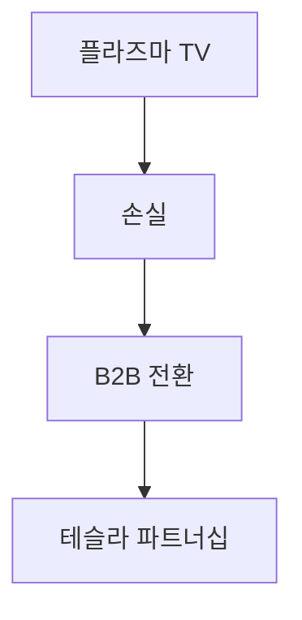

## 1. 마쓰시타 전기산업의 창업
1918년, 마쓰시타 고노스케가 개량형 어태치먼트 플러그(쌍구 소켓)를 고안하여 창업했습니다. "수도 철학"에 바탕을 두고 고품질 가전을 대중에게 저렴하게 제공하며 "가전의 왕"으로 군림했습니다.

## 2. 디지털화의 물결과 플라즈마 TV의 좌절
2000년대 평판 TV 경쟁에서 플라즈마 디스플레이에 거액을 투자했지만, 액정(LCD)과의 경쟁에서 패배하여 큰 전환을 요구받았습니다.

## 3. B2B 및 차량용 배터리로의 피벗
쓰가 가즈히로 사장의 지휘 아래 대규모 구조조정을 실시했습니다. 테슬라와 강력한 파트너십을 맺고 EV(전기자동차)용 원통형 리튬이온 배터리의 최고 제조업체로 부활을 이루었습니다.

## 4. 지속 가능한 미래로
현재는 가전뿐만 아니라 스마트 시티 개발 및 공급망의 DX화 등 사회 문제 해결형 B2B 기업으로서 새로운 역사를 걸어가고 있습니다.

## 추가 기술 검증 파트 1

## 추가 기술 검증 파트 2

## 추가 기술 검증 파트 3

## 추가 기술 검증 파트 4

## 추가 기술 검증 파트 5

## 추가 기술 검증 파트 6

## 추가 기술 검증 파트 7

## 추가 기술 검증 파트 8

## 추가 기술 검증 파트 9

## 추가 기술 검증 파트 10

## 추가 기술 검증 파트 11

## 추가 기술 검증 파트 12

## 추가 기술 검증 파트 13

## 추가 기술 검증 파트 14

