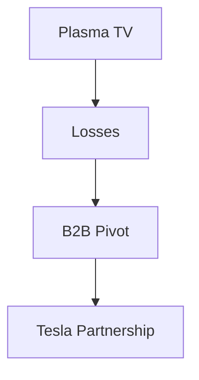

## 1. 松下電器産業の創業
1918年、松下幸之助が改良アタッチメントプラグ（二股ソケット）を考案し創業。「水道哲学」に基づき、高品質な家電を大衆に安く提供し、「家電の王様」として君臨しました。

## 2. デジタル化の波とプラズマTVの挫折
2000年代、薄型テレビ競争においてプラズマディスプレイに巨額投資を行いましたが、液晶（LCD）との競争に敗れ、大きな転換を迫られました。

## 3. B2Bと車載バッテリーへのピボット
津賀一宏社長の元で大規模な構造改革を実施。テスラとの強力なパートナーシップを結び、EV（電気自動車）向けの円筒形リチウムイオン電池のトップメーカーとして復活を遂げました。

## 4. 持続可能な未来へ
現在では、家電だけでなくスマートシティ開発やサプライチェーンのDX化など、社会課題解決型のB2B企業として新たな歴史を歩んでいます。

## 追加技術検証パート 1

### 1. 松下電器産業の創業
1918年、松下幸之助が改良アタッチメントプラグ（二股ソケット）を考案し創業。「水道哲学」に基づき、高品質な家電を大衆に安く提供し、「家電の王様」として君臨しました。

### 2. デジタル化の波とプラズマTVの挫折
2000年代、薄型テレビ競争においてプラズマディスプレイに巨額投資を行いましたが、液晶（LCD）との競争に敗れ、大きな転換を迫られました。

### 3. B2Bと車載バッテリーへのピボット
津賀一宏社長の元で大規模な構造改革を実施。テスラとの強力なパートナーシップを結び、EV（電気自動車）向けの円筒形リチウムイオン電池のトップメーカーとして復活を遂げました。

### 4. 持続可能な未来へ
現在では、家電だけでなくスマートシティ開発やサプライチェーンのDX化など、社会課題解決型のB2B企業として新たな歴史を歩んでいます。

## 追加技術検証パート 2

### 1. 松下電器産業の創業
1918年、松下幸之助が改良アタッチメントプラグ（二股ソケット）を考案し創業。「水道哲学」に基づき、高品質な家電を大衆に安く提供し、「家電の王様」として君臨しました。

### 2. デジタル化の波とプラズマTVの挫折
2000年代、薄型テレビ競争においてプラズマディスプレイに巨額投資を行いましたが、液晶（LCD）との競争に敗れ、大きな転換を迫られました。

### 3. B2Bと車載バッテリーへのピボット
津賀一宏社長の元で大規模な構造改革を実施。テスラとの強力なパートナーシップを結び、EV（電気自動車）向けの円筒形リチウムイオン電池のトップメーカーとして復活を遂げました。

### 4. 持続可能な未来へ
現在では、家電だけでなくスマートシティ開発やサプライチェーンのDX化など、社会課題解決型のB2B企業として新たな歴史を歩んでいます。

## 追加技術検証パート 3

### 1. 松下電器産業の創業
1918年、松下幸之助が改良アタッチメントプラグ（二股ソケット）を考案し創業。「水道哲学」に基づき、高品質な家電を大衆に安く提供し、「家電の王様」として君臨しました。

### 2. デジタル化の波とプラズマTVの挫折
2000年代、薄型テレビ競争においてプラズマディスプレイに巨額投資を行いましたが、液晶（LCD）との競争に敗れ、大きな転換を迫られました。

### 3. B2Bと車載バッテリーへのピボット
津賀一宏社長の元で大規模な構造改革を実施。テスラとの強力なパートナーシップを結び、EV（電気自動車）向けの円筒形リチウムイオン電池のトップメーカーとして復活を遂げました。

### 4. 持続可能な未来へ
現在では、家電だけでなくスマートシティ開発やサプライチェーンのDX化など、社会課題解決型のB2B企業として新たな歴史を歩んでいます。

## 追加技術検証パート 4

### 1. 松下電器産業の創業
1918年、松下幸之助が改良アタッチメントプラグ（二股ソケット）を考案し創業。「水道哲学」に基づき、高品質な家電を大衆に安く提供し、「家電の王様」として君臨しました。

### 2. デジタル化の波とプラズマTVの挫折
2000年代、薄型テレビ競争においてプラズマディスプレイに巨額投資を行いましたが、液晶（LCD）との競争に敗れ、大きな転換を迫られました。

### 3. B2Bと車載バッテリーへのピボット
津賀一宏社長の元で大規模な構造改革を実施。テスラとの強力なパートナーシップを結び、EV（電気自動車）向けの円筒形リチウムイオン電池のトップメーカーとして復活を遂げました。

### 4. 持続可能な未来へ
現在では、家電だけでなくスマートシティ開発やサプライチェーンのDX化など、社会課題解決型のB2B企業として新たな歴史を歩んでいます。

## 追加技術検証パート 5

### 1. 松下電器産業の創業
1918年、松下幸之助が改良アタッチメントプラグ（二股ソケット）を考案し創業。「水道哲学」に基づき、高品質な家電を大衆に安く提供し、「家電の王様」として君臨しました。

### 2. デジタル化の波とプラズマTVの挫折
2000年代、薄型テレビ競争においてプラズマディスプレイに巨額投資を行いましたが、液晶（LCD）との競争に敗れ、大きな転換を迫られました。

### 3. B2Bと車載バッテリーへのピボット
津賀一宏社長の元で大規模な構造改革を実施。テスラとの強力なパートナーシップを結び、EV（電気自動車）向けの円筒形リチウムイオン電池のトップメーカーとして復活を遂げました。

### 4. 持続可能な未来へ
現在では、家電だけでなくスマートシティ開発やサプライチェーンのDX化など、社会課題解決型のB2B企業として新たな歴史を歩んでいます。

## 追加技術検証パート 6

### 1. 松下電器産業の創業
1918年、松下幸之助が改良アタッチメントプラグ（二股ソケット）を考案し創業。「水道哲学」に基づき、高品質な家電を大衆に安く提供し、「家電の王様」として君臨しました。

### 2. デジタル化の波とプラズマTVの挫折
2000年代、薄型テレビ競争においてプラズマディスプレイに巨額投資を行いましたが、液晶（LCD）との競争に敗れ、大きな転換を迫られました。

### 3. B2Bと車載バッテリーへのピボット
津賀一宏社長の元で大規模な構造改革を実施。テスラとの強力なパートナーシップを結び、EV（電気自動車）向けの円筒形リチウムイオン電池のトップメーカーとして復活を遂げました。

### 4. 持続可能な未来へ
現在では、家電だけでなくスマートシティ開発やサプライチェーンのDX化など、社会課題解決型のB2B企業として新たな歴史を歩んでいます。

## 追加技術検証パート 7

### 1. 松下電器産業の創業
1918年、松下幸之助が改良アタッチメントプラグ（二股ソケット）を考案し創業。「水道哲学」に基づき、高品質な家電を大衆に安く提供し、「家電の王様」として君臨しました。

### 2. デジタル化の波とプラズマTVの挫折
2000年代、薄型テレビ競争においてプラズマディスプレイに巨額投資を行いましたが、液晶（LCD）との競争に敗れ、大きな転換を迫られました。

### 3. B2Bと車載バッテリーへのピボット
津賀一宏社長の元で大規模な構造改革を実施。テスラとの強力なパートナーシップを結び、EV（電気自動車）向けの円筒形リチウムイオン電池のトップメーカーとして復活を遂げました。

### 4. 持続可能な未来へ
現在では、家電だけでなくスマートシティ開発やサプライチェーンのDX化など、社会課題解決型のB2B企業として新たな歴史を歩んでいます。

## 追加技術検証パート 8

### 1. 松下電器産業の創業
1918年、松下幸之助が改良アタッチメントプラグ（二股ソケット）を考案し創業。「水道哲学」に基づき、高品質な家電を大衆に安く提供し、「家電の王様」として君臨しました。

### 2. デジタル化の波とプラズマTVの挫折
2000年代、薄型テレビ競争においてプラズマディスプレイに巨額投資を行いましたが、液晶（LCD）との競争に敗れ、大きな転換を迫られました。

### 3. B2Bと車載バッテリーへのピボット
津賀一宏社長の元で大規模な構造改革を実施。テスラとの強力なパートナーシップを結び、EV（電気自動車）向けの円筒形リチウムイオン電池のトップメーカーとして復活を遂げました。

### 4. 持続可能な未来へ
現在では、家電だけでなくスマートシティ開発やサプライチェーンのDX化など、社会課題解決型のB2B企業として新たな歴史を歩んでいます。

## 追加技術検証パート 9

### 1. 松下電器産業の創業
1918年、松下幸之助が改良アタッチメントプラグ（二股ソケット）を考案し創業。「水道哲学」に基づき、高品質な家電を大衆に安く提供し、「家電の王様」として君臨しました。

### 2. デジタル化の波とプラズマTVの挫折
2000年代、薄型テレビ競争においてプラズマディスプレイに巨額投資を行いましたが、液晶（LCD）との競争に敗れ、大きな転換を迫られました。

### 3. B2Bと車載バッテリーへのピボット
津賀一宏社長の元で大規模な構造改革を実施。テスラとの強力なパートナーシップを結び、EV（電気自動車）向けの円筒形リチウムイオン電池のトップメーカーとして復活を遂げました。

### 4. 持続可能な未来へ
現在では、家電だけでなくスマートシティ開発やサプライチェーンのDX化など、社会課題解決型のB2B企業として新たな歴史を歩んでいます。

## 追加技術検証パート 10

### 1. 松下電器産業の創業
1918年、松下幸之助が改良アタッチメントプラグ（二股ソケット）を考案し創業。「水道哲学」に基づき、高品質な家電を大衆に安く提供し、「家電の王様」として君臨しました。

### 2. デジタル化の波とプラズマTVの挫折
2000年代、薄型テレビ競争においてプラズマディスプレイに巨額投資を行いましたが、液晶（LCD）との競争に敗れ、大きな転換を迫られました。

### 3. B2Bと車載バッテリーへのピボット
津賀一宏社長の元で大規模な構造改革を実施。テスラとの強力なパートナーシップを結び、EV（電気自動車）向けの円筒形リチウムイオン電池のトップメーカーとして復活を遂げました。

### 4. 持続可能な未来へ
現在では、家電だけでなくスマートシティ開発やサプライチェーンのDX化など、社会課題解決型のB2B企業として新たな歴史を歩んでいます。

## 追加技術検証パート 11

### 1. 松下電器産業の創業
1918年、松下幸之助が改良アタッチメントプラグ（二股ソケット）を考案し創業。「水道哲学」に基づき、高品質な家電を大衆に安く提供し、「家電の王様」として君臨しました。

### 2. デジタル化の波とプラズマTVの挫折
2000年代、薄型テレビ競争においてプラズマディスプレイに巨額投資を行いましたが、液晶（LCD）との競争に敗れ、大きな転換を迫られました。

### 3. B2Bと車載バッテリーへのピボット
津賀一宏社長の元で大規模な構造改革を実施。テスラとの強力なパートナーシップを結び、EV（電気自動車）向けの円筒形リチウムイオン電池のトップメーカーとして復活を遂げました。

### 4. 持続可能な未来へ
現在では、家電だけでなくスマートシティ開発やサプライチェーンのDX化など、社会課題解決型のB2B企業として新たな歴史を歩んでいます。

## 追加技術検証パート 12

### 1. 松下電器産業の創業
1918年、松下幸之助が改良アタッチメントプラグ（二股ソケット）を考案し創業。「水道哲学」に基づき、高品質な家電を大衆に安く提供し、「家電の王様」として君臨しました。

### 2. デジタル化の波とプラズマTVの挫折
2000年代、薄型テレビ競争においてプラズマディスプレイに巨額投資を行いましたが、液晶（LCD）との競争に敗れ、大きな転換を迫られました。

### 3. B2Bと車載バッテリーへのピボット
津賀一宏社長の元で大規模な構造改革を実施。テスラとの強力なパートナーシップを結び、EV（電気自動車）向けの円筒形リチウムイオン電池のトップメーカーとして復活を遂げました。

### 4. 持続可能な未来へ
現在では、家電だけでなくスマートシティ開発やサプライチェーンのDX化など、社会課題解決型のB2B企業として新たな歴史を歩んでいます。

## 追加技術検証パート 13

### 1. 松下電器産業の創業
1918年、松下幸之助が改良アタッチメントプラグ（二股ソケット）を考案し創業。「水道哲学」に基づき、高品質な家電を大衆に安く提供し、「家電の王様」として君臨しました。

### 2. デジタル化の波とプラズマTVの挫折
2000年代、薄型テレビ競争においてプラズマディスプレイに巨額投資を行いましたが、液晶（LCD）との競争に敗れ、大きな転換を迫られました。

### 3. B2Bと車載バッテリーへのピボット
津賀一宏社長の元で大規模な構造改革を実施。テスラとの強力なパートナーシップを結び、EV（電気自動車）向けの円筒形リチウムイオン電池のトップメーカーとして復活を遂げました。

### 4. 持続可能な未来へ
現在では、家電だけでなくスマートシティ開発やサプライチェーンのDX化など、社会課題解決型のB2B企業として新たな歴史を歩んでいます。

## 追加技術検証パート 14

### 1. 松下電器産業の創業
1918年、松下幸之助が改良アタッチメントプラグ（二股ソケット）を考案し創業。「水道哲学」に基づき、高品質な家電を大衆に安く提供し、「家電の王様」として君臨しました。

### 2. デジタル化の波とプラズマTVの挫折
2000年代、薄型テレビ競争においてプラズマディスプレイに巨額投資を行いましたが、液晶（LCD）との競争に敗れ、大きな転換を迫られました。

### 3. B2Bと車載バッテリーへのピボット
津賀一宏社長の元で大規模な構造改革を実施。テスラとの強力なパートナーシップを結び、EV（電気自動車）向けの円筒形リチウムイオン電池のトップメーカーとして復活を遂げました。

### 4. 持続可能な未来へ
現在では、家電だけでなくスマートシティ開発やサプライチェーンのDX化など、社会課題解決型のB2B企業として新たな歴史を歩んでいます。
