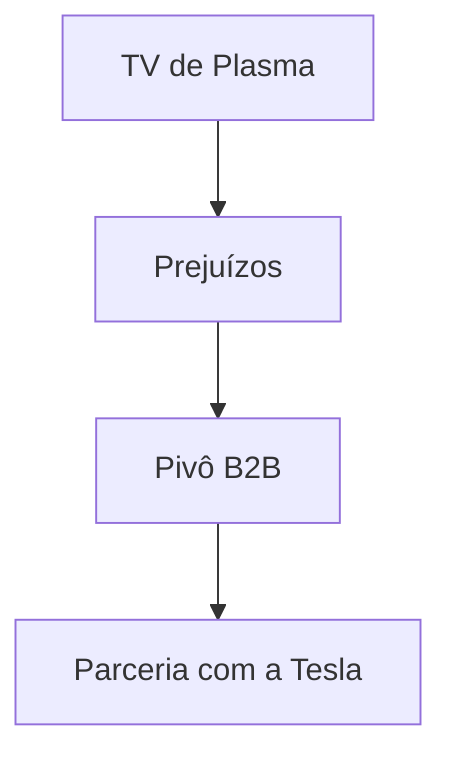

## 1. Fundação da Matsushita Electric Industrial
Em 1918, Konosuke Matsushita inventou o plugue de fixação aprimorado (soquete de duas vias) e fundou a empresa. Com base na "filosofia da água da torneira", forneceu eletrodomésticos de alta qualidade para as massas a preços baixos, reinando como o "Rei dos Eletrodomésticos".

## 2. A Onda da Digitalização e o Fracasso da TV de Plasma
Nos anos 2000, durante a corrida pelas TVs de tela plana, fez grandes investimentos em telas de plasma, mas perdeu a concorrência para o cristal líquido (LCD) e foi forçada a fazer uma grande mudança.

## 3. Pivô para B2B e Baterias Automotivas
Sob o comando do presidente Kazuhiro Tsuga, realizou uma reestruturação em larga escala. Formou uma forte parceria com a Tesla e ressurgiu como a principal fabricante de baterias cilíndricas de íons de lítio para veículos elétricos (EV).

## 4. Rumo a um Futuro Sustentável
Atualmente, não apenas com eletrodomésticos, mas também com o desenvolvimento de cidades inteligentes e a transformação digital (DX) das cadeias de suprimentos, trilha uma nova história como uma empresa B2B que resolve problemas sociais.

## Parte de Verificação Técnica Adicional 1

### 1. Fundação da Matsushita Electric Industrial
Em 1918, Konosuke Matsushita inventou o plugue de fixação aprimorado (soquete de duas vias) e fundou a empresa. Com base na "filosofia da água da torneira", forneceu eletrodomésticos de alta qualidade para as massas a preços baixos, reinando como o "Rei dos Eletrodomésticos".

### 2. A Onda da Digitalização e o Fracasso da TV de Plasma
Nos anos 2000, durante a corrida pelas TVs de tela plana, fez grandes investimentos em telas de plasma, mas perdeu a concorrência para o cristal líquido (LCD) e foi forçada a fazer uma grande mudança.

### 3. Pivô para B2B e Baterias Automotivas
Sob o comando do presidente Kazuhiro Tsuga, realizou uma reestruturação em larga escala. Formou uma forte parceria com a Tesla e ressurgiu como a principal fabricante de baterias cilíndricas de íons de lítio para veículos elétricos (EV).

### 4. Rumo a um Futuro Sustentável
Atualmente, não apenas com eletrodomésticos, mas também com o desenvolvimento de cidades inteligentes e a transformação digital (DX) das cadeias de suprimentos, trilha uma nova história como uma empresa B2B que resolve problemas sociais.

## Parte de Verificação Técnica Adicional 2

### 1. Fundação da Matsushita Electric Industrial
Em 1918, Konosuke Matsushita inventou o plugue de fixação aprimorado (soquete de duas vias) e fundou a empresa. Com base na "filosofia da água da torneira", forneceu eletrodomésticos de alta qualidade para as massas a preços baixos, reinando como o "Rei dos Eletrodomésticos".

### 2. A Onda da Digitalização e o Fracasso da TV de Plasma
Nos anos 2000, durante a corrida pelas TVs de tela plana, fez grandes investimentos em telas de plasma, mas perdeu a concorrência para o cristal líquido (LCD) e foi forçada a fazer uma grande mudança.

### 3. Pivô para B2B e Baterias Automotivas
Sob o comando do presidente Kazuhiro Tsuga, realizou uma reestruturação em larga escala. Formou uma forte parceria com a Tesla e ressurgiu como a principal fabricante de baterias cilíndricas de íons de lítio para veículos elétricos (EV).

### 4. Rumo a um Futuro Sustentável
Atualmente, não apenas com eletrodomésticos, mas também com o desenvolvimento de cidades inteligentes e a transformação digital (DX) das cadeias de suprimentos, trilha uma nova história como uma empresa B2B que resolve problemas sociais.

## Parte de Verificação Técnica Adicional 3

### 1. Fundação da Matsushita Electric Industrial
Em 1918, Konosuke Matsushita inventou o plugue de fixação aprimorado (soquete de duas vias) e fundou a empresa. Com base na "filosofia da água da torneira", forneceu eletrodomésticos de alta qualidade para as massas a preços baixos, reinando como o "Rei dos Eletrodomésticos".

### 2. A Onda da Digitalização e o Fracasso da TV de Plasma
Nos anos 2000, durante a corrida pelas TVs de tela plana, fez grandes investimentos em telas de plasma, mas perdeu a concorrência para o cristal líquido (LCD) e foi forçada a fazer uma grande mudança.

### 3. Pivô para B2B e Baterias Automotivas
Sob o comando do presidente Kazuhiro Tsuga, realizou uma reestruturação em larga escala. Formou uma forte parceria com a Tesla e ressurgiu como a principal fabricante de baterias cilíndricas de íons de lítio para veículos elétricos (EV).

### 4. Rumo a um Futuro Sustentável
Atualmente, não apenas com eletrodomésticos, mas também com o desenvolvimento de cidades inteligentes e a transformação digital (DX) das cadeias de suprimentos, trilha uma nova história como uma empresa B2B que resolve problemas sociais.

## Parte de Verificação Técnica Adicional 4

### 1. Fundação da Matsushita Electric Industrial
Em 1918, Konosuke Matsushita inventou o plugue de fixação aprimorado (soquete de duas vias) e fundou a empresa. Com base na "filosofia da água da torneira", forneceu eletrodomésticos de alta qualidade para as massas a preços baixos, reinando como o "Rei dos Eletrodomésticos".

### 2. A Onda da Digitalização e o Fracasso da TV de Plasma
Nos anos 2000, durante a corrida pelas TVs de tela plana, fez grandes investimentos em telas de plasma, mas perdeu a concorrência para o cristal líquido (LCD) e foi forçada a fazer uma grande mudança.

### 3. Pivô para B2B e Baterias Automotivas
Sob o comando do presidente Kazuhiro Tsuga, realizou uma reestruturação em larga escala. Formou uma forte parceria com a Tesla e ressurgiu como a principal fabricante de baterias cilíndricas de íons de lítio para veículos elétricos (EV).

### 4. Rumo a um Futuro Sustentável
Atualmente, não apenas com eletrodomésticos, mas também com o desenvolvimento de cidades inteligentes e a transformação digital (DX) das cadeias de suprimentos, trilha uma nova história como uma empresa B2B que resolve problemas sociais.

## Parte de Verificação Técnica Adicional 5

### 1. Fundação da Matsushita Electric Industrial
Em 1918, Konosuke Matsushita inventou o plugue de fixação aprimorado (soquete de duas vias) e fundou a empresa. Com base na "filosofia da água da torneira", forneceu eletrodomésticos de alta qualidade para as massas a preços baixos, reinando como o "Rei dos Eletrodomésticos".

### 2. A Onda da Digitalização e o Fracasso da TV de Plasma
Nos anos 2000, durante a corrida pelas TVs de tela plana, fez grandes investimentos em telas de plasma, mas perdeu a concorrência para o cristal líquido (LCD) e foi forçada a fazer uma grande mudança.

### 3. Pivô para B2B e Baterias Automotivas
Sob o comando do presidente Kazuhiro Tsuga, realizou uma reestruturação em larga escala. Formou uma forte parceria com a Tesla e ressurgiu como a principal fabricante de baterias cilíndricas de íons de lítio para veículos elétricos (EV).

### 4. Rumo a um Futuro Sustentável
Atualmente, não apenas com eletrodomésticos, mas também com o desenvolvimento de cidades inteligentes e a transformação digital (DX) das cadeias de suprimentos, trilha uma nova história como uma empresa B2B que resolve problemas sociais.

## Parte de Verificação Técnica Adicional 6

### 1. Fundação da Matsushita Electric Industrial
Em 1918, Konosuke Matsushita inventou o plugue de fixação aprimorado (soquete de duas vias) e fundou a empresa. Com base na "filosofia da água da torneira", forneceu eletrodomésticos de alta qualidade para as massas a preços baixos, reinando como o "Rei dos Eletrodomésticos".

### 2. A Onda da Digitalização e o Fracasso da TV de Plasma
Nos anos 2000, durante a corrida pelas TVs de tela plana, fez grandes investimentos em telas de plasma, mas perdeu a concorrência para o cristal líquido (LCD) e foi forçada a fazer uma grande mudança.

### 3. Pivô para B2B e Baterias Automotivas
Sob o comando do presidente Kazuhiro Tsuga, realizou uma reestruturação em larga escala. Formou uma forte parceria com a Tesla e ressurgiu como a principal fabricante de baterias cilíndricas de íons de lítio para veículos elétricos (EV).

### 4. Rumo a um Futuro Sustentável
Atualmente, não apenas com eletrodomésticos, mas também com o desenvolvimento de cidades inteligentes e a transformação digital (DX) das cadeias de suprimentos, trilha uma nova história como uma empresa B2B que resolve problemas sociais.

## Parte de Verificação Técnica Adicional 7

### 1. Fundação da Matsushita Electric Industrial
Em 1918, Konosuke Matsushita inventou o plugue de fixação aprimorado (soquete de duas vias) e fundou a empresa. Com base na "filosofia da água da torneira", forneceu eletrodomésticos de alta qualidade para as massas a preços baixos, reinando como o "Rei dos Eletrodomésticos".

### 2. A Onda da Digitalização e o Fracasso da TV de Plasma
Nos anos 2000, durante a corrida pelas TVs de tela plana, fez grandes investimentos em telas de plasma, mas perdeu a concorrência para o cristal líquido (LCD) e foi forçada a fazer uma grande mudança.

### 3. Pivô para B2B e Baterias Automotivas
Sob o comando do presidente Kazuhiro Tsuga, realizou uma reestruturação em larga escala. Formou uma forte parceria com a Tesla e ressurgiu como a principal fabricante de baterias cilíndricas de íons de lítio para veículos elétricos (EV).

### 4. Rumo a um Futuro Sustentável
Atualmente, não apenas com eletrodomésticos, mas também com o desenvolvimento de cidades inteligentes e a transformação digital (DX) das cadeias de suprimentos, trilha uma nova história como uma empresa B2B que resolve problemas sociais.

## Parte de Verificação Técnica Adicional 8

### 1. Fundação da Matsushita Electric Industrial
Em 1918, Konosuke Matsushita inventou o plugue de fixação aprimorado (soquete de duas vias) e fundou a empresa. Com base na "filosofia da água da torneira", forneceu eletrodomésticos de alta qualidade para as massas a preços baixos, reinando como o "Rei dos Eletrodomésticos".

### 2. A Onda da Digitalização e o Fracasso da TV de Plasma
Nos anos 2000, durante a corrida pelas TVs de tela plana, fez grandes investimentos em telas de plasma, mas perdeu a concorrência para o cristal líquido (LCD) e foi forçada a fazer uma grande mudança.

### 3. Pivô para B2B e Baterias Automotivas
Sob o comando do presidente Kazuhiro Tsuga, realizou uma reestruturação em larga escala. Formou uma forte parceria com a Tesla e ressurgiu como a principal fabricante de baterias cilíndricas de íons de lítio para veículos elétricos (EV).

### 4. Rumo a um Futuro Sustentável
Atualmente, não apenas com eletrodomésticos, mas também com o desenvolvimento de cidades inteligentes e a transformação digital (DX) das cadeias de suprimentos, trilha uma nova história como uma empresa B2B que resolve problemas sociais.

## Parte de Verificação Técnica Adicional 9

### 1. Fundação da Matsushita Electric Industrial
Em 1918, Konosuke Matsushita inventou o plugue de fixação aprimorado (soquete de duas vias) e fundou a empresa. Com base na "filosofia da água da torneira", forneceu eletrodomésticos de alta qualidade para as massas a preços baixos, reinando como o "Rei dos Eletrodomésticos".

### 2. A Onda da Digitalização e o Fracasso da TV de Plasma
Nos anos 2000, durante a corrida pelas TVs de tela plana, fez grandes investimentos em telas de plasma, mas perdeu a concorrência para o cristal líquido (LCD) e foi forçada a fazer uma grande mudança.

### 3. Pivô para B2B e Baterias Automotivas
Sob o comando do presidente Kazuhiro Tsuga, realizou uma reestruturação em larga escala. Formou uma forte parceria com a Tesla e ressurgiu como a principal fabricante de baterias cilíndricas de íons de lítio para veículos elétricos (EV).

### 4. Rumo a um Futuro Sustentável
Atualmente, não apenas com eletrodomésticos, mas também com o desenvolvimento de cidades inteligentes e a transformação digital (DX) das cadeias de suprimentos, trilha uma nova história como uma empresa B2B que resolve problemas sociais.

## Parte de Verificação Técnica Adicional 10

### 1. Fundação da Matsushita Electric Industrial
Em 1918, Konosuke Matsushita inventou o plugue de fixação aprimorado (soquete de duas vias) e fundou a empresa. Com base na "filosofia da água da torneira", forneceu eletrodomésticos de alta qualidade para as massas a preços baixos, reinando como o "Rei dos Eletrodomésticos".

### 2. A Onda da Digitalização e o Fracasso da TV de Plasma
Nos anos 2000, durante a corrida pelas TVs de tela plana, fez grandes investimentos em telas de plasma, mas perdeu a concorrência para o cristal líquido (LCD) e foi forçada a fazer uma grande mudança.

### 3. Pivô para B2B e Baterias Automotivas
Sob o comando do presidente Kazuhiro Tsuga, realizou uma reestruturação em larga escala. Formou uma forte parceria com a Tesla e ressurgiu como a principal fabricante de baterias cilíndricas de íons de lítio para veículos elétricos (EV).

### 4. Rumo a um Futuro Sustentável
Atualmente, não apenas com eletrodomésticos, mas também com o desenvolvimento de cidades inteligentes e a transformação digital (DX) das cadeias de suprimentos, trilha uma nova história como uma empresa B2B que resolve problemas sociais.

## Parte de Verificação Técnica Adicional 11

### 1. Fundação da Matsushita Electric Industrial
Em 1918, Konosuke Matsushita inventou o plugue de fixação aprimorado (soquete de duas vias) e fundou a empresa. Com base na "filosofia da água da torneira", forneceu eletrodomésticos de alta qualidade para as massas a preços baixos, reinando como o "Rei dos Eletrodomésticos".

### 2. A Onda da Digitalização e o Fracasso da TV de Plasma
Nos anos 2000, durante a corrida pelas TVs de tela plana, fez grandes investimentos em telas de plasma, mas perdeu a concorrência para o cristal líquido (LCD) e foi forçada a fazer uma grande mudança.

### 3. Pivô para B2B e Baterias Automotivas
Sob o comando do presidente Kazuhiro Tsuga, realizou uma reestruturação em larga escala. Formou uma forte parceria com a Tesla e ressurgiu como a principal fabricante de baterias cilíndricas de íons de lítio para veículos elétricos (EV).

### 4. Rumo a um Futuro Sustentável
Atualmente, não apenas com eletrodomésticos, mas também com o desenvolvimento de cidades inteligentes e a transformação digital (DX) das cadeias de suprimentos, trilha uma nova história como uma empresa B2B que resolve problemas sociais.

## Parte de Verificação Técnica Adicional 12

### 1. Fundação da Matsushita Electric Industrial
Em 1918, Konosuke Matsushita inventou o plugue de fixação aprimorado (soquete de duas vias) e fundou a empresa. Com base na "filosofia da água da torneira", forneceu eletrodomésticos de alta qualidade para as massas a preços baixos, reinando como o "Rei dos Eletrodomésticos".

### 2. A Onda da Digitalização e o Fracasso da TV de Plasma
Nos anos 2000, durante a corrida pelas TVs de tela plana, fez grandes investimentos em telas de plasma, mas perdeu a concorrência para o cristal líquido (LCD) e foi forçada a fazer uma grande mudança.

### 3. Pivô para B2B e Baterias Automotivas
Sob o comando do presidente Kazuhiro Tsuga, realizou uma reestruturação em larga escala. Formou uma forte parceria com a Tesla e ressurgiu como a principal fabricante de baterias cilíndricas de íons de lítio para veículos elétricos (EV).

### 4. Rumo a um Futuro Sustentável
Atualmente, não apenas com eletrodomésticos, mas também com o desenvolvimento de cidades inteligentes e a transformação digital (DX) das cadeias de suprimentos, trilha uma nova história como uma empresa B2B que resolve problemas sociais.

## Parte de Verificação Técnica Adicional 13

### 1. Fundação da Matsushita Electric Industrial
Em 1918, Konosuke Matsushita inventou o plugue de fixação aprimorado (soquete de duas vias) e fundou a empresa. Com base na "filosofia da água da torneira", forneceu eletrodomésticos de alta qualidade para as massas a preços baixos, reinando como o "Rei dos Eletrodomésticos".

### 2. A Onda da Digitalização e o Fracasso da TV de Plasma
Nos anos 2000, durante a corrida pelas TVs de tela plana, fez grandes investimentos em telas de plasma, mas perdeu a concorrência para o cristal líquido (LCD) e foi forçada a fazer uma grande mudança.

### 3. Pivô para B2B e Baterias Automotivas
Sob o comando do presidente Kazuhiro Tsuga, realizou uma reestruturação em larga escala. Formou uma forte parceria com a Tesla e ressurgiu como a principal fabricante de baterias cilíndricas de íons de lítio para veículos elétricos (EV).

### 4. Rumo a um Futuro Sustentável
Atualmente, não apenas com eletrodomésticos, mas também com o desenvolvimento de cidades inteligentes e a transformação digital (DX) das cadeias de suprimentos, trilha uma nova história como uma empresa B2B que resolve problemas sociais.

## Parte de Verificação Técnica Adicional 14

### 1. Fundação da Matsushita Electric Industrial
Em 1918, Konosuke Matsushita inventou o plugue de fixação aprimorado (soquete de duas vias) e fundou a empresa. Com base na "filosofia da água da torneira", forneceu eletrodomésticos de alta qualidade para as massas a preços baixos, reinando como o "Rei dos Eletrodomésticos".

### 2. A Onda da Digitalização e o Fracasso da TV de Plasma
Nos anos 2000, durante a corrida pelas TVs de tela plana, fez grandes investimentos em telas de plasma, mas perdeu a concorrência para o cristal líquido (LCD) e foi forçada a fazer uma grande mudança.

### 3. Pivô para B2B e Baterias Automotivas
Sob o comando do presidente Kazuhiro Tsuga, realizou uma reestruturação em larga escala. Formou uma forte parceria com a Tesla e ressurgiu como a principal fabricante de baterias cilíndricas de íons de lítio para veículos elétricos (EV).

### 4. Rumo a um Futuro Sustentável
Atualmente, não apenas com eletrodomésticos, mas também com o desenvolvimento de cidades inteligentes e a transformação digital (DX) das cadeias de suprimentos, trilha uma nova história como uma empresa B2B que resolve problemas sociais.
