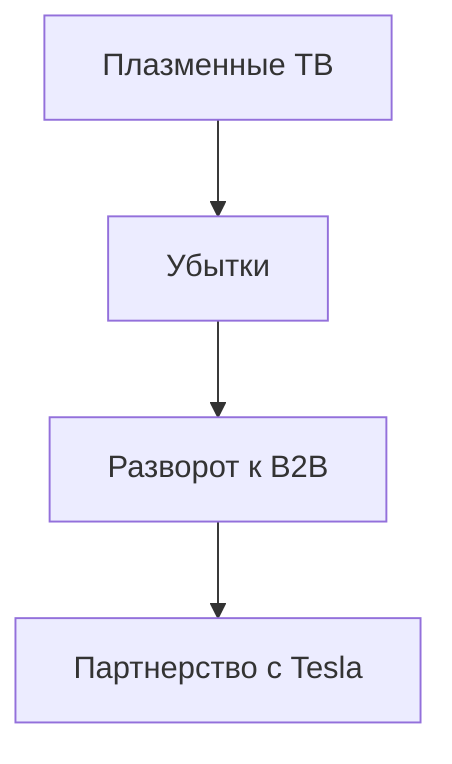

## 1. Основание Matsushita Electric Industrial
В 1918 году Коносукэ Мацусита изобрел улучшенный штепсель (двойную розетку) и основал компанию. Основываясь на «философии водопроводной воды», он поставлял в массы высококачественную бытовую технику по низким ценам, властвуя как «король бытовой техники».

## 2. Волна цифровизации и крах плазменных телевизоров
В 2000-х годах компания вложила огромные средства в плазменные дисплеи в гонке плоскопанельных телевизоров, но проиграла конкуренцию жидкокристаллическим (LCD) дисплеям, что потребовало серьезных преобразований.

## 3. Разворот к B2B и автомобильным аккумуляторам
Под руководством президента Кадзухиро Цуга была проведена масштабная структурная реформа. Заключив прочное партнерство с Tesla, компания возродилась как ведущий производитель цилиндрических литий-ионных аккумуляторов для EV (электромобилей).

## 4. К устойчивому будущему
В настоящее время компания идет по новому историческому пути как B2B-предприятие, решающее социальные проблемы, занимаясь не только бытовой техникой, но и развитием умных городов, а также цифровой трансформацией (DX) цепочек поставок.

## Дополнительная техническая проверка, часть 1

## Дополнительная техническая проверка, часть 2

## Дополнительная техническая проверка, часть 3

## Дополнительная техническая проверка, часть 4

## Дополнительная техническая проверка, часть 5

## Дополнительная техническая проверка, часть 6

## Дополнительная техническая проверка, часть 7

## Дополнительная техническая проверка, часть 8

## Дополнительная техническая проверка, часть 9

## Дополнительная техническая проверка, часть 10

## Дополнительная техническая проверка, часть 11

## Дополнительная техническая проверка, часть 12

## Дополнительная техническая проверка, часть 13

## Дополнительная техническая проверка, часть 14

