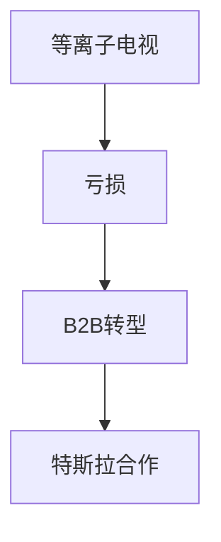

## 1. 松下电器产业的创立
1918年，松下幸之助发明了改良版插头（双向插座）并创立了公司。基于“自来水哲学”，向大众以低价提供高质量的家电产品，从而作为“家电之王”君临天下。

## 2. 数字化浪潮与等离子电视的挫折
在2000年代，尽管在平板电视竞争中对等离子显示器进行了巨额投资，但在与液晶（LCD）的竞争中败北，被迫面临重大转型。

## 3. 向B2B和车载电池业务的转型
在津贺一宏总裁的领导下实施了大规模的结构性改革。通过与特斯拉建立强大的合作伙伴关系，成功复苏并成为面向EV（电动汽车）的圆柱形锂离子电池的顶级制造商。

## 4. 走向可持续发展的未来
现在，不仅在家电领域，在智慧城市开发和供应链的数字化转型（DX）等方面，作为解决社会课题型的B2B企业，正在迈向新的历史阶段。

## 附加技术验证部分 1

## 附加技术验证部分 2

## 附加技术验证部分 3

## 附加技术验证部分 4

## 附加技术验证部分 5

## 附加技术验证部分 6

## 附加技术验证部分 7

## 附加技术验证部分 8

## 附加技术验证部分 9

## 附加技术验证部分 10

## 附加技术验证部分 11

## 附加技术验证部分 12

## 附加技术验证部分 13

## 附加技术验证部分 14

