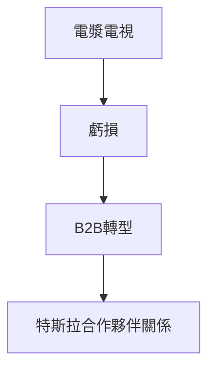

## 1. 松下電器產業的創立
1918年，松下幸之助發明了改良的附屬插頭（雙燈泡插座）並創立公司。基於「自來水哲學」，向大眾提供低價且高品質的家電，並以「家電之王」的姿態君臨天下。

## 2. 數位化浪潮與電漿電視的挫敗
2000年代，在薄型電視競爭中，對電漿顯示器進行了鉅額投資，但在與液晶（LCD）的競爭中落敗，面臨了重大的轉型。

## 3. 向B2B與車用電池的轉型
在津賀一宏社長的帶領下實施了大規模的結構改革。與特斯拉結成強力的合作夥伴關係，作為EV（電動車）用的圓柱型鋰離子電池頂尖製造商成功復活。

## 4. 邁向永續發展的未來
現在，不僅是家電，還包括智慧城市開發與供應鏈的DX（數位轉型）等，作為解決社會課題型的B2B企業，正在邁向嶄新的歷史。

## 追加技術驗證部分 1

## 追加技術驗證部分 2

## 追加技術驗證部分 3

## 追加技術驗證部分 4

## 追加技術驗證部分 5

## 追加技術驗證部分 6

## 追加技術驗證部分 7

## 追加技術驗證部分 8

## 追加技術驗證部分 9

## 追加技術驗證部分 10

## 追加技術驗證部分 11

## 追加技術驗證部分 12

## 追加技術驗證部分 13

## 追加技術驗證部分 14

