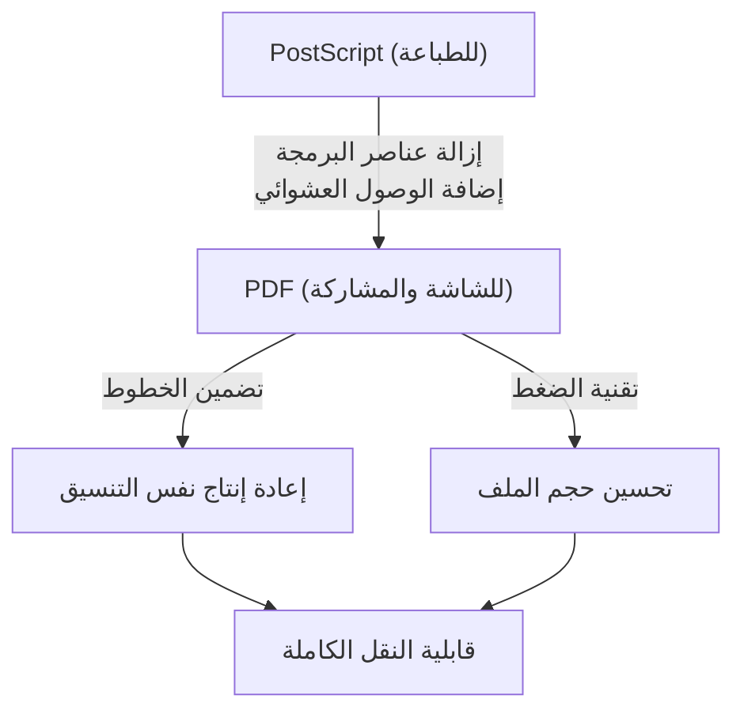

## مقدمة: الحاجة إلى "الورق" في العالم الرقمي

في الأعمال اليومية والحياة اليومية الحديثة، لا يمر يوم دون أن نرى فيه ملف PDF (تنسيق المستندات المحمولة - Portable Document Format). من العقود والأدلة والفواتير والأوراق الأكاديمية إلى قوائم المطاعم، تتم مشاركة جميع أنواع المستندات بصيغة PDF. ومع ذلك، في فجر عصر الحوسبة، كان إنشاء "مستند يبدو متطابقاً على أي جهاز" مجرد حلم.

كانت بيئة الحوسبة في الثمانينيات أكثر تجزئة مما هي عليه اليوم. انتشرت أنظمة تشغيل مختلفة مثل Windows و Macintosh ومحطات عمل UNIX و MS-DOS، ولكل منها تنسيقات الخطوط الخاصة بها، ومحركات العرض، وتنسيقات الملفات. كان من الشائع جداً أن يقوم الشخص (أ) بإنشاء مستند بتنسيق جميل على جهاز Mac، وعندما يقوم الشخص (ب) بفتحه على نظام Windows، يتم استبدال الخطوط، ويتحطم التنسيق، ولا تظهر الصور.

كان مؤسسو شركة أدوبي سيستمز (Adobe Systems - الآن Adobe) هم من حاولوا حل هذه المشكلة وإنشاء "الورق في العالم الرقمي". في هذه المقالة، سنتعمق في تاريخ وخلفية التقنيات لكيفية ظهور ملفات PDF، وكيف تغلبت على العقبات التقنية، وتطورت إلى التنسيق القياسي العالمي للمستندات ذات الصلاحية القانونية.

## ثورة PostScript وفجر النشر المكتبي (DTP)

عند الحديث عن تاريخ PDF، لا يمكننا تجنب ذكر لغة وصف الصفحة "PostScript".

في عام 1982، كان جون وارنوك وتشارلز جيشكي، اللذان كانا يعملان في مركز أبحاث بالو ألتو (PARC) التابع لشركة زيروكس، يطوران لغة برمجة للطباعة عالية الجودة بغض النظر عن الجهاز. ومع ذلك، نظراً لعدم وجود احتمال فوري لتحويل هذه التقنية إلى منتج تجاري داخل زيروكس، استقلا وأسسا شركة Adobe Systems. وما أكاموه كان PostScript.

### مفهوم استقلالية الجهاز

في ذلك الوقت، كانت الطابعات تتلقى بيانات نصية ورموز تحكم بسيطة من الكمبيوتر، وتطبع خطوطاً نقطية مدمجة كأجهزة داخل الطابعة على الورق. لذلك، إذا تغير طراز الطابعة، تغيرت نتيجة الطباعة، وكان من الصعب طباعة أشكال معقدة أو منحنيات ناعمة.

اتخذ PostScript نهجاً مختلفاً تماماً. فقد وصف المظهر المرئي للمستند على أنه "بيانات متجهية رياضية" (Mathematical Vector Data). يتم إرسال عناصر مثل النصوص والخطوط المستقيمة والمنحنيات والصور إلى الطابعة كمجموعة من الصيغ الرياضية والأوامر. تحتوي الطابعة على جهاز كمبيوتر صغير مدمج يسمى "مفسر PostScript" (PostScript Interpreter)، والذي يفسر (يحول إلى نقطية - Rasterize) البرنامج المستلم على الفور ويطبعه بأعلى دقة يمتلكها.

ونتيجة لذلك، حتى المستندات التي تم إنشاؤها بدقة خشنة على الشاشة يتم إخراجها بشكل جميل للغاية على طابعات الليزر عالية الدقة وآلات الطباعة التجارية. في عام 1985، تم تضمين PostScript في طابعة "LaserWriter" من Apple، وأدى الجمع بين "Macintosh" و "PageMaker" و "LaserWriter" إلى إنشاء صناعة جديدة تسمى النشر المكتبي (Desktop Publishing - DTP).

## مشروع كاميلوت (Camelot Project): نفس التجربة على الشاشة

أحدث PostScript ثورة في صناعة الطباعة، ولكن كان لديه نقطة ضعف واحدة. وهي أنه "نظراً لكونه لغة برمجة معقدة للغاية، فإنه ثقيل جداً بحيث لا يمكن عرضه بسرعة على الشاشة". يمكن أن تتضمن ملفات PostScript حلقات تكرارية (Loops) وتفرعات شرطية، ولا يمكن معرفة كيف ستبدو الصفحة النهائية حتى تكتمل الحسابات.

في أوائل التسعينيات، ومع اقتراب انتشار الإنترنت، كتب جون وارنوك ورقة بحثية قصيرة للاستخدام الداخلي بعنوان "The Camelot Project" (مشروع كاميلوت).

> "هدفنا هو أنه من أي منصة ومن أي مستند، يمكننا التقاطه بتنسيق رقمي، ونقله إلى أي كمبيوتر، وعرضه على أي شاشة، وطباعته على أي طابعة."

ما تصوره وارنوك كان تنسيق مستند يمكن مشاركته مع الحفاظ التام على المظهر الذي قصده المنشئ، دون أن يتأثر على الإطلاق باختلافات أنظمة التشغيل والتطبيقات، وحتى الخطوط المثبتة محلياً.

### ولادة PDF

ولد PDF من مشروع Camelot. استناداً إلى تقنية PostScript، تخلص PDF من عناصر لغة البرمجة (مثل الحلقات التكرارية وحالات المتغيرات) من أجل تحقيق عرض سريع على الشاشة والوصول العشوائي (القدرة على الانتقال فوراً إلى أي صفحة).

بدلاً من ذلك، تم تنظيم PDF كمجموعة من كائنات الرسم المستقلة لكل صفحة. وبفضل هذا، حتى في مستند مكون من 1000 صفحة، لا يحتاج النظام إلى الحساب من الصفحة الأولى بالترتيب، بل أصبح من الممكن عرض الصفحة 500 على الفور.

في عام 1993، أصدرت Adobe برنامج "Acrobat" لإنشاء ملفات PDF وعرضها. في البداية، كان برنامج العرض "Acrobat Reader" مدفوعاً أيضاً (50 دولاراً)، مما أدى إلى تأخير انتشاره. ومع ذلك، سرعان ما اتخذت Adobe قراراً استراتيجياً بتوزيع Reader مجاناً. وقد أتى هذا القرار بثماره، وبدأ PDF في الانتشار بشكل هائل.

## الهيكل الأساسي لـ PDF والاختراقات التقنية

لكي يعمل PDF كـ "ورق إلكتروني"، كانت هناك حاجة إلى العديد من الاختراقات التقنية الهامة.

### 1. تضمين الخطوط (Font Embedding)

واحدة من أهم التقنيات هي "تضمين الخطوط". في ملفات برامج معالجة النصوص التقليدية (على سبيل المثال، مستندات Word المبكرة)، يتم حفظ "رمز الحرف" و "اسم الخط (مثال: MS Gothic)" فقط في بيانات المستند. إذا لم يكن الخط مثبتاً على كمبيوتر القارئ، يقوم نظام التشغيل باستبداله بخط آخر، مما يؤدي إلى تغيير عرض الأحرف، وانحراف مواضع فواصل الأسطر، وانهيار التنسيق.

يحتوي PDF على ميزة تجميع بيانات شكل الخط (المخطط التفصيلي - Outline) نفسه المستخدم داخل الملف. بفضل هذا، حتى لو لم يكن الخط موجوداً على الإطلاق على جهاز القارئ، يمكن عرض أحرف جميلة مطابقة تماماً لوقت الإنشاء. بالإضافة إلى ذلك، للحفاظ على حجم الملف صغيراً، تم تطوير تقنية "التضمين الفرعي" (Subset Embedding) التي تستخرج وتضمن فقط بيانات الأحرف المستخدمة فعلياً في المستند.

### 2. دمج الرسومات المتجهة (Vector Graphics) والصور النقطية (Raster Images)

يحتوي PDF على محرك قوي لرسم الرسومات المتجهة موروث من PostScript. نظراً لأنه يحتفظ بشعارات الشركات والرسوم البيانية وما إلى ذلك كبيانات متجهة، فإن الحواف لا تتشوه (تتكسر - Jaggy) بغض النظر عن مدى تكبيرها. في الوقت نفسه، يمكنه أيضاً تضمين الصور النقطية (بيانات البكسل المضغوطة بتنسيق JPEG أو ZIP) مثل الصور الفوتوغرافية بمرونة.

### 3. البنية الداخلية للملف (الشجرة والمراجع التبادلية)

إذا نظرت إلى محتويات ملف PDF باستخدام محرر نصوص، فإنه يبدأ بترويسة مثل `%PDF-1.4`، وتصطف العديد من "الكائنات (القواميس، المصفوفات، التدفقات، إلخ)".
تكمن قوة PDF في أنه يحتوي على "جدول المراجع التبادلية" (Cross-Reference Table) في نهاية الملف. يسجل هذا الجدول مواضع إزاحة البايت (Byte Offset) لجميع الكائنات داخل الملف.

عندما يفتح قارئ PDF ملفاً، فإنه يقرأ أولاً من النهاية ويحصل على جدول المراجع التبادلية. لذلك، عند الحاجة إلى بيانات صفحة معينة، يمكنه الرجوع إلى الجدول وقراءة البيانات الضرورية بدقة من القرص دون تحليل الملف بأكمله. هذا هو السبب في أن ملفات PDF الضخمة تعمل بسرعة عالية.

## التطور كمستند رقمي: التوقيعات الإلكترونية والأمان

لم يقتصر تطور PDF على مجرد "عرض المواد المطبوعة على الشاشة"، بل تطور ليعمل كـ "أصل" (Original) في بيئة الأعمال.

### التوقيعات الإلكترونية (Digital Signatures) وتشفير المفتاح العام

عند رقمنة العقود والمستندات الرسمية، فإن أكبر المخاوف هي "إثبات عدم العبث" و "إثبات أن الشخص المعني هو من قام بإنشائها". قام PDF بدمج مواصفات التوقيع الإلكتروني باستخدام البنية التحتية للمفتاح العام (PKI) على مستوى التنسيق.

من خلال حساب قيمة التجزئة (Hash Value) للمستند، وتشفيرها باستخدام المفتاح الخاص للموقع، وتضمينها في ملف PDF، فإنه يوفر آلية يصبح فيها التوقيع غير صالح إذا تم تغيير المحتوى ولو ببايت واحد لاحقاً. ونتيجة لذلك، أصبح لـ PDF صلاحية أدلة قانونية مكافئة لختم الورق أو حتى أفضل منه.

### الأمان والتحكم في الوصول

كما يطبق PDF ميزات تشفير قوية (مثل AES-256). يمكن إضافة إعدادات أذونات دقيقة (كلمة مرور الأذونات - Permission Password) إلى الملف نفسه، مثل حظر الطباعة، وحظر نسخ النص، وحظر استخراج الصفحات، بالإضافة إلى "كلمة مرور الفتح" (Open Password) لفتح المستند.

## الطريق إلى المعيار العالمي (ISO 32000)

لسنوات عديدة، كان PDF تنسيقاً احتكارياً (Proprietary) لشركة Adobe Systems. ومع ذلك، نشرت Adobe مواصفاته مجاناً، مما سمح لأي شخص بتطوير برامج إنشاء وعرض ملفات PDF. أدى هذا إلى إنشاء نظام بيئي ضخم من أطراف ثالثة.

وفي عام 2008، تخلت Adobe عن السيطرة الكاملة على PDF ونقلته إلى المنظمة الدولية للتوحيد القياسي (ISO). وبذلك، أصبح PDF معياراً دولياً رسمياً تحت اسم "ISO 32000-1". ونظراً لأنه أصبح تنسيقاً مفتوحاً لا يعتمد على شركة معينة، فقد رسخ مكانته كتنسيق للحفظ في الأرشيف للمستندات الرسمية الحكومية في مختلف البلدان.

علاوة على ذلك، تم إنشاء معايير مشتقة لتناسب الاستخدامات المختلفة:
- **PDF/A (Archive):** للحفظ طويل الأمد. يحظر الخطوط الخارجية والتشفير، ويضمن إمكانية فتحه بشكل موثوق حتى بعد عقود.
- **PDF/X (Exchange):** لصناعة الطباعة. يحدد بدقة ملف تعريف الألوان (CMYK) ويمنع مشاكل الطباعة.
- **PDF/UA (Universal Accessibility):** يحدد البنية المنطقية (العلامات - Tags) للمستند بحيث يمكن لقارئات الشاشة للمكفوفين قراءتها بشكل صحيح.

## خاتمة

إن الرؤية التي حلم بها جون وارنوك في "مشروع كاميلوت" المتمثلة في القدرة على "مشاركة المستندات المقصودة مع أي شخص، في أي مكان في العالم، وعلى أي جهاز" قد أصبحت حقيقة واقعة تماماً في المجتمع الحديث.

إن PDF ليس مجرد "ورقة محولة إلى صورة". إنه "ورق رقمي" مصمم بشكل متطور للغاية، حيث يتيح البحث في النصوص، ويحتفظ بجماليات المتجهات، وهو محمي بتقنيات التشفير، ويحتوي على بنية منطقية. يمكن القول إن تاريخ PDF، الذي بدأ من لغة البرمجة PostScript، وتخلص من التعقيد ليكتسب قابلية النقل، ووصل أخيراً إلى معيار دولي يحفظ المعرفة البشرية، هو أحد أعظم قصص النجاح في تاريخ برمجيات الكمبيوتر.
