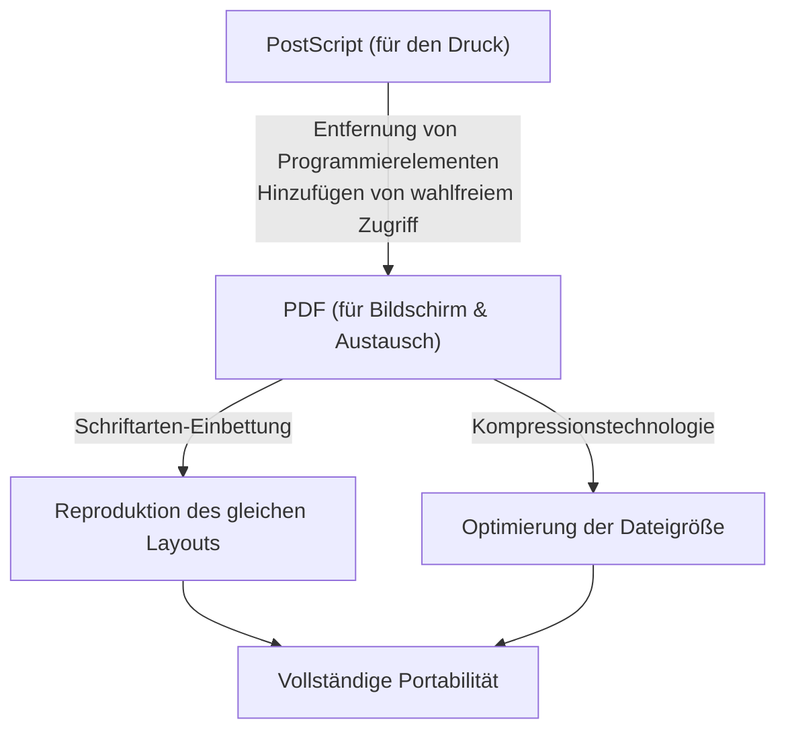

## Einleitung: Das Bedürfnis nach "Papier" in der digitalen Welt

In der heutigen Geschäfts- und Alltagswelt vergeht kein Tag, an dem man nicht mit PDF (Portable Document Format) in Berührung kommt. Verträge, Handbücher, Rechnungen, wissenschaftliche Arbeiten und sogar Restaurantmenüs – alle Arten von Dokumenten werden als PDF geteilt. In den Anfängen des Computers war es jedoch ein Traum, Dokumente zu erstellen, "die auf jedem Gerät gleich aussehen".

Die Computerumgebung in den 1980er Jahren war viel stärker fragmentiert als heute. Verschiedene Betriebssysteme wie Windows, Macintosh, UNIX-Workstations und MS-DOS existierten nebeneinander, und jedes hatte sein eigenes Schriftformat, seine eigene Rendering-Engine und seine eigenen Dateiformate. Wenn Person A ein Dokument mit einem schönen Layout auf einem Mac erstellte und Person B es unter Windows öffnete, wurden oft Schriftarten ersetzt, das Layout zerstört und Bilder nicht angezeigt – das war an der Tagesordnung.

Die Gründer von Adobe Systems (heute Adobe) wollten dieses Problem lösen und "Papier in der digitalen Welt" schaffen. Dieser Artikel befasst sich intensiv mit der Geschichte und dem technischen Hintergrund, wie das PDF entstand, technische Hürden überwand und sich zu einem rechtsgültigen, globalen Standard für Dokumentenformate entwickelte.

## Die PostScript-Revolution und die Anfänge des DTP

Wenn man über die Geschichte des PDF spricht, kommt man an der Seitenbeschreibungssprache "PostScript" nicht vorbei.

Im Jahr 1982 entwickelten John Warnock und Charles Geschke, die im Xerox Palo Alto Research Center (PARC) arbeiteten, eine Programmiersprache für geräteunabhängiges, hochwertiges Drucken. Da jedoch nicht abzusehen war, dass diese Technologie bei Xerox in naher Zukunft kommerzialisiert werden würde, machten sie sich selbstständig und gründeten Adobe Systems. Das Ergebnis ihrer Arbeit war PostScript.

### Das Konzept der Geräteunabhängigkeit

Drucker dieser Zeit empfingen Textdaten und einfache Steuercodes vom Computer und druckten als Hardware integrierte Bitmap-Schriftarten auf das Papier. Wenn also das Druckermodell wechselte, änderte sich auch das Druckergebnis, und es war schwierig, komplexe Formen und glatte Kurven zu drucken.

PostScript verfolgte einen völlig anderen Ansatz. Das Erscheinungsbild des Dokuments wurde als "mathematische Vektordaten" beschrieben. Elemente wie Text, Linien, Kurven und Bilder wurden als eine Sammlung von Formeln und Befehlen an den Drucker gesendet. Der Drucker verfügte über einen kleinen eingebauten Computer, den sogenannten "PostScript-Interpreter", der das empfangene Programm vor Ort interpretierte (rasterte) und in der höchstmöglichen Auflösung druckte.

Dadurch konnten selbst Dokumente, die mit grober Auflösung auf dem Bildschirm erstellt wurden, wunderschön auf hochauflösenden Laserdruckern und kommerziellen Druckmaschinen ausgegeben werden. 1985 wurde PostScript in Apples "LaserWriter" integriert, und die Kombination aus "Macintosh", "PageMaker" und "LaserWriter" brachte eine neue Industrie hervor: Desktop Publishing (DTP).

## Das Camelot Project: Das gleiche Erlebnis auf dem Bildschirm

PostScript revolutionierte die Druckindustrie, hatte aber eine Schwäche. Da es sich um eine sehr komplexe Programmiersprache handelte, war es zu rechenintensiv, um schnell auf einem Bildschirm angezeigt zu werden. PostScript-Dateien können Schleifen und bedingte Verzweigungen enthalten, und man weiß erst, wie die endgültige Seite aussieht, wenn die Berechnungen abgeschlossen sind.

In den frühen 1990er Jahren, als die Verbreitung des Internets unmittelbar bevorstand, schrieb John Warnock intern ein kurzes Papier mit dem Titel "The Camelot Project".

> "Unser Ziel ist es, Dokumente von jeder Plattform in digitaler Form erfassen zu können, sie an jeden beliebigen Computer senden zu können, sie auf jedem Bildschirm anzeigen zu können und sie auf jedem Drucker ausdrucken zu können."

Warnock stellte sich ein Dokumentenformat vor, das völlig unabhängig von Unterschieden in Betriebssystemen, Anwendungen und lokal installierten Schriftarten geteilt werden kann und dabei das vom Ersteller beabsichtigte Erscheinungsbild exakt beibehält.

### Die Geburt von PDF

Das Camelot-Projekt brachte das PDF hervor. Obwohl PDF auf der PostScript-Technologie basiert, wurden die Programmierspracheneigenschaften (wie Schleifen und Variablenzustände) entfernt, um ein schnelles Rendering auf dem Bildschirm und einen wahlfreien Zugriff (die Möglichkeit, direkt zu einer beliebigen Seite zu springen) zu ermöglichen.

Stattdessen wurde das PDF als eine Sammlung von unabhängigen Zeichnungsobjekten pro Seite strukturiert. Dadurch muss das System auch bei einem 1000-seitigen Dokument nicht von der ersten Seite an rechnen, sondern kann die 500. Seite sofort anzeigen.

1993 veröffentlichte Adobe "Acrobat", eine Software zum Erstellen und Anzeigen von PDF-Dateien. Zunächst war auch der "Acrobat Reader" zum Anzeigen kostenpflichtig (50 Dollar), was die Verbreitung verzögerte. Adobe traf jedoch schnell die strategische Entscheidung, den Reader kostenlos zu verteilen. Dies zahlte sich aus und das PDF erlebte eine explosionsartige Verbreitung.

## Die Grundstruktur von PDF und technische Durchbrüche

Damit PDF als "elektronisches Papier" funktionieren konnte, waren mehrere wichtige technische Durchbrüche erforderlich.

### 1. Einbettung von Schriftarten (Font Embedding)

Eine der wichtigsten Technologien ist die "Einbettung von Schriftarten". In herkömmlichen Textverarbeitungsdateien (z. B. frühen Word-Dokumenten) wurden nur der "Zeichencode" und der "Schriftartenname (z. B. Arial)" in den Dokumentdaten gespeichert. Wenn diese Schriftart nicht auf dem PC des Betrachters installiert war, ersetzte das Betriebssystem sie durch eine andere Schriftart, was die Zeichenbreiten veränderte, Zeilenumbrüche verschob und das Layout zerstörte.

PDF hat die Fähigkeit, die eigentlichen Formdaten (Umrisse) der verwendeten Schriftarten in der Datei zu verpacken. Dadurch lassen sich wunderschöne Zeichen exakt so darstellen, wie sie bei der Erstellung aussahen, auch wenn die Schriftart auf dem Gerät des Betrachters gar nicht vorhanden ist. Um die Dateigröße gering zu halten, wurde zudem eine Technik namens "Subset-Einbettung" entwickelt, bei der nur die Daten der Zeichen extrahiert und eingebettet werden, die tatsächlich im Dokument verwendet werden.

### 2. Integration von Vektorgrafiken und Rasterbildern

PDF verfügt über eine leistungsstarke Engine zum Zeichnen von Vektorgrafiken, die es von PostScript geerbt hat. Firmenlogos und Diagramme werden als Vektordaten gespeichert, sodass ihre Kanten auch bei starker Vergrößerung nicht verpixeln (kein Treppeneffekt). Gleichzeitig lassen sich Rasterbilder wie Fotos (JPEG oder ZIP-komprimierte Pixeldaten) flexibel einbetten.

### 3. Interne Dateistruktur (Baum und Kreuzreferenz)

Wenn Sie in das Innere einer PDF-Datei mit einem Texteditor schauen, beginnt sie mit einem Header wie `%PDF-1.4`, gefolgt von vielen "Objekten (Dictionaries, Arrays, Streams usw.)".
Das Geniale an PDF ist, dass es am Ende der Datei eine "Kreuzreferenztabelle (Cross-Reference Table)" gibt. Diese Tabelle zeichnet die Byte-Offset-Position jedes Objekts in der Datei auf.

Wenn ein PDF-Reader eine Datei öffnet, liest er sie zuerst vom Ende her, um die Kreuzreferenztabelle zu erhalten. Wenn also die Daten für eine bestimmte Seite benötigt werden, kann das Programm auf die Tabelle zugreifen und die genauen Daten direkt von der Festplatte lesen, ohne die gesamte Datei zu analysieren. Dies ist der Grund, warum selbst riesige PDF-Dateien so schnell funktionieren.

## Entwicklung als digitales Dokument: Elektronische Signaturen und Sicherheit

PDF hat sich nicht nur dazu entwickelt, "Drucksachen auf einem Bildschirm anzuzeigen", sondern auch dazu, als "Originaldokument" in der Geschäftswelt zu fungieren.

### Elektronische Signaturen (Digital Signatures) und Public-Key-Kryptografie

Das größte Anliegen bei der Digitalisierung von Verträgen und offiziellen Dokumenten ist der "Nachweis, dass sie nicht manipuliert wurden" und der "Nachweis, dass sie von der betreffenden Person erstellt wurden". PDF hat auf Formatebene eine Spezifikation für elektronische Signaturen integriert, die Public-Key-Infrastruktur (PKI) nutzt.

Durch die Berechnung des Hashwerts des Dokuments, dessen Verschlüsselung mit dem privaten Schlüssel des Unterzeichners und der Einbettung in das PDF, wurde ein Mechanismus geschaffen, bei dem die Signatur ungültig wird, wenn auch nur ein Byte des Inhalts nachträglich geändert wird. Damit erhielt PDF die gleiche oder sogar eine höhere juristische Beweiskraft als ein physischer Stempel oder eine Unterschrift auf Papier.

### Sicherheit und Zugriffskontrolle

PDF verfügt auch über leistungsstarke Verschlüsselungsfunktionen (z. B. AES-256). Neben einem "Öffnungspasswort" zum Öffnen des Dokuments können der Datei selbst detaillierte Berechtigungseinstellungen (Berechtigungspasswörter) zugewiesen werden, z. B. um das Drucken, das Kopieren von Text oder das Extrahieren von Seiten zu verbieten.

## Der Weg zum globalen Standard (ISO 32000)

Lange Zeit war PDF ein proprietäres Format von Adobe Systems. Adobe veröffentlichte die Spezifikation jedoch kostenlos, sodass jeder Software zum Erstellen und Anzeigen von PDFs entwickeln konnte. Dies schuf ein riesiges Ökosystem von Drittanbietern.

Im Jahr 2008 gab Adobe dann die vollständige Kontrolle über PDF auf und übergab sie an die Internationale Organisation für Normung (ISO). Damit wurde PDF als "ISO 32000-1" ein offizieller internationaler Standard. Durch die Umwandlung in ein offenes Format, das nicht von einem bestimmten Unternehmen abhängig ist, festigte es seine Position als Format für die Archivierung offizieller Dokumente durch Regierungen weltweit.

Darüber hinaus wurden auf spezifische Anwendungen zugeschnittene abgeleitete Standards entwickelt:
- **PDF/A (Archive):** Für die Langzeitarchivierung. Es verbietet externe Schriftarten und Verschlüsselungen und garantiert, dass die Datei auch Jahrzehnte später noch sicher geöffnet werden kann.
- **PDF/X (Exchange):** Für die Druckindustrie. Es definiert Farbprofile (CMYK) streng, um Probleme beim Drucken zu vermeiden.
- **PDF/UA (Universal Accessibility):** Es definiert die logische Struktur (Tags) des Dokuments, damit Screenreader für Sehbehinderte es korrekt vorlesen können.

## Fazit

John Warnocks Vision im "Camelot Project", "Dokumente genau wie beabsichtigt, überall auf der Welt, mit jedem und auf jedem Gerät teilen zu können", ist in der modernen Gesellschaft vollständig Realität geworden.

PDF ist nicht einfach nur "in Bilder verwandeltes Papier". Es ist ein hochgradig entwickeltes "digitales Papier", das durchsuchbaren Text, Vektorschönheit, Schutz durch Kryptografie und logische Struktur vereint. Angefangen mit der Programmiersprache PostScript, über den Abbau von Komplexität zur Erlangung von Portabilität bis hin zur Entwicklung zu einem internationalen Standard für die Bewahrung menschlichen Wissens – die Geschichte des PDF ist zweifellos eine der größten Erfolgsgeschichten in der Geschichte der Computersoftware.
