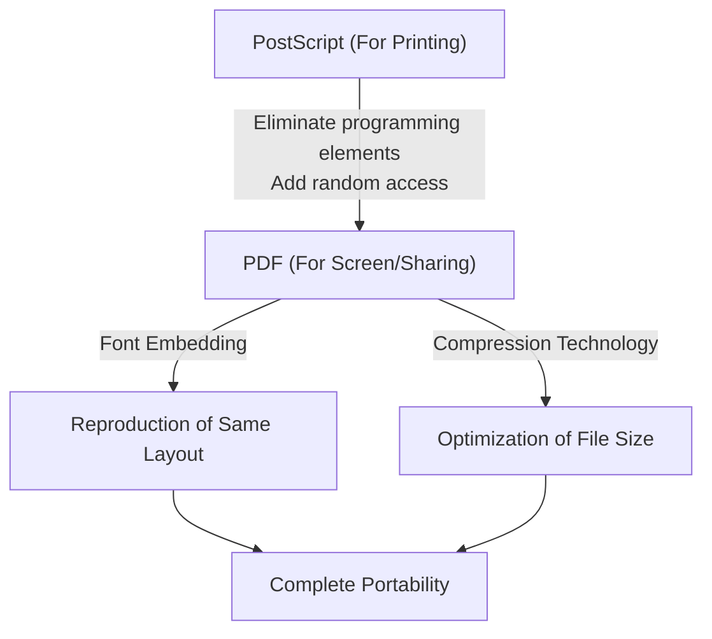

## Introduction: The Need for "Paper" in the Digital World

In modern business and daily life, not a day goes by without seeing a PDF (Portable Document Format). Everything from contracts, manuals, and invoices to academic papers and even restaurant menus is shared as PDFs. However, in the early days of computers, creating a "document that looks the same on any device" was a dream.

The computer environment in the 1980s was far more fragmented than it is today. Various operating systems like Windows, Macintosh, UNIX workstations, and MS-DOS coexisted, each with its own font formats, rendering engines, and file formats. It was an everyday occurrence that a beautifully laid out document created by Person A on a Mac would have its fonts replaced, layout broken, and images missing when opened by Person B on Windows.

It was the founders of Adobe Systems (now Adobe) who tried to solve this problem and create "paper in the digital world." In this article, we will delve deep into the history and technical background of how PDF was born, overcame technical barriers, and evolved into a globally standard document format with legal validity.

## The PostScript Revolution and the Dawn of DTP

When talking about the history of PDF, one cannot avoid the existence of the page description language called "PostScript."

In 1982, John Warnock and Charles Geschke, working at Xerox's Palo Alto Research Center (PARC), were developing a programming language for high-quality, device-independent printing. However, seeing no immediate prospect of the technology being commercialized within Xerox, they left to found Adobe Systems. What they completed was PostScript.

### The Concept of Device Independence

Printers at the time received text data and simple control codes from a computer, and printed using bitmap fonts built into the printer's hardware. Therefore, changing the printer model changed the print result, making it difficult to print complex shapes and smooth curves.

PostScript took a completely different approach. It described the appearance of a document as "mathematical vector data." Elements such as text, straight lines, curves, and images are sent to the printer as a collection of formulas and commands. The printer contains a small built-in computer called a "PostScript interpreter," which interprets (rasterizes) the received program on the spot and prints it at its highest resolution.

As a result, documents created at rough resolutions on screen could be output extremely beautifully on high-resolution laser printers and commercial printing presses. In 1985, Apple's "LaserWriter" was equipped with PostScript, and the combination of "Macintosh," "PageMaker," and "LaserWriter" gave birth to a new industry called Desktop Publishing (DTP).

## The Camelot Project: The Same Experience on Screen

While PostScript revolutionized the printing industry, it had one weakness. It was "too heavy to display quickly on screen because it is a very complex programming language." PostScript files can contain loops and conditional branches, and you don't know what the final page will look like until the calculation is finished.

In the early 1990s, with the spread of the Internet just around the corner, John Warnock wrote a short internal paper titled "The Camelot Project."

> "Our goal is to be able to capture any document from any platform in digital form, transfer it to any computer, display it on any screen, and print it on any printer."

What Warnock envisioned was a document format that could be shared while perfectly preserving the appearance intended by the creator, completely unaffected by differences in operating systems, applications, or locally installed fonts.

### The Birth of PDF

PDF was born from the Camelot Project. While based on PostScript technology, PDF stripped away elements as a programming language (such as loops and variable states) in order to achieve high-speed on-screen rendering and random access (the ability to instantly jump to any page).

Instead, PDF was structured as a collection of independent drawing objects for each page. Because of this, even for a 1,000-page document, the system does not need to calculate from the first page in order, and can instantly display the 500th page.

In 1993, Adobe released "Acrobat," software for creating and viewing PDF files. Initially, widespread adoption was delayed because even the viewing software, "Acrobat Reader," was paid ($50). However, Adobe soon made the strategic decision to distribute Reader for free. This proved successful, and PDF began to spread explosively.

## The Basic Structure of PDF and Technical Breakthroughs

For PDF to function as "electronic paper," several important technical breakthroughs were necessary.

### 1. Font Embedding

One of the most important technologies is "font embedding." In conventional word processor files (such as early Word documents), only the "character codes" and "font name (e.g., MS Gothic)" were saved in the document data. If that font was not installed on the viewer's PC, the OS would substitute another font, changing character widths, shifting line break positions, and destroying the layout.

PDF has the ability to package the shape data (outlines) of the fonts used directly within the file. This allows beautiful text to be displayed exactly as it was created, even if the font does not exist at all on the viewer's device. Furthermore, to keep the file size down, a technology called "subset embedding" was developed, which extracts and embeds only the data for the characters actually used in the document.

### 2. Integration of Vector Graphics and Raster Images

PDF inherits a powerful vector graphics drawing engine from PostScript. Because it retains corporate logos, graphs, etc. as vector data, the edges never become pixelated (jagged) no matter how much they are magnified. At the same time, raster images like photos (JPEG or ZIP compressed pixel data) can also be flexibly embedded.

### 3. Internal Structure of the File (Trees and Cross-References)

If you look inside a PDF file with a text editor, it starts with a header like `%PDF-1.4`, followed by a large number of "objects (dictionaries, arrays, streams, etc.)."
The brilliance of PDF is that it has a "Cross-Reference Table" at the end of the file. This table records the byte offset positions of all objects within the file.

When a PDF reader opens a file, it first reads from the end to acquire the cross-reference table. Therefore, when data for a specific page is needed, it can refer to the table and accurately read the necessary data from the disk without parsing the entire file. This is why even massive PDF files operate at high speed.

## Evolution as Digital Documents: Electronic Signatures and Security

PDF has evolved not just to "view printed materials on a screen," but to function as "originals" in business settings.

### Digital Signatures and Public Key Cryptography

The biggest concerns when digitizing contracts and official documents are "proving that they have not been tampered with" and "proving that they were created by the person themselves." PDF incorporated electronic signature specifications using Public Key Infrastructure (PKI) at the format level.

By calculating the hash value of the document, encrypting it with the signer's private key, and embedding it in the PDF, it realized a mechanism where the signature becomes invalid if even one byte of the content is later modified. As a result, PDF has gained legal evidentiary capacity equivalent to or greater than stamping a seal on paper.

### Security and Access Control

PDF also implements powerful encryption features (such as AES-256). Not only an "open password" to open the document, but fine-grained permission settings (permission passwords) such as prohibiting printing, prohibiting text copying, and prohibiting page extraction can be applied to the file itself.

## The Road to a Global Standard (ISO 32000)

For many years, PDF was a proprietary format of Adobe Systems. However, Adobe published the specifications for free, allowing anyone to develop PDF creation and viewing software. This created a massive third-party ecosystem.

Then in 2008, Adobe relinquished complete control of PDF and handed it over to the International Organization for Standardization (ISO). As a result, PDF became an official international standard as "ISO 32000-1." Becoming an open format independent of any specific company solidified its position as the official document preservation format for governments worldwide.

Furthermore, derivative standards for specific uses have also been born:
- **PDF/A (Archive):** For long-term preservation. It prohibits external fonts and encryption, ensuring that it can be reliably opened even decades later.
- **PDF/X (Exchange):** For the printing industry. It strictly defines color profiles (CMYK) to prevent printing troubles.
- **PDF/UA (Universal Accessibility):** Defines the logical structure (tags) of the document so that screen readers for the visually impaired can read it correctly.

## Conclusion

The vision John Warnock dreamed of in the "Camelot Project"—being able to share documents exactly as intended, anywhere in the world, with anyone, on any device—has become completely real in modern society.

A PDF is not just "imaged paper." It is a highly sophisticated piece of "digital paper" that allows for text searching, possesses the beauty of vectors, is protected by encryption technology, and has logical structure. Starting from a programming language called PostScript, stripping away complexity to gain portability, and finally reaching an international standard for preserving human knowledge, the history of PDF can be said to be one of the greatest success stories in the history of computer software.
